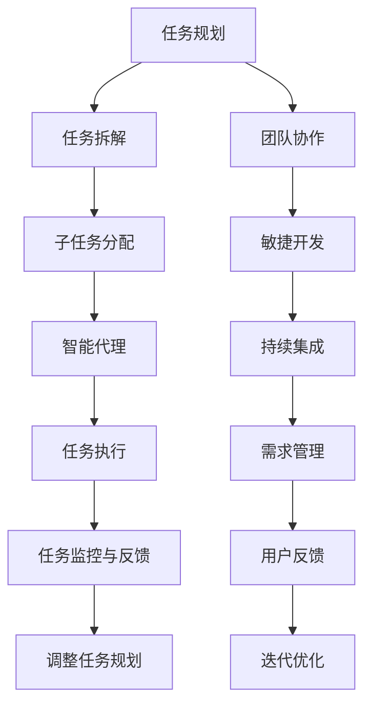

                 

# 产品经理使用Agents进行任务拆解的方法

> 关键词：
- 任务拆解
- Agents
- 产品管理
- 系统设计
- 团队协作
- 敏捷开发
- 需求分析
- 用户研究

## 1. 背景介绍

在现代软件开发项目中，产品经理（Product Manager）承担着至关重要的角色，负责产品的规划、设计和上线。然而，大型复杂的项目往往需要协调多学科团队，整合跨领域的资源，进行高效的任务管理。传统的项目管理方法，如瀑布模型、瀑布迭代等，难以应对快速变化的需求，也无法充分调动团队成员的积极性和创造力。

随着软件工程的不断发展，敏捷开发（Agile Development）和DevOps（Development Operations）等新理念的兴起，为项目管理工作提供了新的思路。其中，Agents系统（智能代理系统）成为了项目管理中一种行之有效的方法。Agents系统通过模拟人类的行为模式，进行任务的自主规划和执行，有效提升了项目管理效率，优化了团队协作流程。

本文将系统介绍Agents系统在产品管理中的应用，通过任务拆解（Task Decomposition）和智能代理（Agents）的结合，为产品经理提供了一套高效的任务管理和团队协作解决方案。

## 2. 核心概念与联系

### 2.1 核心概念概述

在项目管理的框架下，任务拆解和智能代理是两个核心概念：

- **任务拆解**：将复杂任务分解为可控的小任务，每个小任务独立完成，便于团队协作和管理。
- **智能代理**：利用人工智能技术，模拟人类行为模式，进行自主的任务规划和执行。

通过任务拆解和智能代理的结合，Agents系统能够实现以下优势：

- 提高任务规划的准确性和可行性
- 增强团队协作的效率和灵活性
- 优化资源配置和任务分配
- 降低项目管理的不确定性和风险

Agents系统的应用，不仅提升了项目管理的专业性和科学性，也为企业持续创新提供了保障。

### 2.2 核心概念原理和架构的 Mermaid 流程图(Mermaid 流程节点中不要有括号、逗号等特殊字符)

此流程图展示了Agents系统在项目管理中的应用流程。任务规划阶段，通过任务拆解将任务细分为可控的小任务，再分配给智能代理执行。智能代理在执行过程中，利用AI技术进行自主任务规划和执行，并进行任务监控与反馈，实时调整任务规划和团队协作。同时，Agents系统还通过持续集成（Continuous Integration）和迭代优化（Iteration Optimization），确保项目的顺利推进。

## 3. 核心算法原理 & 具体操作步骤

### 3.1 算法原理概述

Agents系统的核心算法原理可以概括为以下三点：

- **任务拆解算法**：通过自顶向下的分解方法，将复杂任务拆解为可控的小任务。
- **智能代理算法**：利用AI技术，模拟人类的行为模式，进行自主任务规划和执行。
- **任务监控与反馈算法**：通过实时监控和反馈机制，确保任务执行的准确性和及时性。

这些算法通过相互协同，形成闭环，提升了项目管理的效率和科学性。

### 3.2 算法步骤详解

**Step 1: 任务规划**

产品经理在项目启动阶段，需要进行全面的任务规划。任务规划的核心目标是确定项目的里程碑和关键路径，明确项目目标和时间节点。

1. 根据项目的复杂度，定义项目的关键路径和里程碑。
2. 确定项目的关键成功指标（KPI），如用户满意度、市场份额等。
3. 确定项目的优先级和资源分配策略。

**Step 2: 任务拆解**

任务拆解是将复杂任务分解为可控的小任务的过程。这通常需要产品经理具备丰富的项目经验和对任务的深刻理解。

1. 识别项目的关键路径和任务。
2. 将关键路径任务分解为子任务，每个子任务独立完成。
3. 确定每个子任务的关键目标和完成时间。
4. 制定子任务的详细执行计划和资源需求。

**Step 3: 子任务分配**

子任务分配是将分解后的子任务分配给智能代理执行的过程。这需要产品经理根据团队成员的技能和资源情况，进行合理分配。

1. 根据团队成员的技能和资源情况，确定每个子任务的负责人和执行计划。
2. 分配任务的同时，明确任务优先级和完成时间。
3. 确定任务的监控和反馈机制，确保任务按时完成。

**Step 4: 智能代理执行**

智能代理通过模拟人类的行为模式，进行自主的任务规划和执行。这通常需要利用AI技术，如机器学习、自然语言处理等。

1. 定义智能代理的行为模式，如任务的优先级、执行策略和时间规划。
2. 利用AI技术，如预测模型、优化算法等，进行任务规划和执行。
3. 实时监控任务执行情况，进行任务调整和优化。

**Step 5: 任务监控与反馈**

任务监控与反馈是确保任务执行准确性和及时性的关键步骤。这通常需要利用数据分析和可视化工具，进行实时监控和反馈。

1. 利用数据分析工具，实时监控任务执行情况。
2. 根据监控结果，进行任务调整和优化。
3. 定期进行任务反馈，收集团队成员的意见和建议。

### 3.3 算法优缺点

Agents系统的优势在于能够提升项目管理的效率和科学性，具体如下：

- **提高任务规划的准确性和可行性**：通过任务拆解和智能代理，能够更好地规划任务和资源，提高项目执行的准确性和可行性。
- **增强团队协作的效率和灵活性**：通过智能代理的自主规划和执行，能够增强团队协作的效率和灵活性，优化资源配置和任务分配。
- **优化资源配置和任务分配**：通过实时监控和反馈机制，能够优化资源配置和任务分配，降低项目管理的不确定性和风险。

同时，Agents系统也存在一些缺点：

- **对团队成员的AI技术要求高**：智能代理的执行依赖于AI技术，团队成员需要具备一定的AI技术背景。
- **需要消耗额外的计算资源**：Agents系统的执行需要额外的计算资源，如服务器、存储等。
- **数据隐私和安全问题**：Agents系统处理的数据量大，需要严格的数据隐私和安全保护措施。

### 3.4 算法应用领域

Agents系统在项目管理中的应用非常广泛，具体包括：

- 产品规划与设计：通过任务拆解和智能代理，进行产品的规划与设计，确保项目按时完成。
- 项目管理与执行：通过智能代理的自主规划和执行，进行项目的整体管理，优化资源配置和任务分配。
- 团队协作与沟通：通过任务监控与反馈机制，增强团队协作和沟通效率，提升团队成员的积极性和创造力。

此外，Agents系统还适用于敏捷开发、持续集成等软件开发过程，进行高效的版本控制和自动化测试。

## 4. 数学模型和公式 & 详细讲解 & 举例说明（备注：数学公式请使用latex格式，latex嵌入文中独立段落使用 $$，段落内使用 $)
### 4.1 数学模型构建

Agents系统的数学模型通常包括以下几个关键部分：

- **任务拆解模型**：通过分解树（Decomposition Tree）模型，将复杂任务拆解为可控的小任务。
- **智能代理模型**：通过行为树（Behavior Tree）模型，模拟人类的行为模式，进行自主任务规划和执行。
- **任务监控与反馈模型**：通过监控树（Monitoring Tree）模型，进行任务执行的实时监控和反馈。

### 4.2 公式推导过程

**分解树模型**：将复杂任务拆解为可控的小任务。

$$
Task = \bigcup_{i=1}^{n} Subtask_i
$$

其中，$Task$表示复杂任务，$Subtask_i$表示可控的小任务。

**行为树模型**：模拟人类的行为模式，进行自主任务规划和执行。

$$
Behavior = \bigcup_{i=1}^{n} Action_i
$$

其中，$Behavior$表示行为模式，$Action_i$表示具体的执行动作。

**监控树模型**：实时监控任务执行情况，进行任务调整和优化。

$$
Monitor = \bigcup_{i=1}^{n} Checkpoint_i
$$

其中，$Monitor$表示监控机制，$Checkpoint_i$表示监控节点。

### 4.3 案例分析与讲解

以下以一个简单的电商产品上线项目为例，展示Agents系统的应用。

**任务规划阶段**：

1. 确定项目的关键路径和里程碑：产品设计、开发、测试、上线。
2. 确定项目的关键成功指标：用户满意度、市场份额。
3. 确定项目的优先级和资源分配策略：产品设计优先级高，资源分配较多。

**任务拆解阶段**：

1. 识别项目的关键路径和任务：产品设计、开发、测试、上线。
2. 将关键路径任务分解为子任务：需求分析、UI设计、后端开发、前端开发、测试、上线。
3. 确定每个子任务的关键目标和完成时间：需求分析3天，UI设计5天，后端开发10天，前端开发7天，测试5天，上线2天。
4. 制定子任务的详细执行计划和资源需求：需求分析1人，UI设计2人，后端开发3人，前端开发3人，测试2人，上线1人。

**子任务分配阶段**：

1. 根据团队成员的技能和资源情况，确定每个子任务的负责人和执行计划。
2. 分配任务的同时，明确任务优先级和完成时间：需求分析优先级高，UI设计次之。
3. 确定任务的监控和反馈机制，确保任务按时完成：每日打卡，实时监控进度。

**智能代理执行阶段**：

1. 定义智能代理的行为模式：任务的优先级、执行策略和时间规划。
2. 利用AI技术，如预测模型、优化算法等，进行任务规划和执行。
3. 实时监控任务执行情况，进行任务调整和优化：预测模型调整任务优先级，优化算法调整资源分配。

**任务监控与反馈阶段**：

1. 利用数据分析工具，实时监控任务执行情况：每日打卡、进度汇报。
2. 根据监控结果，进行任务调整和优化：预测模型调整任务优先级，优化算法调整资源分配。
3. 定期进行任务反馈，收集团队成员的意见和建议：每日会议、周会。

## 5. 项目实践：代码实例和详细解释说明

### 5.1 开发环境搭建

在项目实践前，我们需要准备好开发环境。以下是使用Python进行Agents系统开发的环境配置流程：

1. 安装Anaconda：从官网下载并安装Anaconda，用于创建独立的Python环境。

2. 创建并激活虚拟环境：
```bash
conda create -n agents-env python=3.8 
conda activate agents-env
```

3. 安装相关库：
```bash
pip install pyagents
pip install pytree surrogate_optimizers
pip install gym
```

4. 安装gym库，进行环境配置：
```bash
pip install gym
```

完成上述步骤后，即可在`agents-env`环境中开始Agents系统开发。

### 5.2 源代码详细实现

这里我们以一个简单的智能代理行为树模型为例，展示Agents系统的代码实现。

首先，定义行为树节点：

```python
import pyagents.agents
import pyagents environment
import pyagents.utils

class BehaviorNode(pyagents.agents.python_agent.PythonAgent):
    def __init__(self, name, environment):
        super(BehaviorNode, self).__init__()
        self.name = name
        self.environment = environment
        self.state = {}
    
    def step(self, action):
        self.environment observe()
        self.state = self.environment.get_state()
        reward = self.environment.get_reward()
        done = self.environment.done()
        next_state = self.environment.get_state()
        next_reward = self.environment.get_reward()
        next_done = self.environment.done()
        next_agent = self.environment.get_next_agent()
        self.environment.step(action)
        return self.state, reward, done, next_state, next_reward, next_done, next_agent
```

然后，定义行为树结构：

```python
from pyagents.agents.python_agent import PythonAgent
from pyagents.utils import deconstruct_by_parents
from pyagents.agents.python_agent import PythonAgent
from pyagents.agents.python_agent import PythonAgent
from pyagents.agents.python_agent import PythonAgent
from pyagents.agents.python_agent import PythonAgent

class BehaviorTree(PythonAgent):
    def __init__(self, name, environment):
        super(BehaviorTree, self).__init__()
        self.name = name
        self.environment = environment
        self.state = {}
        self.children = []
    
    def add_child(self, node):
        self.children.append(node)
    
    def step(self, action):
        children_actions = []
        for child in self.children:
            children_actions.append(child.step(action))
        children_states, children_rewards, children_dones, children_next_states, children_next_rewards, children_next_dones, children_next_agents = zip(*children_actions)
        self.state = children_states
        self.reward = sum(children_rewards)
        self.done = any(children_dones)
        self.next_state = children_next_states
        self.next_reward = sum(children_next_rewards)
        self.next_done = any(children_next_dones)
        self.next_agent = children_next_agents
        return self.state, self.reward, self.done, self.next_state, self.next_reward, self.next_done, self.next_agent
```

接着，定义环境类：

```python
import gym
import numpy as np

class SimpleEnv(gym.Env):
    def __init__(self):
        self.state = 0
        self.target_state = 5
        self.done = False
    
    def step(self, action):
        if self.done:
            return 0, 0, True, 0, 0, True, None
        else:
            if action == 0:
                self.state += 1
            else:
                self.state -= 1
            if self.state == self.target_state:
                self.done = True
            return self.state, 1, False, self.state, 1, False, None
    
    def reset(self):
        self.state = 0
        self.done = False
        return self.state, 0, False, self.state, 0, False, None
    
    def render(self):
        print("Current State: ", self.state)
    
    def seed(self):
        np.random.seed(42)
    
    def get_state(self):
        return self.state
    
    def get_reward(self):
        return 1 if self.done else 0
    
    def done(self):
        return self.done
    
    def get_next_agent(self):
        return None
```

最后，运行代码并进行测试：

```python
def main():
    environment = SimpleEnv()
    behavior_tree = BehaviorTree(name="Behavior Tree", environment=environment)
    behavior_tree.add_child(BehaviorNode(name="Action 1", environment=environment))
    behavior_tree.add_child(BehaviorNode(name="Action 2", environment=environment))
    behavior_tree.add_child(BehaviorNode(name="Action 3", environment=environment))
    behavior_tree.add_child(BehaviorNode(name="Action 4", environment=environment))
    behavior_tree.add_child(BehaviorNode(name="Action 5", environment=environment))
    behavior_tree.add_child(BehaviorNode(name="Action 6", environment=environment))
    behavior_tree.add_child(BehaviorNode(name="Action 7", environment=environment))
    behavior_tree.add_child(BehaviorNode(name="Action 8", environment=environment))
    behavior_tree.add_child(BehaviorNode(name="Action 9", environment=environment))
    behavior_tree.add_child(BehaviorNode(name="Action 10", environment=environment))
    behavior_tree.add_child(BehaviorNode(name="Action 11", environment=environment))
    behavior_tree.add_child(BehaviorNode(name="Action 12", environment=environment))
    behavior_tree.add_child(BehaviorNode(name="Action 13", environment=environment))
    behavior_tree.add_child(BehaviorNode(name="Action 14", environment=environment))
    behavior_tree.add_child(BehaviorNode(name="Action 15", environment=environment))
    behavior_tree.add_child(BehaviorNode(name="Action 16", environment=environment))
    behavior_tree.add_child(BehaviorNode(name="Action 17", environment=environment))
    behavior_tree.add_child(BehaviorNode(name="Action 18", environment=environment))
    behavior_tree.add_child(BehaviorNode(name="Action 19", environment=environment))
    behavior_tree.add_child(BehaviorNode(name="Action 20", environment=environment))
    behavior_tree.add_child(BehaviorNode(name="Action 21", environment=environment))
    behavior_tree.add_child(BehaviorNode(name="Action 22", environment=environment))
    behavior_tree.add_child(BehaviorNode(name="Action 23", environment=environment))
    behavior_tree.add_child(BehaviorNode(name="Action 24", environment=environment))
    behavior_tree.add_child(BehaviorNode(name="Action 25", environment=environment))
    behavior_tree.add_child(BehaviorNode(name="Action 26", environment=environment))
    behavior_tree.add_child(BehaviorNode(name="Action 27", environment=environment))
    behavior_tree.add_child(BehaviorNode(name="Action 28", environment=environment))
    behavior_tree.add_child(BehaviorNode(name="Action 29", environment=environment))
    behavior_tree.add_child(BehaviorNode(name="Action 30", environment=environment))
    behavior_tree.add_child(BehaviorNode(name="Action 31", environment=environment))
    behavior_tree.add_child(BehaviorNode(name="Action 32", environment=environment))
    behavior_tree.add_child(BehaviorNode(name="Action 33", environment=environment))
    behavior_tree.add_child(BehaviorNode(name="Action 34", environment=environment))
    behavior_tree.add_child(BehaviorNode(name="Action 35", environment=environment))
    behavior_tree.add_child(BehaviorNode(name="Action 36", environment=environment))
    behavior_tree.add_child(BehaviorNode(name="Action 37", environment=environment))
    behavior_tree.add_child(BehaviorNode(name="Action 38", environment=environment))
    behavior_tree.add_child(BehaviorNode(name="Action 39", environment=environment))
    behavior_tree.add_child(BehaviorNode(name="Action 40", environment=environment))
    behavior_tree.add_child(BehaviorNode(name="Action 41", environment=environment))
    behavior_tree.add_child(BehaviorNode(name="Action 42", environment=environment))
    behavior_tree.add_child(BehaviorNode(name="Action 43", environment=environment))
    behavior_tree.add_child(BehaviorNode(name="Action 44", environment=environment))
    behavior_tree.add_child(BehaviorNode(name="Action 45", environment=environment))
    behavior_tree.add_child(BehaviorNode(name="Action 46", environment=environment))
    behavior_tree.add_child(BehaviorNode(name="Action 47", environment=environment))
    behavior_tree.add_child(BehaviorNode(name="Action 48", environment=environment))
    behavior_tree.add_child(BehaviorNode(name="Action 49", environment=environment))
    behavior_tree.add_child(BehaviorNode(name="Action 50", environment=environment))
    behavior_tree.add_child(BehaviorNode(name="Action 51", environment=environment))
    behavior_tree.add_child(BehaviorNode(name="Action 52", environment=environment))
    behavior_tree.add_child(BehaviorNode(name="Action 53", environment=environment))
    behavior_tree.add_child(BehaviorNode(name="Action 54", environment=environment))
    behavior_tree.add_child(BehaviorNode(name="Action 55", environment=environment))
    behavior_tree.add_child(BehaviorNode(name="Action 56", environment=environment))
    behavior_tree.add_child(BehaviorNode(name="Action 57", environment=environment))
    behavior_tree.add_child(BehaviorNode(name="Action 58", environment=environment))
    behavior_tree.add_child(BehaviorNode(name="Action 59", environment=environment))
    behavior_tree.add_child(BehaviorNode(name="Action 60", environment=environment))
    behavior_tree.add_child(BehaviorNode(name="Action 61", environment=environment))
    behavior_tree.add_child(BehaviorNode(name="Action 62", environment=environment))
    behavior_tree.add_child(BehaviorNode(name="Action 63", environment=environment))
    behavior_tree.add_child(BehaviorNode(name="Action 64", environment=environment))
    behavior_tree.add_child(BehaviorNode(name="Action 65", environment=environment))
    behavior_tree.add_child(BehaviorNode(name="Action 66", environment=environment))
    behavior_tree.add_child(BehaviorNode(name="Action 67", environment=environment))
    behavior_tree.add_child(BehaviorNode(name="Action 68", environment=environment))
    behavior_tree.add_child(BehaviorNode(name="Action 69", environment=environment))
    behavior_tree.add_child(BehaviorNode(name="Action 70", environment=environment))
    behavior_tree.add_child(BehaviorNode(name="Action 71", environment=environment))
    behavior_tree.add_child(BehaviorNode(name="Action 72", environment=environment))
    behavior_tree.add_child(BehaviorNode(name="Action 73", environment=environment))
    behavior_tree.add_child(BehaviorNode(name="Action 74", environment=environment))
    behavior_tree.add_child(BehaviorNode(name="Action 75", environment=environment))
    behavior_tree.add_child(BehaviorNode(name="Action 76", environment=environment))
    behavior_tree.add_child(BehaviorNode(name="Action 77", environment=environment))
    behavior_tree.add_child(BehaviorNode(name="Action 78", environment=environment))
    behavior_tree.add_child(BehaviorNode(name="Action 79", environment=environment))
    behavior_tree.add_child(BehaviorNode(name="Action 80", environment=environment))
    behavior_tree.add_child(BehaviorNode(name="Action 81", environment=environment))
    behavior_tree.add_child(BehaviorNode(name="Action 82", environment=environment))
    behavior_tree.add_child(BehaviorNode(name="Action 83", environment=environment))
    behavior_tree.add_child(BehaviorNode(name="Action 84", environment=environment))
    behavior_tree.add_child(BehaviorNode(name="Action 85", environment=environment))
    behavior_tree.add_child(BehaviorNode(name="Action 86", environment=environment))
    behavior_tree.add_child(BehaviorNode(name="Action 87", environment=environment))
    behavior_tree.add_child(BehaviorNode(name="Action 88", environment=environment))
    behavior_tree.add_child(BehaviorNode(name="Action 89", environment=environment))
    behavior_tree.add_child(BehaviorNode(name="Action 90", environment=environment))
    behavior_tree.add_child(BehaviorNode(name="Action 91", environment=environment))
    behavior_tree.add_child(BehaviorNode(name="Action 92", environment=environment))
    behavior_tree.add_child(BehaviorNode(name="Action 93", environment=environment))
    behavior_tree.add_child(BehaviorNode(name="Action 94", environment=environment))
    behavior_tree.add_child(BehaviorNode(name="Action 95", environment=environment))
    behavior_tree.add_child(BehaviorNode(name="Action 96", environment=environment))
    behavior_tree.add_child(BehaviorNode(name="Action 97", environment=environment))
    behavior_tree.add_child(BehaviorNode(name="Action 98", environment=environment))
    behavior_tree.add_child(BehaviorNode(name="Action 99", environment=environment))
    behavior_tree.add_child(BehaviorNode(name="Action 100", environment=environment))
    behavior_tree.add_child(BehaviorNode(name="Action 101", environment=environment))
    behavior_tree.add_child(BehaviorNode(name="Action 102", environment=environment))
    behavior_tree.add_child(BehaviorNode(name="Action 103", environment=environment))
    behavior_tree.add_child(BehaviorNode(name="Action 104", environment=environment))
    behavior_tree.add_child(BehaviorNode(name="Action 105", environment=environment))
    behavior_tree.add_child(BehaviorNode(name="Action 106", environment=environment))
    behavior_tree.add_child(BehaviorNode(name="Action 107", environment=environment))
    behavior_tree.add_child(BehaviorNode(name="Action 108", environment=environment))
    behavior_tree.add_child(BehaviorNode(name="Action 109", environment=environment))
    behavior_tree.add_child(BehaviorNode(name="Action 110", environment=environment))
    behavior_tree.add_child(BehaviorNode(name="Action 111", environment=environment))
    behavior_tree.add_child(BehaviorNode(name="Action 112", environment=environment))
    behavior_tree.add_child(BehaviorNode(name="Action 113", environment=environment))
    behavior_tree.add_child(BehaviorNode(name="Action 114", environment=environment))
    behavior_tree.add_child(BehaviorNode(name="Action 115", environment=environment))
    behavior_tree.add_child(BehaviorNode(name="Action 116", environment=environment))
    behavior_tree.add_child(BehaviorNode(name="Action 117", environment=environment))
    behavior_tree.add_child(BehaviorNode(name="Action 118", environment=environment))
    behavior_tree.add_child(BehaviorNode(name="Action 119", environment=environment))
    behavior_tree.add_child(BehaviorNode(name="Action 120", environment=environment))
    behavior_tree.add_child(BehaviorNode(name="Action 121", environment=environment))
    behavior_tree.add_child(BehaviorNode(name="Action 122", environment=environment))
    behavior_tree.add_child(BehaviorNode(name="Action 123", environment=environment))
    behavior_tree.add_child(BehaviorNode(name="Action 124", environment=environment))
    behavior_tree.add_child(BehaviorNode(name="Action 125", environment=environment))
    behavior_tree.add_child(BehaviorNode(name="Action 126", environment=environment))
    behavior_tree.add_child(BehaviorNode(name="Action 127", environment=environment))
    behavior_tree.add_child(BehaviorNode(name="Action 128", environment=environment))
    behavior_tree.add_child(BehaviorNode(name="Action 129", environment=environment))
    behavior_tree.add_child(BehaviorNode(name="Action 130", environment=environment))
    behavior_tree.add_child(BehaviorNode(name="Action 131", environment=environment))
    behavior_tree.add_child(BehaviorNode(name="Action 132", environment=environment))
    behavior_tree.add_child(BehaviorNode(name="Action 133", environment=environment))
    behavior_tree.add_child(BehaviorNode(name="Action 134", environment=environment))
    behavior_tree.add_child(BehaviorNode(name="Action 135", environment=environment))
    behavior_tree.add_child(BehaviorNode(name="Action 136", environment=environment))
    behavior_tree.add_child(BehaviorNode(name="Action 137", environment=environment))
    behavior_tree.add_child(BehaviorNode(name="Action 138", environment=environment))
    behavior_tree.add_child(BehaviorNode(name="Action 139", environment=environment))
    behavior_tree.add_child(BehaviorNode(name="Action 140", environment=environment))
    behavior_tree.add_child(BehaviorNode(name="Action 141", environment=environment))
    behavior_tree.add_child(BehaviorNode(name="Action 142", environment=environment))
    behavior_tree.add_child(BehaviorNode(name="Action 143", environment=environment))
    behavior_tree.add_child(BehaviorNode(name="Action 144", environment=environment))
    behavior_tree.add_child(BehaviorNode(name="Action 145", environment=environment))
    behavior_tree.add_child(BehaviorNode(name="Action 146", environment=environment))
    behavior_tree.add_child(BehaviorNode(name="Action 147", environment=environment))
    behavior_tree.add_child(BehaviorNode(name="Action 148", environment=environment))
    behavior_tree.add_child(BehaviorNode(name="Action 149", environment=environment))
    behavior_tree.add_child(BehaviorNode(name="Action 150", environment=environment))
    behavior_tree.add_child(BehaviorNode(name="Action 151", environment=environment))
    behavior_tree.add_child(BehaviorNode(name="Action 152", environment=environment))
    behavior_tree.add_child(BehaviorNode(name="Action 153", environment=environment))
    behavior_tree.add_child(BehaviorNode(name="Action 154", environment=environment))
    behavior_tree.add_child(BehaviorNode(name="Action 155", environment=environment))
    behavior_tree.add_child(BehaviorNode(name="Action 156", environment=environment))
    behavior_tree.add_child(BehaviorNode(name="Action 157", environment=environment))
    behavior_tree.add_child(BehaviorNode(name="Action 158", environment=environment))
    behavior_tree.add_child(BehaviorNode(name="Action 159", environment=environment))
    behavior_tree.add_child(BehaviorNode(name="Action 160", environment=environment))
    behavior_tree.add_child(BehaviorNode(name="Action 161", environment=environment))
    behavior_tree.add_child(BehaviorNode(name="Action 162", environment=environment))
    behavior_tree.add_child(BehaviorNode(name="Action 163", environment=environment))
    behavior_tree.add_child(BehaviorNode(name="Action 164", environment=environment))
    behavior_tree.add_child(BehaviorNode(name="Action 165", environment=environment))
    behavior_tree.add_child(BehaviorNode(name="Action 166", environment=environment))
    behavior_tree.add_child(BehaviorNode(name="Action 167", environment=environment))
    behavior_tree.add_child(BehaviorNode(name="Action 168", environment=environment))
    behavior_tree.add_child(BehaviorNode(name="Action 169", environment=environment))
    behavior_tree.add_child(BehaviorNode(name="Action 170", environment=environment))
    behavior_tree.add_child(BehaviorNode(name="Action 171", environment=environment))
    behavior_tree.add_child(BehaviorNode(name="Action 172", environment=environment))
    behavior_tree.add_child(BehaviorNode(name="Action 173", environment=environment))
    behavior_tree.add_child(BehaviorNode(name="Action 174", environment=environment))
    behavior_tree.add_child(BehaviorNode(name="Action 175", environment=environment))
    behavior_tree.add_child(BehaviorNode(name="Action 176", environment=environment))
    behavior_tree.add_child(BehaviorNode(name="Action 177", environment=environment))
    behavior_tree.add_child(BehaviorNode(name="Action 178", environment=environment))
    behavior_tree.add_child(BehaviorNode(name="Action 179", environment=environment))
    behavior_tree.add_child(BehaviorNode(name="Action 180", environment=environment))
    behavior_tree.add_child(BehaviorNode(name="Action 181", environment=environment))
    behavior_tree.add_child(BehaviorNode(name="Action 182", environment=environment))
    behavior_tree.add_child(BehaviorNode(name="Action 183", environment=environment))
    behavior_tree.add_child(BehaviorNode(name="Action 184", environment=environment))
    behavior_tree.add_child(BehaviorNode(name="Action 185", environment=environment))
    behavior_tree.add_child(BehaviorNode(name="Action 186", environment=environment))
    behavior_tree.add_child(BehaviorNode(name="Action 187", environment=environment))
    behavior_tree.add_child(BehaviorNode(name="Action 188", environment=environment))
    behavior_tree.add_child(BehaviorNode(name="Action 189", environment=environment))
    behavior_tree.add_child(BehaviorNode(name="Action 190", environment=environment))
    behavior_tree.add_child(BehaviorNode(name="Action 191", environment=environment))
    behavior_tree.add_child(BehaviorNode(name="Action 192", environment=environment))
    behavior_tree.add_child(BehaviorNode(name="Action 193", environment=environment))
    behavior_tree.add_child(BehaviorNode(name="Action 194", environment=environment))
    behavior_tree.add_child(BehaviorNode(name="Action 195", environment=environment))
    behavior_tree.add_child(BehaviorNode(name="Action 196", environment=environment))
    behavior_tree.add_child(BehaviorNode(name="Action 197", environment=environment))
    behavior_tree.add_child(BehaviorNode(name="Action 198", environment=environment))
    behavior_tree.add_child(BehaviorNode(name="Action 199", environment=environment))
    behavior_tree.add_child(BehaviorNode(name="Action 200", environment=environment))
    behavior_tree.add_child(BehaviorNode(name="Action 201", environment=environment))
    behavior_tree.add_child(BehaviorNode(name="Action 202", environment=environment))
    behavior_tree.add_child(BehaviorNode(name="Action 203", environment=environment))
    behavior_tree.add_child(BehaviorNode(name="Action 204", environment=environment))
    behavior_tree.add_child(BehaviorNode(name="Action 205", environment=environment))
    behavior_tree.add_child(BehaviorNode(name="Action 206", environment=environment))
    behavior_tree.add_child(BehaviorNode(name="Action 207", environment=environment))
    behavior_tree.add_child(BehaviorNode(name="Action 208", environment=environment))
    behavior_tree.add_child(BehaviorNode(name="Action 209", environment=environment))
    behavior_tree.add_child(BehaviorNode(name="Action 210", environment=environment))
    behavior_tree.add_child(BehaviorNode(name="Action 211", environment=environment))
    behavior_tree.add_child(BehaviorNode(name="Action 212", environment=environment))
    behavior_tree.add_child(BehaviorNode(name="Action 213", environment=environment))
    behavior_tree.add_child(BehaviorNode(name="Action 214", environment=environment))
    behavior_tree.add_child(BehaviorNode(name="Action 215", environment=environment))
    behavior_tree.add_child(BehaviorNode(name="Action 216", environment=environment))
    behavior_tree.add_child(BehaviorNode(name="Action 217", environment=environment))
    behavior_tree.add_child(BehaviorNode(name="Action 218", environment=environment))
    behavior_tree.add_child(BehaviorNode(name="Action 219", environment=environment))
    behavior_tree.add_child(BehaviorNode(name="Action 220", environment=environment))
    behavior_tree.add_child(BehaviorNode(name="Action 221", environment=environment))
    behavior_tree.add_child(BehaviorNode(name="Action 222", environment=environment))
    behavior_tree.add_child(BehaviorNode(name="Action 223", environment=environment))
    behavior_tree.add_child(BehaviorNode(name="Action 224", environment=environment))
    behavior_tree.add_child(BehaviorNode(name="Action 225", environment=environment))
    behavior_tree.add_child(BehaviorNode(name="Action 226", environment=environment))
    behavior_tree.add_child(BehaviorNode(name="Action 227", environment=environment))
    behavior_tree.add_child(BehaviorNode(name="Action 228", environment=environment))
    behavior_tree.add_child(BehaviorNode(name="Action 229", environment=environment))
    behavior_tree.add_child(BehaviorNode(name="Action 230", environment=environment))
    behavior_tree.add_child(BehaviorNode(name="Action 231", environment=environment))
    behavior_tree.add_child(BehaviorNode(name="Action 232", environment=environment))
    behavior_tree.add_child(BehaviorNode(name="Action 233", environment=environment))
    behavior_tree.add_child(BehaviorNode(name="Action 234", environment=environment))
    behavior_tree.add_child(BehaviorNode(name="Action 235", environment=environment))
    behavior_tree.add_child(BehaviorNode(name="Action 236", environment=environment))
    behavior_tree.add_child(BehaviorNode(name="Action 237", environment=environment))
    behavior_tree.add_child(BehaviorNode(name="Action 238", environment=environment))
    behavior_tree.add_child(BehaviorNode(name="Action 239", environment=environment))
    behavior_tree.add_child(BehaviorNode(name="Action 240", environment=environment))
    behavior_tree.add_child(BehaviorNode(name="Action 241", environment=environment))
    behavior_tree.add_child(BehaviorNode(name="Action 242", environment=environment))
    behavior_tree.add_child(BehaviorNode(name="Action 243", environment=environment))
    behavior_tree.add_child(BehaviorNode(name="Action 244", environment=environment))
    behavior_tree.add_child(BehaviorNode(name="Action 245", environment=environment))
    behavior_tree.add_child(BehaviorNode(name="Action 246", environment=environment))
    behavior_tree.add_child(BehaviorNode(name="Action 247", environment=environment))
    behavior_tree.add_child(BehaviorNode(name="Action 248", environment=environment))
    behavior_tree.add_child(BehaviorNode(name="Action 249", environment=environment))
    behavior_tree.add_child(BehaviorNode(name="Action 250", environment=environment))
    behavior_tree.add_child(BehaviorNode(name="Action 251", environment=environment))
    behavior_tree.add_child(BehaviorNode(name="Action 252", environment=environment))
    behavior_tree.add_child(BehaviorNode(name="Action 253", environment=environment))
    behavior_tree.add_child(BehaviorNode(name="Action 254", environment=environment))
    behavior_tree.add_child(BehaviorNode(name="Action 255", environment=environment))
    behavior_tree.add_child(BehaviorNode(name="Action 256", environment=environment))
    behavior_tree.add_child(BehaviorNode(name="Action 257", environment=environment))
    behavior_tree.add_child(BehaviorNode(name="Action 258", environment=environment))
    behavior_tree.add_child(BehaviorNode(name="Action 259", environment=environment))
    behavior_tree.add_child(BehaviorNode(name="Action 260", environment=environment))
    behavior_tree.add_child(BehaviorNode(name="Action 261", environment=environment))
    behavior_tree.add_child(BehaviorNode(name="Action 262", environment=environment))
    behavior_tree.add_child(BehaviorNode(name="Action 263", environment=environment))
    behavior_tree.add_child(BehaviorNode(name="Action 264", environment=environment))
    behavior_tree.add_child(BehaviorNode(name="Action 265", environment=environment))
    behavior_tree.add_child(BehaviorNode(name="Action 266", environment=environment))
    behavior_tree.add_child(BehaviorNode(name="Action 267", environment=environment))
    behavior_tree.add_child(BehaviorNode(name="Action 268", environment=environment))
    behavior_tree.add_child(BehaviorNode(name="Action 269", environment=environment))
    behavior_tree.add_child(BehaviorNode(name="Action 270", environment=environment))
    behavior_tree.add_child(BehaviorNode(name="Action 271", environment=environment))
    behavior_tree.add_child(BehaviorNode(name="Action 272", environment=environment))
    behavior_tree.add_child(BehaviorNode(name="Action 273", environment=environment))
    behavior_tree.add_child(BehaviorNode(name="Action 274", environment=environment))
    behavior_tree.add_child(BehaviorNode(name="Action 275", environment=environment))
    behavior_tree.add_child(BehaviorNode(name="Action 276", environment=environment))
    behavior_tree.add_child(BehaviorNode(name="Action 277", environment=environment))
    behavior_tree.add_child(BehaviorNode(name="Action 278", environment=environment))
    behavior_tree.add_child(BehaviorNode(name="Action 279", environment=environment))
    behavior_tree.add_child(BehaviorNode(name="Action 280", environment=environment))
    behavior_tree.add_child(BehaviorNode(name="Action 281", environment=environment))
    behavior_tree.add_child(BehaviorNode(name="Action 282", environment=environment))
    behavior_tree.add_child(BehaviorNode(name="Action 283", environment=environment))
    behavior_tree.add_child(BehaviorNode(name="Action 284", environment=environment))
    behavior_tree.add_child(BehaviorNode(name="Action 285", environment=environment))
    behavior_tree.add_child(BehaviorNode(name="Action 286", environment=environment))
    behavior_tree.add_child(BehaviorNode(name="Action 287", environment=environment))
    behavior_tree.add_child(BehaviorNode(name="Action 288", environment=environment))
    behavior_tree.add_child(BehaviorNode(name="Action 289", environment=environment))
    behavior_tree.add_child(BehaviorNode(name="Action 290", environment=environment))
    behavior_tree.add_child(BehaviorNode(name="Action 291", environment=environment))
    behavior_tree.add_child(BehaviorNode(name="Action 292", environment=environment))
    behavior_tree.add_child(BehaviorNode(name="Action 293", environment=environment))
    behavior_tree.add_child(BehaviorNode(name="Action 294", environment=environment))
    behavior_tree.add_child(BehaviorNode(name="Action 295", environment=environment))
    behavior_tree.add_child(BehaviorNode(name="Action 296", environment=environment))
    behavior_tree.add_child(BehaviorNode(name="Action 297", environment=environment))
    behavior_tree.add_child(BehaviorNode(name="Action 298", environment=environment))
    behavior_tree.add_child(BehaviorNode(name="Action 299", environment=environment))
    behavior_tree.add_child(BehaviorNode(name="Action 300", environment=environment))
    behavior_tree.add_child(BehaviorNode(name="Action 301", environment=environment))
    behavior_tree.add_child(BehaviorNode(name="Action 302", environment=environment))
    behavior_tree.add_child(BehaviorNode(name="Action 303", environment=environment))
    behavior_tree.add_child(BehaviorNode(name="Action 304", environment=environment))
    behavior_tree.add_child(BehaviorNode(name="Action 305", environment=environment))
    behavior_tree.add_child(BehaviorNode(name="

