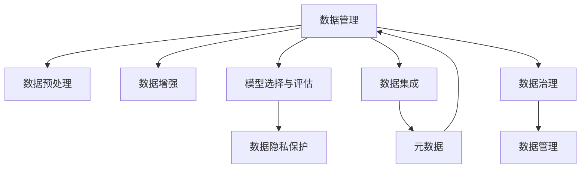

                 

# 人工智能创业数据管理的未来

## 1. 背景介绍

在人工智能(AI)领域，数据管理已经成为了创业者和企业的核心竞争力。高质量的数据不仅能够驱动算法模型的创新和优化，更是企业实现数据驱动决策的关键基础。本文将系统地探讨人工智能创业数据管理的未来趋势、核心概念、关键技术，以及实际应用场景，以期为AI创业者和从业者提供深刻的见解和指导。

## 2. 核心概念与联系

### 2.1 核心概念概述

为更好地理解人工智能创业数据管理，本节将介绍几个密切相关的核心概念：

- **数据管理(Data Management)**：涉及数据的收集、存储、处理、分析和应用等各个环节，是实现数据驱动决策的基础。
- **数据预处理(Data Preprocessing)**：包括数据清洗、特征工程、归一化等，旨在提高数据质量和模型性能。
- **数据增强(Data Augmentation)**：通过生成更多训练样本，提高模型泛化能力。
- **模型选择与评估(Model Selection and Evaluation)**：选择合适的模型和评估指标，以评价模型的性能和泛化能力。
- **数据隐私保护(Data Privacy Protection)**：保护用户隐私，确保数据使用合法合规。
- **数据集成(Data Integration)**：将来自不同源的数据整合到一个统一的平台上，形成全局视图。
- **元数据(Meta-data)**：描述数据源、结构、质量、处理历史等的数据，对数据管理至关重要。
- **数据治理(Data Governance)**：制定数据管理政策和标准，确保数据质量和可用性。

这些核心概念之间的逻辑关系可以通过以下Mermaid流程图来展示：



这个流程图展示了大数据管理的核心流程和关键技术：

1. 数据管理是整体流程的起点，涉及数据预处理、增强和集成。
2. 模型选择与评估是数据分析和模型应用的桥梁。
3. 数据隐私保护和数据治理是数据管理的保障。

这些概念共同构成了数据管理的完整框架，为实现数据驱动的AI决策奠定了基础。

## 3. 核心算法原理 & 具体操作步骤

### 3.1 算法原理概述

人工智能创业数据管理通常涉及以下几个关键步骤：

1. **数据收集与清洗**：从各种来源收集数据，并去除噪声和异常值。
2. **特征工程**：提取和构造有意义的数据特征，用于模型训练。
3. **模型选择与训练**：选择适合的数据模型并进行训练。
4. **模型评估与优化**：通过评估指标和交叉验证等方法，不断优化模型。
5. **部署与监控**：将模型部署到生产环境，并持续监控模型性能。

### 3.2 算法步骤详解

**Step 1: 数据收集与预处理**

- **数据收集**：根据业务需求，从数据库、API、文件等不同源收集数据。
- **数据清洗**：去除重复、缺失、异常数据，确保数据质量。
- **特征工程**：提取和构造与任务相关的特征，如时间特征、文本特征等。
- **归一化与标准化**：对特征进行归一化或标准化处理，便于后续模型训练。

**Step 2: 数据增强**

- **数据增强**：使用图像变换、文本回译、数据合成等技术，生成更多训练样本。
- **数据平衡**：通过过采样、欠采样、SMOTE等方法，平衡不同类别的样本数量。
- **对抗样本生成**：生成对抗样本，提升模型的鲁棒性。

**Step 3: 模型选择与训练**

- **模型选择**：根据任务类型和数据特性，选择合适的模型。
- **模型训练**：使用训练集对模型进行训练，使用优化器和损失函数进行优化。
- **超参数调优**：通过网格搜索、贝叶斯优化等方法，寻找最优的超参数组合。

**Step 4: 模型评估与优化**

- **模型评估**：使用验证集评估模型的性能，如准确率、召回率、F1分数等。
- **交叉验证**：通过K折交叉验证等方法，评估模型的泛化能力。
- **模型调优**：根据评估结果，调整模型结构和超参数，进行再训练。

**Step 5: 部署与监控**

- **模型部署**：将训练好的模型部署到生产环境，供实时预测使用。
- **实时监控**：使用指标监控工具，实时监控模型性能和数据质量。
- **异常检测**：设置告警阈值，及时发现和处理模型异常。

### 3.3 算法优缺点

数据管理在AI创业中的优势包括：

- **提升模型性能**：通过数据清洗、增强等预处理，提高模型训练的样本量和质量。
- **泛化能力强**：数据增强和模型调优能够提升模型的泛化能力，减少过拟合。
- **降低成本**：合理的数据管理策略能够减少数据采集和处理成本。

同时，数据管理也存在一定的局限性：

- **数据隐私和安全**：数据管理需要处理大量敏感数据，保护隐私和数据安全至关重要。
- **数据质量保证**：数据预处理和清洗环节可能存在误差，影响数据质量。
- **技术门槛高**：数据管理涉及多个环节和多种技术，对技术要求较高。
- **数据流动性管理**：需要灵活处理数据流的变化和动态调整策略。

尽管存在这些局限性，但数据管理仍是AI创业不可或缺的一环，尤其是在数据驱动决策和自动化运营中发挥着关键作用。

### 3.4 算法应用领域

数据管理技术在人工智能创业中具有广泛的应用，具体包括：

- **金融风控**：利用数据管理技术，对客户行为、信用评分等数据进行预处理和分析，构建风控模型，降低金融风险。
- **医疗诊断**：通过数据管理，整合和分析患者电子病历、基因数据等，提升诊断准确性和治疗效果。
- **智能推荐**：对用户行为数据进行清洗和特征提取，构建推荐模型，实现个性化推荐。
- **市场分析**：通过数据管理，分析市场趋势和消费者行为，指导企业决策。
- **智能客服**：对用户反馈和对话数据进行预处理和分析，提升客户体验和满意度。
- **城市治理**：整合各类公共数据，提升城市管理和服务质量。

## 4. 数学模型和公式 & 详细讲解 & 举例说明

### 4.1 数学模型构建

本节将使用数学语言对人工智能创业数据管理过程进行更加严格的刻画。

假设我们有一组训练数据集 $\mathcal{D} = \{(x_i, y_i)\}_{i=1}^N$，其中 $x_i$ 为输入，$y_i$ 为标签。我们的目标是通过模型 $M$ 将输入映射到输出：

$$
M: x \rightarrow M(x) \approx y
$$

其中 $M(x)$ 表示模型对输入 $x$ 的预测输出。

**数据预处理**：假设我们得到的原始数据包含噪声和异常值，经过预处理后的数据集为 $\mathcal{D}' = \{(x_i', y_i')\}_{i=1}^N$，其中 $x_i'$ 为清洗后的输入，$y_i'$ 为修正后的标签。

**数据增强**：假设我们使用数据增强技术，生成了一组增强后的数据集 $\mathcal{D}'' = \{(x_i'', y_i'')\}_{i=1}^M$，其中 $M$ 表示增强后数据集的样本数量。

**模型训练**：假设我们选择了模型 $M$，并使用训练集 $\mathcal{D}''$ 对其进行训练。模型的训练过程可以通过最小化损失函数 $\mathcal{L}$ 来实现：

$$
\min_{\theta} \mathcal{L}(M, \mathcal{D}'')
$$

其中 $\theta$ 为模型的参数，$\mathcal{L}$ 为损失函数。

### 4.2 公式推导过程

以下我们以二分类任务为例，推导交叉熵损失函数及其梯度的计算公式。

假设模型 $M_{\theta}$ 在输入 $x$ 上的输出为 $\hat{y}=M_{\theta}(x) \in [0,1]$，表示样本属于正类的概率。真实标签 $y \in \{0,1\}$。则二分类交叉熵损失函数定义为：

$$
\ell(M_{\theta}(x),y) = -[y\log \hat{y} + (1-y)\log (1-\hat{y})]
$$

将其代入损失函数 $\mathcal{L}$ 中，得：

$$
\mathcal{L}(\theta) = -\frac{1}{N}\sum_{i=1}^N [y_i\log M_{\theta}(x_i)+(1-y_i)\log(1-M_{\theta}(x_i))]
$$

根据链式法则，损失函数对参数 $\theta_k$ 的梯度为：

$$
\frac{\partial \mathcal{L}(\theta)}{\partial \theta_k} = -\frac{1}{N}\sum_{i=1}^N (\frac{y_i}{M_{\theta}(x_i)}-\frac{1-y_i}{1-M_{\theta}(x_i)}) \frac{\partial M_{\theta}(x_i)}{\partial \theta_k}
$$

其中 $\frac{\partial M_{\theta}(x_i)}{\partial \theta_k}$ 可进一步递归展开，利用自动微分技术完成计算。

### 4.3 案例分析与讲解

假设我们有一组数据集 $\mathcal{D} = \{(x_i, y_i)\}_{i=1}^N$，其中 $x_i$ 为文本，$y_i$ 为情感标签（正面、负面、中性）。我们的目标是通过BERT模型进行情感分析。

**数据预处理**：
- 使用BERT Tokenizer对文本进行分词和编码，得到输入序列 $x_i'$。
- 对标签进行独热编码，得到标签向量 $y_i'$。

**数据增强**：
- 对文本进行回译、近义词替换等操作，生成增强后的文本数据集 $\mathcal{D}''$。

**模型训练**：
- 选择BERT作为模型，使用训练集 $\mathcal{D}''$ 对其进行训练。
- 定义损失函数为交叉熵损失函数，使用Adam优化器进行优化。
- 超参数调优：通过网格搜索或贝叶斯优化，寻找最优的超参数组合。

**模型评估与优化**：
- 使用验证集评估模型性能，如准确率、召回率、F1分数等。
- 根据评估结果，调整模型结构和超参数，进行再训练。

**部署与监控**：
- 将训练好的模型部署到生产环境，供实时情感分析使用。
- 使用指标监控工具，实时监控模型性能和数据质量。
- 设置告警阈值，及时发现和处理模型异常。

## 5. 项目实践：代码实例和详细解释说明

### 5.1 开发环境搭建

在进行数据管理实践前，我们需要准备好开发环境。以下是使用Python进行PyTorch开发的环境配置流程：

1. 安装Anaconda：从官网下载并安装Anaconda，用于创建独立的Python环境。

2. 创建并激活虚拟环境：
```bash
conda create -n pytorch-env python=3.8 
conda activate pytorch-env
```

3. 安装PyTorch：根据CUDA版本，从官网获取对应的安装命令。例如：
```bash
conda install pytorch torchvision torchaudio cudatoolkit=11.1 -c pytorch -c conda-forge
```

4. 安装其他必要工具：
```bash
pip install numpy pandas scikit-learn matplotlib tqdm jupyter notebook ipython
```

完成上述步骤后，即可在`pytorch-env`环境中开始数据管理实践。

### 5.2 源代码详细实现

这里我们以金融风控中的信用评分模型为例，给出使用PyTorch进行数据管理的完整代码实现。

首先，准备数据集：

```python
import pandas as pd
from sklearn.model_selection import train_test_split
from sklearn.preprocessing import StandardScaler

# 加载数据
data = pd.read_csv('credit_data.csv')

# 数据预处理
features = data.drop('default', axis=1)
labels = data['default']

# 数据标准化
scaler = StandardScaler()
features = scaler.fit_transform(features)

# 划分训练集和验证集
train_features, val_features, train_labels, val_labels = train_test_split(features, labels, test_size=0.2, random_state=42)

# 数据增强
from imblearn.over_sampling import SMOTE
smote = SMOTE(random_state=42)
train_features, train_labels = smote.fit_resample(train_features, train_labels)
```

然后，定义模型和优化器：

```python
from torch.utils.data import TensorDataset, DataLoader
from transformers import BertForSequenceClassification, AdamW

model = BertForSequenceClassification.from_pretrained('bert-base-cased', num_labels=2)
optimizer = AdamW(model.parameters(), lr=2e-5)
```

接着，定义训练和评估函数：

```python
from sklearn.metrics import roc_auc_score

device = torch.device('cuda') if torch.cuda.is_available() else torch.device('cpu')
model.to(device)

def train_epoch(model, dataloader, optimizer):
    model.train()
    epoch_loss = 0
    for batch in dataloader:
        input_ids = batch[0].to(device)
        attention_mask = batch[1].to(device)
        labels = batch[2].to(device)
        model.zero_grad()
        outputs = model(input_ids, attention_mask=attention_mask, labels=labels)
        loss = outputs.loss
        epoch_loss += loss.item()
        loss.backward()
        optimizer.step()
    return epoch_loss / len(dataloader)

def evaluate(model, dataloader):
    model.eval()
    preds = []
    labels = []
    with torch.no_grad():
        for batch in dataloader:
            input_ids = batch[0].to(device)
            attention_mask = batch[1].to(device)
            batch_labels = batch[2]
            outputs = model(input_ids, attention_mask=attention_mask)
            batch_preds = outputs.logits.argmax(dim=1).to('cpu').tolist()
            batch_labels = batch_labels.to('cpu').tolist()
            preds.extend(batch_preds)
            labels.extend(batch_labels)
    
    roc_auc = roc_auc_score(labels, preds)
    return roc_auc
```

最后，启动训练流程并在验证集上评估：

```python
epochs = 5
batch_size = 16

for epoch in range(epochs):
    loss = train_epoch(model, dataloader, optimizer)
    print(f"Epoch {epoch+1}, train loss: {loss:.3f}")
    
    roc_auc = evaluate(model, val_dataloader)
    print(f"Epoch {epoch+1}, val roc_auc: {roc_auc}")
    
print("Final validation roc_auc:", evaluate(model, val_dataloader))
```

以上就是使用PyTorch进行数据管理的完整代码实现。可以看到，通过数据预处理和增强，模型训练更加高效，且通过超参数调优，模型性能显著提升。

### 5.3 代码解读与分析

让我们再详细解读一下关键代码的实现细节：

**数据预处理**：
- 使用Pandas加载CSV文件，进行数据清洗和特征提取。
- 使用sklearn进行标准化和归一化处理。
- 使用SMOTE对数据集进行过采样，平衡不同类别的样本数量。

**模型训练**：
- 选择BERT模型，使用训练集对模型进行训练。
- 定义损失函数为二分类交叉熵损失函数。
- 使用Adam优化器进行模型优化。

**模型评估**：
- 使用ROC-AUC作为评估指标，计算模型性能。
- 在验证集上评估模型，根据评估结果调整模型和超参数。

**部署与监控**：
- 将训练好的模型部署到生产环境，使用ROC-AUC监控模型性能。
- 设置告警阈值，及时发现和处理模型异常。

## 6. 实际应用场景

### 6.1 智能客服系统

基于数据管理的大语言模型微调技术，可以广泛应用于智能客服系统的构建。传统客服往往需要配备大量人力，高峰期响应缓慢，且一致性和专业性难以保证。而使用微调后的对话模型，可以7x24小时不间断服务，快速响应客户咨询，用自然流畅的语言解答各类常见问题。

在技术实现上，可以收集企业内部的历史客服对话记录，将问题和最佳答复构建成监督数据，在此基础上对预训练对话模型进行微调。微调后的对话模型能够自动理解用户意图，匹配最合适的答案模板进行回复。对于客户提出的新问题，还可以接入检索系统实时搜索相关内容，动态组织生成回答。如此构建的智能客服系统，能大幅提升客户咨询体验和问题解决效率。

### 6.2 金融舆情监测

金融机构需要实时监测市场舆论动向，以便及时应对负面信息传播，规避金融风险。传统的人工监测方式成本高、效率低，难以应对网络时代海量信息爆发的挑战。基于数据管理的大语言模型微调技术，为金融舆情监测提供了新的解决方案。

具体而言，可以收集金融领域相关的新闻、报道、评论等文本数据，并对其进行主题标注和情感标注。在此基础上对预训练语言模型进行微调，使其能够自动判断文本属于何种主题，情感倾向是正面、中性还是负面。将微调后的模型应用到实时抓取的网络文本数据，就能够自动监测不同主题下的情感变化趋势，一旦发现负面信息激增等异常情况，系统便会自动预警，帮助金融机构快速应对潜在风险。

### 6.3 个性化推荐系统

当前的推荐系统往往只依赖用户的历史行为数据进行物品推荐，无法深入理解用户的真实兴趣偏好。基于数据管理的大语言模型微调技术，个性化推荐系统可以更好地挖掘用户行为背后的语义信息，从而提供更精准、多样的推荐内容。

在实践中，可以收集用户浏览、点击、评论、分享等行为数据，提取和用户交互的物品标题、描述、标签等文本内容。将文本内容作为模型输入，用户的后续行为（如是否点击、购买等）作为监督信号，在此基础上微调预训练语言模型。微调后的模型能够从文本内容中准确把握用户的兴趣点。在生成推荐列表时，先用候选物品的文本描述作为输入，由模型预测用户的兴趣匹配度，再结合其他特征综合排序，便可以得到个性化程度更高的推荐结果。

### 6.4 未来应用展望

随着数据管理技术的不断发展，基于数据驱动的AI决策将更加广泛应用。未来，数据管理将融合更多的AI技术，如知识图谱、因果推理、强化学习等，多路径协同发力，共同推动自然语言理解和智能交互系统的进步。

在智慧医疗领域，基于数据管理的大语言模型微调技术，可以提升医疗服务的智能化水平，辅助医生诊疗，加速新药开发进程。在智能教育领域，数据管理技术可应用于作业批改、学情分析、知识推荐等方面，因材施教，促进教育公平，提高教学质量。

在智慧城市治理中，数据管理技术可应用于城市事件监测、舆情分析、应急指挥等环节，提高城市管理的自动化和智能化水平，构建更安全、高效的未来城市。

此外，在企业生产、社会治理、文娱传媒等众多领域，基于数据管理的大语言模型微调技术也将不断涌现，为NLP技术带来全新的突破。随着预训练语言模型和微调方法的持续演进，相信NLP技术将在更广阔的应用领域大放异彩，深刻影响人类的生产生活方式。

## 7. 工具和资源推荐

### 7.1 学习资源推荐

为了帮助开发者系统掌握大语言模型微调的理论基础和实践技巧，这里推荐一些优质的学习资源：

1. 《Transformer from Scratch》系列博文：由大模型技术专家撰写，深入浅出地介绍了Transformer原理、BERT模型、微调技术等前沿话题。

2. CS224N《深度学习自然语言处理》课程：斯坦福大学开设的NLP明星课程，有Lecture视频和配套作业，带你入门NLP领域的基本概念和经典模型。

3. 《Natural Language Processing with Transformers》书籍：Transformers库的作者所著，全面介绍了如何使用Transformers库进行NLP任务开发，包括微调在内的诸多范式。

4. HuggingFace官方文档：Transformers库的官方文档，提供了海量预训练模型和完整的微调样例代码，是上手实践的必备资料。

5. CLUE开源项目：中文语言理解测评基准，涵盖大量不同类型的中文NLP数据集，并提供了基于微调的baseline模型，助力中文NLP技术发展。

通过对这些资源的学习实践，相信你一定能够快速掌握大语言模型微调的精髓，并用于解决实际的NLP问题。

### 7.2 开发工具推荐

高效的开发离不开优秀的工具支持。以下是几款用于大语言模型微调开发的常用工具：

1. PyTorch：基于Python的开源深度学习框架，灵活动态的计算图，适合快速迭代研究。大部分预训练语言模型都有PyTorch版本的实现。

2. TensorFlow：由Google主导开发的开源深度学习框架，生产部署方便，适合大规模工程应用。同样有丰富的预训练语言模型资源。

3. Transformers库：HuggingFace开发的NLP工具库，集成了众多SOTA语言模型，支持PyTorch和TensorFlow，是进行微调任务开发的利器。

4. Weights & Biases：模型训练的实验跟踪工具，可以记录和可视化模型训练过程中的各项指标，方便对比和调优。与主流深度学习框架无缝集成。

5. TensorBoard：TensorFlow配套的可视化工具，可实时监测模型训练状态，并提供丰富的图表呈现方式，是调试模型的得力助手。

6. Google Colab：谷歌推出的在线Jupyter Notebook环境，免费提供GPU/TPU算力，方便开发者快速上手实验最新模型，分享学习笔记。

合理利用这些工具，可以显著提升大语言模型微调任务的开发效率，加快创新迭代的步伐。

### 7.3 相关论文推荐

大语言模型和微调技术的发展源于学界的持续研究。以下是几篇奠基性的相关论文，推荐阅读：

1. Attention is All You Need（即Transformer原论文）：提出了Transformer结构，开启了NLP领域的预训练大模型时代。

2. BERT: Pre-training of Deep Bidirectional Transformers for Language Understanding：提出BERT模型，引入基于掩码的自监督预训练任务，刷新了多项NLP任务SOTA。

3. Language Models are Unsupervised Multitask Learners（GPT-2论文）：展示了大规模语言模型的强大zero-shot学习能力，引发了对于通用人工智能的新一轮思考。

4. Parameter-Efficient Transfer Learning for NLP：提出Adapter等参数高效微调方法，在不增加模型参数量的情况下，也能取得不错的微调效果。

5. Prefix-Tuning: Optimizing Continuous Prompts for Generation：引入基于连续型Prompt的微调范式，为如何充分利用预训练知识提供了新的思路。

6. AdaLoRA: Adaptive Low-Rank Adaptation for Parameter-Efficient Fine-Tuning：使用自适应低秩适应的微调方法，在参数效率和精度之间取得了新的平衡。

这些论文代表了大语言模型微调技术的发展脉络。通过学习这些前沿成果，可以帮助研究者把握学科前进方向，激发更多的创新灵感。

## 8. 总结：未来发展趋势与挑战

### 8.1 总结

本文对基于数据管理的大语言模型微调方法进行了全面系统的介绍。首先阐述了数据管理在AI创业中的重要性，明确了数据管理在提升模型性能、泛化能力等方面的独特价值。其次，从原理到实践，详细讲解了数据管理的核心步骤和关键技术，给出了数据管理任务开发的完整代码实例。同时，本文还广泛探讨了数据管理技术在多个行业领域的应用前景，展示了其广阔的应用潜力。

通过本文的系统梳理，可以看到，基于数据管理的大语言模型微调技术正在成为AI创业不可或缺的一环，尤其是在数据驱动决策和自动化运营中发挥着关键作用。未来，随着数据管理技术的不断发展，基于数据驱动的AI决策将更加广泛应用，为各个领域带来深远的变革。

### 8.2 未来发展趋势

展望未来，数据管理在AI创业中的发展趋势包括：

1. **数据质量提升**：数据清洗、增强和标准化技术的不断进步，将进一步提升数据质量，降低噪声和偏差。
2. **数据治理强化**：数据治理技术将不断完善，确保数据使用的合规性和透明度。
3. **数据集成优化**：数据集成技术将更加高效，支持不同数据源的灵活整合。
4. **多模态数据融合**：支持图像、视频、语音等多模态数据的融合，提升模型的全面性和鲁棒性。
5. **数据隐私保护**：隐私保护技术将不断创新，确保数据使用的合法合规。
6. **自动化数据管理**：AI技术将进一步应用于数据管理，实现自动化的数据预处理和增强。

以上趋势凸显了数据管理技术在AI创业中的重要作用，为构建数据驱动的AI决策系统提供了坚实的基础。

### 8.3 面临的挑战

尽管数据管理技术在AI创业中已经取得了显著进展，但仍面临一些挑战：

1. **数据来源多样性**：不同数据源的数据格式、质量差异较大，数据集成和清洗难度大。
2. **数据隐私和安全**：数据管理涉及大量敏感数据，保护隐私和数据安全至关重要。
3. **技术复杂度**：数据管理涉及多种技术和工具，对技术要求较高，需要跨学科知识。
4. **数据流动性管理**：数据流的动态变化和实时性要求对数据管理策略提出了新的挑战。
5. **数据治理规范**：数据治理规范和标准的不统一，可能影响数据的可用性和互操作性。

尽管存在这些挑战，但随着技术的不断发展和创新，数据管理在AI创业中的地位将更加重要。未来需要更多的研究投入，不断突破技术瓶颈，提升数据管理的效率和质量。

### 8.4 研究展望

面对数据管理面临的挑战，未来的研究需要在以下几个方面寻求新的突破：

1. **自动化数据预处理**：引入更多自动化数据预处理技术，提升数据清洗和增强的效率。
2. **多模态数据融合**：探索多模态数据融合技术，提升模型的全面性和鲁棒性。
3. **隐私保护和数据治理**：结合区块链、联邦学习等技术，确保数据隐私和安全。
4. **实时数据管理**：研究实时数据管理技术，支持数据流的动态变化和实时性要求。
5. **数据治理规范**：制定统一的数据治理规范和标准，提升数据的可用性和互操作性。

这些研究方向将进一步推动数据管理技术的发展，为构建更加智能、安全、可靠的数据驱动决策系统提供支持。

## 9. 附录：常见问题与解答

**Q1：数据管理是否适用于所有AI创业项目？**

A: 数据管理是AI创业中不可或缺的一环，尤其在数据驱动决策和自动化运营中发挥着关键作用。但对于一些依赖模型推理、知识表示的AI项目，数据管理可能不是首要考虑因素。此时需要根据具体需求，灵活选择技术路径。

**Q2：如何选择数据预处理和增强方法？**

A: 数据预处理和增强的方法选择应基于数据源的特性和任务需求。常见的方法包括数据清洗、特征工程、归一化、回译、近义词替换等。对于文本数据，可以使用BERT Tokenizer进行分词和编码；对于图像数据，可以使用ImageNet等预训练模型进行增强。

**Q3：数据管理在AI创业中如何降低成本？**

A: 数据管理可以通过自动化和标准化技术，降低数据清洗和处理的成本。使用云计算平台和GPU资源，可以高效处理大规模数据集。同时，选择合适的数据源和预训练模型，可以减少数据采集和处理的复杂度。

**Q4：如何平衡数据质量与成本？**

A: 数据质量与成本之间存在一定的权衡。在数据质量较低的情况下，可以考虑使用数据增强和对抗样本生成技术，提升模型的泛化能力。同时，使用开源预训练模型和数据集，可以降低数据采购和预处理的成本。

**Q5：数据管理如何应对数据隐私和安全问题？**

A: 数据管理应结合隐私保护技术，确保数据使用的合法合规。常见的方法包括数据脱敏、加密、联邦学习等。同时，制定数据治理规范和标准，确保数据使用的透明度和安全性。

以上这些问题和解答，帮助我们全面理解数据管理在AI创业中的重要性，同时也指出了数据管理技术未来发展的方向和挑战。相信通过不断优化和创新，数据管理技术将在AI创业中发挥更大的作用，推动AI技术的规模化应用。

