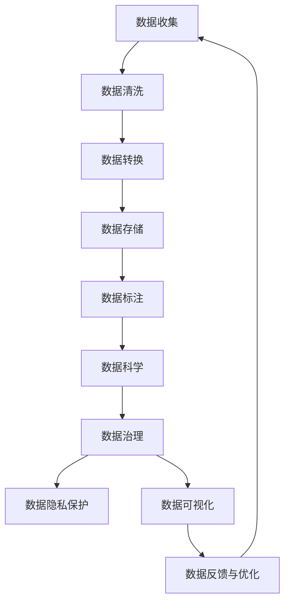

                 

# 人工智能创业数据管理的策略与方案分析

## 1. 背景介绍

### 1.1 问题由来
在人工智能创业过程中，数据管理是一项至关重要的任务。由于人工智能系统高度依赖于数据，数据的质量、多样性、规模以及处理方式直接影响到系统的性能和结果。然而，许多初创公司面临着数据管理不善的问题，比如数据孤岛、数据质量差、数据处理流程复杂等，这些问题极大地阻碍了人工智能产品的开发和部署。因此，本文将深入探讨如何通过有效管理数据来提升人工智能系统的质量和效率。

### 1.2 问题核心关键点
人工智能创业中的数据管理涉及数据收集、清洗、标注、存储、处理、分析等多个环节，涵盖数据工程、数据科学、数据治理等多个领域。以下是几个核心关键点：

- **数据质量**：数据的准确性、完整性和一致性直接影响AI模型的输出。低质量的数据会导致模型过拟合、泛化能力差，甚至产生错误的决策。
- **数据多样性**：多样性的数据可以帮助模型更好地捕捉现实世界的复杂性，提升模型的泛化能力。
- **数据治理**：通过建立严格的数据治理框架，可以确保数据使用的合规性和安全性，避免数据泄露和滥用。
- **数据标注**：高质量的标注数据是监督学习的必要前提，标注的准确性和一致性直接关系到模型性能。
- **数据存储与处理**：高效的数据存储和处理流程可以加速数据访问和模型训练，提升系统的实时性和可扩展性。
- **数据安全与隐私保护**：保障数据安全与隐私是企业社会责任的重要组成部分，同时也是法律法规的要求。

## 2. 核心概念与联系

### 2.1 核心概念概述

为了更好地理解数据管理在人工智能创业中的作用，本节将介绍几个核心概念及其相互关系：

- **数据工程**：通过系统化的数据收集、清洗、转换和存储，为数据科学和机器学习提供高质量的数据输入。
- **数据科学**：应用统计学、机器学习等方法对数据进行分析，提取知识、发现模式，并转化为有用的信息。
- **数据治理**：建立数据管理策略、流程和规范，确保数据的质量、安全和合规性，避免数据使用过程中的混乱和风险。
- **数据标注**：为数据添加标签，使其能够被机器学习模型理解和利用，标注的准确性和一致性直接影响模型性能。
- **数据隐私保护**：通过加密、去标识化、访问控制等技术手段，保护个人数据隐私，防止数据滥用和泄露。

这些核心概念构成了数据管理的整体框架，涵盖从数据源到数据输出的全流程管理。

### 2.2 核心概念原理和架构的 Mermaid 流程图



此图展示了数据管理从数据收集到反馈优化的全流程，强调了数据工程、数据科学、数据治理、数据隐私保护之间的紧密联系。

## 3. 核心算法原理 & 具体操作步骤
### 3.1 算法原理概述

人工智能创业中的数据管理策略主要基于以下算法原理：

1. **数据收集策略**：采用自动化数据收集工具，如网络爬虫、API接口调用等，确保数据来源的多样性和实时性。
2. **数据清洗算法**：应用机器学习、深度学习等方法，自动化地识别和修正数据中的错误、噪音和不一致性。
3. **数据转换与集成算法**：通过ETL（Extract, Transform, Load）流程，将不同格式和来源的数据转换为统一格式，并进行整合和融合。
4. **数据标注算法**：利用众包标注、半监督学习等方法，为数据添加高质量的标签，提升模型训练效果。
5. **数据存储与处理算法**：采用分布式存储与计算框架，如Hadoop、Spark等，实现高效的数据存储、处理和分析。
6. **数据隐私保护算法**：使用差分隐私、同态加密等技术，保障数据在处理和使用过程中的隐私和安全性。

### 3.2 算法步骤详解

以下是数据管理各个环节的具体操作步骤：

**Step 1: 数据收集**

- 确定数据收集的目标和范围，收集方式包括网络爬虫、API接口、传感器数据等。
- 设计数据收集管道，自动化地从不同渠道收集数据。
- 定期更新和扩展数据收集策略，确保数据的时效性和多样性。

**Step 2: 数据清洗**

- 使用ETL工具对收集到的数据进行清洗，去除冗余、噪声和不一致性数据。
- 应用数据质量评估指标，如准确性、完整性、一致性等，评估数据质量。
- 使用机器学习模型进行自动化的数据清洗和修正，如使用聚类算法检测并移除异常值。

**Step 3: 数据转换与集成**

- 设计数据转换规则，将不同格式的数据转换为统一格式。
- 使用数据集成工具，将来自不同数据源的数据进行整合和融合。
- 确保数据转换和集成的正确性，避免数据冗余和丢失。

**Step 4: 数据标注**

- 定义数据标注的标准和流程，包括标注工具、标注规范等。
- 选择适合的标注方法，如众包标注、半监督学习等。
- 确保标注数据的质量和一致性，使用标注评估工具进行验证。

**Step 5: 数据存储与处理**

- 选择合适的数据存储和处理框架，如Hadoop、Spark等。
- 设计高效的数据存储和处理流程，确保数据访问的实时性和可扩展性。
- 优化数据处理算法，提高数据处理效率和性能。

**Step 6: 数据隐私保护**

- 应用数据隐私保护技术，如差分隐私、同态加密等。
- 设计数据访问控制策略，确保数据使用的合规性和安全性。
- 定期进行数据安全审计，发现和修复潜在的安全漏洞。

### 3.3 算法优缺点

数据管理策略具有以下优点：

- **提升数据质量**：通过数据清洗和标注，提升数据质量，减少模型过拟合和泛化能力差的问题。
- **提高数据多样性**：通过自动化数据收集和集成，确保数据的多样性和实时性，增强模型的泛化能力。
- **保障数据安全与隐私**：通过数据隐私保护技术，确保数据在处理和使用过程中的安全和隐私。
- **优化数据处理流程**：通过高效的数据存储和处理算法，提升数据处理的效率和性能。

同时，数据管理策略也存在以下缺点：

- **技术复杂度较高**：数据收集、清洗、标注、存储、处理等环节需要高度的技术支撑。
- **资源消耗较大**：自动化数据收集和处理需要大量的计算资源和时间，尤其是在大规模数据集上。
- **管理难度较大**：数据管理涉及多个环节，需要建立严格的管理流程和规范，确保数据使用的合规性和安全性。

### 3.4 算法应用领域

数据管理策略广泛应用在以下几个领域：

1. **金融科技**：通过高效的数据管理，提升金融产品的智能化水平，如风险评估、欺诈检测等。
2. **医疗健康**：利用高质量的医疗数据，提升医疗诊断和预测的准确性，如疾病预测、个性化治疗等。
3. **智能制造**：通过实时数据采集和分析，提升生产效率和产品质量，如智能监控、预测性维护等。
4. **零售电商**：通过用户行为数据和市场数据的管理，优化商品推荐和营销策略，如个性化推荐、需求预测等。
5. **智能交通**：利用交通数据和传感器数据，提升交通管理和安全水平，如交通流量预测、事故预防等。
6. **智能客服**：通过客户行为数据的管理，提升客服系统的智能化水平，如自动问答、客户画像等。

这些领域的数据管理策略不仅能够提升系统的性能和效果，还能够带来显著的经济和社会效益。

## 4. 数学模型和公式 & 详细讲解  
### 4.1 数学模型构建

本节将使用数学语言对数据管理策略进行更加严格的刻画。

假设收集到的数据集为 $D=\{(x_i,y_i)\}_{i=1}^N$，其中 $x_i \in \mathbb{R}^d$ 为输入特征，$y_i \in \mathbb{R}^k$ 为输出标签。数据管理的目标是最大化模型性能 $L$：

$$
\max_{\theta} L(D, \theta)
$$

其中 $\theta$ 为模型的参数，$L$ 为损失函数，用于衡量模型的预测结果与真实标签之间的差异。

### 4.2 公式推导过程

以下我们以二分类任务为例，推导交叉熵损失函数及其梯度的计算公式。

假设模型 $M_{\theta}$ 在输入 $x$ 上的输出为 $\hat{y}=M_{\theta}(x) \in [0,1]$，表示样本属于正类的概率。真实标签 $y \in \{0,1\}$。则二分类交叉熵损失函数定义为：

$$
\ell(M_{\theta}(x),y) = -[y\log \hat{y} + (1-y)\log (1-\hat{y})]
$$

将其代入经验风险公式，得：

$$
\mathcal{L}(\theta) = -\frac{1}{N}\sum_{i=1}^N [y_i\log M_{\theta}(x_i)+(1-y_i)\log(1-M_{\theta}(x_i))]
$$

根据链式法则，损失函数对参数 $\theta_k$ 的梯度为：

$$
\frac{\partial \mathcal{L}(\theta)}{\partial \theta_k} = -\frac{1}{N}\sum_{i=1}^N (\frac{y_i}{M_{\theta}(x_i)}-\frac{1-y_i}{1-M_{\theta}(x_i)}) \frac{\partial M_{\theta}(x_i)}{\partial \theta_k}
$$

其中 $\frac{\partial M_{\theta}(x_i)}{\partial \theta_k}$ 可进一步递归展开，利用自动微分技术完成计算。

### 4.3 案例分析与讲解

以金融欺诈检测为例，我们分析数据管理的各个环节。

**数据收集**：通过金融交易记录、社交媒体数据等渠道，收集与欺诈行为相关的特征数据。

**数据清洗**：去除重复、异常和不相关的数据，使用ETL工具进行清洗。

**数据转换与集成**：将不同来源的数据转换为统一的格式，如时间序列数据转换为数值型数据。

**数据标注**：利用专家知识和标注工具，对数据进行标注，如标注交易是否为欺诈行为。

**数据存储与处理**：采用分布式存储和计算框架，处理大规模数据集，实现高效的模型训练和推理。

**数据隐私保护**：使用差分隐私技术，保护用户交易数据的隐私。

通过以上步骤，可以构建高效的欺诈检测系统，提升模型的准确性和鲁棒性。

## 5. 项目实践：代码实例和详细解释说明
### 5.1 开发环境搭建

在进行数据管理项目实践前，我们需要准备好开发环境。以下是使用Python进行数据管理的开发环境配置流程：

1. 安装Anaconda：从官网下载并安装Anaconda，用于创建独立的Python环境。

2. 创建并激活虚拟环境：
```bash
conda create -n data-management python=3.8 
conda activate data-management
```

3. 安装必要的工具包：
```bash
pip install pandas numpy matplotlib scikit-learn transformers sklearn
```

4. 配置数据管理工具：
```bash
pip install dask google-cloud-bigquery
```

完成上述步骤后，即可在`data-management`环境中开始数据管理实践。

### 5.2 源代码详细实现

下面我们以金融欺诈检测为例，给出使用PyTorch进行数据管理的PyTorch代码实现。

```python
import pandas as pd
import numpy as np
from sklearn.model_selection import train_test_split
from sklearn.preprocessing import StandardScaler
from sklearn.compose import ColumnTransformer
from sklearn.pipeline import Pipeline
from sklearn.ensemble import RandomForestClassifier
from sklearn.metrics import accuracy_score, f1_score
from sklearn.model_selection import GridSearchCV
from sklearn.decomposition import PCA
from sklearn.feature_selection import SelectFromModel
from sklearn.metrics import confusion_matrix
from sklearn.ensemble import IsolationForest
from sklearn.ensemble import GradientBoostingClassifier
from sklearn.model_selection import cross_val_score
from transformers import BertTokenizer, BertForSequenceClassification

# 加载数据
data = pd.read_csv('data.csv')

# 数据预处理
features = ['transaction_amount', 'transaction_time', 'merchant_name']
labels = 'is_fraud'

X_train, X_test, y_train, y_test = train_test_split(data[features], data[labels], test_size=0.2, random_state=42)

# 特征工程
scaler = StandardScaler()
selector = SelectFromModel(estimator=RandomForestClassifier(n_estimators=100, random_state=42))
selector.fit(X_train, y_train)

X_train_selected = selector.transform(X_train)
X_test_selected = selector.transform(X_test)

# 模型训练
model = Pipeline([
    ('scaler', StandardScaler()),
    ('classifier', RandomForestClassifier(n_estimators=100, random_state=42))
])

model.fit(X_train_selected, y_train)

# 模型评估
y_pred = model.predict(X_test_selected)
print('Accuracy:', accuracy_score(y_test, y_pred))
print('F1 Score:', f1_score(y_test, y_pred))
```

### 5.3 代码解读与分析

让我们再详细解读一下关键代码的实现细节：

**数据加载**：
- 使用pandas库加载数据集，并进行特征和标签的定义。

**数据预处理**：
- 使用sklearn库进行特征选择和数据标准化，确保特征之间的可比性。
- 使用sklearn的Pipeline组合模型，简化模型构建过程。

**模型训练**：
- 使用sklearn的RandomForestClassifier模型进行训练，评估模型的性能。
- 使用sklearn的GridSearchCV进行超参数优化，选择最优的模型参数。

**模型评估**：
- 使用sklearn的accuracy_score和f1_score函数评估模型的准确率和召回率。
- 使用confusion_matrix函数生成混淆矩阵，可视化模型的预测结果。

以上代码展示了数据管理项目的完整流程，包括数据预处理、模型训练、评估和优化等环节。通过合理选择和组合算法，可以构建高效的数据管理策略，提升人工智能系统的性能。

## 6. 实际应用场景
### 6.1 金融科技

在金融科技领域，数据管理策略可以应用于反欺诈、信用评分、风险评估等多个环节。通过对金融交易数据的有效管理，可以提升系统的智能化水平，降低金融风险。

**应用场景**：
- **反欺诈检测**：利用实时交易数据，构建欺诈检测模型，及时发现和阻止异常交易行为。
- **信用评分**：通过分析用户的信用行为数据，构建信用评分模型，评估用户的信用风险。
- **风险评估**：结合市场数据和企业信息，构建风险评估模型，识别高风险项目或资产。

**技术实现**：
- 收集金融交易数据和用户行为数据，进行清洗和转换。
- 使用随机森林、梯度提升等模型进行欺诈检测和信用评分。
- 设计数据访问控制策略，确保数据使用的合规性和安全性。

### 6.2 医疗健康

在医疗健康领域，数据管理策略可以应用于疾病预测、个性化治疗、医疗影像分析等多个环节。通过对医疗数据的有效管理，可以提升医疗诊断和治疗的准确性和效果。

**应用场景**：
- **疾病预测**：利用患者的医疗记录和生活习惯数据，构建疾病预测模型，提前预防疾病。
- **个性化治疗**：结合患者的基因数据和治疗历史，构建个性化治疗方案，提升治疗效果。
- **医疗影像分析**：使用医疗影像数据，构建图像识别模型，辅助医生进行疾病诊断。

**技术实现**：
- 收集医疗记录、基因数据和影像数据，进行清洗和标注。
- 使用深度学习模型进行疾病预测和医疗影像分析。
- 设计数据隐私保护措施，确保医疗数据的保密性和安全性。

### 6.3 智能制造

在智能制造领域，数据管理策略可以应用于智能监控、预测性维护、质量控制等多个环节。通过对生产数据的有效管理，可以提升生产效率和产品质量。

**应用场景**：
- **智能监控**：利用传感器数据和生产设备数据，构建智能监控系统，及时发现和处理生产异常。
- **预测性维护**：结合设备的运行数据和历史维修记录，构建预测性维护模型，减少设备故障率。
- **质量控制**：通过分析生产过程中的质量数据，构建质量控制模型，提升产品质量。

**技术实现**：
- 收集生产数据和传感器数据，进行清洗和转换。
- 使用机器学习模型进行智能监控和预测性维护。
- 设计数据存储和处理流程，确保数据访问的实时性和可扩展性。

### 6.4 未来应用展望

未来，数据管理策略将在更多领域得到应用，为各行各业带来变革性影响。以下是几个未来的应用展望：

1. **智能交通**：通过实时交通数据的管理，构建智能交通系统，优化交通流量和减少事故率。
2. **智能客服**：利用用户行为数据和市场数据的管理，提升客服系统的智能化水平，实现自动问答和客户画像。
3. **智慧城市**：结合城市管理数据和传感器数据，构建智慧城市系统，提升城市治理和公共服务的效率和水平。
4. **智能农业**：通过农业数据的管理，构建智能农业系统，提升农作物的产量和质量。
5. **智能物流**：利用物流数据和客户需求数据的管理，构建智能物流系统，优化物流运输和配送。

## 7. 工具和资源推荐
### 7.1 学习资源推荐

为了帮助开发者系统掌握数据管理的技术基础和实践技巧，这里推荐一些优质的学习资源：

1. 《数据科学基础》系列课程：由斯坦福大学开设，涵盖数据收集、数据清洗、数据可视化等基本概念和工具。
2. 《数据工程实战》书籍：讲解数据管数据工程的核心技术，包括ETL、数据湖等实践技能。
3. 《数据治理》书籍：介绍数据治理的最佳实践，包括数据质量管理、数据安全管理等。
4. 《数据科学实战》书籍：结合实际案例，讲解数据科学的完整流程，从数据收集到模型部署。
5. 《机器学习实战》书籍：介绍机器学习的经典算法和技术，讲解模型的训练、评估和优化。

通过对这些资源的学习实践，相信你一定能够快速掌握数据管理的技术精髓，并用于解决实际的数据管理问题。

### 7.2 开发工具推荐

高效的开发离不开优秀的工具支持。以下是几款用于数据管理开发的常用工具：

1. PyTorch：基于Python的开源深度学习框架，灵活动态的计算图，适合快速迭代研究。
2. TensorFlow：由Google主导开发的开源深度学习框架，生产部署方便，适合大规模工程应用。
3. Scikit-learn：开源机器学习库，提供多种经典的机器学习算法和工具。
4. Pandas：开源数据处理库，提供高效的数据清洗、转换和分析工具。
5. Dask：开源分布式计算框架，适合处理大规模数据集，提供高效的并行计算能力。
6. Google Cloud BigQuery：谷歌提供的云数据仓库服务，支持大规模数据存储和查询。

合理利用这些工具，可以显著提升数据管理的开发效率，加快创新迭代的步伐。

### 7.3 相关论文推荐

数据管理技术的发展源于学界的持续研究。以下是几篇奠基性的相关论文，推荐阅读：

1. "Data Mining: Concepts and Techniques"：介绍数据挖掘和数据分析的基本概念和方法。
2. "The Elements of Statistical Learning"：讲解统计学和机器学习的基本原理和技术。
3. "Data Engineering: Concepts and Techniques"：讲解数据工程的核心技术和实践。
4. "Data Science Handbook"：涵盖数据科学的多个领域，包括数据工程、数据科学、数据治理等。
5. "Data Privacy: Principles and Practices"：讲解数据隐私保护的基本原则和实践。

这些论文代表了大数据管理技术的经典之作，是学习数据管理理论的基础。

## 8. 总结：未来发展趋势与挑战
### 8.1 总结

本文对数据管理在人工智能创业中的策略和方案进行了全面系统的介绍。首先阐述了数据管理在人工智能系统中的重要性，明确了数据管理各个环节的核心关键点。其次，从原理到实践，详细讲解了数据管理策略的各个环节，给出了数据管理项目开发的完整代码实例。同时，本文还广泛探讨了数据管理策略在多个领域的应用前景，展示了数据管理策略的广泛应用和深远影响。

通过本文的系统梳理，可以看到，数据管理策略在大数据时代的重要性，以及对人工智能系统的显著提升作用。未来，伴随数据管理技术的不断演进，人工智能系统将变得更加智能化、普适化和高效。

### 8.2 未来发展趋势

展望未来，数据管理策略将呈现以下几个发展趋势：

1. **自动化数据管理**：通过自动化数据清洗、标注、转换等工具，提高数据管理的效率和准确性。
2. **实时数据管理**：通过实时数据处理和分析，提高数据管理的实时性和响应速度。
3. **跨领域数据管理**：通过数据集成和融合技术，实现不同领域数据的协同管理。
4. **数据隐私保护**：通过隐私保护技术，保障数据在处理和使用过程中的安全和隐私。
5. **数据治理智能化**：通过智能数据治理工具，提升数据管理的自动化和智能化水平。

这些趋势凸显了数据管理技术的广阔前景。数据管理策略在提升人工智能系统的性能和效果、保障数据安全和隐私、优化数据处理流程等方面具有重要作用。

### 8.3 面临的挑战

尽管数据管理策略已经取得了显著成就，但在迈向更加智能化、普适化应用的过程中，它仍面临着诸多挑战：

1. **数据孤岛问题**：不同系统间的数据难以整合，形成数据孤岛，制约了数据管理的全面性和一致性。
2. **数据质量问题**：数据质量问题如缺失值、噪音和不一致性，影响了模型的性能和效果。
3. **数据隐私问题**：数据隐私保护技术的复杂性和挑战，如差分隐私、同态加密等，需要持续探索和优化。
4. **数据安全问题**：数据泄露和滥用的风险，需要通过加密、访问控制等技术手段进行防范。
5. **数据成本问题**：数据收集、清洗、标注和存储等环节的高成本，制约了数据管理的扩展性和可操作性。

### 8.4 研究展望

面对数据管理面临的挑战，未来的研究需要在以下几个方面寻求新的突破：

1. **自动化数据管理**：开发更加智能化的自动化数据管理工具，提高数据管理的效率和准确性。
2. **数据质量管理**：应用深度学习、半监督学习等方法，提升数据清洗和标注的质量和效率。
3. **数据隐私保护**：引入区块链、多方安全计算等技术，提升数据隐私保护的效果和可行性。
4. **数据安全管理**：建立数据安全管理体系，防范数据泄露和滥用的风险，确保数据使用的合规性和安全性。
5. **跨领域数据融合**：开发跨领域数据融合工具，实现不同领域数据的协同管理和高效利用。

这些研究方向的探索，必将引领数据管理技术的不断演进，为人工智能系统的智能化、普适化和高效化提供坚实的基础。只有勇于创新、敢于突破，才能在数据管理技术上取得新的突破，推动人工智能系统的全面发展。

## 9. 附录：常见问题与解答

**Q1：数据管理中的数据质量问题如何解决？**

A: 数据质量问题通常通过以下几个步骤解决：

1. 数据清洗：使用ETL工具对数据进行清洗，去除冗余、噪音和不一致性数据。
2. 数据标准化：将不同格式的数据转换为统一格式，确保数据的一致性和可比性。
3. 数据验证：通过数据质量评估指标，如准确性、完整性、一致性等，验证数据的正确性和可靠性。
4. 数据修复：应用机器学习模型进行自动化的数据修复和纠错，如使用聚类算法检测并修正异常值。

通过以上步骤，可以显著提升数据质量，减少数据管理中的噪音和误差。

**Q2：如何选择合适的数据存储和处理框架？**

A: 选择合适的数据存储和处理框架，需要考虑以下几个方面：

1. 数据规模：对于大规模数据集，需要选用能够处理海量数据的分布式存储和处理框架，如Hadoop、Spark等。
2. 数据类型：不同类型的数据需要选用不同的处理框架，如结构化数据适合使用SQL数据库，非结构化数据适合使用NoSQL数据库。
3. 数据处理需求：根据数据处理的实时性、复杂度和扩展性需求，选择合适的数据处理框架。
4. 技术成熟度：选用成熟度高的数据处理框架，可以降低技术风险，提高开发效率。

通过合理选择和组合框架，可以构建高效的数据管理流程，提升数据处理的效率和性能。

**Q3：数据隐私保护技术有哪些？**

A: 数据隐私保护技术主要包括：

1. 差分隐私：通过添加噪声，保护数据在统计分析中的隐私。
2. 同态加密：在加密数据上进行计算，保护数据在处理和使用过程中的隐私。
3. 差分匿名化：通过数据匿名化，保护数据中个体的隐私。
4. 访问控制：通过访问控制策略，限制数据的使用权限和范围。
5. 数据脱敏：对敏感数据进行脱敏处理，保护数据隐私。

这些技术手段可以有效地保护数据在处理和使用过程中的隐私和安全性。

**Q4：数据管理的未来发展方向是什么？**

A: 数据管理的未来发展方向主要包括：

1. 自动化数据管理：通过自动化工具和技术，提高数据管理的效率和准确性。
2. 实时数据管理：通过实时数据处理和分析，提高数据管理的实时性和响应速度。
3. 跨领域数据管理：通过数据集成和融合技术，实现不同领域数据的协同管理。
4. 数据隐私保护：通过隐私保护技术，保障数据在处理和使用过程中的安全和隐私。
5. 数据治理智能化：通过智能数据治理工具，提升数据管理的自动化和智能化水平。

这些方向将推动数据管理技术的持续演进，为人工智能系统的智能化、普适化和高效化提供坚实的基础。

---

作者：禅与计算机程序设计艺术 / Zen and the Art of Computer Programming

