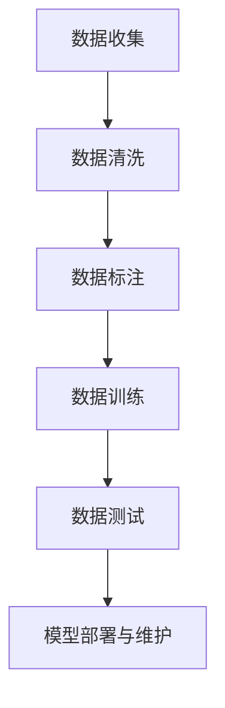

                 

# 人工智能创业数据管理的策略与方案研究

> 关键词：人工智能(AI)创业,数据管理,数据治理,数据治理策略,数据治理方案,数据治理技术,数据治理工具,数据治理最佳实践

## 1. 背景介绍

在人工智能(AI)创业的浪潮中，数据管理的地位至关重要。有效的数据管理不仅可以帮助创业公司高效地获取和利用数据资源，还能够在数据治理、数据安全、数据合规等方面提供有力保障，从而降低创业风险，提升AI产品的竞争力。本研究旨在从数据治理的视角，深入探讨人工智能创业中数据管理的策略与方案，以期为AI创业者提供实用的指导。

## 2. 核心概念与联系

### 2.1 核心概念概述

在数据治理的框架下，数据管理包括数据收集、数据清洗、数据标注、数据训练、数据测试等多个环节。这些环节共同构成了一个环环相扣、相互支持的数据治理体系。

- **数据收集**：从不同的数据源获取原始数据，包括公开数据集、网络爬取数据、行业数据等。
- **数据清洗**：对数据进行去重、去噪、填充缺失值、异常值处理等，以保证数据的质量。
- **数据标注**：为数据打上标签，以便训练模型，包括图像标注、文本标注、语音标注等。
- **数据训练**：使用标注数据训练模型，提升其预测和生成能力。
- **数据测试**：对模型进行测试评估，确保其稳定性和泛化能力。

### 2.2 核心概念联系

这些核心概念之间存在密切的联系，其相互关系可以通过以下Mermaid流程图表示：



数据收集是整个数据治理过程的起点，数据清洗、标注和训练是在数据的基础上进行的，而模型部署和维护则是对训练结果的进一步应用和优化。

## 3. 核心算法原理 & 具体操作步骤
### 3.1 算法原理概述

数据治理的核心算法包括数据预处理、特征工程、模型选择、超参数优化、模型评估等。这些算法通过一系列步骤，实现数据的有效管理和利用，为AI模型的训练和应用提供坚实基础。

### 3.2 算法步骤详解

以下详细介绍数据治理的每个步骤及其具体操作：

#### 3.2.1 数据收集

1. **数据源选择**：根据业务需求选择合适的数据源，如公开数据集、行业报告、网络爬虫等。
2. **数据采集工具**：使用ETL工具（如Apache Nifi、Azure Data Factory等）进行数据采集。
3. **数据源监控**：对数据源进行实时监控，确保数据的持续性、完整性和一致性。

#### 3.2.2 数据清洗

1. **数据去重**：使用哈希表、去重算法等技术对数据进行去重操作，去除重复记录。
2. **数据去噪**：使用过滤算法、噪声检测算法等技术对数据进行去噪，去除无用、错误的信息。
3. **数据填充**：使用插值算法、均值填补算法等技术对缺失值进行填补。
4. **异常值处理**：使用箱线图、IQR算法等技术识别并处理异常值，保证数据分布的合理性。

#### 3.2.3 数据标注

1. **标注工具选择**：选择适合的标注工具，如Labelbox、VLT等。
2. **标注流程设计**：设计标注流程，包括标注规范、标注样例等。
3. **标注质量控制**：对标注结果进行质量检查，确保标注的准确性和一致性。

#### 3.2.4 数据训练

1. **模型选择**：选择适合的AI模型，如卷积神经网络(CNN)、循环神经网络(RNN)、长短期记忆网络(LSTM)、Transformer等。
2. **超参数优化**：使用网格搜索、贝叶斯优化等技术对模型超参数进行优化。
3. **模型训练**：使用深度学习框架（如TensorFlow、PyTorch等）进行模型训练，确保模型性能。

#### 3.2.5 数据测试

1. **测试集划分**：将数据划分为训练集、验证集和测试集，确保模型在未知数据上的泛化能力。
2. **测试指标选择**：选择合适的测试指标，如准确率、召回率、F1分数等。
3. **测试结果分析**：对测试结果进行分析，查找模型不足并进行改进。

### 3.3 算法优缺点

数据治理的算法具有以下优点：

- **高效性**：通过自动化工具和技术，实现数据收集、清洗、标注等操作，提高数据处理的效率。
- **准确性**：使用先进的算法和工具，保证数据处理的准确性，减少人为错误。
- **灵活性**：可以根据具体业务需求和数据特点，灵活调整数据治理流程和策略。

同时，这些算法也存在一些缺点：

- **资源消耗高**：数据清洗、标注等操作需要大量计算资源，可能对计算资源造成压力。
- **复杂度高**：数据治理过程涉及多步骤、多环节，容易出错，需要仔细设计和监控。
- **依赖人工**：数据标注、质量控制等环节仍然需要人工介入，可能导致数据质量不稳定。

### 3.4 算法应用领域

数据治理的算法广泛应用于各个领域，以下是一些典型应用：

- **金融领域**：用于风险评估、欺诈检测、信用评分等任务。
- **医疗领域**：用于疾病诊断、治疗方案推荐、患者信息保护等任务。
- **零售领域**：用于客户行为分析、个性化推荐、库存管理等任务。
- **智能制造领域**：用于生产流程优化、设备故障预测、质量控制等任务。
- **自动驾驶领域**：用于环境感知、路径规划、决策制定等任务。

## 4. 数学模型和公式 & 详细讲解 & 举例说明

### 4.1 数学模型构建

数据治理的数学模型包括数据质量模型、特征选择模型、模型评估模型等。这些模型通过数学公式和算法，实现对数据的评估、选择和优化。

#### 4.2 公式推导过程

以下是一些关键的数学公式及其推导过程：

1. **数据质量模型**：
   - **完整性度量**：完整率 = 完整记录数 / 总记录数
   - **一致性度量**：一致性 = 一致记录数 / 总记录数
   - **准确性度量**：准确率 = 准确记录数 / 总记录数

2. **特征选择模型**：
   - **互信息**：互信息 = -ΣP(xi) * log(P(xi) / P(x))，其中P(xi)是特征xi取值在数据集X中出现的概率，P(x)是特征x在数据集X中出现的概率。
   - **卡方检验**：卡方统计量 = Σ(xi - E(xi))^2 / E(xi)，其中E(xi)是特征xi的期望值。

3. **模型评估模型**：
   - **准确率**：准确率 = TP / (TP + FP)
   - **召回率**：召回率 = TP / (TP + FN)
   - **F1分数**：F1分数 = 2 * 准确率 * 召回率 / (准确率 + 召回率)

### 4.3 案例分析与讲解

以金融领域为例，分析数据治理在风险评估中的具体应用：

1. **数据收集**：收集银行历史贷款数据、客户信息、信用评分数据等。
2. **数据清洗**：对数据进行去重、去噪、缺失值填充等操作，确保数据质量。
3. **数据标注**：对贷款申请数据进行标注，如违约、未违约等标签。
4. **数据训练**：使用标注数据训练风险评估模型，如逻辑回归、随机森林等。
5. **数据测试**：对模型进行测试评估，确保其泛化能力。
6. **模型部署与维护**：将模型部署到生产环境中，并持续监控其表现，进行必要的维护和更新。

## 5. 项目实践：代码实例和详细解释说明

### 5.1 开发环境搭建

以下是使用Python进行数据治理开发的典型环境配置流程：

1. **安装Python**：从官网下载并安装Python 3.x版本。
2. **安装数据治理工具**：如Apache Nifi、Labelbox等。
3. **安装深度学习框架**：如TensorFlow、PyTorch等。
4. **安装相关库**：如numpy、pandas、scikit-learn等。

### 5.2 源代码详细实现

以下是使用Python进行数据治理的典型代码实现：

```python
import pandas as pd
import numpy as np
from sklearn.model_selection import train_test_split
from sklearn.ensemble import RandomForestClassifier
from sklearn.metrics import accuracy_score

# 数据收集
data = pd.read_csv('data.csv')

# 数据清洗
data = data.drop_duplicates()
data = data.dropna()
data = data.drop('id', axis=1)

# 数据标注
data['label'] = data['default'].map({'yes': 1, 'no': 0})

# 数据训练
X = data.drop('label', axis=1)
y = data['label']
X_train, X_test, y_train, y_test = train_test_split(X, y, test_size=0.2, random_state=42)
model = RandomForestClassifier()
model.fit(X_train, y_train)

# 数据测试
y_pred = model.predict(X_test)
accuracy = accuracy_score(y_test, y_pred)
print('Accuracy:', accuracy)
```

### 5.3 代码解读与分析

这段代码实现了数据治理的基本流程：数据收集、清洗、标注、训练和测试。

- **数据收集**：使用Pandas库读取CSV文件，获取原始数据。
- **数据清洗**：使用Pandas库的drop_duplicates、dropna等方法进行数据去重、去噪和缺失值填充。
- **数据标注**：使用Pandas库的map方法将'default'列转换为二分类标签。
- **数据训练**：使用Scikit-learn库的train_test_split方法将数据划分为训练集和测试集，并使用RandomForestClassifier模型进行训练。
- **数据测试**：使用Scikit-learn库的accuracy_score方法计算模型在测试集上的准确率。

## 6. 实际应用场景

### 6.1 智能客服系统

智能客服系统通过数据治理，实现对客户咨询数据的收集、清洗、标注和分析，从而提供更精准的客户服务。具体步骤如下：

1. **数据收集**：收集客户咨询聊天记录。
2. **数据清洗**：对聊天记录进行去重、去噪、异常值处理等操作。
3. **数据标注**：对客户咨询请求进行标注，如问题类别、意图等。
4. **数据训练**：使用标注数据训练意图识别模型，如BERT、GPT等。
5. **数据测试**：对模型进行测试评估，确保其泛化能力。
6. **模型部署与维护**：将模型部署到客服系统中，并持续监控其表现，进行必要的维护和更新。

### 6.2 金融舆情监测

金融舆情监测通过数据治理，实现对金融市场数据的收集、清洗、标注和分析，从而及时发现市场波动和舆情变化。具体步骤如下：

1. **数据收集**：收集金融市场新闻、评论、财经报告等数据。
2. **数据清洗**：对数据进行去重、去噪、缺失值填充等操作。
3. **数据标注**：对数据进行情绪标注，如正向、中性、负向等。
4. **数据训练**：使用标注数据训练情绪分析模型，如LSTM、Transformer等。
5. **数据测试**：对模型进行测试评估，确保其泛化能力。
6. **模型部署与维护**：将模型部署到金融舆情监测系统中，并持续监控其表现，进行必要的维护和更新。

## 7. 工具和资源推荐

### 7.1 学习资源推荐

为了帮助AI创业者系统掌握数据治理的理论基础和实践技巧，以下是一些推荐的资源：

1. **《数据治理的艺术》**：全面介绍了数据治理的原理、方法和最佳实践，适合初学者和从业者阅读。
2. **《数据科学与人工智能：数据治理策略与实践》**：详细讲解了数据治理的各环节，包括数据收集、清洗、标注、训练、测试等。
3. **《Python数据治理实践》**：介绍了如何使用Python进行数据治理，包括数据清洗、特征工程、模型评估等。
4. **《数据治理框架与工具》**：介绍了主流的数据治理框架和工具，如Apache Nifi、Labelbox等。
5. **《深度学习数据治理技术》**：介绍了深度学习在数据治理中的应用，包括数据预处理、特征选择、模型评估等。

### 7.2 开发工具推荐

以下是一些常用的数据治理开发工具：

1. **Apache Nifi**：数据集成和流处理工具，支持大规模数据采集、清洗、转换和加载。
2. **Labelbox**：数据标注工具，支持文本、图像、视频等多模态数据的标注和管理。
3. **VLT**：开源的数据标注平台，支持大规模数据标注任务。
4. **H2O.ai**：数据科学和机器学习平台，支持数据治理和模型训练。
5. **Azure Data Factory**：云数据治理和集成平台，支持数据采集、清洗、转换和加载。

### 7.3 相关论文推荐

以下是几篇经典的数据治理论文，推荐阅读：

1. **《数据治理的原理与实践》**：详细介绍了数据治理的基本原理和最佳实践，是数据治理领域的经典之作。
2. **《数据治理的挑战与解决方案》**：分析了数据治理面临的挑战，并提出了一些有效的解决方案。
3. **《基于深度学习的智能数据治理》**：探讨了深度学习在数据治理中的应用，展示了其强大的性能和潜力。
4. **《数据治理的未来趋势》**：分析了数据治理的未来发展趋势，预测了未来技术的发展方向。

## 8. 总结：未来发展趋势与挑战

### 8.1 总结

本文对人工智能创业中的数据治理策略与方案进行了全面系统的探讨。首先，从数据治理的视角，深入介绍了AI创业中数据管理的核心概念和操作步骤。其次，从数学模型和公式的角度，详细讲解了数据治理的数学原理和具体应用。最后，结合实际应用场景，提出了数据治理在智能客服、金融舆情监测等领域的解决方案，并推荐了一些有用的学习资源和开发工具。

通过本文的系统梳理，可以看到，数据治理在AI创业中扮演着至关重要的角色，能够帮助创业者高效地获取和利用数据资源，降低创业风险，提升AI产品的竞争力。未来，伴随数据治理技术的不断演进，数据治理将成为AI创业的重要支撑，推动AI技术在更多领域的应用和落地。

### 8.2 未来发展趋势

展望未来，数据治理技术将呈现以下几个发展趋势：

1. **自动化与智能化**：随着人工智能技术的进步，数据治理将越来越自动化、智能化，减少人工干预，提升数据治理效率。
2. **多模态融合**：数据治理将不再局限于单一模态，而是融合文本、图像、语音等多种模态数据，提升数据治理的全面性和多样性。
3. **云计算支持**：随着云计算技术的普及，数据治理将越来越多地利用云平台提供的资源和服务，实现数据的分布式存储和处理。
4. **边缘计算支持**：数据治理将越来越多地利用边缘计算技术，实现数据的本地化处理和实时化处理，提升数据治理的时效性。
5. **AI嵌入**：数据治理将越来越多地利用AI技术，如深度学习、自然语言处理等，提升数据治理的智能化和自动化水平。

### 8.3 面临的挑战

尽管数据治理技术已经取得了长足进展，但在迈向更加智能化、普适化应用的过程中，它仍面临着诸多挑战：

1. **数据隐私与安全**：如何在数据治理中保证数据的隐私和安全，防止数据泄露和滥用，是一个重要的问题。
2. **数据质量控制**：如何在数据治理中保证数据的质量和一致性，防止数据错误和偏差，是一个重要的挑战。
3. **数据治理流程优化**：如何在数据治理中提高流程效率，减少人工干预，是一个重要的课题。
4. **数据治理工具集成**：如何在数据治理中集成多种工具和技术，实现数据治理的全流程自动化，是一个重要的难点。
5. **数据治理标准与规范**：如何在数据治理中制定统一的标准和规范，确保数据治理的一致性和规范性，是一个重要的方向。

### 8.4 研究展望

面向未来，数据治理技术需要在以下几个方面寻求新的突破：

1. **自动化与智能化**：进一步提高数据治理的自动化和智能化水平，减少人工干预，提升数据治理效率。
2. **多模态融合**：实现多模态数据的融合与处理，提升数据治理的全面性和多样性。
3. **云计算与边缘计算支持**：利用云计算与边缘计算技术，实现数据的分布式存储和处理，提升数据治理的时效性。
4. **AI嵌入**：利用AI技术，提升数据治理的智能化和自动化水平，实现数据治理的智能化转型。
5. **数据治理标准与规范**：制定统一的数据治理标准和规范，确保数据治理的一致性和规范性。

## 9. 附录：常见问题与解答

**Q1：数据治理是否适用于所有AI应用场景？**

A: 数据治理适用于大多数AI应用场景，尤其是在数据密集型任务中，如金融、医疗、智能制造等。但对于一些对数据要求较低的任务，如一些简单的图像识别、文本分类等，数据治理可能并不是必需的。

**Q2：数据治理与数据管理有何区别？**

A: 数据治理是数据管理的一部分，主要关注数据的质量、安全、合规等方面，强调数据的全生命周期管理和持续优化。数据管理则更广泛，包括数据的收集、存储、处理、分析等多个方面。

**Q3：数据治理的流程中，哪些环节需要人工介入？**

A: 数据标注、数据质量控制等环节仍然需要人工介入，因为数据治理的最终目的是为人服务，而人的理解和判断能力在很多时候是不可替代的。

**Q4：数据治理的挑战如何应对？**

A: 应对数据治理挑战的方法包括：

- **数据隐私与安全**：采用加密技术、数据脱敏技术等手段，保护数据隐私和安全。
- **数据质量控制**：采用先进的算法和技术，如数据清洗、数据去噪等手段，提高数据质量。
- **数据治理流程优化**：采用自动化工具和智能化技术，减少人工干预，提高治理效率。
- **数据治理工具集成**：采用集成平台和框架，实现数据治理的全流程自动化。
- **数据治理标准与规范**：制定统一的数据治理标准和规范，确保治理的一致性和规范性。

---

作者：禅与计算机程序设计艺术 / Zen and the Art of Computer Programming

