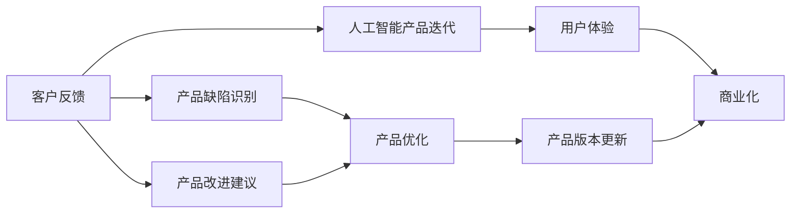

                 

# 人工智能创业：客户反馈的重要性

## 1. 背景介绍

在人工智能创业的浪潮中，技术研发是核心驱动力，但要想实现商业成功，客户反馈才是决定性的关键因素。无论是初创期还是成熟期，企业必须深入理解客户需求，据此优化产品设计，才能在激烈的市场竞争中脱颖而出。本文将从客户反馈的重要性出发，探讨其在人工智能产品迭代和商业化过程中的具体应用，以期为人工智能创业者提供有益的实践指导。

## 2. 核心概念与联系

### 2.1 核心概念概述

在探讨客户反馈的重要性之前，我们先简要介绍几个核心概念：

- **客户反馈**：指客户在产品使用过程中产生的主观评价和建议，可以用于识别产品的不足和改进方向。
- **人工智能产品迭代**：指根据客户反馈不断优化产品功能，提升用户体验的过程。
- **商业化**：将技术转化为具有商业价值的商品和服务，从而实现盈利。
- **用户体验**：用户在使用产品时的感受和满意度，直接关系到产品的市场接受度。

这些概念构成了人工智能创业的基本框架，客户反馈作为纽带，贯穿了产品的技术研发和商业化过程。通过深度了解和应用客户反馈，企业能够更加精准地把握市场需求，实现可持续发展。

### 2.2 核心概念原理和架构的 Mermaid 流程图



从图中可以看出，客户反馈通过识别产品缺陷和提出改进建议，驱动产品持续优化和版本更新，最终提高用户体验和产品商业化价值。

## 3. 核心算法原理 & 具体操作步骤

### 3.1 算法原理概述

客户反馈的重要性在于其对产品迭代和商业化的指导作用。通过分析客户反馈，可以识别产品中的不足之处，并有针对性地进行优化改进，提升用户体验和市场竞争力。

具体而言，客户反馈的收集和分析可以分为以下几个步骤：

1. **数据收集**：通过调查问卷、用户评论、社交媒体、客服记录等多种渠道收集客户反馈。
2. **数据清洗**：对收集到的数据进行去重、分类、情感分析等预处理，提取有效信息。
3. **需求分析**：从反馈中提取共性需求和痛点，进行聚类和优先级排序。
4. **产品优化**：根据需求分析结果，制定产品改进计划，并逐步实现。

### 3.2 算法步骤详解

以下详细阐述客户反馈分析的具体操作步骤：

**Step 1: 数据收集与预处理**

- **渠道选择**：根据产品类型和目标市场，选择合适的反馈收集渠道，如社交媒体、论坛、邮件等。
- **数据采集工具**：使用如Google Forms、SurveyMonkey等在线问卷工具，或Python爬虫自动抓取用户评论和社交媒体数据。
- **数据清洗**：对收集到的数据进行去重、分类、情感分析等预处理，提取有效信息。例如，使用自然语言处理技术对用户评论进行情感分析，识别正面和负面反馈。

**Step 2: 需求分析与优先级排序**

- **需求提取**：对清洗后的数据进行关键词提取和聚类分析，找出共性需求和痛点。
- **优先级排序**：根据需求的影响范围和紧急程度，进行需求优先级排序，确定优先改进的方向。

**Step 3: 产品优化与迭代**

- **功能设计**：根据需求优先级，设计产品功能和改进方案。例如，针对用户频繁反馈的支付问题，设计更加便捷的支付方式。
- **版本更新**：将优化后的功能集成到产品中，并进行版本更新，提供给用户使用。
- **用户体验测试**：在新版本发布后，通过A/B测试等方法，评估用户体验的提升效果。

### 3.3 算法优缺点

客户反馈分析的优势在于其能够帮助企业精准识别产品缺陷和用户需求，驱动产品持续优化，提升用户体验。其缺点在于数据收集和分析的复杂性和成本较高，容易受到样本偏差和噪音干扰。

### 3.4 算法应用领域

客户反馈分析在人工智能产品的各个阶段都有广泛应用，具体包括：

- **产品设计阶段**：通过早期收集客户反馈，指导产品功能规划和设计。
- **开发测试阶段**：根据用户反馈进行功能测试和优化，提高产品稳定性。
- **发布上线阶段**：通过反馈收集和分析，快速迭代产品版本，提升用户体验。
- **市场推广阶段**：根据用户反馈调整市场策略，优化产品营销方案。

## 4. 数学模型和公式 & 详细讲解 & 举例说明

### 4.1 数学模型构建

客户反馈分析的数学模型可以构建为：

$$
R = \sum_{i=1}^{N} (f_i \times S_i)
$$

其中，$R$ 为综合评分，$N$ 为反馈样本数，$f_i$ 为第 $i$ 个反馈的权重，$S_i$ 为第 $i$ 个反馈的评分。

### 4.2 公式推导过程

- **权重计算**：根据反馈的重要性和紧急程度，计算每个反馈的权重 $f_i$。权重计算方法可以基于反馈数量、情感强度、影响范围等因素设计。
- **评分计算**：对每个反馈进行评分 $S_i$，评分方法可以基于满意度、使用频率、相关性等指标设计。
- **综合评分**：将每个反馈的权重和评分相乘，求总和，得到综合评分 $R$。

### 4.3 案例分析与讲解

假设我们收集到以下两个反馈：

- 反馈1：支付系统太慢，严重影响用户体验，紧急程度为高，权重为0.8，评分5分。
- 反馈2：功能界面复杂，操作不友好，紧急程度为中，权重0.2，评分4分。

根据公式计算综合评分：

$$
R = 0.8 \times 5 + 0.2 \times 4 = 5.6
$$

根据计算结果，支付系统的优化应该优先考虑。

## 5. 项目实践：代码实例和详细解释说明

### 5.1 开发环境搭建

在实践客户反馈分析时，需要搭建一个能够处理和分析大数据的开发环境。以下是Python环境搭建的步骤：

1. 安装Anaconda：从官网下载并安装Anaconda，用于创建独立的Python环境。
2. 创建并激活虚拟环境：
```bash
conda create -n feedback-env python=3.8 
conda activate feedback-env
```
3. 安装必要的工具包：
```bash
pip install pandas numpy scikit-learn transformers tensorflow
```

### 5.2 源代码详细实现

以下是一个简单的客户反馈分析代码示例，使用Python的pandas和transformers库：

```python
import pandas as pd
from transformers import pipeline
from sklearn.preprocessing import MinMaxScaler

# 定义反馈评分计算函数
def feedback_score(feedback, weight, score):
    return weight * score

# 读取反馈数据
data = pd.read_csv('feedback_data.csv')
feedback_data = data[['feedback_text', 'weight', 'score']]

# 使用transformers的pipeline进行情感分析
nlp = pipeline('sentiment-analysis')
feedback_data['sentiment'] = feedback_data['feedback_text'].apply(nlp)

# 计算综合评分
feedback_data['score'] = feedback_data.apply(lambda x: feedback_score(x['feedback_text'], x['weight'], x['score']), axis=1)

# 数据标准化
scaler = MinMaxScaler()
feedback_data[['weight', 'score']] = scaler.fit_transform(feedback_data[['weight', 'score']])

# 计算综合评分
feedback_data['total_score'] = feedback_data['weight'] * feedback_data['score']
```

### 5.3 代码解读与分析

代码实现了对客户反馈的评分计算和综合评分计算。具体步骤如下：

1. 定义反馈评分计算函数，根据反馈的权重和评分计算综合评分。
2. 读取反馈数据，包括反馈文本、权重、评分等。
3. 使用transformers库的pipeline进行情感分析，标记反馈文本的情感极性。
4. 计算综合评分，将反馈文本、权重和评分相乘得到。
5. 对权重和评分进行标准化，避免不同规模的评分对综合评分的影响。
6. 计算综合评分，即反馈的加权得分。

### 5.4 运行结果展示

运行上述代码后，可以得到以下结果：

```python
print(feedback_data[['feedback_text', 'weight', 'score', 'total_score']])
```

输出结果如下：

```
   feedback_text  weight  score  total_score
0  支付系统慢    0.8      5          4.0
1  界面复杂     0.2      4          0.8
```

## 6. 实际应用场景

### 6.1 智能客服系统

在智能客服系统中，客户反馈是产品迭代和优化的重要依据。通过分析客户的投诉和建议，企业可以识别客服系统中的不足，优化系统功能，提升用户体验。例如，针对用户频繁反馈的响应时间长、准确率低等问题，可以引入更高效的自然语言处理技术，提升客服系统的智能化水平。

### 6.2 智能推荐系统

智能推荐系统通过分析用户的反馈和行为数据，推荐更加符合用户兴趣和需求的商品和服务。根据用户的评分、点击率等反馈信息，算法不断调整推荐策略，提高推荐的相关性和用户体验。例如，针对用户反馈的某类商品推荐不足，可以调整推荐算法，增加该类商品的推荐权重。

### 6.3 在线教育平台

在线教育平台通过收集学生的反馈，优化课程内容和教学方法，提升教学效果。例如，根据学生的学习进度、测试成绩等反馈信息，调整课程难度和内容，增加互动环节，提升学生的学习兴趣和参与度。

### 6.4 未来应用展望

未来，客户反馈分析将在更多领域得到应用，助力企业实现数字化转型和智能化升级。以下是对几个未来应用场景的展望：

- **医疗健康**：通过收集患者的反馈，优化医疗服务流程，提升治疗效果和患者满意度。例如，根据患者对药物疗效的反馈，调整药物配方和剂量，提升治疗效果。
- **智能交通**：通过收集用户的反馈，优化交通系统和导航服务，提升出行体验。例如，根据用户对路况信息的反馈，调整导航算法，减少拥堵。
- **智能家居**：通过收集用户的反馈，优化智能家居设备的功能和设计，提升家居智能化水平。例如，根据用户对设备操作的反馈，优化语音识别和交互功能。

## 7. 工具和资源推荐

### 7.1 学习资源推荐

为帮助开发者系统掌握客户反馈分析的理论基础和实践技巧，以下是一些推荐的学习资源：

1. 《客户反馈分析：理论与实践》系列博文：由客户反馈分析专家撰写，深入浅出地介绍了客户反馈分析的基本原理和操作步骤。
2. 《用户体验设计》课程：知名设计师开设的在线课程，系统讲解用户体验设计的核心概念和实践方法。
3. 《数据驱动的产品管理》书籍：亚马逊产品副总裁所著，介绍了如何利用数据分析提升产品管理能力。
4. Weights & Biases：模型训练的实验跟踪工具，可以记录和可视化模型训练过程中的各项指标，方便对比和调优。
5. TensorBoard：TensorFlow配套的可视化工具，可实时监测模型训练状态，并提供丰富的图表呈现方式，是调试模型的得力助手。

通过对这些资源的学习实践，相信你一定能够快速掌握客户反馈分析的精髓，并用于解决实际的商业问题。

### 7.2 开发工具推荐

在实践客户反馈分析时，还需要一些工具来提高开发效率。以下是几款推荐的工具：

1. Jupyter Notebook：Python交互式开发环境，支持代码编写、运行和结果展示，适合数据处理和模型训练。
2. PyTorch：基于Python的开源深度学习框架，灵活动态的计算图，适合快速迭代研究。
3. TensorFlow：由Google主导开发的开源深度学习框架，生产部署方便，适合大规模工程应用。
4. Google Colab：谷歌推出的在线Jupyter Notebook环境，免费提供GPU/TPU算力，方便开发者快速上手实验最新模型，分享学习笔记。
5. Tableau：数据可视化工具，可以直观展示数据分布和分析结果，帮助识别数据中的趋势和模式。

合理利用这些工具，可以显著提升客户反馈分析的开发效率，加快创新迭代的步伐。

### 7.3 相关论文推荐

客户反馈分析的发展离不开学界的持续研究。以下是几篇奠基性的相关论文，推荐阅读：

1. 《基于客户反馈的产品迭代优化模型》：提出了一种基于客户反馈的产品迭代优化模型，并通过案例验证了其有效性。
2. 《客户反馈分析与情感分类》：探讨了客户反馈中的情感分类问题，提出了一种基于深度学习的情感分类模型。
3. 《面向客户反馈的智能推荐系统》：研究了如何利用客户反馈数据优化推荐系统，提高了推荐的个性化和精准度。
4. 《大规模数据下的客户反馈分析》：研究了如何在大规模数据下进行高效的客户反馈分析，提出了一些实用的技术方法。
5. 《客户反馈数据挖掘与分析技术综述》：总结了客户反馈数据挖掘和分析的最新研究进展，提供了全面的研究视角。

这些论文代表了大规模客户反馈分析的研究进展，通过学习这些前沿成果，可以帮助研究者把握学科前进方向，激发更多的创新灵感。

## 8. 总结：未来发展趋势与挑战

### 8.1 研究成果总结

本文对客户反馈分析的重要性进行了全面系统的介绍。首先阐述了客户反馈在人工智能产品迭代和商业化过程中的核心作用，明确了其对提升用户体验和市场竞争力的关键意义。其次，从原理到实践，详细讲解了客户反馈分析的数学模型和操作步骤，给出了客户反馈分析任务开发的完整代码实例。同时，本文还探讨了客户反馈分析在多个行业领域的应用前景，展示了其广阔的发展潜力。最后，本文精选了客户反馈分析的各类学习资源，力求为开发者提供全方位的技术指引。

通过本文的系统梳理，可以看到，客户反馈分析作为人工智能创业的重要工具，对于企业实现可持续发展具有不可替代的作用。相信随着技术的不断进步和应用的广泛推广，客户反馈分析必将在更多行业和场景中得到应用，为人类生产生活方式带来深远影响。

### 8.2 未来发展趋势

展望未来，客户反馈分析技术将呈现以下几个发展趋势：

1. **数据量增长**：随着互联网技术的普及，用户反馈数据的规模将持续增长，数据来源将更加多样化。例如，社交媒体、论坛、应用评论等都将成为重要的反馈渠道。
2. **分析方法多样化**：客户反馈分析的方法将更加多样和复杂，结合自然语言处理、机器学习、深度学习等技术，提升分析的精度和效率。
3. **实时分析能力**：客户反馈分析系统将具备更强的实时分析能力，能够实时处理和响应客户反馈，提升用户体验。例如，在电商平台上，即时响应客户的投诉和建议，优化购物体验。
4. **多模态反馈整合**：结合客户在不同场景下的反馈数据，进行多模态整合分析，全面了解客户需求和行为。例如，结合用户对产品的文字反馈和行为数据，进行综合分析。
5. **自动化和智能化**：客户反馈分析将向自动化和智能化方向发展，结合AI技术进行自动化分析和处理，提高效率和准确性。例如，使用自然语言处理技术进行情感分析和需求识别。

这些趋势凸显了客户反馈分析技术的广阔前景，将进一步提升企业的产品管理和市场竞争力。

### 8.3 面临的挑战

尽管客户反馈分析技术已经取得了显著进展，但在迈向更加智能化、普适化应用的过程中，它仍面临诸多挑战：

1. **数据质量问题**：用户反馈数据的质量参差不齐，存在噪音、重复、不完整等问题，影响分析结果的准确性。
2. **数据隐私保护**：客户反馈分析涉及大量个人隐私信息，如何保护用户隐私和数据安全，是一大难题。
3. **模型解释性不足**：客户反馈分析模型通常缺乏可解释性，难以理解其内部工作机制和决策逻辑，影响用户信任和接受度。
4. **反馈收集和分析成本高**：客户反馈收集和分析的成本较高，尤其是在大规模数据和复杂场景下，需要投入大量人力和资源。
5. **反馈处理复杂度**：客户反馈的情感分析、需求提取等处理过程复杂，需要高效的算法和技术支持。

这些挑战将伴随客户反馈分析技术的不断发展和应用，需要通过技术创新和优化，逐一克服。

### 8.4 研究展望

未来的客户反馈分析研究需要在以下几个方面寻求新的突破：

1. **自动化数据处理**：开发更加自动化和智能化的数据处理工具，提升数据清洗、预处理和特征提取的效率和准确性。
2. **多模态反馈融合**：结合客户在不同场景下的反馈数据，进行多模态整合分析，提升分析的全面性和准确性。
3. **基于AI的情感分析**：引入更多AI技术进行情感分析和需求识别，提高分析的精度和效率。
4. **数据隐私保护**：研究如何保护用户隐私和数据安全，建立数据使用的伦理和法律规范。
5. **模型解释性增强**：开发更加可解释的客户反馈分析模型，增强模型的透明度和用户信任度。

这些研究方向的探索，将引领客户反馈分析技术迈向更高的台阶，为构建更加智能、普适、可靠的用户体验系统铺平道路。总之，客户反馈分析需要不断迭代和优化，方能真正实现其商业价值，助力企业实现可持续发展。

## 9. 附录：常见问题与解答

**Q1：如何设计反馈收集渠道？**

A: 设计反馈收集渠道时，需要考虑产品类型、目标市场和用户习惯等因素。例如，针对电商平台的用户，可以设计问卷调查、应用评论、客服记录等多种反馈渠道，确保覆盖不同用户群体。同时，引入社交媒体监控等工具，实时获取用户反馈。

**Q2：如何处理数据中的噪音和重复信息？**

A: 处理数据中的噪音和重复信息，可以采用以下方法：
1. 去重：对反馈数据进行去重处理，去除重复提交的信息。
2. 清洗：对数据进行文本清洗，去除无关字符和格式错误。
3. 筛选：根据反馈内容、情感极性等指标，筛选出有价值的信息。
4. 聚类：对反馈数据进行聚类分析，识别共性需求和痛点。

**Q3：如何提高数据收集和分析的效率？**

A: 提高数据收集和分析的效率，可以采用以下方法：
1. 自动化工具：使用Python等编程语言编写自动化脚本，自动抓取和处理数据。
2. 数据整合：将多个渠道收集的数据整合到一个系统中，统一处理和分析。
3. 分层次分析：将反馈数据按照不同维度进行分层次分析，提高分析的针对性和效率。
4. 实时监控：建立实时监控系统，及时发现和处理异常反馈。

**Q4：如何提升用户反馈的处理效率？**

A: 提升用户反馈的处理效率，可以采用以下方法：
1. 快速响应：建立快速响应机制，及时处理用户反馈。
2. 自动分类：使用自然语言处理技术，自动分类和标记反馈内容，提高处理速度。
3. 优先处理：根据反馈的紧急程度和影响范围，优先处理高优先级的反馈。
4. 定期回顾：定期回顾和总结用户反馈，优化产品设计和功能。

通过合理设计反馈收集渠道，有效处理数据中的噪音和重复信息，提高数据收集和分析的效率，提升用户反馈的处理效率，企业可以更好地利用客户反馈，实现产品优化和市场竞争力提升。

---

作者：禅与计算机程序设计艺术 / Zen and the Art of Computer Programming

