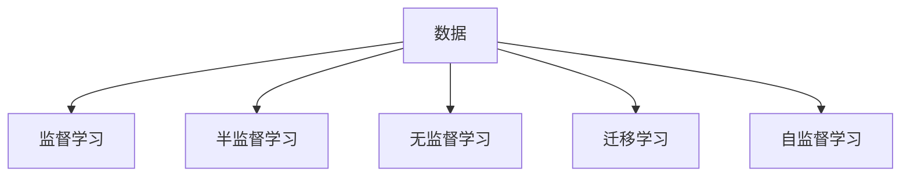

                 

# 人工智能创业：数据核心地位

人工智能(AI)已经从一个遥远的概念发展成为现实。从机器学习、深度学习，到最近的生成对抗网络(GAN)，AI技术不断演化，并且在各个领域展现出强大的应用潜力。但即便如此，一个简单的事实依然存在：对于AI创业者而言，**数据**无疑是核心地位。

## 1. 背景介绍

### 1.1 人工智能发展的历史

AI的历史可以追溯到上世纪五、六十年代，但直到最近十年，在深度学习和大数据等技术的推动下，AI才开始走向实用。从AlphaGo的胜利到ChatGPT的横空出世，AI技术正在以不可逆转的趋势进入大众生活。

### 1.2 数据在人工智能中的重要性

AI的算法与模型大多建立在大量数据之上。无论是监督学习、半监督学习，还是无监督学习，数据都是必不可少的。无论是图像识别、语音识别、自然语言处理，还是游戏AI，数据的重要性不言而喻。

### 1.3 当前AI创业生态

AI创业生态正在蓬勃发展。越来越多的AI公司、初创企业和研究机构涌现，推动了AI技术的进步与应用。从学术界到企业界，AI技术的创新与应用无处不在。

## 2. 核心概念与联系

### 2.1 核心概念概述

为更好地理解数据在AI创业中的核心地位，本节将介绍几个关键概念：

- **数据驱动**：指AI模型的构建与训练完全依赖于数据，通过大量标注数据训练出的模型才能具有较好的泛化能力。
- **监督学习**：通过有标签数据训练模型，使其学习数据与标签之间的映射关系。
- **半监督学习**：使用少量有标签数据和大量无标签数据训练模型，提高模型的泛化能力。
- **无监督学习**：使用无标签数据训练模型，发现数据中隐含的统计规律与结构。
- **迁移学习**：通过已有数据集的模型，在新数据集上进行微调，提高模型在新数据集上的性能。
- **自监督学习**：通过自相关数据训练模型，即模型通过自身结构产生的输出作为监督信号。

这些概念之间的逻辑关系可以通过以下Mermaid流程图来展示：



这个流程图展示了数据的中心地位，以及AI学习范式的多样性和复杂性。

## 3. 核心算法原理 & 具体操作步骤

### 3.1 算法原理概述

AI的核心算法原理是基于数据的，通过训练数据集，使模型学习数据与标签之间的映射关系。以深度学习为例，模型通过反向传播算法优化参数，使得预测结果尽可能接近真实标签，从而实现对数据的泛化。

### 3.2 算法步骤详解

AI算法步骤一般包括以下几个关键步骤：

**Step 1: 准备数据集**
- 收集和标注数据集，将其划分为训练集、验证集和测试集。训练集用于模型训练，验证集用于超参数调优，测试集用于模型评估。

**Step 2: 设计模型结构**
- 根据任务类型，选择合适的模型结构，如卷积神经网络(CNN)、循环神经网络(RNN)、长短时记忆网络(LSTM)等。

**Step 3: 训练模型**
- 使用训练集数据进行模型训练，通过反向传播算法优化模型参数。
- 使用验证集数据进行模型评估和超参数调优。

**Step 4: 测试模型**
- 使用测试集数据评估模型性能，验证模型的泛化能力。

**Step 5: 模型部署**
- 将训练好的模型部署到实际应用场景中，进行推理预测。

### 3.3 算法优缺点

数据驱动的AI算法具有以下优点：
- 数据量大，模型性能通常较好。
- 算法灵活，可应对多种任务。

同时，数据驱动的AI算法也存在以下缺点：
- 数据质量对模型性能影响较大。
- 数据收集与标注成本较高。
- 模型复杂度较高，训练与推理资源需求较大。

### 3.4 算法应用领域

数据驱动的AI算法在各个领域均有广泛应用：

- **医疗**：使用医学影像、电子病历等数据，训练AI模型进行疾病诊断、药物研发等。
- **金融**：使用交易数据、客户行为数据等，训练AI模型进行风险评估、投资策略优化等。
- **零售**：使用用户行为数据、交易数据等，训练AI模型进行个性化推荐、需求预测等。
- **制造**：使用设备数据、生产数据等，训练AI模型进行质量控制、生产调度等。
- **智能交通**：使用车辆数据、交通数据等，训练AI模型进行智能导航、事故预测等。

## 4. 数学模型和公式 & 详细讲解

### 4.1 数学模型构建

AI模型通常基于机器学习、深度学习等算法，以最大化预测结果与真实标签的匹配度。以深度学习为例，模型由多个神经网络层组成，每层包含多个神经元，通过前向传播计算每个神经元的激活值，最终输出预测结果。

### 4.2 公式推导过程

以线性回归为例，假设模型输入为 $x$，输出为 $y$，模型参数为 $\theta$，则线性回归模型的目标是最小化均方误差：

$$
\min_{\theta} \frac{1}{2m} \sum_{i=1}^{m} (y^{(i)} - h_{\theta}(x^{(i)}))^2
$$

其中 $h_{\theta}(x)$ 为模型输出，$y^{(i)}$ 为真实标签。

线性回归的参数更新公式为：

$$
\theta_j \leftarrow \theta_j - \alpha \frac{1}{m} \sum_{i=1}^{m} (y^{(i)} - h_{\theta}(x^{(i)})) x_j^{(i)}
$$

其中 $\alpha$ 为学习率，$x_j$ 为输入向量中的第 $j$ 个特征。

### 4.3 案例分析与讲解

以图像分类为例，假设输入为 $x \in R^{m \times n}$，输出为 $y \in \{1,2,3,\dots,C\}$，其中 $C$ 为类别数，模型参数为 $\theta$，则卷积神经网络的目标是最小化交叉熵损失：

$$
\min_{\theta} \frac{1}{N} \sum_{i=1}^{N} L(h_{\theta}(x^{(i)}),y^{(i)})
$$

其中 $L$ 为交叉熵损失函数：

$$
L(y,\hat{y}) = -\frac{1}{N} \sum_{i=1}^{N} (y^{(i)} \log \hat{y}^{(i)} + (1 - y^{(i)}) \log (1 - \hat{y}^{(i)}))
$$

其中 $\hat{y}$ 为模型的预测结果。

## 5. 项目实践：代码实例和详细解释说明

### 5.1 开发环境搭建

在进行AI项目实践前，我们需要准备好开发环境。以下是使用Python进行TensorFlow开发的环境配置流程：

1. 安装Anaconda：从官网下载并安装Anaconda，用于创建独立的Python环境。

2. 创建并激活虚拟环境：
```bash
conda create -n tf-env python=3.8 
conda activate tf-env
```

3. 安装TensorFlow：根据CUDA版本，从官网获取对应的安装命令。例如：
```bash
conda install tensorflow -c conda-forge -c pypi
```

4. 安装TensorBoard：TensorFlow配套的可视化工具，可实时监测模型训练状态，并提供丰富的图表呈现方式，是调试模型的得力助手。

5. 安装Keras：高层次的神经网络API，简化TensorFlow模型的构建过程。

```bash
pip install keras
```

完成上述步骤后，即可在`tf-env`环境中开始AI项目实践。

### 5.2 源代码详细实现

这里我们以图像分类为例，给出使用TensorFlow进行模型训练的Python代码实现。

```python
import tensorflow as tf
from tensorflow.keras import datasets, layers, models

# 加载数据集
(train_images, train_labels), (test_images, test_labels) = datasets.cifar10.load_data()

# 数据预处理
train_images, test_images = train_images / 255.0, test_images / 255.0

# 定义模型
model = models.Sequential([
    layers.Conv2D(32, (3, 3), activation='relu', input_shape=(32, 32, 3)),
    layers.MaxPooling2D((2, 2)),
    layers.Conv2D(64, (3, 3), activation='relu'),
    layers.MaxPooling2D((2, 2)),
    layers.Conv2D(64, (3, 3), activation='relu'),
    layers.Flatten(),
    layers.Dense(64, activation='relu'),
    layers.Dense(10)
])

# 编译模型
model.compile(optimizer='adam',
              loss=tf.keras.losses.SparseCategoricalCrossentropy(from_logits=True),
              metrics=['accuracy'])

# 训练模型
history = model.fit(train_images, train_labels, epochs=10, 
                    validation_data=(test_images, test_labels))

# 评估模型
test_loss, test_acc = model.evaluate(test_images, test_labels)
print('Test accuracy:', test_acc)
```

### 5.3 代码解读与分析

让我们再详细解读一下关键代码的实现细节：

**数据加载和预处理**：
- 使用CIFAR-10数据集进行图像分类任务。
- 数据预处理包括归一化，将像素值缩放到 [0,1] 之间。

**模型定义**：
- 定义了包含卷积、池化、全连接层的卷积神经网络模型。
- 使用 `from_logits=True` 指定输出不是Softmax函数，而是原始的logits。

**模型编译与训练**：
- 使用 `adam` 优化器，交叉熵损失函数。
- 使用 `fit` 方法进行模型训练，设置训练轮数为 10。

**模型评估**：
- 使用 `evaluate` 方法在测试集上评估模型性能。
- 输出测试集准确率。

## 6. 实际应用场景

### 6.1 医疗影像诊断

AI在医疗影像诊断中的应用已经取得了显著进展。使用医疗影像数据集，训练AI模型进行疾病诊断和影像分割，显著提高了医生的诊断速度和准确性。

**案例分析**：
- 某医院使用AI模型对乳腺癌影像进行分类，使用大规模医疗影像数据集进行训练，显著提升了诊断的准确率和效率。

### 6.2 智能客服系统

AI驱动的智能客服系统已经成为企业的标配。使用客户对话数据集，训练AI模型进行自然语言理解和对话生成，能够提供24/7的客户服务，提升客户满意度。

**案例分析**：
- 某电商平台使用AI模型进行智能客服，使用客户对话数据集进行训练，能够快速响应客户咨询，解决常见问题。

### 6.3 金融风险评估

AI在金融领域的应用也在不断扩展。使用客户行为数据和交易数据，训练AI模型进行风险评估和投资策略优化，提升了金融机构的竞争力。

**案例分析**：
- 某保险公司使用AI模型进行客户风险评估，使用客户行为数据进行训练，能够有效识别高风险客户，降低欺诈风险。

## 7. 工具和资源推荐

### 7.1 学习资源推荐

为了帮助开发者系统掌握AI的理论基础和实践技巧，这里推荐一些优质的学习资源：

1. 《深度学习》系列书籍：由吴恩达教授撰写，全面介绍了深度学习的基本概念和算法。

2. Coursera《机器学习》课程：由斯坦福大学Andrew Ng教授主讲，涵盖机器学习的基本概念和算法。

3. Kaggle竞赛平台：提供大量的数据集和比赛项目，助力数据驱动的AI项目开发。

4. TensorFlow官方文档：包含详细的TensorFlow API文档和教程，是学习TensorFlow的好资源。

5. Keras官方文档：高层次的神经网络API，易于上手。

通过对这些资源的学习实践，相信你一定能够快速掌握AI的精髓，并用于解决实际的AI问题。

### 7.2 开发工具推荐

高效的开发离不开优秀的工具支持。以下是几款用于AI项目开发的常用工具：

1. TensorFlow：由Google主导开发的开源深度学习框架，生产部署方便，适合大规模工程应用。

2. PyTorch：基于Python的开源深度学习框架，灵活动态的计算图，适合快速迭代研究。

3. Keras：高层次的神经网络API，简化TensorFlow模型的构建过程。

4. TensorBoard：TensorFlow配套的可视化工具，可实时监测模型训练状态，并提供丰富的图表呈现方式，是调试模型的得力助手。

5. Jupyter Notebook：免费的交互式编程环境，适合快速开发与调试AI模型。

合理利用这些工具，可以显著提升AI项目开发的效率，加快创新迭代的步伐。

### 7.3 相关论文推荐

AI研究的发展离不开学界的持续努力。以下是几篇奠基性的相关论文，推荐阅读：

1. ImageNet Classification with Deep Convolutional Neural Networks：提出卷积神经网络，用于图像分类任务。

2. Google's Neural Machine Translation System：使用神经机器翻译模型，实现高质量的机器翻译。

3. AlphaGo Zero：提出AlphaGo Zero，基于深度强化学习实现围棋AI。

4. Generative Adversarial Nets（GAN）：提出生成对抗网络，用于图像生成和数据增强。

这些论文代表了大数据驱动AI技术的发展脉络。通过学习这些前沿成果，可以帮助研究者把握学科前进方向，激发更多的创新灵感。

## 8. 总结：未来发展趋势与挑战

### 8.1 总结

本文对基于数据的AI创业进行了全面系统的介绍。首先阐述了AI发展的历史和数据的重要性，明确了数据在AI创业中的核心地位。其次，从原理到实践，详细讲解了数据驱动AI的核心算法，给出了AI项目开发的完整代码实例。同时，本文还探讨了AI技术在医疗、金融、智能客服等领域的应用前景，展示了数据驱动AI的广阔前景。

通过本文的系统梳理，可以看到，数据驱动的AI技术已经成为AI创业的核心范式，为AI技术落地应用提供了坚实基础。AI创业者必须从数据入手，从底层构建强大的AI模型，方能真正实现AI技术的商业价值。

### 8.2 未来发展趋势

展望未来，数据驱动的AI技术将呈现以下几个发展趋势：

1. 数据量持续增长。随着AI应用场景的不断拓展，数据的规模将持续增长，带来更加丰富的应用可能。

2. 数据质量提升。数据清洗、标注等技术的进步，使得数据质量得到提升，进一步增强AI模型的性能。

3. 数据共享与协作。数据共享平台的建设，将使得数据访问更加便捷，促进数据驱动AI的快速发展。

4. 数据隐私与安全。数据隐私保护和数据安全的法律和政策将更加严格，AI创业者需要在数据收集、存储、处理等方面做好充分准备。

5. 数据治理与标准化。数据治理与标准化的发展，将使得数据更加规范化和可互操作，提高数据驱动AI的效率和质量。

以上趋势凸显了数据在AI创业中的关键地位。数据驱动的AI技术还将继续拓展，带来更多的商业机会和社会价值。

### 8.3 面临的挑战

尽管数据驱动的AI技术已经取得了瞩目成就，但在迈向更加智能化、普适化应用的过程中，它仍面临着诸多挑战：

1. 数据收集与标注成本高昂。数据收集和标注成本较高，限制了数据驱动AI技术的应用。

2. 数据隐私与安全问题。数据隐私保护和安全问题日益突出，需要在数据收集、存储和处理等方面做好充分准备。

3. 数据分布不均。不同领域的数据分布不均，限制了AI技术的广泛应用。

4. 数据质量差异。不同数据集的质量差异较大，模型在不同数据集上的性能可能不稳定。

5. 数据共享与互操作性。不同数据源的数据格式和标准不一，阻碍了数据的共享与互操作。

6. 数据治理与标准化问题。数据治理与标准化不足，限制了数据驱动AI技术的效率和质量。

这些挑战亟需研究者进行深入探索，以找到有效应对策略，推动数据驱动AI技术的发展。

### 8.4 未来突破

面对数据驱动AI技术所面临的挑战，未来的研究需要在以下几个方面寻求新的突破：

1. 无监督和半监督学习：摆脱对大规模标注数据的依赖，利用自监督学习、主动学习等无监督和半监督范式，最大限度利用非结构化数据，实现更加灵活高效的AI项目开发。

2. 数据隐私与安全：研究数据隐私保护和安全技术，确保数据驱动AI技术的安全应用。

3. 数据治理与标准化：推动数据治理与标准化的发展，提高数据驱动AI技术的效率和质量。

4. 数据共享与协作：建设数据共享平台，促进数据驱动AI技术的应用与创新。

5. 数据质量提升：研究数据清洗、标注等技术，提升数据质量，增强AI模型的性能。

6. 数据集扩充与丰富：持续收集和标注数据，丰富数据集，提升AI模型的泛化能力。

这些研究方向的探索，必将引领数据驱动AI技术迈向更高的台阶，为构建安全、可靠、可解释、可控的AI系统铺平道路。面向未来，数据驱动AI技术还需要与其他AI技术进行更深入的融合，如知识表示、因果推理、强化学习等，多路径协同发力，共同推动AI技术的进步。

## 9. 附录：常见问题与解答

**Q1：数据驱动AI技术是否适用于所有行业？**

A: 数据驱动AI技术在各个行业均有广泛应用，但不同行业的数据特点和需求不同。例如，医疗行业需要大量的医疗影像和电子病历数据，金融行业需要大量的交易数据和客户行为数据，零售行业需要大量的用户行为和交易数据。因此，AI创业者需要根据具体行业，选择合适的数据和算法，才能实现最佳的业务效果。

**Q2：数据质量对AI模型性能的影响有多大？**

A: 数据质量对AI模型性能的影响非常大。高质量的数据集，即数据标注准确、数据样本丰富、数据分布合理的数据集，能够显著提升AI模型的泛化能力和准确率。相反，低质量的数据集可能导致模型泛化能力差、过拟合等问题。因此，数据质量是AI项目成功的关键之一，需要在数据收集、清洗、标注等方面做好充分准备。

**Q3：如何保证数据隐私与安全？**

A: 数据隐私与安全是AI项目开发的重要问题。需要在数据收集、存储、处理、共享等环节采取一系列措施，如数据匿名化、加密、访问控制等，确保数据的安全性。同时，需要建立数据隐私保护的法律和政策，确保数据驱动AI技术的合规应用。

**Q4：数据驱动AI技术面临哪些数据治理与标准化问题？**

A: 数据驱动AI技术面临的数据治理与标准化问题包括：数据格式不一致、数据标准不一、数据质量差异等。需要在数据采集、存储、处理等环节制定统一的数据标准，建立数据治理机制，确保数据的一致性和互操作性。

**Q5：如何提升数据驱动AI项目开发效率？**

A: 提升数据驱动AI项目开发效率，需要从多个方面入手，包括：
1. 选择合适的数据集和算法，减少数据收集和标注成本。
2. 利用数据增强、迁移学习等技术，提高数据利用率。
3. 采用数据共享平台，促进数据驱动AI项目的协作与共享。
4. 采用分布式计算和云服务，提高数据驱动AI项目的计算效率。
5. 采用数据标准化和治理机制，确保数据的一致性和互操作性。

这些措施可以显著提升数据驱动AI项目的开发效率，推动AI技术的快速应用与创新。

---

作者：禅与计算机程序设计艺术 / Zen and the Art of Computer Programming

