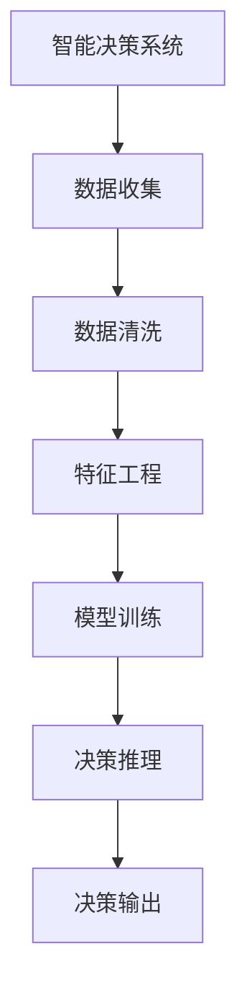

                 

## 1. 背景介绍

在互联网时代，人工智能(AI)已经成为驱动商业创新的重要引擎。智能化决策系统通过机器学习、自然语言处理、图像识别等技术，帮助企业从海量数据中提取洞察，优化决策流程，降低运营成本，提升竞争优势。因此，AI技术在商业应用中具有广阔的前景，吸引了众多创业者和投资者的关注。

### 1.1 问题由来
随着数据量的爆炸式增长和计算能力的不断提升，AI技术在各行各业的应用越来越广泛。传统企业在利用AI时，通常面临以下问题：

- **数据孤岛**：各业务部门的数据互不互通，难以形成统一的大数据资源池。
- **技能缺乏**：缺乏AI技术人才，难以自主开发和部署智能决策系统。
- **成本高昂**：自主开发AI系统需要大量投资，且见效周期较长。
- **决策依赖**：过于依赖人工专家，无法快速响应市场变化。

因此，如何利用AI技术，构建高效、灵活、安全的智能决策系统，成为当前企业数字化转型的重要课题。AI创业企业应运而生，通过提供标准化、易于集成的AI产品和服务，帮助企业快速实现智能化转型。

### 1.2 问题核心关键点
AI创业的核心在于结合商业应用场景，构建具备高效学习、智能推理能力的智能决策系统。其主要包括以下几个关键点：

- **算法与模型**：选择合适的AI算法和模型，以实现高效的数据处理和智能推理。
- **数据与特征**：构建覆盖全面、标注精准的数据集，提取关键特征，确保模型训练和推理效果。
- **系统架构**：设计可扩展、高可靠的系统架构，保证决策过程的稳定性和可靠性。
- **应用落地**：针对具体业务需求，开发易于集成的AI应用，实现快速部署。

这些关键点在AI创业项目的各个阶段中都需要予以充分考虑和优化。

### 1.3 问题研究意义
AI创业对推动企业智能化转型具有重要意义：

1. **提升决策效率**：利用AI技术，企业可以自动从海量数据中提取洞察，快速响应市场变化，提高决策效率。
2. **优化运营流程**：AI技术能够自动化处理重复性、低附加值的任务，释放人力资本，优化运营流程。
3. **增强市场竞争力**：AI驱动的智能决策系统能够帮助企业预测趋势、发现机会，增强市场竞争力。
4. **促进创新发展**：AI创业企业提供的产品和服务，为传统企业带来了新技术、新方法，推动了行业的创新发展。
5. **降低技术门槛**：AI创业企业通过标准化、模块化的产品设计，降低了企业应用AI技术的门槛，加速了AI技术的普及。

## 2. 核心概念与联系

### 2.1 核心概念概述

为更好地理解AI创业，本节将介绍几个关键概念：

- **人工智能(AI)**：通过机器学习、自然语言处理、图像识别等技术，模拟人类智能行为，实现自动化决策和智能推理的技术。
- **机器学习(ML)**：利用算法模型从数据中学习规律，实现预测、分类、聚类等任务。
- **自然语言处理(NLP)**：使计算机能够理解和生成人类自然语言的技术。
- **智能决策系统**：通过分析海量数据，自动生成智能建议或决策，辅助企业决策的过程。
- **AI创业**：将AI技术应用于商业应用场景，提供标准化、模块化的AI产品和解决方案的企业。

这些概念之间具有紧密的联系，相互支持、相互促进。AI创业企业通过提供智能决策系统，帮助企业实现智能化决策，而智能决策系统则需要利用AI技术中的机器学习和自然语言处理等能力。

### 2.2 核心概念原理和架构的 Mermaid 流程图(Mermaid 流程节点中不要有括号、逗号等特殊字符)


这个流程图展示了智能决策系统的核心流程，包括数据收集、清洗、特征工程、模型训练和推理等环节。

1. **数据收集**：从各个业务系统收集数据，构建完整的数据集。
2. **数据清洗**：处理缺失值、异常值，确保数据质量和一致性。
3. **特征工程**：提取关键特征，生成输入特征向量，用于模型训练。
4. **模型训练**：选择合适的算法和模型，利用训练集数据进行模型训练，优化模型参数。
5. **决策推理**：对新数据进行推理，生成智能决策结果。

这些环节相互依赖，共同构成了智能决策系统的整体架构。

## 3. 核心算法原理 & 具体操作步骤
### 3.1 算法原理概述

AI创业的核心在于构建高效、智能的决策系统。这一过程可以分为以下几个关键步骤：

- **数据预处理**：从多个业务系统收集数据，并进行清洗和预处理，确保数据质量和一致性。
- **特征工程**：提取关键特征，生成模型输入向量，优化模型效果。
- **模型选择与训练**：选择合适的算法和模型，利用训练集数据进行模型训练，优化模型参数。
- **决策推理**：对新数据进行推理，生成智能决策结果。
- **模型部署与评估**：将模型部署到生产环境，实时监控模型效果，进行持续优化。

### 3.2 算法步骤详解

#### 3.2.1 数据预处理
数据预处理是智能决策系统的基础，涉及数据收集、清洗和特征提取等环节。

1. **数据收集**：从企业各业务系统收集数据，包括交易数据、客户数据、市场数据等。
2. **数据清洗**：处理缺失值、异常值，确保数据质量和一致性。
3. **特征工程**：提取关键特征，生成模型输入向量。

#### 3.2.2 特征工程
特征工程是指从原始数据中提取关键特征，生成模型输入向量。特征工程的好坏直接影响模型效果，是智能决策系统的核心环节之一。

1. **特征提取**：从原始数据中提取有用的特征，如时间特征、地域特征、客户特征等。
2. **特征转换**：将原始特征转换为模型可接受的格式，如归一化、标准化、分桶等。
3. **特征选择**：选择对模型效果有显著影响的特征，避免过拟合。

#### 3.2.3 模型选择与训练
模型选择与训练是智能决策系统的关键步骤，涉及算法选择和模型优化。

1. **算法选择**：选择合适的机器学习算法和模型，如回归模型、分类模型、聚类模型等。
2. **模型训练**：利用训练集数据进行模型训练，优化模型参数。
3. **模型评估**：利用验证集数据评估模型效果，进行参数调优。

#### 3.2.4 决策推理
决策推理是指对新数据进行推理，生成智能决策结果。

1. **数据输入**：将新数据输入模型，进行特征处理和推理。
2. **推理输出**：利用模型生成智能决策结果，如推荐方案、客户评分等。

#### 3.2.5 模型部署与评估
模型部署与评估是智能决策系统的最后一步，涉及模型部署和效果监控。

1. **模型部署**：将模型部署到生产环境，进行实时推理。
2. **效果监控**：实时监控模型效果，进行持续优化。
3. **反馈迭代**：根据反馈信息进行模型迭代，提升模型效果。

### 3.3 算法优缺点

AI创业的优势主要体现在以下几个方面：

1. **高效决策**：AI系统能够自动从海量数据中提取洞察，快速响应市场变化，提高决策效率。
2. **降低成本**：AI系统可以自动化处理重复性、低附加值的任务，释放人力资本，降低运营成本。
3. **增强竞争力**：AI系统能够预测趋势、发现机会，增强市场竞争力。
4. **易于集成**：AI创业企业提供标准化、模块化的产品和服务，降低了企业应用AI技术的门槛。

然而，AI创业也面临一些挑战：

1. **数据隐私**：企业需要收集大量敏感数据，可能面临数据隐私和合规问题。
2. **技术门槛**：AI系统需要高水平的技术人才进行开发和维护，技术门槛较高。
3. **模型解释性**：AI系统的决策过程难以解释，可能缺乏透明性和可信度。
4. **市场接受度**：部分企业对AI技术持怀疑态度，难以接受AI系统的应用。
5. **持续优化**：AI系统需要不断优化，才能保持其性能和竞争力。

### 3.4 算法应用领域

AI创业在多个领域得到了广泛应用，包括但不限于：

- **金融风控**：利用AI技术进行风险评估和欺诈检测，提升风控效率。
- **电商推荐**：通过AI技术进行个性化推荐，提升用户满意度。
- **医疗诊断**：利用AI技术进行疾病预测和诊断，提升诊疗质量。
- **智能客服**：通过AI技术实现自动回答和情感识别，提升客户体验。
- **供应链管理**：利用AI技术进行需求预测和库存管理，优化供应链效率。

## 4. 数学模型和公式 & 详细讲解  
### 4.1 数学模型构建

AI创业中常用的数学模型主要包括回归模型、分类模型和聚类模型等。这里以线性回归模型为例，介绍AI创业中常用的数学模型构建方法。

**线性回归模型**：假设数据集为 $D=\{(x_i,y_i)\}_{i=1}^N$，其中 $x_i \in \mathbb{R}^d$ 为输入特征，$y_i \in \mathbb{R}$ 为输出变量。线性回归模型的形式为 $y_i = \theta_0 + \theta_1x_{i1} + \theta_2x_{i2} + \cdots + \theta_dx_{id} + \epsilon_i$，其中 $\epsilon_i$ 为随机误差。

**模型训练目标**：最小化预测值与真实值之间的平方误差，即：
$$
\min_{\theta} \frac{1}{N}\sum_{i=1}^N(y_i - \theta_0 - \theta_1x_{i1} - \theta_2x_{i2} - \cdots - \theta_dx_{id})^2
$$

### 4.2 公式推导过程

线性回归模型的参数优化过程可以通过梯度下降算法来实现。假设使用批量梯度下降算法，将数据集分为 $K$ 个批次，每个批次的训练样本数量为 $n$，则梯度下降算法的更新公式为：

$$
\theta_k \leftarrow \theta_k - \eta \frac{1}{n}\sum_{i=1}^n(y_i - \theta_0 - \theta_1x_{i1} - \theta_2x_{i2} - \cdots - \theta_dx_{id})
$$

其中 $\eta$ 为学习率。

### 4.3 案例分析与讲解

以电商推荐系统为例，介绍线性回归模型在推荐系统中的应用。

假设电商推荐系统需要预测用户对商品 $x_i$ 的评分 $y_i$，利用线性回归模型进行建模。首先，需要收集用户的历史行为数据，包括浏览记录、购买记录、评分记录等，构建训练集 $D$。然后，对数据进行预处理和特征工程，生成特征向量 $x_i$。接着，利用训练集数据进行模型训练，得到线性回归模型的参数 $\theta$。最后，对新商品进行评分预测，生成推荐结果。

## 5. 项目实践：代码实例和详细解释说明
### 5.1 开发环境搭建

在进行AI创业项目开发前，需要先准备好开发环境。以下是使用Python进行机器学习项目开发的环境配置流程：

1. 安装Anaconda：从官网下载并安装Anaconda，用于创建独立的Python环境。

2. 创建并激活虚拟环境：
```bash
conda create -n ml-env python=3.8 
conda activate ml-env
```

3. 安装必要的Python库：
```bash
conda install pandas numpy scikit-learn matplotlib jupyter notebook
```

4. 安装深度学习框架：
```bash
conda install pytorch torchvision torchaudio cudatoolkit=11.1 -c pytorch -c conda-forge
```

5. 安装模型部署工具：
```bash
pip install flask dask
```

完成上述步骤后，即可在`ml-env`环境中开始项目开发。

### 5.2 源代码详细实现

下面以一个电商推荐系统的示例，介绍如何利用Python和深度学习框架进行AI创业项目开发。

```python
import pandas as pd
import numpy as np
from sklearn.model_selection import train_test_split
from sklearn.linear_model import LinearRegression
from sklearn.metrics import mean_squared_error

# 数据准备
data = pd.read_csv('data.csv')
X = data[['feature1', 'feature2', 'feature3']]  # 特征
y = data['score']  # 目标变量

# 数据分割
X_train, X_test, y_train, y_test = train_test_split(X, y, test_size=0.2, random_state=42)

# 模型训练
model = LinearRegression()
model.fit(X_train, y_train)

# 模型评估
y_pred = model.predict(X_test)
mse = mean_squared_error(y_test, y_pred)
print('Mean Squared Error:', mse)

# 模型部署
from flask import Flask, request, jsonify

app = Flask(__name__)

@app.route('/predict', methods=['POST'])
def predict():
    data = request.json
    features = np.array([data['feature1'], data['feature2'], data['feature3']])
    prediction = model.predict(features)[0]
    return jsonify({'prediction': prediction})

if __name__ == '__main__':
    app.run(host='0.0.0.0', port=5000)
```

### 5.3 代码解读与分析

让我们再详细解读一下关键代码的实现细节：

**数据准备**：
- 使用Pandas库读取数据集，构建特征和目标变量。
- 使用train_test_split函数对数据集进行分割，划分训练集和测试集。

**模型训练**：
- 使用LinearRegression模型进行训练，利用训练集数据拟合模型参数。

**模型评估**：
- 利用测试集数据进行模型评估，计算均方误差。

**模型部署**：
- 使用Flask框架搭建API接口，接收POST请求，计算预测值并返回JSON格式的预测结果。
- 启动Flask服务，监听0.0.0.0:5000端口，等待请求。

## 6. 实际应用场景
### 6.1 金融风控

金融风控是AI创业的一个重要应用领域，利用AI技术进行风险评估和欺诈检测，能有效提升风控效率。

AI创业企业可以通过以下几个步骤，为金融机构提供智能风控系统：

1. **数据收集**：收集用户的交易数据、账户数据、行为数据等。
2. **数据预处理**：处理缺失值、异常值，确保数据质量和一致性。
3. **特征工程**：提取关键特征，生成模型输入向量。
4. **模型训练**：选择合适的机器学习算法和模型，利用训练集数据进行模型训练，优化模型参数。
5. **风险评估**：对新用户或交易进行风险评估，生成风险评分。

### 6.2 电商推荐

电商推荐系统是AI创业的典型应用场景之一，通过AI技术进行个性化推荐，提升用户满意度。

AI创业企业可以通过以下几个步骤，为电商企业提供智能推荐系统：

1. **数据收集**：收集用户的历史行为数据、浏览记录、购买记录等。
2. **数据预处理**：处理缺失值、异常值，确保数据质量和一致性。
3. **特征工程**：提取关键特征，生成模型输入向量。
4. **模型训练**：选择合适的机器学习算法和模型，利用训练集数据进行模型训练，优化模型参数。
5. **推荐生成**：对新商品进行推荐，生成推荐结果。

### 6.3 医疗诊断

医疗诊断是AI创业的重要应用领域，利用AI技术进行疾病预测和诊断，提升诊疗质量。

AI创业企业可以通过以下几个步骤，为医疗机构提供智能诊断系统：

1. **数据收集**：收集患者的病历数据、检验数据、影像数据等。
2. **数据预处理**：处理缺失值、异常值，确保数据质量和一致性。
3. **特征工程**：提取关键特征，生成模型输入向量。
4. **模型训练**：选择合适的机器学习算法和模型，利用训练集数据进行模型训练，优化模型参数。
5. **诊断生成**：对新患者进行诊断，生成诊断结果。

## 7. 工具和资源推荐
### 7.1 学习资源推荐

为了帮助开发者系统掌握AI创业的理论基础和实践技巧，这里推荐一些优质的学习资源：

1. 《Python机器学习》书籍：机器学习领域的经典教材，涵盖广泛的基础知识和实践技能。
2. 《深度学习》课程：由吴恩达等人开设的深度学习课程，适合初学者入门。
3. 《TensorFlow实战》书籍：TensorFlow的官方文档，提供了丰富的实践案例和代码示例。
4. 《PyTorch实战》书籍：PyTorch的官方文档，涵盖了深度学习模型的构建和优化。
5. Kaggle平台：数据科学和机器学习竞赛平台，提供丰富的数据集和竞赛任务，提升实战能力。

通过对这些资源的学习实践，相信你一定能够快速掌握AI创业的核心技术，并用于解决实际的商业问题。

### 7.2 开发工具推荐

高效的开发离不开优秀的工具支持。以下是几款用于AI创业开发的常用工具：

1. Jupyter Notebook：免费的交互式编程环境，适合快速迭代和实验新模型。
2. PyCharm：专业的Python IDE，支持代码自动补全、调试等功能。
3. GitHub：代码托管平台，提供版本控制、代码协作等工具。
4. Google Colab：免费的云端Jupyter Notebook环境，支持GPU加速。
5. Docker：容器化技术，便于构建和部署AI模型。

合理利用这些工具，可以显著提升AI创业项目的开发效率，加快创新迭代的步伐。

### 7.3 相关论文推荐

AI创业技术的发展源于学界的持续研究。以下是几篇奠基性的相关论文，推荐阅读：

1. TensorFlow: A System for Large-Scale Machine Learning：介绍TensorFlow的核心算法和架构。
2. Deep Learning with PyTorch：介绍PyTorch的核心算法和架构。
3. A Survey on Online Learning in Recommendation Systems：综述在线推荐系统的最新研究进展。
4. Deep Reinforcement Learning for Healthcare：综述深度强化学习在医疗领域的最新应用。
5. Graph Neural Networks in Recommendation Systems：综述图神经网络在推荐系统中的应用。

这些论文代表了大规模机器学习模型的研究脉络，帮助研究者把握学科前进方向，激发更多的创新灵感。

## 8. 总结：未来发展趋势与挑战
### 8.1 总结

本文对AI创业中构建智能化决策系统的过程进行了详细阐述。首先介绍了AI创业的背景和核心概念，明确了AI创业在智能化决策系统中的应用价值。其次，从数据预处理、特征工程、模型训练、决策推理等多个环节，详细讲解了AI创业中的核心算法原理和具体操作步骤。同时，本文还广泛探讨了AI创业在金融风控、电商推荐、医疗诊断等实际场景中的应用前景，展示了AI创业的广泛应用潜力。最后，本文精选了AI创业技术的各类学习资源，力求为读者提供全方位的技术指引。

通过本文的系统梳理，可以看到，AI创业对推动企业智能化转型具有重要意义。AI技术能够提升决策效率、优化运营流程、增强市场竞争力，助力企业数字化转型。未来，随着AI技术的不断发展，AI创业企业必将在更广泛的领域发挥重要作用，推动社会进步。

### 8.2 未来发展趋势

展望未来，AI创业将呈现以下几个发展趋势：

1. **AI与行业深度融合**：AI创业企业将进一步与各行业深度融合，开发更加符合行业特点的智能决策系统。
2. **模型优化与部署**：AI创业企业将致力于模型优化和部署，提升模型效率和稳定性。
3. **多模态融合**：AI创业企业将开发多模态融合的智能决策系统，提升系统智能水平。
4. **数据隐私与安全**：AI创业企业将更加重视数据隐私和安全，开发合规可靠的数据处理和存储方案。
5. **人机协同**：AI创业企业将开发更加智能的人机协同系统，提升人机交互效果。

以上趋势凸显了AI创业技术的广阔前景，这些方向的探索发展，必将进一步提升AI系统的性能和应用范围，为社会带来更多价值。

### 8.3 面临的挑战

尽管AI创业技术已经取得了显著进展，但在迈向更加智能化、普适化应用的过程中，仍面临诸多挑战：

1. **数据隐私**：企业需要收集大量敏感数据，可能面临数据隐私和合规问题。
2. **技术门槛**：AI系统需要高水平的技术人才进行开发和维护，技术门槛较高。
3. **模型解释性**：AI系统的决策过程难以解释，可能缺乏透明性和可信度。
4. **市场接受度**：部分企业对AI技术持怀疑态度，难以接受AI系统的应用。
5. **持续优化**：AI系统需要不断优化，才能保持其性能和竞争力。

### 8.4 研究展望

为了应对这些挑战，未来的AI创业技术研究需要在以下几个方面寻求新的突破：

1. **隐私保护技术**：研究如何保护用户数据隐私，开发合规可靠的数据处理和存储方案。
2. **模型可解释性**：研究如何提高AI模型的可解释性，增强决策过程的透明性和可信度。
3. **跨领域应用**：研究如何将AI技术应用于更多垂直领域，提升各行业的智能化水平。
4. **模型自动化**：研究如何自动化模型的开发和优化，降低技术门槛，提升开发效率。
5. **持续学习**：研究如何让AI系统具备持续学习能力，适应数据分布变化，提升系统性能。

这些研究方向将引领AI创业技术的不断进步，推动AI技术在更广泛的应用场景中发挥作用。相信在学术界和产业界的共同努力下，AI创业必将取得更多突破，为人类社会带来更多价值。

## 9. 附录：常见问题与解答

**Q1：AI创业项目如何选择合适的算法和模型？**

A: AI创业项目应根据具体业务场景选择合适的算法和模型，以实现高效的决策。以下是一些选择建议：

- **回归模型**：适用于预测连续型变量，如电商推荐、金融风控等。
- **分类模型**：适用于分类问题，如欺诈检测、疾病预测等。
- **聚类模型**：适用于无监督学习，如客户分群、异常检测等。
- **深度学习模型**：适用于复杂数据结构和图像处理，如图像识别、自然语言处理等。

选择合适的算法和模型需要充分考虑数据特征、业务需求和技术可行性。

**Q2：AI创业项目如何处理数据隐私问题？**

A: 数据隐私是AI创业项目中的重要问题。以下是一些处理数据隐私的建议：

- **数据脱敏**：对敏感数据进行脱敏处理，确保数据不泄露用户隐私。
- **合规审查**：遵守数据隐私相关法规，如GDPR、CCPA等。
- **匿名化处理**：对数据进行匿名化处理，确保用户身份信息无法识别。
- **隐私保护技术**：研究和使用隐私保护技术，如差分隐私、联邦学习等。

合理处理数据隐私问题，可以有效提升用户信任，确保项目合规性。

**Q3：AI创业项目如何进行持续优化？**

A: 持续优化是AI创业项目成功的关键。以下是一些优化建议：

- **监控系统**：实时监控模型效果，及时发现问题并进行优化。
- **A/B测试**：对不同模型或算法进行A/B测试，选择效果最佳方案。
- **模型迭代**：根据业务需求和技术进展，不断更新和迭代模型。
- **反馈机制**：建立用户反馈机制，收集用户意见并进行模型优化。

通过持续优化，可以不断提升AI系统的性能和效果，满足业务需求。

**Q4：AI创业项目如何进行多模态融合？**

A: 多模态融合是指将文本、图像、语音等多种数据类型融合到AI系统中，提升系统智能水平。以下是一些融合建议：

- **特征融合**：将不同模态的特征进行融合，生成综合特征向量。
- **模型融合**：将不同模态的模型进行融合，提升系统决策效果。
- **多任务学习**：同时进行多个任务的模型训练，提升系统泛化能力。

多模态融合可以显著提升AI系统的智能水平，应对更复杂的应用场景。

**Q5：AI创业项目如何提高模型的可解释性？**

A: 提高模型的可解释性是AI创业项目中的重要问题。以下是一些可解释性建议：

- **模型简化**：将复杂模型简化为可解释的模型，如决策树、线性回归等。
- **可视化工具**：使用可视化工具，展示模型决策过程和特征重要性。
- **规则提取**：提取模型规则，生成解释性较强的决策依据。
- **知识图谱**：引入知识图谱，增强模型的符号推理能力。

通过提高模型的可解释性，可以增强用户信任，确保系统可靠性。

---

作者：禅与计算机程序设计艺术 / Zen and the Art of Computer Programming

