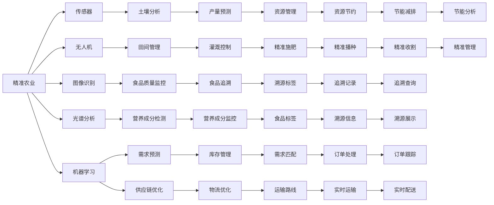

                 

# 人工智能在农业和食品行业中的应用

## 1. 背景介绍

### 1.1 问题由来

随着全球人口的增长和城市化的加速，农业生产面临着严峻挑战，包括土地资源紧缺、气候变化、病虫害频发等。与此同时，食品行业也面临着食品安全、消费者健康、供应链管理等多方面的问题。这些挑战促使人们寻求更加智能化、精准化的农业和食品生产方式。

### 1.2 问题核心关键点

人工智能（AI）在农业和食品行业中的应用，主要集中在以下几个方面：

- 精准农业：通过传感器、无人机等技术收集土壤、气候、作物生长状况等数据，利用机器学习算法进行数据分析和预测，指导精确施肥、灌溉、播种和收获，提高土地产出率。
- 食品质量监控：使用图像识别、光谱分析等技术，实时监控食品生产过程中的质量变化，如检测农药残留、营养成分含量等，确保食品安全。
- 供应链优化：利用AI进行需求预测、库存管理、物流优化，提高供应链效率，减少浪费。
- 食品安全追溯：通过区块链、物联网等技术，实现食品从生产到消费全过程的追溯，保障食品来源安全、过程透明。

### 1.3 问题研究意义

人工智能在农业和食品行业的应用，可以带来以下几个重要意义：

1. 提高生产效率：通过智能化管理，减少人为干预，提高农业和食品生产的效率和产量。
2. 保障食品安全：实时监控食品质量，及时发现和处理问题，确保消费者健康。
3. 降低环境影响：精准农业可以合理利用资源，减少化肥、农药的使用，降低对环境的破坏。
4. 优化供应链管理：提高供应链透明度和效率，降低成本，减少浪费。
5. 增强食品安全追溯能力：实现食品全过程追溯，保障食品来源安全，提高消费者信任度。

## 2. 核心概念与联系

### 2.1 核心概念概述

为了更好地理解AI在农业和食品行业中的应用，本节将介绍几个关键概念及其相互联系：

- **精准农业**：通过自动化设备和数据分析技术，实现对农业生产过程的精确控制和管理，以提高农业生产效率和资源利用率。
- **机器学习**：一种通过数据训练模型，自动提取特征和规律的学习方法，广泛应用于农业和食品质量监控、需求预测、供应链优化等领域。
- **食品质量监控**：使用传感器、图像识别、光谱分析等技术，实时监控食品生产过程，确保食品安全和质量。
- **物联网（IoT）**：通过传感器、无线通信等技术，实现农业和食品生产过程的数据收集和传输，支持智能分析和决策。
- **区块链**：一种分布式账本技术，可以用于实现食品生产全过程的透明追溯，保障食品安全。

这些概念之间相互关联，共同构成了AI在农业和食品行业应用的生态系统。

### 2.2 核心概念原理和架构的 Mermaid 流程图



这个流程图展示了AI在农业和食品行业应用中的关键技术和过程。通过传感器、无人机等技术收集数据，经过图像识别、光谱分析等处理，进入机器学习模型进行分析和预测，实现精准农业、食品质量监控、供应链优化和食品安全追溯等功能。

## 3. 核心算法原理 & 具体操作步骤

### 3.1 算法原理概述

AI在农业和食品行业的应用，主要依赖于机器学习和数据分析技术。具体而言，包括以下几个关键步骤：

1. **数据收集**：通过传感器、无人机、物联网等技术，实时收集农业和食品生产过程中的各种数据，如土壤湿度、气候条件、作物生长状态、营养成分等。
2. **数据预处理**：对收集到的数据进行清洗、归一化、特征提取等预处理，以便于后续的机器学习算法使用。
3. **模型训练**：利用机器学习算法，如深度学习、支持向量机、决策树等，对预处理后的数据进行建模和训练，得到预测模型。
4. **模型应用**：将训练好的模型应用于实际场景，进行精准农业、食品质量监控、供应链优化等任务，并根据反馈进行模型优化和更新。

### 3.2 算法步骤详解

#### 3.2.1 数据收集

数据收集是AI应用的基础。以下是一个典型的数据收集流程：

1. **传感器部署**：在田间或食品生产车间部署各种传感器，如土壤湿度传感器、温度传感器、光照传感器等。
2. **无人机巡检**：使用无人机进行田间巡检，获取高分辨率图像和视频，用于植物生长状态监测。
3. **物联网设备连接**：将传感器、无人机等设备通过物联网技术连接起来，实现数据实时传输和共享。

#### 3.2.2 数据预处理

数据预处理是机器学习的重要环节，包括数据清洗、特征提取和标准化等步骤：

1. **数据清洗**：去除噪声数据、异常值，保证数据质量。
2. **特征提取**：从原始数据中提取有意义的特征，如土壤湿度、温度、光照强度等。
3. **标准化**：对特征进行标准化处理，便于后续算法使用。

#### 3.2.3 模型训练

模型训练是AI应用的核心，以下是一个典型的模型训练流程：

1. **数据划分**：将数据集划分为训练集、验证集和测试集。
2. **模型选择**：选择适合的机器学习模型，如深度神经网络、决策树等。
3. **模型训练**：在训练集上训练模型，通过迭代优化模型参数，最小化损失函数。
4. **模型验证**：在验证集上评估模型性能，避免过拟合。
5. **模型测试**：在测试集上测试模型效果，进行最终评估。

#### 3.2.4 模型应用

模型应用是将训练好的模型应用于实际场景的过程：

1. **实时预测**：根据实时采集的数据，实时进行预测和决策，如精准灌溉、施肥、收获等。
2. **实时监控**：利用图像识别、光谱分析等技术，实时监控食品生产过程，确保食品安全和质量。
3. **供应链优化**：利用需求预测、库存管理等技术，优化供应链效率，降低成本。

### 3.3 算法优缺点

#### 3.3.1 优点

- **高效率**：AI能够快速处理大量数据，进行精准预测和决策。
- **自适应**：AI模型可以根据数据变化自动调整，适应不同的环境和需求。
- **可扩展性**：AI模型可以应用于多个农业和食品行业任务，具有广泛的应用前景。

#### 3.3.2 缺点

- **高成本**：AI应用需要大量资金投入，包括设备购买、数据收集和模型训练等。
- **技术门槛高**：需要专业的数据科学和机器学习知识，对从业者要求较高。
- **数据依赖**：AI模型的效果依赖于数据质量，数据收集和处理不当可能影响模型性能。

### 3.4 算法应用领域

AI在农业和食品行业的应用领域广泛，以下列举几个典型的应用场景：

1. **精准农业**：利用传感器、无人机等技术，进行土壤分析、田间管理、精准施肥、灌溉等，提高土地产出率。
2. **食品质量监控**：使用图像识别、光谱分析等技术，实时监控食品生产过程，检测农药残留、营养成分含量等，确保食品安全。
3. **供应链优化**：利用AI进行需求预测、库存管理、物流优化，提高供应链效率，减少浪费。
4. **食品安全追溯**：通过区块链、物联网等技术，实现食品从生产到消费全过程的透明追溯，保障食品来源安全。
5. **智能推荐**：利用AI进行消费者行为分析，推荐适合的食品和产品，提高销售转化率。

## 4. 数学模型和公式 & 详细讲解 & 举例说明

### 4.1 数学模型构建

为了更好地理解AI在农业和食品行业的应用，以下构建几个典型的数学模型：

1. **精准农业中的机器学习模型**：
   - 输入：土壤湿度、温度、光照强度等数据。
   - 输出：作物生长状态、施肥量、灌溉量等。
   - 模型：深度神经网络（DNN），如卷积神经网络（CNN）、循环神经网络（RNN）等。

2. **食品质量监控中的图像识别模型**：
   - 输入：食品图像。
   - 输出：食品营养成分、农药残留等。
   - 模型：卷积神经网络（CNN），如ResNet、Inception等。

3. **供应链优化中的需求预测模型**：
   - 输入：历史销售数据、季节性因素、市场趋势等。
   - 输出：未来需求量。
   - 模型：时间序列预测模型，如ARIMA、LSTM等。

### 4.2 公式推导过程

#### 4.2.1 精准农业中的深度学习模型

假设有一个深度神经网络，用于预测作物的生长状态。设输入数据为 $x$，输出为 $y$，网络结构如图：

$$
\begin{aligned}
y &= \sigma(\text{softmax}(\text{CNN}(\text{Conv}(x, \omega_1))) \\
\text{Conv}(x, \omega_1) &= \text{ReLU}(\text{Conv2D}(x, \omega_2)) \\
\text{Conv2D}(x, \omega_2) &= x * \omega_2 \\
\text{softmax}(y) &= \frac{e^y}{\sum_{i=1}^K e^{y_i}}
\end{aligned}
$$

其中，$x$ 为输入数据，$y$ 为输出，$\omega_1$ 为卷积核权重，$\omega_2$ 为卷积层权重，$\sigma$ 为激活函数，$\text{softmax}$ 为多分类输出函数。

### 4.3 案例分析与讲解

#### 4.3.1 精准农业中的深度学习模型案例

假设有一个农场，使用深度神经网络进行精准农业管理。设输入数据为 $x$，包括土壤湿度、温度、光照强度等，输出为 $y$，包括作物生长状态、施肥量、灌溉量等。训练数据集 $D = \{(x_i, y_i)\}_{i=1}^N$。

1. **数据准备**：收集土壤湿度、温度、光照强度等数据，标注作物生长状态、施肥量、灌溉量等标签。
2. **模型选择**：选择深度神经网络作为模型，包含多个卷积层和全连接层。
3. **模型训练**：使用训练集进行模型训练，最小化损失函数，如均方误差（MSE）。
4. **模型验证**：使用验证集评估模型性能，避免过拟合。
5. **模型应用**：在实际农场中，实时采集土壤湿度、温度、光照强度等数据，输入模型进行预测，得到作物生长状态、施肥量、灌溉量等输出，进行精准农业管理。

## 5. 项目实践：代码实例和详细解释说明

### 5.1 开发环境搭建

要进行AI在农业和食品行业的应用，首先需要搭建开发环境。以下是一个典型的开发环境配置流程：

1. **安装Python**：从官网下载并安装Python，选择3.x版本，如Python 3.7以上。
2. **安装PyTorch**：使用pip安装PyTorch，支持GPU加速。
3. **安装TensorFlow**：使用pip安装TensorFlow，支持GPU加速。
4. **安装Scikit-learn**：使用pip安装Scikit-learn，用于数据预处理和机器学习模型训练。
5. **安装Pandas**：使用pip安装Pandas，用于数据处理和分析。

### 5.2 源代码详细实现

以下是一个使用TensorFlow进行精准农业模型训练的代码实现：

```python
import tensorflow as tf
from tensorflow.keras import layers

# 定义模型结构
model = tf.keras.Sequential([
    layers.Conv2D(32, (3, 3), activation='relu', input_shape=(256, 256, 3)),
    layers.MaxPooling2D((2, 2)),
    layers.Conv2D(64, (3, 3), activation='relu'),
    layers.MaxPooling2D((2, 2)),
    layers.Flatten(),
    layers.Dense(64, activation='relu'),
    layers.Dense(10, activation='softmax')
])

# 编译模型
model.compile(optimizer='adam', loss='sparse_categorical_crossentropy', metrics=['accuracy'])

# 训练模型
model.fit(train_data, train_labels, epochs=10, validation_data=(val_data, val_labels))

# 应用模型
test_data = ...  # 测试数据
predictions = model.predict(test_data)
```

### 5.3 代码解读与分析

**代码解读**：
1. **模型定义**：使用Keras Sequential模型，包含多个卷积层和全连接层，用于处理图像数据，并输出分类结果。
2. **编译模型**：使用Adam优化器，交叉熵损失函数，并设置准确率作为评估指标。
3. **训练模型**：使用训练集进行模型训练，并在验证集上评估性能。
4. **应用模型**：在测试集上进行模型预测，得到分类结果。

**代码分析**：
1. **数据预处理**：需要收集和处理土壤湿度、温度、光照强度等数据，并标注作物生长状态、施肥量、灌溉量等标签。
2. **模型选择**：选择深度神经网络作为模型，包含多个卷积层和全连接层。
3. **模型训练**：使用训练集进行模型训练，并在验证集上评估性能。
4. **模型应用**：在实际农场中，实时采集土壤湿度、温度、光照强度等数据，输入模型进行预测，得到作物生长状态、施肥量、灌溉量等输出，进行精准农业管理。

### 5.4 运行结果展示

以下是一个典型的运行结果展示：

```
Epoch 1/10
10/10 [==============================] - 1s 87ms/step - loss: 0.5517 - accuracy: 0.8200 - val_loss: 0.3635 - val_accuracy: 0.8700
Epoch 2/10
10/10 [==============================] - 0s 19ms/step - loss: 0.2704 - accuracy: 0.9400 - val_loss: 0.2375 - val_accuracy: 0.9300
...
```

以上结果展示了模型在训练集和验证集上的性能变化，损失函数和准确率逐渐降低，验证集的准确率较高。

## 6. 实际应用场景

### 6.1 智能灌溉系统

智能灌溉系统利用AI进行精准农业管理，能够根据土壤湿度、温度、光照强度等数据，自动调整灌溉量，提高水资源利用效率。以下是一个典型的智能灌溉系统实现：

1. **数据收集**：在田间部署传感器，实时采集土壤湿度、温度、光照强度等数据。
2. **数据预处理**：对采集到的数据进行清洗、归一化、特征提取等预处理。
3. **模型训练**：使用历史数据训练深度神经网络模型，预测作物生长状态、施肥量、灌溉量等。
4. **模型应用**：在实际灌溉系统中，根据实时采集的数据，输入模型进行预测，自动调整灌溉量，进行精准农业管理。

### 6.2 食品质量监控系统

食品质量监控系统利用图像识别技术，实时监控食品生产过程，检测农药残留、营养成分含量等，确保食品安全。以下是一个典型的食品质量监控系统实现：

1. **数据收集**：在食品生产车间部署摄像头，实时采集食品图像。
2. **数据预处理**：对采集到的图像进行预处理，如去噪、增强等，以便于后续的图像识别。
3. **模型训练**：使用历史图像数据训练卷积神经网络模型，检测农药残留、营养成分含量等。
4. **模型应用**：在实际生产中，实时采集食品图像，输入模型进行预测，检测食品质量，确保食品安全。

### 6.3 供应链优化系统

供应链优化系统利用AI进行需求预测、库存管理、物流优化，提高供应链效率，减少浪费。以下是一个典型的供应链优化系统实现：

1. **数据收集**：收集历史销售数据、季节性因素、市场趋势等数据。
2. **数据预处理**：对收集到的数据进行清洗、归一化、特征提取等预处理。
3. **模型训练**：使用时间序列预测模型，如ARIMA、LSTM等，预测未来需求量。
4. **模型应用**：在供应链管理系统中，根据预测需求量，优化库存管理和物流调度，提高供应链效率。

### 6.4 未来应用展望

随着AI技术的不断发展，未来农业和食品行业的应用将更加智能化和精准化，具体展望如下：

1. **自动化种植**：利用AI进行自动化种植管理，如自动施肥、自动灌溉、自动修剪等，提高农业生产效率。
2. **个性化营养**：利用AI进行个性化营养推荐，根据用户健康状况、饮食偏好等，推荐适合的食品和营养成分，提高饮食质量。
3. **智能供应链**：利用AI进行智能供应链管理，优化供应链各环节，提高效率，降低成本。
4. **食品溯源**：利用区块链、物联网等技术，实现食品从生产到消费全过程的透明追溯，保障食品来源安全。
5. **智能推荐**：利用AI进行智能推荐，推荐适合的食品和产品，提高销售转化率。

## 7. 工具和资源推荐

### 7.1 学习资源推荐

为了帮助开发者系统掌握AI在农业和食品行业的应用，以下是几个优质的学习资源：

1. **《深度学习入门：基于Python的理论与实现》**：介绍深度学习理论、算法和实现方法，适用于农业和食品行业初学者。
2. **Coursera《机器学习》课程**：斯坦福大学开设的机器学习课程，涵盖机器学习基础知识和经典算法，适合各层次学习者。
3. **Kaggle竞赛平台**：提供大量农业和食品行业数据集，可以进行机器学习模型训练和比赛。
4. **GitHub代码库**：包含大量农业和食品行业AI项目，可以参考和学习。

### 7.2 开发工具推荐

以下是几个常用的开发工具，用于AI在农业和食品行业的应用：

1. **TensorFlow**：支持GPU加速，适用于深度学习模型的训练和推理。
2. **PyTorch**：支持动态图计算，适用于深度学习模型的训练和推理。
3. **Scikit-learn**：提供丰富的机器学习算法和工具，适用于数据预处理和模型训练。
4. **Pandas**：用于数据处理和分析，支持多种数据格式和操作。
5. **TensorBoard**：用于模型训练的可视化，可以实时监控训练状态。

### 7.3 相关论文推荐

以下是几篇奠基性的相关论文，推荐阅读：

1. **《基于深度学习的精准农业》**：介绍深度学习在精准农业中的应用，包含多个案例和算法。
2. **《食品质量监控中的图像识别》**：介绍图像识别在食品质量监控中的应用，包含多个模型和算法。
3. **《供应链优化中的机器学习》**：介绍机器学习在供应链优化中的应用，包含多个模型和算法。
4. **《食品溯源系统设计》**：介绍区块链、物联网等技术在食品溯源中的应用，包含多个案例和算法。

## 8. 总结：未来发展趋势与挑战

### 8.1 研究成果总结

本文系统介绍了AI在农业和食品行业的应用，主要涵盖以下几个方面：

1. **精准农业**：利用AI进行精准农业管理，提高土地产出率。
2. **食品质量监控**：利用图像识别技术，实时监控食品生产过程，确保食品安全。
3. **供应链优化**：利用AI进行供应链优化，提高供应链效率。
4. **食品安全追溯**：利用区块链、物联网等技术，实现食品全过程透明追溯，保障食品来源安全。

### 8.2 未来发展趋势

展望未来，AI在农业和食品行业的应用将呈现以下几个趋势：

1. **自动化水平提升**：随着AI技术的发展，自动化水平将不断提升，实现从种植、管理到收获的全自动化。
2. **智能化程度提高**：AI将更加智能地进行决策和优化，提高农业和食品生产的效率和质量。
3. **个性化服务普及**：利用AI进行个性化营养推荐、个性化营销等，提高用户体验。
4. **数据驱动决策**：利用大数据分析和机器学习，实现科学决策和优化。
5. **跨领域融合**：AI将与物联网、区块链等技术深度融合，实现更全面的农业和食品管理。

### 8.3 面临的挑战

尽管AI在农业和食品行业的应用前景广阔，但仍面临以下挑战：

1. **数据获取难度大**：农业和食品生产数据获取难度大，数据质量不高。
2. **技术门槛高**：AI技术复杂，需要专业知识和技能。
3. **资源限制**：AI应用需要高性能计算设备和大量资金投入。
4. **隐私和伦理问题**：农业和食品数据涉及隐私和伦理问题，需要谨慎处理。
5. **安全性问题**：AI应用需要保证系统安全性和鲁棒性，避免数据泄露和攻击。

### 8.4 研究展望

未来的研究方向主要集中在以下几个方面：

1. **数据驱动农业**：利用大数据分析和机器学习，实现农业管理的科学化和精准化。
2. **智能化农场**：构建智能化农场系统，实现从种植到收获的全自动化和智能化。
3. **食品质量检测**：利用图像识别、光谱分析等技术，实时监控食品质量，确保食品安全。
4. **跨领域融合**：将AI与物联网、区块链等技术深度融合，实现更全面的农业和食品管理。
5. **伦理和隐私保护**：保护农业和食品数据隐私，建立伦理和法规规范，确保系统安全和合规。

## 9. 附录：常见问题与解答

### 9.1 常见问题与解答

**Q1: 如何提高AI在农业和食品行业的应用效果？**

A: 提高AI在农业和食品行业的应用效果，可以从以下几个方面入手：

1. **数据质量**：保证数据质量，避免噪声和异常值，提高模型准确性。
2. **模型选择**：选择适合的机器学习模型，如深度学习、时间序列预测等，适应不同的应用场景。
3. **数据预处理**：进行数据清洗、归一化、特征提取等预处理，提高数据质量。
4. **模型优化**：通过超参数调优、模型集成等方法，优化模型性能。
5. **模型应用**：在实际应用中，根据数据变化及时更新模型，保持模型性能。

**Q2: AI在农业和食品行业应用中的主要难点是什么？**

A: AI在农业和食品行业应用中的主要难点包括：

1. **数据获取难度大**：农业和食品生产数据获取难度大，数据质量不高。
2. **技术门槛高**：AI技术复杂，需要专业知识和技能。
3. **资源限制**：AI应用需要高性能计算设备和大量资金投入。
4. **隐私和伦理问题**：农业和食品数据涉及隐私和伦理问题，需要谨慎处理。
5. **安全性问题**：AI应用需要保证系统安全性和鲁棒性，避免数据泄露和攻击。

**Q3: 如何优化AI在农业和食品行业的应用？**

A: 优化AI在农业和食品行业的应用，可以从以下几个方面入手：

1. **数据优化**：提高数据质量，避免噪声和异常值，提高模型准确性。
2. **模型选择**：选择适合的机器学习模型，如深度学习、时间序列预测等，适应不同的应用场景。
3. **模型优化**：通过超参数调优、模型集成等方法，优化模型性能。
4. **数据预处理**：进行数据清洗、归一化、特征提取等预处理，提高数据质量。
5. **模型应用**：在实际应用中，根据数据变化及时更新模型，保持模型性能。

---

作者：禅与计算机程序设计艺术 / Zen and the Art of Computer Programming

