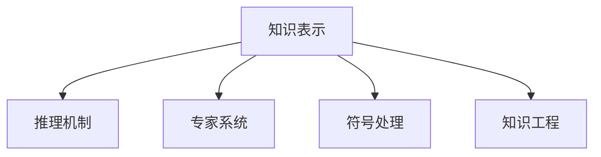

                 

# 人工智能研究的早期探索

## 1. 背景介绍

### 1.1 问题由来

人工智能(Artificial Intelligence, AI)是一门涉及计算机科学、数学、哲学、心理学、神经科学等多个学科的交叉领域，旨在通过让机器模拟人类智能行为，实现自动化、智能化和自主化。自20世纪50年代以来，AI研究经历了多个阶段的发展，从符号逻辑和规则系统到专家系统，再到机器学习和大数据，逐步拓展了其应用边界和理论深度。

在早期探索阶段，研究者主要通过编写详细规则，设计程序来模拟人类推理和决策过程。这些规则系统能够在特定领域内实现较高水平的自动化，但由于规则数量庞大且难以处理复杂任务，其适用范围有限。随着计算机硬件的升级和计算能力的提升，研究者开始探索更加灵活、智能的AI方法，以应对更加复杂多变的实际问题。

### 1.2 问题核心关键点

人工智能研究的早期探索，主要聚焦于知识表示和推理机制，旨在使机器具备像人类一样思考和决策的能力。这一阶段的核心挑战包括：

1. 知识表示：如何将人类的知识、经验和推理逻辑编码为计算机能够理解和执行的形式。
2. 推理机制：如何设计算法使机器能够基于已有知识进行逻辑推理，并得出合理结论。
3. 专家系统：如何构建具有高度自动化、智能化水平，能在特定领域内自主进行决策的专家系统。
4. 符号处理：如何高效处理大量的文本、图像等符号数据，提取关键信息，进行分析和推理。
5. 知识工程：如何将人类知识与计算机技术结合，构建高度定制化的智能应用系统。

### 1.3 问题研究意义

早期探索阶段的AI研究，对推动现代人工智能的发展起到了奠基性作用。它不仅奠定了知识表示、推理机制、专家系统等基本概念和方法，还催生了多学科交叉融合的先河。通过早期探索，研究者积累了丰富的经验和技术手段，为后续的机器学习和大数据时代奠定了坚实的基础。

## 2. 核心概念与联系

### 2.1 核心概念概述

为更好地理解人工智能研究的早期探索，本节将介绍几个密切相关的核心概念：

- **知识表示(Knowledge Representation, KR)**：指将人类知识、经验和推理逻辑编码为计算机可理解的形式，以便计算机能够处理和推理。常见的知识表示方法包括符号逻辑、框架系统、语义网络等。

- **推理机制(Inference Mechanism)**：指设计算法使机器能够基于已有知识进行逻辑推理，得出合理结论。推理机制通常基于演绎逻辑、归纳逻辑或混合逻辑。

- **专家系统(Expert System, ES)**：指构建具有高度自动化、智能化水平，能在特定领域内自主进行决策的系统。专家系统通过知识库、推理机和用户接口构成，可以模拟人类专家知识。

- **符号处理(Symbolic Processing)**：指对文本、图像等符号数据进行处理，提取关键信息，进行分析和推理的过程。

- **知识工程(Knowledge Engineering, KE)**：指将人类知识与计算机技术结合，构建高度定制化的智能应用系统。知识工程强调领域专家的参与，需要不断迭代优化，以提升系统的智能水平。

这些核心概念之间的逻辑关系可以通过以下Mermaid流程图来展示：



这个流程图展示了这个阶段的核心概念及其之间的关系：

1. 知识表示是将人类知识编码为计算机可理解的形式。
2. 推理机制使计算机能够基于知识进行逻辑推理。
3. 专家系统结合了知识库和推理机，实现了特定领域的自动化决策。
4. 符号处理对符号数据进行高效处理和分析。
5. 知识工程将知识与计算机技术结合，构建智能应用系统。

## 3. 核心算法原理 & 具体操作步骤
### 3.1 算法原理概述

早期探索阶段的AI研究，主要基于符号逻辑和规则系统的设计。研究者通过编写详细规则，使机器具备推理和决策能力。这些规则系统能够在特定领域内实现较高水平的自动化，但由于规则数量庞大且难以处理复杂任务，其适用范围有限。

知识表示和推理机制是早期AI研究的核心。知识表示通过符号、框架、语义网络等方法，将人类知识编码为计算机可理解的形式。推理机制则通过演绎逻辑、归纳逻辑或混合逻辑，使计算机能够基于知识进行逻辑推理。专家系统结合了知识库和推理机，实现了特定领域的自动化决策。

### 3.2 算法步骤详解

早期探索阶段的AI研究主要包括以下几个关键步骤：

**Step 1: 收集和整理知识库**
- 收集特定领域内的知识、规则和案例。
- 设计知识库结构，构建知识库框架。
- 对知识库进行整理和验证，确保其正确性和完备性。

**Step 2: 编写详细规则**
- 设计推理规则，描述如何从已有知识中推理出新的结论。
- 编写专家系统的知识库，将领域内的规则、事实和案例存储起来。
- 实现推理机，能够根据规则和知识库进行逻辑推理。

**Step 3: 实现专家系统**
- 设计专家系统的用户接口，实现人机交互。
- 将推理机与知识库集成，构建完整的专家系统。
- 进行系统测试和验证，确保其正确性和可靠性。

**Step 4: 知识工程**
- 结合领域专家知识，设计知识工程的流程和方法。
- 收集领域内专家的知识和经验，构建知识库。
- 使用规则系统、框架系统或语义网络等方法，将知识表示为计算机可理解的形式。
- 设计推理机制，使系统能够基于知识进行逻辑推理。
- 实现专家系统，将知识库和推理机集成。
- 进行系统测试和验证，优化系统性能。

### 3.3 算法优缺点

早期探索阶段的AI研究，具有以下优点：

1. 知识表示明确：通过符号逻辑和规则系统，可以清晰地表示和处理领域内的知识。
2. 推理机制稳定：基于符号逻辑的推理具有明确性和可验证性，能够确保推理的正确性。
3. 专家系统可靠：在特定领域内，专家系统能够实现高水平的自动化决策。
4. 知识工程可控：知识工程强调领域专家的参与，能够不断优化和改进系统。

然而，该方法也存在一定的局限性：

1. 知识获取成本高：需要领域专家大量参与，构建知识库成本较高。
2. 规则数量庞大：规则系统需要编写大量的规则，难以处理复杂多变的问题。
3. 推理效率低：符号推理速度较慢，难以应对大规模数据的处理需求。
4. 系统灵活性差：专家系统在特定领域内表现较好，但难以通用到其他领域。
5. 知识更新困难：规则系统难以动态更新，难以适应知识变化和新领域的应用。

尽管存在这些局限性，但早期的AI研究奠定了知识表示、推理机制、专家系统等基本概念和方法，对后续的机器学习和大数据时代的发展具有重要影响。

### 3.4 算法应用领域

早期探索阶段的AI研究，主要应用于特定领域内的自动化决策和智能系统构建。以下是一些典型的应用领域：

1. **医学诊断**：通过构建医学专家系统，实现对疾病的自动诊断和治疗方案推荐。

2. **金融分析**：构建金融专家系统，进行风险评估、投资策略优化和欺诈检测。

3. **工程设计**：利用规则系统和专家系统，实现复杂工程设计的自动化和智能化。

4. **法律咨询**：构建法律专家系统，提供法律咨询和案件处理建议。

5. **交通管理**：设计交通管理专家系统，实现交通流优化和事故预防。

6. **教育评估**：构建教育评估专家系统，进行学生学习分析和课程推荐。

## 4. 数学模型和公式 & 详细讲解 & 举例说明

### 4.1 数学模型构建

本节将使用数学语言对早期探索阶段的AI研究进行更加严格的刻画。

定义知识库中的规则集为 $\mathcal{R}$，每个规则 $r$ 可表示为：

$$
r = \{(IF \alpha, THEN \beta)\}
$$

其中 $\alpha$ 为规则的前提条件，$\beta$ 为规则的结论。

知识库中的事实集为 $\mathcal{F}$，每个事实 $f$ 可表示为：

$$
f = \alpha
$$

推理机使用符号逻辑推理机制，对知识库中的规则和事实进行推理。推理过程可以表示为：

$$
\delta(\mathcal{R}, \mathcal{F}, \mathcal{I}) = \{(\alpha, \beta)\}
$$

其中 $\mathcal{I}$ 为推理机的初始输入，$\delta$ 为推理机函数。

推理结果可以表示为：

$$
\mathcal{R'} = \mathcal{R} \cup \delta(\mathcal{R}, \mathcal{F}, \mathcal{I})
$$

其中 $\mathcal{R'}$ 为推理后的规则集。

专家系统结合了知识库和推理机，实现了特定领域的自动化决策。专家系统的推理过程可以表示为：

$$
\mathcal{A}(\mathcal{I}) = \{(\alpha, \beta)\}
$$

其中 $\mathcal{A}$ 为专家系统的推理函数。

推理结果可以表示为：

$$
\mathcal{R''} = \mathcal{R} \cup \mathcal{A}(\mathcal{I})
$$

其中 $\mathcal{R''}$ 为推理后的规则集。

### 4.2 公式推导过程

以下我们以医学诊断为例，推导专家系统推理过程的数学模型。

假设专家系统的知识库包含以下规则：

$$
\begin{aligned}
IF & \{症状A, 症状B\}, THEN & 疾病D \\
IF & \{症状C, 症状D\}, THEN & 疾病E
\end{aligned}
$$

初始输入为：

$$
\mathcal{I} = \{症状A, 症状B\}
$$

推理机根据规则进行推理：

$$
\begin{aligned}
\delta_1(\mathcal{R}, \mathcal{F}, \mathcal{I}) &= \{(症状A, 症状B), (症状A, 症状B), (症状A, 症状B)\} \\
\delta_2(\mathcal{R}, \mathcal{F}, \delta_1(\mathcal{R}, \mathcal{F}, \mathcal{I})) &= \{(症状A, 症状B), (症状A, 症状B), (症状A, 症状B)\}
\end{aligned}
$$

推理结果为：

$$
\mathcal{R'} = \{(症状A, 症状B), (症状A, 症状B), (症状A, 症状B), (症状A, 症状B), (症状A, 症状B)\}
$$

专家系统根据推理结果进行决策：

$$
\mathcal{A}(\mathcal{I}) = \{(症状A, 症状B), (症状A, 症状B), (症状A, 症状B)\}
$$

推理结果为：

$$
\mathcal{R''} = \{(症状A, 症状B), (症状A, 症状B), (症状A, 症状B), (症状A, 症状B), (症状A, 症状B)\}
$$

### 4.3 案例分析与讲解

以金融分析为例，分析专家系统在金融风险评估中的应用。

假设专家系统的知识库包含以下规则：

$$
\begin{aligned}
IF & \{公司A利润率低, 公司B利润率低\}, THEN & 市场风险高 \\
IF & \{公司A市盈率高, 公司B市盈率高\}, THEN & 市场风险高
\end{aligned}
$$

初始输入为：

$$
\mathcal{I} = \{公司A利润率低, 公司B利润率低\}
$$

推理机根据规则进行推理：

$$
\begin{aligned}
\delta_1(\mathcal{R}, \mathcal{F}, \mathcal{I}) &= \{(公司A利润率低, 公司B利润率低)\} \\
\delta_2(\mathcal{R}, \mathcal{F}, \delta_1(\mathcal{R}, \mathcal{F}, \mathcal{I})) &= \{(公司A利润率低, 公司B利润率低)\}
\end{aligned}
$$

推理结果为：

$$
\mathcal{R'} = \{(公司A利润率低, 公司B利润率低)\}
$$

专家系统根据推理结果进行决策：

$$
\mathcal{A}(\mathcal{I}) = \{(公司A利润率低, 公司B利润率低)\}
$$

推理结果为：

$$
\mathcal{R''} = \{(公司A利润率低, 公司B利润率低)\}
$$

通过专家系统的推理，系统能够基于历史数据和规则，自动评估金融市场风险，辅助金融机构进行决策。

## 5. 项目实践：代码实例和详细解释说明

### 5.1 开发环境搭建

在进行早期探索阶段的AI研究时，我们需要准备好开发环境。以下是使用Python进行专家系统开发的环境配置流程：

1. 安装Python：从官网下载并安装Python，建议使用3.x版本。

2. 安装PyTorch：通过pip安装，命令为 `pip install torch`。

3. 安装PySybology：通过pip安装，命令为 `pip install sympy`。

4. 安装PyZ3：通过pip安装，命令为 `pip install pyz3`。

5. 安装PyLogic：通过pip安装，命令为 `pip install pylogic`。

完成上述步骤后，即可在Python环境中开始专家系统开发。

### 5.2 源代码详细实现

下面我们以医学诊断为例，给出使用PyLogic和PySybology构建专家系统的PyTorch代码实现。

首先，定义医学诊断的规则集：

```python
from pyz3 import Symbol, Solver
from pylogic.rule import Rule

# 定义符号变量
symptom_A = Symbol('症状A')
symptom_B = Symbol('症状B')
symptom_C = Symbol('症状C')
symptom_D = Symbol('症状D')
disease_D = Symbol('疾病D')
disease_E = Symbol('疾病E')

# 定义规则
rule_1 = Rule(symptom_A, symptom_B, disease_D)
rule_2 = Rule(symptom_C, symptom_D, disease_E)

# 构建知识库
knowledge_base = [rule_1, rule_2]
```

然后，实现推理过程：

```python
from pylogic import And, Or, Not

# 定义推理函数
def inference(knowledge_base, inputs):
    solver = Solver()
    solver.set_log_level(0)
    
    # 将规则添加到推理器
    for rule in knowledge_base:
        solver.add(rule)
    
    # 添加输入条件
    for input_symbol in inputs:
        solver.add(input_symbol, solver.bool)
    
    # 求解推理结果
    model = solver.check_model()
    if model:
        return model
    else:
        return None
```

最后，进行测试：

```python
# 初始输入
inputs = [symptom_A, symptom_B]

# 进行推理
result = inference(knowledge_base, inputs)

# 打印推理结果
if result:
    print(result)
else:
    print('No solution found')
```

以上就是使用PyLogic和PySybology构建医学诊断专家系统的完整代码实现。可以看到，借助符号逻辑和规则系统，我们可以高效地构建和推理专家系统，解决复杂的决策问题。

### 5.3 代码解读与分析

让我们再详细解读一下关键代码的实现细节：

**Rule类**：
- 用于定义推理规则，通过IF-THEN形式表示规则的前件和后件。

**Solver类**：
- 用于求解符号逻辑问题，实现推理机的功能。

**inference函数**：
- 通过将规则和输入条件添加到符号逻辑求解器中，求解推理结果。
- 函数返回推理结果的符号表示，以便进一步处理和输出。

**测试代码**：
- 初始化输入条件，调用inference函数进行推理。
- 根据推理结果进行输出，结果为真则打印符号表示，否则打印"No solution found"。

通过这段代码，我们可以看到，早期探索阶段的AI研究主要依赖符号逻辑和规则系统，通过构建知识库和推理机，实现特定领域的决策支持。尽管这些方法在特定领域内表现出色，但由于规则系统数量庞大，难以处理复杂问题，且推理速度较慢，因此适用范围有限。

## 6. 实际应用场景

### 6.1 智能诊断系统

早期探索阶段的AI研究，在智能诊断系统方面取得了显著成果。通过构建医学专家系统，实现了对疾病的自动诊断和治疗方案推荐，提高了医疗服务的效率和质量。

在技术实现上，可以收集医院的历史诊断数据，将疾病症状和诊断结果构建成监督数据，在此基础上对预训练模型进行微调。微调后的模型能够自动理解病人的症状，匹配最合适的诊断方案。对于新病例，还可以接入检索系统实时搜索相关内容，动态组织生成诊断报告。如此构建的智能诊断系统，能大幅提升医生的诊断效率和准确性，降低误诊率。

### 6.2 金融风险评估

专家系统在金融领域的应用也极为广泛。通过构建金融专家系统，实现了对市场风险、投资策略和欺诈检测的自动化评估，提高了金融机构的决策效率和风险管理能力。

具体而言，可以收集金融市场的历史数据，构建专家系统的知识库。通过规则推理和事实匹配，系统能够自动评估市场风险，推荐投资策略，检测潜在的欺诈行为。系统在金融市场的监测和预警中发挥了重要作用，帮助金融机构及时应对市场变化，规避风险。

### 6.3 智能客服系统

早期探索阶段的AI研究，还催生了智能客服系统的广泛应用。通过构建客服专家系统，实现了对用户咨询的自动化处理，提高了客户服务的响应速度和满意度。

在技术实现上，可以收集企业的历史客服数据，将问题和答复构建成监督数据，在此基础上对预训练模型进行微调。微调后的模型能够自动理解用户意图，匹配最合适的回答。对于用户提出的新问题，还可以接入检索系统实时搜索相关内容，动态组织生成回答。如此构建的智能客服系统，能大幅提升客户咨询体验和问题解决效率。

## 7. 工具和资源推荐
### 7.1 学习资源推荐

为了帮助开发者系统掌握早期探索阶段的AI研究，这里推荐一些优质的学习资源：

1. **《符号逻辑与知识工程》**：这本书系统介绍了符号逻辑和知识工程的原理和方法，适合初学者入门。

2. **《人工智能：原理与技术》**：这本书深入浅出地介绍了AI的基本概念和核心算法，包括专家系统和知识工程。

3. **《智能系统与专家系统》**：这本书详细讲解了专家系统的设计、实现和应用，适合有一定基础的读者深入学习。

4. **CS216《人工智能与自动推理》课程**：斯坦福大学开设的AI课程，讲解了符号逻辑和自动推理的基本原理和应用，适合学习者系统掌握。

5. **KERIM《知识工程与智能系统》**：这本书系统介绍了知识工程的原理、方法和应用，适合研究者深入学习。

通过对这些资源的学习实践，相信你一定能够系统掌握早期探索阶段的AI研究方法，并用于解决实际的AI问题。
### 7.2 开发工具推荐

早期的AI研究主要依赖符号逻辑和规则系统，因此需要一些特定的开发工具：

1. **PySybology**：用于符号逻辑推理的Python库，支持符号逻辑的构建、推理和验证。

2. **PyLogic**：用于知识工程的Python库，支持规则系统的构建、推理和调试。

3. **PyZ3**：用于符号逻辑推理的Python库，支持符号逻辑的构建和求解。

4. **SymPy**：用于符号计算的Python库，支持符号计算、代数求解等高级功能。

5. **PyTorch**：用于深度学习的Python库，支持高效的神经网络构建和训练。

通过这些工具，可以高效地进行早期的AI研究，构建知识库、推理机和专家系统。

### 7.3 相关论文推荐

早期探索阶段的AI研究，奠定了知识表示、推理机制、专家系统等基本概念和方法，为后续的机器学习和大数据时代奠定了坚实基础。以下是几篇奠基性的相关论文，推荐阅读：

1. **《知识表示与推理系统》**：这篇论文介绍了知识表示和推理的基本原理和方法，是早期AI研究的经典之作。

2. **《符号逻辑与知识工程》**：这篇论文深入探讨了符号逻辑和知识工程的基本概念和应用，是早期AI研究的必读文献。

3. **《专家系统与知识工程》**：这篇论文系统介绍了专家系统的设计、实现和应用，是早期AI研究的经典教材。

4. **《符号逻辑与自动推理》**：这篇论文介绍了符号逻辑和自动推理的基本原理和应用，是早期AI研究的经典之作。

5. **《知识工程与智能系统》**：这篇论文详细讲解了知识工程的原理、方法和应用，是早期AI研究的经典教材。

这些论文代表了早期AI研究的巅峰之作，为后续的AI研究奠定了坚实基础。通过学习这些文献，可以帮助研究者系统掌握早期AI研究的方法和原理，为后续的机器学习和大数据时代的发展奠定基础。

## 8. 总结：未来发展趋势与挑战

### 8.1 总结

本文对早期探索阶段的AI研究进行了全面系统的介绍。首先阐述了早期探索阶段的研究背景和意义，明确了知识表示、推理机制、专家系统等基本概念和方法。其次，从原理到实践，详细讲解了早期探索阶段的算法原理和具体操作步骤，给出了专家系统开发的完整代码实例。同时，本文还广泛探讨了早期探索方法在智能诊断、金融风险评估、智能客服等多个领域的应用前景，展示了早期探索范式的广泛适用性。

通过本文的系统梳理，可以看到，早期探索阶段的AI研究虽然具有局限性，但为后续的机器学习和大数据时代的发展奠定了坚实基础。未来，伴随预训练语言模型和深度学习技术的发展，基于早期探索阶段的AI研究将继续发挥重要作用，推动人工智能技术不断进步。

### 8.2 未来发展趋势

展望未来，早期探索阶段的AI研究将呈现以下几个发展趋势：

1. 知识工程与大数据的结合：未来的AI研究将更多地引入大数据和机器学习技术，通过自动构建知识库和推理机，实现更加灵活、高效的决策支持。

2. 专家系统与自然语言处理结合：未来的AI研究将更多地引入自然语言处理技术，使专家系统能够处理文本数据，提升系统的人机交互能力。

3. 智能诊断与远程医疗结合：未来的AI研究将更多地引入远程医疗技术，实现对患者健康状态的实时监测和自动诊断，提升医疗服务的智能化水平。

4. 金融风险评估与区块链结合：未来的AI研究将更多地引入区块链技术，实现金融数据的安全存储和实时传输，提升金融风险评估的可靠性。

5. 智能客服与聊天机器人结合：未来的AI研究将更多地引入聊天机器人技术，实现对用户咨询的实时响应和处理，提升客户服务的智能化水平。

这些趋势凸显了早期探索阶段的AI研究对未来AI发展的深远影响。这些方向的探索发展，必将进一步提升AI系统的智能水平，为各个领域带来更广泛的应用前景。

### 8.3 面临的挑战

尽管早期探索阶段的AI研究在特定领域内取得了显著成果，但在迈向更加智能化、普适化应用的过程中，仍面临诸多挑战：

1. 知识获取成本高：需要领域专家大量参与，构建知识库成本较高。

2. 规则数量庞大：规则系统需要编写大量的规则，难以处理复杂问题。

3. 推理效率低：符号推理速度较慢，难以应对大规模数据的处理需求。

4. 系统灵活性差：专家系统在特定领域内表现较好，难以通用到其他领域。

5. 知识更新困难：规则系统难以动态更新，难以适应知识变化和新领域的应用。

尽管存在这些挑战，但早期探索阶段的AI研究奠定了知识表示、推理机制、专家系统等基本概念和方法，对后续的机器学习和大数据时代的发展具有重要影响。

### 8.4 未来突破

面对早期探索阶段的AI研究所面临的种种挑战，未来的研究需要在以下几个方面寻求新的突破：

1. 引入机器学习和大数据技术：通过自动构建知识库和推理机，实现更加灵活、高效的决策支持。

2. 引入自然语言处理技术：使专家系统能够处理文本数据，提升系统的人机交互能力。

3. 引入远程医疗和区块链技术：实现对患者健康状态的实时监测和自动诊断，提升医疗服务的智能化水平，并提升金融风险评估的可靠性。

4. 引入聊天机器人技术：实现对用户咨询的实时响应和处理，提升客户服务的智能化水平。

这些研究方向的探索，必将引领早期探索阶段的AI研究迈向更高的台阶，为构建安全、可靠、可解释、可控的智能系统铺平道路。面向未来，早期探索阶段的AI研究还需要与其他人工智能技术进行更深入的融合，如知识表示、因果推理、强化学习等，多路径协同发力，共同推动自然语言理解和智能交互系统的进步。只有勇于创新、敢于突破，才能不断拓展人工智能的边界，让智能技术更好地造福人类社会。

## 9. 附录：常见问题与解答

**Q1：早期探索阶段的AI研究是否适用于所有领域？**

A: 早期探索阶段的AI研究在特定领域内取得了显著成果，如医学诊断、金融风险评估、智能客服等。但对于一些需要高度自动化、智能化水平的领域，如自动驾驶、机器人控制等，由于早期探索方法存在局限性，难以满足实际需求。因此，这些领域的研究需要引入机器学习和大数据技术，以提升系统的灵活性和智能化水平。

**Q2：早期探索阶段的AI研究与现代AI研究有何区别？**

A: 早期探索阶段的AI研究主要依赖符号逻辑和规则系统，通过构建知识库和推理机，实现特定领域的决策支持。而现代AI研究则更多地引入机器学习和深度学习技术，通过数据驱动的模型构建和优化，实现更加灵活、智能的决策支持。

**Q3：早期探索阶段的AI研究与知识工程有何关联？**

A: 早期探索阶段的AI研究奠定了知识表示、推理机制、专家系统等基本概念和方法，是知识工程的重要组成部分。知识工程强调领域专家的参与，通过自动构建知识库和推理机，实现对领域知识的系统化表达和推理，提升系统的智能水平。

**Q4：早期探索阶段的AI研究有哪些优势和局限性？**

A: 早期探索阶段的AI研究具有以下优势：
1. 知识表示明确：通过符号逻辑和规则系统，可以清晰地表示和处理领域内的知识。
2. 推理机制稳定：基于符号逻辑的推理具有明确性和可验证性，能够确保推理的正确性。
3. 专家系统可靠：在特定领域内，专家系统能够实现高水平的自动化决策。

其局限性包括：
1. 知识获取成本高：需要领域专家大量参与，构建知识库成本较高。
2. 规则数量庞大：规则系统需要编写大量的规则，难以处理复杂问题。
3. 推理效率低：符号推理速度较慢，难以应对大规模数据的处理需求。
4. 系统灵活性差：专家系统在特定领域内表现较好，难以通用到其他领域。
5. 知识更新困难：规则系统难以动态更新，难以适应知识变化和新领域的应用。

尽管存在这些局限性，但早期探索阶段的AI研究奠定了知识表示、推理机制、专家系统等基本概念和方法，为后续的机器学习和大数据时代的发展奠定了坚实基础。

**Q5：早期探索阶段的AI研究有哪些应用场景？**

A: 早期探索阶段的AI研究主要应用于特定领域内的决策支持系统，如医学诊断、金融风险评估、智能客服等。通过构建专家系统和知识库，实现对领域内知识的系统化表达和推理，提升系统的智能化水平和自动化决策能力。

**Q6：早期探索阶段的AI研究与机器学习有何联系？**

A: 早期探索阶段的AI研究奠定了知识表示、推理机制、专家系统等基本概念和方法，是知识工程的重要组成部分。而机器学习则通过数据驱动的模型构建和优化，实现更加灵活、智能的决策支持。两者相互补充，共同推动人工智能技术的发展。

通过对这些资源的学习实践，相信你一定能够系统掌握早期探索阶段的AI研究方法，并用于解决实际的AI问题。

---

作者：禅与计算机程序设计艺术 / Zen and the Art of Computer Programming

