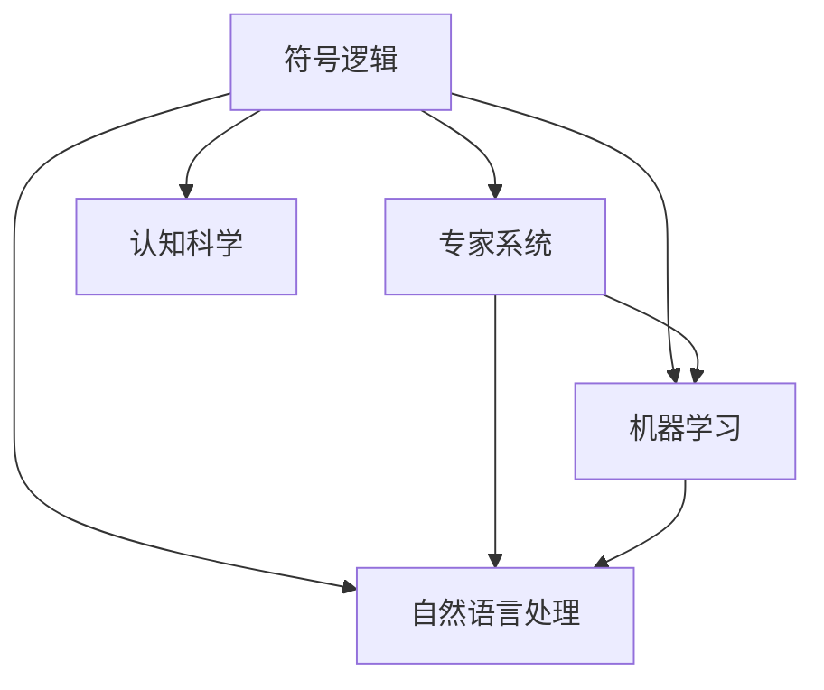

                 

# 人工智能研究的早期方向

> 关键词：人工智能,早期研究,历史发展,技术进展,未来趋势

## 1. 背景介绍

### 1.1 问题由来

人工智能（AI）作为一种探索人类智能的技术，其研究历史可以追溯到20世纪中叶。当时，计算机科学和数学领域的先驱们就已经开始思考如何构建能够模拟人类智能的系统。早期的人工智能研究，主要集中在符号逻辑和推理、专家系统以及认知科学等领域。本文将回顾这些早期的研究方向，探讨它们对现代人工智能技术发展的深远影响。

### 1.2 问题核心关键点

早期的人工智能研究旨在解决以下几个关键问题：

1. **知识表示**：如何有效表示和组织知识，使其能够被机器理解和应用。
2. **推理与决策**：如何通过推理和决策，使机器能够解决复杂问题。
3. **符号逻辑**：如何使用符号逻辑进行形式化推理和知识表示。
4. **机器学习**：如何通过学习算法，使机器能够从数据中提取模式和规律。
5. **人机交互**：如何设计人机交互界面，使机器能够理解人类语言和行为。

这些关键问题构成了早期人工智能研究的核心，推动了AI技术的不断进步。

### 1.3 问题研究意义

理解早期人工智能的研究方向，对于把握现代AI技术的脉络具有重要意义：

1. **历史视角**：能够从历史的角度回顾AI技术的发展历程，了解其演变和进步。
2. **技术借鉴**：早期的研究为现代AI技术提供了丰富的技术借鉴和理论基础。
3. **未来展望**：早期研究中探索的某些技术路径，仍具有重要的现实意义和应用价值。

## 2. 核心概念与联系

### 2.1 核心概念概述

为更好地理解早期人工智能的研究方向，本节将介绍几个密切相关的核心概念：

- **符号逻辑**：一种形式化的逻辑系统，用于表示和推理知识。早期AI研究中，符号逻辑被广泛应用于知识表示和推理。
- **专家系统**：一种基于规则的AI系统，通过专家知识库进行推理和决策。专家系统是早期AI研究中的重要应用。
- **机器学习**：一种让机器通过学习算法，从数据中自动提取规律和知识的方法。机器学习是早期AI研究的另一重要方向。
- **认知科学**：研究人类思维和认知过程的科学，早期AI研究中，认知科学提供了关于知识和推理的心理学理论。
- **自然语言处理**：使机器能够理解、处理和生成人类语言的技术，是早期AI研究的重要组成部分。

这些核心概念之间的逻辑关系可以通过以下Mermaid流程图来展示：



这个流程图展示了这个核心概念的逻辑关系：

1. 符号逻辑是早期AI研究的基础，为专家系统和机器学习提供了理论支撑。
2. 专家系统和自然语言处理是早期AI研究的重要应用。
3. 机器学习通过学习算法，进一步提升专家系统的推理能力。
4. 认知科学为早期AI研究提供了关于知识和推理的心理学理论。

这些概念共同构成了早期人工智能研究的框架，为其技术的不断演进奠定了坚实的基础。

## 3. 核心算法原理 & 具体操作步骤
### 3.1 算法原理概述

早期的人工智能研究主要围绕以下几个核心算法和原理展开：

- **符号逻辑推理**：通过符号逻辑表示和推理知识，进行形式化推理。
- **专家系统规则推理**：基于专家知识库，通过推理机制进行决策和问题解决。
- **机器学习算法**：包括决策树、神经网络、遗传算法等，通过数据学习规律和知识。
- **认知模型**：基于心理学和神经科学理论，构建模拟人类认知过程的模型。

这些算法和原理共同构成了早期AI研究的技术框架，推动了AI技术的不断进步。

### 3.2 算法步骤详解

早期的AI研究通常遵循以下步骤：

**Step 1: 知识表示**：定义符号逻辑表达式，构建知识库。

**Step 2: 规则设计**：基于领域知识设计专家系统的规则库。

**Step 3: 学习算法**：选择适当的机器学习算法，对数据进行训练和预测。

**Step 4: 认知建模**：构建模拟人类认知过程的模型，进行推理和决策。

**Step 5: 系统集成**：将符号逻辑推理、专家系统规则推理、机器学习算法和认知模型集成到完整的AI系统中。

**Step 6: 系统验证和优化**：通过测试和实验，验证和优化系统的性能。

### 3.3 算法优缺点

早期的人工智能研究具有以下优点：

1. **理论基础坚实**：符号逻辑和认知科学为AI研究提供了坚实的理论基础。
2. **规则清晰**：专家系统通过明确的规则进行推理和决策，易于理解和维护。
3. **学习能力强**：机器学习算法能够从数据中自动提取规律和知识，具有较强的泛化能力。

同时，这些研究也存在一些局限性：

1. **知识表示复杂**：符号逻辑和知识库的构建需要大量的人工干预，难以处理复杂多变的情况。
2. **应用范围有限**：早期AI系统大多应用于特定领域，如医学、金融等，难以在更广泛的领域推广。
3. **可解释性差**：早期AI系统的决策过程往往缺乏可解释性，难以理解其内部工作机制。

尽管存在这些局限性，但早期的AI研究为现代AI技术的发展奠定了坚实的基础，推动了AI技术的不断演进。

### 3.4 算法应用领域

早期的人工智能研究在以下几个领域得到了广泛应用：

- **医学诊断**：基于专家系统的AI系统被应用于医学影像分析、疾病诊断等。
- **金融分析**：专家系统用于金融市场的预测和风险评估。
- **工业控制**：符号逻辑和机器学习算法被用于自动化生产线和智能制造。
- **自然语言处理**：早期的自然语言处理研究主要集中在文本分类、机器翻译等领域。

这些应用领域展示了早期AI研究的强大潜力，为现代AI技术的发展提供了丰富的实践经验。

## 4. 数学模型和公式 & 详细讲解 & 举例说明（备注：数学公式请使用latex格式，latex嵌入文中独立段落使用 $$，段落内使用 $)
### 4.1 数学模型构建

早期AI研究中的符号逻辑推理和机器学习算法，通常需要构建数学模型来表示和推导知识。以下以决策树算法为例，展示其数学模型构建过程。

假设有一个决策树模型，用于分类任务，其结构如下：

```
A -> B1
    |   |
    V   V
C1 -> D
C2 -> E
```

其中A、B1、C1、C2、D、E为不同的特征和决策节点。

设训练集为$T=\{(x_i, y_i)\}_{i=1}^N$，其中$x_i$为输入样本，$y_i$为对应的输出标签。

决策树模型的数学模型构建过程如下：

1. **特征选择**：选择最优的特征$X_j$进行决策，设其最优阈值为$\theta_j$。
2. **节点划分**：将样本集合$T$划分为两个子集$T_1$和$T_2$，满足$T_1 = \{x_i | x_{j,i} < \theta_j\}$，$T_2 = \{x_i | x_{j,i} \geq \theta_j\}$。
3. **递归应用**：对子集$T_1$和$T_2$分别应用决策树算法，递归构建子树。
4. **剪枝优化**：对构建的决策树进行剪枝优化，避免过拟合。

### 4.2 公式推导过程

以决策树算法为例，展示其数学公式推导过程：

设决策树节点$N$的熵为$H(N)$，其信息增益为$IG(X_j, N)$，定义为：

$$
IG(X_j, N) = H(N) - \frac{1}{|N|} \sum_{x_j \in X_j} H(N|X_j=x_j)
$$

其中$H(N)$为节点$N$的熵，定义为：

$$
H(N) = -\frac{1}{|N|} \sum_{x_i \in N} y_i \log y_i
$$

决策树选择特征$X_j$的最优阈值$\theta_j$，定义为：

$$
\theta_j = \arg\min_{\theta} IG(X_j, N)
$$

决策树的递归构建过程，通过贪心策略选择最优特征进行节点划分，直到满足停止条件。

### 4.3 案例分析与讲解

以决策树在信用卡欺诈检测中的应用为例，展示其数学模型的实际应用：

假设有一个信用卡欺诈检测任务，训练集包含大量用户交易数据。使用决策树算法进行模型构建和测试：

1. **特征选择**：选择交易金额、交易地点、交易时间等特征作为决策树的输入。
2. **节点划分**：根据特征值的大小，将样本集合划分为不同的子集。
3. **剪枝优化**：通过交叉验证等方法，对决策树进行剪枝，避免过拟合。
4. **模型评估**：使用测试集对模型进行评估，计算准确率、召回率、F1-score等指标。

通过决策树算法，可以在不依赖大量标注数据的情况下，构建有效的欺诈检测模型。

## 5. 项目实践：代码实例和详细解释说明
### 5.1 开发环境搭建

在进行早期AI研究实践前，我们需要准备好开发环境。以下是使用Python进行决策树算法开发的环境配置流程：

1. 安装Anaconda：从官网下载并安装Anaconda，用于创建独立的Python环境。

2. 创建并激活虚拟环境：
```bash
conda create -n decision_tree_env python=3.8 
conda activate decision_tree_env
```

3. 安装必要的库：
```bash
conda install scikit-learn pandas numpy matplotlib
```

4. 安装决策树算法库：
```bash
pip install scikit-learn
```

5. 安装可视化工具：
```bash
pip install matplotlib
```

完成上述步骤后，即可在`decision_tree_env`环境中开始决策树算法的实现。

### 5.2 源代码详细实现

下面给出使用Scikit-learn库实现决策树的Python代码：

```python
from sklearn.datasets import make_classification
from sklearn.tree import DecisionTreeClassifier
from sklearn.model_selection import train_test_split
from sklearn.metrics import accuracy_score
import pandas as pd

# 生成随机分类数据
X, y = make_classification(n_samples=1000, n_features=4, random_state=42)

# 划分训练集和测试集
X_train, X_test, y_train, y_test = train_test_split(X, y, test_size=0.2, random_state=42)

# 创建决策树模型
clf = DecisionTreeClassifier(max_depth=3, random_state=42)

# 训练模型
clf.fit(X_train, y_train)

# 预测测试集
y_pred = clf.predict(X_test)

# 计算准确率
accuracy = accuracy_score(y_test, y_pred)
print(f"Accuracy: {accuracy:.2f}")
```

### 5.3 代码解读与分析

让我们再详细解读一下关键代码的实现细节：

**make_classification函数**：
- 用于生成随机分类数据，方便示例学习。

**train_test_split函数**：
- 将数据集划分为训练集和测试集，方便模型训练和评估。

**DecisionTreeClassifier类**：
- 用于创建决策树模型，设置参数`max_depth`为最大深度，避免过拟合。

**fit函数**：
- 使用训练数据对模型进行训练。

**predict函数**：
- 使用训练好的模型对测试数据进行预测。

**accuracy_score函数**：
- 计算预测结果与真实标签的准确率。

代码中的各个函数和类，构成了决策树算法的完整实现流程。通过这些代码，可以快速构建和评估决策树模型，实现简单的分类任务。

## 6. 实际应用场景

### 6.1 医学影像分析

早期的AI研究中，专家系统被广泛应用于医学影像分析。通过构建基于规则的专家系统，医生可以借助AI系统对医学影像进行快速、准确的分析，提高诊断效率和准确性。

在实践中，可以将医学影像数据输入专家系统，利用已有的医学知识库，进行自动识别和标注。通过不断的训练和优化，专家系统可以逐步提升其诊断能力，辅助医生进行疾病诊断和治疗方案制定。

### 6.2 金融风险评估

早期的AI研究也广泛应用于金融领域，通过专家系统进行风险评估和预测。金融市场数据复杂多样，传统的统计方法难以全面分析，而专家系统能够结合领域知识，进行更精确的风险评估。

在实践中，可以将历史金融数据和专家知识库输入专家系统，进行多维度分析和推理。通过不断迭代和优化，专家系统可以逐步提升其预测能力，帮助金融机构识别潜在风险，制定投资策略。

### 6.3 自然语言处理

早期的自然语言处理研究主要集中在文本分类、机器翻译等领域。通过构建基于符号逻辑和机器学习的模型，可以实现文本分类和翻译等任务。

在实践中，可以使用决策树和神经网络模型，对文本进行分类和翻译。通过不断训练和优化，模型可以逐步提升其准确性和泛化能力，满足实际应用需求。

### 6.4 未来应用展望

展望未来，早期AI研究中的许多技术和思想仍然具有重要的现实意义和应用价值。

1. **符号逻辑推理**：符号逻辑推理是早期AI研究的基础，未来仍将在知识表示和推理中发挥重要作用。
2. **专家系统规则推理**：专家系统在特定领域的应用，如医学、金融等，仍具有重要的现实意义。
3. **机器学习算法**：机器学习算法将继续演进，推动AI技术的不断进步。
4. **认知模型**：认知模型将继续帮助AI系统理解人类思维和认知过程，推动人机协同智能的发展。

未来，早期AI研究中的许多技术和思想，将与现代AI技术进行更深入的融合，共同推动AI技术的发展和应用。

## 7. 工具和资源推荐
### 7.1 学习资源推荐

为了帮助开发者系统掌握早期AI研究的技术基础和实践技巧，这里推荐一些优质的学习资源：

1. 《人工智能：一个现代的方法》系列书籍：详细介绍了AI技术的原理和应用，包括符号逻辑、专家系统、机器学习等内容。
2. 《机器学习》系列课程：斯坦福大学和Coursera等平台提供的多门机器学习课程，涵盖早期AI研究的经典算法和理论。
3. 《认知科学导论》书籍：介绍了认知科学的理论基础和实践方法，为早期AI研究提供了心理学支持。
4. HuggingFace官方文档：提供了大量预训练模型和代码样例，帮助开发者快速上手早期AI研究。
5. CS224N《深度学习自然语言处理》课程：斯坦福大学开设的NLP明星课程，涵盖早期AI研究中的自然语言处理技术。

通过对这些资源的学习实践，相信你一定能够系统掌握早期AI研究的技术基础和实践技巧。

### 7.2 开发工具推荐

高效的开发离不开优秀的工具支持。以下是几款用于早期AI研究开发的常用工具：

1. Python编程语言：简单易学，灵活高效，是早期AI研究的主要编程语言。
2. Scikit-learn库：提供了丰富的机器学习算法和工具，方便开发者快速实现AI模型。
3. Weights & Biases：模型训练的实验跟踪工具，可以记录和可视化模型训练过程中的各项指标，方便对比和调优。
4. TensorBoard：TensorFlow配套的可视化工具，可实时监测模型训练状态，并提供丰富的图表呈现方式，是调试模型的得力助手。
5. Anaconda：Python环境管理工具，方便开发者创建和管理虚拟环境，管理依赖包。

合理利用这些工具，可以显著提升早期AI研究任务的开发效率，加快创新迭代的步伐。

### 7.3 相关论文推荐

早期AI研究中的许多理论和算法，经过不断的演进和扩展，成为现代AI技术的核心内容。以下是几篇奠基性的相关论文，推荐阅读：

1. A New Methodology for General Problem Solving（人工智能研究的基础论文）：提出了符号逻辑和专家系统的基本思想，奠定了早期AI研究的基础。
2. Exploring the Structure of Intelligence（认知科学的重要论文）：介绍了认知科学的理论基础和实验方法，为早期AI研究提供了心理学支持。
3. Machine Learning: A Probabilistic Perspective（机器学习的重要论文）：详细介绍了机器学习的基本原理和算法，推动了早期AI研究的发展。
4. Knowledge-Based Systems: A Path to Autonomous Expert Systems（专家系统的重要论文）：探讨了专家系统的构建和应用，推动了早期AI研究在特定领域的应用。

这些论文代表了大语言模型微调技术的发展脉络。通过学习这些前沿成果，可以帮助研究者把握学科前进方向，激发更多的创新灵感。

## 8. 总结：未来发展趋势与挑战
### 8.1 总结

本文对早期人工智能的研究方向进行了全面系统的介绍。首先回顾了早期AI研究的背景和核心关键点，明确了这些研究对现代AI技术的深远影响。其次，从原理到实践，详细讲解了早期AI研究的技术框架和实现细节，给出了决策树算法的完整代码实现。同时，本文还探讨了早期AI研究在医学影像分析、金融风险评估、自然语言处理等实际应用场景中的广泛应用。最后，本文精选了早期AI研究的各类学习资源，力求为读者提供全方位的技术指引。

通过本文的系统梳理，可以看到，早期人工智能研究奠定了现代AI技术的基础，推动了AI技术的不断演进。未来，伴随技术的不断进步，早期AI研究中的许多思想和技术路径，仍将持续发挥重要作用，推动AI技术的进一步发展。

### 8.2 未来发展趋势

展望未来，早期AI研究中的许多技术和思想将继续引领AI技术的发展：

1. **符号逻辑推理**：符号逻辑推理将继续在知识表示和推理中发挥重要作用，推动AI系统的逻辑性和可解释性。
2. **专家系统规则推理**：专家系统在特定领域的应用，如医学、金融等，仍具有重要的现实意义。
3. **机器学习算法**：机器学习算法将继续演进，推动AI技术的不断进步。
4. **认知模型**：认知模型将继续帮助AI系统理解人类思维和认知过程，推动人机协同智能的发展。

这些趋势展示了早期AI研究对现代AI技术的深远影响。未来，早期AI研究中的许多技术和思想，将继续与现代AI技术进行更深入的融合，共同推动AI技术的发展和应用。

### 8.3 面临的挑战

尽管早期AI研究为现代AI技术的发展奠定了坚实基础，但在迈向更加智能化、普适化应用的过程中，仍面临诸多挑战：

1. **知识表示复杂**：符号逻辑和知识库的构建需要大量的人工干预，难以处理复杂多变的情况。
2. **应用范围有限**：早期AI系统大多应用于特定领域，难以在更广泛的领域推广。
3. **可解释性差**：早期AI系统的决策过程往往缺乏可解释性，难以理解其内部工作机制。

尽管存在这些挑战，但早期AI研究中的许多技术和思想，仍具有重要的现实意义和应用价值。未来，这些研究将与现代AI技术进行更深入的融合，共同推动AI技术的发展和应用。

### 8.4 研究展望

面向未来，早期AI研究需要在以下几个方面寻求新的突破：

1. **知识表示简化**：简化知识表示的复杂度，提高知识库的自动构建和维护能力。
2. **多领域应用**：推动早期AI研究在更多领域的应用，如智慧医疗、智能制造等。
3. **可解释性提升**：增强AI系统的可解释性，提升其决策过程的透明性和可信度。
4. **认知模型优化**：优化认知模型的结构和算法，提高其模拟人类认知过程的能力。

这些研究方向将推动早期AI研究向更高层次迈进，为构建智能、可靠、可解释的AI系统提供新的思路和方法。总之，早期AI研究具有重要的现实意义和应用价值，未来将在AI技术的发展中继续发挥重要作用。

## 9. 附录：常见问题与解答

**Q1：早期AI研究与现代AI技术有何异同？**

A: 早期AI研究与现代AI技术有以下异同：

1. 异：早期AI研究主要集中在符号逻辑、专家系统、机器学习等技术，而现代AI技术则更关注深度学习、自然语言处理、计算机视觉等技术。
2. 同：早期AI研究与现代AI技术都关注知识的表示和推理，致力于构建能够模拟人类智能的系统。

**Q2：早期AI研究的主要研究方向有哪些？**

A: 早期AI研究的主要研究方向包括：

1. 符号逻辑和知识库构建：通过符号逻辑表示和推理知识。
2. 专家系统规则推理：基于专家知识库，进行推理和决策。
3. 机器学习算法：通过学习算法，从数据中提取规律和知识。
4. 认知模型构建：基于心理学和神经科学理论，模拟人类认知过程。
5. 自然语言处理：使机器能够理解、处理和生成人类语言。

**Q3：早期AI研究的局限性有哪些？**

A: 早期AI研究的局限性包括：

1. 知识表示复杂：符号逻辑和知识库的构建需要大量的人工干预，难以处理复杂多变的情况。
2. 应用范围有限：早期AI系统大多应用于特定领域，难以在更广泛的领域推广。
3. 可解释性差：早期AI系统的决策过程往往缺乏可解释性，难以理解其内部工作机制。

**Q4：早期AI研究在实际应用中的表现如何？**

A: 早期AI研究在实际应用中表现出色，已在多个领域取得成功：

1. 医学影像分析：利用专家系统进行快速、准确的影像分析。
2. 金融风险评估：利用专家系统进行多维度分析和推理。
3. 自然语言处理：利用决策树和神经网络模型进行文本分类和翻译。

通过不断迭代和优化，早期AI研究中的许多技术和思想，仍具有重要的现实意义和应用价值。

**Q5：未来早期AI研究的发展方向是什么？**

A: 未来早期AI研究的发展方向包括：

1. 简化知识表示：简化知识表示的复杂度，提高知识库的自动构建和维护能力。
2. 多领域应用：推动早期AI研究在更多领域的应用，如智慧医疗、智能制造等。
3. 提升可解释性：增强AI系统的可解释性，提升其决策过程的透明性和可信度。
4. 优化认知模型：优化认知模型的结构和算法，提高其模拟人类认知过程的能力。

这些研究方向将推动早期AI研究向更高层次迈进，为构建智能、可靠、可解释的AI系统提供新的思路和方法。

