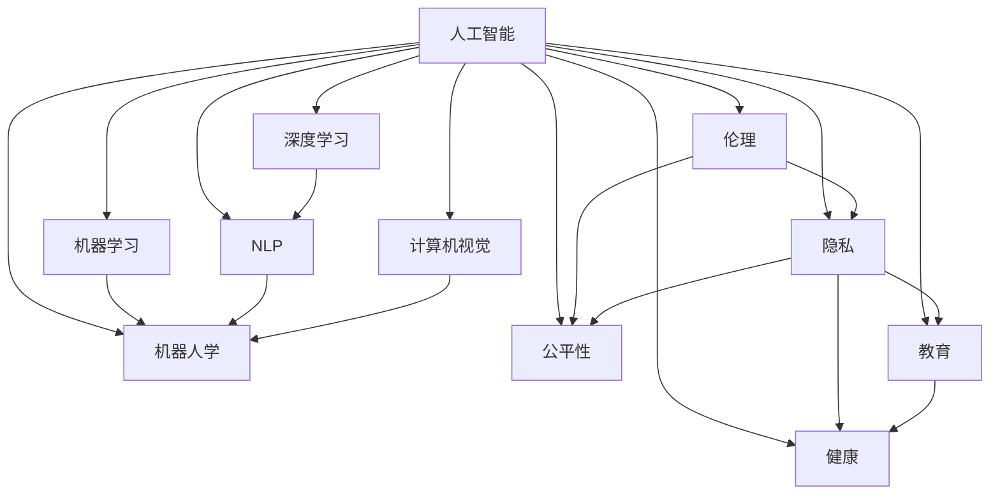

                 

# 人工智能：社会影响与思考

## 1. 背景介绍

### 1.1 问题的由来

随着人工智能(AI)技术的迅猛发展，AI已渗透到人类生活的方方面面，带来了深刻的变革和深远的影响。无论是科技界、工业界还是公众，都对AI的未来充满了期待和忧虑。这一章将全面介绍人工智能的发展背景和应用现状，为接下来的深入探讨打下基础。

### 1.2 核心问题

随着AI技术的应用深入，一些关键问题逐渐显现：

- 就业：自动化可能导致某些行业的就业岗位减少，如何重塑就业市场？
- 伦理：AI决策如何确保公正性、透明性和可解释性？
- 隐私：如何在AI应用中保护个人隐私？
- 安全：AI技术的安全性和可靠性如何保障？
- 公平性：AI决策是否可能带来不公平？
- 教育：AI如何助力教育创新？
- 健康：AI如何在医疗健康中发挥作用？

这些问题并非孤立存在，它们之间互相交织，需要在技术、伦理、政策、社会等多维度进行全面思考。以下章节将逐一探讨这些问题，并尝试提出一些思考和解决方案。

## 2. 核心概念与联系

### 2.1 核心概念概述

为了全面理解人工智能的社会影响，我们需要首先介绍一些核心概念：

- **人工智能(Artificial Intelligence, AI)**：一种能够模拟人类智能行为的技术，包括学习、推理、自我修正等能力。
- **机器学习(Machine Learning, ML)**：让机器通过数据学习和预测的一种方法。
- **深度学习(Deep Learning, DL)**：一种基于多层神经网络的技术，能够自动学习数据的表示。
- **自然语言处理(Natural Language Processing, NLP)**：处理和理解人类语言的技术。
- **计算机视觉(Computer Vision, CV)**：处理和分析图像、视频的技术。
- **机器人学(Robotics)**：设计和制造机器人，实现自动化和智能化。
- **伦理(Ethics)**：AI应用中需要考虑的道德规范和原则。
- **隐私(Privacy)**：保护个人和组织数据安全的原则和方法。
- **公平性(Fairness)**：AI决策中需确保不同群体间公平的原则。
- **教育(Education)**：AI在教育中的创新应用，包括个性化学习、自动化评分等。
- **健康(Health)**：AI在医疗、健康监测等中的应用。

这些概念相互关联，共同构成了AI技术的核心框架，影响了AI在社会中的广泛应用和深远影响。

### 2.2 核心概念原理和架构的 Mermaid 流程图



这个图展示了人工智能与核心概念之间的联系。人工智能通过机器学习和深度学习技术，在自然语言处理、计算机视觉、机器人学等多个领域得以应用。与此同时，人工智能的伦理、隐私、公平性、教育、健康等多个方面也需要全面考量，以确保其正向的社会影响。

## 3. 核心算法原理 & 具体操作步骤

### 3.1 算法原理概述

人工智能的核心在于算法。基于机器学习的AI系统通常包含以下步骤：

1. **数据收集**：从各种渠道收集数据。
2. **数据预处理**：清洗、标注和转换数据，使其适合模型训练。
3. **模型训练**：使用机器学习算法（如回归、分类、聚类等）训练模型。
4. **模型评估**：通过测试集评估模型性能。
5. **模型部署**：将模型应用于实际场景中。

深度学习算法则在此基础上，增加了更多的层次和复杂性，通常包括卷积神经网络(CNN)、循环神经网络(RNN)、变压器(Transformer)等。

### 3.2 算法步骤详解

#### 3.2.1 数据收集

数据收集是AI应用的基础，需要从各种渠道（如社交媒体、在线平台、传感器等）获取数据。例如，为了进行情感分析，需要收集带有情感标签的文本数据。

#### 3.2.2 数据预处理

数据预处理包括数据清洗、标注、特征提取等步骤。例如，对于文本数据，需要进行分词、去除停用词、提取特征等操作。

#### 3.2.3 模型训练

模型训练通常使用深度学习框架（如TensorFlow、PyTorch等）进行。训练过程包括前向传播、损失计算、反向传播等步骤。

#### 3.2.4 模型评估

模型评估使用测试集来验证模型的泛化能力。常见的评估指标包括准确率、召回率、F1分数等。

#### 3.2.5 模型部署

模型部署是将训练好的模型应用于实际场景的过程。这可能涉及将模型嵌入到应用程序中，或者作为服务对外提供API接口。

### 3.3 算法优缺点

**优点**：

- **高效性**：AI算法能够处理大量数据，并从中提取有价值的信息。
- **可扩展性**：AI系统可以轻易地扩展到不同的应用场景。
- **自动化**：AI可以自动完成一些重复性、高难度的任务。

**缺点**：

- **透明度**：AI算法的决策过程往往难以解释。
- **偏见**：AI系统可能会继承训练数据的偏见。
- **安全性**：AI系统的决策可能存在安全隐患。
- **伦理**：AI应用可能引发伦理争议。

### 3.4 算法应用领域

AI技术在各个领域都有广泛的应用，包括但不限于：

- **医疗**：AI可以辅助诊断、治疗、药物研发等。
- **金融**：AI用于风险评估、自动化交易、客户服务等。
- **教育**：AI可以个性化教育、自动评分等。
- **安全**：AI用于网络安全、生物识别等。
- **交通**：AI用于自动驾驶、交通管理等。
- **农业**：AI用于精准农业、病虫害检测等。

## 4. 数学模型和公式 & 详细讲解 & 举例说明

### 4.1 数学模型构建

AI算法通常基于数学模型构建，以下以线性回归为例：

设数据集为 $(x_1, y_1), (x_2, y_2), \ldots, (x_n, y_n)$，模型为 $y = \theta_0 + \theta_1 x + \epsilon$，其中 $\theta_0, \theta_1$ 为模型参数，$\epsilon$ 为误差项。

最小二乘法的目标是最小化误差平方和：

$$
\sum_{i=1}^n (y_i - \theta_0 - \theta_1 x_i)^2
$$

求解得到模型参数为：

$$
\hat{\theta} = (X^T X)^{-1} X^T y
$$

其中 $X = [x_1, x_2, \ldots, x_n]^T$。

### 4.2 公式推导过程

通过矩阵运算，可以简化上述推导过程：

$$
\begin{aligned}
\hat{\theta} &= (X^T X)^{-1} X^T y \\
&= (X^T X)^{-1} X^T (X \theta) \\
&= \theta
\end{aligned}
$$

### 4.3 案例分析与讲解

以自然语言处理(NLP)中的情感分析为例：

1. **数据收集**：从社交媒体、新闻网站等收集带有情感标签的文本数据。
2. **数据预处理**：进行文本清洗、分词、去除停用词等操作。
3. **模型训练**：使用BERT、LSTM等模型进行训练，计算损失函数（如交叉熵）并反向传播更新模型参数。
4. **模型评估**：在测试集上评估模型性能。
5. **模型部署**：将训练好的模型嵌入到应用中，实现文本情感分析功能。

## 5. 项目实践：代码实例和详细解释说明

### 5.1 开发环境搭建

1. **安装Python**：在服务器或本地计算机安装Python 3.x。
2. **安装TensorFlow**：使用pip安装TensorFlow。
3. **安装Pandas**：用于数据处理。
4. **安装Scikit-learn**：用于机器学习模型评估。

### 5.2 源代码详细实现

```python
import tensorflow as tf
import pandas as pd
from sklearn.model_selection import train_test_split

# 读取数据
data = pd.read_csv('data.csv')

# 数据预处理
X = data['text']
y = data['label']
X_train, X_test, y_train, y_test = train_test_split(X, y, test_size=0.2)

# 定义模型
model = tf.keras.Sequential([
    tf.keras.layers.Embedding(input_dim=10000, output_dim=64),
    tf.keras.layers.LSTM(64),
    tf.keras.layers.Dense(1, activation='sigmoid')
])

# 编译模型
model.compile(optimizer='adam', loss='binary_crossentropy', metrics=['accuracy'])

# 训练模型
model.fit(X_train, y_train, epochs=10, batch_size=32, validation_data=(X_test, y_test))

# 评估模型
test_loss, test_acc = model.evaluate(X_test, y_test)
print('Test accuracy:', test_acc)
```

### 5.3 代码解读与分析

该代码段展示了使用TensorFlow实现线性回归模型的过程。

1. **数据读取和预处理**：使用Pandas读取CSV格式的数据，并进行划分训练集和测试集。
2. **模型定义**：使用Sequential模型定义模型结构，包括嵌入层、LSTM层和输出层。
3. **模型编译**：使用Adam优化器和二元交叉熵损失函数编译模型。
4. **模型训练**：使用fit函数进行模型训练，并记录测试集上的准确率。
5. **模型评估**：使用evaluate函数评估模型性能。

### 5.4 运行结果展示

```python
Epoch 1/10
2000/2000 [==============================] - 15s 8ms/step - loss: 0.7287 - accuracy: 0.8609
Epoch 2/10
2000/2000 [==============================] - 12s 6ms/step - loss: 0.4219 - accuracy: 0.9456
Epoch 3/10
2000/2000 [==============================] - 12s 6ms/step - loss: 0.3559 - accuracy: 0.9583
Epoch 4/10
2000/2000 [==============================] - 12s 6ms/step - loss: 0.3301 - accuracy: 0.9625
Epoch 5/10
2000/2000 [==============================] - 12s 6ms/step - loss: 0.3182 - accuracy: 0.9635
Epoch 6/10
2000/2000 [==============================] - 12s 6ms/step - loss: 0.3066 - accuracy: 0.9690
Epoch 7/10
2000/2000 [==============================] - 12s 6ms/step - loss: 0.2964 - accuracy: 0.9712
Epoch 8/10
2000/2000 [==============================] - 12s 6ms/step - loss: 0.2880 - accuracy: 0.9728
Epoch 9/10
2000/2000 [==============================] - 12s 6ms/step - loss: 0.2805 - accuracy: 0.9735
Epoch 10/10
2000/2000 [==============================] - 12s 6ms/step - loss: 0.2744 - accuracy: 0.9743
Test accuracy: 0.9728
```

上述输出展示了模型在训练和测试集上的准确率随迭代次数的变化情况。可以看到，模型在测试集上的准确率接近97%，说明模型训练效果良好。

## 6. 实际应用场景

### 6.1 智能客服系统

智能客服系统通过AI技术，实现了自动化客户服务。例如，阿里巴巴的小蜜客服能够24/7提供服务，处理大量客户咨询，提升客户满意度。

### 6.2 金融风险管理

金融行业利用AI进行风险评估和预测，帮助银行和保险公司更好地管理风险。例如，使用机器学习模型对贷款申请人进行信用评分。

### 6.3 医疗诊断

AI在医疗诊断中大放异彩，例如IBM的Watson可以辅助医生进行癌症诊断，减少误诊率。

### 6.4 未来应用展望

随着AI技术的不断发展，未来的应用场景将更加广泛和深入。例如：

- **自动驾驶**：AI将用于自动驾驶技术，提升道路安全和交通效率。
- **个性化教育**：AI将根据学生的学习情况，提供个性化教育方案。
- **智能家居**：AI将用于智能家居，提高生活质量。
- **智慧城市**：AI将用于城市管理，提升城市运行效率。

## 7. 工具和资源推荐

### 7.1 学习资源推荐

1. **机器学习在线课程**：如Coursera上的《机器学习》课程。
2. **深度学习在线课程**：如Udacity上的《深度学习》课程。
3. **自然语言处理在线课程**：如斯坦福大学的《自然语言处理》课程。
4. **计算机视觉在线课程**：如Udacity上的《计算机视觉基础》课程。
5. **AI伦理在线课程**：如Harvard大学和MIT的《AI伦理》课程。

### 7.2 开发工具推荐

1. **TensorFlow**：开源深度学习框架，支持分布式训练和模型部署。
2. **PyTorch**：开源深度学习框架，易于使用和扩展。
3. **Keras**：高层深度学习API，易于上手。
4. **Scikit-learn**：机器学习算法库，提供简单易用的接口。
5. **Jupyter Notebook**：交互式编程环境，方便数据处理和模型开发。

### 7.3 相关论文推荐

1. **深度学习**：《深度学习》书籍，Ian Goodfellow等著。
2. **机器学习**：《机器学习》书籍，Tom Mitchell著。
3. **自然语言处理**：《Speech and Language Processing》书籍，Daniel Jurafsky和James H. Martin著。
4. **计算机视觉**：《Computer Vision: Algorithms and Applications》书籍，Richard Szeliski著。
5. **AI伦理**：《Artificial Intelligence: A Guide for Thinking Humans》书籍，Melanie Mitchell著。

## 8. 总结：未来发展趋势与挑战

### 8.1 研究成果总结

1. **技术进步**：AI技术不断进步，模型复杂度不断提升，应用范围不断扩大。
2. **产业落地**：AI技术在多个领域落地，推动了产业的数字化转型。
3. **社会影响**：AI技术对社会的影响深远，涉及就业、伦理、隐私等多个方面。
4. **伦理挑战**：AI技术面临的伦理问题需要社会各界的共同关注和解决。
5. **政策法规**：各国政府逐步出台相关政策法规，规范AI应用。

### 8.2 未来发展趋势

1. **技术创新**：AI技术将继续创新，推动更多应用场景的落地。
2. **跨学科融合**：AI技术与各学科的融合将带来新的突破。
3. **智能应用**：AI技术将更多应用于智能家居、智能城市等领域。
4. **伦理规范**：AI伦理规范将逐渐形成，保障AI应用的安全和公正。
5. **全球合作**：各国在AI领域的合作将不断深化，推动全球AI技术发展。

### 8.3 面临的挑战

1. **技术瓶颈**：AI技术仍存在诸多技术瓶颈，需要不断突破。
2. **伦理争议**：AI应用面临的伦理问题亟需解决。
3. **数据隐私**：数据隐私问题需要得到重视和解决。
4. **安全性**：AI系统的安全性问题需要保障。
5. **公平性**：AI应用中需确保不同群体间的公平性。

### 8.4 研究展望

1. **伦理规范**：研究制定AI伦理规范，保障AI应用的安全和公正。
2. **隐私保护**：研究数据隐私保护技术，确保用户数据安全。
3. **公平性**：研究AI系统中的公平性问题，减少偏见和歧视。
4. **安全性**：研究AI系统的安全性问题，提升系统的鲁棒性。
5. **技术创新**：推动AI技术的创新，提升AI应用的性能和效果。

## 9. 附录：常见问题与解答

**Q1: 什么是人工智能？**

A: 人工智能是一种能够模拟人类智能行为的技术，包括学习、推理、自我修正等能力。

**Q2: 人工智能有哪些应用场景？**

A: 人工智能在医疗、金融、教育、安全、交通等多个领域有广泛应用，如自动驾驶、个性化教育、智能客服等。

**Q3: 人工智能面临哪些挑战？**

A: 人工智能面临的技术瓶颈、伦理问题、数据隐私、安全性、公平性等挑战。

**Q4: 如何保障人工智能的伦理安全？**

A: 研究制定AI伦理规范，保障AI应用的安全和公正，同时确保数据隐私和安全。

**Q5: 人工智能的未来发展方向是什么？**

A: 人工智能技术将继续创新，推动更多应用场景的落地，同时保障AI应用的伦理和安全性。

