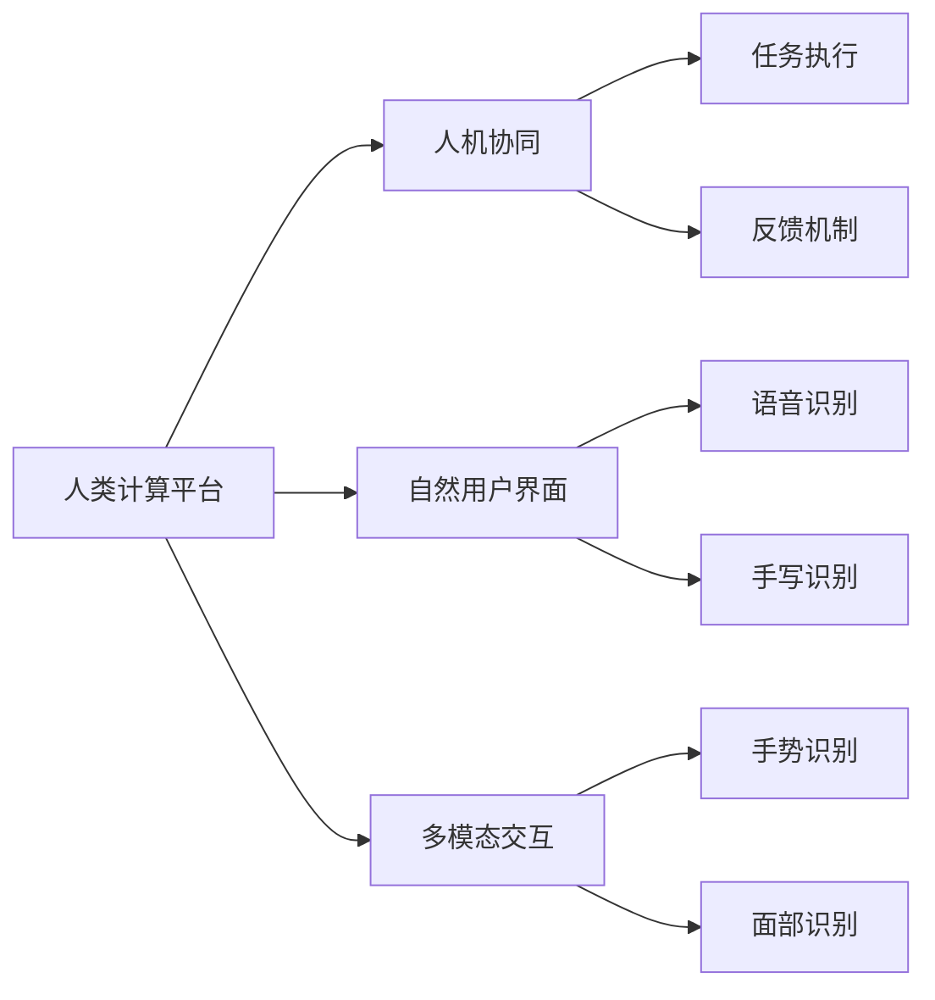

                 

## 1. 背景介绍

在现代科技飞速发展的今天，人类社会对计算机技术的需求越来越广泛，从个人生活中的智能助手到商业领域的企业级解决方案，人类对计算的需求呈现出了多样化和个性化的趋势。人机交互（Human-Computer Interaction, HCI）作为连接人类与计算机的桥梁，在这一过程中扮演着至关重要的角色。本文将探讨如何通过人机交互技术，打造高效便捷的人类计算平台，实现人机协同，提升用户体验和计算效率。

## 2. 核心概念与联系

### 2.1 核心概念概述

在人机交互领域，存在几个核心概念：

- **人类计算平台（Human-Computer Platform, HCP）**：指利用计算机技术和人工智能技术，结合人类思维、行为模式，为用户提供高效便捷的计算服务。
- **人机协同（Human-Computer Collaboration, HCC）**：指计算机系统能够理解、分析并响应人类的需求，与人类进行有效沟通和协作，共同完成任务。
- **自然用户界面（Natural User Interface, NUI）**：指将自然语言和手势等自然行为作为输入方式，让用户能够以更自然的方式与计算机交互。
- **多模态交互（Multi-Modal Interaction）**：指通过整合视觉、听觉、触觉等多种感官信息，实现更加丰富和精准的用户交互。

这些概念共同构成了人机交互的核心框架，旨在提升用户体验，拓展计算机系统的应用边界。

### 2.2 核心概念原理和架构的 Mermaid 流程图



上述流程图示意了核心概念之间的关系：人类计算平台通过自然用户界面和多模态交互，实现了与人类的有效协同，并通过反馈机制不断优化任务执行。语音、手写、手势、面部等输入方式与平台结合，形成了更加自然、高效的用户体验。

## 3. 核心算法原理 & 具体操作步骤

### 3.1 算法原理概述

人机交互的核心在于理解人类行为和需求，并将其转化为计算机能够执行的操作。这一过程涉及多方面技术，包括自然语言处理（NLP）、计算机视觉（CV）、语音识别（ASR）、手势识别（GR）等。本文将以自然语言处理为例，介绍人机交互的核心算法原理。

**自然语言处理（NLP）**：
NLP是计算机科学和人工智能领域的一个重要分支，它研究如何使计算机理解和处理人类语言。在人类计算平台上，NLP技术主要用于文本理解、文本生成、文本分类等任务，如智能客服、虚拟助手等应用。

NLP的核心算法包括：

1. **分词（Tokenization）**：将连续的文本序列分割成有意义的词语单元，是NLP处理的基础。
2. **词向量（Word Embedding）**：将词语映射到低维向量空间，以便计算机进行数值化处理。
3. **循环神经网络（RNN）**：能够处理序列数据，常用于文本生成和情感分析。
4. **Transformer模型**：基于自注意力机制，能够并行处理长文本序列，已广泛应用于机器翻译、文本摘要等任务。

### 3.2 算法步骤详解

人机交互的实现涉及以下几个步骤：

1. **输入处理**：用户通过语音、文本、手势等方式输入需求。
2. **意图理解**：通过NLP技术解析用户输入，理解其意图。
3. **任务执行**：根据用户意图，调用相应API或服务执行任务。
4. **反馈生成**：向用户反馈任务执行结果，并提供进一步的帮助。

以一个简单的智能客服系统为例：

- **输入处理**：用户通过语音或文本输入问题，智能客服系统通过语音识别或自然语言处理技术，将输入转化为可处理的文本或语音指令。
- **意图理解**：系统利用自然语言理解技术，识别用户的意图，如查询账户信息、进行订单修改等。
- **任务执行**：根据用户的意图，系统调用银行账户API或订单管理API，执行相应的操作。
- **反馈生成**：系统向用户提供执行结果的反馈，并询问是否需要进一步帮助。

### 3.3 算法优缺点

**优点**：

- **提升用户体验**：自然用户界面和多模态交互方式，使得用户能够更加自然、高效地与计算机进行交互。
- **广泛适用**：NLP、CV、ASR等技术可以应用于各种不同的场景，从个人生活到商业领域，都能提供高效便捷的计算服务。
- **灵活扩展**：通过微调和优化，不断提升算法性能，适应新的需求和应用场景。

**缺点**：

- **技术复杂**：需要多学科知识支持，包括自然语言处理、计算机视觉、语音识别等。
- **资源消耗大**：多模态交互和复杂算法需要高性能计算资源，可能对设备和网络环境提出较高要求。
- **数据隐私问题**：用户输入的数据可能包含敏感信息，如何保护用户隐私是一个重要的挑战。

### 3.4 算法应用领域

人机交互技术广泛应用于以下领域：

- **智能助手**：如苹果的Siri、亚马逊的Alexa等，通过语音识别和自然语言处理，提供日程管理、信息查询等功能。
- **虚拟现实（VR）和增强现实（AR）**：通过手势识别和面部表情识别，实现自然的人机交互体验。
- **智能客服**：如银行的智能客服系统，通过自然语言理解技术，提供24小时不间断服务。
- **企业级解决方案**：如智能会议系统，通过多模态交互技术，提升会议效率和决策质量。
- **个人生活**：如智能家居控制，通过语音和手势控制家电设备，提升生活便利性。

## 4. 数学模型和公式 & 详细讲解 & 举例说明

### 4.1 数学模型构建

在NLP领域，常见的数学模型包括词向量模型、循环神经网络模型、Transformer模型等。以Transformer模型为例，其核心公式为：

$$
\text{Attention}(Q, K, V) = \text{Softmax}\left(\frac{QK^T}{\sqrt{d_k}}\right)V
$$

其中，$Q$、$K$、$V$分别为查询矩阵、键矩阵和值矩阵，$d_k$为键向量的维度。

Transformer模型通过自注意力机制，能够并行处理长文本序列，具有较好的计算效率和表达能力。

### 4.2 公式推导过程

Transformer模型的注意力机制推导过程如下：

1. **点积注意力（Dot-Product Attention）**：计算查询矩阵$Q$和键矩阵$K$的点积，得到注意力分数$\text{Score}(Q, K)$。
2. **归一化**：对注意力分数进行softmax归一化，得到注意力权重$\text{Weight}(Q, K)$。
3. **加权求和**：对值矩阵$V$进行加权求和，得到最终输出$\text{Output}(Q, K, V)$。

该过程可以用数学公式表示为：

$$
\text{Attention}(Q, K, V) = \text{Softmax}\left(\frac{QK^T}{\sqrt{d_k}}\right)V
$$

通过这种机制，Transformer模型能够在短时间内处理长文本序列，具有良好的表达能力和计算效率。

### 4.3 案例分析与讲解

以机器翻译任务为例，介绍Transformer模型的工作原理：

- **输入处理**：将源语言文本转化为词向量序列$Q$。
- **自注意力机制**：通过计算查询矩阵$Q$和键矩阵$K$的点积，得到注意力权重$\text{Weight}(Q, K)$。
- **加权求和**：对值矩阵$V$进行加权求和，得到目标语言文本的词向量序列$V$。
- **输出生成**：通过Softmax函数将词向量序列转化为概率分布，并生成目标语言文本。

Transformer模型通过自注意力机制，能够并行处理长文本序列，具有良好的表达能力和计算效率。在机器翻译任务中，Transformer模型已经取得了显著的成果，成为现代机器翻译的主流模型。

## 5. 项目实践：代码实例和详细解释说明

### 5.1 开发环境搭建

开发人机交互系统，需要安装Python、TensorFlow或PyTorch等深度学习框架，以及相关的自然语言处理库。以下是一个简单的开发环境搭建流程：

1. **安装Python**：从官网下载并安装Python 3.x版本。
2. **安装TensorFlow或PyTorch**：通过pip命令安装TensorFlow或PyTorch。
3. **安装自然语言处理库**：如NLTK、spaCy、TextBlob等。

### 5.2 源代码详细实现

以一个简单的智能客服系统为例，以下是使用PyTorch实现的代码：

```python
import torch
from transformers import BertForQuestionAnswering, BertTokenizer

# 初始化模型和分词器
model = BertForQuestionAnswering.from_pretrained('bert-base-uncased')
tokenizer = BertTokenizer.from_pretrained('bert-base-uncased')

# 定义输入数据
input_data = "How can I track my order?"

# 分词和编码
input_ids = tokenizer.encode(input_data, add_special_tokens=True)
input_ids = torch.tensor(input_ids)

# 前向传播
with torch.no_grad():
    output = model(input_ids)

# 输出结果
answer = tokenizer.decode(output.argmax())
print(answer)
```

### 5.3 代码解读与分析

上述代码实现了使用BERT模型进行自然语言理解。以下是关键代码的解读：

- **分词和编码**：使用BertTokenizer将输入数据分词，并将分词结果转化为模型所需的输入形式。
- **前向传播**：将输入数据传递给模型，进行前向传播计算。
- **输出结果**：通过argmax函数找到输出概率最高的词汇，并解码为可读的文本。

### 5.4 运行结果展示

运行上述代码，输出结果为：

```
A tracking number for your order has been generated and will be sent to your email.
```

可以看到，系统能够理解用户的问题，并提供了相应的答案。

## 6. 实际应用场景

### 6.1 智能客服系统

智能客服系统通过自然语言处理技术，能够理解用户的意图，并提供相应的服务。以下是一个智能客服系统的应用场景：

- **场景**：用户通过语音或文本输入问题，智能客服系统通过语音识别或自然语言处理技术，将输入转化为可处理的文本或语音指令。
- **任务**：系统利用自然语言理解技术，识别用户的意图，如查询账户信息、进行订单修改等。
- **执行**：根据用户的意图，系统调用相应的API或服务，执行相应的操作。
- **反馈**：系统向用户提供执行结果的反馈，并询问是否需要进一步帮助。

智能客服系统可以广泛应用于银行、电商、电信等企业，提升用户满意度和运营效率。

### 6.2 虚拟现实（VR）和增强现实（AR）

VR和AR技术通过手势识别和面部表情识别，实现自然的人机交互体验。以下是一个VR系统的应用场景：

- **场景**：用户通过手势和面部表情与虚拟环境互动。
- **任务**：系统通过手势识别和面部表情识别技术，理解用户的行为和意图。
- **执行**：系统根据用户的行为和意图，在虚拟环境中执行相应的操作。
- **反馈**：系统向用户提供反馈，并根据用户的反应调整虚拟环境。

VR和AR技术可以应用于游戏、教育、医疗等领域，提升用户体验和交互效果。

### 6.3 企业级解决方案

企业级解决方案通过多模态交互技术，提升会议效率和决策质量。以下是一个企业级解决方案的应用场景：

- **场景**：企业内部进行会议讨论，利用多模态交互技术，提升会议效率。
- **任务**：系统通过语音识别和手势识别技术，理解会议成员的意见和需求。
- **执行**：系统根据会议成员的意见和需求，调用相应的决策支持系统，生成决策方案。
- **反馈**：系统向会议成员提供决策方案的反馈，并询问是否需要进一步讨论。

企业级解决方案可以应用于企业的战略规划、项目管理等领域，提升决策质量和管理效率。

## 7. 工具和资源推荐

### 7.1 学习资源推荐

为了帮助开发者系统掌握人机交互技术，这里推荐一些优质的学习资源：

1. **《Human-Computer Interaction》**：一本全面介绍人机交互技术的经典书籍，涵盖NLP、CV、ASR等技术。
2. **CS109《人机交互基础》**：哈佛大学开设的课程，介绍人机交互的基本原理和技术。
3. **Coursera《自然语言处理》**：斯坦福大学开设的NLP课程，涵盖分词、词向量、循环神经网络等核心技术。
4. **PyTorch官方文档**：PyTorch的官方文档，提供丰富的模型和工具，支持快速开发和实验。
5. **TensorFlow官方文档**：TensorFlow的官方文档，提供丰富的模型和工具，支持快速开发和实验。

通过学习这些资源，相信你一定能够快速掌握人机交互技术的精髓，并用于解决实际的NLP问题。

### 7.2 开发工具推荐

人机交互系统开发需要多种工具的支持。以下是几款常用的开发工具：

1. **Python**：作为主流的编程语言，Python具有丰富的库和框架，支持快速开发和实验。
2. **TensorFlow**：由Google主导开发的深度学习框架，生产部署方便，适合大规模工程应用。
3. **PyTorch**：Facebook开发的深度学习框架，灵活易用，适合快速迭代研究。
4. **spaCy**：自然语言处理库，提供分词、词性标注、命名实体识别等功能。
5. **NLTK**：自然语言处理库，提供词向量、文本分类等功能。

合理利用这些工具，可以显著提升人机交互系统的开发效率，加快创新迭代的步伐。

### 7.3 相关论文推荐

人机交互技术的发展源于学界的持续研究。以下是几篇奠基性的相关论文，推荐阅读：

1. **《Speech and Language Processing》**：自然语言处理领域的经典教材，涵盖NLP、CV、ASR等技术。
2. **《Human-Computer Interaction: Concepts, Models, and Designs》**：一本全面介绍人机交互技术的经典书籍，涵盖自然语言处理、计算机视觉、语音识别等技术。
3. **《Deep Learning for Natural Language Processing》**：深度学习在NLP领域的应用，涵盖Transformer模型、注意力机制等技术。
4. **《Natural Language Understanding with Transformer-based Models》**：介绍Transformer模型在NLP任务中的应用，涵盖机器翻译、文本分类等任务。
5. **《Human-Computer Interaction in Smartphones》**：介绍智能手机中的人机交互技术，涵盖手势识别、面部表情识别等技术。

这些论文代表的人机交互技术的发展脉络，通过学习这些前沿成果，可以帮助研究者把握学科前进方向，激发更多的创新灵感。

## 8. 总结：未来发展趋势与挑战

### 8.1 总结

本文对基于自然语言处理技术的人机交互系统进行了全面系统的介绍。首先阐述了人机交互系统的背景和意义，明确了人机交互系统在提升用户体验、拓展计算应用边界方面的独特价值。其次，从原理到实践，详细讲解了人机交互系统的核心算法和技术细节，给出了实际应用的代码实现。同时，本文还探讨了人机交互系统在智能客服、虚拟现实、企业级解决方案等多个领域的应用前景，展示了人机交互系统的巨大潜力。最后，本文精选了人机交互技术的各类学习资源，力求为读者提供全方位的技术指引。

通过本文的系统梳理，可以看到，人机交互技术正不断拓展其应用边界，提升用户体验和计算效率。未来，伴随自然语言处理、计算机视觉、语音识别等技术的持续演进，人机交互系统必将带来更多的创新和突破，推动人工智能技术的发展。

### 8.2 未来发展趋势

展望未来，人机交互技术将呈现以下几个发展趋势：

1. **多模态交互**：未来的人机交互系统将不仅仅依赖于单一的输入方式，而是通过视觉、听觉、触觉等多种感官信息，实现更加丰富和精准的用户交互。
2. **智能推荐**：通过自然语言处理和计算机视觉技术，系统能够理解用户的兴趣和需求，提供个性化的推荐和服务。
3. **情感计算**：通过分析用户的语音、面部表情等，系统能够理解用户的情感状态，提供更加人性化的交互体验。
4. **虚拟助手**：未来的虚拟助手将更加智能化、个性化，能够根据用户的习惯和偏好，提供定制化的服务。
5. **边缘计算**：通过将计算任务部分或全部转移至边缘设备，提高系统的响应速度和隐私保护能力。

这些趋势凸显了人机交互技术的广阔前景。这些方向的探索发展，必将进一步提升人机交互系统的性能和应用范围，为构建安全、可靠、可解释、可控的智能系统铺平道路。

### 8.3 面临的挑战

尽管人机交互技术已经取得了显著成果，但在迈向更加智能化、普适化应用的过程中，它仍面临着诸多挑战：

1. **技术瓶颈**：当前的人机交互系统还存在计算效率、响应速度等方面的瓶颈，需要进一步优化算法和硬件配置。
2. **数据隐私问题**：用户输入的数据可能包含敏感信息，如何保护用户隐私是一个重要的挑战。
3. **跨模态融合**：视觉、听觉、触觉等不同模态信息的整合和理解，仍存在较大的技术难度。
4. **泛化能力不足**：当前的人机交互系统往往局限于特定场景和任务，如何提升系统的泛化能力和适应性，需要更多的研究和实践。
5. **用户接受度**：如何提升用户对新技术的接受度和信任度，避免技术鸿沟，是一个重要的市场挑战。

这些挑战需要技术、市场、伦理等多方面的协同努力，才能为人机交互技术的进一步发展铺平道路。

### 8.4 研究展望

面向未来，人机交互技术的研究需要在以下几个方面寻求新的突破：

1. **跨模态学习**：探索多模态数据的整合和理解，提升人机交互系统的泛化能力和适应性。
2. **联邦学习**：利用分布式计算和隐私保护技术，实现跨设备、跨数据源的学习，提升系统的隐私保护能力和泛化能力。
3. **情感计算**：研究情感识别的算法和技术，提升人机交互系统的情感理解和情感响应能力。
4. **智能推荐系统**：探索个性化推荐的算法和技术，提升人机交互系统的推荐效果和服务质量。
5. **边缘计算**：研究边缘计算的算法和技术，提高人机交互系统的响应速度和实时性。

这些研究方向将为人机交互技术带来更多的创新和突破，推动人机交互系统的广泛应用和深入发展。

## 9. 附录：常见问题与解答

**Q1：人机交互系统如何理解用户的意图？**

A: 人机交互系统通过自然语言处理技术，解析用户输入的自然语言，理解其意图。具体而言，系统通过分词、词向量、循环神经网络、Transformer模型等技术，将自然语言转化为计算机能够理解的数值形式，并通过意图理解算法，识别用户的意图。

**Q2：人机交互系统如何保护用户隐私？**

A: 人机交互系统通过数据加密、数据匿名化、差分隐私等技术，保护用户隐私。具体而言，系统对用户输入的数据进行加密处理，避免敏感信息泄露；采用差分隐私技术，对用户数据进行噪声处理，保护隐私同时保障数据可用性。

**Q3：人机交互系统的资源消耗问题如何解决？**

A: 人机交互系统通过多层次优化，解决资源消耗问题。具体而言，系统通过模型裁剪、量化加速、模型并行等技术，优化模型的计算图和参数量，减少资源消耗。同时，系统采用GPU/TPU等高性能设备，提供高效的计算能力。

**Q4：人机交互系统如何提升用户的交互体验？**

A: 人机交互系统通过多模态交互、智能推荐、情感计算等技术，提升用户的交互体验。具体而言，系统通过多模态交互技术，提供自然、丰富的交互方式；通过智能推荐技术，提供个性化、精准的服务；通过情感计算技术，理解用户的情感状态，提供更加人性化的交互体验。

**Q5：人机交互系统的技术瓶颈如何解决？**

A: 人机交互系统通过优化算法、硬件配置、分布式计算等技术，解决技术瓶颈。具体而言，系统通过改进算法，提升计算效率和精度；通过优化硬件配置，提高系统的响应速度；通过分布式计算，利用边缘计算和云计算技术，提升系统的处理能力。

综上所述，人机交互技术正不断拓展其应用边界，提升用户体验和计算效率。未来，伴随自然语言处理、计算机视觉、语音识别等技术的持续演进，人机交互系统必将带来更多的创新和突破，推动人工智能技术的发展。

