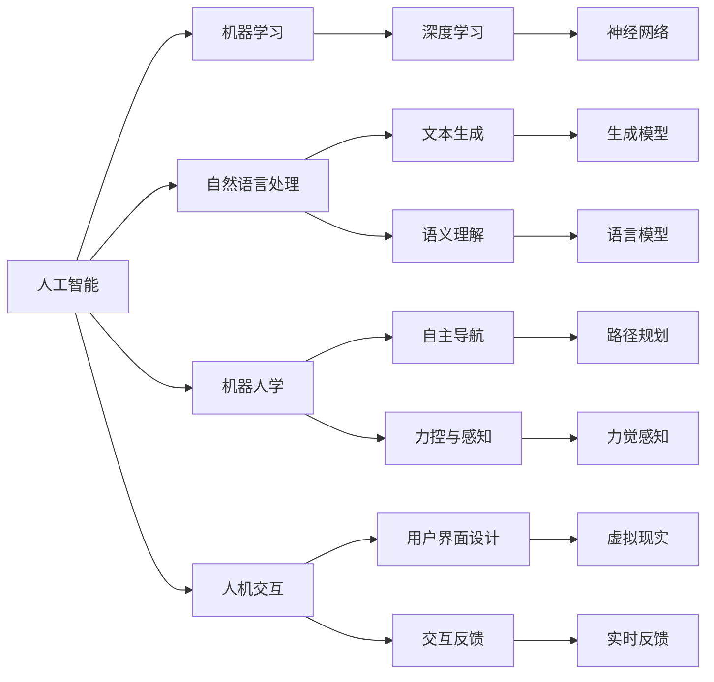

                 

# 人机协作新时代：共同创造更智能的未来

## 1. 背景介绍

### 1.1 问题由来
随着人工智能技术的飞速发展，人机协作正逐渐成为新时代的重要主题。它不仅改变了人类的生产方式、工作模式，更在医疗、教育、制造、娱乐等各个领域带来了颠覆性的变革。本文旨在探讨人机协作的深层原理，解析其中的核心概念，并展望未来的发展方向。

## 2. 核心概念与联系

### 2.1 核心概念概述

人机协作（Human-Machine Collaboration）是一种利用先进信息技术，结合人机双方的优势，共同完成复杂任务的新型模式。在人工智能时代，这种协作不仅体现在提升工作效率和精度，更延伸到辅助决策、创新创意、社交互动等各个层面。

1. **人工智能（AI）**：利用机器学习、深度学习等技术，模拟人类智能进行信息处理和决策的能力。
2. **机器学习（ML）**：基于数据驱动的模型，让机器自动学习并优化自身算法，以提高任务处理能力。
3. **自然语言处理（NLP）**：使计算机能理解和处理人类语言的技术，为人机协作提供了重要的沟通桥梁。
4. **机器人学（Robotics）**：结合机械、电子、控制等多学科，研究机器人的设计、制造与应用。
5. **人机交互（HCI）**：研究人与计算机系统之间交互的科学，提升用户体验与操作效率。

这些核心概念通过算法与技术的融合，推动了人机协作向更高效、更智能的阶段演进。

### 2.2 核心概念原理和架构的 Mermaid 流程图



这个流程图展示了各核心概念通过算法和技术的融合，形成了人机协作的架构。其中，机器学习和深度学习是人工智能的核心技术，提供了强大的信息处理能力；自然语言处理和语言模型则搭建了人机沟通的桥梁；机器人学和自主导航技术使人机协作得以在物理世界中实现；人机交互和用户界面设计则优化了用户体验。

## 3. 核心算法原理 & 具体操作步骤

### 3.1 算法原理概述

人机协作的核心算法原理可以归纳为以下几个关键环节：

1. **数据收集与预处理**：通过传感器、摄像头等设备，实时采集环境数据，并进行清洗和标注。
2. **模型训练与优化**：利用机器学习算法，训练出能够适应复杂环境的多模态模型。
3. **决策与反馈**：根据模型输出，结合人的经验与直觉，进行决策和反馈调整。
4. **交互界面设计**：设计高效的人机交互界面，确保信息传递的及时性和准确性。
5. **系统集成与部署**：将各组件集成到统一平台，并部署到实际应用环境中。

### 3.2 算法步骤详解

以智能医疗系统为例，展示人机协作的具体操作步骤：

**步骤1：数据收集与预处理**
- 利用穿戴设备和传感器，采集患者的生理参数（如心率、血压）。
- 通过摄像头和图像处理技术，采集患者的面部表情和动作。
- 使用自然语言处理技术，分析患者的语言描述，提取症状和需求。
- 对采集到的数据进行清洗和标注，形成用于训练的数据集。

**步骤2：模型训练与优化**
- 使用深度学习算法，训练多模态模型，对患者数据进行特征提取和融合。
- 通过迁移学习技术，在预训练模型基础上进行微调，适应特定医疗场景。
- 利用交叉验证和超参数调优，提高模型泛化能力。

**步骤3：决策与反馈**
- 根据模型输出，结合医生的专业知识和经验，做出诊断和治疗决策。
- 通过人机交互界面，向患者提供诊断结果和治疗方案。
- 根据患者的反馈，调整模型参数和决策策略，逐步优化协作效果。

**步骤4：交互界面设计**
- 设计直观易用的用户界面，确保医生和患者能够快速获取所需信息。
- 集成语音识别和自然语言生成技术，提升交流效率。
- 加入表情识别和情感分析功能，增强用户情绪理解。

**步骤5：系统集成与部署**
- 将数据采集、模型训练、决策支持、界面设计等组件集成到统一平台。
- 部署到医院的信息系统，与现有医疗设备无缝对接。
- 定期更新模型和算法，保持系统性能和适应性。

### 3.3 算法优缺点

人机协作的优势在于：

1. **效率提升**：机器可以24小时不间断地处理大量数据，显著提升工作效率。
2. **精度提高**：利用机器的准确性和稳定性，减少人为错误，提高决策质量。
3. **协同创新**：人机协作能够结合双方的优势，创造出传统方式难以实现的新应用。

其局限性主要在于：

1. **数据依赖**：依赖高质量的数据集进行训练，数据收集和标注成本较高。
2. **算法复杂性**：复杂模型和高维数据增加了算法实现难度。
3. **用户接受度**：部分用户对新兴技术存在抵触情绪，影响系统推广。
4. **伦理问题**：涉及隐私保护、数据安全等伦理问题，需谨慎处理。

## 4. 数学模型和公式 & 详细讲解 & 举例说明

### 4.1 数学模型构建

在人机协作中，常用的数学模型包括：

- **线性回归模型**：用于建立输入与输出的线性关系。
- **支持向量机（SVM）**：通过构建最优超平面，实现分类和回归。
- **决策树与随机森林**：基于特征分割的分类算法，具有高解释性。
- **深度神经网络（DNN）**：用于处理复杂非线性关系，提升模型预测能力。

### 4.2 公式推导过程

以线性回归模型为例，展示其基本推导过程：

假设有一组样本 $(x_i, y_i)$，其中 $x_i \in \mathbb{R}^n$ 为输入特征，$y_i \in \mathbb{R}$ 为输出目标。线性回归模型的目标是最小化误差函数 $E$：

$$
E = \frac{1}{2} \sum_{i=1}^n (y_i - \hat{y}_i)^2
$$

其中 $\hat{y}_i = w_0 + \sum_{j=1}^n w_j x_{ij}$，$w_0, w_j$ 为模型的权重。求解该最小化问题，得到最优解：

$$
\begin{aligned}
&\min_{w_0, w_j} E \\
&\text{s.t.} \quad y_i - \hat{y}_i = 0, \quad i=1,\ldots,n
\end{aligned}
$$

解得 $w_0$ 和 $w_j$ 的表达式为：

$$
\begin{aligned}
w_0 &= \frac{1}{n} \sum_{i=1}^n (y_i - \bar{y}) \\
w_j &= \frac{1}{n} \sum_{i=1}^n (x_{ij} - \bar{x}_j) (y_i - \bar{y})
\end{aligned}
$$

其中 $\bar{x}_j = \frac{1}{n} \sum_{i=1}^n x_{ij}$，$\bar{y} = \frac{1}{n} \sum_{i=1}^n y_i$。

### 4.3 案例分析与讲解

以智能客服系统为例，展示人机协作在实际应用中的作用：

1. **数据收集与预处理**：
   - 从客服系统中抽取通话记录，提取客户问询和客服回答的内容。
   - 利用NLP技术，清洗和标注数据，去除噪声和冗余信息。

2. **模型训练与优化**：
   - 使用深度学习算法，训练文本分类和对话生成模型。
   - 在预训练模型基础上进行微调，适应客服场景。
   - 利用迁移学习技术，将模型应用于新任务。

3. **决策与反馈**：
   - 根据模型输出，生成智能回答，提高客服响应速度。
   - 通过用户反馈，调整模型参数，逐步优化回答质量。

4. **交互界面设计**：
   - 设计简洁直观的用户界面，提供自助服务功能。
   - 集成语音识别和自然语言生成技术，提升用户体验。

5. **系统集成与部署**：
   - 将数据采集、模型训练、回答生成等组件集成到统一平台。
   - 部署到客服系统中，与人工客服无缝对接。

## 5. 项目实践：代码实例和详细解释说明

### 5.1 开发环境搭建

开发人机协作系统，需要以下开发环境：

1. **Python环境**：确保安装了必要的Python库，如TensorFlow、PyTorch、NLTK等。
2. **深度学习框架**：选择适合的深度学习框架，如TensorFlow、PyTorch等。
3. **自然语言处理库**：使用NLTK、spaCy、Hugging Face等库进行文本处理。
4. **数据库**：选择合适的数据库，存储和管理数据。
5. **人机交互界面**：设计直观易用的用户界面，如Web应用、移动应用等。

### 5.2 源代码详细实现

以下是一个基于TensorFlow的智能客服系统代码实现：

```python
import tensorflow as tf
import numpy as np
import nltk
from nltk.tokenize import word_tokenize
from nltk.corpus import stopwords

# 定义模型
class CustomerService(tf.keras.Model):
    def __init__(self, vocab_size, embedding_dim, rnn_units):
        super(CustomerService, self).__init__()
        self.embedding = tf.keras.layers.Embedding(vocab_size, embedding_dim)
        self.lstm = tf.keras.layers.LSTM(rnn_units)
        self.dense = tf.keras.layers.Dense(vocab_size)

    def call(self, inputs):
        x = self.embedding(inputs)
        x = self.lstm(x)
        return self.dense(x)

# 定义数据处理函数
def preprocess_text(text):
    tokens = word_tokenize(text.lower())
    tokens = [token for token in tokens if token.isalpha()]
    tokens = [token for token in tokens if token not in stopwords.words('english')]
    return tokens

# 加载数据
train_data = ['Customer: Can you help me?\n\nCustomer Service: Sure, what do you need?', 
              'Customer: I want to buy a new laptop.\n\nCustomer Service: Do you have a budget in mind?', 
              'Customer: What's the weather like today?\n\nCustomer Service: It's sunny outside.']
train_labels = ['service', 'buy', 'weather']

vocab_size = len(set(' '.join(train_data)))
embedding_dim = 128
rnn_units = 256

# 构建模型
model = CustomerService(vocab_size, embedding_dim, rnn_units)

# 编译模型
model.compile(optimizer=tf.keras.optimizers.Adam(0.01),
              loss=tf.keras.losses.SparseCategoricalCrossentropy(from_logits=True),
              metrics=['accuracy'])

# 训练模型
model.fit(train_data, train_labels, epochs=10, verbose=1)

# 使用模型进行预测
test_data = 'Customer: How much is a new smartphone?\n\nCustomer Service: That depends on the brand and model.'
test_tokens = preprocess_text(test_data)
test_seq = tf.keras.preprocessing.sequence.pad_sequences([test_tokens], maxlen=100, padding='post')
test_input = np.array(test_seq)
test_pred = model.predict(test_input)
```

### 5.3 代码解读与分析

以上代码实现了一个简单的基于LSTM的智能客服系统。其核心步骤如下：

1. **模型定义**：定义了一个包含嵌入层、LSTM层和全连接层的模型。
2. **数据预处理**：使用NLTK库对文本进行分词和去停用词处理。
3. **数据加载**：加载训练数据，并将其转化为模型所需的输入格式。
4. **模型编译与训练**：使用Adam优化器和交叉熵损失函数编译模型，并在训练集上训练10个epoch。
5. **模型预测**：使用训练好的模型对新数据进行预测，并输出结果。

## 6. 实际应用场景

### 6.1 智能医疗系统

在智能医疗系统中，人机协作可以通过多种方式提升医疗服务效率和质量：

1. **病历分析**：利用NLP技术，提取病历中的关键信息，辅助医生进行诊断和治疗。
2. **医疗咨询**：通过智能问答系统，解答患者的常见问题，提高就医体验。
3. **药物推荐**：结合患者病历和症状，推荐合适的药物和剂量。
4. **手术辅助**：在手术过程中，利用机器人技术和计算机视觉技术，提供辅助决策和操作支持。

### 6.2 智能制造系统

智能制造系统通过人机协作，实现生产过程的自动化和智能化：

1. **设备维护**：通过传感器和智能监控系统，实时采集设备运行状态，预测故障并进行维护。
2. **生产调度**：利用优化算法和机器学习模型，优化生产流程和资源分配。
3. **质量控制**：利用视觉检测和图像识别技术，检测产品质量缺陷。
4. **智能仓储**：通过机器人技术和自动化仓库系统，提高仓储效率和管理水平。

### 6.3 智能教育系统

在智能教育系统中，人机协作可以提供个性化、互动化的学习体验：

1. **智能辅导**：通过AI助教，解答学生的学习疑问，提供个性化学习建议。
2. **作业批改**：利用自然语言处理和机器学习技术，自动批改学生作业，提供反馈和建议。
3. **知识推荐**：根据学生的学习情况，推荐相关课程和资料，提高学习效果。
4. **虚拟实验室**：通过虚拟现实技术，提供沉浸式学习体验，辅助学生进行实验和探究。

### 6.4 未来应用展望

未来，人机协作将拓展到更多领域，实现更加深入的融合：

1. **智慧城市**：通过智能监控和数据分析，提升城市管理效率和居民生活质量。
2. **智慧交通**：利用无人驾驶和智能调度系统，优化交通流量和运行效率。
3. **智能农业**：结合物联网和机器学习，优化农业生产和管理。
4. **智慧环保**：利用智能传感器和数据分析，实现环境监测和保护。

## 7. 工具和资源推荐

### 7.1 学习资源推荐

1. **Coursera《深度学习》课程**：由Andrew Ng主讲的深度学习课程，涵盖深度学习的基础理论和实践。
2. **DeepLearning.AI《深度学习专业证书》**：涵盖深度学习、机器学习、自然语言处理等多个领域的系统课程。
3. **斯坦福大学《机器学习》课程**：由Andrew Ng主讲的机器学习课程，涵盖机器学习的基本概念和算法。
4. **NLP相关书籍**：如《深度学习与自然语言处理》、《自然语言处理综论》等。

### 7.2 开发工具推荐

1. **PyTorch**：灵活的深度学习框架，适用于研究和开发。
2. **TensorFlow**：强大的深度学习框架，适用于工程应用。
3. **Hugging Face Transformers**：提供多种预训练模型，支持自然语言处理任务。
4. **NLTK**：Python自然语言处理库，提供了丰富的文本处理功能。
5. **Jupyter Notebook**：互动式编程环境，方便数据探索和模型实验。

### 7.3 相关论文推荐

1. **《人机协作中的深度学习》**：探讨了深度学习在人机协作中的应用和挑战。
2. **《基于自然语言处理的人机交互技术》**：介绍了自然语言处理技术在智能系统中的应用。
3. **《深度强化学习在机器人控制中的应用》**：介绍了深度强化学习在机器人控制中的应用。
4. **《智能医疗中的多模态数据融合》**：介绍了多模态数据融合技术在医疗系统中的应用。

## 8. 总结：未来发展趋势与挑战

### 8.1 研究成果总结

本文介绍了人机协作的核心概念和实现步骤，展示了其在医疗、制造、教育等多个领域的应用案例。通过分析其优点和局限性，提出了未来的发展方向。

### 8.2 未来发展趋势

未来，人机协作将朝着以下方向发展：

1. **智能化**：通过深度学习和大数据分析，实现更精准的决策和预测。
2. **个性化**：利用用户行为数据，提供更加个性化和定制化的服务。
3. **融合化**：将人机协作与物联网、区块链等新兴技术结合，实现更广泛的场景应用。
4. **协作化**：通过智能协同工具，促进团队成员之间的沟通和协作。

### 8.3 面临的挑战

人机协作在发展过程中也面临诸多挑战：

1. **数据隐私**：如何保护用户隐私和数据安全，避免数据泄露和滥用。
2. **算法透明度**：如何提高算法的透明度和可解释性，增强用户信任。
3. **伦理问题**：如何制定伦理规范，避免算法偏见和歧视。
4. **人机交互**：如何设计高效的人机交互界面，提升用户体验。

### 8.4 研究展望

未来，人机协作的研究将更加深入，涵盖更多领域和应用场景：

1. **多模态融合**：实现语音、图像、文本等多种模态数据的融合和协同。
2. **混合智能**：结合符号计算和深度学习，实现更加全面的智能系统。
3. **边缘计算**：在设备端进行数据处理和决策，减少网络延迟和带宽消耗。
4. **伦理设计**：制定伦理规范和标准，确保技术的公平、透明和可控。

## 9. 附录：常见问题与解答

**Q1：人机协作在实际应用中面临哪些挑战？**

A: 人机协作在实际应用中面临以下挑战：

1. **数据隐私**：如何保护用户隐私和数据安全，避免数据泄露和滥用。
2. **算法透明度**：如何提高算法的透明度和可解释性，增强用户信任。
3. **伦理问题**：如何制定伦理规范，避免算法偏见和歧视。
4. **人机交互**：如何设计高效的人机交互界面，提升用户体验。

**Q2：如何选择合适的人机协作算法？**

A: 选择合适的人机协作算法需考虑以下几个因素：

1. **任务类型**：根据任务类型选择合适的算法，如分类、回归、聚类等。
2. **数据特点**：根据数据的特点选择合适的方法，如多模态融合、时序分析等。
3. **算法复杂度**：根据实际需求选择合适复杂度的算法，如简单线性回归、深度神经网络等。
4. **资源限制**：根据资源限制选择合适规模的模型，如小型嵌入式设备、高性能服务器等。

**Q3：如何设计高效的人机交互界面？**

A: 设计高效的人机交互界面需考虑以下几个方面：

1. **简洁易用**：界面设计要简洁明了，用户操作方便。
2. **反馈及时**：界面需及时反馈用户操作结果，减少用户等待时间。
3. **多模态支持**：支持多种交互方式，如语音、手势、触摸等。
4. **个性化定制**：根据用户需求提供个性化设置，提升用户体验。

**Q4：未来人机协作的主要发展方向是什么？**

A: 未来人机协作的主要发展方向包括：

1. **智能化**：通过深度学习和大数据分析，实现更精准的决策和预测。
2. **个性化**：利用用户行为数据，提供更加个性化和定制化的服务。
3. **融合化**：将人机协作与物联网、区块链等新兴技术结合，实现更广泛的场景应用。
4. **协作化**：通过智能协同工具，促进团队成员之间的沟通和协作。

---

作者：禅与计算机程序设计艺术 / Zen and the Art of Computer Programming

