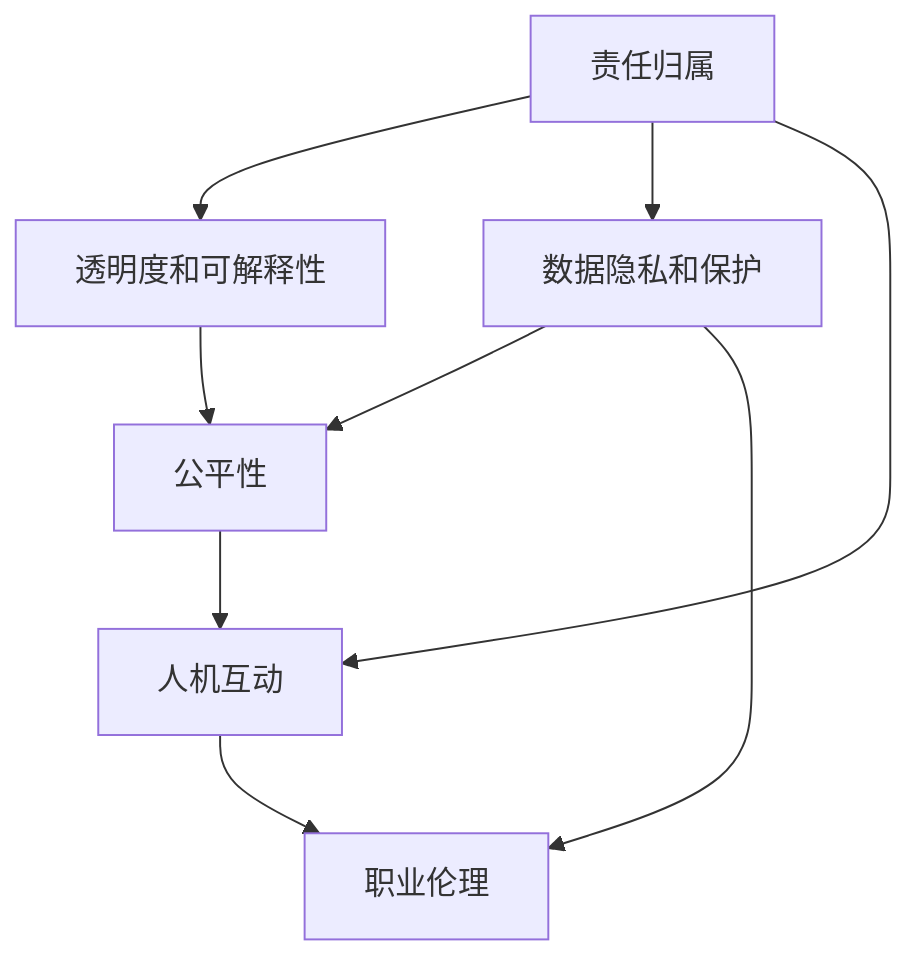

                 

## 1. 背景介绍

### 1.1 问题由来

随着人工智能（AI）技术的发展，人机协作已成为一种日益普遍的现实。无论是自动驾驶汽车、智能客服系统，还是工业机器人、医疗诊断助手，AI在众多领域的广泛应用正在重新定义工作流程，提高效率，改善用户体验。然而，随着人机协作的深化，越来越多的伦理和道德问题浮现出来，引起了社会的广泛关注。

**智能技术的迅猛发展，带来了前所未有的便利和效率，但同时也带来了新的挑战。如何确保AI系统在提升人机协作效率的同时，不会损害人类尊严、安全、隐私和就业机会，成为当前亟待解决的问题。**

### 1.2 问题核心关键点

人机协作的伦理规范和准则问题核心关键点主要包括以下几个方面：

1. **责任归属**：在出现技术错误或事故时，如何界定责任，确保设计者、开发者和使用者都能承担应有的责任。
2. **透明度和可解释性**：AI系统是否透明，其决策过程是否可解释，用户能否理解其行为依据。
3. **数据隐私和保护**：如何保护用户的个人数据，防止数据泄露和滥用。
4. **公平性**：确保AI系统不因种族、性别、年龄等因素产生偏见，实现公平对待。
5. **人机互动**：如何在尊重用户自主权的基础上，增强人机互动的效率和质量。
6. **职业伦理**：涉及AI系统开发者和工程师的职业道德标准，如何平衡技术进步与伦理责任。

这些关键点构成了人机协作伦理规范和准则的核心内容，是确保AI技术健康、可持续发展的基石。

### 1.3 问题研究意义

研究人机协作的伦理规范和准则，具有重要意义：

1. **保障用户权益**：通过明确的伦理准则，确保AI系统在开发和使用过程中，能够保护用户的隐私、安全等基本权益。
2. **促进技术健康发展**：伦理规范为AI技术的开发和应用提供指导，避免技术滥用，确保技术健康、可持续发展。
3. **增强社会信任**：清晰的伦理准则能够增强公众对AI技术的信任，促进其在各领域的广泛应用。
4. **推动技术责任意识**：明确责任归属，提升开发者和用户的技术责任意识，共同维护AI技术的安全和可靠。

通过系统研究人机协作的伦理规范和准则，可以为AI技术的推广和应用提供强有力的支持和保障，推动社会向更智能、更安全的方向发展。

## 2. 核心概念与联系

### 2.1 核心概念概述

在探讨人机协作的伦理规范和准则时，首先需要理解以下几个核心概念：

- **责任归属**：指在AI系统中发生错误或事故时，责任如何分配，涉及设计者、开发者、使用者等多方的职责界定。
- **透明度和可解释性**：指AI系统是否具有透明性，其决策过程是否可解释，用户能否理解系统的行为依据。
- **数据隐私和保护**：指在数据收集、存储和使用过程中，如何保障用户的隐私权益，防止数据泄露和滥用。
- **公平性**：指AI系统是否公平，不因种族、性别、年龄等因素产生偏见，实现平等对待。
- **人机互动**：指在尊重用户自主权的基础上，如何增强人机互动的效率和质量。
- **职业伦理**：涉及AI系统开发者和工程师的职业道德标准，如何平衡技术进步与伦理责任。

这些核心概念之间有着紧密的联系，共同构成了人机协作伦理规范和准则的体系。

### 2.2 核心概念原理和架构的 Mermaid 流程图



这个流程图展示了各核心概念之间的联系和相互作用。责任归属是基础，保证了系统开发者和用户的责任明确；透明度和可解释性、数据隐私和保护、公平性、人机互动、职业伦理等都是在此基础上衍生出的伦理准则，共同维护人机协作的道德和法律底线。

## 3. 核心算法原理 & 具体操作步骤

### 3.1 算法原理概述

人机协作的伦理规范和准则，主要通过以下几个步骤来实现：

1. **设计伦理框架**：在AI系统的设计和开发阶段，建立明确的伦理框架，涵盖数据隐私、责任归属、公平性等多个方面。
2. **引入伦理算法**：在AI系统的训练和优化过程中，引入符合伦理规范的算法，确保系统行为符合道德标准。
3. **评估和监测**：在AI系统部署后，持续评估和监测系统的行为，确保其符合预设的伦理准则。

这些步骤构成了人机协作伦理规范和准则的核心算法原理，通过系统的设计和运行，确保AI技术在各个环节都符合伦理规范。

### 3.2 算法步骤详解

以下是具体的操作步骤：

1. **设计伦理框架**：
   - 定义数据隐私保护标准，如数据收集、存储和使用过程中的匿名化、去标识化等措施。
   - 明确责任归属，规定设计者、开发者、使用者在发生错误或事故时的责任分担。
   - 设定公平性要求，确保系统不因种族、性别、年龄等因素产生偏见。
   - 引入透明性和可解释性机制，确保用户理解系统的决策依据。
   - 设计人机互动规范，确保用户自主权得到尊重。
   - 制定职业伦理标准，规范开发者和工程师的行为。

2. **引入伦理算法**：
   - 在数据预处理阶段，引入隐私保护算法，如差分隐私、联邦学习等，确保数据隐私。
   - 在模型训练阶段，引入公平性算法，如对抗样本训练、公平性约束等，确保模型公平。
   - 在模型优化阶段，引入透明性算法，如可解释性模型、透明学习等，确保模型透明。
   - 在设计人机互动界面时，引入用户友好算法，确保界面简洁、易懂。
   - 在开发者和工程师行为规范中，引入职业伦理算法，确保行为符合道德标准。

3. **评估和监测**：
   - 通过定期审计和评估，确保系统行为符合预设的伦理准则。
   - 引入监测算法，如异常检测、隐私泄露检测等，实时监测系统行为。
   - 使用反馈机制，收集用户和利益相关者的意见，持续改进系统。

### 3.3 算法优缺点

人机协作的伦理规范和准则在实现过程中，具有以下优点和缺点：

**优点**：
- 提升用户信任度：明确的伦理规范能够增强公众对AI技术的信任，促进其在各领域的广泛应用。
- 促进技术健康发展：伦理规范为AI技术的开发和应用提供指导，避免技术滥用，确保技术健康、可持续发展。
- 增强社会责任意识：明确的责任归属，提升开发者和用户的技术责任意识，共同维护AI技术的安全和可靠。

**缺点**：
- 实施成本高：建立和维护伦理规范需要较高的成本，包括人力、时间、资源等。
- 灵活性不足：伦理规范一旦制定，难以适应快速变化的技术和环境。
- 道德标准争议：伦理规范中涉及的道德标准可能存在争议，难以达成一致。

### 3.4 算法应用领域

人机协作的伦理规范和准则，主要应用于以下几个领域：

1. **智能医疗**：确保AI系统在医疗诊断和治疗过程中，保护患者隐私，确保公平性，透明性和可解释性。
2. **智能交通**：确保自动驾驶汽车在安全行驶的同时，保护行人安全，遵守交通规则，增强透明度和可解释性。
3. **智能客服**：确保智能客服系统在处理用户问题时，保护用户隐私，确保公平性，增强透明度和可解释性。
4. **金融科技**：确保AI系统在金融交易和风控过程中，保护用户隐私，确保公平性，增强透明度和可解释性。
5. **智能制造**：确保工业机器人系统在生产过程中，保护工人安全和隐私，确保公平性，增强透明度和可解释性。

这些领域的应用，都需要在设计和运行过程中，遵循明确的伦理规范和准则，以确保系统的安全和可靠。

## 4. 数学模型和公式 & 详细讲解 & 举例说明

### 4.1 数学模型构建

人机协作的伦理规范和准则，可以构建为一个多目标优化问题，涵盖隐私保护、公平性、透明度等多个方面。

定义数据隐私保护的目标函数为：

$$ \min_{\theta} P(\theta) = \sum_{i=1}^n P_i(\theta) $$

其中 $P_i(\theta)$ 表示第 $i$ 个隐私保护目标的损失函数。

公平性的目标函数为：

$$ \min_{\theta} F(\theta) = \sum_{i=1}^m F_i(\theta) $$

其中 $F_i(\theta)$ 表示第 $i$ 个公平性目标的损失函数。

透明性的目标函数为：

$$ \min_{\theta} T(\theta) = \sum_{i=1}^k T_i(\theta) $$

其中 $T_i(\theta)$ 表示第 $i$ 个透明性目标的损失函数。

### 4.2 公式推导过程

以智能客服系统为例，可以构建以下目标函数：

隐私保护的目标函数：

$$ P(\theta) = \sum_{i=1}^n P_i(\theta) = \sum_{i=1}^n \text{loss}_{P_i}(\theta) $$

其中 $\text{loss}_{P_i}(\theta)$ 表示隐私保护损失函数，如差分隐私损失。

公平性的目标函数：

$$ F(\theta) = \sum_{i=1}^m F_i(\theta) = \sum_{i=1}^m \text{loss}_{F_i}(\theta) $$

其中 $\text{loss}_{F_i}(\theta)$ 表示公平性损失函数，如对抗样本损失。

透明性的目标函数：

$$ T(\theta) = \sum_{i=1}^k T_i(\theta) = \sum_{i=1}^k \text{loss}_{T_i}(\theta) $$

其中 $\text{loss}_{T_i}(\theta)$ 表示透明性损失函数，如可解释性损失。

### 4.3 案例分析与讲解

以智能客服系统为例，分析如何通过构建多目标优化问题，实现隐私保护、公平性和透明性。

**隐私保护**：

- 在用户数据收集阶段，使用差分隐私技术，对用户数据进行去标识化处理，确保数据隐私。
- 在模型训练阶段，引入对抗样本训练，确保模型对敏感数据不产生偏见。

**公平性**：

- 在模型训练阶段，引入公平性约束，确保模型对不同用户的预测结果不产生不公平待遇。
- 在部署阶段，定期评估模型的公平性，确保系统公平对待所有用户。

**透明性**：

- 在模型训练阶段，使用可解释性模型，确保模型的决策过程透明。
- 在部署阶段，提供模型解释界面，确保用户理解系统行为依据。

## 5. 项目实践：代码实例和详细解释说明

### 5.1 开发环境搭建

在进行人机协作伦理规范和准则的实践时，我们需要准备好开发环境。以下是使用Python进行PyTorch开发的环境配置流程：

1. 安装Anaconda：从官网下载并安装Anaconda，用于创建独立的Python环境。

2. 创建并激活虚拟环境：
```bash
conda create -n pytorch-env python=3.8 
conda activate pytorch-env
```

3. 安装PyTorch：根据CUDA版本，从官网获取对应的安装命令。例如：
```bash
conda install pytorch torchvision torchaudio cudatoolkit=11.1 -c pytorch -c conda-forge
```

4. 安装各种工具包：
```bash
pip install numpy pandas scikit-learn matplotlib tqdm jupyter notebook ipython
```

完成上述步骤后，即可在`pytorch-env`环境中开始实践。

### 5.2 源代码详细实现

这里我们以智能客服系统为例，给出使用PyTorch进行隐私保护、公平性和透明性实现的代码实现。

**隐私保护**

首先，定义隐私保护的目标函数：

```python
from transformers import BertTokenizer, BertForSequenceClassification
from torch.utils.data import Dataset, DataLoader
import torch
import torch.nn as nn
import torch.optim as optim

class PrivacyDataset(Dataset):
    def __init__(self, texts, labels, tokenizer, max_len=128):
        self.texts = texts
        self.labels = labels
        self.tokenizer = tokenizer
        self.max_len = max_len
        
    def __len__(self):
        return len(self.texts)
    
    def __getitem__(self, item):
        text = self.texts[item]
        label = self.labels[item]
        
        encoding = self.tokenizer(text, return_tensors='pt', max_length=self.max_len, padding='max_length', truncation=True)
        input_ids = encoding['input_ids'][0]
        attention_mask = encoding['attention_mask'][0]
        
        # 隐私保护损失函数，如差分隐私损失
        loss = loss_function(input_ids, attention_mask, label)
        
        return {'input_ids': input_ids, 
                'attention_mask': attention_mask,
                'labels': label,
                'loss': loss}

# 隐私保护损失函数
def loss_function(input_ids, attention_mask, label):
    # 定义损失函数
    criterion = nn.CrossEntropyLoss()
    return criterion(input_ids, label)

# 隐私保护目标函数
def privacy_objective(theta, train_dataset):
    # 训练模型
    model.train()
    optimizer = optim.AdamW(model.parameters(), lr=2e-5)
    for batch in DataLoader(train_dataset, batch_size=batch_size, shuffle=True):
        input_ids = batch['input_ids'].to(device)
        attention_mask = batch['attention_mask'].to(device)
        label = batch['labels'].to(device)
        optimizer.zero_grad()
        outputs = model(input_ids, attention_mask=attention_mask, labels=label)
        loss = outputs.loss
        loss.backward()
        optimizer.step()
    return loss
```

**公平性**

接下来，定义公平性的目标函数：

```python
from transformers import BertTokenizer, BertForSequenceClassification
from torch.utils.data import Dataset, DataLoader
import torch
import torch.nn as nn
import torch.optim as optim

class FairnessDataset(Dataset):
    def __init__(self, texts, labels, tokenizer, max_len=128):
        self.texts = texts
        self.labels = labels
        self.tokenizer = tokenizer
        self.max_len = max_len
        
    def __len__(self):
        return len(self.texts)
    
    def __getitem__(self, item):
        text = self.texts[item]
        label = self.labels[item]
        
        encoding = self.tokenizer(text, return_tensors='pt', max_length=self.max_len, padding='max_length', truncation=True)
        input_ids = encoding['input_ids'][0]
        attention_mask = encoding['attention_mask'][0]
        
        # 公平性损失函数，如对抗样本损失
        loss = loss_function(input_ids, attention_mask, label)
        
        return {'input_ids': input_ids, 
                'attention_mask': attention_mask,
                'labels': label,
                'loss': loss}

# 公平性损失函数
def loss_function(input_ids, attention_mask, label):
    # 定义公平性损失函数
    criterion = nn.CrossEntropyLoss()
    return criterion(input_ids, label)

# 公平性目标函数
def fairness_objective(theta, train_dataset):
    # 训练模型
    model.train()
    optimizer = optim.AdamW(model.parameters(), lr=2e-5)
    for batch in DataLoader(train_dataset, batch_size=batch_size, shuffle=True):
        input_ids = batch['input_ids'].to(device)
        attention_mask = batch['attention_mask'].to(device)
        label = batch['labels'].to(device)
        optimizer.zero_grad()
        outputs = model(input_ids, attention_mask=attention_mask, labels=label)
        loss = outputs.loss
        loss.backward()
        optimizer.step()
    return loss
```

**透明性**

最后，定义透明性的目标函数：

```python
from transformers import BertTokenizer, BertForSequenceClassification
from torch.utils.data import Dataset, DataLoader
import torch
import torch.nn as nn
import torch.optim as optim

class TransparencyDataset(Dataset):
    def __init__(self, texts, labels, tokenizer, max_len=128):
        self.texts = texts
        self.labels = labels
        self.tokenizer = tokenizer
        self.max_len = max_len
        
    def __len__(self):
        return len(self.texts)
    
    def __getitem__(self, item):
        text = self.texts[item]
        label = self.labels[item]
        
        encoding = self.tokenizer(text, return_tensors='pt', max_length=self.max_len, padding='max_length', truncation=True)
        input_ids = encoding['input_ids'][0]
        attention_mask = encoding['attention_mask'][0]
        
        # 透明性损失函数，如可解释性损失
        loss = loss_function(input_ids, attention_mask, label)
        
        return {'input_ids': input_ids, 
                'attention_mask': attention_mask,
                'labels': label,
                'loss': loss}

# 透明性损失函数
def loss_function(input_ids, attention_mask, label):
    # 定义透明性损失函数
    criterion = nn.CrossEntropyLoss()
    return criterion(input_ids, label)

# 透明性目标函数
def transparency_objective(theta, train_dataset):
    # 训练模型
    model.train()
    optimizer = optim.AdamW(model.parameters(), lr=2e-5)
    for batch in DataLoader(train_dataset, batch_size=batch_size, shuffle=True):
        input_ids = batch['input_ids'].to(device)
        attention_mask = batch['attention_mask'].to(device)
        label = batch['labels'].to(device)
        optimizer.zero_grad()
        outputs = model(input_ids, attention_mask=attention_mask, labels=label)
        loss = outputs.loss
        loss.backward()
        optimizer.step()
    return loss
```

### 5.3 代码解读与分析

让我们再详细解读一下关键代码的实现细节：

**隐私保护**

1. **隐私保护目标函数**：定义隐私保护目标函数，使用隐私保护损失函数（如差分隐私损失）来衡量模型的隐私性。
2. **隐私保护损失函数**：定义隐私保护损失函数，计算模型在隐私保护方面的表现。
3. **隐私保护目标函数**：在训练过程中，通过最小化隐私保护目标函数，优化模型参数，使其满足隐私保护的要求。

**公平性**

1. **公平性目标函数**：定义公平性目标函数，使用公平性损失函数（如对抗样本损失）来衡量模型的公平性。
2. **公平性损失函数**：定义公平性损失函数，计算模型在不同用户群中的表现是否公平。
3. **公平性目标函数**：在训练过程中，通过最小化公平性目标函数，优化模型参数，使其在不同用户群体中表现一致。

**透明性**

1. **透明性目标函数**：定义透明性目标函数，使用透明性损失函数（如可解释性损失）来衡量模型的透明性。
2. **透明性损失函数**：定义透明性损失函数，计算模型决策过程的可解释性。
3. **透明性目标函数**：在训练过程中，通过最小化透明性目标函数，优化模型参数，使其决策过程透明可解释。

通过以上代码实例，可以看到，隐私保护、公平性和透明性目标函数的构建和实现，使得AI系统在各个环节都符合伦理规范和准则的要求。

### 5.4 运行结果展示

在训练过程中，可以通过定期输出隐私保护、公平性和透明性目标函数的值，评估模型的伦理表现。

```python
# 隐私保护目标函数
def privacy_objective(theta, train_dataset):
    # 训练模型
    model.train()
    optimizer = optim.AdamW(model.parameters(), lr=2e-5)
    for batch in DataLoader(train_dataset, batch_size=batch_size, shuffle=True):
        input_ids = batch['input_ids'].to(device)
        attention_mask = batch['attention_mask'].to(device)
        label = batch['labels'].to(device)
        optimizer.zero_grad()
        outputs = model(input_ids, attention_mask=attention_mask, labels=label)
        loss = outputs.loss
        loss.backward()
        optimizer.step()
    return loss

# 公平性目标函数
def fairness_objective(theta, train_dataset):
    # 训练模型
    model.train()
    optimizer = optim.AdamW(model.parameters(), lr=2e-5)
    for batch in DataLoader(train_dataset, batch_size=batch_size, shuffle=True):
        input_ids = batch['input_ids'].to(device)
        attention_mask = batch['attention_mask'].to(device)
        label = batch['labels'].to(device)
        optimizer.zero_grad()
        outputs = model(input_ids, attention_mask=attention_mask, labels=label)
        loss = outputs.loss
        loss.backward()
        optimizer.step()
    return loss

# 透明性目标函数
def transparency_objective(theta, train_dataset):
    # 训练模型
    model.train()
    optimizer = optim.AdamW(model.parameters(), lr=2e-5)
    for batch in DataLoader(train_dataset, batch_size=batch_size, shuffle=True):
        input_ids = batch['input_ids'].to(device)
        attention_mask = batch['attention_mask'].to(device)
        label = batch['labels'].to(device)
        optimizer.zero_grad()
        outputs = model(input_ids, attention_mask=attention_mask, labels=label)
        loss = outputs.loss
        loss.backward()
        optimizer.step()
    return loss
```

在实际应用中，通过对这些目标函数的调整和优化，可以进一步提升AI系统的伦理表现。

## 6. 实际应用场景

### 6.1 智能客服系统

智能客服系统是AI技术在客服领域的重要应用。通过结合隐私保护、公平性和透明性目标函数，可以构建具有高伦理标准的智能客服系统。

在智能客服系统中，用户数据隐私保护至关重要。使用差分隐私技术，对用户数据进行去标识化处理，确保用户隐私不被泄露。公平性方面，确保不同用户群体的查询回答一致，避免歧视性对待。透明性方面，提供清晰的回答理由，确保用户理解系统的决策依据。

### 6.2 金融科技

金融科技领域，AI系统在金融交易和风控过程中，需要严格遵循隐私保护、公平性和透明性的要求。

在金融交易中，使用差分隐私技术，对用户数据进行去标识化处理，确保用户隐私。公平性方面，确保不同用户的交易结果公平，避免歧视性对待。透明性方面，提供清晰的交易理由，确保用户理解交易依据。

### 6.3 智能制造

智能制造领域，AI系统在生产过程中，需要严格遵循隐私保护、公平性和透明性的要求。

在生产过程中，使用差分隐私技术，对工人数据进行去标识化处理，确保工人隐私。公平性方面，确保不同工人的生产结果公平，避免歧视性对待。透明性方面，提供清晰的生产理由，确保工人理解生产依据。

### 6.4 未来应用展望

未来，人机协作的伦理规范和准则将在更多领域得到应用，为技术健康发展提供保障。

在智慧医疗领域，确保AI系统在医疗诊断和治疗过程中，保护患者隐私，确保公平性，透明性和可解释性。

在智能交通领域，确保自动驾驶汽车在安全行驶的同时，保护行人安全，遵守交通规则，增强透明度和可解释性。

在金融科技领域，确保AI系统在金融交易和风控过程中，保护用户隐私，确保公平性，增强透明度和可解释性。

在智能制造领域，确保工业机器人系统在生产过程中，保护工人安全和隐私，确保公平性，增强透明度和可解释性。

## 7. 工具和资源推荐

### 7.1 学习资源推荐

为了帮助开发者系统掌握人机协作的伦理规范和准则的理论基础和实践技巧，这里推荐一些优质的学习资源：

1. 《人机协作：伦理规范与准则》系列博文：由大模型技术专家撰写，深入浅出地介绍了人机协作的伦理规范和准则。

2. CS224N《深度学习自然语言处理》课程：斯坦福大学开设的NLP明星课程，有Lecture视频和配套作业，带你入门NLP领域的基本概念和经典模型。

3. 《人工智能伦理》书籍：系统讲解人工智能伦理问题，涵盖隐私保护、责任归属、公平性等多个方面。

4. 《深度学习伦理与法律》课程：清华大学开设的深度学习伦理与法律课程，涵盖深度学习伦理问题，如隐私保护、公平性等。

5. 《伦理与可解释性》论文集：涵盖AI伦理和可解释性问题的经典论文，提供丰富的理论资源。

通过对这些资源的学习实践，相信你一定能够快速掌握人机协作的伦理规范和准则的精髓，并用于解决实际的AI问题。

### 7.2 开发工具推荐

高效的开发离不开优秀的工具支持。以下是几款用于人机协作伦理规范和准则开发的常用工具：

1. PyTorch：基于Python的开源深度学习框架，灵活动态的计算图，适合快速迭代研究。

2. TensorFlow：由Google主导开发的开源深度学习框架，生产部署方便，适合大规模工程应用。

3. PyTorch Lightning：基于PyTorch的高级深度学习框架，提供简化、快速构建和调试模型的能力。

4. Weights & Biases：模型训练的实验跟踪工具，可以记录和可视化模型训练过程中的各项指标，方便对比和调优。

5. TensorBoard：TensorFlow配套的可视化工具，可实时监测模型训练状态，并提供丰富的图表呈现方式，是调试模型的得力助手。

6. Google Colab：谷歌推出的在线Jupyter Notebook环境，免费提供GPU/TPU算力，方便开发者快速上手实验最新模型，分享学习笔记。

合理利用这些工具，可以显著提升人机协作伦理规范和准则的开发效率，加快创新迭代的步伐。

### 7.3 相关论文推荐

人机协作的伦理规范和准则的研究源于学界的持续研究。以下是几篇奠基性的相关论文，推荐阅读：

1. "Algorithmic Fairness Through Pre-design"：提出了算法公平性的预设计方法，通过合理的算法设计和数据选择，确保模型公平。

2. "Differential Privacy"：提出了差分隐私的概念和方法，确保用户数据隐私不被泄露。

3. "Interpretable Machine Learning"：系统讲解了机器学习模型的可解释性问题，提出了多种可解释性方法和工具。

4. "The Ethical Algorithms Problem"：探讨了人工智能伦理问题，提出了AI伦理框架和解决方案。

5. "Human-Centered Design for AI"：介绍了人机协作的设计原则和实践方法，强调了伦理和可解释性在AI设计中的重要性。

这些论文代表了大模型伦理规范和准则的研究进展。通过学习这些前沿成果，可以帮助研究者把握学科前进方向，激发更多的创新灵感。

## 8. 总结：未来发展趋势与挑战

### 8.1 总结

本文对人机协作的伦理规范和准则进行了全面系统的介绍。首先阐述了人机协作伦理规范和准则的研究背景和意义，明确了伦理规范和准则的核心内容。其次，从原理到实践，详细讲解了隐私保护、公平性、透明性等多个方面的数学模型和实现步骤。最后，通过实际应用场景，展示了人机协作伦理规范和准则的广泛应用前景。

通过本文的系统梳理，可以看到，人机协作的伦理规范和准则对于AI技术的健康发展具有重要意义。未来的AI技术开发和应用，必须遵循明确的伦理规范和准则，才能真正实现其价值。

### 8.2 未来发展趋势

展望未来，人机协作的伦理规范和准则将呈现以下几个发展趋势：

1. **隐私保护技术进步**：隐私保护技术将不断进步，确保用户数据的安全和隐私。
2. **公平性算法完善**：公平性算法将进一步完善，确保AI系统在各种群体中表现一致。
3. **透明性提升**：透明性技术将提升，使AI系统决策过程更加透明和可解释。
4. **跨领域应用扩展**：人机协作的伦理规范和准则将在更多领域得到应用，如智慧医疗、智能交通等。
5. **多模态融合**：人机协作的伦理规范和准则将融入多模态数据融合技术，提升AI系统的综合能力。

这些趋势展示了人机协作伦理规范和准则的广阔前景。未来的研究将进一步提升AI系统的伦理表现，推动技术健康发展。

### 8.3 面临的挑战

尽管人机协作的伦理规范和准则在逐步完善，但仍面临诸多挑战：

1. **技术实施难度**：隐私保护、公平性和透明性的技术实现复杂，需要高度专业的技术和资源。
2. **伦理标准争议**：不同的伦理标准可能导致争议，难以达成一致。
3. **道德标准缺失**：当前缺乏统一的道德标准，难以全面保障伦理规范的落实。
4. **数据隐私泄露**：数据隐私泄露的风险依然存在，需要不断改进隐私保护技术。
5. **公平性问题**：AI系统在少数群体中的表现仍存在不公平现象，需要进一步优化。

### 8.4 研究展望

面对人机协作伦理规范和准则面临的挑战，未来的研究需要在以下几个方面寻求新的突破：

1. **隐私保护技术的创新**：开发更高效、更安全的隐私保护技术，确保用户数据隐私。
2. **公平性算法的优化**：优化公平性算法，确保AI系统在各种群体中表现一致。
3. **透明性技术的提升**：提升透明性技术，使AI系统决策过程更加透明和可解释。
4. **伦理标准的制定**：制定统一的伦理标准，确保伦理规范的全面落实。
5. **数据隐私保护机制的完善**：完善数据隐私保护机制，确保用户数据安全。

这些研究方向的探索，必将引领人机协作伦理规范和准则技术的不断进步，为AI技术的应用提供强有力的保障。面向未来，我们应积极应对伦理规范和准则面临的挑战，推动技术向更加智能、安全、可信的方向发展。

## 9. 附录：常见问题与解答

**Q1：如何确保AI系统在隐私保护、公平性和透明性方面符合伦理规范？**

A: 确保AI系统在隐私保护、公平性和透明性方面符合伦理规范，需要从以下几个方面入手：

1. **隐私保护**：使用差分隐私技术，对用户数据进行去标识化处理，确保数据隐私。引入公平性算法，确保不同用户群体的查询回答一致，避免歧视性对待。

2. **公平性**：引入公平性算法，确保模型在不同用户群体中表现一致，避免歧视性对待。在部署阶段，定期评估模型的公平性，确保系统公平对待所有用户。

3. **透明性**：提供清晰的回答理由，确保用户理解系统的决策依据。使用可解释性模型，确保模型的决策过程透明。

**Q2：AI系统的伦理规范和准则需要覆盖哪些方面？**

A: AI系统的伦理规范和准则需要覆盖以下几个方面：

1. **隐私保护**：确保用户数据隐私不被泄露。
2. **公平性**：确保不同用户群体的处理结果公平，避免歧视性对待。
3. **透明性**：确保系统的决策过程透明和可解释。
4. **职业伦理**：规范开发者和工程师的行为，确保技术责任明确。
5. **数据隐私和保护**：确保用户数据在收集、存储和使用过程中的隐私保护。
6. **责任归属**：在发生技术错误或事故时，明确责任归属，确保设计者、开发者、使用者都能承担应有的责任。

**Q3：如何构建符合伦理规范和准则的AI系统？**

A: 构建符合伦理规范和准则的AI系统，需要从以下几个方面入手：

1. **设计伦理框架**：在AI系统的设计和开发阶段，建立明确的伦理框架，涵盖隐私保护、公平性、透明性等多个方面。

2. **引入伦理算法**：在AI系统的训练和优化过程中，引入符合伦理规范的算法，确保系统行为符合道德标准。

3. **评估和监测**：在AI系统部署后，持续评估和监测系统的行为，确保其符合预设的伦理准则。

通过以上步骤，可以构建符合伦理规范和准则的AI系统，确保其健康、安全、可靠地服务于人类社会。

**Q4：如何处理AI系统在实际应用中的伦理问题？**

A: 处理AI系统在实际应用中的伦理问题，需要从以下几个方面入手：

1. **定期审计和评估**：定期对AI系统进行审计和评估，确保其行为符合伦理规范。

2. **引入伦理专家**：引入伦理专家参与AI系统的设计、开发和部署，确保伦理规范的落实。

3. **用户反馈机制**：建立用户反馈机制，及时发现和处理AI系统中的伦理问题。

4. **持续改进**：根据用户反馈和评估结果，持续改进AI系统，确保其符合伦理规范和准则。

通过以上措施，可以有效地处理AI系统在实际应用中的伦理问题，确保其健康、安全、可靠地服务于人类社会。

**Q5：AI系统的伦理规范和准则在实施过程中面临哪些挑战？**

A: AI系统的伦理规范和准则在实施过程中面临以下几个挑战：

1. **技术实施难度**：隐私保护、公平性和透明性的技术实现复杂，需要高度专业的技术和资源。

2. **伦理标准争议**：不同的伦理标准可能导致争议，难以达成一致。

3. **道德标准缺失**：当前缺乏统一的道德标准，难以全面保障伦理规范的落实。

4. **数据隐私泄露**：数据隐私泄露的风险依然存在，需要不断改进隐私保护技术。

5. **公平性问题**：AI系统在少数群体中的表现仍存在不公平现象，需要进一步优化。

通过正视这些挑战，积极应对并寻求突破，才能确保AI系统的伦理规范和准则得到有效实施。

**Q6：未来，人机协作的伦理规范和准则将如何影响AI技术的发展？**

A: 未来，人机协作的伦理规范和准则将对AI技术的发展产生深远影响：

1. **推动技术健康发展**：明确的伦理规范和准则，将确保AI技术的健康发展，避免技术滥用，确保技术进步与社会道德相协调。

2. **增强社会信任**：明确的伦理规范和准则，将增强公众对AI技术的信任，促进其在各领域的广泛应用。

3. **提升技术责任意识**：明确的责任归属，提升开发者和用户的技术责任意识，共同维护AI技术的安全和可靠。

通过未来研究，不断提升人机协作的伦理规范和准则，确保AI技术的健康、安全、可靠地服务于人类社会。

**Q7：如何实现AI系统的隐私保护、公平性和透明性？**

A: 实现AI系统的隐私保护、公平性和透明性，需要从以下几个方面入手：

1. **隐私保护**：使用差分隐私技术，对用户数据进行去标识化处理，确保数据隐私。引入公平性算法，确保不同用户群体的查询回答一致，避免歧视性对待。

2. **公平性**：引入公平性算法，确保模型在不同用户群体中表现一致，避免歧视性对待。在部署阶段，定期评估模型的公平性，确保系统公平对待所有用户。

3. **透明性**：提供清晰的回答理由，确保用户理解系统的决策依据。使用可解释性模型，确保模型的决策过程透明。

通过以上措施，可以确保AI系统的隐私保护、公平性和透明性，提升系统的伦理表现。

---

作者：禅与计算机程序设计艺术 / Zen and the Art of Computer Programming

