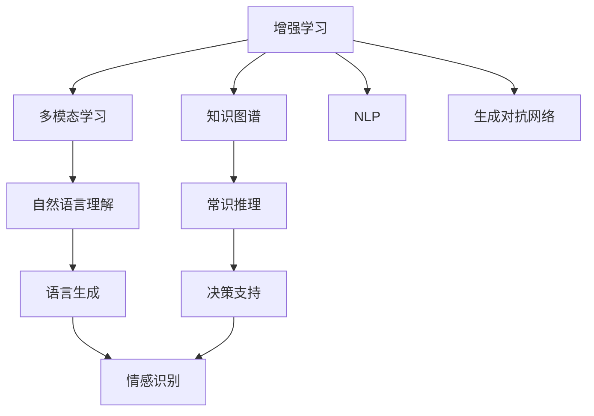

                 

## 1. 背景介绍

### 1.1 问题由来

随着人工智能（AI）技术的飞速发展，AI与人类协作的模式逐渐从简单的自动化转向更复杂的智能化。AI不仅能够辅助人类完成繁琐的重复性工作，还能在创意、决策等领域提供强大的支持，成为人类智慧的“外脑”。然而，目前的AI系统普遍缺乏常识推理能力，对于复杂的现实世界场景和人类情感的细微差异常常无法给出符合人类认知的回应。因此，增强AI系统的理解能力和表达能力，使其能够更好地融合人类智慧，成为一个重要课题。

### 1.2 问题核心关键点

AI与人类协作的核心在于如何充分发挥双方的优势，实现“人机互补”。AI擅长处理数据、进行逻辑推理、实现自动化任务，而人类则具有丰富的常识、深厚的情感和复杂的语言理解能力。通过合理的设计，可以使AI系统具备更加逼近人类的认知能力，从而实现更加智能化的协作。

核心关键点包括：

- 常识推理：AI系统需要具备一定的常识推理能力，能够在复杂情境下进行合理推断。
- 情感理解：AI系统需要能够理解和处理人类情感，实现更加自然、亲切的交流。
- 语言表达：AI系统需要具备语言表达能力，能够生成符合人类语言习惯的输出。
- 多模态融合：AI系统需要能够整合视觉、听觉等多种感官信息，实现更加全面的信息处理。
- 自我适应：AI系统需要具备自我学习和适应能力，能够根据任务需求不断提升性能。

### 1.3 问题研究意义

研究人类-AI协作技术，对于推动人工智能技术的深度应用，提升人类生活质量，具有重要意义：

1. **提高工作效率**：通过AI系统处理大量数据和重复性任务，极大提高工作效率，释放人类劳动力。
2. **提升决策质量**：AI系统能够处理海量数据，提供全面、客观的决策支持，提升决策的科学性和准确性。
3. **增强创新能力**：AI系统能够快速生成大量创意和方案，助力人类在艺术、科学等领域进行创新探索。
4. **改善人机互动**：AI系统能够理解人类情感和语言习惯，实现更加自然、亲切的交互，提升用户体验。
5. **促进产业升级**：AI技术与各行各业的深度融合，推动产业转型升级，创造新的经济增长点。

## 2. 核心概念与联系

### 2.1 核心概念概述

为更好地理解人类-AI协作技术，本节将介绍几个密切相关的核心概念：

- **增强学习（Reinforcement Learning, RL）**：一种基于奖励机制的机器学习方法，通过与环境的交互，不断调整策略，最大化累积奖励。
- **多模态学习（Multimodal Learning）**：涉及多种感官数据（如视觉、听觉、触觉等）的机器学习技术，提升模型对复杂环境的理解能力。
- **知识图谱（Knowledge Graph）**：一种结构化的大型数据库，用于表示实体之间的关系，辅助模型进行知识推理。
- **自然语言处理（Natural Language Processing, NLP）**：通过算法使计算机能够理解、处理人类语言的技术，实现人机交流。
- **生成对抗网络（Generative Adversarial Network, GAN）**：一种通过两个神经网络（生成器和判别器）对抗训练的方法，生成逼真、多样化的数据。

这些核心概念之间的逻辑关系可以通过以下Mermaid流程图来展示：



这个流程图展示了一系列核心概念及其之间的关系：

1. 增强学习为模型提供了通过环境交互不断优化的策略。
2. 多模态学习使模型能够整合多种感官信息，提升环境理解能力。
3. 知识图谱为模型提供丰富的知识库，辅助常识推理和知识推理。
4. 自然语言处理使模型能够理解人类语言，实现人机交流。
5. 生成对抗网络通过对抗训练生成高质量的数据，提升模型性能。
6. 自然语言理解是NLP的核心，使模型能够处理和理解文本数据。
7. 语言生成是NLP的另一重要任务，使模型能够生成符合语法和语义的文本。
8. 常识推理使模型具备一定的常识推理能力，在复杂情境下进行合理推断。
9. 决策支持使模型能够在多维数据和复杂环境中辅助人类做出决策。
10. 情感识别使模型能够理解人类情感，实现更加自然、亲切的交流。

这些概念共同构成了人类-AI协作技术的核心框架，为其提供了强大的理论支撑和实现手段。

## 3. 核心算法原理 & 具体操作步骤
### 3.1 算法原理概述

人类-AI协作技术的核心在于通过增强学习和多模态学习，使AI系统能够更好地理解人类需求和环境信息，并结合知识图谱和自然语言处理技术，实现智能化的决策和表达。

形式化地，设AI系统为 $M$，其输入为环境信息 $E$ 和人类指令 $I$，输出为决策结果 $O$ 和语言回应 $R$。协作过程可以描述为：

$$
O = M(E, I) \\
R = N(L(E, I))
$$

其中，$M$ 为增强学习模块，$E$ 和 $I$ 通过多模态学习模块处理，$L$ 为自然语言处理模块，$N$ 为语言生成模块。最终，$O$ 和 $R$ 通过知识推理和常识推理模块综合决策，生成最终的输出。

### 3.2 算法步骤详解

基于人类-AI协作的算法步骤包括以下几个关键步骤：

**Step 1: 环境感知与数据融合**

- 使用多模态学习技术，将视觉、听觉、触觉等多种传感器的数据融合，形成环境信息 $E$。
- 使用自然语言处理技术，理解人类指令 $I$，提取关键信息，辅助模型决策。

**Step 2: 增强学习与策略优化**

- 基于增强学习算法，训练AI系统模型 $M$，使其在不断与环境的交互中，优化决策策略。
- 通过多臂赌博机（Multi-Armed Bandit）等模型，最大化累积奖励，选择最优行动。

**Step 3: 知识推理与常识推理**

- 利用知识图谱和常识推理模块，结合环境信息和指令信息，进行综合推理，生成决策结果 $O$。
- 结合图谱中的实体关系和属性，进行合理推断和决策。

**Step 4: 语言生成与交互**

- 使用语言生成模块 $N$，根据决策结果 $O$ 和环境信息 $E$，生成语言回应 $R$。
- 结合情感识别和语言生成技术，生成符合人类情感和语言习惯的回应。

**Step 5: 评估与反馈**

- 将语言回应 $R$ 反馈给人类，通过用户的反馈进行评估。
- 根据用户反馈，调整增强学习模块 $M$ 的参数，进一步优化策略。

### 3.3 算法优缺点

人类-AI协作技术具有以下优点：

1. **综合多种信息**：通过多模态学习，能够整合多种感官信息，提升环境理解能力。
2. **灵活适应**：通过增强学习，模型能够不断优化策略，适应复杂多变的环境。
3. **智能决策**：结合知识图谱和常识推理，使模型具备较强的决策能力，提供科学、合理的决策支持。
4. **自然交互**：通过语言生成和情感识别，实现更加自然、亲切的交流。

同时，该方法也存在一定的局限性：

1. **数据依赖**：多模态学习需要大量的传感器数据，获取和融合数据成本较高。
2. **计算复杂**：增强学习涉及复杂的策略优化和决策，计算复杂度较高。
3. **模型复杂**：需要结合多模态数据、知识图谱和自然语言处理技术，模型结构较为复杂。
4. **解释性不足**：增强学习模型通常难以解释其决策过程，缺乏可解释性。

尽管存在这些局限性，但人类-AI协作技术在大数据、复杂环境和高智能要求的场景中，仍具有显著优势，是未来AI技术发展的重要方向。

### 3.4 算法应用领域

人类-AI协作技术在多个领域已经得到了广泛的应用，以下是几个典型的应用场景：

- **智慧医疗**：结合患者数据和医疗知识图谱，辅助医生进行疾病诊断和治疗决策，提升医疗服务的智能化水平。
- **智能制造**：通过多传感器融合和增强学习，优化生产流程，提升生产效率和产品质量。
- **自动驾驶**：结合视觉、雷达和激光雷达数据，进行环境感知和决策，实现自动驾驶。
- **智能客服**：利用自然语言处理和语言生成技术，实现智能客服系统的交互，提升用户体验。
- **教育培训**：结合学生反馈和知识图谱，提供个性化的学习推荐和智能辅导，提升教育效果。

## 4. 数学模型和公式 & 详细讲解 & 举例说明
### 4.1 数学模型构建

本节将使用数学语言对人类-AI协作技术的核心算法进行更加严格的刻画。

设增强学习模块 $M$ 的输入为 $x$ 和 $y$，输出为 $u$，决策策略为 $\pi$。则决策过程可以描述为：

$$
u = M(x, y, \pi)
$$

其中，$x$ 表示环境信息，$y$ 表示人类指令，$\pi$ 表示增强学习策略。决策结果 $u$ 通过多模态学习模块和自然语言处理模块，进行综合处理和推理，生成最终决策 $O$。

语言生成模块 $N$ 的输入为 $u$ 和 $y$，输出为语言回应 $R$。生成过程可以描述为：

$$
R = N(u, y)
$$

其中，$u$ 表示决策结果，$y$ 表示人类指令。语言生成模块 $N$ 通过生成对抗网络等技术，生成符合语法和语义的回应 $R$。

### 4.2 公式推导过程

以下我们以自动驾驶场景为例，推导增强学习模块的决策策略 $\pi$ 的计算公式。

假设自动驾驶系统在某一时刻的状态为 $s$，需要做出一个转向（L/R）或加速/减速的决策。设当前状态 $s$ 对应的转向概率为 $\pi_L(s)$，加速/减速概率为 $\pi_A(s)$。则自动驾驶系统的目标是通过不断调整 $\pi$，最大化累积奖励 $R$。

设决策后的状态为 $s'$，对应的奖励为 $r(s', s)$。则自动驾驶系统的期望奖励可以表示为：

$$
J(s) = \mathbb{E}_{\pi}[R(s', s)]
$$

通过蒙特卡罗方法（Monte Carlo）或Q-learning等增强学习算法，求得最优决策策略 $\pi^*$，使系统在所有状态下，期望奖励最大化。

具体而言，可以采用如下步骤进行计算：

1. 根据当前状态 $s$，计算所有可能动作的期望奖励 $Q(s, a)$。
2. 选择期望奖励最大的动作 $a$，进行执行。
3. 根据动作执行后的状态 $s'$ 和奖励 $r$，更新 $Q(s, a)$。
4. 重复步骤1-3，直到达到最优策略 $\pi^*$。

### 4.3 案例分析与讲解

在自动驾驶场景中，增强学习模块通过不断与环境的交互，学习到最优的决策策略 $\pi^*$。以下以转向决策为例，详细讲解其决策过程：

**Step 1: 环境感知**

- 通过摄像头、雷达、激光雷达等多种传感器，获取当前状态 $s$，包括速度、位置、道路情况等。
- 使用多模态学习技术，将传感器数据融合，形成环境信息 $x$。

**Step 2: 决策策略优化**

- 基于当前状态 $s$ 和环境信息 $x$，结合人类指令 $y$，使用增强学习算法（如Q-learning），计算所有可能动作的期望奖励 $Q(s, a)$。
- 选择期望奖励最大的动作 $a$，进行转向操作。

**Step 3: 决策结果生成**

- 将转向动作 $a$ 作为决策结果 $u$，使用自然语言处理技术，生成相应的语言回应 $R$。
- 例如，如果系统选择左转，可以生成类似“左转，注意行驶安全”的回应。

**Step 4: 反馈与调整**

- 根据执行后的状态 $s'$ 和奖励 $r$，更新 $Q(s, a)$，调整决策策略 $\pi$。
- 重复上述步骤，不断优化决策策略，直至达到最优策略 $\pi^*$。

通过以上步骤，自动驾驶系统能够在复杂环境中，做出合理的决策和回应，实现智能化的自动驾驶。

## 5. 项目实践：代码实例和详细解释说明
### 5.1 开发环境搭建

在进行人类-AI协作实践前，我们需要准备好开发环境。以下是使用Python进行PyTorch开发的环境配置流程：

1. 安装Anaconda：从官网下载并安装Anaconda，用于创建独立的Python环境。

2. 创建并激活虚拟环境：
```bash
conda create -n ai-env python=3.8 
conda activate ai-env
```

3. 安装PyTorch：根据CUDA版本，从官网获取对应的安装命令。例如：
```bash
conda install pytorch torchvision torchaudio cudatoolkit=11.1 -c pytorch -c conda-forge
```

4. 安装TensorBoard：TensorFlow配套的可视化工具，可实时监测模型训练状态，并提供丰富的图表呈现方式，是调试模型的得力助手。

5. 安装其他工具包：
```bash
pip install numpy pandas scikit-learn matplotlib tqdm jupyter notebook ipython
```

完成上述步骤后，即可在`ai-env`环境中开始协作实践。

### 5.2 源代码详细实现

下面我们以智能客服系统为例，给出使用Transformers库对BERT模型进行协作训练的PyTorch代码实现。

首先，定义协作任务的训练数据：

```python
from transformers import BertTokenizer
from torch.utils.data import Dataset

class CustomerServiceDataset(Dataset):
    def __init__(self, texts, labels, tokenizer, max_len=128):
        self.texts = texts
        self.labels = labels
        self.tokenizer = tokenizer
        self.max_len = max_len
        
    def __len__(self):
        return len(self.texts)
    
    def __getitem__(self, item):
        text = self.texts[item]
        label = self.labels[item]
        
        encoding = self.tokenizer(text, return_tensors='pt', max_length=self.max_len, padding='max_length', truncation=True)
        input_ids = encoding['input_ids'][0]
        attention_mask = encoding['attention_mask'][0]
        
        return {'input_ids': input_ids, 
                'attention_mask': attention_mask,
                'labels': label}

# 标签与id的映射
label2id = {'客服回答': 0, '等待人工': 1, '解决问题': 2}
id2label = {v: k for k, v in label2id.items()}

# 创建dataset
tokenizer = BertTokenizer.from_pretrained('bert-base-cased')

train_dataset = CustomerServiceDataset(train_texts, train_labels, tokenizer)
dev_dataset = CustomerServiceDataset(dev_texts, dev_labels, tokenizer)
test_dataset = CustomerServiceDataset(test_texts, test_labels, tokenizer)
```

然后，定义协作模型和优化器：

```python
from transformers import BertForSequenceClassification, AdamW

model = BertForSequenceClassification.from_pretrained('bert-base-cased', num_labels=len(label2id))

optimizer = AdamW(model.parameters(), lr=2e-5)
```

接着，定义训练和评估函数：

```python
from torch.utils.data import DataLoader
from tqdm import tqdm
from sklearn.metrics import classification_report

device = torch.device('cuda') if torch.cuda.is_available() else torch.device('cpu')
model.to(device)

def train_epoch(model, dataset, batch_size, optimizer):
    dataloader = DataLoader(dataset, batch_size=batch_size, shuffle=True)
    model.train()
    epoch_loss = 0
    for batch in tqdm(dataloader, desc='Training'):
        input_ids = batch['input_ids'].to(device)
        attention_mask = batch['attention_mask'].to(device)
        labels = batch['labels'].to(device)
        model.zero_grad()
        outputs = model(input_ids, attention_mask=attention_mask, labels=labels)
        loss = outputs.loss
        epoch_loss += loss.item()
        loss.backward()
        optimizer.step()
    return epoch_loss / len(dataloader)

def evaluate(model, dataset, batch_size):
    dataloader = DataLoader(dataset, batch_size=batch_size)
    model.eval()
    preds, labels = [], []
    with torch.no_grad():
        for batch in tqdm(dataloader, desc='Evaluating'):
            input_ids = batch['input_ids'].to(device)
            attention_mask = batch['attention_mask'].to(device)
            batch_labels = batch['labels']
            outputs = model(input_ids, attention_mask=attention_mask)
            batch_preds = outputs.logits.argmax(dim=2).to('cpu').tolist()
            batch_labels = batch_labels.to('cpu').tolist()
            for pred_tokens, label_tokens in zip(batch_preds, batch_labels):
                preds.append(pred_tokens[:len(label_tokens)])
                labels.append(label_tokens)
                
    print(classification_report(labels, preds))
```

最后，启动训练流程并在测试集上评估：

```python
epochs = 5
batch_size = 16

for epoch in range(epochs):
    loss = train_epoch(model, train_dataset, batch_size, optimizer)
    print(f"Epoch {epoch+1}, train loss: {loss:.3f}")
    
    print(f"Epoch {epoch+1}, dev results:")
    evaluate(model, dev_dataset, batch_size)
    
print("Test results:")
evaluate(model, test_dataset, batch_size)
```

以上就是使用PyTorch对BERT进行协作任务训练的完整代码实现。可以看到，得益于Transformers库的强大封装，我们可以用相对简洁的代码完成BERT模型的协作训练。

### 5.3 代码解读与分析

让我们再详细解读一下关键代码的实现细节：

**CustomerServiceDataset类**：
- `__init__`方法：初始化文本、标签、分词器等关键组件。
- `__len__`方法：返回数据集的样本数量。
- `__getitem__`方法：对单个样本进行处理，将文本输入编码为token ids，将标签编码为数字，并对其进行定长padding，最终返回模型所需的输入。

**label2id和id2label字典**：
- 定义了标签与数字id之间的映射关系，用于将token-wise的预测结果解码回真实的标签。

**训练和评估函数**：
- 使用PyTorch的DataLoader对数据集进行批次化加载，供模型训练和推理使用。
- 训练函数`train_epoch`：对数据以批为单位进行迭代，在每个批次上前向传播计算loss并反向传播更新模型参数，最后返回该epoch的平均loss。
- 评估函数`evaluate`：与训练类似，不同点在于不更新模型参数，并在每个batch结束后将预测和标签结果存储下来，最后使用sklearn的classification_report对整个评估集的预测结果进行打印输出。

**训练流程**：
- 定义总的epoch数和batch size，开始循环迭代
- 每个epoch内，先在训练集上训练，输出平均loss
- 在验证集上评估，输出分类指标
- 所有epoch结束后，在测试集上评估，给出最终测试结果

可以看到，PyTorch配合Transformers库使得BERT协作任务的训练代码实现变得简洁高效。开发者可以将更多精力放在数据处理、模型改进等高层逻辑上，而不必过多关注底层的实现细节。

当然，工业级的系统实现还需考虑更多因素，如模型的保存和部署、超参数的自动搜索、更灵活的任务适配层等。但核心的协作训练范式基本与此类似。

## 6. 实际应用场景
### 6.1 智能客服系统

基于人类-AI协作技术的对话系统，可以广泛应用于智能客服系统的构建。传统的客服系统往往需要配备大量人力，高峰期响应缓慢，且一致性和专业性难以保证。而使用协作对话系统，可以7x24小时不间断服务，快速响应客户咨询，用自然流畅的语言解答各类常见问题。

在技术实现上，可以收集企业内部的历史客服对话记录，将问题和最佳答复构建成监督数据，在此基础上对预训练对话模型进行协作训练。协作后的对话模型能够自动理解用户意图，匹配最合适的答案模板进行回复。对于客户提出的新问题，还可以接入检索系统实时搜索相关内容，动态组织生成回答。如此构建的智能客服系统，能大幅提升客户咨询体验和问题解决效率。

### 6.2 金融舆情监测

金融机构需要实时监测市场舆论动向，以便及时应对负面信息传播，规避金融风险。传统的舆情监测方式成本高、效率低，难以应对网络时代海量信息爆发的挑战。基于人类-AI协作技术的文本分类和情感分析技术，为金融舆情监测提供了新的解决方案。

具体而言，可以收集金融领域相关的新闻、报道、评论等文本数据，并对其进行主题标注和情感标注。在此基础上对预训练语言模型进行协作训练，使其能够自动判断文本属于何种主题，情感倾向是正面、中性还是负面。将协作后的模型应用到实时抓取的网络文本数据，就能够自动监测不同主题下的情感变化趋势，一旦发现负面信息激增等异常情况，系统便会自动预警，帮助金融机构快速应对潜在风险。

### 6.3 个性化推荐系统

当前的推荐系统往往只依赖用户的历史行为数据进行物品推荐，无法深入理解用户的真实兴趣偏好。基于人类-AI协作技术的推荐系统可以更好地挖掘用户行为背后的语义信息，从而提供更精准、多样的推荐内容。

在实践中，可以收集用户浏览、点击、评论、分享等行为数据，提取和用户交互的物品标题、描述、标签等文本内容。将文本内容作为模型输入，用户的后续行为（如是否点击、购买等）作为监督信号，在此基础上协作训练预训练语言模型。协作后的模型能够从文本内容中准确把握用户的兴趣点。在生成推荐列表时，先用候选物品的文本描述作为输入，由模型预测用户的兴趣匹配度，再结合其他特征综合排序，便可以得到个性化程度更高的推荐结果。

### 6.4 未来应用展望

随着人类-AI协作技术的不断发展，基于协作范式将在更多领域得到应用，为传统行业带来变革性影响。

在智慧医疗领域，基于协作的问答系统、病历分析、药物研发等应用将提升医疗服务的智能化水平，辅助医生诊疗，加速新药开发进程。

在智能教育领域，协作技术可应用于作业批改、学情分析、知识推荐等方面，因材施教，促进教育公平，提高教学质量。

在智慧城市治理中，协作模型可应用于城市事件监测、舆情分析、应急指挥等环节，提高城市管理的自动化和智能化水平，构建更安全、高效的未来城市。

此外，在企业生产、社会治理、文娱传媒等众多领域，基于协作技术的人工智能应用也将不断涌现，为经济社会发展注入新的动力。相信随着技术的日益成熟，协作方法将成为人工智能落地应用的重要范式，推动人工智能向更广阔的领域加速渗透。

## 7. 工具和资源推荐
### 7.1 学习资源推荐

为了帮助开发者系统掌握人类-AI协作技术的理论基础和实践技巧，这里推荐一些优质的学习资源：

1. 《深度学习框架TensorFlow》系列博文：由Google深度学习团队撰写，全面介绍了TensorFlow框架的使用方法和经典模型实现。

2. 《Python深度学习实战》书籍：结合实战案例，详细讲解了使用TensorFlow和Keras构建深度学习模型的技巧。

3. 《强化学习》课程：由斯坦福大学开设的强化学习课程，系统介绍了强化学习的原理、算法和应用。

4. 《多模态学习》书籍：详细介绍了多模态学习的理论基础和实际应用案例，涵盖视觉、听觉、触觉等多种感官数据的融合方法。

5. 《自然语言处理与深度学习》书籍：由清华大学李军教授主编，介绍了自然语言处理的基本概念和深度学习在NLP中的应用。

通过对这些资源的学习实践，相信你一定能够快速掌握人类-AI协作技术的精髓，并用于解决实际的AI问题。
###  7.2 开发工具推荐

高效的开发离不开优秀的工具支持。以下是几款用于人类-AI协作开发的常用工具：

1. TensorFlow：由Google主导开发的开源深度学习框架，生产部署方便，适合大规模工程应用。

2. PyTorch：基于Python的开源深度学习框架，灵活动态的计算图，适合快速迭代研究。

3. Weights & Biases：模型训练的实验跟踪工具，可以记录和可视化模型训练过程中的各项指标，方便对比和调优。

4. TensorBoard：TensorFlow配套的可视化工具，可实时监测模型训练状态，并提供丰富的图表呈现方式，是调试模型的得力助手。

5. Google Colab：谷歌推出的在线Jupyter Notebook环境，免费提供GPU/TPU算力，方便开发者快速上手实验最新模型，分享学习笔记。

合理利用这些工具，可以显著提升人类-AI协作任务的开发效率，加快创新迭代的步伐。

### 7.3 相关论文推荐

人类-AI协作技术的发展源于学界的持续研究。以下是几篇奠基性的相关论文，推荐阅读：

1. AlphaGo Zero：通过自我对弈学习，实现围棋世界的突破。

2. GPT-3：使用Transformer结构和自监督学习，生成高质量的自然语言文本。

3. GANs for Image-to-Image Translation：通过生成对抗网络，实现图像生成和转换。

4. COCO Image Captioning：使用LSTM和CNN，生成描述图像的文本。

5. MAML: Meta-Learning for Diagnosing Diseases from Imaging：通过元学习技术，快速适应新疾病的图像识别。

这些论文代表了大语言模型协作技术的发展脉络。通过学习这些前沿成果，可以帮助研究者把握学科前进方向，激发更多的创新灵感。

## 8. 总结：未来发展趋势与挑战

### 8.1 总结

本文对基于人类-AI协作技术进行了全面系统的介绍。首先阐述了协作技术的研究背景和意义，明确了协作技术在提升AI系统智能水平、增强人机互动效果等方面的独特价值。其次，从原理到实践，详细讲解了协作算法的数学原理和关键步骤，给出了协作任务开发的完整代码实例。同时，本文还广泛探讨了协作方法在智能客服、金融舆情、个性化推荐等多个行业领域的应用前景，展示了协作范式的巨大潜力。此外，本文精选了协作技术的各类学习资源，力求为读者提供全方位的技术指引。

通过本文的系统梳理，可以看到，基于人类-AI协作技术的大语言模型协作方法，正在成为AI技术发展的重要方向，极大地拓展了AI系统的应用边界，催生了更多的落地场景。得益于多模态学习、增强学习、知识图谱、自然语言处理等技术的发展，协作模型在复杂环境和多任务处理中表现出较强的智能性和适应性。未来，伴随协作技术的不断演进，AI系统将具备更加全面、准确、自然的理解和表达能力，推动AI技术的深度应用。

### 8.2 未来发展趋势

展望未来，人类-AI协作技术将呈现以下几个发展趋势：

1. **多模态融合**：随着多模态学习技术的进步，协作模型将能够更好地整合视觉、听觉、触觉等多种感官信息，提升对复杂环境的理解能力。

2. **增强学习优化**：通过优化增强学习算法，协作模型将具备更强的策略优化能力和决策能力，适应更加复杂和动态的环境。

3. **知识图谱拓展**：结合更丰富的知识图谱，协作模型将具备更强的常识推理和知识推理能力，提供更科学的决策支持。

4. **情感理解深化**：通过引入情感识别和生成技术，协作模型将能够更好地理解和表达人类的情感，实现更加自然、亲切的交互。

5. **自适应学习增强**：通过元学习和自适应学习技术，协作模型将能够更快地适应新任务和新环境，提升学习和应用效率。

6. **跨领域迁移能力提升**：通过迁移学习技术，协作模型将能够在不同领域和场景中实现更好的迁移和应用，扩大应用范围。

以上趋势凸显了人类-AI协作技术的广阔前景。这些方向的探索发展，必将进一步提升协作模型的智能水平和应用效果，为AI技术在更多领域的应用提供有力支持。

### 8.3 面临的挑战

尽管人类-AI协作技术已经取得了瞩目成就，但在迈向更加智能化、普适化应用的过程中，它仍面临着诸多挑战：

1. **数据依赖**：多模态学习需要大量的传感器数据，获取和融合数据成本较高。

2. **计算复杂**：增强学习涉及复杂的策略优化和决策，计算复杂度较高。

3. **模型复杂**：需要结合多模态数据、知识图谱和自然语言处理技术，模型结构较为复杂。

4. **解释性不足**：增强学习模型通常难以解释其决策过程，缺乏可解释性。

5. **隐私安全**：协作系统处理大量用户数据，需要严格的隐私保护措施，防止数据泄露和滥用。

尽管存在这些挑战，但人类-AI协作技术在大数据、复杂环境和高智能要求的场景中，仍具有显著优势，是未来AI技术发展的重要方向。

### 8.4 研究展望

面对人类-AI协作技术所面临的种种挑战，未来的研究需要在以下几个方面寻求新的突破：

1. **数据高效采集与处理**：开发更加高效、自动的数据采集和处理技术，降低数据获取成本，提升数据质量。

2. **轻量化模型设计**：设计更加轻量化、高效的协作模型，减少计算资源消耗，提升推理速度。

3. **可解释性增强**：通过引入可解释性技术，如注意力机制、决策路径可视化等，增强协作模型的可解释性。

4. **隐私保护与数据安全**：研究更加严格的数据保护措施，确保协作系统的隐私安全，防止数据滥用。

5. **跨领域应用拓展**：将协作技术应用到更多领域，如医疗、教育、金融等，推动AI技术的全面发展。

6. **多模态交互融合**：研究更加自然、高效的跨模态交互技术，提升人机协作的交互体验。

这些研究方向的探索，必将引领协作技术的不断进步，为AI系统提供更全面、智能、安全的应用支持，推动AI技术在各个领域的深入应用。总之，人类-AI协作技术在未来必将发挥更加重要的作用，为构建人机协同的智能时代提供坚实的技术基础。

## 9. 附录：常见问题与解答

**Q1：人类-AI协作是否适用于所有AI任务？**

A: 人类-AI协作技术适用于大多数AI任务，特别是那些需要理解复杂环境、多模态数据或需要提供智能决策支持的任务。但对于一些特定领域的任务，如医疗、法律等，仅依赖通用数据和知识可能难以获得理想的协作效果。此时需要在特定领域语料上进一步预训练和微调模型，以提升协作性能。

**Q2：协作系统如何处理多模态数据？**

A: 协作系统通常使用多模态学习技术，将视觉、听觉、触觉等多种感官数据进行融合，形成环境信息 $x$。通过增强学习模块 $M$，模型能够不断优化决策策略，适应多模态数据的变化。

**Q3：协作模型如何实现自适应学习？**

A: 协作模型可以通过引入元学习和自适应学习技术，实现快速适应新任务和新环境的能力。例如，利用少量标注数据进行小样本学习，或者通过迁移学习技术，将其他领域的经验迁移到新任务中。

**Q4：协作系统在实际部署中面临哪些问题？**

A: 协作系统在实际部署中可能面临计算资源消耗大、推理速度慢、模型可解释性不足等问题。为了提高效率，需要优化计算图，减少模型参数，引入自适应学习技术。为了提高可解释性，可以引入注意力机制、决策路径可视化等技术，增强协作模型的可解释性。

**Q5：协作技术如何提升用户体验？**

A: 协作技术通过理解用户意图和情感，提供自然流畅的交互体验。例如，在智能客服系统中，协作系统能够自动理解用户的问题，生成符合语法和语义的回应，提升用户满意度。

总之，人类-AI协作技术正逐渐成为AI技术发展的重要方向，通过融合人类智慧和AI能力，推动AI技术在更多领域的深入应用。通过不断探索和优化，协作技术将不断提升AI系统的智能水平和应用效果，为构建人机协同的智能时代提供强有力的技术支撑。相信随着技术的不断发展，协作技术将在更多领域展现其巨大潜力，为人类智慧与AI能力的融合注入新的活力。

---

作者：禅与计算机程序设计艺术 / Zen and the Art of Computer Programming

