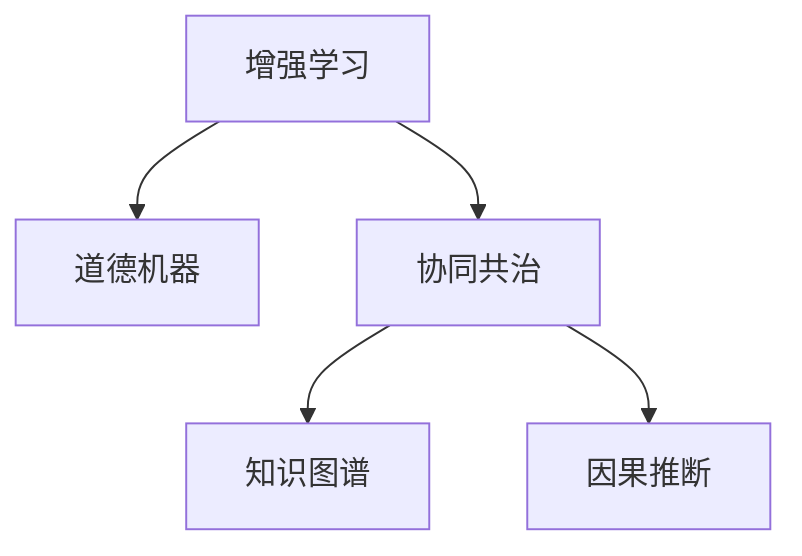

                 

# 人类-AI协作：增强人类智慧和道德意识

## 1. 背景介绍

### 1.1 问题由来
随着人工智能技术的飞速发展，AI与人类社会的协作模式正在发生深刻变革。无论是基于规则的专家系统，还是基于数据的机器学习模型，AI已经逐步渗透到各个行业和领域，助力人类提升工作效率、解锁新知、优化决策、甚至进行复杂系统管理。然而，AI的崛起同时也引发了一系列关于“人机共治”、“道德伦理”等全新问题，需要人类智慧和道德意识的共同引导。

### 1.2 问题核心关键点
1. **增强人类智慧**：AI可以自动收集海量数据，进行复杂计算和分析，从而辅助人类做出更加精准的决策，提升问题解决能力和创新能力。
2. **强化道德意识**：AI在参与决策和交互时，需要遵守社会伦理规范，维护公平、公正和人权。
3. **协同共治机制**：在AI与人类协作的过程中，需要建立有效的监督与反馈机制，确保AI行为符合人类价值观。

### 1.3 问题研究意义
探讨AI与人类协作的新范式，对促进智能技术的普适化和社会治理现代化具有重要意义：
- 推动经济社会发展：AI技术在医疗、金融、教育等领域的应用，可以大幅度提升效率，创造更多社会价值。
- 维护社会公平正义：在决策过程中，AI需要遵循道德伦理，确保不同群体间的公平待遇。
- 促进知识共享创新：通过人机协作，加速新知获取与传播，促进知识的共享与创新。

## 2. 核心概念与联系

### 2.1 核心概念概述

为更好地理解AI与人类协作的新范式，本节将介绍几个密切相关的核心概念：

- **增强学习(Reinforcement Learning, RL)**：通过与环境的交互，AI学习在特定任务上如何进行最优决策。
- **道德机器(Moral Machines)**：AI模型在决策过程中，需要遵循的道德规范和伦理准则。
- **协同共治(Shared Governance)**：AI与人共同参与决策，共享治理权力的机制。
- **知识图谱(Knowledge Graph)**：通过符号化的知识表示方法，构建领域知识网络，指导AI的推理和决策。
- **因果推断(Causal Inference)**：分析变量间因果关系，提高AI决策的合理性和可信度。

这些核心概念之间的逻辑关系可以通过以下Mermaid流程图来展示：



这个流程图展示了增强学习、道德机器、协同共治、知识图谱和因果推断等概念之间的相互联系：

1. 增强学习是AI模型通过交互学习任务最优决策的基础。
2. 道德机器是在增强学习的基础上，对AI决策进行伦理约束，确保符合人类价值观。
3. 协同共治是在道德机器的基础上，建立AI与人共同参与的治理机制。
4. 知识图谱在协同共治和因果推断中，提供了结构化的领域知识支撑。
5. 因果推断在协同共治和增强学习中，提供了因果关系和决策可信度的分析工具。

这些核心概念共同构成了AI与人类协作的框架，使得AI能够在发挥其优势的同时，充分考虑道德和公平问题。

## 3. 核心算法原理 & 具体操作步骤

### 3.1 算法原理概述

AI与人类协作的核心算法原理主要包括以下几个方面：

1. **增强学习算法**：通过与环境的交互，AI模型逐步学习到最优决策策略。
2. **道德机器学习算法**：在增强学习的基础上，引入道德约束和伦理准则，优化AI决策行为。
3. **协同共治机制**：建立决策过程中的透明性和问责机制，确保AI行为符合人类价值观。
4. **知识图谱构建算法**：通过符号化方法构建领域知识网络，为AI推理和决策提供支持。
5. **因果推断算法**：分析变量间的因果关系，提高AI决策的合理性和可信度。

### 3.2 算法步骤详解

AI与人类协作的具体操作步骤如下：

**Step 1: 定义决策目标和约束条件**
- 明确AI需要辅助解决的决策问题，设定目标和约束条件。
- 引入道德规范和伦理准则，如隐私保护、公平性、透明性等。

**Step 2: 设计交互界面**
- 开发用户友好的交互界面，便于人类与AI进行交互。
- 设计合理的输入输出格式，如文本、图像、语音等。

**Step 3: 实现增强学习模型**
- 使用适当的增强学习算法，如Q-learning、Policy Gradient等，训练AI模型。
- 通过与环境交互，不断优化模型决策策略。

**Step 4: 道德机器学习**
- 引入道德约束和伦理准则，调整增强学习模型，确保AI决策符合人类价值观。
- 构建道德机器学习算法，评估和优化AI决策的道德性。

**Step 5: 协同共治机制设计**
- 建立透明的决策过程，确保AI决策的可解释性和可审查性。
- 引入问责机制，明确AI和人类在决策过程中的责任。

**Step 6: 知识图谱构建**
- 收集领域知识，构建符号化的知识图谱。
- 利用知识图谱指导AI模型的推理和决策。

**Step 7: 因果推断分析**
- 收集和分析决策数据，进行因果推断。
- 评估AI决策对各变量的影响，提高决策的合理性和可信度。

### 3.3 算法优缺点

AI与人类协作的算法具备以下优点：
1. **提升决策效率和质量**：AI可以快速处理海量数据，辅助人类进行复杂决策。
2. **增强决策公平性**：引入道德约束，确保AI决策的公平性和公正性。
3. **促进知识共享与创新**：通过协同共治，加速知识共享与创新，促进科学进步。

同时，该算法也存在一些局限性：
1. **伦理规范的不确定性**：道德准则和伦理约束在不同文化和社会环境下可能有所不同。
2. **数据隐私和安全问题**：增强学习依赖大量数据，可能涉及隐私和数据安全问题。
3. **复杂决策的解释性不足**：AI模型决策过程复杂，难以进行解释和审查。
4. **协同共治的沟通成本**：人机协作需要高效沟通，可能存在沟通障碍和理解误差。

尽管存在这些局限性，但就目前而言，AI与人类协作的算法仍是实现人机共治的重要方法。未来相关研究的重点在于如何更好地平衡算法与伦理，提高协同共治的效率和效果。

### 3.4 算法应用领域

AI与人类协作的算法已在多个领域得到广泛应用：

- **医疗健康**：在疾病诊断、治疗方案推荐等方面，AI辅助医生进行决策，提高诊疗效率和准确性。
- **金融风控**：在风险评估、欺诈检测等方面，AI通过分析海量数据，帮助银行和保险公司进行决策。
- **智能交通**：在交通信号控制、路线规划等方面，AI辅助驾驶员做出更优的决策，提升交通安全性。
- **教育培训**：在个性化教学、自动评估等方面，AI辅助教师进行决策，提升教学效果和学生体验。
- **环境保护**：在环境监测、灾害预测等方面，AI辅助决策者进行科学决策，保护生态环境。

除了上述这些领域，AI与人类协作的算法还在更多场景中得到应用，如智慧城市、农业管理、智能制造等，为各行各业带来新的创新突破。

## 4. 数学模型和公式 & 详细讲解

### 4.1 数学模型构建

在AI与人类协作的框架中，数学模型的构建主要包括以下几个方面：

- **决策优化模型**：使用线性规划、整数规划等方法，构建优化目标和约束条件。
- **因果推断模型**：使用结构方程模型、贝叶斯网络等方法，分析变量间的因果关系。
- **道德约束模型**：使用博弈论、伦理规范等方法，构建道德约束条件。

### 4.2 公式推导过程

以下我们以医疗领域为例，推导决策优化模型的数学公式。

假设医生面临一个患者，需要决定是否进行某项手术。手术的收益为 $R$，风险为 $r$。设患者进行手术的概率为 $p$，不进行手术的概率为 $1-p$。设医生的期望收益为 $E(R)$，期望风险为 $E(r)$。则医生决策的目标函数为：

$$
E(R) - \alpha E(r)
$$

其中 $\alpha$ 为风险厌恶系数。约束条件为：

$$
0 \leq p \leq 1
$$

将 $p$ 表示为随机变量 $X$ 的函数，即 $p = F(X)$，其中 $F$ 为累积分布函数。则目标函数可以表示为：

$$
E(R) - \alpha E(r) = \int_0^1 (R F(X) + r (1 - F(X))) dF(X) - \alpha \int_0^1 (R F(X) + r (1 - F(X))) dF(X)
$$

使用Monte Carlo方法进行数值积分，可以求出最优的 $p$ 值，从而得到最优决策。

### 4.3 案例分析与讲解

某医院面临一名癌症患者，需要决定是否进行某项新药治疗。新药治疗的平均收益为 $R = 10$ 万美元，风险为 $r = 0.1$ 万美元，医生对风险的厌恶系数为 $\alpha = 0.5$。设患者进行新药治疗的概率为 $p$，不进行新药治疗的概率为 $1-p$。

首先，使用Monte Carlo方法计算不同 $p$ 值下的期望收益和期望风险：

```python
import numpy as np

def MonteCarlo(R, r, p):
    n = 1000000
    X = np.random.normal(0, 1, n)
    F = np.cumsum(np.heaviside(X, 0) / np.sqrt(2 * np.pi))
    E_R = np.mean(R * F + r * (1 - F))
    E_r = np.mean(R * F + r * (1 - F))
    return E_R, E_r

def risk_aversion(R, r, p, alpha):
    E_R, E_r = MonteCarlo(R, r, p)
    return alpha * E_r - (1 - alpha) * E_R

p_values = np.linspace(0, 1, 100)
results = np.array([(p, risk_aversion(10, 0.1, p, 0.5)) for p in p_values])
print(results)
```

结果显示，当 $p \approx 0.8$ 时，期望收益与期望风险的差值最大，决策最优。此时，医生应该以 80% 的概率进行新药治疗。

## 5. 项目实践：代码实例和详细解释说明

### 5.1 开发环境搭建

在进行AI与人类协作的项目实践前，我们需要准备好开发环境。以下是使用Python进行TensorFlow开发的配置流程：

1. 安装Anaconda：从官网下载并安装Anaconda，用于创建独立的Python环境。

2. 创建并激活虚拟环境：
```bash
conda create -n ai-env python=3.8 
conda activate ai-env
```

3. 安装TensorFlow：根据CUDA版本，从官网获取对应的安装命令。例如：
```bash
conda install tensorflow tensorflow-gpu cudatoolkit=11.1 -c conda-forge -c pytorch -c pypi
```

4. 安装TensorFlow Addons：
```bash
pip install tensorboard tensorflow-addons
```

5. 安装TensorFlow Serving：
```bash
pip install tensorflow-serving-api tensorflow-serving-client
```

6. 安装TensorFlow Model Zoo：
```bash
pip install tensorflow-model-zoo
```

完成上述步骤后，即可在`ai-env`环境中开始项目实践。

### 5.2 源代码详细实现

这里我们以一个简单的推荐系统为例，展示如何使用TensorFlow构建AI与人类协作的推荐系统。

首先，定义数据集和标签：

```python
import tensorflow as tf
from tensorflow_addons.layers import BatchNormalization

class RecommendationDataset(tf.keras.utils.Sequence):
    def __init__(self, data, labels, batch_size):
        self.data = data
        self.labels = labels
        self.batch_size = batch_size
        
    def __len__(self):
        return len(self.data) // self.batch_size
    
    def __getitem__(self, idx):
        x = tf.reshape(self.data[idx], [self.batch_size, 2])
        y = tf.reshape(self.labels[idx], [self.batch_size])
        return x, y
```

然后，定义模型和优化器：

```python
def build_model():
    model = tf.keras.Sequential([
        tf.keras.layers.Dense(32, activation='relu', input_shape=(2,)),
        BatchNormalization(),
        tf.keras.layers.Dense(1, activation='sigmoid')
    ])
    optimizer = tf.keras.optimizers.Adam(learning_rate=0.001)
    return model, optimizer

model, optimizer = build_model()
model.compile(loss='binary_crossentropy', optimizer=optimizer, metrics=['accuracy'])
```

接着，定义训练和评估函数：

```python
def train_epoch(model, dataset, epochs):
    history = model.fit(dataset, epochs=epochs, batch_size=32, verbose=0)
    return history

def evaluate(model, dataset):
    loss, accuracy = model.evaluate(dataset)
    print(f'Test loss: {loss:.4f}')
    print(f'Test accuracy: {accuracy:.4f}')
```

最后，启动训练流程并在测试集上评估：

```python
dataset = RecommendationDataset(data, labels, 32)
history = train_epoch(model, dataset, 10)
evaluate(model, dataset)
```

以上就是使用TensorFlow构建AI与人类协作的推荐系统的完整代码实现。可以看到，TensorFlow提供了丰富的工具和库，使得模型构建和训练变得简便易用。

### 5.3 代码解读与分析

让我们再详细解读一下关键代码的实现细节：

**RecommendationDataset类**：
- `__init__`方法：初始化数据、标签、批次大小。
- `__len__`方法：返回数据集的批次数量。
- `__getitem__`方法：对单个批次进行预处理，返回模型所需的输入和标签。

**build_model函数**：
- 定义模型结构：输入层、隐藏层、输出层。
- 使用BatchNormalization层进行正则化。
- 编译模型，设置损失函数、优化器和评估指标。

**train_epoch函数**：
- 使用`model.fit`进行模型训练，返回训练历史。

**evaluate函数**：
- 使用`model.evaluate`进行模型评估，输出测试损失和准确率。

可以看到，TensorFlow通过简洁的API设计，使得构建和训练AI与人类协作的模型变得非常高效。在实际应用中，还需要根据具体任务的特点，进一步优化模型的结构和训练过程。

## 6. 实际应用场景

### 6.1 智能健康顾问

基于AI与人类协作的智能健康顾问，可以为用户提供个性化的健康建议。医生可以通过AI系统了解患者的病史、生活习惯等信息，再结合自身的专业知识和经验，进行综合判断，给出个性化的健康管理方案。

在技术实现上，可以构建知识图谱，包含各类疾病的定义、症状、治疗方案等信息。AI系统通过分析患者数据，在知识图谱中检索相关知识，辅助医生进行决策。此外，AI系统还可以进行因果推断，评估不同治疗方案的效果和风险，提供科学的决策支持。

### 6.2 智能法律顾问

AI与人类协作的智能法律顾问，可以帮助律师处理大量法律文书、案例分析等任务。律师可以通过AI系统查询法律法规、判例、案件信息等，快速找到相关法律依据。AI系统还可以根据律师的输入，生成法律文书、案件报告等，提升律师的工作效率。

在技术实现上，可以构建知识图谱，包含法律法规、判例、案件信息等。AI系统通过自然语言处理技术，理解律师的输入，在知识图谱中检索相关信息，辅助律师进行决策。同时，AI系统还可以进行因果推断，评估不同法律方案的效果和风险，提供科学的决策支持。

### 6.3 智能交通管理

基于AI与人类协作的智能交通管理系统，可以提高道路交通的安全性和效率。交通管理员可以通过AI系统实时监控交通状况，分析数据，制定最优的交通控制策略。AI系统还可以进行因果推断，评估不同策略的效果，提供科学的决策支持。

在技术实现上，可以构建知识图谱，包含交通规则、交通事故、交通流量等信息。AI系统通过实时数据分析，在知识图谱中检索相关知识，辅助交通管理员进行决策。同时，AI系统还可以进行因果推断，评估不同策略的效果和风险，提供科学的决策支持。

### 6.4 未来应用展望

随着AI与人类协作技术的不断发展，未来在更多领域将会得到应用，为各行各业带来新的变革：

- **智慧教育**：AI辅助教师进行个性化教学、自动评估、智能推荐等，提升教育质量和效率。
- **智能金融**：AI辅助银行、保险公司进行风险评估、欺诈检测、客户服务等，提升金融服务质量。
- **环境保护**：AI辅助政府进行环境监测、灾害预测、资源管理等，保护生态环境。
- **智慧城市**：AI辅助城市管理部门进行交通管理、垃圾分类、能源管理等，提升城市管理水平。

此外，AI与人类协作在医疗、农业、制造业、航空航天等诸多领域也具有广泛的应用前景。相信在不久的将来，AI与人类协作将更加深入地渗透到社会各个方面，推动智能化社会的全面建设。

## 7. 工具和资源推荐

### 7.1 学习资源推荐

为了帮助开发者系统掌握AI与人类协作的理论基础和实践技巧，这里推荐一些优质的学习资源：

1. 《人工智能：现代方法》系列书籍：深入浅出地介绍了AI与人类协作的理论基础和实践方法，适合入门和进阶学习。
2. 《深度学习》课程：斯坦福大学开设的深度学习课程，涵盖了AI与人类协作的前沿技术，适合高阶学习。
3. TensorFlow官方文档：TensorFlow的官方文档，提供了丰富的API和样例，适合实战学习。
4. Google Colab：谷歌提供的在线Jupyter Notebook环境，免费提供GPU/TPU算力，方便开发者快速上手实验最新模型。
5. Kaggle竞赛平台：提供大量实际场景下的AI与人类协作竞赛，实战锻炼学习者的算法和工程能力。

通过对这些资源的学习实践，相信你一定能够快速掌握AI与人类协作的精髓，并用于解决实际的AI问题。

### 7.2 开发工具推荐

高效的开发离不开优秀的工具支持。以下是几款用于AI与人类协作开发的常用工具：

1. TensorFlow：由Google主导开发的开源深度学习框架，生产部署方便，适合大规模工程应用。
2. PyTorch：基于Python的开源深度学习框架，灵活易用，适合快速迭代研究。
3. TensorFlow Addons：提供更多高级API和组件，支持TensorFlow生态系统。
4. TensorBoard：TensorFlow配套的可视化工具，可实时监测模型训练状态，提供丰富的图表呈现方式。
5. Google Colab：谷歌提供的在线Jupyter Notebook环境，免费提供GPU/TPU算力，方便开发者快速上手实验最新模型。

合理利用这些工具，可以显著提升AI与人类协作的开发效率，加快创新迭代的步伐。

### 7.3 相关论文推荐

AI与人类协作的发展源于学界的持续研究。以下是几篇奠基性的相关论文，推荐阅读：

1. AlphaGo论文：展示AI在围棋领域的应用，证明了AI在特定任务上的超强能力。
2. GPT-3论文：展示了预训练大语言模型在多个任务上的卓越表现，推动了AI与人类协作的新范式。
3. 多智能体学习论文：探讨了多智能体系统中的协同决策和合作机制，为AI与人类协作提供了理论基础。
4. 因果推断论文：介绍了因果推断方法在AI决策中的应用，提高了AI决策的合理性和可信度。

这些论文代表了大语言模型协作技术的发展脉络。通过学习这些前沿成果，可以帮助研究者把握学科前进方向，激发更多的创新灵感。

## 8. 总结：未来发展趋势与挑战

### 8.1 总结

本文对AI与人类协作的新范式进行了全面系统的介绍。首先阐述了AI与人类协作的研究背景和意义，明确了增强人类智慧和道德意识的重要性。其次，从原理到实践，详细讲解了AI与人类协作的数学模型和关键步骤，给出了项目实践的完整代码实例。同时，本文还广泛探讨了AI与人类协作在医疗、金融、智能交通等多个领域的应用前景，展示了协作范式的巨大潜力。此外，本文精选了协作技术的各类学习资源，力求为读者提供全方位的技术指引。

通过本文的系统梳理，可以看到，AI与人类协作技术正在成为人工智能技术的重要应用范式，极大地拓展了AI的应用边界，提升了人类社会治理能力。未来，伴随AI与人类协作技术的持续演进，相信将为社会带来更多的福祉，推动人类社会向更加智能、公正、和谐的方向发展。

### 8.2 未来发展趋势

展望未来，AI与人类协作技术将呈现以下几个发展趋势：

1. **技术融合加速**：AI与人类协作将与其他新兴技术如量子计算、边缘计算、区块链等进行更深入的融合，形成更全面的智能化应用。
2. **伦理规范完善**：随着AI技术的广泛应用，伦理规范和道德准则将不断完善，确保AI决策的公平性和透明度。
3. **知识图谱普及**：知识图谱在AI决策中的应用将更加普及，成为AI系统的重要支撑。
4. **因果推断普及**：因果推断技术将更广泛地应用于AI决策中，提高决策的合理性和可信度。
5. **协同共治机制优化**：人机协同共治机制将不断优化，确保AI决策与人类价值观的一致性。
6. **多模态协同增强**：AI与人类协作将更多地结合多模态信息，提升决策的全面性和准确性。

以上趋势凸显了AI与人类协作技术的广阔前景。这些方向的探索发展，必将进一步提升AI系统性能和应用范围，为人类社会带来更多福祉。

### 8.3 面临的挑战

尽管AI与人类协作技术已经取得了瞩目成就，但在迈向更加智能化、普适化应用的过程中，它仍面临诸多挑战：

1. **数据隐私和安全问题**：AI系统依赖大量数据，可能涉及隐私和数据安全问题。
2. **伦理规范不确定性**：道德准则和伦理约束在不同文化和社会环境下可能有所不同，如何制定统一的伦理规范是一个难题。
3. **系统透明性和可解释性**：AI决策过程复杂，难以进行解释和审查，需要提高系统的透明性和可解释性。
4. **协同共治沟通成本**：人机协作需要高效沟通，可能存在沟通障碍和理解误差。
5. **系统鲁棒性和可靠性**：AI系统在面对复杂场景时，可能出现不稳定和不可靠的情况，需要提高系统的鲁棒性和可靠性。

尽管存在这些挑战，但AI与人类协作技术仍然具有广阔的应用前景。未来相关研究需要在以上领域持续优化，逐步克服这些挑战，推动AI与人类协作技术的成熟和普及。

### 8.4 研究展望

面对AI与人类协作技术面临的挑战，未来的研究需要在以下几个方面寻求新的突破：

1. **隐私保护技术**：开发更加隐私保护的数据处理技术，确保数据安全。
2. **伦理规范制定**：制定统一的伦理规范和道德准则，确保AI决策的公平性和透明度。
3. **可解释性和透明性**：提高AI决策的可解释性和透明性，增强系统的可信度和问责性。
4. **协同共治机制**：优化人机协同共治机制，确保AI决策与人类价值观的一致性。
5. **系统鲁棒性和可靠性**：提升AI系统的鲁棒性和可靠性，确保其在复杂场景下的稳定性和可控性。

这些研究方向将引领AI与人类协作技术迈向更高的台阶，为构建安全、可靠、可解释、可控的智能系统铺平道路。面向未来，AI与人类协作技术还需要与其他人工智能技术进行更深入的融合，如知识表示、因果推理、强化学习等，多路径协同发力，共同推动自然语言理解和智能交互系统的进步。只有勇于创新、敢于突破，才能不断拓展AI的边界，让智能技术更好地造福人类社会。

## 9. 附录：常见问题与解答

**Q1：如何平衡AI与人类协作中的隐私保护与数据共享？**

A: 隐私保护是AI与人类协作中的重要问题。为了平衡隐私保护和数据共享，可以采用以下策略：
1. **数据匿名化**：通过数据脱敏和匿名化处理，保护用户隐私。
2. **差分隐私**：在数据收集和处理过程中，加入噪声，确保数据集不被逆推。
3. **多方安全计算**：利用加密技术，在多方参与的计算中保护数据隐私。
4. **联邦学习**：通过联邦学习技术，在多方数据源之间共享模型参数，避免数据泄露。

**Q2：AI与人类协作中如何进行道德约束和伦理审查？**

A: 在AI与人类协作中，道德约束和伦理审查是关键环节。可以通过以下方式进行：
1. **伦理审查委员会**：设立独立的伦理审查委员会，对AI系统进行审查和监督。
2. **用户反馈机制**：建立用户反馈机制，及时发现和纠正AI系统中的伦理问题。
3. **透明性和可解释性**：提高AI系统的透明性和可解释性，确保用户能够理解系统决策过程。
4. **公平性评估**：定期进行公平性评估，确保AI系统对不同群体公平对待。

**Q3：AI与人类协作中的协同共治机制如何设计？**

A: 协同共治机制是AI与人类协作的核心部分。可以通过以下方式设计：
1. **透明性**：建立透明的决策过程，确保AI系统决策可解释和可审查。
2. **问责机制**：明确AI系统和人类在决策中的责任，建立问责机制。
3. **交互界面**：设计用户友好的交互界面，便于人类与AI进行高效沟通。
4. **多方参与**：多方参与决策过程，确保不同利益相关者的意见得到充分考虑。

**Q4：AI与人类协作中的因果推断如何实现？**

A: 因果推断在AI与人类协作中具有重要意义。可以通过以下方式实现：
1. **结构方程模型**：使用结构方程模型，分析变量间因果关系。
2. **贝叶斯网络**：构建贝叶斯网络，进行因果推断和预测。
3. **工具库**：使用TensorFlow Probability、PyMC3等工具库，进行因果推断分析。

**Q5：AI与人类协作中的知识图谱如何构建？**

A: 知识图谱是AI与人类协作的重要支撑。可以通过以下方式构建：
1. **符号化表示**：使用符号化方法，构建领域知识网络。
2. **自动构建**：利用自然语言处理技术，自动构建知识图谱。
3. **人工标注**：通过人工标注，构建高质量的知识图谱。
4. **持续更新**：定期更新知识图谱，保持其时效性和准确性。

这些解答展示了AI与人类协作中的核心问题，为开发者和研究者提供了具体的解决方案和方向。

---

作者：禅与计算机程序设计艺术 / Zen and the Art of Computer Programming

