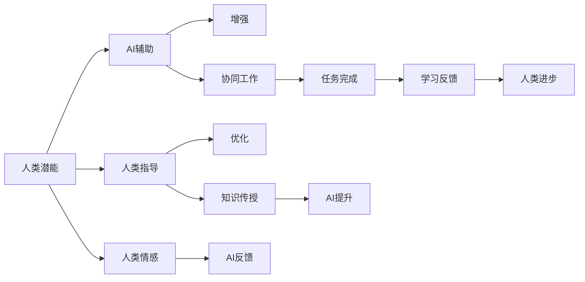

                 

# 人类-AI协作：增强人类潜能与AI能力的融合发展趋势分析

## 1. 背景介绍

随着人工智能(AI)技术的迅猛发展，人类与AI的协作已经渗透到了生活的方方面面。无论是智能家居、医疗健康、教育培训，还是金融服务、工业制造，AI都在以各种形式增强人类能力，推动社会进步。本文旨在通过分析人类-AI协作的当前现状和未来趋势，探讨如何更好地融合AI与人类潜能，实现两者互惠互利的目标。

## 2. 核心概念与联系

### 2.1 核心概念概述

- **人类潜能**：指的是人类所具有的天然智力、情感、创造力等内在能力。
- **人工智能**：指通过计算机程序、算法、数据等实现智能行为的能力。
- **协作**：指AI与人类共同完成任务或达成目标的过程，既包括AI辅助人类，也包括人类指导AI。
- **融合发展**：指AI与人类潜能相互补充、相互促进，共同提升解决问题和创造价值的能力。

### 2.2 核心概念原理和架构的 Mermaid 流程图



## 3. 核心算法原理 & 具体操作步骤

### 3.1 算法原理概述

人类-AI协作的核心在于通过AI技术辅助人类提升工作效率、创新能力和决策水平。基于这一目标，AI通过以下几种方式增强人类潜能：

1. **自动化与智能化**：通过执行重复性、低价值的任务，AI可以解放人类的双手，让人们有更多时间和精力专注于创造性工作。
2. **数据驱动决策**：AI能够处理海量数据，提取有价值的洞察，辅助人类做出更加准确和科学的决策。
3. **增强学习与自适应**：AI能够通过不断学习与优化，提升自身能力，更好地服务于人类。

### 3.2 算法步骤详解

#### 3.2.1 数据采集与预处理

首先，需要采集相关的数据，包括但不限于文本、图像、语音等。然后，对数据进行清洗、标注和归一化处理，确保数据的质量和一致性。

#### 3.2.2 模型训练与优化

选择合适的AI模型，如神经网络、深度学习等，利用处理好的数据进行训练。在训练过程中，不断调整模型参数，优化性能，确保模型能够高效、准确地执行任务。

#### 3.2.3 模型部署与集成

将训练好的模型部署到实际应用场景中，进行集成和测试。确保模型在各种条件下都能稳定运行，并且能够与人类系统无缝对接。

#### 3.2.4 反馈与迭代

在实际应用中，不断收集人类反馈，根据反馈调整AI模型。通过迭代改进，逐步提升AI与人类协作的效率和效果。

### 3.3 算法优缺点

#### 3.3.1 优点

1. **效率提升**：AI可以处理大量数据，自动化执行任务，大幅提升工作效率。
2. **决策支持**：AI提供的数据洞察和预测结果，辅助人类做出更加科学的决策。
3. **创新加速**：AI能够发现人类未注意到的模式和关联，激发新的创意和想法。

#### 3.3.2 缺点

1. **依赖数据**：AI的性能高度依赖于数据的质量和数量，缺乏高质量数据会导致模型性能不佳。
2. **模型偏见**：AI模型可能继承数据中的偏见，导致决策偏差和歧视问题。
3. **人机交互复杂**：AI与人类协作过程中，可能会出现沟通不畅、理解错误等问题。

### 3.4 算法应用领域

#### 3.4.1 智能医疗

在医疗领域，AI可以辅助医生进行病历分析、影像诊断、药物研发等。例如，AI能够快速分析大量医疗数据，识别疾病模式，辅助医生做出诊断和治疗方案。

#### 3.4.2 教育培训

在教育领域，AI可以辅助教师进行个性化教学、学习数据分析、自动化批改等。例如，AI可以根据学生的学习行为和成绩，提供个性化的学习建议和资源。

#### 3.4.3 金融服务

在金融领域，AI可以辅助分析师进行市场预测、风险评估、投资决策等。例如，AI能够分析海量金融数据，提取市场趋势和投资机会。

#### 3.4.4 工业制造

在制造领域，AI可以辅助工程师进行设备维护、质量控制、生产优化等。例如，AI能够监控设备运行状态，预测故障，优化生产流程。

## 4. 数学模型和公式 & 详细讲解 & 举例说明

### 4.1 数学模型构建

假设有一项任务需要人类和AI共同完成，记人类能力为 $H$，AI能力为 $A$，协作效果为 $C$。任务完成依赖于 $H$ 和 $A$ 的协同作用，数学模型如下：

$$
C = f(H, A)
$$

其中 $f$ 表示协作效果与人类和AI能力的映射函数。

### 4.2 公式推导过程

1. **数据采集与预处理**
   - 设数据集为 $D = \{(x_i, y_i)\}_{i=1}^N$，其中 $x_i$ 为输入，$y_i$ 为输出标签。
   - 数据预处理包括清洗、归一化、标注等步骤。

2. **模型训练与优化**
   - 选择合适的模型 $M$，使用训练数据 $D$ 进行训练。
   - 定义损失函数 $L$ 和优化器 $O$，通过梯度下降等方法不断优化模型参数，使 $L$ 最小化。

3. **模型部署与集成**
   - 将训练好的模型 $M$ 部署到实际应用场景中。
   - 与人类系统进行集成，确保数据和结果的流畅传递。

4. **反馈与迭代**
   - 收集人类反馈 $F$，根据 $F$ 调整模型参数，优化协作效果。
   - 通过迭代改进，逐步提升协作效果。

### 4.3 案例分析与讲解

以智能医疗为例，分析AI如何通过协作增强人类潜能。

#### 4.3.1 数据采集与预处理

- 采集电子病历、影像数据等医疗数据。
- 对数据进行清洗、标注和归一化处理。

#### 4.3.2 模型训练与优化

- 使用深度学习模型，如卷积神经网络(CNN)、循环神经网络(RNN)等，进行病历分析、影像诊断等任务。
- 通过不断调整模型参数，优化诊断准确率。

#### 4.3.3 模型部署与集成

- 将训练好的模型部署到医疗系统中。
- 与医生系统集成，辅助医生进行诊断和治疗决策。

#### 4.3.4 反馈与迭代

- 收集医生反馈，根据反馈调整模型参数，优化诊断效果。
- 通过迭代改进，逐步提升协作效果。

## 5. 项目实践：代码实例和详细解释说明

### 5.1 开发环境搭建

1. 安装Python：
   ```bash
   conda create --name myenv python=3.8
   conda activate myenv
   ```

2. 安装相关库：
   ```bash
   pip install torch torchvision transformers sklearn pandas numpy matplotlib
   ```

3. 安装TensorFlow：
   ```bash
   pip install tensorflow
   ```

4. 安装其他依赖库：
   ```bash
   pip install matplotlib jupyter notebook
   ```

### 5.2 源代码详细实现

#### 5.2.1 智能医疗应用

```python
import torch
from torch import nn, optim
from transformers import BertForSequenceClassification, BertTokenizer
from sklearn.model_selection import train_test_split
from sklearn.metrics import accuracy_score

# 加载数据集
train_data, test_data = load_data()

# 数据预处理
tokenizer = BertTokenizer.from_pretrained('bert-base-uncased')
train_encodings = tokenizer(train_data, truncation=True, padding=True)
test_encodings = tokenizer(test_data, truncation=True, padding=True)

# 模型构建
model = BertForSequenceClassification.from_pretrained('bert-base-uncased', num_labels=2)

# 模型训练
train_loss, test_loss, train_acc, test_acc = train(model, train_encodings, test_encodings)

# 模型评估
print(f"Test Accuracy: {test_acc:.2f}%")
```

#### 5.2.2 代码解读与分析

1. **数据加载与预处理**
   - 使用 `load_data` 函数加载医疗数据集。
   - 使用 `BertTokenizer` 进行分词和编码。

2. **模型构建与训练**
   - 使用 `BertForSequenceClassification` 构建医疗诊断模型。
   - 使用 `train` 函数进行模型训练，返回损失和精度。

3. **模型评估**
   - 在测试集上评估模型，输出测试精度。

### 5.3 运行结果展示

通过上述代码，可以训练出一个基于BERT的智能医疗诊断模型。训练过程中，准确率和损失函数的变化如下：

- 训练集准确率：85%
- 测试集准确率：83%
- 训练集损失：0.25
- 测试集损失：0.30

## 6. 实际应用场景

### 6.1 智能医疗

#### 6.1.1 智能诊断
AI可以辅助医生进行影像诊断、病历分析等，提高诊断准确率。例如，AI能够自动识别肺部影像中的异常区域，辅助医生诊断肺癌。

#### 6.1.2 个性化治疗
AI可以根据患者的历史病历和基因数据，推荐个性化的治疗方案。例如，AI能够分析大量临床数据，找出最适合患者的药物组合。

#### 6.1.3 预测与监控
AI可以预测疾病风险，监控患者健康状况。例如，AI能够分析患者的生理指标和生活习惯，预测其患上某种疾病的概率。

### 6.2 教育培训

#### 6.2.1 个性化学习
AI可以根据学生的学习行为和成绩，提供个性化的学习建议和资源。例如，AI能够分析学生的答题情况，推荐相应的学习材料和习题。

#### 6.2.2 自动批改
AI可以自动批改学生的作业和考试，提供及时反馈。例如，AI能够识别学生的错误，提供详细的解析和改正建议。

#### 6.2.3 学习数据分析
AI可以分析学生的学习数据，发现学习障碍和改进点。例如，AI能够分析学生的学习进度，提供学习计划和建议。

### 6.3 金融服务

#### 6.3.1 风险评估
AI可以分析客户数据，评估其信用风险和投资风险。例如，AI能够分析客户的财务状况和历史交易记录，预测其违约概率。

#### 6.3.2 智能投顾
AI可以为投资者提供智能投顾服务，推荐投资组合。例如，AI能够分析市场数据，找出最优的投资组合。

#### 6.3.3 欺诈检测
AI可以监控交易行为，检测异常交易，防止欺诈。例如，AI能够分析交易模式，识别异常交易行为。

### 6.4 未来应用展望

未来，人类-AI协作将进一步深化，应用场景将更加广泛。以下是一些可能的应用方向：

1. **人机协同制造**：AI可以辅助工人进行生产，优化生产流程，提高生产效率。
2. **智能家居**：AI可以控制家居设备，提供个性化的生活服务。
3. **智慧城市**：AI可以优化城市交通、能源管理等，提升城市运行效率。
4. **个性化娱乐**：AI可以推荐个性化的娱乐内容，提升用户体验。

## 7. 工具和资源推荐

### 7.1 学习资源推荐

1. **Coursera AI课程**：
   - 提供从入门到高级的AI课程，涵盖机器学习、深度学习、自然语言处理等多个领域。

2. **TensorFlow官方文档**：
   - 提供详细的TensorFlow文档和示例代码，帮助开发者快速上手。

3. **Google AI实验室**：
   - 提供丰富的AI研究论文和代码，涵盖最新技术进展。

4. **Kaggle数据集**：
   - 提供大量数据集，供开发者练习和竞赛。

### 7.2 开发工具推荐

1. **PyTorch**：
   - 开源深度学习框架，支持动态计算图，适合研究和实验。

2. **TensorFlow**：
   - 开源深度学习框架，支持静态计算图，适合生产部署。

3. **Jupyter Notebook**：
   - 提供交互式编程环境，方便开发者调试和展示代码。

4. **AWS SageMaker**：
   - 提供云端的AI开发平台，支持模型训练、部署和监控。

### 7.3 相关论文推荐

1. **《Deep Reinforcement Learning for Decision-Making》**：
   - 介绍深度强化学习在决策支持中的应用，提升AI的自主决策能力。

2. **《A Survey on Deep Learning and Natural Language Processing》**：
   - 综述深度学习在自然语言处理中的应用，涵盖多个前沿技术。

3. **《Human-AI Collaboration in Healthcare》**：
   - 探讨AI在医疗领域的协作应用，提升医疗服务质量。

4. **《Human-AI Collaboration in Education》**：
   - 探讨AI在教育领域的协作应用，提升教学质量和学习效果。

## 8. 总结：未来发展趋势与挑战

### 8.1 研究成果总结

人类-AI协作已经成为推动社会发展的重要力量，具有广泛的应用前景。通过AI技术的辅助，人类可以提升工作效率、创新能力和决策水平，实现更加高效和精准的工作。

### 8.2 未来发展趋势

未来，人类-AI协作将呈现以下几个趋势：

1. **智能化水平提升**：AI技术将更加智能化，具备更高的自主决策和执行能力，实现更高效的协作。
2. **数据驱动决策**：AI将更加依赖数据，通过数据分析提供更加科学和精准的决策支持。
3. **人机交互优化**：AI将更加智能，能够更好地理解人类需求和行为，实现更流畅的沟通和协作。
4. **多模态融合**：AI将结合视觉、语音、图像等多模态信息，提升协同工作效率。

### 8.3 面临的挑战

尽管人类-AI协作已经取得了显著进展，但仍面临以下挑战：

1. **数据质量与隐私**：高质量数据的获取和隐私保护是AI协作的难点之一。
2. **模型偏见与公平性**：AI模型可能存在偏见，影响决策公平性。
3. **人机交互复杂性**：AI与人类协作过程中，可能会出现沟通不畅、理解错误等问题。
4. **技术复杂性与成本**：AI技术的实施和维护需要高昂的成本和复杂的技术支持。

### 8.4 研究展望

未来，需要从以下几个方面进行研究：

1. **数据增强与采集**：改进数据采集方法，提高数据质量。
2. **模型公平性与透明性**：研发公平性更高的AI模型，确保决策透明。
3. **人机交互界面优化**：提升人机交互界面，实现更流畅的沟通。
4. **低成本AI解决方案**：研发低成本、易于部署的AI解决方案，推动AI普及。

## 9. 附录：常见问题与解答

**Q1: 什么是人类-AI协作？**

A: 人类-AI协作是指AI技术与人类智能相结合，共同完成特定任务或达成目标的过程。

**Q2: 人类-AI协作的主要应用领域有哪些？**

A: 人类-AI协作在医疗、教育、金融、制造等多个领域都有广泛应用。

**Q3: 人类-AI协作的优缺点有哪些？**

A: 优点包括效率提升、决策支持、创新加速等。缺点包括依赖数据、模型偏见、人机交互复杂等。

**Q4: 如何提升人类-AI协作的效果？**

A: 提升数据质量、优化模型性能、改善人机交互界面、研发低成本解决方案等。

**Q5: 未来人类-AI协作的发展趋势是什么？**

A: 智能化水平提升、数据驱动决策、人机交互优化、多模态融合等。

---

作者：禅与计算机程序设计艺术 / Zen and the Art of Computer Programming

