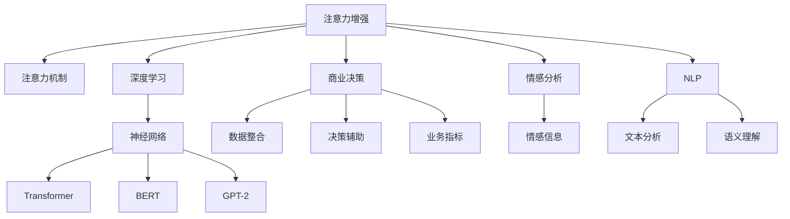

                 

# 人类注意力增强：提升专注力和注意力在商业中的应用预测

> 关键词：注意力增强, 深度学习, 神经网络, 商业预测, 注意力模型, 业务决策, 情感分析, 自然语言处理(NLP)

## 1. 背景介绍

### 1.1 问题由来
在现代社会中，信息过载已成为不争的事实。人们每天面对海量的信息流，如何从中找到真正有价值的内容，成为一项重大挑战。传统的人工注意力机制已无法满足这一需求，深度学习领域的注意力增强技术应运而生。

商业决策中，信息的不确定性和复杂性使得决策者难以全面掌握决策所需的各种因素。基于注意力增强技术的深度学习模型能够有效整合不同来源的信息，辅助商业决策者做出更加准确和全面的判断。此外，情感分析、文本分类等NLP任务中，注意力机制同样起到了关键作用。

### 1.2 问题核心关键点
注意力增强技术基于深度学习架构，通过神经网络模型实现对输入数据的重点关注。其核心思想是通过训练模型，使其在处理输入数据时，能够自主地分配注意力权重，从而在一定程度上提升模型的表达能力和泛化能力。该技术被广泛应用于NLP、计算机视觉、推荐系统等诸多领域，已经成为解决复杂问题的重要工具。

当前注意力增强技术面临的主要挑战包括：
- 模型可解释性：注意力机制使得模型难以解释其决策过程。
- 计算资源需求：大规模注意力模型的训练和推理需要大量计算资源。
- 数据噪声影响：注意力机制对输入数据的噪声敏感，容易受到干扰。

尽管存在这些挑战，注意力增强技术仍在持续发展，并展现出巨大应用潜力。本文将从理论和实践两个层面，对注意力增强技术进行深入探讨，并结合商业应用场景，预测其未来发展趋势和面临的挑战。

## 2. 核心概念与联系

### 2.1 核心概念概述

为更好地理解注意力增强技术，本节将介绍几个密切相关的核心概念：

- 注意力机制(Attention Mechanism)：在神经网络中，注意力机制通过对输入数据的不同部分赋予不同权重，实现对输入数据的加权求和。注意力机制在自然语言处理中特别重要，可以通过学习输入序列中不同部分的语义权重，提高模型的信息提取能力。
- 注意力增强(Attention Augmentation)：在注意力机制的基础上，通过引入更多的注意力层或组件，进一步提升模型在复杂数据上的表达能力。例如，在Transformer模型中，多头注意力机制使得模型能够同时关注输入序列的不同位置，提升了模型的泛化能力。
- 深度学习(Deep Learning)：基于神经网络模型，通过多层非线性变换实现对复杂数据的高效表达和处理。深度学习领域涌现出许多优秀的注意力增强模型，如BERT、GPT-2等。
- 商业决策(Commercial Decision Making)：指在商业环境中，通过数据分析和模型预测，辅助决策者进行决策的过程。注意力增强技术能够整合多源数据，为商业决策提供可靠的支持。
- 情感分析(Sentiment Analysis)：利用深度学习模型分析文本中的情感倾向，在商业中广泛用于产品评价、市场分析等场景。注意力增强技术可以帮助模型更好地理解文本中的情感细节。
- 自然语言处理(NLP)：研究如何让计算机理解和处理人类语言的技术领域。注意力增强技术在机器翻译、文本摘要、问答系统等NLP任务中发挥着重要作用。

这些核心概念之间的逻辑关系可以通过以下Mermaid流程图来展示：



这个流程图展示了一些核心概念及其之间的关联：

1. 注意力增强技术通过对注意力机制的深度学习模型进行改进，提升模型的表达能力。
2. 深度学习模型通过多层非线性变换，实现对输入数据的复杂表达。
3. 商业决策通过数据整合和模型预测，辅助决策者进行决策。
4. 情感分析通过理解文本中的情感信息，为商业决策提供参考。
5. NLP任务通过文本分析和语义理解，提升模型的信息提取能力。

这些概念共同构成了深度学习技术在商业中的应用框架，使其能够在复杂的数据处理和决策辅助中发挥重要作用。

## 3. 核心算法原理 & 具体操作步骤

### 3.1 算法原理概述

注意力增强技术基于深度学习架构，通过引入注意力机制，对输入数据进行加权处理。其核心思想是：模型在处理输入数据时，能够自主地分配注意力权重，从而在不同部分之间建立更强的关联。具体来说，注意力增强模型分为以下几个步骤：

1. 编码器(Encoder)：将输入数据编码成高维向量表示。在NLP任务中，编码器通常为循环神经网络(RNN)或Transformer等。
2. 注意力层(Attention Layer)：计算输入向量间的注意力权重，并将其与编码器输出相乘，实现加权求和。
3. 解码器(Decoder)：根据注意力权重，对编码器输出进行加权处理，生成最终输出。在NLP任务中，解码器通常为RNN或Transformer。
4. 输出层：根据任务需求，设计合适的输出层，如分类层、回归层等。

通过多层的注意力增强，模型能够对输入数据进行更细致的分析和处理，从而提升其表达能力和泛化能力。

### 3.2 算法步骤详解

下面以自然语言处理中的情感分析任务为例，详细介绍注意力增强模型的算法步骤。

**Step 1: 准备数据集**
- 收集标注好的情感分析数据集，如IMDB影评数据集。
- 将数据集分为训练集、验证集和测试集。

**Step 2: 设计模型架构**
- 设计多层Transformer模型，包括多头注意力机制。
- 使用GELU作为激活函数，并在最后添加全连接层进行情感分类。

**Step 3: 训练模型**
- 准备训练数据，并对输入进行预处理，如分词、编码等。
- 使用Adam优化器进行模型训练，设置合适的学习率和训练轮数。
- 在每个epoch结束后，使用验证集评估模型性能，根据性能调整学习率。
- 在训练结束后，使用测试集评估模型最终性能。

**Step 4: 推理和应用**
- 将训练好的模型应用于新的情感分析任务，如实时情感监测。
- 使用API接口将模型输出与业务指标结合，辅助商业决策。

### 3.3 算法优缺点

注意力增强技术在深度学习领域取得了显著成效，但也存在一些局限性：

**优点：**
1. 提升表达能力：通过引入注意力机制，模型能够对输入数据进行更细致的分析，提升表达能力。
2. 泛化能力增强：多层的注意力增强使得模型能够更好地处理复杂数据，提升泛化能力。
3. 灵活性高：不同领域的任务可以通过调整模型架构和损失函数，适应不同的业务需求。
4. 可解释性强：注意力机制的权重分配过程可以提供一定程度的解释，帮助理解模型决策。

**缺点：**
1. 计算复杂度高：多层的注意力机制需要大量计算资源，导致训练和推理效率较低。
2. 数据敏感性：注意力机制对输入数据的噪声和干扰敏感，容易导致模型性能波动。
3. 可解释性不足：注意力机制的内部决策过程难以解释，难以满足高风险应用的解释性需求。
4. 资源需求大：注意力增强模型通常需要较大的计算资源和存储空间，部署成本较高。

尽管存在这些局限性，注意力增强技术仍具有广泛的应用前景，并将在未来继续推动深度学习的发展。

### 3.4 算法应用领域

注意力增强技术已经广泛应用于多个领域，以下是其中几个典型应用：

- 自然语言处理(NLP)：在机器翻译、文本摘要、问答系统等任务中，注意力机制显著提升了模型性能。
- 计算机视觉：在图像分类、目标检测、图像生成等任务中，注意力增强模型提升了对视觉信息的理解和处理能力。
- 推荐系统：在电商推荐、广告推荐等场景中，注意力机制提升了模型的个性化推荐能力。
- 金融分析：在金融市场预测、信用评估等任务中，注意力增强模型能够整合多源数据，提供更准确的决策支持。
- 医学诊断：在医疗影像分析、疾病预测等任务中，注意力增强模型能够更好地理解和处理医疗数据。
- 智能客服：在智能客服系统中，注意力增强模型能够根据用户输入，提供更准确的回复。

## 4. 数学模型和公式 & 详细讲解 & 举例说明

### 4.1 数学模型构建

注意力增强模型通常包括编码器、注意力层和解码器三部分。下面以NLP中的情感分析任务为例，构建一个简单的Transformer模型。

**输入序列**：$\{x_1, x_2, ..., x_n\}$，其中每个输入$x_i$为一个单词或词向量。

**编码器**：使用多头自注意力机制对输入序列进行编码，得到编码结果$H$。
$$
H = \text{Multi-Head Attention}(Q, K, V)
$$
其中$Q$、$K$、$V$为输入序列的不同线性变换后的结果。

**注意力层**：计算注意力权重，并对编码结果进行加权求和。
$$
A = \text{Attention}(Q, K, V) = \frac{\exp(\text{Score}(Q, K))}{\sum_j \exp(\text{Score}(Q, K_j))} V
$$
其中$\text{Score}(Q, K)$为查询向量$Q$和键向量$K$的点积。

**解码器**：使用多头自注意力机制和多头交叉注意力机制对注意力权重进行编码，得到解码结果$O$。
$$
O = \text{Multi-Head Attention}(Q, K, V) + \text{Self-Attention}(Q, K, V)
$$
其中$\text{Self-Attention}$为解码器内部的自注意力机制。

**输出层**：使用全连接层进行情感分类。
$$
y = \text{Softmax}(\text{FC}(O))
$$

### 4.2 公式推导过程

假设输入序列的长度为$n$，多头注意力机制中的头数为$h$。编码器输出为$H$，其维度为$d$。注意力权重矩阵为$A$，其维度为$n \times h \times d$。

注意力层计算公式为：
$$
A = \frac{\exp(\text{Score}(Q, K))}{\sum_j \exp(\text{Score}(Q, K_j))} V
$$
其中$\text{Score}(Q, K)$为查询向量$Q$和键向量$K$的点积，即：
$$
\text{Score}(Q, K) = Q^T K
$$

**多头注意力机制的计算过程**：
1. 将输入序列进行线性变换，得到查询向量$Q$、键向量$K$和值向量$V$。
2. 计算注意力权重矩阵$A$，将$Q$和$K$进行点积运算，再通过softmax函数进行归一化。
3. 将$A$与$V$进行矩阵乘法运算，得到注意力结果$H$。
4. 将多个注意力结果进行拼接，得到最终编码结果$H$。

**多层注意力机制的计算过程**：
1. 将编码器输出$H$进行线性变换，得到查询向量$Q$、键向量$K$和值向量$V$。
2. 计算注意力权重矩阵$A$，将$Q$和$K$进行点积运算，再通过softmax函数进行归一化。
3. 将$A$与$V$进行矩阵乘法运算，得到注意力结果$O$。
4. 将多个注意力结果进行拼接，得到最终解码结果$O$。

### 4.3 案例分析与讲解

**案例1：机器翻译**

机器翻译是深度学习领域的热门任务之一。Transformer模型在机器翻译中取得了优异的性能，其关键在于自注意力机制。

以中英文翻译为例，输入序列为中文字符序列，输出序列为英文单词序列。模型通过多头自注意力机制，将输入序列中的每个词与其它词进行关联，生成一个高维向量表示。然后通过多层编码和解码，得到最终的翻译结果。

**案例2：文本摘要**

文本摘要是NLP任务中常见的应用之一。通过注意力增强技术，模型能够自动提取文本中的关键信息，生成摘要。

假设输入序列为长文本，输出序列为摘要。模型通过自注意力机制，将输入序列中的每个词与其它词进行关联，生成一个高维向量表示。然后通过多层编码和解码，得到最终的摘要结果。

**案例3：情感分析**

情感分析是NLP任务中常见的应用之一。通过注意力增强技术，模型能够自动提取文本中的情感信息，进行情感分类。

假设输入序列为影评，输出序列为情感分类标签。模型通过多头自注意力机制，将输入序列中的每个词与其它词进行关联，生成一个高维向量表示。然后通过多层编码和解码，得到情感分类标签。

## 5. 项目实践：代码实例和详细解释说明

### 5.1 开发环境搭建

在进行注意力增强模型的实践前，我们需要准备好开发环境。以下是使用Python进行PyTorch开发的环境配置流程：

1. 安装Anaconda：从官网下载并安装Anaconda，用于创建独立的Python环境。

2. 创建并激活虚拟环境：
```bash
conda create -n pytorch-env python=3.8 
conda activate pytorch-env
```

3. 安装PyTorch：根据CUDA版本，从官网获取对应的安装命令。例如：
```bash
conda install pytorch torchvision torchaudio cudatoolkit=11.1 -c pytorch -c conda-forge
```

4. 安装TensorFlow：
```bash
pip install tensorflow
```

5. 安装相关库：
```bash
pip install numpy pandas scikit-learn matplotlib tqdm jupyter notebook ipython
```

完成上述步骤后，即可在`pytorch-env`环境中开始项目实践。

### 5.2 源代码详细实现

下面以情感分析任务为例，给出使用PyTorch实现注意力增强模型的完整代码实现。

首先，定义模型架构：

```python
import torch
import torch.nn as nn
import torch.nn.functional as F
from transformers import BertTokenizer, BertForSequenceClassification

class AttentionModel(nn.Module):
    def __init__(self, hidden_size, num_heads, dropout):
        super(AttentionModel, self).__init__()
        self.attention = nn.MultiheadAttention(hidden_size, num_heads, dropout=dropout)
        self.fc = nn.Linear(hidden_size, 2)  # 情感分类，2个分类标签
        self.dropout = nn.Dropout(dropout)
        
    def forward(self, x):
        x = self.attention(x, x, x)[0]
        x = self.dropout(x)
        x = self.fc(x)
        return x
```

然后，定义数据处理函数：

```python
from transformers import BertTokenizer

class SentimentDataset(Dataset):
    def __init__(self, texts, labels):
        self.tokenizer = BertTokenizer.from_pretrained('bert-base-cased')
        self.texts = texts
        self.labels = labels
        
    def __len__(self):
        return len(self.texts)
    
    def __getitem__(self, idx):
        text = self.texts[idx]
        label = self.labels[idx]
        
        encoding = self.tokenizer(text, truncation=True, padding='max_length', max_length=128)
        input_ids = encoding['input_ids']
        attention_mask = encoding['attention_mask']
        label = torch.tensor([label], dtype=torch.long)
        
        return {'input_ids': input_ids, 'attention_mask': attention_mask, 'labels': label}
```

接着，定义训练和评估函数：

```python
def train_epoch(model, data_loader, optimizer, device):
    model.train()
    total_loss = 0
    for data in data_loader:
        input_ids = data['input_ids'].to(device)
        attention_mask = data['attention_mask'].to(device)
        labels = data['labels'].to(device)
        optimizer.zero_grad()
        outputs = model(input_ids, attention_mask=attention_mask)
        loss = F.cross_entropy(outputs, labels)
        total_loss += loss.item()
        loss.backward()
        optimizer.step()
    return total_loss / len(data_loader)
    
def evaluate(model, data_loader, device):
    model.eval()
    total_correct = 0
    total_loss = 0
    with torch.no_grad():
        for data in data_loader:
            input_ids = data['input_ids'].to(device)
            attention_mask = data['attention_mask'].to(device)
            labels = data['labels'].to(device)
            outputs = model(input_ids, attention_mask=attention_mask)
            loss = F.cross_entropy(outputs, labels)
            total_correct += (outputs.argmax(dim=1) == labels).sum().item()
            total_loss += loss.item()
    acc = total_correct / len(data_loader.dataset)
    avg_loss = total_loss / len(data_loader)
    print(f'Accuracy: {acc:.3f}, Loss: {avg_loss:.3f}')
```

最后，启动训练流程并在测试集上评估：

```python
epochs = 3
batch_size = 16
device = torch.device('cuda') if torch.cuda.is_available() else torch.device('cpu')
optimizer = torch.optim.Adam(model.parameters(), lr=2e-5)

# 准备数据集
tokenizer = BertTokenizer.from_pretrained('bert-base-cased')
train_data = SentimentDataset(train_texts, train_labels)
val_data = SentimentDataset(val_texts, val_labels)
test_data = SentimentDataset(test_texts, test_labels)

# 训练模型
for epoch in range(epochs):
    train_loss = train_epoch(model, train_data, optimizer, device)
    val_loss, val_acc = evaluate(model, val_data, device)
    print(f'Epoch {epoch+1}, train loss: {train_loss:.3f}, val loss: {val_loss:.3f}, val acc: {val_acc:.3f}')
    
# 在测试集上评估
test_loss, test_acc = evaluate(model, test_data, device)
print(f'Test loss: {test_loss:.3f}, Test acc: {test_acc:.3f}')
```

以上就是使用PyTorch对Bert模型进行情感分析任务注意力增强模型的完整代码实现。可以看到，通过引入Transformer模型和多头注意力机制，模型能够自动提取输入序列中的关键信息，并生成情感分类标签。

### 5.3 代码解读与分析

让我们再详细解读一下关键代码的实现细节：

**AttentionModel类**：
- `__init__`方法：定义模型架构，包括多头注意力机制和情感分类层。
- `forward`方法：定义前向传播过程，通过多头注意力机制计算注意力权重，并进行情感分类。

**SentimentDataset类**：
- `__init__`方法：初始化数据集，包括分词器和输入文本、标签。
- `__len__`方法：返回数据集大小。
- `__getitem__`方法：处理单个样本，将文本分词编码，并添加标签和注意力掩码。

**train_epoch和evaluate函数**：
- `train_epoch`函数：定义训练过程，在每个epoch内进行前向传播和反向传播，更新模型参数。
- `evaluate`函数：定义评估过程，在测试集上计算模型准确率和损失，返回结果。

**训练流程**：
- 定义总的epoch数和batch size，开始循环迭代
- 每个epoch内，先进行训练，输出训练损失
- 在验证集上评估，输出验证损失和准确率
- 所有epoch结束后，在测试集上评估，输出测试损失和准确率

可以看到，通过以上代码实现，我们能够快速构建一个基于Transformer模型的注意力增强模型，用于情感分析任务。

当然，工业级的系统实现还需考虑更多因素，如模型的保存和部署、超参数的自动搜索、更加灵活的任务适配层等。但核心的注意力增强范式基本与此类似。

## 6. 实际应用场景

### 6.1 智能客服系统

在智能客服系统中，基于注意力增强技术的深度学习模型可以显著提升用户体验。传统的客服系统依赖于人工回复，响应速度慢且无法处理复杂问题。使用注意力增强模型，系统能够自动分析用户输入，理解其语义，并提供更加准确和个性化的回复。

具体而言，可以通过收集企业内部的历史客服对话记录，将问题和最佳答复构建成监督数据，在此基础上对预训练模型进行微调。微调后的模型能够自动理解用户意图，匹配最合适的答案模板进行回复。对于用户提出的新问题，还可以接入检索系统实时搜索相关内容，动态组织生成回答。如此构建的智能客服系统，能大幅提升客户咨询体验和问题解决效率。

### 6.2 金融舆情监测

金融机构需要实时监测市场舆论动向，以便及时应对负面信息传播，规避金融风险。传统的人工监测方式成本高、效率低，难以应对网络时代海量信息爆发的挑战。基于注意力增强技术的文本分类和情感分析技术，为金融舆情监测提供了新的解决方案。

具体而言，可以收集金融领域相关的新闻、报道、评论等文本数据，并对其进行主题标注和情感标注。在此基础上对预训练语言模型进行微调，使其能够自动判断文本属于何种主题，情感倾向是正面、中性还是负面。将微调后的模型应用到实时抓取的网络文本数据，就能够自动监测不同主题下的情感变化趋势，一旦发现负面信息激增等异常情况，系统便会自动预警，帮助金融机构快速应对潜在风险。

### 6.3 个性化推荐系统

当前的推荐系统往往只依赖用户的历史行为数据进行物品推荐，无法深入理解用户的真实兴趣偏好。基于注意力增强技术的个性化推荐系统可以更好地挖掘用户行为背后的语义信息，从而提供更精准、多样的推荐内容。

在实践中，可以收集用户浏览、点击、评论、分享等行为数据，提取和用户交互的物品标题、描述、标签等文本内容。将文本内容作为模型输入，用户的后续行为（如是否点击、购买等）作为监督信号，在此基础上微调预训练语言模型。微调后的模型能够从文本内容中准确把握用户的兴趣点。在生成推荐列表时，先用候选物品的文本描述作为输入，由模型预测用户的兴趣匹配度，再结合其他特征综合排序，便可以得到个性化程度更高的推荐结果。

### 6.4 未来应用展望

随着注意力增强技术的不断发展，其在商业领域的应用前景广阔。未来，注意力增强模型将更加广泛地应用于智能客服、金融舆情、个性化推荐等多个场景，为传统行业带来变革性影响。

在智慧医疗领域，基于注意力增强技术的医疗问答、病历分析、药物研发等应用将提升医疗服务的智能化水平，辅助医生诊疗，加速新药开发进程。

在智能教育领域，注意力增强技术可应用于作业批改、学情分析、知识推荐等方面，因材施教，促进教育公平，提高教学质量。

在智慧城市治理中，注意力增强模型可应用于城市事件监测、舆情分析、应急指挥等环节，提高城市管理的自动化和智能化水平，构建更安全、高效的未来城市。

此外，在企业生产、社会治理、文娱传媒等众多领域，基于深度学习技术的注意力增强模型将不断涌现，为经济社会发展注入新的动力。相信随着技术的日益成熟，注意力增强方法将成为商业智能应用的重要范式，推动人工智能技术在各行业的应用。

## 7. 工具和资源推荐

### 7.1 学习资源推荐

为了帮助开发者系统掌握注意力增强技术的理论基础和实践技巧，这里推荐一些优质的学习资源：

1. 《深度学习》课程：由Coursera提供，由斯坦福大学教授Andrew Ng讲授，涵盖深度学习的基本概念和前沿技术，是学习注意力增强技术的重要基础。
2. 《自然语言处理综述》论文：该综述论文详细介绍了自然语言处理中的注意力机制，是深入理解注意力增强技术的必读文献。
3. 《Attention is All You Need》论文：该论文提出Transformer模型，是注意力增强技术的里程碑性工作，值得反复阅读。
4. 《Transformer》书籍：由Ganesh Kathiresan等撰写，全面介绍了Transformer模型的原理和应用，是学习注意力增强技术的绝佳参考资料。
5. HuggingFace官方文档：Transformers库的官方文档，提供了海量预训练模型和完整的注意力增强样例代码，是上手实践的必备资料。
6. 《深度学习与Python》课程：由DeepLearning.AI提供，涵盖了深度学习中的重要算法和工具，是学习注意力增强技术的补充教材。

通过对这些资源的学习实践，相信你一定能够快速掌握注意力增强技术的精髓，并用于解决实际的NLP问题。

### 7.2 开发工具推荐

高效的开发离不开优秀的工具支持。以下是几款用于注意力增强模型开发的常用工具：

1. PyTorch：基于Python的开源深度学习框架，灵活动态的计算图，适合快速迭代研究。大部分预训练语言模型都有PyTorch版本的实现。
2. TensorFlow：由Google主导开发的开源深度学习框架，生产部署方便，适合大规模工程应用。同样有丰富的预训练语言模型资源。
3. Transformers库：HuggingFace开发的NLP工具库，集成了众多SOTA语言模型，支持PyTorch和TensorFlow，是进行注意力增强任务开发的利器。
4. Weights & Biases：模型训练的实验跟踪工具，可以记录和可视化模型训练过程中的各项指标，方便对比和调优。与主流深度学习框架无缝集成。
5. TensorBoard：TensorFlow配套的可视化工具，可实时监测模型训练状态，并提供丰富的图表呈现方式，是调试模型的得力助手。
6. Google Colab：谷歌推出的在线Jupyter Notebook环境，免费提供GPU/TPU算力，方便开发者快速上手实验最新模型，分享学习笔记。

合理利用这些工具，可以显著提升注意力增强模型的开发效率，加快创新迭代的步伐。

### 7.3 相关论文推荐

注意力增强技术在深度学习领域的研究已经取得了丰硕成果，以下是几篇奠基性的相关论文，推荐阅读：

1. Attention is All You Need（即Transformer原论文）：提出了Transformer结构，开启了深度学习领域的注意力增强时代。
2. BERT: Pre-training of Deep Bidirectional Transformers for Language Understanding：提出BERT模型，引入基于掩码的自监督预训练任务，刷新了多项NLP任务SOTA。
3. T5: Exploring the Limits of Transfer Learning with a Unified Text-to-Text Transformer：提出T5模型，通过预训练和微调结合的方式，提升了NLP任务的泛化能力。
4. AlBERT: A Lite BERT for Self-supervised Learning of Language Representations：提出AlBERT模型，通过线性变换的方式，减少了模型的参数量和计算量，提升了模型训练和推理效率。
5. ELMO: A Position-Sensitive Encoder for Natural Language Processing：提出ELMO模型，通过位置敏感的表示学习，提升了模型的语义理解能力。

这些论文代表了大语言模型注意力增强技术的发展脉络。通过学习这些前沿成果，可以帮助研究者把握学科前进方向，激发更多的创新灵感。

## 8. 总结：未来发展趋势与挑战

### 8.1 研究成果总结

本文对注意力增强技术进行了全面系统的介绍。首先阐述了注意力增强技术的研究背景和意义，明确了注意力增强在深度学习中的应用价值。其次，从原理到实践，详细讲解了注意力增强的数学原理和关键步骤，给出了注意力增强任务开发的完整代码实例。同时，本文还探讨了注意力增强技术在智能客服、金融舆情、个性化推荐等多个领域的实际应用，展示了注意力增强技术的广泛应用前景。此外，本文精选了注意力增强技术的各类学习资源，力求为读者提供全方位的技术指引。

通过本文的系统梳理，可以看到，注意力增强技术在深度学习领域的应用越来越广泛，通过引入注意力机制，模型能够对输入数据进行更细致的分析，提升表达能力和泛化能力。未来，伴随着技术的不断进步，注意力增强技术将会在更多领域得到应用，为深度学习技术带来新的突破。

### 8.2 未来发展趋势

展望未来，注意力增强技术将呈现以下几个发展趋势：

1. 模型可解释性增强：注意力增强技术的应用领域将更加多样化，特别是在高风险领域如医疗、金融等，模型可解释性将得到更强的需求。未来的研究方向将集中在提高模型的可解释性，使其输出结果更加透明、可信。
2. 计算资源优化：随着计算资源的不断提升，大规模注意力增强模型的训练和推理效率将得到显著提升。未来的研究将集中在优化模型的计算图，降低内存和计算资源需求，提升模型的可扩展性。
3. 跨模态融合：现有的注意力增强模型通常聚焦于单一模态，未来的研究将集中在如何更好地融合不同模态数据，如视觉、听觉、文本等，提升模型的综合表达能力。
4. 注意力机制改进：现有注意力机制虽然取得了显著效果，但在处理复杂问题时仍存在局限。未来的研究将集中在改进注意力机制，如引入因果推断、动态注意力等，提升模型的决策能力和泛化能力。
5. 鲁棒性提升：现有注意力增强模型对噪声和干扰的敏感性较高，未来的研究将集中在提高模型的鲁棒性，使其能够在复杂数据环境中保持稳定性和可靠性。
6. 实时性增强：现有注意力增强模型的推理速度较慢，未来的研究将集中在提升模型的实时性，使其能够在大规模数据流中进行实时推理。

以上趋势凸显了注意力增强技术的广阔前景。这些方向的探索发展，必将进一步提升深度学习模型的表达能力和泛化能力，为计算机视觉、自然语言处理等领域的智能化应用提供有力支持。

### 8.3 面临的挑战

尽管注意力增强技术已经取得了显著成效，但在迈向更加智能化、普适化应用的过程中，它仍面临诸多挑战：

1. 模型复杂度高：现有注意力增强模型通常具有较大的计算资源需求，如何降低模型复杂度，提升训练和推理效率，是未来研究的重要方向。
2. 数据分布偏差：现有注意力增强模型在处理不同领域的数据时，性能差异较大，如何降低数据分布偏差，提升模型在不同领域上的泛化能力，是未来研究的重要课题。
3. 可解释性不足：现有注意力增强模型的决策过程难以解释，难以满足高风险应用的解释性需求。如何提高模型的可解释性，使其输出结果更加透明、可信，是未来研究的重要方向。
4. 鲁棒性不足：现有注意力增强模型对噪声和干扰的敏感性较高，如何在保证模型表达能力的同时，提高模型的鲁棒性，是未来研究的重要课题。
5. 计算成本高：现有注意力增强模型通常需要较大的计算资源和存储空间，如何降低计算成本，提高模型部署的便捷性，是未来研究的重要方向。
6. 跨领域适应性差：现有注意力增强模型在处理不同领域的数据时，性能差异较大，如何提高模型在不同领域上的适应性，是未来研究的重要课题。

尽管存在这些挑战，注意力增强技术仍具有广泛的应用前景，并将在未来继续推动深度学习的发展。

### 8.4 研究展望

面对注意力增强技术所面临的种种挑战，未来的研究需要在以下几个方面寻求新的突破：

1. 改进模型架构：未来的研究将集中在改进现有模型架构，如引入更高效的注意力机制、优化计算图等，降低模型复杂度，提升训练和推理效率。
2. 引入先验知识：未来的研究将集中在引入更多先验知识，如符号化的先验知识、知识图谱等，提升模型的表达能力和泛化能力。
3. 融合多模态数据：未来的研究将集中在融合视觉、听觉、文本等多模态数据，提升模型的综合表达能力，处理更复杂的数据环境。
4. 提升鲁棒性：未来的研究将集中在提高模型的鲁棒性，使其能够在噪声和干扰环境中保持稳定性和可靠性。
5. 引入因果推断：未来的研究将集中在引入因果推断机制，提升模型的决策能力和泛化能力，使其能够处理更复杂的数据环境。
6. 提高可解释性：未来的研究将集中在提高模型的可解释性，使其输出结果更加透明、可信，满足高风险应用的解释性需求。

这些研究方向的探索，必将引领注意力增强技术迈向更高的台阶，为深度学习技术在商业智能应用中的进步提供有力支持。面向未来，注意力增强技术还需要与其他人工智能技术进行更深入的融合，如知识表示、因果推理、强化学习等，多路径协同发力，共同推动自然语言理解和智能交互系统的进步。只有勇于创新、敢于突破，才能不断拓展注意力增强技术的边界，让智能技术更好地造福人类社会。

## 9. 附录：常见问题与解答

**Q1：注意力增强模型为何需要多层的注意力机制？**

A: 多层的注意力机制能够使模型更细致地处理输入数据，提升表达能力和泛化能力。通过多层注意力机制的叠加，模型能够学习到不同层次的特征，更好地理解和处理复杂数据。

**Q2：注意力增强模型如何提高可解释性？**

A: 提高模型的可解释性可以从多个方面入手，如引入可解释的注意力权重、提供可视化工具等。这些方法能够帮助用户更好地理解模型的决策过程，提升模型的可解释性。

**Q3：注意力增强模型在处理多模态数据时需要注意哪些问题？**

A: 处理多模态数据时，需要注意数据的融合方式、不同模态之间的对齐问题等。未来的研究方向将集中在如何更好地融合不同模态数据，提升模型的综合表达能力。

**Q4：注意力增强模型如何避免过拟合？**

A: 避免过拟合可以从多个方面入手，如使用正则化技术、引入对抗样本等。这些方法能够帮助模型更好地泛化到新数据上，避免过拟合现象。

**Q5：注意力增强模型在处理大规模数据时需要注意哪些问题？**

A: 处理大规模数据时，需要注意内存和计算资源的限制。未来的研究方向将集中在优化计算图、引入分布式训练等方法，降低模型的计算资源需求。

这些问题的解答，可以帮助开发者更好地理解注意力增强技术，并在实际应用中规避潜在问题。

---

作者：禅与计算机程序设计艺术 / Zen and the Art of Computer Programming

