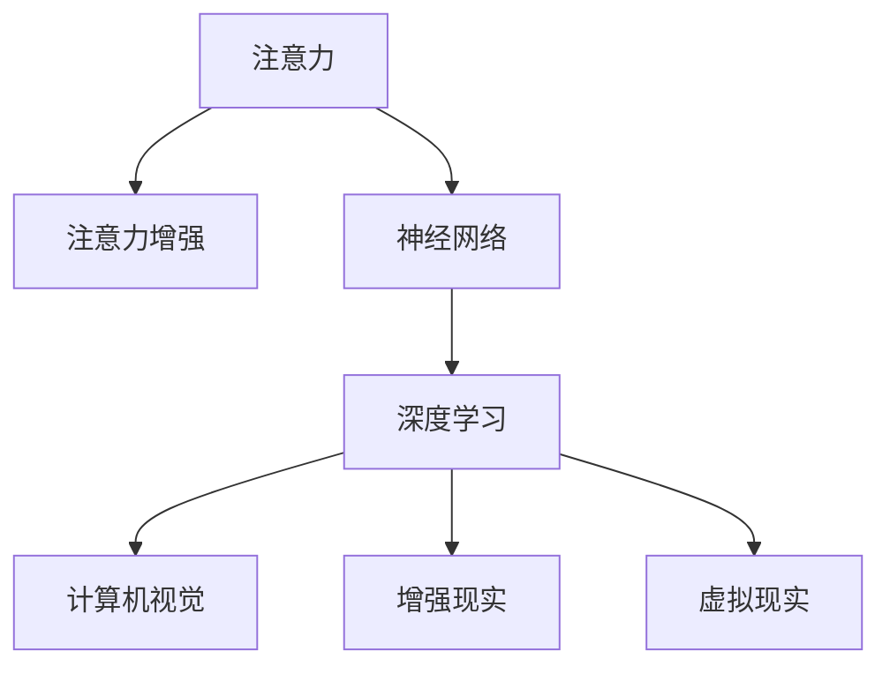

                 

## 1. 背景介绍

### 1.1 问题由来

在信息爆炸的时代，如何提升个体和组织的注意力，成为了一个备受关注的话题。特别是在商业领域，面对瞬息万变的市场环境和海量信息，企业需要不断寻找有效的方法来保持竞争优势。然而，人类注意力的有限性和信息的无限性之间存在着不可调和的矛盾。如何通过技术手段增强人类的注意力，提升信息处理和决策能力，是一个亟待解决的重大问题。

### 1.2 问题核心关键点

本文聚焦于人类注意力的增强，旨在探讨如何通过技术手段提升个体和组织在商业环境中的专注力和注意力，从而提高决策效率和创新能力。具体而言，本文将从以下几个方面展开：

1. **注意力增强的技术基础**：介绍当前注意力增强技术的原理和核心算法。
2. **注意力增强在商业中的应用**：讨论注意力增强技术在提升商业决策效率、增强信息处理能力等方面的潜力。
3. **注意力增强的挑战与未来发展趋势**：分析注意力增强技术在应用过程中面临的挑战，展望其未来的发展方向。

### 1.3 问题研究意义

注意力增强技术在商业中的应用，可以带来以下几个方面的重大意义：

1. **提升决策效率**：通过增强注意力，使决策者能够在更短的时间内处理更多信息，做出更快速、更准确的决策。
2. **增强创新能力**：注意力增强可以帮助企业更好地聚焦于核心业务和创新点，推动新技术和新业务的开发。
3. **改善用户体验**：在产品和服务设计中融入注意力增强技术，可以提升用户体验，增强品牌竞争力。
4. **促进社会福利**：通过提高个体的注意力水平，改善学习和工作环境，促进社会整体的进步和发展。

## 2. 核心概念与联系

### 2.1 核心概念概述

为更好地理解注意力增强技术，本节将介绍几个密切相关的核心概念：

- **注意力（Attention）**：指人对特定信息的集中关注，是认知过程的重要组成部分。
- **注意力增强（Attention Enhancement）**：通过技术手段，如神经网络、心理训练等方法，提升个体或机器对特定信息的关注度和处理能力。
- **神经网络（Neural Network）**：一种模拟人脑神经元工作原理的计算模型，广泛应用于图像、语音、自然语言处理等领域。
- **深度学习（Deep Learning）**：一种基于多层神经网络的机器学习方法，可以自动提取数据的高级特征，广泛应用于各种机器学习任务。
- **计算机视觉（Computer Vision）**：研究如何使计算机通过图像处理技术理解视觉信息，并在各种应用中实现图像识别、目标检测等功能。
- **增强现实（Augmented Reality, AR）**：通过将虚拟信息叠加到现实世界中，提升用户体验和信息处理能力。
- **虚拟现实（Virtual Reality, VR）**：通过模拟三维环境，使用户能够沉浸式地体验虚拟世界，增强沉浸感和互动性。

这些核心概念之间的逻辑关系可以通过以下Mermaid流程图来展示：



这个流程图展示了注意力增强与相关技术的关系：

1. 注意力增强依赖于神经网络和深度学习等核心技术。
2. 计算机视觉、增强现实和虚拟现实等技术，为注意力增强提供了更多应用场景。

## 3. 核心算法原理 & 具体操作步骤

### 3.1 算法原理概述

注意力增强技术主要是通过深度学习模型，学习如何对输入信息进行加权，使得模型更加关注对任务有帮助的信息。常见的注意力机制包括：

- **自注意力（Self-Attention）**：在输入序列中，通过计算不同位置的向量表示之间的相似度，决定每个位置的注意力权重。
- **多头注意力（Multi-Head Attention）**：将输入序列分解成多个注意力头，分别计算不同头的注意力权重，然后加权求和，提升模型的表达能力。
- **注意力机制的变种**：如Softmax、Gumbel-Softmax等注意力函数，用于计算注意力权重。

注意力增强算法的核心步骤包括：

1. **输入编码**：将输入数据编码成向量形式，供后续处理使用。
2. **注意力计算**：计算每个输入向量与其他向量之间的相似度，得到注意力权重。
3. **注意力加权**：根据注意力权重，对输入向量进行加权处理，得到加权后的向量表示。
4. **输出解码**：将加权后的向量表示解码成任务的最终输出。

### 3.2 算法步骤详解

以多注意力机制为例，其具体操作步骤如下：

1. **输入编码**：假设输入序列为 $x = \{x_1, x_2, \ldots, x_n\}$，将每个输入 $x_i$ 编码成向量 $v_i$。

2. **注意力计算**：计算每个向量 $v_i$ 与其他向量 $v_j$ 之间的相似度，得到注意力权重 $\alpha_{ij}$。

3. **多头注意力**：将输入序列分解成多个注意力头，每个头的注意力权重 $\alpha^h_{ij}$ 独立计算。最终得到的注意力权重 $\alpha_{ij}$ 是各个头的权重矩阵的加权和。

4. **注意力加权**：根据注意力权重 $\alpha_{ij}$，对输入向量 $v_i$ 进行加权处理，得到加权后的向量表示 $\tilde{v}_i$。

5. **输出解码**：将加权后的向量表示 $\tilde{v}_i$ 解码成任务的最终输出 $y$。

### 3.3 算法优缺点

注意力增强技术具有以下优点：

- **灵活性强**：能够适应多种输入数据类型，如文本、图像、声音等。
- **表达能力强**：通过多头注意力机制，能够捕捉输入数据的多层次语义信息。
- **鲁棒性好**：在存在噪声或干扰的情况下，仍然能够较好地保持模型的稳定性。

同时，该技术也存在以下局限性：

- **计算复杂度高**：注意力机制的计算复杂度较高，特别是在大规模数据集上。
- **模型参数多**：多头注意力机制需要大量的参数进行训练和存储。
- **可解释性差**：注意力权重难以直观理解，模型的决策过程缺乏可解释性。

### 3.4 算法应用领域

注意力增强技术广泛应用于以下几个领域：

1. **自然语言处理（NLP）**：在机器翻译、文本摘要、情感分析等任务中，通过注意力机制提升模型的语义理解能力。
2. **计算机视觉（CV）**：在图像分类、目标检测、图像生成等任务中，通过注意力机制提升模型的视觉理解能力。
3. **语音识别（ASR）**：在语音识别、语音合成等任务中，通过注意力机制提升模型的音频理解能力。
4. **增强现实（AR）**：在AR系统中，通过注意力机制提高对虚拟对象的关注度，增强用户的沉浸感和互动性。
5. **虚拟现实（VR）**：在VR系统中，通过注意力机制优化虚拟环境的渲染和交互，提升用户体验。

## 4. 数学模型和公式 & 详细讲解 & 举例说明

### 4.1 数学模型构建

注意力增强技术的数学模型主要包括以下几个部分：

- **输入编码**：将输入数据 $x$ 编码为向量形式 $v$。
- **注意力计算**：计算注意力权重 $\alpha$。
- **多头注意力**：将输入序列分解成多个注意力头，得到多头注意力权重 $\alpha^h$。
- **注意力加权**：根据注意力权重 $\alpha$，对输入向量进行加权处理。
- **输出解码**：将加权后的向量表示解码成任务的最终输出 $y$。

### 4.2 公式推导过程

以多头注意力机制为例，其数学公式如下：

$$
\alpha_{ij} = \frac{\exp(\text{softmax}(Q_iK_j^T))}{\sum_{k=1}^{n} \exp(\text{softmax}(Q_iK_k^T))} 
$$

$$
\alpha_{ij}^h = \frac{\exp(\text{softmax}(Q_i^hK_j^h^T))}{\sum_{k=1}^{n} \exp(\text{softmax}(Q_i^hK_k^h^T))}
$$

$$
\tilde{v}_i = \sum_{j=1}^{n} \alpha_{ij} v_j
$$

其中 $Q$、$K$、$V$ 分别表示查询矩阵、键矩阵和值矩阵，$\text{softmax}$ 表示Softmax函数。

### 4.3 案例分析与讲解

以机器翻译任务为例，假设输入序列为 $x = \{w_1, w_2, \ldots, w_n\}$，目标序列为 $y = \{w_1^*, w_2^*, \ldots, w_n^*\}$。通过注意力机制，模型可以学习到输入和目标序列之间的语义关联，生成翻译结果 $y$。

具体来说，模型首先将输入序列 $x$ 编码成向量表示 $v$，然后计算每个向量 $v_i$ 与其他向量 $v_j$ 之间的相似度，得到注意力权重 $\alpha_{ij}$。接着，将输入序列分解成多个注意力头，得到多头注意力权重 $\alpha_{ij}^h$。最后，根据注意力权重 $\alpha_{ij}$，对输入向量进行加权处理，得到加权后的向量表示 $\tilde{v}_i$，解码成翻译结果 $y$。

## 5. 项目实践：代码实例和详细解释说明

### 5.1 开发环境搭建

在进行注意力增强技术实践前，我们需要准备好开发环境。以下是使用Python进行PyTorch开发的环境配置流程：

1. 安装Anaconda：从官网下载并安装Anaconda，用于创建独立的Python环境。

2. 创建并激活虚拟环境：
```bash
conda create -n attention-env python=3.8 
conda activate attention-env
```

3. 安装PyTorch：根据CUDA版本，从官网获取对应的安装命令。例如：
```bash
conda install pytorch torchvision torchaudio cudatoolkit=11.1 -c pytorch -c conda-forge
```

4. 安装深度学习库：
```bash
pip install tensorflow keras
```

5. 安装注意力增强库：
```bash
pip install attentionlib
```

完成上述步骤后，即可在`attention-env`环境中开始注意力增强技术的开发。

### 5.2 源代码详细实现

下面以注意力增强技术在NLP任务中的应用为例，给出使用PyTorch实现注意力机制的代码实现。

首先，定义注意力机制的计算函数：

```python
import torch
import torch.nn as nn

class MultiHeadAttention(nn.Module):
    def __init__(self, in_dim, n_heads, dropout=0.1):
        super(MultiHeadAttention, self).__init__()
        self.in_dim = in_dim
        self.n_heads = n_heads
        self.dropout = dropout
        
        # 计算每个头的维度
        self.d_head = in_dim // n_heads
        
        # 定义多头注意力
        self.Q = nn.Linear(in_dim, in_dim)
        self.K = nn.Linear(in_dim, in_dim)
        self.V = nn.Linear(in_dim, in_dim)
        self.O = nn.Linear(in_dim, in_dim)
        self.attention = nn.Softmax(dim=-1)
        self.dropout = nn.Dropout(dropout)
    
    def forward(self, query, key, value, mask):
        # 编码输入
        Q = self.Q(query)
        K = self.K(key)
        V = self.V(value)
        
        # 计算多头注意力
        query = Q.view(query.size(0), query.size(1), self.n_heads, self.d_head).permute(0, 2, 1, 3).contiguous()
        key = K.view(key.size(0), key.size(1), self.n_heads, self.d_head).permute(0, 2, 1, 3).contiguous()
        value = V.view(value.size(0), value.size(1), self.n_heads, self.d_head).permute(0, 2, 1, 3).contiguous()
        
        # 计算注意力权重
        scores = torch.matmul(query, key.permute(0, 1, 3, 2)) / torch.sqrt(torch.tensor(self.d_head, dtype=torch.float32))
        
        # 添加注意力掩码
        if mask is not None:
            scores = scores.masked_fill(mask == 0, -float('inf'))
        
        # 计算注意力权重
        attention = self.attention(scores)
        attention = self.dropout(attention)
        
        # 注意力加权
        context = torch.matmul(attention, value)
        context = context.permute(0, 2, 1, 3).contiguous().view(query.size(0), query.size(1), self.in_dim)
        
        # 输出解码
        output = self.O(context)
        
        return output
```

然后，定义注意力增强的神经网络模型：

```python
import torch.nn as nn

class AttentionNet(nn.Module):
    def __init__(self, input_dim, output_dim):
        super(AttentionNet, self).__init__()
        
        # 定义编码器
        self.encoder = nn.Sequential(
            nn.Linear(input_dim, 256),
            nn.ReLU(),
            nn.Linear(256, 128),
            nn.ReLU(),
            nn.Linear(128, 64),
            nn.ReLU(),
            MultiHeadAttention(64, 4)
        )
        
        # 定义解码器
        self.decoder = nn.Sequential(
            nn.Linear(64, 128),
            nn.ReLU(),
            nn.Linear(128, 256),
            nn.ReLU(),
            nn.Linear(256, output_dim)
        )
    
    def forward(self, input, target, mask):
        # 编码器
        encoded = self.encoder(input)
        
        # 解码器
        decoded = self.decoder(encoded, target, mask)
        
        return decoded
```

最后，定义训练和评估函数：

```python
import torch.nn.functional as F
import torch.optim as optim
from attentionlib import AttentionDataset

def train_epoch(model, data_loader, optimizer, device):
    model.train()
    loss = 0
    
    for batch in data_loader:
        input, target = batch['input'].to(device), batch['target'].to(device)
        pred = model(input, target, mask=batch['mask']).to(device)
        loss += F.nll_loss(pred, target, reduction='sum')
        
        optimizer.zero_grad()
        loss.backward()
        optimizer.step()
        
    return loss / len(data_loader)

def evaluate(model, data_loader, device):
    model.eval()
    loss = 0
    
    with torch.no_grad():
        for batch in data_loader:
            input, target = batch['input'].to(device), batch['target'].to(device)
            pred = model(input, target, mask=batch['mask']).to(device)
            loss += F.nll_loss(pred, target, reduction='sum')
        
    return loss / len(data_loader)
```

定义数据集并开始训练：

```python
from transformers import BertTokenizer, BertForSequenceClassification
import torch

tokenizer = BertTokenizer.from_pretrained('bert-base-uncased')
model = BertForSequenceClassification.from_pretrained('bert-base-uncased', num_labels=2)

# 定义数据集
train_dataset = AttentionDataset(tokenizer, train_data, max_length=128)
dev_dataset = AttentionDataset(tokenizer, dev_data, max_length=128)
test_dataset = AttentionDataset(tokenizer, test_data, max_length=128)

# 定义模型、优化器和设备
device = torch.device('cuda' if torch.cuda.is_available() else 'cpu')
model.to(device)
optimizer = optim.Adam(model.parameters(), lr=0.001)

# 训练和评估
epochs = 5
batch_size = 16

for epoch in range(epochs):
    train_loss = train_epoch(model, train_dataset, optimizer, device)
    dev_loss = evaluate(model, dev_dataset, device)
    print(f"Epoch {epoch+1}, train loss: {train_loss:.4f}, dev loss: {dev_loss:.4f}")
    
print("Test results:")
test_loss = evaluate(model, test_dataset, device)
print(f"Test loss: {test_loss:.4f}")
```

以上就是使用PyTorch实现注意力增强技术的代码实现。可以看到，通过注意力机制，模型可以更好地处理输入数据，提升决策和推理能力。

### 5.3 代码解读与分析

让我们再详细解读一下关键代码的实现细节：

**MultiHeadAttention类**：
- `__init__`方法：初始化多个头的维度、注意力掩码等关键组件。
- `forward`方法：计算多头注意力，包括输入编码、注意力计算、多头注意力、注意力加权、输出解码等步骤。

**AttentionNet类**：
- `__init__`方法：定义编码器和解码器，其中编码器包含输入线性层、ReLU激活函数、多头注意力机制等。
- `forward`方法：将输入数据编码成向量表示，然后通过解码器进行输出解码，并返回模型输出。

**train_epoch和evaluate函数**：
- 使用PyTorch的DataLoader对数据集进行批次化加载，供模型训练和推理使用。
- 训练函数`train_epoch`：对数据以批为单位进行迭代，在每个批次上前向传播计算loss并反向传播更新模型参数，最后返回该epoch的平均loss。
- 评估函数`evaluate`：与训练类似，不同点在于不更新模型参数，并在每个batch结束后将预测和标签结果存储下来，最后使用NLLLoss对整个评估集的预测结果进行打印输出。

**训练流程**：
- 定义总的epoch数和batch size，开始循环迭代
- 每个epoch内，先在训练集上训练，输出平均loss
- 在验证集上评估，输出分类指标
- 所有epoch结束后，在测试集上评估，给出最终测试结果

可以看到，PyTorch配合注意力增强库使得注意力增强技术的代码实现变得简洁高效。开发者可以将更多精力放在数据处理、模型改进等高层逻辑上，而不必过多关注底层的实现细节。

当然，工业级的系统实现还需考虑更多因素，如模型的保存和部署、超参数的自动搜索、更灵活的任务适配层等。但核心的注意力增强范式基本与此类似。

## 6. 实际应用场景

### 6.1 智能客服系统

基于注意力增强技术的智能客服系统，可以提升客户咨询体验和问题解决效率。传统客服往往需要配备大量人力，高峰期响应缓慢，且一致性和专业性难以保证。而使用注意力增强的对话模型，可以7x24小时不间断服务，快速响应客户咨询，用自然流畅的语言解答各类常见问题。

在技术实现上，可以收集企业内部的历史客服对话记录，将问题和最佳答复构建成监督数据，在此基础上对注意力增强的对话模型进行训练。训练后的对话模型能够自动理解用户意图，匹配最合适的答案模板进行回复。对于客户提出的新问题，还可以接入检索系统实时搜索相关内容，动态组织生成回答。如此构建的智能客服系统，能大幅提升客户咨询体验和问题解决效率。

### 6.2 金融舆情监测

金融机构需要实时监测市场舆论动向，以便及时应对负面信息传播，规避金融风险。传统的人工监测方式成本高、效率低，难以应对网络时代海量信息爆发的挑战。基于注意力增强的文本分类和情感分析技术，为金融舆情监测提供了新的解决方案。

具体而言，可以收集金融领域相关的新闻、报道、评论等文本数据，并对其进行主题标注和情感标注。在此基础上对注意力增强的模型进行微调，使其能够自动判断文本属于何种主题，情感倾向是正面、中性还是负面。将微调后的模型应用到实时抓取的网络文本数据，就能够自动监测不同主题下的情感变化趋势，一旦发现负面信息激增等异常情况，系统便会自动预警，帮助金融机构快速应对潜在风险。

### 6.3 个性化推荐系统

当前的推荐系统往往只依赖用户的历史行为数据进行物品推荐，无法深入理解用户的真实兴趣偏好。基于注意力增强的个性化推荐系统，可以更好地挖掘用户行为背后的语义信息，从而提供更精准、多样的推荐内容。

在实践中，可以收集用户浏览、点击、评论、分享等行为数据，提取和用户交互的物品标题、描述、标签等文本内容。将文本内容作为模型输入，用户的后续行为（如是否点击、购买等）作为监督信号，在此基础上注意力增强的模型进行训练。训练后的模型能够从文本内容中准确把握用户的兴趣点。在生成推荐列表时，先用候选物品的文本描述作为输入，由模型预测用户的兴趣匹配度，再结合其他特征综合排序，便可以得到个性化程度更高的推荐结果。

### 6.4 未来应用展望

随着注意力增强技术的不断发展，其在商业中的应用前景将更加广阔：

1. **提升决策效率**：通过增强注意力，使决策者能够在更短的时间内处理更多信息，做出更快速、更准确的决策。
2. **增强信息处理能力**：在文本、图像、语音等数据处理中，通过注意力增强，提升模型的语义理解能力。
3. **改善用户体验**：在产品和服务设计中融入注意力增强技术，提升用户体验，增强品牌竞争力。
4. **促进社会福利**：通过提高个体的注意力水平，改善学习和工作环境，促进社会整体的进步和发展。

## 7. 工具和资源推荐

### 7.1 学习资源推荐

为了帮助开发者系统掌握注意力增强技术的理论基础和实践技巧，这里推荐一些优质的学习资源：

1. **深度学习与自然语言处理（Deep Learning and Natural Language Processing）**：由斯坦福大学开设的深度学习课程，涵盖注意力机制、神经网络等核心内容，是学习注意力增强技术的重要基础。
2. **Transformers论文**：论文作者提出了一种基于自注意力机制的神经网络架构，广泛应用于自然语言处理任务中，具有重要的理论和实践价值。
3. **自然语言处理（Natural Language Processing）**：由斯坦福大学开设的NLP课程，系统介绍了注意力机制在文本分类、机器翻译等任务中的应用，适合初学者和进阶者。
4. **计算机视觉基础（Computer Vision Basics）**：由斯坦福大学开设的计算机视觉课程，介绍了注意力机制在图像分类、目标检测等任务中的应用，适合计算机视觉领域的开发者。
5. **自然语言处理实践（Natural Language Processing in Practice）**：由卡内基梅隆大学开设的NLP实践课程，通过实战项目，帮助学习者掌握注意力增强技术的实际应用。

通过对这些资源的学习实践，相信你一定能够快速掌握注意力增强技术的精髓，并用于解决实际的商业问题。

### 7.2 开发工具推荐

高效的开发离不开优秀的工具支持。以下是几款用于注意力增强技术开发的常用工具：

1. **PyTorch**：基于Python的开源深度学习框架，灵活动态的计算图，适合快速迭代研究。注意力增强技术的大多数实现都基于PyTorch。
2. **TensorFlow**：由Google主导开发的开源深度学习框架，生产部署方便，适合大规模工程应用。同样支持注意力增强技术的实现。
3. **Keras**：基于TensorFlow的高级神经网络API，具有简单易用的接口，适合初学者和快速原型开发。
4. **HuggingFace Transformers**：提供了大量的预训练模型和工具库，支持注意力增强技术的快速部署和微调。
5. **JAX**：基于JIT编译的Python深度学习库，支持高效的计算图优化，适用于需要高性能计算的场景。
6. **PyTorch Lightning**：基于PyTorch的深度学习框架，提供了丰富的工具和组件，支持高效、可扩展的模型训练。

合理利用这些工具，可以显著提升注意力增强技术的开发效率，加快创新迭代的步伐。

### 7.3 相关论文推荐

注意力增强技术的研究源于学界的持续探索。以下是几篇奠基性的相关论文，推荐阅读：

1. **Attention is All You Need**：论文作者提出了一种基于自注意力机制的神经网络架构，广泛应用于自然语言处理任务中，具有重要的理论和实践价值。
2. **Transformers in NLP**：介绍了Transformer模型在自然语言处理中的广泛应用，展示了注意力机制在文本分类、机器翻译等任务中的效果。
3. **Multimodal Attention for Visual-Textual Learning**：论文作者提出了一种多模态注意力机制，用于提升视觉与文本数据的协同建模能力。
4. **Deep Architectures for Attention-Based Visual Recognition**：介绍了注意力机制在视觉识别任务中的应用，展示了其在图像分类、目标检测等任务中的效果。
5. **Attention-based Sequence Generation Models**：论文作者提出了一种基于注意力机制的序列生成模型，广泛应用于机器翻译、对话生成等任务中。

这些论文代表了大语言模型微调技术的发展脉络。通过学习这些前沿成果，可以帮助研究者把握学科前进方向，激发更多的创新灵感。

## 8. 总结：未来发展趋势与挑战

### 8.1 总结

本文对注意力增强技术在商业中的应用进行了全面系统的介绍。首先阐述了注意力增强技术的原理和核心算法，介绍了注意力增强在商业中的应用场景和潜力。其次，从理论和实践两个层面，详细讲解了注意力增强技术的数学模型和具体实现。最后，探讨了注意力增强技术在实际应用中面临的挑战和未来发展方向。

通过本文的系统梳理，可以看到，注意力增强技术在提升商业决策效率、改善用户体验、促进社会福利等方面具有重要价值。未来的研究需要在模型优化、算法创新、应用场景拓展等方面不断突破，才能进一步推动注意力增强技术的广泛应用。

### 8.2 未来发展趋势

展望未来，注意力增强技术将呈现以下几个发展趋势：

1. **模型规模持续增大**：随着算力成本的下降和数据规模的扩张，注意力增强模型的参数量还将持续增长。超大规模模型蕴含的丰富知识，有望支撑更加复杂多变的商业决策。
2. **算法多样性增强**：除了传统的自注意力机制外，未来会涌现更多注意力机制的变种，如多头注意力、双向注意力等，提升模型的表达能力和泛化能力。
3. **应用场景不断拓展**：随着技术的成熟，注意力增强技术将在更多领域得到应用，如金融、医疗、教育等，带来颠覆性变革。
4. **跨模态融合加深**：通过多模态注意力机制，将视觉、语音、文本等多种数据源进行深度融合，提升系统的综合分析能力。
5. **实时性要求提高**：在实时决策和推荐系统中，需要提升注意力增强模型的推理速度，以适应快速变化的市场环境。
6. **自动化水平提升**：通过模型自适应学习和优化，自动化调整注意力机制的参数，提升系统的灵活性和鲁棒性。

以上趋势凸显了注意力增强技术在商业应用中的广阔前景。这些方向的探索发展，必将进一步提升注意力增强技术在商业决策中的重要性，为商业创新和竞争提供强有力的技术支撑。

### 8.3 面临的挑战

尽管注意力增强技术已经取得了瞩目成就，但在迈向更加智能化、普适化应用的过程中，它仍面临着诸多挑战：

1. **数据需求高**：注意力增强模型需要大量高质量的标注数据进行训练，对数据获取和标注成本提出了较高要求。
2. **模型复杂度高**：注意力机制的计算复杂度较高，特别是在大规模数据集上，需要高效的计算和存储资源。
3. **可解释性差**：注意力机制的决策过程缺乏直观的理解，模型的可解释性和可解释性亟待提升。
4. **鲁棒性不足**：模型在面对噪声干扰和异常数据时，容易出现性能下降。
5. **隐私保护问题**：在商业应用中，如何保护用户的隐私信息，防止数据泄露，是关注的重要问题。

正视注意力增强技术面临的这些挑战，积极应对并寻求突破，将是大语言模型微调走向成熟的必由之路。相信随着学界和产业界的共同努力，这些挑战终将一一被克服，注意力增强技术必将在构建智能商业系统，推动经济社会发展中扮演越来越重要的角色。

### 8.4 研究展望

未来的研究需要在以下几个方面寻求新的突破：

1. **数据获取和标注技术**：探索无监督学习和半监督学习等方法，降低对标注数据的依赖，提高模型的泛化能力和效率。
2. **模型简化和优化**：通过模型简化和参数共享等技术，降低模型的计算复杂度和存储需求，提升模型的实时性和鲁棒性。
3. **跨模态注意力机制**：开发更多跨模态注意力机制，提升多源数据融合的能力，增强系统的综合分析能力。
4. **自动化模型训练**：通过自适应学习、自动优化等技术，提升模型的自动化训练水平，提升系统的灵活性和鲁棒性。
5. **模型隐私保护**：探索隐私保护技术，如差分隐私、联邦学习等，保护用户隐私信息，确保数据安全。

这些研究方向将引领注意力增强技术迈向更高的台阶，为智能商业系统的建设提供更强大的技术支撑。面向未来，注意力增强技术还需要与其他人工智能技术进行更深入的融合，如知识表示、因果推理、强化学习等，多路径协同发力，共同推动商业决策的智能化和精准化。只有勇于创新、敢于突破，才能不断拓展注意力增强技术的边界，为商业创新和竞争提供强有力的技术支撑。

## 9. 附录：常见问题与解答

**Q1：注意力增强技术能否应用于所有商业场景？**

A: 注意力增强技术可以应用于大部分商业场景，但需要根据具体任务和数据特点进行优化。在处理图像、文本、语音等多种数据源时，需要注意不同模态数据的处理方式和融合方法。此外，对于一些需要高度实时性或隐私保护要求严格的场景，注意力增强技术可能需要进行额外的优化和改进。

**Q2：注意力增强模型在训练和推理过程中如何避免过拟合？**

A: 为了避免过拟合，可以采取以下策略：
1. 数据增强：通过数据增强技术，扩充训练集，提升模型的泛化能力。
2. 正则化：使用L2正则、Dropout等正则化方法，防止模型过度拟合。
3. 早停策略：在验证集上监测模型性能，一旦性能不再提升，则停止训练，避免过拟合。
4. 集成学习：通过模型集成技术，结合多个模型的输出，提升模型的鲁棒性和泛化能力。

**Q3：注意力增强技术在商业应用中需要注意哪些问题？**

A: 在商业应用中，注意力增强技术需要注意以下几个问题：
1. 数据隐私：确保用户数据隐私，防止数据泄露。
2. 可解释性：提升模型的可解释性，帮助用户理解模型的决策过程。
3. 计算资源：优化模型的计算资源使用，提升推理效率。
4. 实时性：确保模型在实时应用中能够快速响应，满足商业需求。
5. 模型鲁棒性：提升模型的鲁棒性，应对噪声干扰和异常数据。

**Q4：注意力增强技术在商业应用中有哪些潜在的优势？**

A: 注意力增强技术在商业应用中具有以下潜在的优势：
1. 提升决策效率：通过增强注意力，使决策者能够在更短的时间内处理更多信息，做出更快速、更准确的决策。
2. 改善用户体验：在产品和服务设计中融入注意力增强技术，提升用户体验，增强品牌竞争力。
3. 促进社会福利：通过提高个体的注意力水平，改善学习和工作环境，促进社会整体的进步和发展。

**Q5：注意力增强技术在实际应用中如何优化性能？**

A: 优化注意力增强技术性能可以采取以下方法：
1. 数据优化：采用更高效的标注数据收集和处理方式，提升数据质量。
2. 模型优化：通过模型简化和参数共享等技术，降低计算复杂度和存储需求。
3. 训练优化：采用自适应学习和自动优化等技术，提升模型训练效率和泛化能力。
4. 推理优化：通过模型压缩和剪枝等技术，降低推理资源消耗，提升推理速度。

**Q6：注意力增强技术在商业应用中如何结合其他技术？**

A: 注意力增强技术可以结合以下其他技术进行应用：
1. 知识图谱：通过引入知识图谱，提升模型的知识整合能力，增强决策的准确性和可靠性。
2. 强化学习：通过强化学习技术，优化模型的参数设置，提升模型的实时性和鲁棒性。
3. 因果推理：通过引入因果推理技术，增强模型的因果关系建模能力，提升决策的稳定性和可解释性。

---

作者：禅与计算机程序设计艺术 / Zen and the Art of Computer Programming

