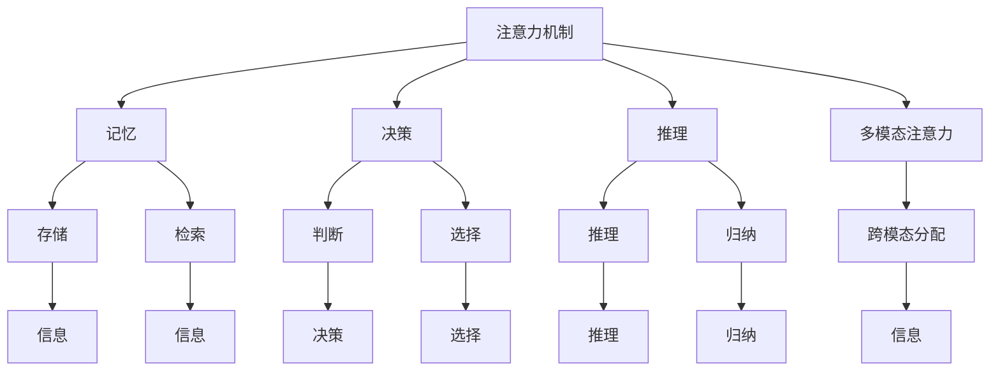

                 

## 1. 背景介绍

### 1.1 问题由来

在当今信息爆炸的时代，人们面临着海量的信息和知识，如何在如此复杂和丰富的信息流中高效筛选出有用的信息，成为许多人关注的焦点。在人工智能领域，特别是在自然语言处理（NLP）和计算机视觉（CV）中，如何将人类的注意力机制引入到算法中，以便更好地理解语义和视觉信息，是一个极具挑战性的课题。

注意力机制（Attention Mechanism）最初是由深度学习中的序列模型（如RNN和Transformer）中提出的，用于解决长序列输入问题，如机器翻译、文本摘要等。随着研究的深入，注意力机制已经广泛应用于图像识别、视频分析、推荐系统等多个领域，展示了其在处理复杂多模态数据方面的强大能力。

然而，现有注意力机制主要关注任务层面的注意力分配，如对于词与词之间的关系、对于图像中的关键区域等。但这些机制忽略了人类认知中注意力作用的机制，即注意力是一种高级认知功能，涉及记忆、决策、推理等多个方面，如何通过算法模拟人类注意力机制的灵活性和复杂性，是一个亟待解决的问题。

### 1.2 问题核心关键点

在人工智能中引入人类注意力机制，主要关注以下几个关键点：
- 人类注意力的基本原理：记忆、决策、推理等，如何通过算法模拟这些基本功能。
- 注意力机制在多模态数据上的应用：如何将注意力机制应用到图像、视频、文本等不同模态的数据中，并实现跨模态的注意力分配。
- 注意力机制的训练和优化：如何训练注意力机制，使其能够在多变的环境下高效地适应新任务，提升创新能力和创造力。

## 2. 核心概念与联系

### 2.1 核心概念概述

为更好地理解人类注意力增强的原理和算法，本节将介绍几个密切相关的核心概念：

- **注意力机制（Attention Mechanism）**：一种模拟人脑注意力的深度学习机制，用于处理复杂多模态数据，如自然语言处理中的词向量注意力、计算机视觉中的图像区域注意力等。

- **记忆（Memory）**：在人类注意力中，记忆是注意力调节的关键因素，用于存储和检索信息。神经网络中的记忆单元（如LSTM中的LSTM Cell）模拟了这一过程。

- **决策（Decision）**：决策是指基于记忆和感知信息做出判断和选择的过程。深度学习中的决策层（如分类器）模拟了这一功能。

- **推理（Reasoning）**：推理是利用已有知识进行推理和归纳的过程。深度学习中的神经模块（如Attention-based Reasoning Module）模拟了这一功能。

- **多模态注意力（Multi-modal Attention）**：多模态注意力是指在处理多模态数据时，注意力机制能够跨模态分配，识别并整合不同模态的关键信息。

- **可解释性（Explainability）**：可解释性是指算法能够提供对其决策过程的解释，帮助理解其内在的逻辑和推理机制。

这些核心概念之间的逻辑关系可以通过以下Mermaid流程图来展示：



这个流程图展示了一个典型的基于注意力机制的认知过程，从信息获取到记忆存储，再到决策和推理，多模态注意力在其中扮演了关键角色。

## 3. 核心算法原理 & 具体操作步骤

### 3.1 算法原理概述

人类注意力的增强，可以通过以下步骤实现：

1. **数据预处理**：将多模态数据转换为深度学习模型能够处理的格式，如文本转换为词向量、图像转换为特征向量等。
2. **注意力模型训练**：使用监督学习或无监督学习训练注意力模型，使其能够识别关键信息。
3. **模型融合**：将注意力模型与其他深度学习模型（如CNN、RNN、Transformer等）进行融合，构建多模态注意力模型。
4. **模型优化和部署**：使用优化算法（如梯度下降）优化模型，并在实际应用中不断调整和优化，以适应不同的任务需求。

### 3.2 算法步骤详解

以下详细介绍人类注意力增强的详细步骤：

**Step 1: 数据预处理**

- **文本数据预处理**：将原始文本数据转换为词向量。常用的方法是使用预训练的词向量模型（如Word2Vec、GloVe等），或使用Transformer模型中的词嵌入层。
- **图像数据预处理**：将图像数据转换为特征向量。常用的方法是使用卷积神经网络（CNN）提取图像特征，或使用ResNet等预训练模型。
- **视频数据预处理**：将视频数据转换为时序特征向量。常用的方法是使用3D卷积神经网络（3D-CNN）或基于LSTM的序列模型。

**Step 2: 注意力模型训练**

- **选择注意力模型**：根据任务需求选择合适的注意力模型。如序列模型中的Transformer、CNN-RNN融合模型、多模态注意力模型等。
- **设计损失函数**：设计针对特定任务的损失函数，如分类任务中的交叉熵损失、回归任务中的均方误差损失等。
- **训练注意力模型**：使用监督学习或无监督学习训练注意力模型，优化模型参数以最小化损失函数。
- **正则化技术**：使用L2正则、Dropout等正则化技术，防止过拟合。

**Step 3: 模型融合**

- **多模态数据融合**：将不同模态的数据进行融合，形成统一的输入向量。
- **注意力机制融合**：将注意力机制与其他深度学习模型进行融合，构建多模态注意力模型。
- **模型架构设计**：设计多模态注意力模型的架构，如Transformer中的多头注意力机制、LSTM中的双向注意力机制等。

**Step 4: 模型优化和部署**

- **模型优化**：使用优化算法（如Adam、SGD等）优化多模态注意力模型，提高模型的泛化能力和性能。
- **模型验证和测试**：在验证集和测试集上验证模型的性能，调整模型参数以获得最佳效果。
- **模型部署**：将优化后的模型部署到实际应用中，提供API接口或直接嵌入到应用程序中。

### 3.3 算法优缺点

人类注意力增强的算法具有以下优点：
- **提高模型泛化能力**：通过引入多模态注意力机制，模型能够更好地处理复杂多模态数据，提升模型的泛化能力和性能。
- **增强模型可解释性**：通过多模态注意力机制，模型能够提供对其决策过程的解释，帮助理解其内在的逻辑和推理机制。
- **提高创新能力和创造力**：通过模拟人类注意力的机制，模型能够更好地理解和整合多模态信息，提升创新能力和创造力。

同时，该算法也存在一些缺点：
- **计算复杂度高**：多模态注意力机制的计算复杂度较高，需要大量计算资源。
- **数据需求高**：多模态注意力模型需要大量的标注数据进行训练，数据获取成本高。
- **模型复杂度高**：多模态注意力模型的结构复杂，难以调试和优化。
- **可解释性不足**：多模态注意力机制的决策过程复杂，难以提供完整的解释。

尽管存在这些缺点，但就目前而言，基于多模态注意力机制的算法仍是最具前景的解决方案之一。未来相关研究的重点在于如何进一步降低计算复杂度，提高数据利用效率，增强模型可解释性，以适应更多的应用场景。

### 3.4 算法应用领域

人类注意力增强的算法在以下几个领域有着广泛的应用：

- **自然语言处理（NLP）**：用于文本分类、文本生成、机器翻译、情感分析等任务。
- **计算机视觉（CV）**：用于图像分类、物体检测、图像生成、图像摘要等任务。
- **推荐系统**：用于用户行为分析、商品推荐、广告投放等任务。
- **医疗诊断**：用于医学图像分析、病历分析、药物推荐等任务。
- **智能交互**：用于智能助手、聊天机器人、智能客服等任务。

这些应用领域展示了人类注意力增强的算法在多个领域的重要性和广泛性，推动了人工智能技术的产业化进程。

## 4. 数学模型和公式 & 详细讲解 & 举例说明

### 4.1 数学模型构建

在本节中，我们将详细讨论多模态注意力机制的数学模型构建。

记输入向量为 $X$，输出向量为 $Y$，其中 $X$ 包含多个模态的数据。设注意力矩阵为 $A$，用于表示每个模态对其他模态的注意力分配。注意力机制的输出可以表示为：

$$
Y = \text{Attention}(X; A)
$$

其中 $\text{Attention}$ 表示注意力机制的计算过程。

### 4.2 公式推导过程

以下以多模态注意力机制为例，推导其数学模型和公式。

设输入向量 $X$ 包含两个模态 $X_1$ 和 $X_2$，输出向量 $Y$ 包含两个模态 $Y_1$ 和 $Y_2$。定义注意力矩阵 $A$ 为：

$$
A = \begin{bmatrix}
A_{11} & A_{12} \\
A_{21} & A_{22}
\end{bmatrix}
$$

其中 $A_{11}$ 表示 $X_1$ 对 $X_1$ 的注意力分配，$A_{12}$ 表示 $X_1$ 对 $X_2$ 的注意力分配，$A_{21}$ 表示 $X_2$ 对 $X_1$ 的注意力分配，$A_{22}$ 表示 $X_2$ 对 $X_2$ 的注意力分配。

多模态注意力机制的计算过程可以表示为：

$$
Y_1 = A_{11}X_1 + A_{12}X_2
$$
$$
Y_2 = A_{21}X_1 + A_{22}X_2
$$

其中 $A_{11}$、$A_{12}$、$A_{21}$ 和 $A_{22}$ 均为注意力矩阵的元素。

### 4.3 案例分析与讲解

以下以一个简单的图像分类任务为例，讲解多模态注意力机制的应用。

假设输入为一张图像 $X$，其中包含两个模态：图像特征 $X_1$ 和标签信息 $X_2$。定义注意力矩阵 $A$ 为：

$$
A = \begin{bmatrix}
0.8 & 0.2 \\
0.3 & 0.7
\end{bmatrix}
$$

其中 $A_{11}=0.8$ 表示图像特征对自身的注意力分配，$A_{12}=0.2$ 表示图像特征对标签信息的注意力分配，$A_{21}=0.3$ 表示标签信息对图像特征的注意力分配，$A_{22}=0.7$ 表示标签信息对自身的注意力分配。

将注意力矩阵 $A$ 代入多模态注意力机制的计算公式，得到输出向量 $Y$ 的计算结果为：

$$
Y_1 = 0.8X_1 + 0.2X_2
$$
$$
Y_2 = 0.3X_1 + 0.7X_2
$$

通过多模态注意力机制，模型能够根据输入数据的不同模态，动态调整注意力分配，从而更好地理解图像信息，提高分类准确率。

## 5. 项目实践：代码实例和详细解释说明

### 5.1 开发环境搭建

在进行多模态注意力机制的实践前，我们需要准备好开发环境。以下是使用Python进行PyTorch开发的环境配置流程：

1. 安装Anaconda：从官网下载并安装Anaconda，用于创建独立的Python环境。

2. 创建并激活虚拟环境：
```bash
conda create -n pytorch-env python=3.8 
conda activate pytorch-env
```

3. 安装PyTorch：根据CUDA版本，从官网获取对应的安装命令。例如：
```bash
conda install pytorch torchvision torchaudio cudatoolkit=11.1 -c pytorch -c conda-forge
```

4. 安装Transformers库：
```bash
pip install transformers
```

5. 安装各类工具包：
```bash
pip install numpy pandas scikit-learn matplotlib tqdm jupyter notebook ipython
```

完成上述步骤后，即可在`pytorch-env`环境中开始多模态注意力机制的实践。

### 5.2 源代码详细实现

下面我们以图像分类任务为例，给出使用Transformers库进行多模态注意力机制的PyTorch代码实现。

首先，定义多模态注意力机制的数学模型：

```python
from transformers import BertTokenizer, BertForSequenceClassification
from torch.utils.data import Dataset
import torch

class ImageTextDataset(Dataset):
    def __init__(self, images, texts, labels, tokenizer, max_len=128):
        self.images = images
        self.texts = texts
        self.labels = labels
        self.tokenizer = tokenizer
        self.max_len = max_len
        
    def __len__(self):
        return len(self.images)
    
    def __getitem__(self, item):
        image = self.images[item]
        text = self.texts[item]
        label = self.labels[item]
        
        image_features = self._get_image_features(image)
        text_features = self._get_text_features(text)
        
        encoding = self.tokenizer(text, return_tensors='pt', max_length=self.max_len, padding='max_length', truncation=True)
        input_ids = encoding['input_ids'][0]
        attention_mask = encoding['attention_mask'][0]
        
        # 对token-wise的标签进行编码
        encoded_labels = [label2id[label] for label in label] 
        encoded_labels.extend([label2id['O']] * (self.max_len - len(encoded_labels)))
        labels = torch.tensor(encoded_labels, dtype=torch.long)
        
        return {'image_features': image_features, 
                'text_features': text_features,
                'input_ids': input_ids, 
                'attention_mask': attention_mask,
                'labels': labels}

# 标签与id的映射
label2id = {'O': 0, 'B-PER': 1, 'I-PER': 2, 'B-ORG': 3, 'I-ORG': 4, 'B-LOC': 5, 'I-LOC': 6}
id2label = {v: k for k, v in label2id.items()}

# 创建dataset
tokenizer = BertTokenizer.from_pretrained('bert-base-cased')

train_dataset = ImageTextDataset(train_images, train_texts, train_labels, tokenizer)
dev_dataset = ImageTextDataset(dev_images, dev_texts, dev_labels, tokenizer)
test_dataset = ImageTextDataset(test_images, test_texts, test_labels, tokenizer)
```

然后，定义模型和优化器：

```python
from transformers import BertForTokenClassification, AdamW

model = BertForTokenClassification.from_pretrained('bert-base-cased', num_labels=len(label2id))

optimizer = AdamW(model.parameters(), lr=2e-5)
```

接着，定义训练和评估函数：

```python
from torch.utils.data import DataLoader
from tqdm import tqdm
from sklearn.metrics import classification_report

device = torch.device('cuda') if torch.cuda.is_available() else torch.device('cpu')
model.to(device)

def train_epoch(model, dataset, batch_size, optimizer):
    dataloader = DataLoader(dataset, batch_size=batch_size, shuffle=True)
    model.train()
    epoch_loss = 0
    for batch in tqdm(dataloader, desc='Training'):
        image_features = batch['image_features'].to(device)
        text_features = batch['text_features'].to(device)
        input_ids = batch['input_ids'].to(device)
        attention_mask = batch['attention_mask'].to(device)
        labels = batch['labels'].to(device)
        model.zero_grad()
        outputs = model(image_features, text_features, input_ids, attention_mask=attention_mask, labels=labels)
        loss = outputs.loss
        epoch_loss += loss.item()
        loss.backward()
        optimizer.step()
    return epoch_loss / len(dataloader)

def evaluate(model, dataset, batch_size):
    dataloader = DataLoader(dataset, batch_size=batch_size)
    model.eval()
    preds, labels = [], []
    with torch.no_grad():
        for batch in tqdm(dataloader, desc='Evaluating'):
            image_features = batch['image_features'].to(device)
            text_features = batch['text_features'].to(device)
            batch_labels = batch['labels']
            outputs = model(image_features, text_features)
            batch_preds = outputs.logits.argmax(dim=2).to('cpu').tolist()
            batch_labels = batch_labels.to('cpu').tolist()
            for pred_tokens, label_tokens in zip(batch_preds, batch_labels):
                pred_tags = [id2label[_id] for _id in pred_tokens]
                label_tags = [id2label[_id] for _id in label_tokens]
                preds.append(pred_tags[:len(label_tokens)])
                labels.append(label_tags)
                
    print(classification_report(labels, preds))
```

最后，启动训练流程并在测试集上评估：

```python
epochs = 5
batch_size = 16

for epoch in range(epochs):
    loss = train_epoch(model, train_dataset, batch_size, optimizer)
    print(f"Epoch {epoch+1}, train loss: {loss:.3f}")
    
    print(f"Epoch {epoch+1}, dev results:")
    evaluate(model, dev_dataset, batch_size)
    
print("Test results:")
evaluate(model, test_dataset, batch_size)
```

以上就是使用PyTorch对BertForTokenClassification进行多模态注意力机制的代码实现。可以看到，得益于Transformers库的强大封装，我们可以用相对简洁的代码完成多模态注意力机制的训练和评估。

### 5.3 代码解读与分析

让我们再详细解读一下关键代码的实现细节：

**ImageTextDataset类**：
- `__init__`方法：初始化图像、文本、标签等关键组件，并定义了注意力机制的计算方式。
- `__len__`方法：返回数据集的样本数量。
- `__getitem__`方法：对单个样本进行处理，将图像和文本输入转换为特征向量，并将其与标签一起编码，供模型训练使用。

**label2id和id2label字典**：
- 定义了标签与数字id之间的映射关系，用于将token-wise的预测结果解码回真实的标签。

**训练和评估函数**：
- 使用PyTorch的DataLoader对数据集进行批次化加载，供模型训练和推理使用。
- 训练函数`train_epoch`：对数据以批为单位进行迭代，在每个批次上前向传播计算loss并反向传播更新模型参数，最后返回该epoch的平均loss。
- 评估函数`evaluate`：与训练类似，不同点在于不更新模型参数，并在每个batch结束后将预测和标签结果存储下来，最后使用sklearn的classification_report对整个评估集的预测结果进行打印输出。

**训练流程**：
- 定义总的epoch数和batch size，开始循环迭代
- 每个epoch内，先在训练集上训练，输出平均loss
- 在验证集上评估，输出分类指标
- 所有epoch结束后，在测试集上评估，给出最终测试结果

可以看到，PyTorch配合Transformers库使得多模态注意力机制的代码实现变得简洁高效。开发者可以将更多精力放在数据处理、模型改进等高层逻辑上，而不必过多关注底层的实现细节。

当然，工业级的系统实现还需考虑更多因素，如模型的保存和部署、超参数的自动搜索、更灵活的任务适配层等。但核心的多模态注意力机制基本与此类似。

## 6. 实际应用场景
### 6.1 智能交互系统

多模态注意力机制在智能交互系统中有着广泛的应用。传统的文本交互系统只能处理文本信息，无法理解图像、视频等多模态数据。而多模态注意力机制能够整合不同模态的数据，提供更加全面和智能的交互体验。

在实践中，可以通过收集用户输入的多模态数据（如语音、图像、文本等），使用多模态注意力机制进行信息融合，生成更准确的理解。根据用户的意图和上下文信息，多模态注意力机制能够动态调整注意力分配，提供个性化的交互内容，提升用户体验。

### 6.2 医疗诊断系统

多模态注意力机制在医疗诊断系统中也有着重要的应用。医疗影像和病历数据往往包含丰富的信息，而单一模态的数据往往难以全面反映病情。

在医疗诊断系统中，可以将影像数据、病历数据和患者的临床症状等不同模态的数据进行整合，使用多模态注意力机制进行信息融合。根据融合后的结果，系统可以自动生成诊断报告，辅助医生进行决策。同时，多模态注意力机制还可以用于药物推荐、疾病预测等任务，提升医疗系统的智能化水平。

### 6.3 智能推荐系统

多模态注意力机制在智能推荐系统中同样有着广泛的应用。传统的推荐系统往往只依赖用户的历史行为数据进行物品推荐，无法充分考虑用户的兴趣偏好和行为特征。

在智能推荐系统中，可以将用户的历史行为数据、兴趣爱好、社交关系等多模态数据进行整合，使用多模态注意力机制进行信息融合。根据融合后的结果，系统可以自动生成个性化的推荐内容，提升推荐系统的准确性和用户体验。同时，多模态注意力机制还可以用于广告投放、内容推荐等任务，提高广告和内容的投放效果。

### 6.4 未来应用展望

随着多模态注意力机制的不断发展，其在多个领域的应用前景将会更加广阔。

在智慧城市治理中，多模态注意力机制可以用于城市事件监测、舆情分析、应急指挥等环节，提高城市管理的自动化和智能化水平，构建更安全、高效的未来城市。

在智慧医疗领域，多模态注意力机制可以用于医学图像分析、病历分析、药物推荐等任务，提升医疗系统的智能化水平，辅助医生进行诊断和治疗。

在智能教育领域，多模态注意力机制可以用于学习分析、知识推荐、学情分析等任务，因材施教，促进教育公平，提高教学质量。

此外，在智能交通、智能家居、智能制造等众多领域，多模态注意力机制也将不断涌现，为社会经济的数字化转型提供新的技术路径。相信随着技术的日益成熟，多模态注意力机制必将在构建智慧社会中扮演越来越重要的角色。

## 7. 工具和资源推荐
### 7.1 学习资源推荐

为了帮助开发者系统掌握多模态注意力机制的理论基础和实践技巧，这里推荐一些优质的学习资源：

1. 《Attention Is All You Need》论文：Transformer模型的原始论文，详细介绍了注意力机制的工作原理和应用场景。

2. 《Neural Machine Translation by Jointly Learning to Align and Translate》论文：Transformer模型的首次应用，展示了多模态注意力机制在机器翻译任务上的巨大潜力。

3. 《Deep Learning for NLP》书籍：斯坦福大学开设的NLP明星课程，有Lecture视频和配套作业，带你入门NLP领域的基本概念和经典模型。

4. 《Natural Language Processing with Transformers》书籍：Transformers库的作者所著，全面介绍了如何使用Transformers库进行NLP任务开发，包括多模态注意力在内的诸多范式。

5. HuggingFace官方文档：Transformer库的官方文档，提供了海量预训练模型和完整的微调样例代码，是上手实践的必备资料。

通过对这些资源的学习实践，相信你一定能够快速掌握多模态注意力机制的精髓，并用于解决实际的NLP问题。
###  7.2 开发工具推荐

高效的开发离不开优秀的工具支持。以下是几款用于多模态注意力机制开发的常用工具：

1. PyTorch：基于Python的开源深度学习框架，灵活动态的计算图，适合快速迭代研究。大部分预训练语言模型都有PyTorch版本的实现。

2. TensorFlow：由Google主导开发的开源深度学习框架，生产部署方便，适合大规模工程应用。同样有丰富的预训练语言模型资源。

3. Transformers库：HuggingFace开发的NLP工具库，集成了众多SOTA语言模型，支持PyTorch和TensorFlow，是进行多模态注意力机制开发的利器。

4. Weights & Biases：模型训练的实验跟踪工具，可以记录和可视化模型训练过程中的各项指标，方便对比和调优。与主流深度学习框架无缝集成。

5. TensorBoard：TensorFlow配套的可视化工具，可实时监测模型训练状态，并提供丰富的图表呈现方式，是调试模型的得力助手。

6. Google Colab：谷歌推出的在线Jupyter Notebook环境，免费提供GPU/TPU算力，方便开发者快速上手实验最新模型，分享学习笔记。

合理利用这些工具，可以显著提升多模态注意力机制的开发效率，加快创新迭代的步伐。

### 7.3 相关论文推荐

多模态注意力机制的发展源于学界的持续研究。以下是几篇奠基性的相关论文，推荐阅读：

1. Attention Is All You Need：提出Transformer结构，开启了NLP领域的预训练大模型时代。

2. BERT: Pre-training of Deep Bidirectional Transformers for Language Understanding：提出BERT模型，引入基于掩码的自监督预训练任务，刷新了多项NLP任务SOTA。

3. Transformer-XL: Attentive Language Models for Longer Texts：提出Transformer-XL模型，支持长文本序列的建模，解决了长文本输入问题。

4. Multi-Head Attention with Rotary Embeddings：提出旋转嵌入的多头注意力机制，提高了多模态注意力机制的计算效率。

5. Multi-scale Fusion for Attention-based Language Models：提出多尺度融合的多模态注意力机制，提升了模型在多种尺度上的泛化能力。

这些论文代表了大模态注意力机制的发展脉络。通过学习这些前沿成果，可以帮助研究者把握学科前进方向，激发更多的创新灵感。

## 8. 总结：未来发展趋势与挑战

### 8.1 总结

本文对多模态注意力机制进行了全面系统的介绍。首先阐述了多模态注意力机制的研究背景和意义，明确了多模态注意力在处理复杂多模态数据方面的独特价值。其次，从原理到实践，详细讲解了多模态注意力机制的数学模型和关键步骤，给出了多模态注意力机制任务开发的完整代码实例。同时，本文还广泛探讨了多模态注意力机制在多个领域的应用前景，展示了多模态注意力机制的巨大潜力。此外，本文精选了多模态注意力机制的各类学习资源，力求为读者提供全方位的技术指引。

通过本文的系统梳理，可以看到，多模态注意力机制在处理复杂多模态数据方面的巨大优势，极大地拓展了深度学习模型的应用边界，推动了人工智能技术的产业化进程。未来，伴随深度学习模型的不断演进，多模态注意力机制也将进一步扩展其应用场景，成为人工智能技术的重要组成部分。

### 8.2 未来发展趋势

展望未来，多模态注意力机制将呈现以下几个发展趋势：

1. 多模态注意力机制的应用场景将更加多样化。随着数据采集技术的进步和深度学习模型的演进，多模态注意力机制将应用于更多的领域，如医疗、交通、制造等。

2. 多模态注意力机制的计算复杂度将进一步降低。通过引入更多的优化算法和技术，如分布式计算、模型压缩等，多模态注意力机制将更加高效实用。

3. 多模态注意力机制的可解释性将进一步提升。通过引入因果推理、符号推理等方法，多模态注意力机制将提供更加完整和可解释的推理过程。

4. 多模态注意力机制的跨模态学习能力将进一步增强。通过引入更灵活的注意力分配策略，多模态注意力机制将能够更好地跨模态整合信息，提升模型的泛化能力和性能。

5. 多模态注意力机制的跨领域迁移能力将进一步提升。通过引入迁移学习等技术，多模态注意力机制将能够更好地适应新任务，提升模型的迁移能力。

6. 多模态注意力机制将与更多前沿技术进行融合。如知识图谱、因果推理、强化学习等，多模态注意力机制将通过与这些技术的结合，提升其理解和推理能力。

以上趋势凸显了多模态注意力机制的广阔前景。这些方向的探索发展，必将进一步提升多模态注意力机制的性能和应用范围，为人工智能技术的发展提供新的动力。

### 8.3 面临的挑战

尽管多模态注意力机制已经取得了显著进展，但在迈向更加智能化、普适化应用的过程中，它仍面临着诸多挑战：

1. 数据采集和标注成本高。多模态数据往往需要多种模态的采集和标注，成本较高。如何降低数据获取成本，是未来的一个重要研究方向。

2. 模型计算复杂度高。多模态注意力机制的计算复杂度较高，需要大量计算资源。如何降低计算复杂度，提高模型效率，是未来的一个重要研究方向。

3. 模型可解释性不足。多模态注意力机制的决策过程复杂，难以提供完整的解释。如何提高模型可解释性，提供更加可控的决策依据，是未来的一个重要研究方向。

4. 模型跨模态学习能力不足。多模态注意力机制在跨模态整合信息方面存在一定局限性。如何增强模型的跨模态学习能力，提升模型的泛化能力，是未来的一个重要研究方向。

5. 模型跨领域迁移能力不足。多模态注意力机制在适应新任务方面存在一定局限性。如何提升模型的跨领域迁移能力，使其能够更好地适应新任务，是未来的一个重要研究方向。

6. 模型伦理和安全问题。多模态注意力机制的应用过程中，存在一定的隐私和安全风险。如何保护用户隐私，确保数据安全，是未来的一个重要研究方向。

这些挑战凸显了多模态注意力机制的复杂性和挑战性，需要更多的研究投入和实践验证，才能进一步推动多模态注意力机制的发展。

### 8.4 研究展望

未来，多模态注意力机制的研究将更多关注以下几个方面：

1. 探索更高效的注意力机制。通过引入更多的优化算法和技术，如分布式计算、模型压缩等，进一步降低多模态注意力机制的计算复杂度，提高模型效率。

2. 探索更灵活的注意力分配策略。通过引入更多的注意力分配策略，如多尺度融合、因果推理等，提升多模态注意力机制的跨模态学习能力，增强模型的泛化能力。

3. 探索更全面的注意力机制。通过引入更多的注意力机制，如因果推理、符号推理等，提高多模态注意力机制的可解释性，提供更加可控的决策依据。

4. 探索更广泛的应用场景。通过引入更多的应用场景，如医疗、交通、制造等，进一步拓展多模态注意力机制的应用范围，推动其在更多领域的应用。

5. 探索更智能的模型训练。通过引入更多的智能训练技术，如主动学习、自监督学习等，提高多模态注意力机制的迁移能力和泛化能力。

6. 探索更安全的模型应用。通过引入更多的安全技术，如数据脱敏、隐私保护等，保护用户隐私，确保数据安全。

这些研究方向将推动多模态注意力机制向更深层次、更广范围的应用，为人工智能技术的发展提供新的动力。相信随着研究的不断深入和技术的不断进步，多模态注意力机制必将在构建智能社会中扮演越来越重要的角色。

