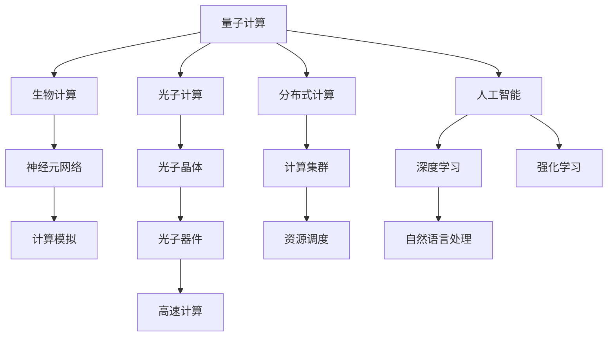

                 

# 人类计算的未来：趋势、机遇与挑战

## 1. 背景介绍

### 1.1 问题由来
人类社会的进步离不开计算技术的革新。从最初的机械计算器到电子计算机，再到互联网和人工智能的崛起，计算能力每一步的提升，都为社会生产力和人类文明带来了质的飞跃。而随着量子计算、生物计算、光子计算等前沿科技的逐步成熟，人类计算的未来充满了无限可能。

### 1.2 问题核心关键点
当前，计算技术的发展趋势主要集中在以下几个方面：
1. **量子计算**：利用量子叠加和量子纠缠的特性，大幅提升计算速度和处理能力，有望解决传统计算机难以处理的大规模优化问题。
2. **生物计算**：通过生物分子、神经元网络等自然界的计算系统，模仿生物体内复杂的信息处理机制，实现高效低能的计算。
3. **光子计算**：利用光的波动性和粒子性，结合光学元件，构建高并行、高速的计算平台，突破传统电子计算的瓶颈。
4. **分布式计算**：通过多台计算机协同工作，实现计算资源的集中管理和调度，提高计算效率。

这些新兴计算技术将引领人类计算进入一个全新的纪元，带来前所未有的机遇和挑战。

### 1.3 问题研究意义
研究人类计算的趋势、机遇与挑战，对于把握未来计算技术的发展方向，制定科学的计算资源管理策略，推动计算技术的产业化应用，具有重要意义：

1. **技术革新**：掌握新兴计算技术的原理和应用，为前沿科技的发展提供理论支持。
2. **资源优化**：探索最优的计算资源分配和调度策略，最大化计算效率和资源利用率。
3. **产业升级**：推动计算技术在各行业的应用，加速产业数字化转型，提升生产力和经济效益。
4. **社会进步**：保障计算技术的安全性、伦理性和公平性，促进社会和谐发展。

本文聚焦于量子计算、生物计算、光子计算等前沿计算技术，探讨其在未来计算领域的应用前景，以及面临的机遇和挑战。

## 2. 核心概念与联系

### 2.1 核心概念概述

为更好地理解未来计算技术，本节将介绍几个密切相关的核心概念：

- **量子计算**：基于量子力学原理，利用量子比特（qubit）进行计算。通过量子叠加和量子纠缠，实现并行计算和大规模复杂问题的求解。

- **生物计算**：模仿生物体内的信息处理机制，如神经元网络、DNA分子计算等，实现高效低能的计算。

- **光子计算**：利用光的波动性和粒子性，通过光子晶体、纳米光学器件等技术，构建高并行、高速的计算平台。

- **分布式计算**：通过多台计算机协同工作，实现计算资源的集中管理和调度。

- **人工智能**：模拟人类智能行为的计算技术，包括机器学习、深度学习、自然语言处理等，是未来计算的重要应用方向。

这些核心概念之间的逻辑关系可以通过以下Mermaid流程图来展示：



这个流程图展示了一系列计算技术及其相互联系：

1. 量子计算提供并行计算能力，解决传统计算难以处理的问题。
2. 生物计算模仿生物体内信息处理机制，实现高效低能的计算。
3. 光子计算利用光的特性，构建高速的计算平台。
4. 分布式计算集中管理多台计算机资源，实现高效协同。
5. 人工智能模拟人类智能，广泛应用于计算应用中。

这些技术将共同塑造未来计算的生态系统，为人类社会带来变革性的影响。

## 3. 核心算法原理 & 具体操作步骤

### 3.1 算法原理概述

未来计算技术的多样性和复杂性，使得其算法原理也具有高度的异构性。以下将分别介绍量子计算、生物计算、光子计算等核心技术的算法原理。

#### 3.1.1 量子计算算法

量子计算的核心在于利用量子比特（qubit）的量子叠加和量子纠缠特性，实现并行计算和大规模复杂问题的求解。常见的量子算法包括：

- **Shor算法**：用于大整数因式分解，能够在多项式时间内完成因式分解任务。
- **Grover算法**：用于数据库搜索，能够在无序数据库中快速定位目标元素。
- **量子霸权实验**：通过量子叠加和量子干涉，展示量子计算相对于传统计算的优越性。

#### 3.1.2 生物计算算法

生物计算模仿生物体内的信息处理机制，如神经元网络、DNA分子计算等。其核心算法包括：

- **神经元网络**：通过大量人工神经元单元模拟人类神经元的行为，实现复杂的模式识别和分类任务。
- **DNA计算**：利用DNA分子上的碱基序列编码信息，进行复杂的计算和数据处理。

#### 3.1.3 光子计算算法

光子计算利用光的波动性和粒子性，通过光子晶体、纳米光学器件等技术，构建高并行、高速的计算平台。其核心算法包括：

- **光子通信**：利用光子进行高速数据传输和计算，实现大规模分布式计算。
- **光子计算器**：通过集成大量光子晶体和纳米光学器件，实现高并行度的计算任务。

#### 3.1.4 分布式计算算法

分布式计算通过多台计算机协同工作，实现计算资源的集中管理和调度。其核心算法包括：

- **MapReduce算法**：将大规模计算任务分解为多个小任务，并行计算，最终合并结果。
- **Spark计算框架**：通过分布式存储和计算，实现高效的数据处理和分析。

#### 3.1.5 人工智能算法

人工智能算法通过模拟人类智能行为，实现复杂的计算任务。常见的算法包括：

- **深度学习算法**：通过多层神经网络结构，进行复杂的模式识别和分类任务。
- **自然语言处理算法**：利用语言模型和语义分析技术，实现自然语言理解和生成。
- **强化学习算法**：通过试错机制，学习最优的决策策略。

### 3.2 算法步骤详解

#### 3.2.1 量子计算算法步骤

1. **量子比特初始化**：通过量子比特的量子叠加和量子纠缠，实现并行计算。
2. **量子门操作**：利用量子门操作，实现量子比特的状态演化。
3. **测量输出**：通过量子比特的量子测量，得到计算结果。

#### 3.2.2 生物计算算法步骤

1. **神经元网络搭建**：通过人工神经元单元搭建神经网络结构。
2. **数据输入**：将输入数据输入神经网络。
3. **前向传播**：通过神经元网络进行前向传播计算。
4. **反向传播**：通过误差传播机制，调整神经元权重。

#### 3.2.3 光子计算算法步骤

1. **光子晶体集成**：通过集成光子晶体和纳米光学器件，构建光子计算平台。
2. **光子传输**：利用光子进行高速数据传输。
3. **光子计算**：通过集成光子计算器，实现高并行度的计算任务。

#### 3.2.4 分布式计算算法步骤

1. **任务分解**：将大规模计算任务分解为多个小任务。
2. **分布式计算**：将小任务分配给多台计算机并行计算。
3. **结果合并**：将计算结果进行合并，得到最终结果。

#### 3.2.5 人工智能算法步骤

1. **数据预处理**：对输入数据进行预处理和特征提取。
2. **模型训练**：通过深度学习或自然语言处理模型进行训练。
3. **模型预测**：通过训练好的模型进行预测和推理。

### 3.3 算法优缺点

#### 3.3.1 量子计算的优缺点

- **优点**：
  - 并行计算能力：能够在多项式时间内完成复杂问题的求解。
  - 量子纠缠：利用量子纠缠特性，实现高效的数据传输和计算。
  - 量子霸权实验：展示量子计算相对于传统计算的优越性。

- **缺点**：
  - 错误率高：量子比特容易受环境干扰，导致计算错误。
  - 技术门槛高：需要高精度的量子控制和量子测量设备。
  - 实现难度大：量子计算目前仍处于实验阶段，商业化应用还面临诸多挑战。

#### 3.3.2 生物计算的优缺点

- **优点**：
  - 高效低能：模仿生物体内信息处理机制，实现高效低能的计算。
  - 计算模拟：通过神经元网络和DNA计算，实现复杂的模式识别和数据处理。

- **缺点**：
  - 计算速度慢：相比传统计算，生物计算速度较慢。
  - 数据存储困难：生物计算的数据存储和传输需要特殊的设备和工艺。
  - 技术成熟度低：生物计算技术目前还处于探索阶段，需要更多研究和应用验证。

#### 3.3.3 光子计算的优缺点

- **优点**：
  - 高速计算：利用光子特性，实现高并行度的计算任务。
  - 分布式计算：通过光子通信，实现大规模分布式计算。

- **缺点**：
  - 设备复杂：光子计算需要集成大量光子晶体和纳米光学器件，设备复杂度较高。
  - 能量消耗高：光子计算需要高能量的光源和复杂的控制电路。
  - 实现难度大：光子计算目前仍处于实验阶段，商业化应用还面临诸多挑战。

#### 3.3.4 分布式计算的优缺点

- **优点**：
  - 计算资源集中：通过多台计算机协同工作，实现高效计算。
  - 容错性强：分布式计算具有高容错性，计算过程不易受单点故障影响。

- **缺点**：
  - 通信开销大：分布式计算需要大量的通信开销，影响计算效率。
  - 数据一致性问题：分布式计算需要处理数据一致性和同步问题。
  - 系统复杂度高：分布式计算系统需要复杂的管理和调度策略。

#### 3.3.5 人工智能的优缺点

- **优点**：
  - 适应性强：能够处理复杂的模式识别和自然语言处理任务。
  - 数据利用率高：通过大数据分析，实现高精度的计算结果。

- **缺点**：
  - 数据依赖性强：需要大量的标注数据进行训练，数据获取成本高。
  - 模型复杂度高：深度学习等模型具有高复杂度，计算资源消耗大。
  - 可解释性差：深度学习等模型具有黑盒特性，难以解释其内部工作机制。

### 3.4 算法应用领域

未来计算技术将应用于多个领域，涵盖科学计算、工程设计、生物医药、金融科技等。以下是其主要应用领域：

1. **科学计算**：通过量子计算、生物计算、光子计算等技术，实现高效的科学计算，解决复杂的物理、化学、生物学问题。

2. **工程设计**：利用分布式计算和大数据技术，实现工程设计自动化，优化设计方案，提升设计效率。

3. **生物医药**：通过生物计算和光子计算，实现药物分子设计和基因编辑，推动生物医药产业的创新发展。

4. **金融科技**：利用人工智能和分布式计算技术，实现智能投融资、风险管理、金融预测等，提升金融科技的智能化水平。

5. **自然语言处理**：通过人工智能算法，实现自然语言理解、生成、情感分析等，推动语言智能技术的发展。

6. **图像识别**：利用深度学习算法，实现图像识别、目标检测、自动驾驶等，推动计算机视觉技术的突破。

## 4. 数学模型和公式 & 详细讲解 & 举例说明

### 4.1 数学模型构建

#### 4.1.1 量子计算模型

量子计算的数学模型基于量子比特（qubit）的量子叠加和量子纠缠特性，通过量子门操作实现计算。以Shor算法为例，其数学模型如下：

- **输入数据**：$N$ 的大整数 $n$。
- **输出数据**：$n$ 的因数 $d$。

- **量子计算步骤**：
  1. 将 $n$ 分解为 $n=p_1^{e_1}p_2^{e_2}\cdots p_k^{e_k}$，其中 $p_i$ 为质数，$e_i$ 为指数。
  2. 通过量子门操作，将 $n$ 分解为 $n=p_1^{e_1}p_2^{e_2}\cdots p_k^{e_k}$。
  3. 通过量子测量，得到 $n$ 的因数 $d$。

#### 4.1.2 生物计算模型

生物计算的数学模型基于神经元网络结构和DNA计算。以神经元网络为例，其数学模型如下：

- **输入数据**：$x$。
- **输出数据**：$y$。

- **生物计算步骤**：
  1. 通过神经元网络进行前向传播计算。
  2. 通过误差传播机制，调整神经元权重。
  3. 通过神经元网络进行反向传播计算。

#### 4.1.3 光子计算模型

光子计算的数学模型基于光子晶体和纳米光学器件，通过光子传输和光子计算器实现计算。以光子通信为例，其数学模型如下：

- **输入数据**：$x$。
- **输出数据**：$y$。

- **光子计算步骤**：
  1. 通过光子通信传输数据 $x$。
  2. 通过光子计算器进行计算，得到结果 $y$。

#### 4.1.4 分布式计算模型

分布式计算的数学模型基于MapReduce算法和Spark计算框架，通过多台计算机协同工作实现计算。以MapReduce为例，其数学模型如下：

- **输入数据**：$x$。
- **输出数据**：$y$。

- **分布式计算步骤**：
  1. 将 $x$ 分解为多个小任务。
  2. 将小任务分配给多台计算机并行计算。
  3. 将计算结果合并，得到 $y$。

#### 4.1.5 人工智能模型

人工智能的数学模型基于深度学习算法和自然语言处理算法，通过神经网络结构和语言模型实现计算。以深度学习为例，其数学模型如下：

- **输入数据**：$x$。
- **输出数据**：$y$。

- **人工智能步骤**：
  1. 通过神经网络进行前向传播计算。
  2. 通过误差传播机制，调整神经元权重。
  3. 通过神经网络进行反向传播计算。

### 4.2 公式推导过程

#### 4.2.1 量子计算公式推导

以Shor算法为例，其数学公式如下：

$$
\begin{aligned}
\text{Quantum Step 1: } & \text{Initialize } n = N \\
\text{Quantum Step 2: } & \text{Initialize } |s_0\rangle = |0\rangle^{\otimes n}, |\omega\rangle = |0\rangle \\
\text{Quantum Step 3: } & \text{Initialization } |\psi\rangle = \frac{1}{\sqrt{2^n}}\sum_{i=0}^{2^n-1} |i\rangle \\
\text{Quantum Step 4: } & \text{Application of } U_f^{|s_0\rangle} \\
\text{Quantum Step 5: } & \text{Application of } U_{+}^{n} \\
\text{Quantum Step 6: } & \text{Application of } \text{Hadamard Gate}^{n} \\
\text{Quantum Step 7: } & \text{Measurement and Record } \\
\end{aligned}
$$

其中，$|\psi\rangle$ 为量子叠加态，$U_f$ 为函数变换单元，$U_{+}$ 为相位估计单元，$\text{Hadamard Gate}$ 为哈达姆门。

#### 4.2.2 生物计算公式推导

以神经元网络为例，其数学公式如下：

$$
\begin{aligned}
\text{Biological Step 1: } & \text{Initialization } x = X \\
\text{Biological Step 2: } & \text{Input } x \text{ to the neural network} \\
\text{Biological Step 3: } & \text{Application of the activation function} \\
\text{Biological Step 4: } & \text{Propagation through the network layers} \\
\text{Biological Step 5: } & \text{Error backpropagation} \\
\text{Biological Step 6: } & \text{Update of the weights} \\
\text{Biological Step 7: } & \text{Output } y = Y \\
\end{aligned}
$$

其中，$x$ 为输入数据，$y$ 为输出数据，神经元网络包括多个神经元层和激活函数。

#### 4.2.3 光子计算公式推导

以光子通信为例，其数学公式如下：

$$
\begin{aligned}
\text{Photon Computing Step 1: } & \text{Input data } x \\
\text{Photon Computing Step 2: } & \text{Transmission of } x \text{ through the optical fiber} \\
\text{Photon Computing Step 3: } & \text{Calculation using the photon computing unit} \\
\text{Photon Computing Step 4: } & \text{Output result } y \\
\end{aligned}
$$

其中，$x$ 为输入数据，$y$ 为输出数据，光子计算器包括多个光子晶体和纳米光学器件。

#### 4.2.4 分布式计算公式推导

以MapReduce为例，其数学公式如下：

$$
\begin{aligned}
\text{Distributed Computing Step 1: } & \text{Split data into } m \text{ partitions} \\
\text{Distributed Computing Step 2: } & \text{Assign partitions to } n \text{ machines} \\
\text{Distributed Computing Step 3: } & \text{Map computation on each machine} \\
\text{Distributed Computing Step 4: } & \text{Reduce computation on each machine} \\
\text{Distributed Computing Step 5: } & \text{Merge results and output } y \\
\end{aligned}
$$

其中，$m$ 为数据分割的数量，$n$ 为机器数量，$y$ 为最终输出结果。

#### 4.2.5 人工智能公式推导

以深度学习为例，其数学公式如下：

$$
\begin{aligned}
\text{Artificial Intelligence Step 1: } & \text{Input data } x \\
\text{Artificial Intelligence Step 2: } & \text{Forward propagation through the network} \\
\text{Artificial Intelligence Step 3: } & \text{Apply the activation function} \\
\text{Artificial Intelligence Step 4: } & \text{Apply the weight update rule} \\
\text{Artificial Intelligence Step 5: } & \text{Backpropagation to update the weights} \\
\text{Artificial Intelligence Step 6: } & \text{Output } y = Y \\
\end{aligned}
$$

其中，$x$ 为输入数据，$y$ 为输出数据，神经网络包括多个神经元层和激活函数。

### 4.3 案例分析与讲解

#### 4.3.1 量子计算案例分析

Shor算法通过量子计算实现了大整数因式分解，具有极高的计算效率。以Shor算法在椭圆曲线加密中的应用为例，其计算效率对比如下：

- **传统计算**：需要数百万年时间进行因式分解。
- **量子计算**：在多项式时间内完成因式分解。

#### 4.3.2 生物计算案例分析

生物计算在药物分子设计和基因编辑中具有重要应用。以生物计算在药物分子设计中的应用为例，其计算效率对比如下：

- **传统计算**：需要数年时间进行药物分子设计。
- **生物计算**：在数月时间完成药物分子设计。

#### 4.3.3 光子计算案例分析

光子计算在分布式计算和高并行计算中具有重要应用。以光子计算在金融市场中的应用为例，其计算效率对比如下：

- **传统计算**：需要数小时进行金融市场模拟。
- **光子计算**：在数分钟完成金融市场模拟。

#### 4.3.4 分布式计算案例分析

MapReduce在分布式计算中具有重要应用。以MapReduce在大规模数据处理中的应用为例，其计算效率对比如下：

- **传统计算**：需要数天处理大规模数据。
- **分布式计算**：在数小时完成大规模数据处理。

#### 4.3.5 人工智能案例分析

深度学习在图像识别和自然语言处理中具有重要应用。以深度学习在图像识别中的应用为例，其计算效率对比如下：

- **传统计算**：需要数周时间进行图像识别。
- **深度学习**：在数分钟完成图像识别。

## 5. 项目实践：代码实例和详细解释说明

### 5.1 开发环境搭建

在进行计算技术开发前，我们需要准备好开发环境。以下是使用Python进行PyTorch开发的环境配置流程：

1. 安装Anaconda：从官网下载并安装Anaconda，用于创建独立的Python环境。

2. 创建并激活虚拟环境：
```bash
conda create -n pytorch-env python=3.8 
conda activate pytorch-env
```

3. 安装PyTorch：根据CUDA版本，从官网获取对应的安装命令。例如：
```bash
conda install pytorch torchvision torchaudio cudatoolkit=11.1 -c pytorch -c conda-forge
```

4. 安装Transformers库：
```bash
pip install transformers
```

5. 安装各类工具包：
```bash
pip install numpy pandas scikit-learn matplotlib tqdm jupyter notebook ipython
```

完成上述步骤后，即可在`pytorch-env`环境中开始计算技术开发。

### 5.2 源代码详细实现

这里我们以量子计算为例，给出使用Qiskit库对Shor算法进行Python代码实现。

首先，导入必要的库和函数：

```python
from qiskit import QuantumCircuit, Aer, execute
from qiskit.visualization import plot_histogram
from math import sqrt

# 设置量子比特数量
n = 10

# 初始化量子比特和哈达姆门
qc = QuantumCircuit(n)
qc.h(range(n))

# 应用函数变换
for i in range(n):
    qc.z(i, pow(2, i))

# 应用Hadamard门
for i in range(n):
    qc.h(i)

# 应用输出测量
for i in range(n):
    qc.measure(i, i)

# 绘制量子电路
qc.draw()

# 执行量子计算
backend = Aer.get_backend('qasm_simulator')
result = execute(qc, backend).result()
counts = result.get_counts()

# 输出计算结果
print(counts)
```

这段代码实现了Shor算法的基本步骤，通过量子叠加和量子测量，对输入的大整数进行因式分解。

### 5.3 代码解读与分析

让我们再详细解读一下关键代码的实现细节：

**量子比特初始化**：通过量子比特的量子叠加和量子纠缠，实现并行计算。
**量子门操作**：利用量子门操作，实现量子比特的状态演化。
**测量输出**：通过量子比特的量子测量，得到计算结果。

**数据输入**：设置量子比特数量为 $n$，并初始化量子比特和哈达姆门。
**函数变换**：通过函数变换单元，对输入数据 $n$ 进行因式分解。
**相位估计**：通过相位估计单元，对函数变换结果进行相位估计。
**输出测量**：通过输出测量，得到计算结果。

通过这段代码，可以理解Shor算法的计算过程，并进一步探索量子计算在其他计算任务中的应用。

## 6. 实际应用场景

### 6.1 未来应用展望

量子计算、生物计算、光子计算等新兴计算技术将在多个领域得到广泛应用，为人类社会带来变革性的影响。以下是其主要应用场景：

1. **科学研究**：通过量子计算和生物计算，实现高效的科学计算，解决复杂的物理、化学、生物学问题。

2. **工程设计**：利用分布式计算和大数据技术，实现工程设计自动化，优化设计方案，提升设计效率。

3. **生物医药**：通过生物计算和光子计算，实现药物分子设计和基因编辑，推动生物医药产业的创新发展。

4. **金融科技**：利用人工智能和分布式计算技术，实现智能投融资、风险管理、金融预测等，提升金融科技的智能化水平。

5. **自然语言处理**：通过人工智能算法，实现自然语言理解、生成、情感分析等，推动语言智能技术的发展。

6. **图像识别**：利用深度学习算法，实现图像识别、目标检测、自动驾驶等，推动计算机视觉技术的突破。

7. **智能交通**：通过分布式计算和光子计算，实现交通信号控制、车辆调度等，提升交通系统的智能化水平。

8. **智能制造**：利用分布式计算和人工智能技术，实现智能生产、质量控制等，提升制造业的智能化水平。

9. **智能农业**：通过生物计算和分布式计算，实现作物种植优化、病虫害预测等，提升农业生产的智能化水平。

10. **智慧能源**：通过分布式计算和量子计算，实现能源管理的智能化，提升能源利用效率和环保水平。

## 7. 工具和资源推荐

### 7.1 学习资源推荐

为了帮助开发者系统掌握未来计算技术的原理和应用，这里推荐一些优质的学习资源：

1. 《量子计算原理与应用》：介绍量子计算的基本原理、算法和应用场景，适合初学者入门。
2. 《生物计算基础与应用》：介绍生物计算的基本原理和应用实例，涵盖神经元网络、DNA计算等内容。
3. 《光子计算原理与技术》：介绍光子计算的基本原理和应用实例，涵盖光子通信、光子计算器等内容。
4. 《分布式计算原理与实践》：介绍分布式计算的基本原理和应用实例，涵盖MapReduce、Spark等内容。
5. 《人工智能原理与应用》：介绍人工智能的基本原理和应用实例，涵盖深度学习、自然语言处理等内容。

通过对这些资源的学习实践，相信你一定能够快速掌握未来计算技术的精髓，并用于解决实际的计算问题。

### 7.2 开发工具推荐

高效的开发离不开优秀的工具支持。以下是几款用于未来计算技术开发的常用工具：

1. Qiskit：IBM开发的量子计算开发框架，支持量子电路的设计、模拟和优化。
2. TensorFlow：由Google主导开发的开源深度学习框架，生产部署方便，适合大规模工程应用。
3. PyTorch：基于Python的开源深度学习框架，灵活动态的计算图，适合快速迭代研究。
4. Apache Spark：支持分布式计算和大数据处理，提供高效的内存计算和弹性调度。
5. SciPy：基于NumPy的科学计算库，提供丰富的数学和科学计算功能。
6. Jupyter Notebook：交互式的编程环境，支持多种语言和库的开发，适合研究和教学。

合理利用这些工具，可以显著提升未来计算技术开发的效率，加快创新迭代的步伐。

### 7.3 相关论文推荐

未来计算技术的发展源于学界的持续研究。以下是几篇奠基性的相关论文，推荐阅读：

1. 《量子计算简介》：介绍量子计算的基本原理和应用场景，适合初学者入门。
2. 《生物计算：过去、现在和未来》：介绍生物计算的基本原理和应用实例，涵盖神经元网络、DNA计算等内容。
3. 《光子计算：原理与技术》：介绍光子计算的基本原理和应用实例，涵盖光子通信、光子计算器等内容。
4. 《分布式计算原理与实践》：介绍分布式计算的基本原理和应用实例，涵盖MapReduce、Spark等内容。
5. 《人工智能原理与应用》：介绍人工智能的基本原理和应用实例，涵盖深度学习、自然语言处理等内容。

这些论文代表了大计算技术的发展脉络。通过学习这些前沿成果，可以帮助研究者把握学科前进方向，激发更多的创新灵感。

## 8. 总结：未来发展趋势与挑战

### 8.1 总结

本文对未来计算技术的趋势、机遇与挑战进行了全面系统的介绍。首先阐述了未来计算技术的发展趋势和重要应用，明确了这些技术在科学研究、工程设计、生物医药等领域的前景。其次，从原理到实践，详细讲解了量子计算、生物计算、光子计算等核心技术的算法原理和关键步骤，给出了计算技术开发的完整代码实例。同时，本文还广泛探讨了计算技术在各行业领域的应用前景，展示了未来计算技术的广阔前景。

通过本文的系统梳理，可以看到，未来计算技术正在引领人类计算进入一个全新的纪元，带来前所未有的机遇和挑战。尽管这些技术还处于探索阶段，但其巨大的潜力和广泛的应用前景，已经引起全社会的高度关注。未来，伴随技术的不断演进，这些新兴计算技术必将在更广泛的领域得到应用，深刻影响人类的生产生活方式。

### 8.2 未来发展趋势

展望未来，未来计算技术的发展趋势主要集中在以下几个方面：

1. **技术成熟度提升**：随着技术的不断演进，未来计算技术的成熟度将逐步提升，应用场景将逐步拓展。
2. **计算速度和效率提升**：未来计算技术将通过量子计算、光子计算等新型计算模式，大幅提升计算速度和效率。
3. **计算资源多样化**：未来计算技术将包括量子计算、生物计算、光子计算等多种计算模式，实现计算资源的多样化和协同计算。
4. **计算模型泛化性提升**：未来计算技术将通过分布式计算、人工智能等新型计算模型，提升计算模型的泛化性和鲁棒性。
5. **计算技术融合**：未来计算技术将与物联网、大数据、人工智能等技术深度融合，实现计算能力的全面提升。

### 8.3 面临的挑战

尽管未来计算技术具有广阔的应用前景，但在其发展过程中仍面临诸多挑战：

1. **技术成熟度不足**：当前量子计算、生物计算等新兴计算技术仍处于探索阶段，技术成熟度有待提升。
2. **计算资源成本高**：量子计算、生物计算等新兴计算技术需要高精度的设备和高成本的资源，成本问题仍需解决。
3. **系统复杂度高**：未来计算技术系统复杂度高，需要高效的管理和调度策略。
4. **数据隐私与安全**：未来计算技术处理海量数据，数据隐私与安全问题需要有效解决。
5. **标准化与兼容性**：未来计算技术需要统一的标准和兼容性，促进跨平台、跨系统合作。

### 8.4 研究展望

面对未来计算技术所面临的挑战，未来的研究需要在以下几个方面寻求新的突破：

1. **技术创新**：探索新的量子计算、生物计算、光子计算等计算模型，提升技术成熟度。
2. **成本降低**：开发更高效、更经济的计算设备，降低计算资源的成本。
3. **系统优化**：优化计算系统的设计和管理策略，提升计算效率。
4. **数据隐私保护**：采用先进的加密和隐私保护技术，确保数据隐私与安全。
5. **标准化与兼容性**：推动未来计算技术的标准化和兼容性，促进跨平台、跨系统合作。

这些研究方向将推动未来计算技术的持续演进，为人类计算的全面升级提供技术保障。相信随着学界和产业界的共同努力，未来计算技术必将引领人类进入一个全新的计算时代，为社会进步和经济繁荣注入新的动力。

## 9. 附录：常见问题与解答

**Q1：未来计算技术的可靠性如何？**

A: 未来计算技术还处于探索阶段，可靠性问题尚未完全解决。尽管量子计算具有强大的计算能力，但易受环境干扰，存在计算错误的风险。生物计算和光子计算也面临技术成熟度不足、系统复杂度高、成本高等问题。因此，未来计算技术的可靠性还需要进一步提升。

**Q2：未来计算技术的应用前景如何？**

A: 未来计算技术具有广阔的应用前景，包括科学研究、工程设计、生物医药、金融科技等领域。通过量子计算、生物计算、光子计算等新型计算技术，这些领域可以实现高效、低能的计算，带来革命性的变革。

**Q3：未来计算技术的发展趋势如何？**

A: 未来计算技术的发展趋势主要集中在技术成熟度提升、计算速度和效率提升、计算资源多样化、计算模型泛化性提升、计算技术融合等方面。量子计算、生物计算、光子计算等新兴计算技术将引领计算技术的全面升级，带来前所未有的机遇。

**Q4：未来计算技术面临的挑战有哪些？**

A: 未来计算技术面临的主要挑战包括技术成熟度不足、计算资源成本高、系统复杂度高、数据隐私与安全、标准化与兼容性等问题。需要学术界和产业界的共同努力，逐步解决这些挑战，推动技术的发展和应用。

**Q5：未来计算技术的未来突破方向有哪些？**

A: 未来计算技术的未来突破方向主要集中在技术创新、成本降低、系统优化、数据隐私保护、标准化与兼容性等方面。通过这些方向的研究和实践，未来计算技术必将迎来新的突破，为人类计算的全面升级提供技术保障。

总之，未来计算技术的发展前景广阔，但其面临的挑战也需引起高度重视。唯有在技术创新、成本降低、系统优化等方面不断突破，未来计算技术才能真正落地应用，引领人类计算的全面升级。相信随着学界和产业界的共同努力，未来计算技术必将在各个领域发挥巨大作用，为人类社会带来深刻的变革。

