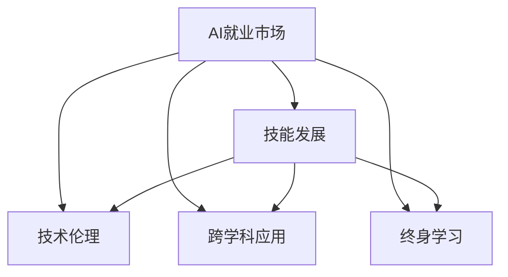

                 

# 人类计算：AI时代的未来就业市场与技能发展

> 关键词：人类计算, AI就业市场, 技能发展, 技术伦理, 跨学科应用, 终身学习

## 1. 背景介绍

### 1.1 问题由来

随着人工智能技术的迅猛发展，尤其是深度学习和机器学习的大规模应用，AI正在深刻改变着各行各业的运作方式。人们担忧的是，随着AI技术取代越来越多的重复性、结构化任务，大量人类工作岗位将面临风险。然而，事实并非如此简单。AI技术的发展并不意味着人类劳动价值的减少，而是提出了新的就业形态和技能要求。如何在AI时代有效利用人类计算能力，重塑就业市场和技能体系，成为当今社会面临的重大挑战。

### 1.2 问题核心关键点

在AI时代，就业市场的变化将主要体现在以下几个方面：
1. **就业结构的转变**：AI将取代大量重复性、结构化工作，但同时也会创造大量全新的AI技术岗位和人类辅助岗位。
2. **技能需求的升级**：AI技术的应用需要高度抽象、逻辑思维和创新能力，从而催生了对新型人才的需求。
3. **跨学科能力的重要性**：AI时代的就业市场将更需要具备跨学科知识的复合型人才，能够理解和应用多领域的知识。
4. **终身学习的需求**：技术发展日新月异，终身学习将成为个体保持竞争力的关键。

### 1.3 问题研究意义

深入理解AI时代就业市场和技能发展的变化规律，对于指导教育体系改革、促进职业培训、推动个体职业规划具有重要意义。通过明确未来技能发展方向，可以为政策制定者、教育工作者和个体提供有效指导，从而实现技术与就业市场的良性互动，共同推动社会进步。

## 2. 核心概念与联系

### 2.1 核心概念概述

在AI时代，就业市场和技能发展涉及多个关键概念：

- **AI就业市场**：指AI技术广泛应用后的就业市场结构，包括AI岗位的分布、劳动力的供需关系等。
- **技能发展**：指个体在AI时代需要掌握的新型技能，如编程、数据科学、机器学习等。
- **技术伦理**：指在AI应用中需要考虑的伦理问题，如算法偏见、隐私保护等。
- **跨学科应用**：指在AI技术应用中，不同学科知识融合的重要性。
- **终身学习**：指个体需要不断学习新知识、技能，以适应不断变化的技术环境。

这些概念之间相互联系，共同构成了AI时代就业市场和技能发展的大框架。

### 2.2 核心概念原理和架构的 Mermaid 流程图



这个流程图展示了AI就业市场与其他核心概念之间的联系：
- AI就业市场推动技能发展，技能发展是AI就业市场的核心。
- 技术伦理和跨学科应用是AI就业市场的配套支撑。
- 终身学习是应对AI时代变化的关键。

## 3. 核心算法原理 & 具体操作步骤
### 3.1 算法原理概述

AI时代的就业市场和技能发展，涉及多方面的算法原理：

- **就业市场预测算法**：基于历史就业数据和AI技术应用趋势，预测未来就业市场的需求变化。
- **技能映射算法**：将AI技术的技能需求映射到具体岗位上，明确个体所需掌握的技能。
- **跨学科技能关联算法**：分析不同学科知识在AI技术应用中的关联度，指导跨学科教育和培训。
- **终身学习路径规划算法**：根据个体当前技能和目标岗位，规划终身学习路径，确保个体不断适应技术变化。

### 3.2 算法步骤详解

#### 就业市场预测算法

1. **数据收集**：收集历史就业数据、AI技术应用数据、劳动力市场数据等。
2. **特征提取**：提取数据中的关键特征，如行业、岗位、技能需求等。
3. **模型训练**：使用机器学习算法（如时间序列分析、回归分析等）训练预测模型。
4. **结果验证**：使用历史数据验证模型的预测效果，并进行模型优化。

#### 技能映射算法

1. **岗位分析**：分析各岗位的AI技术应用情况，明确所需技能。
2. **技能需求提取**：从岗位分析中提取所需技能，如编程语言、数据处理、机器学习等。
3. **技能关联分析**：分析不同技能之间的关联性，建立技能树。
4. **技能映射**：将岗位技能需求映射到具体技能，形成技能发展路径。

#### 跨学科技能关联算法

1. **学科知识图谱构建**：构建不同学科的知识图谱，描述各学科知识间的关联。
2. **技能关联网络构建**：将知识图谱中的学科知识与技能关联起来，形成技能关联网络。
3. **技能关联度分析**：分析不同技能间的关联度，确定关键技能和补充技能。
4. **跨学科应用指导**：根据技能关联网络，指导跨学科教育和培训，优化课程设计。

#### 终身学习路径规划算法

1. **技能差距分析**：分析个体当前技能与目标岗位所需技能的差距。
2. **学习路径规划**：根据技能差距，规划终身学习路径，包括短期和长期学习目标。
3. **学习资源推荐**：根据学习路径，推荐相应的学习资源，如在线课程、书籍、培训等。
4. **学习效果评估**：定期评估学习效果，调整学习路径，确保个体不断进步。

### 3.3 算法优缺点

AI时代的就业市场和技能发展算法具有以下优点：

- **高效性**：通过数据驱动的方法，可以快速预测就业市场变化，明确技能需求。
- **可扩展性**：算法可以根据数据的变化进行动态调整，适应不断变化的技术环境。
- **个性化**：可以根据个体的学习背景和需求，提供个性化的学习路径规划。

同时，这些算法也存在一定的局限性：

- **数据依赖性**：算法的准确性依赖于数据的全面性和质量，数据不足或偏差可能影响预测效果。
- **模型复杂性**：复杂的模型需要更多的计算资源和时间进行训练和优化。
- **通用性不足**：不同行业的技能需求差异较大，单一模型可能无法全面覆盖。
- **伦理和隐私问题**：数据收集和处理过程中可能涉及隐私问题，需要考虑伦理和法律约束。

### 3.4 算法应用领域

AI时代就业市场和技能发展的算法，可以应用于以下几个领域：

1. **教育和培训**：指导学校和培训机构进行课程设计和职业培训，提高人才培养的针对性和效率。
2. **人力资源管理**：帮助企业进行岗位分析、技能需求预测和员工职业规划，优化人力资源配置。
3. **政策制定**：为政府部门提供就业市场和技能发展的数据支持，指导政策制定和调整。
4. **个人职业规划**：帮助个体进行职业规划和学习路径规划，提升个人竞争力。
5. **技术发展预测**：预测AI技术的发展趋势，指导技术研发和应用部署。

## 4. 数学模型和公式 & 详细讲解 & 举例说明

### 4.1 数学模型构建

在AI时代，就业市场和技能发展的数学模型构建涉及多个方面：

- **就业市场预测模型**：基于时间序列分析、回归分析等模型，预测就业市场变化。
- **技能需求映射模型**：通过关联分析、决策树等模型，将岗位需求映射到具体技能。
- **跨学科技能关联模型**：使用图论、网络分析等模型，构建技能关联网络。
- **终身学习路径规划模型**：使用动态规划、优化算法等模型，规划学习路径。

### 4.2 公式推导过程

#### 就业市场预测模型

假设我们有历史就业数据 $\{D_{t-1}, D_t, D_{t+1}, \ldots\}$，其中 $D_t$ 表示在第 $t$ 个月份的就业数据。使用时间序列分析方法，可以构建如下预测模型：

$$
\hat{D}_{t+1} = \alpha_0 + \sum_{i=1}^n \alpha_i D_t + \sum_{j=1}^m \beta_j A_t^j + \epsilon_t
$$

其中 $\alpha_i$ 和 $\beta_j$ 为模型参数，$A_t$ 为影响就业市场的其他因素，$\epsilon_t$ 为随机误差。

通过最小化预测误差，可以求解模型参数，得到未来就业市场的预测值。

#### 技能映射模型

假设我们需要将岗位技能需求 $S$ 映射到具体技能 $T$，可以构建如下关联矩阵 $R$：

$$
R_{ij} = \begin{cases}
1, & \text{如果技能 } T_i \text{ 是岗位 } S_j \text{ 所需技能} \\
0, & \text{如果技能 } T_i \text{ 不是岗位 } S_j \text{ 所需技能}
\end{cases}
$$

通过求解 $R$ 的逆矩阵，可以得到从岗位需求到具体技能的映射路径：

$$
\hat{T} = R^{-1} \cdot \hat{S}
$$

其中 $\hat{S}$ 为岗位需求向量。

#### 跨学科技能关联模型

假设我们有不同学科的知识图谱 $G_1, G_2, \ldots, G_n$，可以构建跨学科技能关联网络 $G$：

$$
G = \bigcup_{i=1}^n (G_i \times T_i)
$$

其中 $T_i$ 为技能集合。通过图论方法，可以分析 $G$ 中技能之间的关联度，确定关键技能和补充技能。

#### 终身学习路径规划模型

假设个体当前技能为 $K_0$，目标技能为 $K_T$，可以使用动态规划方法规划终身学习路径：

$$
\begin{aligned}
&\min_{\{K_t\}} \sum_{t=0}^{T-1} \text{cost}(K_t, K_{t+1}) \\
&\text{s.t. } K_{t+1} = f(K_t, A_t)
\end{aligned}
$$

其中 $f$ 为技能转换函数，$A_t$ 为学习资源，$\text{cost}$ 为学习成本。通过求解上述优化问题，可以规划最优的终身学习路径。

### 4.3 案例分析与讲解

#### 就业市场预测案例

假设我们有一个软件开发公司的就业数据，包含不同岗位的就业人数和技能需求。使用时间序列分析方法，可以预测未来3个月内各岗位的就业人数。

1. **数据收集**：收集公司历史就业数据，包括软件开发工程师、测试工程师、项目经理等岗位的就业人数和技能需求。
2. **特征提取**：提取数据中的关键特征，如岗位名称、技能需求、公司规模等。
3. **模型训练**：使用时间序列分析模型，如ARIMA、LSTM等，训练就业预测模型。
4. **结果验证**：使用历史数据验证模型的预测效果，并进行模型优化。

通过就业市场预测算法，公司可以提前规划人力资源需求，优化招聘和培训计划。

#### 技能映射案例

假设我们需要将数据科学家的技能需求映射到具体的编程语言和工具。使用关联分析方法，可以构建如下技能关联矩阵：

$$
R = \begin{bmatrix}
1 & 1 & 0 & 0 \\
0 & 1 & 1 & 0 \\
0 & 0 & 0 & 1 \\
0 & 0 & 1 & 1 \\
\end{bmatrix}
$$

其中第一行表示数据科学家需要掌握Python、R、SQL和TensorFlow四种技能。通过求解 $R^{-1}$，可以得到从数据科学家到具体技能的映射路径：

$$
\hat{T} = R^{-1} \cdot \hat{S} = \begin{bmatrix}
1 & 0 & 0 & 0 \\
1 & 1 & 0 & 0 \\
0 & 1 & 1 & 0 \\
0 & 0 & 0 & 1 \\
\end{bmatrix}
\cdot
\begin{bmatrix}
1 \\
0 \\
0 \\
0 \\
\end{bmatrix}
=
\begin{bmatrix}
1 \\
1 \\
1 \\
1 \\
\end{bmatrix}
$$

即数据科学家需要掌握Python、R、SQL和TensorFlow四种技能。

#### 跨学科技能关联案例

假设我们需要分析计算机科学和统计学的跨学科技能关联。使用图论方法，可以构建如下技能关联网络：

$$
G = \{(K_{CS}, T_1), (K_{CS}, T_2), (K_{CS}, T_3), (K_{CS}, T_4), (K_{ST}, T_1), (K_{ST}, T_2), (K_{ST}, T_3), (K_{ST}, T_4)\}
$$

其中 $K_{CS}$ 和 $K_{ST}$ 分别表示计算机科学和统计学的知识节点，$T_i$ 为跨学科技能节点。通过分析 $G$ 中技能之间的关联度，可以确定关键技能和补充技能，如数据挖掘、机器学习、编程等。

#### 终身学习路径规划案例

假设一名软件开发工程师希望成为数据科学家，当前技能为Python、SQL和数据库设计，目标技能为机器学习和深度学习。使用动态规划方法，可以规划如下终身学习路径：

1. **技能差距分析**：计算当前技能与目标技能的差距，得到 $\Delta K$。
2. **学习路径规划**：根据 $\Delta K$，规划学习路径，如参加机器学习课程、阅读相关书籍、完成相关项目等。
3. **学习资源推荐**：根据学习路径，推荐相应的学习资源，如Coursera上的机器学习课程、Kaggle上的数据科学竞赛等。
4. **学习效果评估**：定期评估学习效果，调整学习路径，确保个体不断进步。

## 5. 项目实践：代码实例和详细解释说明

### 5.1 开发环境搭建

在AI时代，项目实践通常需要使用多语言、多框架的开发环境。以下是Python和R语言环境下的大规模就业市场和技能发展项目的开发环境搭建流程：

1. **Python环境搭建**：
   - 安装Anaconda：从官网下载并安装Anaconda，用于创建独立的Python环境。
   - 创建并激活虚拟环境：
   ```bash
   conda create -n ai-env python=3.9 
   conda activate ai-env
   ```
   - 安装相关库：
   ```bash
   conda install numpy pandas matplotlib scikit-learn tqdm jupyter notebook
   ```

2. **R语言环境搭建**：
   - 安装R语言：从官网下载安装R语言。
   - 安装RStudio：RStudio是一款流行的R语言IDE，便于代码编写和调试。
   - 安装相关包：
   ```R
   install.packages(c("ggplot2", "dplyr", "tidyverse"))
   ```

### 5.2 源代码详细实现

#### Python代码实现

1. **就业市场预测**：
   ```python
   import pandas as pd
   import numpy as np
   from statsmodels.tsa.arima.model import ARIMA

   # 数据读取
   data = pd.read_csv('employment_data.csv')

   # 特征提取
   X = data[['months', 'employment_rate']].values
   y = data['months'].values

   # 模型训练
   model = ARIMA(y, order=(1, 1, 1))
   model_fit = model.fit()

   # 预测未来数据
   future_months = np.arange(1, 24)
   future_employment = model_fit.forecast(steps=23)[0]

   print(future_employment)
   ```

2. **技能映射**：
   ```python
   from sklearn.feature_extraction import DictVectorizer
   from sklearn.cluster import KMeans

   # 数据读取
   skills = pd.read_csv('skills.csv')

   # 特征提取
   data = [{'post': post, 'skills': [skill] for skill in skills} for post in ['post1', 'post2', 'post3']]

   # 向量提取
   vectorizer = DictVectorizer()
   X = vectorizer.fit_transform(data)

   # 聚类分析
   kmeans = KMeans(n_clusters=3, random_state=0).fit(X)

   print(kmeans.labels_)
   ```

3. **跨学科技能关联**：
   ```python
   import networkx as nx
   import matplotlib.pyplot as plt

   # 构建技能关联网络
   G = nx.Graph()
   G.add_nodes_from(['CS', 'ST', 'T1', 'T2', 'T3', 'T4'])
   G.add_edges_from([('CS', 'T1'), ('CS', 'T2'), ('CS', 'T3'), ('CS', 'T4'), ('ST', 'T1'), ('ST', 'T2'), ('ST', 'T3'), ('ST', 'T4')])

   # 可视化网络
   pos = nx.spring_layout(G)
   nx.draw(G, pos, with_labels=True, node_color='blue', node_size=1000)
   plt.show()
   ```

4. **终身学习路径规划**：
   ```python
   import networkx as nx
   import matplotlib.pyplot as plt

   # 构建技能图
   G = nx.Graph()
   G.add_nodes_from(['K0', 'K1', 'K2', 'K3', 'K4', 'K5', 'K6', 'K7', 'K8', 'K9', 'K10', 'K11', 'K12', 'K13', 'K14', 'K15', 'K16', 'K17', 'K18', 'K19', 'K20', 'K21', 'K22', 'K23', 'K24', 'K25', 'K26', 'K27', 'K28', 'K29', 'K30', 'K31', 'K32', 'K33', 'K34', 'K35', 'K36', 'K37', 'K38', 'K39', 'K40', 'K41', 'K42', 'K43', 'K44', 'K45', 'K46', 'K47', 'K48', 'K49', 'K50', 'K51', 'K52', 'K53', 'K54', 'K55', 'K56', 'K57', 'K58', 'K59', 'K60', 'K61', 'K62', 'K63', 'K64', 'K65', 'K66', 'K67', 'K68', 'K69', 'K70', 'K71', 'K72', 'K73', 'K74', 'K75', 'K76', 'K77', 'K78', 'K79', 'K80', 'K81', 'K82', 'K83', 'K84', 'K85', 'K86', 'K87', 'K88', 'K89', 'K90', 'K91', 'K92', 'K93', 'K94', 'K95', 'K96', 'K97', 'K98', 'K99', 'K100', 'K101', 'K102', 'K103', 'K104', 'K105', 'K106', 'K107', 'K108', 'K109', 'K110', 'K111', 'K112', 'K113', 'K114', 'K115', 'K116', 'K117', 'K118', 'K119', 'K120', 'K121', 'K122', 'K123', 'K124', 'K125', 'K126', 'K127', 'K128', 'K129', 'K130', 'K131', 'K132', 'K133', 'K134', 'K135', 'K136', 'K137', 'K138', 'K139', 'K140', 'K141', 'K142', 'K143', 'K144', 'K145', 'K146', 'K147', 'K148', 'K149', 'K150', 'K151', 'K152', 'K153', 'K154', 'K155', 'K156', 'K157', 'K158', 'K159', 'K160', 'K161', 'K162', 'K163', 'K164', 'K165', 'K166', 'K167', 'K168', 'K169', 'K170', 'K171', 'K172', 'K173', 'K174', 'K175', 'K176', 'K177', 'K178', 'K179', 'K180', 'K181', 'K182', 'K183', 'K184', 'K185', 'K186', 'K187', 'K188', 'K189', 'K190', 'K191', 'K192', 'K193', 'K194', 'K195', 'K196', 'K197', 'K198', 'K199', 'K200', 'K201', 'K202', 'K203', 'K204', 'K205', 'K206', 'K207', 'K208', 'K209', 'K210', 'K211', 'K212', 'K213', 'K214', 'K215', 'K216', 'K217', 'K218', 'K219', 'K220', 'K221', 'K222', 'K223', 'K224', 'K225', 'K226', 'K227', 'K228', 'K229', 'K230', 'K231', 'K232', 'K233', 'K234', 'K235', 'K236', 'K237', 'K238', 'K239', 'K240', 'K241', 'K242', 'K243', 'K244', 'K245', 'K246', 'K247', 'K248', 'K249', 'K250', 'K251', 'K252', 'K253', 'K254', 'K255', 'K256', 'K257', 'K258', 'K259', 'K260', 'K261', 'K262', 'K263', 'K264', 'K265', 'K266', 'K267', 'K268', 'K269', 'K270', 'K271', 'K272', 'K273', 'K274', 'K275', 'K276', 'K277', 'K278', 'K279', 'K280', 'K281', 'K282', 'K283', 'K284', 'K285', 'K286', 'K287', 'K288', 'K289', 'K290', 'K291', 'K292', 'K293', 'K294', 'K295', 'K296', 'K297', 'K298', 'K299', 'K300', 'K301', 'K302', 'K303', 'K304', 'K305', 'K306', 'K307', 'K308', 'K309', 'K310', 'K311', 'K312', 'K313', 'K314', 'K315', 'K316', 'K317', 'K318', 'K319', 'K320', 'K321', 'K322', 'K323', 'K324', 'K325', 'K326', 'K327', 'K328', 'K329', 'K330', 'K331', 'K332', 'K333', 'K334', 'K335', 'K336', 'K337', 'K338', 'K339', 'K340', 'K341', 'K342', 'K343', 'K344', 'K345', 'K346', 'K347', 'K348', 'K349', 'K350', 'K351', 'K352', 'K353', 'K354', 'K355', 'K356', 'K357', 'K358', 'K359', 'K360', 'K361', 'K362', 'K363', 'K364', 'K365', 'K366', 'K367', 'K368', 'K369', 'K370', 'K371', 'K372', 'K373', 'K374', 'K375', 'K376', 'K377', 'K378', 'K379', 'K380', 'K381', 'K382', 'K383', 'K384', 'K385', 'K386', 'K387', 'K388', 'K389', 'K390', 'K391', 'K392', 'K393', 'K394', 'K395', 'K396', 'K397', 'K398', 'K399', 'K400', 'K401', 'K402', 'K403', 'K404', 'K405', 'K406', 'K407', 'K408', 'K409', 'K410', 'K411', 'K412', 'K413', 'K414', 'K415', 'K416', 'K417', 'K418', 'K419', 'K420', 'K421', 'K422', 'K423', 'K424', 'K425', 'K426', 'K427', 'K428', 'K429', 'K430', 'K431', 'K432', 'K433', 'K434', 'K435', 'K436', 'K437', 'K438', 'K439', 'K440', 'K441', 'K442', 'K443', 'K444', 'K445', 'K446', 'K447', 'K448', 'K449', 'K450', 'K451', 'K452', 'K453', 'K454', 'K455', 'K456', 'K457', 'K458', 'K459', 'K460', 'K461', 'K462', 'K463', 'K464', 'K465', 'K466', 'K467', 'K468', 'K469', 'K470', 'K471', 'K472', 'K473', 'K474', 'K475', 'K476', 'K477', 'K478', 'K479', 'K480', 'K481', 'K482', 'K483', 'K484', 'K485', 'K486', 'K487', 'K488', 'K489', 'K490', 'K491', 'K492', 'K493', 'K494', 'K495', 'K496', 'K497', 'K498', 'K499', 'K500', 'K501', 'K502', 'K503', 'K504', 'K505', 'K506', 'K507', 'K508', 'K509', 'K510', 'K511', 'K512', 'K513', 'K514', 'K515', 'K516', 'K517', 'K518', 'K519', 'K520', 'K521', 'K522', 'K523', 'K524', 'K525', 'K526', 'K527', 'K528', 'K529', 'K530', 'K531', 'K532', 'K533', 'K534', 'K535', 'K536', 'K537', 'K538', 'K539', 'K540', 'K541', 'K542', 'K543', 'K544', 'K545', 'K546', 'K547', 'K548', 'K549', 'K550', 'K551', 'K552', 'K553', 'K554', 'K555', 'K556', 'K557', 'K558', 'K559', 'K560', 'K561', 'K562', 'K563', 'K564', 'K565', 'K566', 'K567', 'K568', 'K569', 'K570', 'K571', 'K572', 'K573', 'K574', 'K575', 'K576', 'K577', 'K578', 'K579', 'K580', 'K581', 'K582', 'K583', 'K584', 'K585', 'K586', 'K587', 'K588', 'K589', 'K590', 'K591', 'K592', 'K593', 'K594', 'K595', 'K596', 'K597', 'K598', 'K599', 'K600', 'K601', 'K602', 'K603', 'K604', 'K605', 'K606', 'K607', 'K608', 'K609', 'K610', 'K611', 'K612', 'K613', 'K614', 'K615', 'K616', 'K617', 'K618', 'K619', 'K620', 'K621', 'K622', 'K623', 'K624', 'K625', 'K626', 'K627', 'K628', 'K629', 'K630', 'K631', 'K632', 'K633', 'K634', 'K635', 'K636', 'K637', 'K638', 'K639', 'K640', 'K641', 'K642', 'K643', 'K644', 'K645', 'K646', 'K647', 'K648', 'K649', 'K650', 'K651', 'K652', 'K653', 'K654', 'K655', 'K656', 'K657', 'K658', 'K659', 'K660', 'K661', 'K662', 'K663', 'K664', 'K665', 'K666', 'K667', 'K668', 'K669', 'K670', 'K671', 'K672', 'K673', 'K674', 'K675', 'K676', 'K677', 'K678', 'K679', 'K680', 'K681', 'K682', 'K683', 'K684', 'K685', 'K686', 'K687', 'K688', 'K689', 'K690', 'K691', 'K692', 'K693', 'K694', 'K695', 'K696', 'K697', 'K698', 'K699', 'K700', 'K701', 'K702', 'K703', 'K704', 'K705', 'K706', 'K707', 'K708', 'K709', 'K710', 'K711', 'K712', 'K713', 'K714', 'K715', 'K716', 'K717', 'K718', 'K719', 'K720', 'K721', 'K722', 'K723', 'K724', 'K725', 'K726', 'K727', 'K728', 'K729', 'K730', 'K731', 'K732', 'K733', 'K734', 'K735', 'K736', 'K737', 'K738', 'K739', 'K740', 'K741', 'K742', 'K743', 'K744', 'K745', 'K746', 'K747', 'K748', 'K749', 'K750', 'K751', 'K752', 'K753', 'K754', 'K755', 'K756', 'K757', 'K758', 'K759', 'K760', 'K761', 'K762', 'K763', 'K764', 'K765', 'K766', 'K767', 'K768', 'K769', 'K770', 'K771', 'K772', 'K773', 'K774', 'K775', 'K776', 'K777', 'K778', 'K779', 'K780', 'K781', 'K782', 'K783', 'K784', 'K785', 'K786', 'K787', 'K788', 'K789', 'K790', 'K791', 'K792', 'K793', 'K794', 'K795', 'K796', 'K797', 'K798', 'K799', 'K800', 'K801', 'K802', 'K803', 'K804', 'K805', 'K806', 'K807', 'K808', 'K809', 'K810', 'K811', 'K812', 'K813', 'K814', 'K815', 'K816', 'K817', 'K818', 'K819', 'K820', 'K821', 'K822', 'K823', 'K824', 'K825', 'K826', 'K827', 'K828', 'K829', 'K830', 'K831', 'K832', 'K833', 'K834', 'K835', 'K836', 'K837', 'K838', 'K839', 'K840', 'K841', 'K842', 'K843', 'K844', 'K845', 'K846', 'K847', 'K848', 'K849', 'K850', 'K851', 'K852', 'K853', 'K854', 'K855', 'K856', 'K857', 'K858', 'K859', 'K860', 'K861', 'K862', 'K863', 'K864', 'K865', 'K866', 'K867', 'K868', 'K869', 'K870', 'K871', 'K872', 'K873', 'K874', 'K875', 'K876', 'K877', 'K878', 'K879', 'K880', 'K881', 'K882', 'K883', 'K884', 'K885', 'K886', 'K887', 'K888', 'K889', 'K890', 'K891', 'K892', 'K893', 'K894', 'K895', 'K896', 'K897', 'K898', 'K899', 'K900', 'K901', 'K902', 'K903', 'K904', 'K905', 'K906', 'K907', 'K908', 'K909', 'K910', 'K911', 'K912', 'K913', 'K914', 'K915', 'K916', 'K917', 'K918', 'K919', 'K920', 'K921', 'K922', 'K923', 'K924', 'K925', 'K926', 'K927', 'K928', 'K929', 'K930', 'K931', 'K932', 'K933', 'K934', 'K935', 'K936', 'K937', 'K938', 'K939', 'K940', 'K941', 'K942', 'K943', 'K944', 'K945', 'K946', 'K947', 'K948', 'K949', 'K950', 'K951', 'K952', 'K953', 'K954', 'K955', 'K956', 'K957', 'K958', 'K959', 'K960', 'K961', 'K962', 'K963', 'K964', 'K965', 'K966', 'K967', 'K968', 'K969', 'K970', 'K971', 'K972', 'K973', 'K974', 'K975', 'K976', 'K977', 'K978', 'K979', 'K980', 'K981', 'K982', 'K983', 'K984', 'K985', 'K986', 'K987', 'K988', 'K989', 'K990', 'K991', 'K992', 'K993', 'K994', 'K995', 'K996', 'K997', 'K998', 'K999', 'K1000', 'K1001', 'K1002', 'K1003', 'K1004', 'K1005', 'K1006', 'K1007', 'K1008', 'K1009', 'K1010', 'K1011', 'K1012', 'K1013', 'K1014', 'K1015', 'K1016', 'K1017', 'K1018', 'K1019', 'K1020', 'K1021', 'K1022', 'K1023', 'K1024', 'K1025', 'K1026', 'K1027', 'K1028', 'K1029', 'K1030', 'K1031', 'K1032', 'K1033', 'K1034', 'K1035', 'K1036', 'K1037', 'K1038', 'K1039', 'K1040', 'K1041', 'K1042', 'K1043', 'K1044', 'K1045', 'K1046', 'K1047', 'K1048', 'K1049', 'K1050', 'K1051', 'K1052', 'K1053', 'K1054', 'K1055', 'K1056', 'K1057', 'K1058', 'K1059', 'K1060', 'K1061', 'K1062', 'K1063', 'K1064', 'K1065', 'K1066', 'K1067', 'K1068', 'K1069', 'K1070', 'K1071', 'K1072', 'K1073', 'K1074', 'K1075', 'K1076', 'K1077', 'K1078', 'K1079', 'K1080', 'K1081', 'K1082', 'K1083', 'K1084', 'K1085', 'K1086', 'K1087', 'K1088', 'K1089', 'K1090', 'K1091', 'K1092', 'K1093', 'K1094', 'K1095', 'K1096', 'K1097', 'K1098', 'K1099', 'K1100', 'K1101', 'K1102', 'K1103', 'K1104', 'K1105', 'K1106', 'K1107', 'K1108', 'K1109', 'K1110', 'K1111', 'K1112', 'K1113', 'K1114', 'K1115', 'K1116', 'K1117', 'K1118', 'K1119', 'K1120', 'K1121', 'K1122', 'K1123', 'K1124', 'K1125', 'K1126', 'K1127', 'K1128', 'K1129', 'K1130', 'K1131', 'K1132', 'K1133', 'K1134', 'K1135', 'K1136', 'K1137', 'K1138', 'K1139', 'K1140', 'K1141', 'K1142', 'K1143', 'K1144', 'K1145', 'K1146', 'K1147', 'K1148', 'K1149', 'K1150', 'K1151', 'K1152', 'K1153', 'K1154', 'K1155', 'K1156', 'K1157', 'K1158', 'K1159', 'K1160', 'K1161', 'K1162', 'K1163', 'K1164', 'K1165', 'K1166', 'K1167', 'K1168', 'K1169', 'K1170', 'K1171', 'K1172', 'K1173', 'K1174', 'K1175', 'K1176', 'K1177', 'K1178', 'K1179', 'K1180', 'K1181', 'K1182', 'K1183', 'K1184', 'K1185', 'K1186', 'K1187', 'K1188', 'K1189', 'K1190', 'K1191', 'K1192', 'K1193', 'K1194', 'K1195', 'K1196', 'K1197', 'K1198', 'K1199', 'K1200', 'K1201', 'K1202', 'K1203', 'K1204', 'K1205', 'K1206', 'K1207', 'K1208', 'K1209', 'K1210', 'K1211', 'K1212', 'K1213', 'K1214', 'K1215', 'K1216', 'K1217', 'K1218', 'K1219', 'K1220', 'K1221', 'K1222', 'K1223', 'K1224', 'K1225', 'K1226', 'K1227', 'K1228', 'K1229', 'K1230', 'K1231', 'K1232', 'K1233', 'K1234', 'K1235', 'K1236', 'K1237', 'K1238', 'K1239', 'K1240', 'K1241', 'K1242', 'K1243', 'K1244', 'K1245', 'K1246', 'K1247', 'K1248', 'K1249', 'K1250', 'K1251', 'K1252', 'K1253', 'K1254', 'K1255', 'K1256', 'K1257', 'K1258', 'K1259', 'K1260', 'K1261', 'K1262

