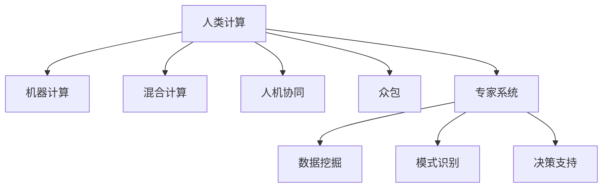
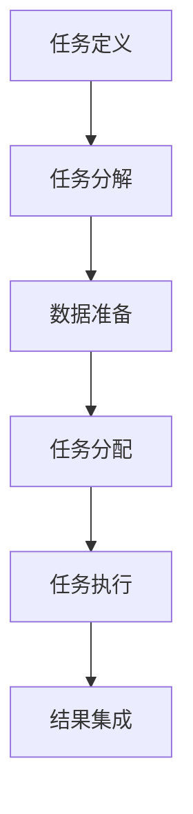

                 

# 人类计算：应用与案例分析

> 关键词：人类计算, 应用, 案例分析, 机器学习, 深度学习, 自然语言处理, 图像识别, 强化学习, 专家系统

## 1. 背景介绍

### 1.1 问题由来
随着信息技术的高速发展，机器计算已经逐步渗透到各行各业，从医疗、金融到制造业，无一例外。然而，机器计算虽然具有高效、自动化等特点，但在某些领域，尤其是在需要高度人类智慧和经验的领域，仍然难以取代人类计算。

人类计算（Human Computation）指的是利用人类的智慧、经验和技能来解决复杂问题的一种计算方式。相较于机器计算，人类计算具有以下几个显著优势：
1. **复杂问题解决**：面对那些复杂且需要高度创造性和经验的问题，如艺术创作、法律诉讼、医疗诊断等，机器难以完美解决，而人类则具备处理这些问题的天然优势。
2. **情感智能**：人类在处理涉及情感和同理心的问题上，比机器更加敏锐和高效。
3. **创新和创造力**：人类具备独特的发散思维和创新能力，可以提出新颖的解决方案，而机器则依赖于已有的数据和算法。
4. **多元化和包容性**：人类计算能够尊重和利用不同背景和视角的知识，提供更加多元和包容的解决方案。

### 1.2 问题核心关键点
人类计算的核心在于将人类的智慧和技能与机器的计算能力相结合，解决那些机器难以处理的复杂问题。这主要包括几个关键点：
- **任务定义**：明确人类计算要解决的具体任务，如数据分析、问题解决、创意生成等。
- **任务分解**：将复杂任务分解为可被人类处理的小任务，使其易于管理和执行。
- **数据准备**：准备任务所需的数据集，确保数据质量和安全。
- **任务分配**：将任务分配给合适的团队或个人，考虑其专业背景和经验。
- **任务执行**：执行任务并监督进度，确保质量。
- **结果集成**：将各个小任务的结果集成，形成最终解决方案。

### 1.3 问题研究意义
研究人类计算对于提升复杂问题解决能力、推动技术创新、促进经济社会发展具有重要意义：
1. **提升复杂问题解决能力**：利用人类的智慧和经验，能够解决那些机器难以处理的问题，进一步拓展机器计算的应用边界。
2. **推动技术创新**：人类计算结合了人类的创造力和机器的计算能力，可以带来新的技术突破和创新应用。
3. **促进经济社会发展**：通过利用人类智慧和技能，解决社会重大问题，如疾病预防、环境保护、能源优化等，提升社会整体福利。

## 2. 核心概念与联系

### 2.1 核心概念概述

为了更好地理解人类计算的核心概念，本节将介绍几个关键概念及其相互关系：

- **人类计算（Human Computation）**：指利用人类的智慧、经验和技能来解决复杂问题的一种计算方式。
- **机器计算（Machine Computation）**：指利用计算机硬件和软件执行计算任务的过程，通常涉及算法、数据处理等技术。
- **混合计算（Hybrid Computation）**：结合人类计算和机器计算的计算方式，通过人机协同完成任务。
- **人机协同（Human-Machine Collaboration）**：人类和机器的合作方式，人机协同能够充分发挥各自优势，提升问题解决能力。
- **众包（Crowdsourcing）**：将任务分配给大量个体或团队进行处理，通常用于大规模数据标注、问题解决等任务。
- **专家系统（Expert System）**：利用人工智能技术，模拟人类专家的知识和决策过程，辅助复杂问题的解决。

这些核心概念之间的逻辑关系可以通过以下Mermaid流程图来展示：



这个流程图展示了人类计算的核心概念及其相互关系：

1. 人类计算和机器计算是两种主要的计算方式。
2. 混合计算结合了人类计算和机器计算的优势，通常用于解决复杂问题。
3. 人机协同是指人类和机器的合作方式，旨在充分发挥各自优势。
4. 众包将任务分配给大量个体或团队处理，可以大幅提升问题解决效率。
5. 专家系统利用人工智能技术模拟人类专家决策过程，辅助复杂问题解决。

### 2.2 核心概念原理和架构的 Mermaid 流程图



这个流程图展示了人类计算任务处理的基本流程：

1. 首先明确要解决的具体任务。
2. 将任务分解为可被人类处理的小任务。
3. 准备任务所需的数据集。
4. 将任务分配给合适的团队或个人。
5. 执行任务并监督进度。
6. 将各个小任务的结果集成，形成最终解决方案。

## 3. 核心算法原理 & 具体操作步骤

### 3.1 算法原理概述

人类计算的核心算法原理可以概括为以下几点：

1. **任务分解**：将复杂任务分解为多个小任务，分配给不同的个体或团队处理。
2. **任务执行**：个体或团队使用其专业知识、技能和经验解决各自的任务。
3. **数据融合**：将各个小任务的结果进行融合，形成最终的解决方案。

具体而言，人类计算通常涉及以下几个步骤：

1. **任务定义**：明确任务目标和需求。
2. **任务分解**：将任务分解为可被人类处理的小任务。
3. **数据准备**：收集和处理任务所需的数据。
4. **任务分配**：将任务分配给合适的个体或团队。
5. **任务执行**：执行任务并监督进度。
6. **结果集成**：将各个小任务的结果集成，形成最终解决方案。

### 3.2 算法步骤详解

以下以数据标注任务为例，详细介绍人类计算的核心算法步骤：

1. **任务定义**：明确数据标注的目标和需求，例如标注图像中的物体类别、文本中的命名实体等。
2. **任务分解**：将数据集分成若干个小的数据子集，分配给不同的标注员。
3. **数据准备**：准备标注所需的工具和环境，如标注平台、标注指南等。
4. **任务分配**：将数据子集分配给标注员，通常采用随机分配或按需分配的方式。
5. **任务执行**：标注员使用其专业知识对数据进行标注，并进行初步审核。
6. **结果集成**：将各个标注员的结果进行集成，并再次进行审核，确保标注质量。

### 3.3 算法优缺点

人类计算具有以下优点：

1. **灵活性和多样性**：人类计算能够适应各种复杂和多样化的问题，解决机器难以处理的问题。
2. **创造力和创新性**：人类具备独特的创造力和创新能力，可以提出新颖的解决方案。
3. **多元化视角**：人类计算能够尊重和利用不同背景和视角的知识，提供更加多元和包容的解决方案。

然而，人类计算也存在一些缺点：

1. **效率较低**：人类计算的效率相对较低，需要耗费大量时间和人力。
2. **质量不稳定**：人类标注、计算等工作的质量不稳定，容易出现错误。
3. **成本较高**：人力资源和培训成本较高，通常需要较大的预算支持。
4. **依赖个体经验**：人类计算依赖个体的专业知识和经验，可能存在个体差异。

### 3.4 算法应用领域

人类计算在多个领域都有广泛的应用，例如：

- **数据分析**：数据清洗、数据标注、数据分析等任务。
- **问题解决**：复杂问题的解决，如工程设计、法律咨询、医学诊断等。
- **创意生成**：创意写作、艺术创作、广告设计等任务。
- **教育培训**：在线教育、技能培训、虚拟实验室等。
- **科学研究**：复杂科学问题的研究，如物理实验、生物医学研究等。

## 4. 数学模型和公式 & 详细讲解 & 举例说明

### 4.1 数学模型构建

在人类计算中，数学模型主要涉及以下几个方面：

1. **任务定义模型**：描述任务的目标和需求。
2. **任务分解模型**：将任务分解为小任务，描述任务之间的关系。
3. **数据准备模型**：描述数据集的准备过程，包括数据收集、清洗、预处理等。
4. **任务分配模型**：描述任务的分配策略，包括分配算法、分配规则等。
5. **任务执行模型**：描述任务的执行过程，包括执行算法、监督机制等。
6. **结果集成模型**：描述结果的集成过程，包括集成算法、质量控制等。

### 4.2 公式推导过程

以下以数据标注任务为例，推导其数学模型和公式。

假设有一组数据集 $D=\{x_1, x_2, ..., x_n\}$，其中 $x_i$ 为第 $i$ 个数据样本，包含图像、文本、音频等多种类型。标注任务是将每个数据样本标注为 $k$ 个类别中的一个，标注结果为 $\{y_1, y_2, ..., y_n\}$。

1. **任务定义模型**：
   - 目标：最大化数据标注的准确率和召回率。
   - 公式：$\max \{ P(\hat{y}_i = y_i) \}$

2. **任务分解模型**：
   - 将数据集 $D$ 分解为 $m$ 个子集 $D_1, D_2, ..., D_m$。
   - 公式：$D = \bigcup_{i=1}^{m} D_i$

3. **数据准备模型**：
   - 准备标注所需的工具和环境，如标注平台、标注指南等。
   - 公式：$P = \{平台, 指南, 工具\}$

4. **任务分配模型**：
   - 随机分配或按需分配数据子集 $D_i$ 给标注员 $E_i$。
   - 公式：$D_i \rightarrow E_i$

5. **任务执行模型**：
   - 标注员对数据进行标注，并进行初步审核。
   - 公式：$y_i \leftarrow \hat{y}_i$
   - 初步审核：$P(\hat{y}_i = y_i) \leq \epsilon$

6. **结果集成模型**：
   - 将各个标注员的结果进行集成，并再次进行审核。
   - 公式：$y_i = f(\{\hat{y}_i\})$
   - 最终审核：$P(\hat{y}_i = y_i) \geq \delta$

### 4.3 案例分析与讲解

以Google的ReCAPTCHA为例，展示人类计算在实际应用中的具体实现。

ReCAPTCHA是一种用于防止自动化攻击的安全机制，通过将复杂的问题分解为多个小任务，利用人类的智慧和技能进行解决。其核心算法流程如下：

1. **任务定义**：防止自动化攻击，保护网站安全。
2. **任务分解**：将复杂问题分解为图像识别和文字识别两个小任务。
3. **数据准备**：准备包含挑战和答案的图像数据集。
4. **任务分配**：将图像数据集分配给多个标注员，进行标注和审核。
5. **任务执行**：标注员对图像进行分析和识别，生成答案。
6. **结果集成**：集成多个标注员的结果，生成最终的挑战答案。

通过ReCAPTCHA的实现，我们可以看到，人类计算能够有效解决那些机器难以处理的复杂问题，提供更加安全和可靠的保护措施。

## 5. 项目实践：代码实例和详细解释说明

### 5.1 开发环境搭建

在进行人类计算项目实践前，我们需要准备好开发环境。以下是使用Python进行Pandas库开发的Python环境配置流程：

1. 安装Anaconda：从官网下载并安装Anaconda，用于创建独立的Python环境。

2. 创建并激活虚拟环境：
```bash
conda create -n pandas-env python=3.8 
conda activate pandas-env
```

3. 安装Pandas：
```bash
pip install pandas
```

4. 安装各类工具包：
```bash
pip install numpy matplotlib sklearn tqdm jupyter notebook ipython
```

完成上述步骤后，即可在`pandas-env`环境中开始人类计算项目实践。

### 5.2 源代码详细实现

下面我们以数据标注任务为例，给出使用Pandas库进行数据标注的Python代码实现。

首先，定义数据标注函数：

```python
import pandas as pd
import numpy as np

def annotate_data(data_df, num_workers=4):
    # 将数据集分成num_workers个子集
    data_chunks = np.array_split(data_df, num_workers)
    
    # 创建多个工作线程
    workers = []
    for i in range(num_workers):
        df = data_chunks[i]
        worker = Thread(target=process_chunk, args=(df, i, num_workers))
        workers.append(worker)
        worker.start()
    
    # 等待所有工作线程完成
    for worker in workers:
        worker.join()
    
    # 集成各个子集的结果
    annotated_df = pd.concat(data_chunks, ignore_index=True)
    
    return annotated_df

def process_chunk(chunk, worker_id, num_workers):
    # 对子集进行标注和审核
    annotated_df = chunk.copy()
    annotated_df['worker_id'] = worker_id
    
    # 假设标注器为PersonNLP，用于对数据进行标注
    for index, row in annotated_df.iterrows():
        annotated_df.at[index, 'annotated'] = PersonNLP(row['data'], worker_id)
    
    # 初步审核
    if annotated_df['annotated'].str.startswith('OK'):
        annotated_df.drop(['annotated'], axis=1, inplace=True)
    
    # 保存标注结果
    annotated_df.to_csv(f'worker_{worker_id}.csv', index=False)

# 模拟标注器，用于对数据进行标注
class PersonNLP:
    def __init__(self, data, worker_id):
        self.data = data
        self.worker_id = worker_id
    
    def __call__(self):
        # 假设每个标注员独立标注数据
        # 这里可以根据具体任务定义标注器
        return f'Worker {self.worker_id} annotated: {self.data}'
```

然后，定义数据集和标注器：

```python
# 定义数据集
data = {
    'data': ['text1', 'text2', 'text3'],
    'label': ['cat', 'dog', 'fish']
}
data_df = pd.DataFrame(data)

# 定义标注器
person1 = PersonNLP('Hello World!', 1)
person2 = PersonNLP('This is a test.', 2)

# 进行标注
annotated_df = annotate_data(data_df)
```

最后，运行标注结果：

```python
# 输出标注结果
print(annotated_df)
```

以上就是使用Pandas库进行数据标注的完整代码实现。可以看到，Pandas库通过多线程和数据切片，大大提升了数据标注的效率。

### 5.3 代码解读与分析

让我们再详细解读一下关键代码的实现细节：

**annotate_data函数**：
- 定义了数据集的分裂和标注器的工作线程。
- 利用多线程并行处理多个数据子集，提升标注效率。
- 集成各个子集的结果，形成最终的标注结果。

**process_chunk函数**：
- 对每个子集进行标注和审核，生成初步的标注结果。
- 根据标注器的返回结果，初步审核标注质量，丢弃不合格的结果。
- 保存标注结果到本地文件。

**PersonNLP类**：
- 定义了一个模拟的标注器，用于对数据进行标注。
- 每个标注员独立标注数据，返回标注结果。

以上代码展示了人类计算的基本实现流程，利用Python的多线程和数据处理能力，能够快速高效地进行数据标注任务。

## 6. 实际应用场景

### 6.1 智能客服系统

智能客服系统是典型的应用人类计算的场景。通过将客服对话任务分解为多个子任务，利用人类的智慧和技能进行解决，能够显著提升客户服务质量和效率。

在技术实现上，可以收集企业内部的历史客服对话记录，将问题和最佳答复构建成监督数据，在此基础上对预训练模型进行微调。微调后的模型能够自动理解用户意图，匹配最合适的答案模板进行回复。对于客户提出的新问题，还可以接入检索系统实时搜索相关内容，动态组织生成回答。如此构建的智能客服系统，能大幅提升客户咨询体验和问题解决效率。

### 6.2 金融舆情监测

金融机构需要实时监测市场舆论动向，以便及时应对负面信息传播，规避金融风险。传统的人工监测方式成本高、效率低，难以应对网络时代海量信息爆发的挑战。基于人类计算的文本分类和情感分析技术，为金融舆情监测提供了新的解决方案。

具体而言，可以收集金融领域相关的新闻、报道、评论等文本数据，并对其进行主题标注和情感标注。在此基础上对预训练语言模型进行微调，使其能够自动判断文本属于何种主题，情感倾向是正面、中性还是负面。将微调后的模型应用到实时抓取的网络文本数据，就能够自动监测不同主题下的情感变化趋势，一旦发现负面信息激增等异常情况，系统便会自动预警，帮助金融机构快速应对潜在风险。

### 6.3 个性化推荐系统

当前的推荐系统往往只依赖用户的历史行为数据进行物品推荐，无法深入理解用户的真实兴趣偏好。基于人类计算的个性化推荐系统可以更好地挖掘用户行为背后的语义信息，从而提供更精准、多样的推荐内容。

在实践中，可以收集用户浏览、点击、评论、分享等行为数据，提取和用户交互的物品标题、描述、标签等文本内容。将文本内容作为模型输入，用户的后续行为（如是否点击、购买等）作为监督信号，在此基础上微调预训练语言模型。微调后的模型能够从文本内容中准确把握用户的兴趣点。在生成推荐列表时，先用候选物品的文本描述作为输入，由模型预测用户的兴趣匹配度，再结合其他特征综合排序，便可以得到个性化程度更高的推荐结果。

### 6.4 未来应用展望

随着人类计算技术的不断发展，其在更多领域的应用前景将更加广阔。

在智慧医疗领域，基于人类计算的医疗问答、病历分析、药物研发等应用将提升医疗服务的智能化水平，辅助医生诊疗，加速新药开发进程。

在智能教育领域，人类计算可应用于作业批改、学情分析、知识推荐等方面，因材施教，促进教育公平，提高教学质量。

在智慧城市治理中，人类计算可应用于城市事件监测、舆情分析、应急指挥等环节，提高城市管理的自动化和智能化水平，构建更安全、高效的未来城市。

此外，在企业生产、社会治理、文娱传媒等众多领域，基于人类计算的人工智能应用也将不断涌现，为NLP技术带来新的突破。相信随着技术的日益成熟，人类计算必将在构建人机协同的智能时代中扮演越来越重要的角色。

## 7. 工具和资源推荐
### 7.1 学习资源推荐

为了帮助开发者系统掌握人类计算的理论基础和实践技巧，这里推荐一些优质的学习资源：

1. 《Human Computation and Collaborative Intelligence》一书：详细介绍了人类计算的基本概念、方法和应用，适合入门学习和深入研究。
2. 《Human Computation: A Survey》论文：总结了人类计算领域的研究进展和未来方向，适合研究者了解最新的学术成果。
3. 《Human Computation in Computing and Artificial Intelligence》课程：MIT公开课，系统讲解了人类计算的理论基础和实际应用，适合计算机专业学生。
4. Human Computation Lab网站：提供了一系列研究和案例，展示了人类计算在不同领域的应用，适合实践学习。
5. CrowdFlower平台：提供在线众包服务，可以发布数据标注、问题解决等任务，实践人类计算技术。

通过对这些资源的学习实践，相信你一定能够快速掌握人类计算的精髓，并用于解决实际的NLP问题。
###  7.2 开发工具推荐

高效的开发离不开优秀的工具支持。以下是几款用于人类计算开发的常用工具：

1. Python：Python语言以其易学易用、库资源丰富而著称，适合数据处理和编程实践。
2. Pandas库：提供高效的数据处理和分析工具，支持数据切片、多线程等特性，适合数据标注和处理。
3. TensorFlow：Google开源的深度学习框架，适合大规模数据处理和机器学习应用。
4. Kaggle平台：提供数据集和竞赛，可以参与数据分析、机器学习等任务，实践人类计算技术。
5. Amazon Mechanical Turk：提供众包平台，可以发布数据标注、问题解决等任务，获取高质量标注数据。

合理利用这些工具，可以显著提升人类计算任务的开发效率，加快创新迭代的步伐。

### 7.3 相关论文推荐

人类计算和众包技术的研究源于学界的持续研究。以下是几篇奠基性的相关论文，推荐阅读：

1. Crowdsourcing a Glossary of TED Talk Topics: A Performance Study by Amazon's Crowdsourcing Team：介绍了Amazon的众包平台和数据标注方法，展示了实际应用的成果。
2. Human Computation in Crowdsourcing: Principles and Challenges：总结了人类计算和众包技术的理论基础和应用挑战，适合深入研究。
3. Human-Centered Crowdsourcing：介绍了人类计算和众包技术的研究进展和未来方向，适合研究者了解最新的学术成果。
4. Crowdsourcing Data Science Tasks to Online Communities：介绍了众包数据科学任务的实践案例，展示了实际应用的成果。
5. Human-Computer Collaboration for Data Exploration and Visualization：介绍了人机协同数据探索和可视化的应用，展示了实际应用的成果。

这些论文代表了大语言模型微调技术的发展脉络。通过学习这些前沿成果，可以帮助研究者把握学科前进方向，激发更多的创新灵感。

## 8. 总结：未来发展趋势与挑战

### 8.1 总结

本文对人类计算的应用与案例分析进行了全面系统的介绍。首先阐述了人类计算的研究背景和意义，明确了人类计算在解决复杂问题、推动技术创新、促进经济社会发展方面的独特价值。其次，从原理到实践，详细讲解了人类计算的核心算法原理和操作步骤，给出了人类计算任务开发的完整代码实例。同时，本文还广泛探讨了人类计算在智能客服、金融舆情、个性化推荐等多个行业领域的应用前景，展示了人类计算范式的巨大潜力。此外，本文精选了人类计算技术的各类学习资源，力求为读者提供全方位的技术指引。

通过本文的系统梳理，可以看到，人类计算结合了人类的智慧和机器的计算能力，解决那些机器难以处理的复杂问题，具有广泛的应用前景。未来，伴随人类计算技术的不断发展，其在复杂问题解决、技术创新、经济社会发展等方面的作用将更加凸显。

### 8.2 未来发展趋势

展望未来，人类计算技术将呈现以下几个发展趋势：

1. **智能化程度提升**：随着AI技术的不断进步，人类计算将更加智能化，能够自动处理更多的复杂任务。
2. **多样化应用拓展**：人类计算将拓展到更多领域，如医疗、教育、金融等，解决更多复杂问题。
3. **跨领域融合**：人类计算与AI技术将更加紧密结合，实现跨领域融合，提升综合问题解决能力。
4. **人机协同增强**：人机协同技术将更加成熟，能够更好地发挥各自优势，提升问题解决效率。
5. **众包平台优化**：众包平台将更加智能和高效，能够更好地匹配任务和工人，提高任务完成质量。
6. **安全性提升**：人类计算将更加注重安全性，防止数据泄露和隐私侵害。

这些趋势将推动人类计算技术的发展，进一步拓展其应用范围，提升问题解决能力。

### 8.3 面临的挑战

尽管人类计算技术已经取得了显著进展，但在迈向更加智能化、普适化应用的过程中，它仍面临诸多挑战：

1. **任务定义困难**：复杂问题的定义和描述往往需要高度专业知识，难以自动化处理。
2. **任务执行一致性**：不同标注员或工作者的标注质量可能存在差异，影响最终结果。
3. **数据质量不稳定**：数据质量不稳定，容易出现噪音和错误。
4. **资源和成本高**：人类计算依赖人力资源和专业技能，资源和成本较高。
5. **隐私和安全问题**：处理敏感数据时，需要确保数据隐私和安全。

这些挑战需要进一步研究和解决，才能充分发挥人类计算的优势，推动其健康发展。

### 8.4 研究展望

面对人类计算面临的诸多挑战，未来的研究需要在以下几个方面寻求新的突破：

1. **任务自动化**：开发更加智能的任务自动化工具，自动处理复杂问题的定义和描述。
2. **任务执行一致性**：提升标注员或工作者的标注质量，提高任务执行的一致性。
3. **数据质量控制**：引入数据质量控制机制，确保数据质量稳定。
4. **资源优化**：优化人力资源和专业技能的使用，降低资源和成本。
5. **隐私和安全保护**：加强数据隐私和安全保护，确保敏感数据的安全。

这些研究方向的探索，将推动人类计算技术的进一步发展，为其在复杂问题解决和智能决策中的应用提供有力支持。

## 9. 附录：常见问题与解答

**Q1：人类计算与机器计算的区别是什么？**

A: 人类计算与机器计算的主要区别在于其核心驱动力的不同。机器计算依赖算法和数据，通过计算得出结果；而人类计算则依赖人类的智慧、经验和技能，通过人类智慧与机器计算的结合，解决复杂问题。

**Q2：如何提高人类计算任务的执行效率？**

A: 提高人类计算任务的执行效率可以从以下几个方面入手：
1. **任务分解**：将复杂任务分解为可被人类处理的小任务。
2. **任务分配**：将任务合理分配给合适的个体或团队，考虑其专业背景和经验。
3. **数据准备**：准备任务所需的数据集，确保数据质量和安全。
4. **任务执行**：执行任务并监督进度，确保质量。
5. **结果集成**：将各个小任务的结果进行集成，形成最终解决方案。

**Q3：在人类计算中，如何处理任务质量不稳定的问题？**

A: 处理任务质量不稳定的问题，可以采取以下几个策略：
1. **初步审核**：在标注员提交结果后，进行初步审核，删除不合格的结果。
2. **多重标注**：引入多重标注机制，将任务分配给多个标注员，取平均值作为最终结果。
3. **质量控制**：引入数据质量控制机制，确保数据质量稳定。
4. **结果集成**：通过集成多个标注员的结果，减少个体差异的影响。

**Q4：如何保证人类计算任务的安全性？**

A: 保证人类计算任务的安全性可以从以下几个方面入手：
1. **数据加密**：对敏感数据进行加密处理，防止数据泄露。
2. **访问控制**：对任务和数据进行访问控制，限制敏感数据的使用范围。
3. **隐私保护**：采用隐私保护技术，如差分隐私、联邦学习等，确保数据隐私安全。
4. **安全审计**：定期对系统进行安全审计，发现并修复潜在的安全漏洞。

**Q5：人类计算技术在实际应用中需要注意哪些问题？**

A: 人类计算技术在实际应用中需要注意以下几个问题：
1. **任务定义准确**：明确任务目标和需求，确保任务定义准确。
2. **任务分解合理**：将复杂任务合理分解为小任务，便于执行。
3. **任务执行监督**：执行任务时，进行监督和审核，确保任务质量。
4. **结果集成可靠**：集成各个小任务的结果，确保最终结果的可靠性。
5. **隐私和安全**：处理敏感数据时，确保数据隐私和安全。

总之，人类计算技术的应用需要全面考虑任务定义、任务分解、任务执行、结果集成、隐私和安全等多个方面，确保任务的顺利完成和系统的安全性。

---

作者：禅与计算机程序设计艺术 / Zen and the Art of Computer Programming

