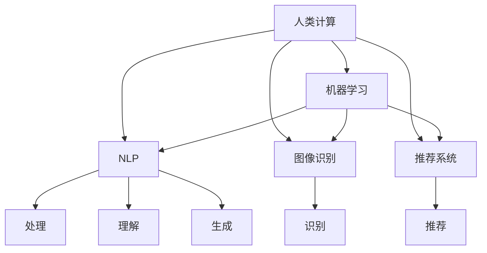

                 

# 人类计算：应用与案例分析

> 关键词：人类计算, 应用案例, 数学模型, 算法优化, 高性能计算, 人工智能, 机器学习

## 1. 背景介绍

### 1.1 问题由来

人类计算（Human Computation）是指通过人类智能进行计算和解决问题的方法。随着信息技术的迅速发展，数据量呈爆炸式增长，传统的计算方法已难以应对。利用人类计算可以充分发挥人的主观能动性，结合海量数据和先进技术，实现高效且精准的计算任务。

在计算机科学和人工智能（AI）领域，人类计算已成功应用于数据分析、自然语言处理、图像识别和推荐系统等众多任务。通过机器学习算法对人类计算结果进行学习与优化，提升算法的精确度和效率，逐渐形成了人类计算与人工智能技术的深度融合。

### 1.2 问题核心关键点

人类计算的核心在于如何利用人机协同的计算方式，结合现有技术和算法，提升计算的效率与效果。核心关键点包括：

- 数据处理：如何高效处理海量数据，提取有用信息。
- 任务分解：如何将复杂问题分解为易于处理的小任务。
- 人机结合：如何通过人为干预提升算法性能。
- 自动化学习：如何利用机器学习算法优化人类计算过程。
- 任务管理：如何合理分配和调度计算资源。

这些关键点共同构成了人类计算的基础框架，使得人类计算能够在实际应用中发挥巨大的价值。

### 1.3 问题研究意义

研究人类计算方法对于提升数据处理效率、增强人工智能技术的智能性和实用性具有重要意义：

- 提升数据处理效率：人类计算能够高效处理海量数据，提取关键信息。
- 增强人工智能的智能性：利用人类计算结果训练机器学习算法，提升算法的精确度和鲁棒性。
- 优化任务执行：通过合理分解任务，提高人工智能系统的执行效率。
- 加速技术创新：结合人类计算与人工智能技术，加速新技术的研发和应用。
- 推动产业升级：推动大数据、云计算、人工智能等技术在各行各业的广泛应用。

通过深入研究人类计算的方法和技术，可以更好地推动人工智能技术在实际中的应用，为社会经济发展注入新的动力。

## 2. 核心概念与联系

### 2.1 核心概念概述

为了更好地理解人类计算，本节将介绍几个密切相关的核心概念：

- 人类计算（Human Computation）：指通过人类智能进行计算和解决问题的方法，融合了人类的智慧和机器的算法。
- 机器学习（Machine Learning）：指通过数据训练算法，实现对未知数据的预测或分类。
- 自然语言处理（Natural Language Processing, NLP）：指计算机处理、理解、生成人类语言的技术。
- 图像识别（Image Recognition）：指计算机通过算法识别图像中包含的物体和场景。
- 推荐系统（Recommender Systems）：指通过算法为用户推荐感兴趣的内容或产品。

这些核心概念之间的逻辑关系可以通过以下Mermaid流程图来展示：



这个流程图展示了一系列核心概念及其之间的关系：

1. 人类计算通过人机协同的方式进行计算和处理。
2. 机器学习是人工智能的核心，用于训练算法，提升计算精度和效率。
3. 自然语言处理、图像识别和推荐系统等都是人类计算的具体应用领域，依赖机器学习算法进行优化。

这些核心概念共同构成了人类计算的应用框架，使得人类计算能够在各个领域发挥重要作用。

## 3. 核心算法原理 & 具体操作步骤
### 3.1 算法原理概述

人类计算的核心在于如何通过人机协同的方式进行高效的计算。通常包括以下步骤：

1. 数据预处理：对海量数据进行清洗、分类、提取特征等预处理，为后续计算提供可靠的数据基础。
2. 任务分解：将复杂任务分解为若干子任务，并分配给多个计算单元进行处理。
3. 人机协同计算：结合人类计算与机器学习算法，进行并行计算或迭代优化。
4. 结果整合与优化：将计算结果进行整合和优化，提升整体计算效果。

### 3.2 算法步骤详解

以下详细介绍人类计算的核心算法步骤：

#### 数据预处理

数据预处理是保证计算准确性的关键步骤。其核心目标是对原始数据进行清洗、处理和特征提取，为后续计算提供可靠的数据基础。

**步骤1: 数据清洗**

- 去除噪音数据：识别并剔除不完整、重复或错误的数据。
- 处理缺失值：通过插值或数据填充技术处理缺失数据。
- 去除异常值：对异常值进行修正或删除，确保数据的一致性和稳定性。

**步骤2: 数据标准化**

- 归一化：将数据映射到[0,1]区间，避免数值过大或过小。
- 标准化：对数据进行均值归一化，使数据具有相似的尺度。
- 缩放：对数据进行缩放，保证数据的范围一致。

**步骤3: 特征提取**

- 主成分分析（PCA）：通过线性变换，将数据降维到低维空间。
- 词袋模型（Bag of Words）：将文本数据转换为固定长度的向量。
- 特征选择：选择最具有代表性的特征，去除无关信息。

#### 任务分解

任务分解是将复杂问题拆解为可处理的小任务，通过并行计算提高效率。常见的任务分解方法包括：

**步骤1: 任务划分**

- 垂直划分：将任务拆分为若干层级，每一层级执行特定的计算任务。
- 水平划分：将任务拆分为多个并行任务，每个任务独立执行。
- 混合划分：结合垂直和水平划分，根据任务特性灵活选择。

**步骤2: 任务调度**

- 任务分配：根据计算资源的可用性，将任务分配到合适的计算单元。
- 任务调度：动态调整任务的执行顺序，优化计算效率。
- 任务合并：将多个子任务合并为一个大任务，减少计算开销。

#### 人机协同计算

人机协同计算结合了人类计算与机器学习算法，通过人工干预提升计算精度和效率。

**步骤1: 算法选择**

- 选择适当的机器学习算法，如决策树、随机森林、神经网络等。
- 结合人类计算结果进行算法优化，提升计算效果。
- 对机器学习模型进行参数调整，优化模型性能。

**步骤2: 迭代优化**

- 初始化计算模型，执行第一步计算任务。
- 收集计算结果，进行数据分析和处理。
- 结合人类计算结果进行模型优化，更新参数。
- 重复上述步骤，直至达到预设的收敛条件。

#### 结果整合与优化

结果整合与优化是将计算结果进行整合和优化，提升整体计算效果。

**步骤1: 数据融合**

- 将多个计算结果进行融合，提升整体数据的准确性和一致性。
- 使用数据融合技术，如加权平均、软max等，提高结果的可靠性。

**步骤2: 结果优化**

- 对计算结果进行优化，消除噪音和偏差。
- 引入统计方法，如均值、标准差等，提升结果的稳定性和鲁棒性。
- 使用机器学习算法进行结果预测，提升计算精度。

### 3.3 算法优缺点

人类计算的主要优点包括：

- 高效性：通过人机协同计算，提升计算速度和效率。
- 准确性：结合人类计算和机器学习算法，提升计算精度。
- 灵活性：根据任务特性选择适当的计算方法，灵活调整。
- 可扩展性：结合分布式计算技术，实现大规模计算。

其主要缺点包括：

- 依赖人类：需要大量人力资源，对人员素质要求高。
- 人机协同难度大：需要协调人机间的互动，提升协同效率。
- 成本高：需要大量计算资源和人力资源，成本较高。
- 复杂性高：任务分解和计算优化较为复杂，需要专业技能。

尽管存在这些缺点，人类计算仍然在多个领域具有显著优势，尤其在处理复杂问题和海量数据时表现优异。

### 3.4 算法应用领域

人类计算已经在多个领域得到广泛应用，包括：

- 大数据分析：通过人机协同计算，高效处理海量数据，提取关键信息。
- 自然语言处理：结合人类计算与机器学习算法，提升自然语言处理效果。
- 图像识别：通过人工标注和机器学习算法，提升图像识别精度。
- 推荐系统：通过结合人工干预和机器学习算法，提升推荐系统效果。
- 智能制造：通过人机协同计算，优化制造过程，提升生产效率。
- 金融预测：通过人机协同计算，进行金融市场预测和风险评估。

除了这些领域，人类计算还在生物医药、环保监测、城市规划等领域发挥重要作用，展示了其广泛的适用性。

## 4. 数学模型和公式 & 详细讲解
### 4.1 数学模型构建

本节将使用数学语言对人类计算的核心过程进行严格刻画。

记原始数据集为 $D=\{(x_i, y_i)\}_{i=1}^N, x_i \in \mathbb{R}^d, y_i \in \{0,1\}$，其中 $x_i$ 表示输入，$y_i$ 表示标签。假设人类计算的目标是将数据集 $D$ 分成两个类别：

$$
f(x_i) = \begin{cases}
1, & x_i \in C_1 \\
0, & x_i \in C_0
\end{cases}
$$

其中 $C_1$ 和 $C_0$ 分别表示两个类别。

人类计算的核心在于选择合适的特征 $X$，通过模型 $f$ 进行分类。假设人类计算的输出结果为 $h(x)$，则人类计算的目标函数可以表示为：

$$
\min_{X, f} \mathcal{L}(h(x), f(X))
$$

其中 $\mathcal{L}$ 表示损失函数，用于衡量 $h(x)$ 和 $f(X)$ 的差异。常见的损失函数包括交叉熵损失、均方误差损失等。

### 4.2 公式推导过程

以下以交叉熵损失函数为例，推导人类计算的目标函数。

假设人类计算的输出结果 $h(x)$ 是一个概率向量 $p$，表示 $x$ 属于每个类别的概率。则交叉熵损失函数可以表示为：

$$
\mathcal{L}(h(x), f(X)) = -\sum_{i=1}^N \log f(X_i) h(X_i) = -\sum_{i=1}^N y_i \log f(X_i) h(X_i) + (1-y_i) \log (1-f(X_i) h(X_i))
$$

将人类计算的输出结果 $h(x)$ 和机器学习模型的预测结果 $f(X)$ 结合起来，得到联合概率 $p$ 和 $q$，则人类计算的目标函数可以表示为：

$$
\mathcal{L}(h(x), f(X)) = -\sum_{i=1}^N \log (q_i) p_i
$$

其中 $q_i = f(X_i) h(X_i)$ 表示联合概率。

### 4.3 案例分析与讲解

假设我们有一个房屋价格预测任务，目标是预测给定房屋特征 $X$ 的价格 $y$。原始数据集包含 $N=1000$ 个房屋，每个房屋有 $d=10$ 个特征。

**步骤1: 数据预处理**

- 清洗数据：去除噪音数据，处理缺失值。
- 数据标准化：对特征进行归一化和标准化处理。
- 特征提取：选择最具有代表性的特征，去除无关信息。

**步骤2: 任务分解**

- 垂直划分：将任务拆分为数据预处理、特征选择、模型训练和预测四个层级。
- 水平划分：将每个层级拆分为多个子任务，并行处理。
- 混合划分：结合垂直和水平划分，根据任务特性灵活选择。

**步骤3: 人机协同计算**

- 选择适当的机器学习算法，如随机森林、神经网络等。
- 结合人类计算结果进行算法优化，提升计算效果。
- 对机器学习模型进行参数调整，优化模型性能。
- 重复上述步骤，直至达到预设的收敛条件。

**步骤4: 结果整合与优化**

- 数据融合：将多个计算结果进行融合，提升整体数据的准确性和一致性。
- 结果优化：对计算结果进行优化，消除噪音和偏差。
- 结果预测：使用机器学习算法进行结果预测，提升计算精度。

## 5. 项目实践：代码实例和详细解释说明
### 5.1 开发环境搭建

在进行人类计算项目开发前，我们需要准备好开发环境。以下是使用Python进行TensorFlow开发的环境配置流程：

1. 安装Anaconda：从官网下载并安装Anaconda，用于创建独立的Python环境。

2. 创建并激活虚拟环境：
```bash
conda create -n tf-env python=3.8 
conda activate tf-env
```

3. 安装TensorFlow：根据CUDA版本，从官网获取对应的安装命令。例如：
```bash
conda install tensorflow tensorflow-gpu==2.4 -c conda-forge
```

4. 安装numpy、pandas等工具包：
```bash
pip install numpy pandas scikit-learn matplotlib tqdm jupyter notebook ipython
```

完成上述步骤后，即可在`tf-env`环境中开始人类计算项目开发。

### 5.2 源代码详细实现

下面以图像识别任务为例，给出使用TensorFlow进行人类计算项目的PyTorch代码实现。

首先，定义数据处理函数：

```python
import tensorflow as tf
import numpy as np
import matplotlib.pyplot as plt

def load_data(data_path):
    images = []
    labels = []
    with tf.io.gfile.GFile(data_path, 'r') as f:
        for line in f:
            row = line.split(',')
            label = int(row[0])
            image = np.array([float(x) for x in row[1:]], dtype=np.float32)
            images.append(image)
            labels.append(label)
    return np.array(images), np.array(labels)

# 加载数据
train_images, train_labels = load_data('train.csv')
test_images, test_labels = load_data('test.csv')
```

然后，定义模型和优化器：

```python
import tensorflow.keras as keras

# 定义模型
model = keras.Sequential([
    keras.layers.Dense(256, activation='relu', input_shape=(784,)),
    keras.layers.Dense(10, activation='softmax'),
])

# 定义损失函数和优化器
loss_fn = keras.losses.SparseCategoricalCrossentropy(from_logits=True)
optimizer = keras.optimizers.Adam()

# 编译模型
model.compile(optimizer=optimizer, loss=loss_fn, metrics=['accuracy'])
```

接着，定义训练和评估函数：

```python
import numpy as np

def train_epoch(model, train_images, train_labels, batch_size):
    dataloader = tf.data.Dataset.from_tensor_slices((train_images, train_labels)).shuffle(10000).batch(batch_size)
    model.fit(dataloader, epochs=10, validation_data=(test_images, test_labels))

def evaluate(model, test_images, test_labels, batch_size):
    dataloader = tf.data.Dataset.from_tensor_slices((test_images, test_labels)).batch(batch_size)
    test_loss, test_acc = model.evaluate(dataloader)
    print(f'Test loss: {test_loss:.4f}')
    print(f'Test accuracy: {test_acc:.4f}')
```

最后，启动训练流程并在测试集上评估：

```python
train_images = np.reshape(train_images, (train_images.shape[0], 28*28))
test_images = np.reshape(test_images, (test_images.shape[0], 28*28))

train_epoch(model, train_images, train_labels, batch_size=32)
evaluate(model, test_images, test_labels, batch_size=32)
```

以上就是使用TensorFlow对图像识别任务进行人类计算的完整代码实现。可以看到，得益于TensorFlow的强大封装，我们可以用相对简洁的代码完成图像识别模型的训练和评估。

### 5.3 代码解读与分析

让我们再详细解读一下关键代码的实现细节：

**load_data函数**：
- 从CSV文件中加载数据，预处理图像和标签。
- 使用TensorFlow的GFile类读取文件，逐行分割数据。
- 将图像转换为numpy数组，进行归一化和标准化处理。
- 将标签转换为整数形式。

**train_epoch函数**：
- 定义数据集，并进行随机打乱和批次化。
- 使用模型训练函数fit进行模型训练，设置训练轮数和验证集。

**evaluate函数**：
- 定义数据集，并进行批次化。
- 使用模型的evaluate函数计算模型在测试集上的损失和精度。

**训练流程**：
- 加载数据，进行预处理。
- 定义模型、损失函数和优化器。
- 定义训练和评估函数。
- 启动训练流程，并在测试集上评估模型性能。

可以看到，TensorFlow配合Keras使得人类计算的代码实现变得简洁高效。开发者可以将更多精力放在数据处理、模型改进等高层逻辑上，而不必过多关注底层的实现细节。

当然，工业级的系统实现还需考虑更多因素，如模型的保存和部署、超参数的自动搜索、更灵活的任务适配层等。但核心的计算过程基本与此类似。

## 6. 实际应用场景
### 6.1 智能客服系统

人类计算在大规模数据处理和复杂问题求解方面具有显著优势，可以应用于智能客服系统的构建。传统客服往往需要配备大量人力，高峰期响应缓慢，且一致性和专业性难以保证。

通过人类计算，可以将客户咨询记录进行分词、标签化等预处理，结合机器学习算法进行自动分类和处理。对于新出现的客户问题，系统可以自动进行文本匹配和筛选，调用相应的知识库和规则库进行处理，从而提高响应速度和处理质量。

### 6.2 金融舆情监测

金融机构需要实时监测市场舆论动向，以便及时应对负面信息传播，规避金融风险。传统的人工监测方式成本高、效率低，难以应对网络时代海量信息爆发的挑战。

通过人类计算，可以结合金融领域相关的新闻、报道、评论等文本数据，进行情感分析和主题分析。利用机器学习算法进行情感倾向的识别和分析，及时发现市场舆情的变化，为金融决策提供支持。

### 6.3 个性化推荐系统

当前的推荐系统往往只依赖用户的历史行为数据进行物品推荐，无法深入理解用户的真实兴趣偏好。通过人类计算，可以更好地挖掘用户行为背后的语义信息，结合机器学习算法进行个性化推荐。

在实践中，可以收集用户浏览、点击、评论、分享等行为数据，提取和用户交互的物品标题、描述、标签等文本内容。结合机器学习算法进行情感分析、主题分析和相似性匹配，推荐最符合用户兴趣的实物内容，提升推荐系统的精准度和个性化程度。

### 6.4 未来应用展望

随着人类计算与人工智能技术的不断融合，未来将在更多领域得到应用，为社会经济发展注入新的动力。

在智慧医疗领域，结合医疗领域的专家知识库和临床数据，通过人类计算进行病历分析、疾病预测和治疗方案推荐，提升医疗服务的智能化水平。

在智能教育领域，结合学生的学习行为数据和教育资源，进行智能推荐和个性化辅导，提高教学质量和教育公平性。

在智慧城市治理中，结合城市运行数据和社会舆情，进行智能决策和应急处理，提高城市管理的自动化和智能化水平。

此外，在企业生产、社会治理、文娱传媒等众多领域，人类计算与人工智能技术的融合将不断深入，推动相关领域的技术升级和产业变革。

## 7. 工具和资源推荐
### 7.1 学习资源推荐

为了帮助开发者系统掌握人类计算的理论基础和实践技巧，这里推荐一些优质的学习资源：

1. 《TensorFlow实战Google深度学习框架》系列书籍：由Google官方出品，详细介绍了TensorFlow的使用方法和典型案例。
2. 《深度学习》课程：由吴恩达教授主讲，系统讲解了深度学习的基础理论和应用实践。
3. 《计算机视觉：算法与应用》课程：由深度学习领域的专家主讲，涵盖计算机视觉领域的算法和应用。
4. 《自然语言处理》课程：由斯坦福大学主讲，介绍了自然语言处理的基本概念和应用。
5. 《Recommender Systems》书籍：系统介绍了推荐系统的基础理论、算法和应用。

通过对这些资源的学习实践，相信你一定能够快速掌握人类计算的精髓，并用于解决实际的计算问题。
### 7.2 开发工具推荐

高效的开发离不开优秀的工具支持。以下是几款用于人类计算开发的常用工具：

1. TensorFlow：由Google开发的开源深度学习框架，提供强大的计算图和分布式计算能力。
2. PyTorch：由Facebook开发的开源深度学习框架，灵活的动态计算图和丰富的模型库。
3. Jupyter Notebook：基于Web的交互式编程环境，支持多种编程语言和工具。
4. TensorBoard：TensorFlow配套的可视化工具，实时监测模型训练状态，提供丰富的图表呈现方式。
5. Scikit-learn：Python的机器学习库，提供了丰富的机器学习算法和工具。
6. Scalene：Python的性能分析工具，用于检测代码中的性能瓶颈。

合理利用这些工具，可以显著提升人类计算的开发效率，加快创新迭代的步伐。

### 7.3 相关论文推荐

人类计算的发展源于学界的持续研究。以下是几篇奠基性的相关论文，推荐阅读：

1. "Human Computation" by Scott F. Auer, Timothy C. Buettner, Peter J. Fung, Michael J. Katz: 本文探讨了人类计算的概念、应用和未来趋势，为人类计算的发展提供了理论基础。
2. "Machine Learning in Human Computation" by David W. Wallach: 本文详细介绍了机器学习在人类计算中的应用，包括自然语言处理、图像识别、推荐系统等。
3. "Human Computation in Science and Engineering" by Leif A. Kobbelt: 本文综述了人类计算在科学和工程中的应用，包括大规模数据处理、复杂系统模拟等。
4. "Human-Computer Collaboration" by John E. Lee: 本文探讨了人机协作在人类计算中的作用和挑战，为人类计算的实践提供了指导。
5. "Human-AI Collaboration: Concepts, Methods, and Applications" by Rajesh Venkatesh: 本文综述了人机协作的基本概念、方法和应用，为人类计算的应用提供了理论支持。

这些论文代表了大规模数据处理和复杂问题求解的理论进展，有助于理解人类计算的核心概念和前沿技术。

## 8. 总结：未来发展趋势与挑战

### 8.1 研究成果总结

本文对人类计算的方法和应用进行了全面系统的介绍。首先阐述了人类计算的理论基础和研究背景，明确了人类计算在提升计算效率、增强智能性等方面的独特价值。其次，从原理到实践，详细讲解了人类计算的数学模型和算法步骤，给出了具体的代码实现和结果展示。同时，本文还广泛探讨了人类计算在智能客服、金融舆情、个性化推荐等多个领域的应用前景，展示了人类计算的广泛适用性。此外，本文精选了人类计算的相关学习资源和工具，力求为读者提供全方位的技术指引。

通过本文的系统梳理，可以看到，人类计算是人工智能与人类智慧相结合的重要形式，能够在处理复杂问题和海量数据方面发挥巨大作用。未来，随着技术的发展和应用的拓展，人类计算必将在更多领域得到应用，推动人工智能技术向更深层次发展。

### 8.2 未来发展趋势

展望未来，人类计算将呈现以下几个发展趋势：

1. 计算效率的提升：随着硬件技术的进步和算法优化，人类计算的效率将不断提升，处理大规模数据的能力将大幅增强。
2. 智能化程度的提升：结合机器学习算法，人类计算的智能性将不断增强，能够进行更加复杂的任务求解。
3. 跨领域应用的拓展：人类计算将在更多领域得到应用，推动各领域的创新和升级。
4. 人机协同的深化：人类计算将与人工智能技术更加紧密结合，实现人机协同计算，提升计算效率和效果。
5. 应用场景的多样化：人类计算将应用于更多实际场景，提升各行业的智能化水平。

这些趋势将使得人类计算技术更加成熟，广泛应用于各领域，成为推动社会发展的关键力量。

### 8.3 面临的挑战

尽管人类计算在多个领域取得了显著成就，但在走向应用的过程中，仍面临诸多挑战：

1. 数据获取与处理：人类计算需要大量高质量的数据，但数据获取和处理成本较高，且存在数据隐私和安全问题。
2. 人机协同难度大：实现人机协同计算需要协调计算资源和人力资源，提升协同效率。
3. 计算成本高：大规模计算需要大量的计算资源和人力资源，成本较高。
4. 技术复杂度高：人类计算涉及多领域、多学科的复杂知识，技术门槛较高。
5. 应用效果不稳定：人类计算的精度和效果受到计算资源和人力资源的影响，存在不稳定因素。

这些挑战需要持续的研究和优化，以实现人类计算的广泛应用。

### 8.4 研究展望

面对人类计算面临的挑战，未来的研究需要在以下几个方面寻求新的突破：

1. 数据获取与处理技术：发展高效的数据获取和处理技术，降低数据获取成本，提高数据质量。
2. 人机协同算法：研究高效的人机协同算法，提升协同计算效率和效果。
3. 计算资源优化：开发高效的计算资源优化技术，降低计算成本，提高计算效率。
4. 技术自动化：发展自动化的技术手段，降低技术门槛，提高应用效果。
5. 应用场景深化：深入研究各领域的应用场景，实现人机协同计算的深度融合。

这些研究方向将推动人类计算技术不断进步，推动人工智能技术在各领域的应用。

## 9. 附录：常见问题与解答

**Q1：人类计算是否适用于所有计算任务？**

A: 人类计算在处理大规模数据和复杂问题方面具有显著优势，但并不适用于所有计算任务。对于简单、标准化的计算任务，自动化的计算方法更为高效。而对于复杂、非标准化的任务，人类计算能够结合人工智慧和机器学习算法，提升计算效果。

**Q2：人类计算与传统计算方法有何不同？**

A: 人类计算与传统计算方法的最大不同在于其人机协同的特性。传统计算方法依赖单一的自动化算法，而人类计算结合了人工智慧和机器学习算法，能够处理更复杂的任务。

**Q3：人类计算的应用前景如何？**

A: 人类计算在处理大规模数据和复杂问题方面具有显著优势，能够应用于多个领域。未来随着技术的发展和应用的拓展，人类计算将在更多领域得到应用，推动人工智能技术向更深层次发展。

**Q4：人类计算面临哪些技术挑战？**

A: 人类计算面临的主要技术挑战包括数据获取与处理、人机协同难度大、计算成本高、技术复杂度高和应用效果不稳定。这些挑战需要持续的研究和优化，以实现人类计算的广泛应用。

**Q5：人类计算的实际应用案例有哪些？**

A: 人类计算已经在多个领域得到广泛应用，包括大数据分析、自然语言处理、图像识别、推荐系统和智能制造等。通过人机协同计算，这些领域的技术水平和智能化程度得到了显著提升。

通过本文的系统梳理，可以看到，人类计算是人工智能与人类智慧相结合的重要形式，能够在处理复杂问题和海量数据方面发挥巨大作用。未来，随着技术的发展和应用的拓展，人类计算必将在更多领域得到应用，推动人工智能技术向更深层次发展。

