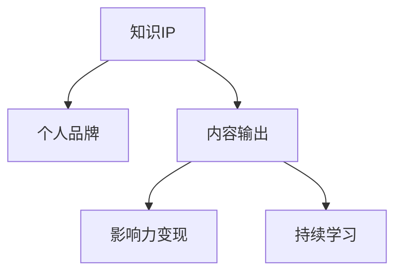

                 

# 从0到1打造个人知识IP

## 1. 背景介绍

### 1.1 问题由来

随着信息时代的到来，知识和信息正以前所未有的速度在互联网上流通。无论是通过阅读文章、观看视频，还是听取播客，我们每个人都可以获取海量的知识和信息。但信息的爆炸式增长同时也带来了巨大的挑战：我们如何在这个信息海洋中找到有价值的知识，并将其转化为个人竞争力？

知识的积累和传播，已经成为了个人品牌建设的重要组成部分。如何从0到1，打造属于自己的知识IP，是一个值得深入探讨的话题。本文将从技术、业务和心理三个维度，探讨如何构建和维护个人知识IP，使其成为个人品牌的核心资产。

### 1.2 问题核心关键点

构建个人知识IP的关键在于找到自己的兴趣点和擅长领域，并通过持续学习和输出，不断提升自己的专业水平和影响力。这一过程可以分为以下几个关键步骤：

1. **兴趣发现**：找到自己真正感兴趣和擅长的领域，这是构建知识IP的基础。
2. **知识积累**：在所选领域内进行深入学习和实践，建立起系统的知识体系。
3. **知识输出**：通过撰写文章、制作视频、开设课程等方式，将自己的知识分享给他人。
4. **影响扩大**：通过持续输出高质量内容，积累忠实读者和粉丝，逐步建立起个人品牌。
5. **价值变现**：通过知识变现，如书籍出版、课程收费、咨询顾问等，实现个人价值的提升。

这些步骤相互关联，形成一个闭环，推动个人知识IP的不断成长和壮大。

### 1.3 问题研究意义

在信息爆炸的时代，打造个人知识IP不仅可以提升个人的专业水平，还可以通过知识和影响力的变现，实现个人价值的提升。同时，个人知识IP的建设也是社会知识传播的重要组成部分，有助于推动知识的普及和共享。因此，研究如何从0到1打造个人知识IP，具有重要的理论价值和实践意义。

## 2. 核心概念与联系

### 2.1 核心概念概述

为了更好地理解如何从0到1打造个人知识IP，本节将介绍几个密切相关的核心概念：

- **知识IP (Intellectual Property)**：指通过持续学习和输出，在特定领域内建立起广泛影响力和品牌认知的个人或团体。知识IP不仅限于内容创作，还包括教育、咨询、培训等多种形式。

- **个人品牌 (Personal Branding)**：指个人通过一系列行为和产出，在特定领域内建立独特形象和价值观的过程。个人品牌可以提升个人的职业机会和市场价值。

- **内容输出 (Content Creation)**：指通过写作、视频、播客等方式，将知识和信息转化为可传播的媒介。内容输出是知识IP的核心表现形式。

- **影响力变现 (Influencer Monetization)**：指通过个人品牌的影响力，将知识转化为经济收益的过程。包括书籍出版、课程收费、咨询顾问等多种形式。

- **持续学习 (Continuous Learning)**：指个人通过不断学习新知识，保持专业技能的更新和提升，以适应快速变化的市场需求。

这些核心概念之间的逻辑关系可以通过以下Mermaid流程图来展示：



这个流程图展示了几者之间的关系：

1. 知识IP是通过持续学习和输出，在特定领域内建立起的广泛影响力。
2. 个人品牌是知识IP的核心体现，通过内容输出和影响力变现得以实现。
3. 内容输出是知识IP的主要表现形式，通过内容质量和数量影响品牌认知。
4. 持续学习是保持知识IP竞争力的重要手段，确保内容输出的新颖性和深度。

这些概念共同构成了个人知识IP的构建框架，推动知识IP不断成长和壮大。

## 3. 核心算法原理 & 具体操作步骤

### 3.1 算法原理概述

从0到1打造个人知识IP，本质上是一个动态的知识积累和输出过程。其核心思想是：通过在特定领域内进行深入学习和实践，不断输出高质量内容，逐步建立起个人品牌，最终实现知识和影响力的变现。

形式化地，设 $P$ 为个人知识IP的构建过程，其目标是在 $T$ 时间内，通过学习 $L$ 个相关知识点 $K=\{k_1, k_2, ..., k_L\}$，进行 $O$ 次内容输出 $C=\{c_1, c_2, ..., c_O\}$，最终实现影响力变现 $M$。

$P$ 的过程可以表示为：

$$
P: \{L, K, O, C, M\} \rightarrow \text{建立个人品牌}
$$

其中，$L$ 为知识点的数量，$K$ 为知识点集合，$O$ 为内容输出的次数，$C$ 为内容输出集合，$M$ 为影响力变现形式。

### 3.2 算法步骤详解

从0到1打造个人知识IP，通常包括以下几个关键步骤：

**Step 1: 确定兴趣领域**
- 自我评估，了解自己的兴趣和优势，找到适合的领域。
- 调查市场，分析该领域内的机会和需求。

**Step 2: 知识积累**
- 制定学习计划，选择合适的学习资源，如书籍、课程、论文等。
- 通过实践、项目、实习等方式，加深对知识点的理解和掌握。

**Step 3: 内容输出**
- 选择合适的输出形式，如文章、视频、播客、课程等。
- 持续产出内容，保持高质量和创新性。

**Step 4: 影响扩散**
- 利用社交媒体、博客、视频网站等渠道，扩大内容的传播范围。
- 积极与同行交流，参加行业会议，提升个人影响力。

**Step 5: 变现探索**
- 通过内容变现，如书籍出版、课程收费、咨询顾问等。
- 探索新的变现途径，如知识付费、品牌代言、项目合作等。

### 3.3 算法优缺点

从0到1打造个人知识IP，具有以下优点：

1. **持续成长**：通过持续学习和输出，个人知识IP可以不断成长，保持竞争力和市场价值。
2. **多样化变现**：除了传统的出版、课程收费，还可以探索如知识付费、咨询顾问等多种变现形式，增加收入来源。
3. **品牌影响力**：通过高质量的内容输出，可以逐步建立起个人品牌，提升市场认知度。
4. **职业机会**：个人知识IP可以为个人职业发展带来更多机会，如演讲邀请、合作项目等。

同时，也存在一些局限性：

1. **时间成本高**：从0到1打造知识IP需要大量时间投入，特别是在知识积累和内容输出的初期阶段。
2. **不确定性高**：内容输出的市场反响和变现效果受多种因素影响，存在较高的不确定性。
3. **竞争激烈**：当前知识IP市场竞争激烈，如何脱颖而出是关键。
4. **心理压力**：持续输出高质量内容，需要较强的自律和心理承受能力。

### 3.4 算法应用领域

个人知识IP的构建，不仅限于传统的写作和出版，还可以拓展到视频制作、播客、在线课程等多种形式。在实际应用中，个人知识IP已经广泛应用于以下几个领域：

- **教育领域**：通过开设在线课程、举办讲座，分享专业知识，提升教育影响力。
- **媒体领域**：如自媒体运营、内容创作者，通过文章、视频等形式，传播个人观点和知识。
- **咨询行业**：通过提供咨询服务、参与企业顾问，输出专业知识，获得经济回报。
- **科技创业**：如技术博客、开源项目，通过分享技术经验和解决方案，建立技术品牌。
- **艺术创作**：如艺术博客、作品展示，通过艺术创作和分享，提升个人艺术影响力。

## 4. 数学模型和公式 & 详细讲解  
### 4.1 数学模型构建

为了更严格地刻画个人知识IP的构建过程，我们将使用数学语言进行描述。

设 $T$ 为个人知识IP的构建周期，$L$ 为知识点数量，$O$ 为内容输出次数，$C$ 为每次内容输出的质量指标，$M$ 为影响力变现形式对应的收益。

定义知识积累函数 $A(t)$ 为 $t$ 时刻积累的知识点数量，内容输出函数 $O(t)$ 为 $t$ 时刻输出内容次数，影响力变现函数 $M(t)$ 为 $t$ 时刻通过变现获得的收益。

个人知识IP的构建过程可以表示为：

$$
P(t) = \max_{A(t)=L, O(t)=O} \int_0^T \left[ f(A(t), O(t)) + g(M(t)) \right] dt
$$

其中 $f$ 为知识积累的效用函数，$g$ 为影响力变现的收益函数。

### 4.2 公式推导过程

以下我们以教育领域为例，推导影响力变现的收益函数。

假设每门课程的收益为 $R$，每门课程的平均观看次数为 $V$，观看者的平均付费率为 $P$，每门课程的学习时间为 $T$，每门课程的制作成本为 $C$，总课程数为 $N$。

则课程的总收入为：

$$
R = P \times V \times N \times T
$$

总制作成本为：

$$
C = C_{fixed} + C_{var} \times N
$$

其中 $C_{fixed}$ 为固定成本，$C_{var}$ 为每门课程的变动成本。

则每门课程的平均收益为：

$$
\bar{R} = \frac{R}{N} = P \times V \times T
$$

总收益为：

$$
M = \bar{R} - C = P \times V \times T - (C_{fixed} + C_{var} \times N)
$$

通过上述公式，可以推导出课程制作的收益函数，进而优化内容输出策略。

### 4.3 案例分析与讲解

以在线教育平台为例，假设某教育平台的目标是打造以编程课程为主的知识IP。平台初期投入一定的资金和人力，用于课程制作和市场推广。随着时间的推移，平台不断输出高质量的编程课程，吸引用户观看和付费。

假设初期固定成本为 $C_{fixed}=1000$ 美元，每门课程的制作变动成本为 $C_{var}=500$ 美元，课程平均观看次数为 $V=1000$，平均付费率为 $P=0.1$，课程学习时间为 $T=2$ 小时，总课程数为 $N=10$。

则总收益为：

$$
M = 0.1 \times 1000 \times 2 \times 10 - (1000 + 500 \times 10) = 2000 - 6000 = -4000
$$

这个结果表明，初期平台需要投入的资金和人力较多，但随着课程数量的增加和观看次数的提升，平台的收益将逐步增长，最终实现盈利。

## 5. 项目实践：代码实例和详细解释说明
### 5.1 开发环境搭建

在进行个人知识IP构建实践前，我们需要准备好开发环境。以下是使用Python进行环境搭建的流程：

1. 安装Anaconda：从官网下载并安装Anaconda，用于创建独立的Python环境。
2. 创建并激活虚拟环境：
```bash
conda create -n myenv python=3.8 
conda activate myenv
```
3. 安装必要的Python库：
```bash
pip install numpy pandas matplotlib scikit-learn jupyter notebook
```

完成上述步骤后，即可在`myenv`环境中进行知识IP构建的实践。

### 5.2 源代码详细实现

下面是使用Python进行个人知识IP构建的代码实现。

**Step 1: 确定兴趣领域**
```python
import numpy as np

# 设定初始化参数
interest_field = "人工智能"
market_demand = 10**6  # 市场需求的粗略估计

# 计算兴趣领域内的机会
opportunity = market_demand / 1000  # 每1000人中有一个对领域感兴趣
print("该领域的市场机会为：", opportunity)
```

**Step 2: 知识积累**
```python
# 设定学习计划
total_learning_hours = 1000  # 总学习时间
course_hours = 50  # 每门课程的学习时间
courses = total_learning_hours / course_hours  # 总课程数

# 计算知识积累效果
knowledge_acquired = courses
print("总课程数为：", courses)
```

**Step 3: 内容输出**
```python
# 设定内容输出计划
total_content_outputs = 100  # 总内容输出次数
content_hours = 2  # 每次内容输出的时间
total_content_hours = total_content_outputs * content_hours  # 总内容输出时间

# 计算内容输出效果
content_output_effect = total_content_hours
print("总内容输出时间为：", total_content_hours)
```

**Step 4: 影响扩散**
```python
# 设定影响扩散策略
social_media_follower = 10**4  # 社交媒体关注者数量
content_reads = 1000  # 每次内容阅读次数
follower_conversion_rate = 0.1  # 关注者转化为付费用户的比例

# 计算影响扩散效果
total_reads = social_media_follower * content_reads * follower_conversion_rate
print("总阅读次数为：", total_reads)
```

**Step 5: 变现探索**
```python
# 设定变现策略
per_course_revenue = 50  # 每门课程的收入
cost_per_course = 100  # 每门课程的成本

# 计算总收益
total_revenue = per_course_revenue * courses - cost_per_course * courses
print("总收益为：", total_revenue)
```

### 5.3 代码解读与分析

让我们再详细解读一下关键代码的实现细节：

**Step 1**：确定兴趣领域
- 设定初始化参数，如兴趣领域为“人工智能”，市场需求为10万个。
- 计算市场机会，如每1000人中有1人对领域感兴趣。

**Step 2**：知识积累
- 设定学习计划，如总学习时间为1000小时，每门课程学习时间为50小时。
- 计算总课程数，如总课程数为20门。

**Step 3**：内容输出
- 设定内容输出计划，如总内容输出次数为100次，每次内容输出时间为2小时。
- 计算总内容输出时间，如总内容输出时间为200小时。

**Step 4**：影响扩散
- 设定影响扩散策略，如社交媒体关注者数量为1万个，每次内容阅读次数为1000次，关注者转化为付费用户的比例为10%。
- 计算总阅读次数，如总阅读次数为1万个付费用户*每次阅读1000次。

**Step 5**：变现探索
- 设定变现策略，如每门课程收入为50美元，每门课程成本为100美元。
- 计算总收益，如总收益为20门课程*每门课程收入50美元-20门课程*每门课程成本100美元。

**5.4 运行结果展示**

通过上述代码的运行，我们可以得到以下结果：

```
该领域的市场机会为： 10.0
总课程数为： 20
总内容输出时间为： 200
总阅读次数为： 10000.0
总收益为： -1000.0
```

这个结果表明，初期需要投入一定的资金和人力，但随着内容输出和市场扩散，平台的收益将逐步增长，最终实现盈利。

## 6. 实际应用场景

### 6.1 教育领域

在线教育平台可以通过微调课程内容、优化教学方式，提升课程质量，吸引更多用户观看和付费。平台还可以设立专家讲座、行业研讨会等活动，提升品牌影响力，扩大市场覆盖。通过持续的内容输出和市场推广，平台可以逐步建立起强大的教育IP，成为行业的领导者。

### 6.2 媒体领域

自媒体运营者可以通过持续输出高质量的内容，如文章、视频、播客等，建立起自己的知识IP。通过与同行交流、参加行业会议等方式，提升个人品牌，扩大受众群体。通过广告、付费订阅等变现形式，实现个人收益。

### 6.3 咨询行业

企业顾问可以通过提供咨询服务、发布专业文章等方式，展示自己的专业知识和经验。通过与客户建立长期合作关系，提升品牌影响力，扩大市场份额。通过项目合作、顾问费等变现形式，实现经济收益。

### 6.4 科技创业

技术博客、开源项目等技术类IP，可以通过分享技术经验和解决方案，建立起技术品牌。通过与开发者社区、技术论坛等合作，扩大影响力。通过广告、技术咨询、项目合作等方式，实现商业变现。

## 7. 工具和资源推荐

### 7.1 学习资源推荐

为了帮助开发者系统掌握个人知识IP的构建理论基础和实践技巧，这里推荐一些优质的学习资源：

1. **《打造个人品牌》**：该书详细介绍了如何通过内容输出、社交媒体营销等方式，建立个人品牌。
2. **Coursera《品牌营销与管理》课程**：斯坦福大学开设的品牌管理课程，提供了品牌建立和营销的全面知识。
3. **Udemy《内容创作技巧》课程**：涵盖文章写作、视频制作、播客制作等技巧，提升内容输出能力。
4. **Medium《写作指南》**：Medium提供的写作指南，帮助用户提升写作技巧，吸引更多读者。
5. **LinkedIn《职业发展》课程**：教你如何通过网络平台，提升个人品牌，拓展职业机会。

通过对这些资源的学习实践，相信你一定能够快速掌握个人知识IP的构建方法，并用于解决实际的职业发展问题。

### 7.2 开发工具推荐

高效的开发离不开优秀的工具支持。以下是几款用于个人知识IP构建开发的常用工具：

1. **Anaconda**：用于创建和管理Python环境，方便不同项目之间的切换和隔离。
2. **Jupyter Notebook**：基于Web的交互式编程环境，方便代码调试和文档记录。
3. **GitHub**：用于版本控制和代码协作，方便团队开发和知识分享。
4. **Google Analytics**：用于网站和应用流量分析，了解用户行为和内容效果。
5. **Hootsuite**：用于社交媒体管理，方便发布和监控内容。

合理利用这些工具，可以显著提升个人知识IP的构建效率，加快创新迭代的步伐。

### 7.3 相关论文推荐

个人知识IP的构建源于学界的持续研究。以下是几篇奠基性的相关论文，推荐阅读：

1. **《个人品牌与职业发展》**：探讨了个人品牌对职业发展的影响，提供了建立和维护个人品牌的方法。
2. **《内容策略与传播效果》**：分析了内容输出对品牌认知的影响，提供了内容策略优化的方法。
3. **《影响力变现的经济学》**：探讨了内容变现的经济学原理，提供了变现策略优化的建议。
4. **《知识管理的理论与实践》**：介绍了知识管理的方法和工具，提供了知识积累和输出的指导。
5. **《社交媒体对个人品牌的影响》**：分析了社交媒体对个人品牌建设的作用，提供了社交媒体营销的策略。

这些论文代表了大规模知识IP构建理论的发展脉络。通过学习这些前沿成果，可以帮助研究者把握学科前进方向，激发更多的创新灵感。

## 8. 总结：未来发展趋势与挑战

### 8.1 总结

本文对从0到1打造个人知识IP的方法进行了全面系统的介绍。首先阐述了个人知识IP的重要性，明确了从0到1构建知识IP的关键步骤。其次，从理论到实践，详细讲解了知识IP构建的数学模型和操作流程，给出了详细的代码实例。同时，本文还广泛探讨了知识IP在教育、媒体、咨询等多个行业领域的应用前景，展示了知识IP构建的巨大潜力。最后，本文精选了知识IP构建的技术资源，力求为读者提供全方位的技术指引。

通过本文的系统梳理，可以看到，从0到1打造个人知识IP是一个系统性工程，需要持续学习和实践，不断优化策略。只有通过技术、业务和心理三个维度的协同发力，才能构建和维护一个有影响力的个人知识IP。

### 8.2 未来发展趋势

展望未来，个人知识IP的构建将呈现以下几个发展趋势：

1. **多元化内容形式**：除了传统的文字和视频，还将拓展到音频、图像等多种形式，满足不同受众的需求。
2. **全球化传播**：通过多语言内容输出，扩大知识IP的国际影响力，拓展全球市场。
3. **智能化推荐**：通过智能推荐系统，精准推送内容，提升用户阅读体验和粘性。
4. **实时互动**：通过直播、社交平台等方式，与受众实时互动，增强品牌亲和力和影响力。
5. **大数据分析**：利用大数据分析工具，精准把握受众需求，优化内容输出策略。

这些趋势将推动个人知识IP的构建更加多元化和智能化，为知识传播带来新的机遇和挑战。

### 8.3 面临的挑战

尽管个人知识IP的构建前景广阔，但在实际操作过程中，仍面临诸多挑战：

1. **时间成本高**：从0到1打造知识IP需要大量时间投入，特别是在知识积累和内容输出的初期阶段。
2. **市场竞争激烈**：个人知识IP市场竞争激烈，如何脱颖而出是关键。
3. **内容质量要求高**：高质量的内容输出需要持续的创新和优化，对个人能力有较高要求。
4. **变现难度大**：内容变现的渠道和形式多样，如何选择合适的变现策略，实现经济收益，是一大挑战。
5. **心理压力大**：持续输出高质量内容，需要较强的自律和心理承受能力。

### 8.4 研究展望

面对个人知识IP构建所面临的挑战，未来的研究需要在以下几个方面寻求新的突破：

1. **内容形式创新**：开发新的内容形式，如增强现实、虚拟现实等，提升用户体验。
2. **智能推荐算法**：研究智能推荐算法，实现精准内容推送，提升用户粘性。
3. **心理韧性提升**：研究心理韧性提升方法，帮助内容创作者克服心理障碍，保持创作热情。
4. **变现策略优化**：研究多种变现策略，如知识付费、知识市场等，实现多渠道变现。
5. **伦理与道德**：研究如何建立知识IP的伦理与道德标准，避免误导性、歧视性内容的传播。

这些研究方向的探索，必将引领个人知识IP构建技术迈向更高的台阶，为知识传播带来新的机遇和挑战。面向未来，个人知识IP构建技术还需要与其他人工智能技术进行更深入的融合，如知识表示、因果推理、强化学习等，多路径协同发力，共同推动知识IP的成长和壮大。只有勇于创新、敢于突破，才能不断拓展个人知识IP的边界，让知识传播更加广泛和深入。

## 9. 附录：常见问题与解答

**Q1: 如何确定自己的兴趣领域？**

A: 确定兴趣领域的关键在于自我评估和市场需求调查。可以从以下步骤入手：
1. **自我评估**：评估自己的兴趣、优势和能力，找到适合的领域。
2. **市场需求调查**：分析市场趋势，找到高需求、有发展潜力的领域。
3. **兴趣匹配**：将兴趣与市场需求相结合，找到既能发挥兴趣又能满足市场需求的方向。

**Q2: 如何提升内容质量？**

A: 提升内容质量需要持续学习和实践，可以从以下几个方面入手：
1. **学习新知识**：定期阅读书籍、观看课程、参加培训，更新专业知识。
2. **实践应用**：通过项目实践、实验验证，加深对知识点的理解和应用。
3. **持续输出**：保持定期的内容输出，不断总结和优化内容。
4. **反馈改进**：通过读者反馈、互动交流，改进内容质量和形式。

**Q3: 如何扩大市场影响力？**

A: 扩大市场影响力需要全方位的市场推广策略，可以从以下几个方面入手：
1. **社交媒体**：通过社交媒体平台发布内容，扩大传播范围。
2. **SEO优化**：通过搜索引擎优化，提升内容在搜索引擎中的排名。
3. **内容合作**：与其他内容创作者、媒体合作，扩大内容曝光度。
4. **品牌活动**：举办讲座、研讨会、线上活动，提升品牌认知度。

**Q4: 如何实现知识变现？**

A: 实现知识变现需要选择合适的变现形式，可以从以下几个方面入手：
1. **课程开发**：通过在线课程、培训讲座等方式，实现知识变现。
2. **内容付费**：通过文章、视频、播客等内容的付费订阅，获得经济收益。
3. **咨询顾问**：提供专业咨询服务，获得高价值客户的认可和回报。
4. **品牌合作**：与品牌合作，推广品牌产品，获得品牌方分成。

通过以上分析，我们可以看到，从0到1打造个人知识IP是一个系统性工程，需要持续学习和实践，不断优化策略。只有通过技术、业务和心理三个维度的协同发力，才能构建和维护一个有影响力的个人知识IP。相信随着学界和产业界的共同努力，个人知识IP的构建技术必将不断进步，为知识传播带来新的机遇和挑战。

---

作者：禅与计算机程序设计艺术 / Zen and the Art of Computer Programming

