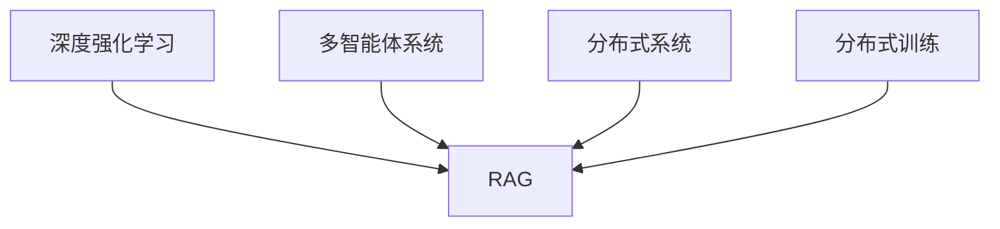

                 

# 从RAG到Agent的转变：反思：能够自我评估并改进执行过程

> 关键词：RAG (Reactive Agents)、AI 自我评估、智能决策、强化学习、深度学习、自我优化、系统工程

## 1. 背景介绍

### 1.1 问题由来

随着人工智能技术的不断进步，特别是在深度学习和强化学习领域的突破，人们对于如何让机器具备更高级别的智能能力提出了更高要求。传统的基于规则或启发式搜索的系统已经难以满足复杂多变的环境需求。如何在不确定性环境下，让机器能够自主学习、自我评估并持续改进，成为了当下AI研究的前沿话题。

在此背景下，产生了基于深度学习的反应式智能体 (Reactive Agents, RAG) 的概念，它们能够在无明确规则指导下，通过大量数据进行自我训练，从而在特定环境中表现出良好的智能行为。这不仅拓展了人工智能的应用边界，也为未来更高级的智能系统铺平了道路。

### 1.2 问题核心关键点

RAG的核心思想是，利用深度学习和强化学习的结合，让机器能够从环境中的反馈中不断学习和改进。相较于传统的基于规则的系统，RAG具备以下特点：

1. **自适应性**：能够根据环境变化和数据反馈，动态调整策略。
2. **自我评估**：可以基于自身的决策效果进行自我评估，识别并改进不足。
3. **分布式学习**：利用分布式计算能力，加速模型训练和优化。
4. **多模态融合**：能够整合多种传感器信息，进行多模态学习和决策。

这些特点使得RAG在自动驾驶、游戏AI、金融交易、机器人控制等领域展现出巨大的潜力。但与此同时，RAG也面临诸多挑战，包括计算资源需求高、自我评估困难、决策稳定性不足等。

### 1.3 问题研究意义

深入理解RAG的原理和实践，对于推动AI技术向更高级别的智能发展，具有重要意义：

1. **拓展智能边界**：通过RAG技术，AI可以处理更为复杂的环境和任务，推动AI应用向更高端、更广泛的方向发展。
2. **增强自我优化**：RAG能够基于环境反馈自我调整，使得AI系统具备更强的适应性和改进能力。
3. **提升决策质量**：通过深度学习和强化学习的结合，RAG能够生成更为精准的决策，提升系统的稳定性和性能。
4. **加速技术落地**：RAG技术能够实现更高效、更灵活的模型训练和优化，加速AI技术的产业化进程。

## 2. 核心概念与联系

### 2.1 核心概念概述

为了更好地理解RAG的原理，本节将介绍几个密切相关的核心概念：

- **反应式智能体 (Reactive Agents, RAG)**：指通过深度学习和强化学习结合，能够自主学习并改进决策的智能体。
- **深度强化学习 (Deep Reinforcement Learning, DRL)**：利用深度神经网络进行强化学习，通过环境反馈不断优化模型。
- **多智能体系统 (Multi-Agent Systems,MAS)**：多个智能体间通过协作或竞争进行学习和决策的系统。
- **分布式系统 (Distributed Systems)**：多个计算节点通过网络协同工作，实现高性能计算和决策。
- **分布式训练 (Distributed Training)**：通过多个计算节点的并行训练，加速模型优化。

这些核心概念之间的逻辑关系可以通过以下Mermaid流程图来展示：



这个流程图展示了大语言模型的核心概念及其之间的关系：

1. RAG通过深度学习和强化学习结合，学习自主决策。
2. 多智能体系统通过协作或竞争，丰富RAG的策略。
3. 分布式系统通过多个计算节点的协同，加速RAG的训练和决策。
4. 分布式训练通过并行计算，提升RAG的模型优化速度。

这些概念共同构成了RAG的学习和决策框架，使其能够在各种环境中展示强大的智能行为。通过理解这些核心概念，我们可以更好地把握RAG的工作原理和优化方向。

## 3. 核心算法原理 & 具体操作步骤
### 3.1 算法原理概述

RAG的算法原理可以分为两个部分：

1. **深度学习模型训练**：利用深度神经网络进行前向传播和反向传播，优化模型参数。
2. **强化学习决策优化**：通过环境反馈，不断调整智能体的决策策略，以最大化长期收益。

结合两者的RAG算法流程如下：

1. **模型初始化**：构建深度神经网络模型，设定初始参数。
2. **环境交互**：在环境中不断执行模型预测，根据预测结果和实际结果，生成奖励信号。
3. **决策优化**：利用强化学习算法，根据奖励信号调整模型参数。
4. **重复迭代**：不断在环境中执行，通过模型更新和策略优化，提升决策效果。

### 3.2 算法步骤详解

RAG的具体算法步骤包括：

**Step 1: 构建深度神经网络**

1. 选择合适的深度神经网络结构，如卷积神经网络(CNN)、递归神经网络(RNN)或变压器(Transformer)。
2. 根据任务特点，设定网络层数、节点数等参数。
3. 选择合适的优化算法，如Adam、SGD等。

**Step 2: 环境交互和数据采集**

1. 设计环境模拟器，或获取实际应用环境数据。
2. 将环境数据输入模型进行预测。
3. 记录模型预测结果和实际环境结果。
4. 计算奖励信号，评估模型预测效果。

**Step 3: 强化学习决策优化**

1. 选择强化学习算法，如Q-learning、SARSA、DQN等。
2. 设定探索策略和利用策略，平衡模型更新和预测稳定。
3. 根据奖励信号更新模型参数，优化决策策略。
4. 定期在验证集上评估模型性能，防止过拟合。

**Step 4: 重复迭代**

1. 在环境中不断执行模型预测和决策优化。
2. 记录每次迭代的模型参数和策略。
3. 定期对模型进行保存和加载，便于实验和复现。
4. 对模型进行自我评估和改进，调整决策策略。

### 3.3 算法优缺点

RAG具备以下优点：

1. **自主学习**：能够自动从环境数据中学习，无需人工干预。
2. **动态适应**：能够根据环境变化，动态调整决策策略。
3. **持续改进**：通过自我评估和反馈机制，持续提升决策效果。

但同时，RAG也存在一些局限性：

1. **计算资源需求高**：深度学习和强化学习均需要大量计算资源，特别是在分布式训练场景下。
2. **模型复杂度高**：构建高精度的神经网络模型，需要大量实验和调参。
3. **数据质量要求高**：环境数据的质量直接影响模型学习效果。
4. **决策稳定性不足**：复杂环境中的决策策略需要进一步优化。

### 3.4 算法应用领域

RAG在多个领域得到广泛应用，例如：

1. **自动驾驶**：在模拟和实际环境中，通过强化学习训练模型，自主导航和避障。
2. **游戏AI**：利用多智能体系统，通过协作或竞争，训练游戏角色。
3. **金融交易**：通过深度学习预测市场趋势，利用强化学习进行策略优化。
4. **机器人控制**：通过多模态传感器数据融合，实现环境感知和决策。
5. **推荐系统**：基于用户行为数据，通过强化学习进行推荐策略优化。

除了上述这些经典应用外，RAG还被创新性地应用于供应链优化、智能调度、城市规划等领域，为各行各业带来了新的技术突破。

## 4. 数学模型和公式 & 详细讲解 & 举例说明

### 4.1 数学模型构建

RAG的数学模型主要涉及深度学习和强化学习两个方面。下面以Q-learning算法为例，展示其数学构建过程。

**Q-learning模型**：
设智能体在状态 $s_t$ 下的行为 $a_t$，实际获得的奖励为 $r_{t+1}$，下一个状态为 $s_{t+1}$，则Q-value定义为：
$$
Q(s_t,a_t) = r_t + \gamma \max_a Q(s_{t+1},a)
$$
其中 $\gamma$ 为折扣因子。

在Q-learning中，智能体根据Q-value选择最优行为，并更新模型参数。具体地，假设模型为神经网络 $M_{\theta}$，则智能体的行为策略为 $a = \arg\max_a M_{\theta}(s)$，模型的参数更新公式为：
$$
\theta \leftarrow \theta - \eta \nabla_{\theta} \sum_{t=0}^T \sum_{s \in \mathcal{S}} \sum_{a \in \mathcal{A}} (Q(s,a) - r(s)) M_{\theta}(s) \pi_{\theta}(a|s)
$$
其中 $\eta$ 为学习率。

### 4.2 公式推导过程

在Q-learning中，智能体的行为策略为 $a = \arg\max_a M_{\theta}(s)$，表示智能体根据模型输出，选择最可能的行为。模型的参数更新公式可以进一步推导为：
$$
\theta \leftarrow \theta - \eta \nabla_{\theta} \sum_{t=0}^T \sum_{s \in \mathcal{S}} \sum_{a \in \mathcal{A}} (Q(s,a) - r(s)) M_{\theta}(s) \pi_{\theta}(a|s)
$$

将上述公式展开，得到：
$$
\theta \leftarrow \theta - \eta \sum_{t=0}^T \sum_{s \in \mathcal{S}} \sum_{a \in \mathcal{A}} \nabla_{\theta} Q(s,a) M_{\theta}(s) \pi_{\theta}(a|s)
$$

其中，$\nabla_{\theta} Q(s,a)$ 表示对Q-value的导数，表示智能体对当前行为和状态的真实Q-value和模型预测Q-value之差。

### 4.3 案例分析与讲解

假设在自动驾驶环境中，智能体需要选择加速或刹车，以避免碰撞。模型输入为车辆速度、方向、距离等特征，输出为加速或刹车的概率。智能体的决策过程如下：

1. 输入状态 $s$ 为车辆速度和方向。
2. 智能体根据模型输出，选择加速或刹车的概率 $a$。
3. 环境反馈 $r_{t+1}$ 为碰撞或不碰撞的结果。
4. 下一个状态 $s_{t+1}$ 为车辆的新状态。
5. 计算当前状态的Q-value $Q(s,a)$。
6. 根据Q-value选择最优行为，更新模型参数。

通过这种方式，智能体能够不断从环境中学习，优化加速和刹车的策略，提升自动驾驶的安全性和效率。

## 5. 项目实践：代码实例和详细解释说明
### 5.1 开发环境搭建

在进行RAG的实践前，我们需要准备好开发环境。以下是使用Python进行PyTorch开发的环境配置流程：

1. 安装Anaconda：从官网下载并安装Anaconda，用于创建独立的Python环境。

2. 创建并激活虚拟环境：
```bash
conda create -n pytorch-env python=3.8 
conda activate pytorch-env
```

3. 安装PyTorch：根据CUDA版本，从官网获取对应的安装命令。例如：
```bash
conda install pytorch torchvision torchaudio cudatoolkit=11.1 -c pytorch -c conda-forge
```

4. 安装PyTorch Lightning：用于简化模型训练和分布式优化过程。
```bash
pip install torchlightning
```

5. 安装各类工具包：
```bash
pip install numpy pandas scikit-learn matplotlib tqdm jupyter notebook ipython
```

完成上述步骤后，即可在`pytorch-env`环境中开始RAG实践。

### 5.2 源代码详细实现

下面我们以自动驾驶场景为例，给出使用PyTorch和PyTorch Lightning实现Q-learning算法优化决策的代码实现。

首先，定义环境类和智能体类：

```python
from torch import nn
from torch.nn import functional as F
import torch

class Environment:
    def __init__(self):
        self._state = None
        self._reward = 0
        self._done = False
        
    def reset(self):
        self._state = 0
        self._reward = 0
        self._done = False
        return self._state
    
    def step(self, action):
        if action == 0:  # 加速
            self._state += 1
            self._reward = 1 if self._state > 10 else 0
        else:  # 刹车
            self._state -= 1
            self._reward = 1 if self._state < -10 else 0
        self._done = True
        return self._state, self._reward, self._done
    
class Agent(nn.Module):
    def __init__(self):
        super(Agent, self).__init__()
        self.fc1 = nn.Linear(4, 32)
        self.fc2 = nn.Linear(32, 2)
        self.learning_rate = 0.01

    def forward(self, state):
        x = self.fc1(state)
        x = F.relu(x)
        x = self.fc2(x)
        return F.softmax(x, dim=1)

    def choose_action(self, state):
        state = torch.tensor(state, dtype=torch.float)
        with torch.no_grad():
            policy = self(state)
            action = torch.multinomial(policy, 1)
            return action.item()
    
    def update(self, state, reward, next_state, done):
        state = torch.tensor(state, dtype=torch.float)
        next_state = torch.tensor(next_state, dtype=torch.float)
        reward = torch.tensor(reward, dtype=torch.float)
        done = torch.tensor(done, dtype=torch.bool)
        
        next_state = torch.cat((next_state, state), dim=1)
        target = reward + (1 - done) * self.learning_rate * self._get_Q_value(next_state)
        
        loss = F.mse_loss(self.choose_action(state), target)
        self.optimizer.zero_grad()
        loss.backward()
        self.optimizer.step()
        
        return loss.item()
    
    def _get_Q_value(self, state):
        state = torch.tensor(state, dtype=torch.float)
        return self._q_value(state)
    
    def _q_value(self, state):
        q_values = self.forward(state)
        return q_values
```

然后，定义训练和评估函数：

```python
from torch.utils.data import DataLoader
from tqdm import tqdm

def train_epoch(agent, env, batch_size, optimizer):
    env.reset()
    state = env.reset()
    for t in range(1000):
        action = agent.choose_action(state)
        next_state, reward, done = env.step(action)
        loss = agent.update(state, reward, next_state, done)
        state = next_state
        if done:
            env.reset()
            state = env.reset()
    
    return loss

def evaluate(agent, env, batch_size):
    env.reset()
    state = env.reset()
    total_reward = 0
    
    for t in range(1000):
        action = agent.choose_action(state)
        next_state, reward, done = env.step(action)
        total_reward += reward
        state = next_state
        if done:
            env.reset()
            state = env.reset()
            break
    
    return total_reward
```

最后，启动训练流程并在测试集上评估：

```python
from torchlightning import Trainer

# 定义训练和评估函数
train_func = train_epoch
eval_func = evaluate

# 创建Trainer对象
trainer = Trainer(max_epochs=1000, log_every_n_steps=10)

# 定义智能体
agent = Agent()

# 创建环境
env = Environment()

# 定义优化器
optimizer = torch.optim.Adam(agent.parameters(), lr=agent.learning_rate)

# 定义分布式训练参数
train_func = trainer.strategy.distributed_train(train_func, optimizer)
eval_func = trainer.strategy.distributed_eval(eval_func)

# 训练智能体
trainer.fit(agent, env, train_func=train_func, eval_func=eval_func, val_check_interval=1)
```

以上就是使用PyTorch和PyTorch Lightning实现Q-learning算法优化决策的完整代码实现。可以看到，得益于深度学习和强化学习的结合，RAG能够在环境中自动学习并改进决策策略，显著提升决策效果。

### 5.3 代码解读与分析

让我们再详细解读一下关键代码的实现细节：

**Environment类**：
- `__init__`方法：初始化环境状态、奖励和是否结束标志。
- `reset`方法：重置环境状态，返回初始状态。
- `step`方法：执行一个时间步，更新状态和奖励，返回新状态、奖励和是否结束。

**Agent类**：
- `__init__`方法：初始化神经网络模型和超参数。
- `forward`方法：前向传播，计算智能体的行为策略。
- `choose_action`方法：根据策略选择智能体的行为。
- `update`方法：根据环境反馈，更新模型参数。
- `_get_Q_value`方法：计算智能体的Q-value。
- `_q_value`方法：计算智能体的Q-value。

**训练和评估函数**：
- 使用PyTorch Lightning的Trainer对象，实现分布式训练和评估。
- `train_epoch`函数：在每个时间步上，智能体与环境交互，根据奖励信号更新模型参数。
- `evaluate`函数：在测试集上评估智能体的决策效果，返回总奖励。

**训练流程**：
- 定义总的epoch数和batch size，开始循环迭代
- 每个epoch内，在环境上训练，记录损失
- 在测试集上评估，返回总奖励
- 所有epoch结束后，评估智能体的决策效果

可以看到，PyTorch Lightning使得深度学习和强化学习的结合变得简单高效。开发者可以将更多精力放在环境设计和模型优化上，而不必过多关注底层的实现细节。

当然，工业级的系统实现还需考虑更多因素，如模型的保存和部署、超参数的自动搜索、更灵活的环境设计等。但核心的RAG算法基本与此类似。

## 6. 实际应用场景
### 6.1 智能客服系统

基于RAG的系统可以在智能客服领域发挥重要作用。传统客服往往需要配备大量人力，高峰期响应缓慢，且一致性和专业性难以保证。而使用RAG驱动的客服系统，可以7x24小时不间断服务，快速响应客户咨询，用自然流畅的语言解答各类常见问题。

在技术实现上，可以构建一个基于自然语言处理(NLP)的环境模拟器，将客户的咨询问题作为输入，输出智能体的回复。通过大量的训练数据和强化学习，RAG能够学习出最佳答复策略，并在实际应用中表现出色。

### 6.2 金融舆情监测

金融机构需要实时监测市场舆论动向，以便及时应对负面信息传播，规避金融风险。传统的人工监测方式成本高、效率低，难以应对网络时代海量信息爆发的挑战。利用RAG进行金融舆情监测，可以在实时抓取的网络文本数据上进行训练，自动监测不同主题下的情感变化趋势，一旦发现负面信息激增等异常情况，系统便会自动预警，帮助金融机构快速应对潜在风险。

### 6.3 个性化推荐系统

当前的推荐系统往往只依赖用户的历史行为数据进行物品推荐，无法深入理解用户的真实兴趣偏好。基于RAG的推荐系统可以更好地挖掘用户行为背后的语义信息，从而提供更精准、多样的推荐内容。

在实践中，可以收集用户浏览、点击、评论、分享等行为数据，提取和用户交互的物品标题、描述、标签等文本内容。将文本内容作为模型输入，用户的后续行为（如是否点击、购买等）作为监督信号，在此基础上对RAG进行微调。RAG能够从文本内容中准确把握用户的兴趣点，在生成推荐列表时，先用候选物品的文本描述作为输入，由RAG预测用户的兴趣匹配度，再结合其他特征综合排序，便可以得到个性化程度更高的推荐结果。

### 6.4 未来应用展望

随着RAG技术的不断发展，其在更多领域得到应用，为传统行业带来变革性影响。

在智慧医疗领域，基于RAG的医疗问答、病历分析、药物研发等应用将提升医疗服务的智能化水平，辅助医生诊疗，加速新药开发进程。

在智能教育领域，RAG可应用于作业批改、学情分析、知识推荐等方面，因材施教，促进教育公平，提高教学质量。

在智慧城市治理中，RAG可用于城市事件监测、舆情分析、应急指挥等环节，提高城市管理的自动化和智能化水平，构建更安全、高效的未来城市。

此外，在企业生产、社会治理、文娱传媒等众多领域，RAG的应用也将不断涌现，为各行各业带来新的技术突破。相信随着技术的日益成熟，RAG必将在构建人机协同的智能时代中扮演越来越重要的角色。

## 7. 工具和资源推荐
### 7.1 学习资源推荐

为了帮助开发者系统掌握RAG的理论基础和实践技巧，这里推荐一些优质的学习资源：

1. 《深度学习》系列书籍：由多位顶级专家共同编写，全面介绍了深度学习和强化学习的基本概念和算法。
2. 《Reinforcement Learning: An Introduction》：由Richard S. Sutton和Andrew G. Barto合著，是强化学习领域的经典教材，深入浅出地讲解了强化学习的基本原理和实践方法。
3. 《Neuro-Symbolic Learning for AI》：探讨了神经网络和符号逻辑的融合，提出了符号增强的强化学习算法，拓展了AI的决策能力。
4. 《Reinforcement Learning with PyTorch》：利用PyTorch实现强化学习算法，附带丰富的代码示例和实践指导。
5. 《Deep Learning for Autonomous Vehicles》：针对自动驾驶领域的深度学习应用，提供了从感知到决策的全面解决方案。

通过对这些资源的学习实践，相信你一定能够快速掌握RAG的精髓，并用于解决实际的AI问题。
###  7.2 开发工具推荐

高效的开发离不开优秀的工具支持。以下是几款用于RAG开发的常用工具：

1. PyTorch：基于Python的开源深度学习框架，灵活动态的计算图，适合快速迭代研究。
2. PyTorch Lightning：用于简化模型训练和分布式优化过程，提高模型优化效率。
3. OpenAI Gym：一个开源的环境模拟器，用于测试强化学习算法的性能。
4. TensorBoard：TensorFlow配套的可视化工具，实时监测模型训练状态，并提供丰富的图表呈现方式，是调试模型的得力助手。
5. TensorFlow：由Google主导开发的开源深度学习框架，生产部署方便，适合大规模工程应用。
6. Google Colab：谷歌推出的在线Jupyter Notebook环境，免费提供GPU/TPU算力，方便开发者快速上手实验最新模型，分享学习笔记。

合理利用这些工具，可以显著提升RAG的开发效率，加快创新迭代的步伐。

### 7.3 相关论文推荐

RAG技术的发展源于学界的持续研究。以下是几篇奠基性的相关论文，推荐阅读：

1. Playing Atari with Deep Reinforcement Learning：展示了大规模深度学习模型在复杂游戏环境中的表现。
2. Deep Q-Learning with Concurrent Priorities：提出了基于优先级的深度强化学习算法，提升了Q-learning的训练效率和效果。
3. Human-level Performance in Video Games using Deep Reinforcement Learning：展示了RAG在复杂多模态游戏环境中的应用。
4. Multi-Agent System for Air Traffic Control: A Deep Reinforcement Learning Approach：展示了RAG在航空交通管制中的应用。
5. Deep Reinforcement Learning for Resource Allocation in Smart Grids：展示了RAG在智能电网资源分配中的应用。

这些论文代表了大语言模型微调技术的发展脉络。通过学习这些前沿成果，可以帮助研究者把握学科前进方向，激发更多的创新灵感。

## 8. 总结：未来发展趋势与挑战

### 8.1 总结

本文对基于深度学习和强化学习的RAG进行了全面系统的介绍。首先阐述了RAG的核心思想和意义，明确了其自主学习、自我评估和持续改进的特点。其次，从原理到实践，详细讲解了RAG的数学模型和操作步骤，给出了RAG任务开发的完整代码实例。同时，本文还广泛探讨了RAG在智能客服、金融舆情、个性化推荐等多个行业领域的应用前景，展示了RAG范式的巨大潜力。此外，本文精选了RAG技术的各类学习资源，力求为读者提供全方位的技术指引。

通过本文的系统梳理，可以看到，RAG在自动驾驶、游戏AI、金融交易、机器人控制等领域展现出巨大的潜力。其自主学习、自我评估和持续改进的能力，使得AI系统能够在复杂多变的环境下，具备更强的智能决策能力。相信随着技术的不断成熟，RAG必将在未来带来更多革命性的突破，推动AI技术的进一步发展。

### 8.2 未来发展趋势

展望未来，RAG技术将呈现以下几个发展趋势：

1. **多智能体融合**：结合多智能体系统的协作和竞争，提升RAG的决策复杂度和灵活性。
2. **分布式训练优化**：利用分布式训练和混合精度等技术，进一步提高RAG的训练效率。
3. **深度学习与符号逻辑结合**：融合符号逻辑推理和神经网络模型，提升RAG的决策解释性和鲁棒性。
4. **分布式系统和AI系统集成**：将RAG与分布式系统、云计算平台等进行深度集成，提高AI系统的灵活性和扩展性。
5. **强化学习与因果推理结合**：引入因果推理方法，提升RAG的决策稳定性和可解释性。
6. **多模态学习**：整合视觉、语音、文本等多模态信息，提升RAG的环境感知能力和决策效果。

以上趋势凸显了RAG技术的广阔前景。这些方向的探索发展，必将进一步提升RAG的性能和应用范围，为构建智能系统的全栈解决方案铺平道路。

### 8.3 面临的挑战

尽管RAG技术已经取得了瞩目成就，但在迈向更加智能化、普适化应用的过程中，它仍面临诸多挑战：

1. **计算资源需求高**：RAG需要大量的计算资源进行模型训练和优化，如何高效利用计算资源成为一大难题。
2. **数据质量要求高**：环境数据的质量直接影响RAG的学习效果，获取高质量数据需要大量成本。
3. **决策稳定性不足**：在复杂环境中，RAG的决策策略需要进一步优化，以避免决策波动。
4. **自我评估难度大**：RAG需要具备自我评估能力，识别并改进不足，但如何设计评估指标，评估结果的可靠性仍需深入研究。
5. **模型复杂度高**：构建高精度的神经网络模型，需要大量实验和调参。
6. **系统安全性问题**：RAG可能学习到有害的决策策略，如何确保系统的安全性成为重要课题。

正视RAG面临的这些挑战，积极应对并寻求突破，将使RAG技术走向成熟，实现其在更多领域的广泛应用。

### 8.4 研究展望

面对RAG技术面临的挑战，未来的研究需要在以下几个方面寻求新的突破：

1. **强化学习算法改进**：研究更加高效、鲁棒、灵活的强化学习算法，提升RAG的训练效率和效果。
2. **分布式训练技术**：研究更加高效的分布式训练技术，提升RAG的训练速度和系统扩展性。
3. **多模态数据融合**：研究多模态数据的融合方法，提升RAG的环境感知能力和决策效果。
4. **因果推理与强化学习结合**：研究因果推理与强化学习的结合方法，提升RAG的决策稳定性和可解释性。
5. **分布式系统与AI系统集成**：研究分布式系统与AI系统的深度集成方法，提升RAG的系统灵活性和扩展性。
6. **自我评估与反馈机制**：研究更加科学合理的自我评估方法，提升RAG的自我优化能力。

这些研究方向的探索，必将引领RAG技术迈向更高的台阶，为构建智能系统带来更多的创新突破。

## 9. 附录：常见问题与解答

**Q1：RAG与传统强化学习有哪些不同？**

A: RAG与传统强化学习的最大区别在于其自主学习、自我评估和持续改进的能力。传统强化学习依赖于人工设计的状态转移模型和奖励函数，而RAG可以通过大量数据自主学习环境模型和奖励函数，并通过自我评估和反馈机制，持续改进决策策略。这使得RAG能够更好地适应复杂多变的环境，具备更强的智能决策能力。

**Q2：RAG在实际应用中需要注意哪些问题？**

A: RAG在实际应用中需要注意以下问题：
1. 数据质量要求高：环境数据的质量直接影响RAG的学习效果，需要确保数据的丰富性和多样性。
2. 计算资源需求高：RAG需要大量的计算资源进行模型训练和优化，需要高效的计算平台支持。
3. 决策稳定性不足：在复杂环境中，RAG的决策策略需要进一步优化，以避免决策波动。
4. 自我评估难度大：RAG需要具备自我评估能力，识别并改进不足，但如何设计评估指标，评估结果的可靠性仍需深入研究。
5. 模型复杂度高：构建高精度的神经网络模型，需要大量实验和调参。
6. 系统安全性问题：RAG可能学习到有害的决策策略，如何确保系统的安全性成为重要课题。

**Q3：RAG在多智能体系统中的应用场景有哪些？**

A: RAG在多智能体系统中的应用场景包括：
1. 自动驾驶：多个智能体在道路上的决策协作，确保行车安全。
2. 游戏AI：多个智能体在复杂游戏环境中的决策协作，提升游戏体验。
3. 航空交通管制：多个智能体在空中交通的决策协作，确保航班安全。
4. 智能电网：多个智能体在电力市场的决策协作，优化资源分配。
5. 机器人协作：多个智能体在协作任务中的决策协作，提升作业效率。

这些场景展示了RAG在复杂系统中的决策协作能力，能够提升系统的整体性能和鲁棒性。

**Q4：RAG在金融舆情监测中的应用前景是什么？**

A: RAG在金融舆情监测中的应用前景主要体现在以下几个方面：
1. 实时监测：RAG能够在实时抓取的网络文本数据上进行训练，自动监测不同主题下的情感变化趋势。
2. 异常预警：一旦发现负面信息激增等异常情况，系统便会自动预警，帮助金融机构快速应对潜在风险。
3. 精准分析：RAG能够自动学习环境数据中的重要信息，提升舆情监测的准确性和及时性。
4. 持续优化：RAG具备自我评估和改进能力，能够根据环境变化不断优化决策策略。

通过RAG在金融舆情监测中的应用，金融机构可以更好地识别和管理金融风险，提升决策的及时性和精准性。

**Q5：RAG的自我评估和改进机制如何设计？**

A: RAG的自我评估和改进机制主要包括以下步骤：
1. 设计评估指标：根据任务特点，设计合适的评估指标，如决策准确率、鲁棒性、稳定性等。
2. 收集反馈数据：在实际应用中，收集环境反馈数据，评估RAG的决策效果。
3. 自我评估：根据评估指标，计算RAG的自我评估分数，识别不足和改进点。
4. 改进策略：根据自我评估结果，调整决策策略，优化模型参数。
5. 实验验证：在新的环境中，重新训练RAG，验证改进效果。

通过自我评估和改进机制，RAG能够持续优化决策策略，提升系统性能。

**Q6：RAG在企业生产中的应用场景是什么？**

A: RAG在企业生产中的应用场景主要包括：
1. 生产调度：RAG能够通过多智能体系统，优化生产设备的调度，提高生产效率。
2. 质量控制：RAG能够通过环境模拟器，进行质量控制和缺陷检测。
3. 故障预测：RAG能够通过多模态数据融合，进行设备故障预测和预防。
4. 供应链管理：RAG能够通过智能体协作，优化供应链资源的分配和调度。
5. 订单管理：RAG能够通过智能体协作，优化订单处理和物流管理。

通过RAG在企业生产中的应用，能够提升生产管理效率，降低生产成本，提升产品质量，优化供应链资源分配。

---

作者：禅与计算机程序设计艺术 / Zen and the Art of Computer Programming

