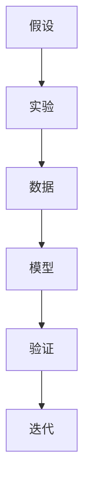

                 

# 从假说到真理：科学方法论的循环

## 1. 背景介绍

### 1.1 问题由来

在信息技术领域，科学方法论的循环在推动技术进步中扮演了至关重要的角色。从初期的假设到最终的验证，再到新的假设，这个过程充满了反复推敲和不断迭代。现代科学方法论强调循环性、迭代性、可重复性，这些原则为解决复杂的技术问题提供了框架性的指导。

### 1.2 问题核心关键点

科学方法论的核心是构建、测试和迭代。这一过程包括：

- 提出假设：从现有的知识和技术中抽象出可能的解决方案。
- 设计实验：构建实验环境来测试假设，定义评价指标。
- 收集数据：在实际环境中运行实验，收集和处理数据。
- 分析结果：通过数据分析评估实验结果，判断假设的合理性。
- 迭代改进：根据分析结果调整假设，并重新进行实验和验证。

这一过程体现了科学方法的循环性，即在不断实验和验证中前进，逐步逼近真理。现代信息技术发展中，这一方法论尤为关键，推动了人工智能、大数据、云计算等领域的重大突破。

## 2. 核心概念与联系

### 2.1 核心概念概述

本节介绍几个与科学方法论循环密切相关的核心概念：

- 假设(Hypothesis)：基于现有知识和技术提出的解决方案。
- 实验(Experiment)：设计实验来验证假设的合理性。
- 数据(Data)：在实验中收集和处理的数据。
- 模型(Model)：构建数学模型来描述实验现象。
- 迭代(Iteration)：在验证和分析中不断调整假设和实验设计，逐步逼近真理。
- 验证(Validation)：通过统计学或其他方法评估实验结果的真实性和有效性。

这些概念之间的联系可以通过以下Mermaid流程图展示：



这个流程图展示了假设、实验、数据、模型、验证和迭代之间的逻辑关系：

1. 假设提出一个可能的解决方案。
2. 实验设计并运行实验，收集数据。
3. 数据通过模型进行分析，生成验证结果。
4. 验证评估模型的有效性。
5. 根据验证结果调整假设和实验设计，进行迭代。

## 3. 核心算法原理 & 具体操作步骤

### 3.1 算法原理概述

科学方法论的循环在信息技术领域的应用，主要体现在数据驱动的决策过程中。技术决策的每一个环节，都可以视为一次假设-实验-数据-模型-验证的循环。通过这一循环，技术从初步概念走向实际应用，不断优化和完善。

技术决策的循环可以简化为以下步骤：

1. 提出假设：确定一个目标，并基于现有技术提出可能的解决方案。
2. 设计实验：定义实验环境，设定评价指标，确保实验的可重复性和可验证性。
3. 收集数据：在实际环境中运行实验，收集实验结果。
4. 分析结果：使用数据分析技术评估实验结果，得出结论。
5. 迭代改进：根据分析结果调整假设和实验设计，进行下一轮循环。

### 3.2 算法步骤详解

下面以人工智能模型训练为例，详细解释科学方法论在信息技术中的应用步骤。

**Step 1: 提出假设**

假设：“在大规模无标签文本数据上预训练一个语言模型，然后在下游任务上进行微调，能够显著提升模型性能。”

**Step 2: 设计实验**

实验设计：

1. 选择预训练语言模型，如BERT。
2. 设计下游任务，如文本分类。
3. 设置评价指标，如准确率和F1分数。
4. 使用数据增强技术扩充训练集。

**Step 3: 收集数据**

收集数据：

1. 下载大规模无标签文本数据集，如Common Crawl Corpus。
2. 对数据集进行预处理，如分词、去除停用词。
3. 设计标注数据集，如Yelp评论分类。

**Step 4: 分析结果**

分析结果：

1. 使用微调后的BERT模型对标注数据进行分类，计算准确率和F1分数。
2. 对比微调前后模型性能的变化。
3. 使用混淆矩阵、ROC曲线等可视化工具展示结果。

**Step 5: 迭代改进**

迭代改进：

1. 根据实验结果调整微调策略，如调整学习率、增加训练轮数。
2. 重新运行实验，收集新数据。
3. 重复步骤4和5，直至模型性能达到预期。

### 3.3 算法优缺点

科学方法论的循环具有以下优点：

1. 可重复性：实验结果具有可重复性，便于验证和改进。
2. 迭代优化：通过不断的实验和改进，逐步逼近最优解。
3. 数据驱动：决策过程基于数据，避免了主观偏见。

同时，也存在一些缺点：

1. 时间成本高：实验和数据分析需要大量时间，特别是在大规模数据集上。
2. 资源需求大：实验设计和运行需要高性能计算资源。
3. 实验局限性：某些实验条件可能难以控制，影响结果的普适性。

### 3.4 算法应用领域

科学方法论的循环在信息技术领域的许多应用中得到了广泛的应用，例如：

- 机器学习模型的训练和优化：通过实验设计、数据收集、模型训练和验证，不断优化模型性能。
- 自然语言处理(NLP)：在文本分类、情感分析、命名实体识别等任务中，通过微调预训练模型获得更好的效果。
- 计算机视觉(CV)：在图像分类、目标检测、图像生成等任务中，通过数据增强、模型微调和验证，提升模型精度。
- 推荐系统：在个性化推荐、用户行为分析等任务中，通过A/B测试、用户反馈收集和模型迭代，优化推荐算法。
- 系统架构设计：在软件架构设计中，通过原型构建、用户反馈和持续集成，不断改进系统设计。

这些领域都体现了科学方法论循环的价值，推动了技术的不断进步和应用的广泛拓展。

## 4. 数学模型和公式 & 详细讲解 & 举例说明

### 4.1 数学模型构建

为了更好地理解科学方法论的循环，我们引入数学模型来表示这一过程。

设实验的输入为 $X$，输出为 $Y$，假设函数为 $h$，则实验的数学模型为：

$$
Y = h(X)
$$

其中 $h$ 是实验模型的函数映射。

### 4.2 公式推导过程

假设我们有以下实验数据：

$$
\begin{align*}
(X_1, Y_1) &= (x_1, y_1) \\
(X_2, Y_2) &= (x_2, y_2) \\
(X_3, Y_3) &= (x_3, y_3) \\
& \vdots \\
(X_n, Y_n) &= (x_n, y_n)
\end{align*}
$$

我们需要使用这些数据来估计 $h$ 的参数 $\theta$。假设 $h$ 为线性模型，则有：

$$
Y = \theta X + b
$$

其中 $b$ 是截距。

通过最小二乘法，我们可以求解 $\theta$：

$$
\theta = \frac{1}{n} \sum_{i=1}^n (Y_i - \hat{Y}_i)X_i
$$

其中 $\hat{Y}_i = \theta X_i + b$。

### 4.3 案例分析与讲解

假设我们有一组实验数据，如股票价格预测模型。我们通过以下步骤：

1. 收集历史股票价格数据，定义实验模型 $h$ 为线性回归模型。
2. 设定评价指标为均方误差。
3. 使用历史数据进行训练，计算 $\theta$ 和 $b$。
4. 在新数据上进行验证，计算均方误差。
5. 根据验证结果调整模型参数，进行下一轮迭代。

这个过程体现了科学方法论的循环，通过不断的实验和验证，逐步优化模型，逼近真实的股票价格预测模型。

## 5. 项目实践：代码实例和详细解释说明

### 5.1 开发环境搭建

在进行科学方法论循环的实践前，我们需要准备好开发环境。以下是使用Python进行TensorFlow开发的环境配置流程：

1. 安装Anaconda：从官网下载并安装Anaconda，用于创建独立的Python环境。

2. 创建并激活虚拟环境：
```bash
conda create -n tf-env python=3.8 
conda activate tf-env
```

3. 安装TensorFlow：根据CUDA版本，从官网获取对应的安装命令。例如：
```bash
conda install tensorflow==2.6 -c conda-forge
```

4. 安装各类工具包：
```bash
pip install numpy pandas scikit-learn matplotlib tqdm jupyter notebook ipython
```

完成上述步骤后，即可在`tf-env`环境中开始科学方法论循环的实践。

### 5.2 源代码详细实现

下面我们以线性回归模型为例，给出使用TensorFlow进行实验的PyTorch代码实现。

首先，定义线性回归模型的类：

```python
import tensorflow as tf

class LinearRegression(tf.keras.Model):
    def __init__(self, input_dim):
        super(LinearRegression, self).__init__()
        self.linear = tf.keras.layers.Dense(units=1, input_dim=input_dim)

    def call(self, x):
        return self.linear(x)
```

然后，定义训练和评估函数：

```python
@tf.function
def train_step(inputs, labels):
    with tf.GradientTape() as tape:
        predictions = model(inputs)
        loss = tf.reduce_mean(tf.square(predictions - labels))
    gradients = tape.gradient(loss, model.trainable_variables)
    optimizer.apply_gradients(zip(gradients, model.trainable_variables))

@tf.function
def evaluate(inputs, labels):
    predictions = model(inputs)
    loss = tf.reduce_mean(tf.square(predictions - labels))
    mse = tf.metrics.mean_squared_error(labels, predictions)
    return loss, mse
```

最后，启动训练流程并在测试集上评估：

```python
epochs = 100
batch_size = 32
learning_rate = 0.01

for epoch in range(epochs):
    for inputs, labels in train_dataset:
        train_step(inputs, labels)
    
    test_loss, test_mse = evaluate(test_dataset)
    print(f"Epoch {epoch+1}, test loss: {test_loss:.3f}, test mse: {test_mse:.3f}")
```

以上就是使用TensorFlow进行线性回归模型训练的完整代码实现。可以看到，通过定义模型、损失函数、优化器等关键组件，我们能够快速构建和训练一个简单的线性回归模型。

### 5.3 代码解读与分析

让我们再详细解读一下关键代码的实现细节：

**LinearRegression类**：
- `__init__`方法：初始化线性回归模型，定义线性层。
- `call`方法：定义模型的前向传播过程。

**train_step和evaluate函数**：
- 使用TensorFlow的tf.function装饰器，提升代码的执行效率。
- 在训练和评估过程中，使用tf.GradientTape计算梯度，并使用优化器更新模型参数。
- 计算损失函数和均方误差，并返回结果。

**训练流程**：
- 定义总的epoch数和batch size，开始循环迭代
- 每个epoch内，对训练集数据进行迭代训练
- 在测试集上评估，输出测试结果

可以看到，TensorFlow的TensorFlow提供了强大的自动微分功能和高效执行机制，使得模型训练和评估变得简便高效。

当然，工业级的系统实现还需考虑更多因素，如模型的保存和部署、超参数的自动搜索、更灵活的实验设计等。但核心的科学方法论循环基本与此类似。

## 6. 实际应用场景

### 6.1 机器学习模型的训练和优化

在机器学习领域，科学方法论的循环是模型训练和优化的基础。通过实验设计、数据收集、模型训练和验证，不断优化模型性能。例如，在大规模数据集上训练深度学习模型，通过交叉验证、正则化等技术，逐步提升模型精度和泛化能力。

### 6.2 自然语言处理(NLP)模型的微调

在自然语言处理领域，微调预训练模型是提升模型性能的重要手段。通过设计下游任务，收集标注数据，在预训练模型上进行微调，可以获得更好的效果。例如，对预训练的BERT模型进行情感分析任务的微调，通过调整学习率和超参数，提升模型在情感分类上的准确率。

### 6.3 计算机视觉(CV)模型的训练

在计算机视觉领域，数据驱动的决策过程同样适用。通过收集大量标注图像数据，设计实验环境，训练和优化卷积神经网络(CNN)模型。例如，在图像分类任务上，通过数据增强和模型微调，提升模型在CIFAR-10、ImageNet等数据集上的精度。

### 6.4 推荐系统的优化

在推荐系统领域，科学方法论的循环同样适用。通过A/B测试、用户反馈收集等手段，优化推荐算法。例如，在电商推荐系统中，通过用户行为数据，训练协同过滤、内容推荐等模型，并在实际场景中不断迭代优化，提升推荐效果。

### 6.5 系统架构设计的优化

在系统架构设计中，科学方法论的循环也发挥着重要作用。通过原型构建、用户反馈和持续集成，逐步优化系统架构。例如，在大规模分布式系统中，通过实验和测试，优化网络拓扑、负载均衡等设计，提升系统的可扩展性和稳定性。

## 7. 工具和资源推荐

### 7.1 学习资源推荐

为了帮助开发者系统掌握科学方法论的循环，这里推荐一些优质的学习资源：

1. TensorFlow官方文档：提供了全面的TensorFlow使用指南和API文档，是学习TensorFlow的必备资源。

2. Deep Learning with Python书籍：涵盖了深度学习的基础知识，通过大量代码示例和实际应用案例，带你全面了解深度学习技术。

3. Machine Learning Mastery博客：提供丰富的机器学习教程和实战案例，适合初学者和进阶学习者。

4. Kaggle平台：提供了大量的数据集和竞赛，可以通过实战项目练习科学方法论的循环。

5. GitHub上的开源项目：可以学习其他开发者如何应用科学方法论，提升项目开发能力。

通过对这些资源的学习实践，相信你一定能够快速掌握科学方法论的循环，并用于解决实际的技术问题。

### 7.2 开发工具推荐

高效的开发离不开优秀的工具支持。以下是几款用于科学方法论循环开发的常用工具：

1. TensorFlow：基于Python的开源深度学习框架，提供了强大的自动微分和分布式计算功能。

2. PyTorch：基于Python的开源深度学习框架，灵活的动态计算图，适合快速迭代研究。

3. Jupyter Notebook：轻量级的Web开发环境，支持Python、R、SQL等语言，便于代码编写和可视化。

4. Weights & Biases：模型训练的实验跟踪工具，可以记录和可视化模型训练过程中的各项指标，方便对比和调优。

5. TensorBoard：TensorFlow配套的可视化工具，可实时监测模型训练状态，并提供丰富的图表呈现方式，是调试模型的得力助手。

6. Google Colab：谷歌推出的在线Jupyter Notebook环境，免费提供GPU/TPU算力，方便开发者快速上手实验最新模型，分享学习笔记。

合理利用这些工具，可以显著提升科学方法论循环的开发效率，加快创新迭代的步伐。

### 7.3 相关论文推荐

科学方法论的循环在信息技术领域的应用，促使了许多前沿研究的发展。以下是几篇奠基性的相关论文，推荐阅读：

1. Gradient-based methods for hyperparameter optimization（Stanford论文）：提出了一种基于梯度的方法，用于超参数优化，显著提升了模型的训练效率。

2. Bayesian optimization for hyperparameter optimization（Stanford论文）：提出了一种基于贝叶斯优化的超参数优化方法，提升了模型调优的精度和鲁棒性。

3. A Survey of Transfer Learning in Deep Learning（arXiv论文）：综述了深度学习中的迁移学习方法，介绍了多种预训练-微调策略，提升了模型在不同任务上的泛化能力。

4. Transformers: Distilling Language Knowledge with Contextualized Representations（BERT论文）：提出BERT模型，引入了基于掩码的自监督预训练任务，刷新了多项NLP任务SOTA。

5. Large Language Models for Zero-Shot Question Answering（GPT-2论文）：展示了大规模语言模型的强大zero-shot学习能力，引发了对于通用人工智能的新一轮思考。

这些论文代表了大语言模型微调技术的发展脉络。通过学习这些前沿成果，可以帮助研究者把握学科前进方向，激发更多的创新灵感。

## 8. 总结：未来发展趋势与挑战

### 8.1 总结

本文对科学方法论的循环在信息技术中的应用进行了全面系统的介绍。首先阐述了科学方法论循环的基本原理和步骤，明确了在技术决策中应用科学方法论的重要性。其次，从原理到实践，详细讲解了科学方法论的循环在机器学习、自然语言处理、计算机视觉等领域的应用，给出了具体代码实例和实验设计。同时，本文还广泛探讨了科学方法论在各个领域的应用前景，展示了其在推动技术进步中的重要作用。

通过本文的系统梳理，可以看到，科学方法论的循环在信息技术领域的许多应用中得到了广泛的应用，推动了技术的不断进步和应用的广泛拓展。未来，伴随科学方法论的进一步演进，相信信息技术将在更广阔的应用领域大放异彩。

### 8.2 未来发展趋势

展望未来，科学方法论的循环在信息技术领域将呈现以下几个发展趋势：

1. 自动化和智能化：通过AI技术，自动化地进行假设提出、实验设计、数据收集和模型训练，逐步实现科学方法论的智能化。

2. 数据驱动的决策：更加依赖数据驱动的决策过程，通过大规模数据和先进的算法，提升决策的科学性和准确性。

3. 模型解释和可视化：通过可视化工具和解释性模型，使得决策过程更具透明性和可解释性。

4. 跨领域融合：在多个领域进行跨学科融合，如将计算机视觉和自然语言处理结合，提升模型的综合能力。

5. 持续学习和进化：通过持续学习和进化机制，使模型能够不断适应新的数据和任务。

这些趋势将推动科学方法论的循环向更高效、更智能、更透明的方向发展，为信息技术带来更多的创新突破。

### 8.3 面临的挑战

尽管科学方法论的循环在信息技术领域取得了显著进展，但在迈向更加智能化、普适化应用的过程中，它仍面临着诸多挑战：

1. 数据获取和处理：大规模数据集的获取和预处理成本高，数据质量和隐私问题亟待解决。

2. 计算资源需求：实验设计和运行需要高性能计算资源，成本较高。

3. 模型复杂性：模型参数量增加，训练和推理时间变长，难以平衡模型精度和计算效率。

4. 模型解释性：模型的内部工作机制和决策逻辑难以解释，影响其可信度和应用范围。

5. 伦理和安全问题：模型输出可能带有偏见，存在伦理和安全风险。

6. 资源优化：在实际部署中，模型需要高效的资源优化策略，才能满足大规模应用的硬件需求。

正视这些挑战，积极应对并寻求突破，将是大数据、人工智能等领域迈向成熟的必由之路。相信随着学界和产业界的共同努力，这些挑战终将一一被克服，科学方法论的循环必将在推动信息技术进步中发挥更大的作用。

### 8.4 研究展望

面对科学方法论循环所面临的挑战，未来的研究需要在以下几个方面寻求新的突破：

1. 探索无监督和半监督方法：摆脱对大规模标注数据的依赖，利用自监督学习、主动学习等方法，最大化利用数据资源。

2. 研究高效模型设计：开发更加高效的模型结构，如卷积神经网络、注意力机制等，提升模型的计算效率和性能。

3. 引入更多先验知识：将符号化的先验知识，如知识图谱、逻辑规则等，与神经网络模型进行巧妙融合，提升模型的泛化能力和鲁棒性。

4. 结合因果分析和博弈论工具：将因果分析方法引入模型设计，识别出模型决策的关键特征，增强输出解释的因果性和逻辑性。

5. 纳入伦理道德约束：在模型训练目标中引入伦理导向的评估指标，过滤和惩罚有害的输出倾向，确保模型的安全性。

这些研究方向的探索，必将引领科学方法论的循环技术迈向更高的台阶，为构建安全、可靠、可解释、可控的智能系统铺平道路。面向未来，科学方法论的循环需要在更多的领域进行探索和应用，共同推动人工智能技术的发展和创新。

## 9. 附录：常见问题与解答

**Q1：科学方法论的循环是否只适用于学术研究？**

A: 科学方法论的循环不仅适用于学术研究，在实际工业应用中也具有广泛的应用价值。通过科学方法论循环，可以在更短时间内推出新产品，提升用户体验，增强企业竞争力。

**Q2：科学方法论的循环是否适用于所有技术决策？**

A: 科学方法论的循环在大多数技术决策中都有应用价值。特别是对于复杂系统设计、高性能模型训练等任务，循环方法能显著提高决策的科学性和准确性。但对于简单的技术决策，如微调超参数等，循环方法可能显得过于繁琐。

**Q3：如何优化科学方法论的循环？**

A: 优化科学方法论的循环，主要从以下几方面入手：

1. 提升数据质量：确保数据集的质量和多样性，减少噪声和偏差。
2. 选择合适的模型：根据任务特点选择合适的模型架构，平衡精度和效率。
3. 自动化实验设计：利用自动化工具，如AutoML，自动设计实验和超参数调优。
4. 模型压缩和优化：使用模型压缩、量化等技术，降低模型计算资源需求。
5. 多学科融合：将不同学科的知识和技术进行融合，提升模型的综合能力。

通过这些优化措施，可以大大提升科学方法论的循环效率和效果，使得技术决策更加科学和可靠。

**Q4：科学方法论的循环是否适用于多模态数据？**

A: 科学方法论的循环同样适用于多模态数据。在多模态数据中，需要设计多模态融合的实验，选择合适的融合算法，进行多模态数据训练和验证。通过科学方法论的循环，可以逐步优化多模态数据处理和融合模型，提升其在实际场景中的应用效果。

**Q5：科学方法论的循环是否适用于伦理和安全问题？**

A: 科学方法论的循环在处理伦理和安全问题时，需要引入额外的约束和考量。例如，在处理敏感数据时，需要采取数据脱敏、隐私保护等措施，确保数据安全和合规。同时，在模型训练和应用中，需要引入伦理导向的评估指标，避免有害输出，确保系统的公平性和可解释性。

总之，科学方法论的循环不仅适用于学术研究，在工业应用中也具有广泛的应用价值。通过不断优化和改进，科学方法论的循环将在更多的领域发挥重要作用，推动信息技术的发展和创新。

---

作者：禅与计算机程序设计艺术 / Zen and the Art of Computer Programming

