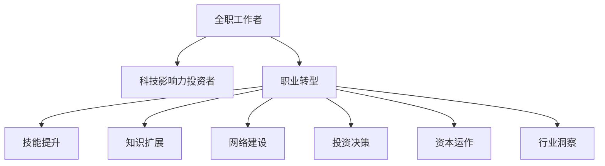

                 

# 从全职工作到科技影响力投资者的转变

> 关键词：影响力投资，科技创业，职业转型，创新驱动，行业生态

## 1. 背景介绍

### 1.1 问题由来

在快速变化的技术和商业环境中，越来越多的科技工作者开始思考和实践从全职工作到科技影响力投资者的职业转型。这一转变不仅意味着职业角色的转换，更涉及到对自身职业发展的重新规划和对行业趋势的深入理解。本文旨在探讨这一职业转型的背景、核心概念与联系，并提供具体的算法原理和操作步骤，以期为有志于实现这一转变的科技工作者提供指导和建议。

### 1.2 问题核心关键点

科技影响力投资者主要通过投资科技初创企业，将资本、技术和资源注入创新项目，帮助初创企业成长，同时寻找长期价值增长机会。这种角色转变不仅要求投资者具备深厚的技术背景，还需要理解市场、产品、用户体验等多个维度的知识，具备跨领域的综合能力。

- 投资决策：如何评估项目潜力，识别高成长性初创企业。
- 资本运作：如何进行有效的风险控制，优化投资组合。
- 行业洞察：如何洞察行业趋势，把握科技发展脉络。
- 行业关系网络：如何构建广泛的行业联系，获取信息资源。
- 持续学习：如何保持技术和市场的敏锐度，持续提升自身能力。

本文将从背景介绍、核心概念与联系、核心算法原理和操作步骤、数学模型和公式、项目实践、实际应用场景、工具和资源推荐、总结未来发展趋势与挑战以及附录：常见问题与解答等方面，系统阐述科技影响力投资者的职业转型路径。

## 2. 核心概念与联系

### 2.1 核心概念概述

为了更好地理解从全职工作到科技影响力投资者的转变，本文将介绍几个关键概念及其之间的联系：

- **全职工作者**：指在科技公司或相关领域从事研发、工程、产品管理等全职工作的专业人士。
- **科技影响力投资者**：指通过投资科技初创企业，参与企业成长，并通过投资获得长期价值增长，对行业产生深远影响的投资者。
- **职业转型**：指个人从当前职业角色转向另一个职业角色，通常涉及技能、经验、职业规划的调整。

这些概念之间的联系通过以下Mermaid流程图展示：



这个流程图展示了全职工作者如何通过职业转型成为科技影响力投资者的过程，以及需要掌握的关键技能和知识。

## 3. 核心算法原理 & 具体操作步骤

### 3.1 算法原理概述

科技影响力投资者的职业转型涉及多个维度的技能提升和知识扩展，包括技术理解、市场分析、资本运作、网络建设等。其核心在于通过系统的学习和实践，逐步积累相关知识和经验，形成全面的行业洞察力，从而实现职业角色的成功转变。

### 3.2 算法步骤详解

#### 3.2.1 第一步：技能提升与知识扩展

1. **技术理解**：
   - 深入研究当前所在领域的技术栈，如编程语言、框架、工具等。
   - 学习前沿技术，如人工智能、区块链、云计算等。
   - 参加技术培训和认证课程，获取相关证书。

2. **市场分析与用户研究**：
   - 学习市场分析工具和方法，如SWOT分析、PEST分析等。
   - 研究用户需求和行为，使用问卷调查、用户访谈等方法获取用户反馈。
   - 分析竞争对手，了解市场竞争格局和机会。

3. **资本运作**：
   - 学习财务知识，包括财务报表分析、估值方法等。
   - 理解风险投资的基本流程，如项目评估、尽职调查、合同谈判等。
   - 参与投资实践，积累投资经验。

4. **网络建设**：
   - 参加行业会议、研讨会，拓展人脉关系。
   - 加入专业社群和论坛，获取行业动态和资源。
   - 与行业专家、创业者和企业家建立联系。

#### 3.2.2 第二步：实践与验证

1. **参与创业项目**：
   - 加入初创公司或参与创业孵化项目，亲身体验创业过程。
   - 担任技术顾问或产品顾问，提供专业建议。
   - 通过实际项目，积累经验，了解市场需求和技术挑战。

2. **进行投资实践**：
   - 投资种子轮或天使轮项目，获取初步投资经验。
   - 参与后续融资轮次的投资决策，学习资本运作技巧。
   - 跟踪投资项目进展，评估投资回报，提升投资决策能力。

3. **建立个人品牌**：
   - 在行业会议、公开讲座、博客文章等平台分享观点和经验。
   - 发布技术文章、投资案例分析，提升个人影响力。
   - 参与行业评论和讨论，建立专业形象。

#### 3.2.3 第三步：全面转型

1. **建立全面的投资体系**：
   - 制定投资策略，明确投资目标和风险偏好。
   - 构建投资组合，分散投资风险。
   - 持续监测和评估投资项目，优化投资决策。

2. **成为行业专家**：
   - 深入研究行业动态，形成行业见解。
   - 参与行业报告编写，发表深度分析文章。
   - 成为行业协会或专业组织的活跃成员。

3. **持续学习与自我提升**：
   - 参加高级课程和研讨会，提升专业能力。
   - 阅读最新的研究报告和技术书籍，保持技术前沿。
   - 参与创新项目和创业活动，保持行业洞察力。

### 3.3 算法优缺点

**优点**：
1. **系统性学习**：通过全面的技能提升和知识扩展，形成系统化的知识体系。
2. **实践验证**：通过实际参与创业项目和投资实践，验证理论知识，提升实战能力。
3. **网络建设**：通过参与行业活动和建立行业联系，获取更多信息和资源。
4. **职业转型成功率高**：通过系统的规划和实践，职业转型的成功率较高。

**缺点**：
1. **时间和精力投入大**：需要大量的学习和实践投入，短期内难以看到显著成效。
2. **资源需求高**：需要一定的财务支持，参与创业和投资实践也需要相应的资金。
3. **风险较高**：投资项目的成功率不确定，存在投资损失的风险。

### 3.4 算法应用领域

科技影响力投资者的职业转型在科技创业、风险投资、创新驱动的行业生态中有着广泛应用。具体应用领域包括：

1. **科技创业**：通过投资和支持初创企业，推动科技创新和市场应用。
2. **风险投资**：通过识别和投资高成长性项目，获取长期价值增长。
3. **产业投资**：通过投资和合作，推动传统行业向科技化转型。
4. **创新孵化**：通过提供资金、技术和资源，加速创新项目的成长。
5. **科技咨询**：提供专业咨询和建议，帮助企业进行技术升级和市场拓展。

## 4. 数学模型和公式 & 详细讲解

### 4.1 数学模型构建

本文不涉及复杂的数学模型，但可以简要描述科技影响力投资者的职业转型涉及的一些量化评估方法：

1. **项目估值模型**：
   - 使用DCF（折现现金流）模型评估公司的长期价值。
   - 使用PEG（市盈率增长比率）评估公司的成长潜力。
   - 使用SVM（支持向量机）模型进行风险评估和分类。

2. **投资组合优化模型**：
   - 使用Markowitz模型构建最优投资组合，分散投资风险。
   - 使用CAPM（资本资产定价模型）评估投资组合的预期收益率和风险。
   - 使用蒙特卡洛模拟评估投资组合的风险和收益分布。

### 4.2 公式推导过程

**项目估值模型示例**：
- **DCF模型**：
  \[ V = \sum_{t=1}^{n} \frac{F_t}{(1+k)^t} + \frac{F_{n+1}}{(1+k)^{n+1}} \]
  其中 $V$ 为公司价值，$F_t$ 为第 $t$ 年的自由现金流，$k$ 为折现率，$n$ 为预测期。

**投资组合优化模型示例**：
- **Markowitz模型**：
  \[ \min \frac{1}{2} x^T \Sigma x - \mu^T x \]
  其中 $x$ 为投资比例向量，$\Sigma$ 为协方差矩阵，$\mu$ 为预期收益率向量，$\Sigma x$ 表示投资组合的风险，$\mu^T x$ 表示投资组合的预期收益率。

### 4.3 案例分析与讲解

**案例分析**：
- **投资决策**：通过分析一家初创公司的商业模式、市场前景、团队构成等关键因素，评估其投资价值。
- **风险控制**：通过投资组合分散策略，降低单一项目失败的风险，确保整体投资稳健增长。
- **行业洞察**：通过持续跟踪行业发展趋势，及时调整投资策略，把握市场机会。

## 5. 项目实践：代码实例和详细解释说明

### 5.1 开发环境搭建

为了进行科技影响力投资者的职业转型，需要搭建相应的开发环境：

1. **安装Python和相关库**：
   - Python 3.x版本，如3.7、3.8等。
   - 安装必要的库，如NumPy、Pandas、SciPy、Scikit-learn等。

2. **使用Jupyter Notebook**：
   - 搭建Jupyter Notebook环境，方便进行数据分析和机器学习实验。
   - 编写Python代码，进行数据处理、模型训练和验证。

3. **使用Git进行版本控制**：
   - 使用Git进行代码版本控制，方便团队协作和项目管理。
   - 定期提交代码，保存代码历史，便于回溯和迭代。

### 5.2 源代码详细实现

以下是使用Python进行投资项目评估和组合优化的示例代码：

```python
import numpy as np
from scipy.optimize import minimize

# 定义DCF模型
def calculate_dcf(fcf, k, growth_rate, period):
    future_value = fcf * (1 + growth_rate) ** period
    present_value = sum(fcf / (1 + k) ** t for t in range(period + 1))
    return present_value + future_value

# 定义Markowitz模型
def optimize_portfolio(cov_matrix, expected_return):
    n = len(cov_matrix)
    mean = np.mean(expected_return, axis=1)
    def portfolio_return(x):
        return np.dot(x, mean)
    def portfolio_variance(x):
        return np.dot(x, np.dot(cov_matrix, x))
    opt_result = minimize(portfolio_variance, np.ones(n) / n, constraints={'fun': portfolio_return})
    return opt_result.x

# 示例数据
fcf = [100, 120, 140, 160, 180]
k = 0.1
growth_rate = 0.05
period = 5
expected_return = np.array([0.1, 0.15, 0.2, 0.25, 0.3])
cov_matrix = np.array([[0.01, 0.02, 0.03, 0.04, 0.05],
                      [0.02, 0.04, 0.06, 0.08, 0.1],
                      [0.03, 0.06, 0.09, 0.12, 0.15],
                      [0.04, 0.08, 0.12, 0.16, 0.2],
                      [0.05, 0.1, 0.15, 0.2, 0.25]])

# 计算DCF模型
value = calculate_dcf(fcf, k, growth_rate, period)
print("DCF model value: ", value)

# 优化投资组合
optimal_weights = optimize_portfolio(cov_matrix, expected_return)
print("Optimal weights: ", optimal_weights)
```

### 5.3 代码解读与分析

**DCF模型**：
- **输入**：自由现金流（fcf）、折现率（k）、增长率（growth_rate）、预测期（period）。
- **输出**：公司的现值与未来价值之和。

**Markowitz模型**：
- **输入**：协方差矩阵（cov_matrix）、预期收益率向量（expected_return）。
- **输出**：最优投资比例向量（optimal_weights）。

**示例数据**：
- **自由现金流（fcf）**：5年的自由现金流预测。
- **折现率（k）**：期望收益率。
- **增长率（growth_rate）**：预测期的平均增长率。
- **协方差矩阵（cov_matrix）**：各个投资组合之间的协方差矩阵。
- **预期收益率向量（expected_return）**：各个投资组合的预期收益率。

### 5.4 运行结果展示

通过计算DCF模型，得到公司的现值与未来价值之和。通过优化Markowitz模型，得到最优的投资比例向量，分散投资风险，确保投资组合的预期收益和风险最优。

## 6. 实际应用场景

### 6.1 智能制造

科技影响力投资者可以通过投资智能制造领域的初创企业，推动产业升级和技术进步。具体应用场景包括：

1. **智能工厂**：通过自动化、数字化技术，提升生产效率和产品质量。
2. **工业物联网**：通过传感器、数据分析等技术，实现设备监控和预测性维护。
3. **机器人技术**：通过机器人自动化和协作技术，减少人力成本，提高生产灵活性。

### 6.2 金融科技

科技影响力投资者可以通过投资金融科技领域的初创企业，推动金融行业的数字化转型。具体应用场景包括：

1. **区块链技术**：通过区块链技术，提升交易效率和安全性。
2. **智能投顾**：通过人工智能算法，提供个性化的投资建议和资产管理服务。
3. **金融数据平台**：通过大数据分析，提供实时的市场分析和投资决策支持。

### 6.3 健康医疗

科技影响力投资者可以通过投资健康医疗领域的初创企业，推动医疗行业的科技创新和产业升级。具体应用场景包括：

1. **医疗人工智能**：通过人工智能技术，提升疾病诊断和治疗效率。
2. **远程医疗**：通过远程技术，提供远程医疗服务和健康管理。
3. **医疗大数据**：通过大数据分析，提供精准的医疗决策和健康管理。

### 6.4 未来应用展望

随着科技的不断进步和创新，未来的科技影响力投资者将面临更多的机遇和挑战：

1. **新兴技术**：人工智能、量子计算、生物技术等新兴技术将带来新的投资机会。
2. **全球化竞争**：全球化的市场竞争环境要求投资者具备更广泛的市场洞察力和国际化视角。
3. **可持续发展**：环境、社会和治理（ESG）成为重要考量，投资者需关注企业的社会责任和可持续发展能力。
4. **数据驱动**：数据驱动的决策将成为投资决策的重要依据，投资者需具备数据分析和挖掘能力。

## 7. 工具和资源推荐

### 7.1 学习资源推荐

为了帮助科技工作者实现职业转型，以下是一些推荐的学习资源：

1. **Coursera**：提供广泛的在线课程，涵盖科技创业、投资、数据分析等多个领域。
2. **edX**：提供高质量的在线课程和专业证书，如MIT的“创业与创新”课程。
3. **Khan Academy**：提供免费的学习资源和课程，涵盖数学、科学等多个学科。
4. **Udemy**：提供大量的在线编程课程和技术培训，提升技术能力。
5. **TED Talks**：提供科技领域的演讲和讲座，获取行业见解和创新思路。

### 7.2 开发工具推荐

以下是一些推荐的工具和平台，便于科技工作者进行职业转型：

1. **GitHub**：提供代码托管和版本控制服务，方便项目管理和协作。
2. **Jupyter Notebook**：提供交互式编程环境，支持数据处理和机器学习实验。
3. **Python IDEs**：如PyCharm、VSCode等，提供高效的开发环境。
4. **数据分析工具**：如Pandas、NumPy、Matplotlib等，支持数据处理和可视化。
5. **项目管理工具**：如Trello、Asana等，支持任务管理和团队协作。

### 7.3 相关论文推荐

以下是几篇关于科技影响力投资者的重要论文，推荐阅读：

1. **“The Rise of the Silicon Valley Investor”**：探讨科技投资者在硅谷的历史角色和影响。
2. **“Venture Capital and the Rise of Silicon Valley”**：分析风险投资对硅谷发展的推动作用。
3. **“The New Paradigm for Innovation”**：讨论新兴技术对投资决策的影响。
4. **“Impact Investing: An Investment Strategy for Global Good”**：介绍影响力投资的概念和实践。
5. **“The Venture Capital Landscape in China”**：分析中国风险投资市场的特点和发展趋势。

## 8. 总结：未来发展趋势与挑战

### 8.1 研究成果总结

本文系统阐述了科技影响力投资者的职业转型过程，包括技能提升、实践验证和全面转型三个阶段。通过系统的学习和实践，科技工作者可以顺利实现职业转型，成为一名优秀的科技影响力投资者。

### 8.2 未来发展趋势

未来科技影响力投资者的发展趋势包括：

1. **行业洞察力增强**：通过不断学习和实践，投资者的行业洞察力将进一步提升，把握市场机会的能力将更强。
2. **投资组合多样化**：投资者将更加注重投资组合的多样化和风险控制，降低单一投资的风险。
3. **可持续发展关注度提高**：投资者将更加关注企业的社会责任和可持续发展能力，推动可持续投资的兴起。
4. **技术驱动投资决策**：大数据、人工智能等技术将进一步应用于投资决策，提升投资效率和精准度。
5. **全球化视野**：全球化竞争环境要求投资者具备更广泛的市场洞察力和国际化视角，投资于全球化机会。

### 8.3 面临的挑战

科技影响力投资者在职业转型过程中可能面临的挑战包括：

1. **时间和精力投入大**：职业转型需要大量的时间和精力投入，短期内难以看到显著成效。
2. **资源需求高**：投资初创项目需要一定的财务支持，获取行业资源也需要时间和网络建设。
3. **市场风险**：初创项目存在较高的市场风险，投资回报不确定性较大。
4. **技术更新快**：科技领域技术更新快，需要持续学习和提升，保持技术前沿。
5. **信息过载**：科技领域信息量巨大，需要高效的信息筛选和分析能力。

### 8.4 研究展望

未来科技影响力投资者的研究展望包括：

1. **量化投资方法**：研究量化投资方法，提升投资决策的科学性和精准度。
2. **大数据分析**：利用大数据分析技术，提升市场分析和投资决策能力。
3. **可持续投资**：推动可持续投资理念，关注企业社会责任和可持续发展能力。
4. **全球化投资**：拓展全球化投资视野，捕捉全球市场机会。
5. **科技与投资融合**：探索科技与投资的深度融合，推动科技创新和产业发展。

## 9. 附录：常见问题与解答

**Q1：如何评估投资项目的潜力？**

A: 评估投资项目潜力时，需要综合考虑多个因素，包括市场规模、行业趋势、团队实力、技术壁垒等。可以通过以下步骤进行评估：

1. **市场分析**：通过SWOT分析、PEST分析等方法，评估市场规模和竞争格局。
2. **团队评估**：考察创业团队的背景、经验和执行力，判断其团队实力。
3. **技术分析**：评估技术的先进性和创新性，了解技术壁垒和市场竞争力。
4. **财务分析**：通过财务报表和估值模型，评估公司的成长潜力和投资回报。

**Q2：如何优化投资组合？**

A: 优化投资组合的关键在于分散风险，通过不同的投资项目获取稳定的回报。以下是优化投资组合的步骤：

1. **确定风险偏好**：明确自己的风险承受能力和投资目标。
2. **构建投资组合**：根据风险偏好和市场分析，选择不同的投资项目。
3. **定期调整**：定期监测投资项目的表现，根据市场变化和自身需求调整投资组合。

**Q3：如何构建行业网络？**

A: 构建行业网络需要主动出击，积极参与行业活动和社交平台。以下是一些具体方法：

1. **参加行业会议**：参加相关的行业会议和研讨会，拓展人脉关系。
2. **加入专业社群**：加入专业的在线和线下社群，获取行业动态和资源。
3. **建立联系**：主动与行业专家、创业者和企业家建立联系，获取有价值的信息。

---

作者：禅与计算机程序设计艺术 / Zen and the Art of Computer Programming

