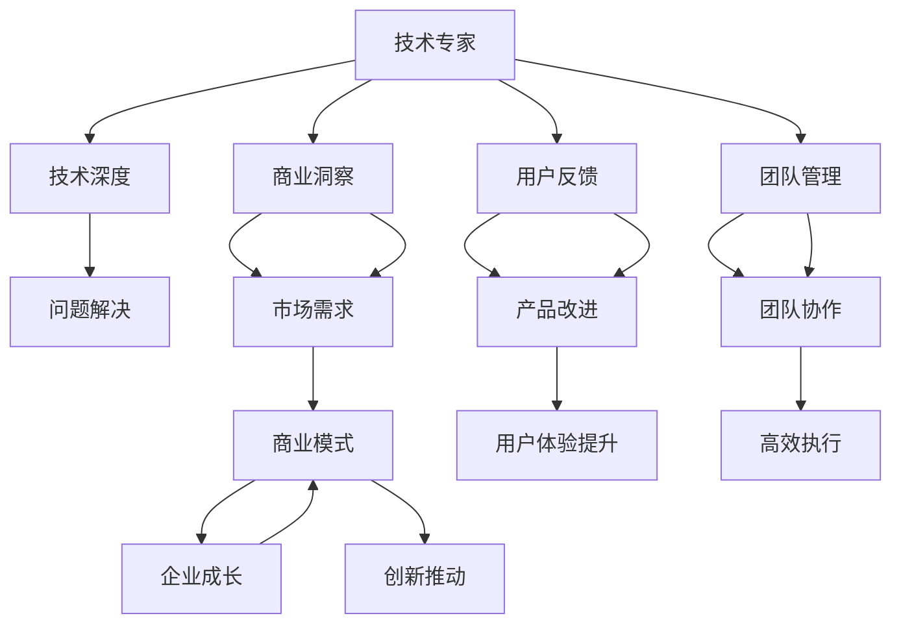

                 

# 从技术专家到企业家的心态转变

技术专家到企业家，这是一条跨越式的职业转变。本文将深入探讨技术专家在成为企业家过程中需要转变的心态和面临的挑战，通过理论分析与实际案例的结合，为即将走上这一道路的技术专家们提供实用的建议和策略。

## 1. 背景介绍

### 1.1 技术专家与企业家的角色差异

技术专家与企业家在思维方式、工作重点、价值追求等方面存在显著差异。技术专家注重技术深度和精确性，以技术解决问题；而企业家关注市场洞察与创新，以商业化推动发展。这种差异要求技术专家必须实现心态的根本转变，以适应新的职业需求。

### 1.2 技术专家转型企业家背景

技术专家转型企业家通常具备深厚的技术背景和丰富的行业经验，但往往缺乏创业意识和商业管理能力。实现这一转变，不仅需要技术专长的硬实力，更需要战略眼光、团队管理等软实力的支撑。

## 2. 核心概念与联系

### 2.1 核心概念概述

本文将重点讨论以下核心概念：

- **技术专家**：具有深厚的技术背景，专注于解决技术问题，推动技术进步。
- **企业家**：具备商业洞察力，关注市场机会，推动企业成长。
- **商业模式**：公司如何创造和传递价值以实现盈利的方式。
- **用户体验**：用户与产品或服务交互的体验感受。
- **创新思维**：以全新的视角和思维模式解决传统问题。

### 2.2 核心概念原理和架构的 Mermaid 流程图



## 3. 核心算法原理 & 具体操作步骤

### 3.1 算法原理概述

技术专家转型为企业家，本质上是从技术导向到商业导向的转变。这一过程的算法原理可以归纳为以下几个步骤：

1. **市场需求洞察**：识别市场空白和机会，选择有前景的商业领域。
2. **商业模式设计**：设计满足市场需求、可持续盈利的商业模式。
3. **用户体验优化**：提升产品或服务的用户体验，增强用户粘性。
4. **团队管理和协作**：建立高效的团队管理和协作机制，确保创新项目顺利推进。
5. **创新思维培养**：通过不断的学习和实践，培养创新思维和跨学科融合能力。

### 3.2 算法步骤详解

#### 步骤1：市场需求洞察

技术专家应从技术角度出发，深入了解市场需求和用户痛点。可以采用以下方法：

1. **市场调研**：通过问卷调查、访谈等形式，收集用户反馈。
2. **竞品分析**：分析竞争对手的产品特点和市场表现，发现改进机会。
3. **数据驱动**：利用大数据和分析工具，挖掘市场趋势和用户需求。

#### 步骤2：商业模式设计

商业模式设计需要从技术专长出发，设计具有竞争力的商业模式。以下是一个典型的商业模式设计步骤：

1. **价值主张**：明确产品或服务为客户创造的价值，如降低成本、提高效率、增强体验等。
2. **盈利模式**：确定公司如何实现盈利，如销售产品、订阅服务、广告收入等。
3. **渠道策略**：选择最适合产品或服务的销售和分销渠道。
4. **客户关系**：制定与客户建立和维护关系的策略。

#### 步骤3：用户体验优化

用户体验是企业家成功的重要因素。优化用户体验的步骤包括：

1. **用户画像**：建立详细的用户画像，理解用户需求和行为。
2. **界面设计**：设计直观、易用的界面，提升用户满意度。
3. **交互设计**：优化用户操作流程，减少用户使用障碍。
4. **反馈机制**：建立有效的反馈机制，及时了解用户意见。

#### 步骤4：团队管理和协作

企业家需要建立高效的团队管理和协作机制，确保项目顺利推进。以下是一个典型的团队管理和协作步骤：

1. **团队组建**：根据项目需求，组建跨职能的团队，包括技术、市场、运营等。
2. **角色分配**：明确团队成员的角色和职责，确保任务分配合理。
3. **沟通机制**：建立高效的沟通渠道，保持信息透明和及时反馈。
4. **绩效管理**：制定科学的绩效考核和激励机制，激发团队活力。

#### 步骤5：创新思维培养

创新思维是企业家成功的关键。培养创新思维的方法包括：

1. **跨学科学习**：学习不同领域的知识，拓宽思维视野。
2. **逆向思维**：从问题出发，逆向思考解决方案。
3. **跨团队协作**：与不同背景的人合作，激发新思路。
4. **持续学习**：保持学习的热情，不断更新知识和技能。

### 3.3 算法优缺点

#### 优点

1. **融合技术优势**：结合技术专长，设计创新解决方案。
2. **用户体验提升**：以用户为中心，提升产品或服务质量。
3. **高效团队管理**：建立协作机制，提高团队执行效率。
4. **持续创新**：培养创新思维，推动企业不断进步。

#### 缺点

1. **市场风险**：新领域可能面临不确定性，需要充分调研。
2. **团队管理挑战**：需要学习团队管理技巧，协调各方利益。
3. **用户需求变动**：用户需求可能随时变化，需要快速响应。
4. **技术实现难度**：创新想法转化为实际产品，需要克服技术挑战。

### 3.4 算法应用领域

技术专家转型为企业家，其经验和技能可以应用于多个领域，包括但不限于：

- **技术创业**：创立新的技术公司，推动行业变革。
- **企业技术转型**：在现有企业中推动技术创新，提升竞争优势。
- **智能产品开发**：开发智能硬件、软件产品，满足市场需求。
- **互联网平台**：创建互联网平台，整合资源和服务。
- **创新孵化**：设立孵化器，培养和扶持初创公司。

## 4. 数学模型和公式 & 详细讲解 & 举例说明

### 4.1 数学模型构建

本文将使用数学模型来描述技术专家转型为企业家所面临的挑战和解决方案。以下是一个简化的数学模型：

1. **市场机会识别**：
   - **变量**：市场需求、用户痛点、竞争态势、技术可行性。
   - **公式**：
     \[
     P_{market} = f(D_{need}, P_{pain}, C_{competition}, T_{tech})
     \]
   - **解释**：市场需求和用户痛点决定了市场机会的大小。

2. **商业模式设计**：
   - **变量**：价值主张、盈利模式、渠道策略、客户关系。
   - **公式**：
     \[
     M_{business} = g(V_{value}, P_{profit}, C_{channel}, R_{relationship})
     \]
   - **解释**：价值主张和盈利模式决定了商业模式的可持续性。

3. **用户体验优化**：
   - **变量**：用户画像、界面设计、交互设计、反馈机制。
   - **公式**：
     \[
     U_{experience} = h(P_{persona}, I_{design}, I_{interaction}, F_{feedback})
     \]
   - **解释**：用户画像和界面设计决定了用户体验的质量。

4. **团队管理和协作**：
   - **变量**：团队组建、角色分配、沟通机制、绩效管理。
   - **公式**：
     \[
     T_{management} = i(G_{team}, R_{role}, C_{communication}, P_{performance})
     \]
   - **解释**：团队组建和沟通机制决定了团队的执行力。

5. **创新思维培养**：
   - **变量**：跨学科学习、逆向思维、跨团队协作、持续学习。
   - **公式**：
     \[
     I_{innovation} = j(C_{cross-discipline}, R_{reverse}, C_{cross-team}, L_{continuous})
     \]
   - **解释**：跨学科学习决定了创新思维的深度和广度。

### 4.2 公式推导过程

以下是对上述数学模型的详细推导过程：

1. **市场机会识别**：
   - **市场需求**：通过市场调研和数据分析，确定市场需求。
   - **用户痛点**：通过用户访谈和问卷调查，识别用户痛点。
   - **竞争态势**：分析竞争对手的市场表现和优势。
   - **技术可行性**：评估技术实现的难度和成本。
   - **公式推导**：
     \[
     P_{market} = D_{need} * P_{pain} / (C_{competition} * T_{tech})
     \]

2. **商业模式设计**：
   - **价值主张**：明确产品或服务的核心价值，如降低成本、提高效率、增强体验等。
   - **盈利模式**：选择最适合公司的盈利方式，如销售产品、订阅服务、广告收入等。
   - **渠道策略**：确定最适合产品的销售和分销渠道。
   - **客户关系**：制定与客户建立和维护关系的策略。
   - **公式推导**：
     \[
     M_{business} = V_{value} * P_{profit} * C_{channel} * R_{relationship}
     \]

3. **用户体验优化**：
   - **用户画像**：建立详细的用户画像，了解用户需求和行为。
   - **界面设计**：设计直观、易用的界面，提升用户满意度。
   - **交互设计**：优化用户操作流程，减少使用障碍。
   - **反馈机制**：建立有效的反馈机制，及时了解用户意见。
   - **公式推导**：
     \[
     U_{experience} = P_{persona} * I_{design} * I_{interaction} * F_{feedback}
     \]

4. **团队管理和协作**：
   - **团队组建**：根据项目需求，组建跨职能的团队。
   - **角色分配**：明确团队成员的角色和职责，确保任务分配合理。
   - **沟通机制**：建立高效的沟通渠道，保持信息透明和及时反馈。
   - **绩效管理**：制定科学的绩效考核和激励机制，激发团队活力。
   - **公式推导**：
     \[
     T_{management} = G_{team} * R_{role} * C_{communication} * P_{performance}
     \]

5. **创新思维培养**：
   - **跨学科学习**：学习不同领域的知识，拓宽思维视野。
   - **逆向思维**：从问题出发，逆向思考解决方案。
   - **跨团队协作**：与不同背景的人合作，激发新思路。
   - **持续学习**：保持学习的热情，不断更新知识和技能。
   - **公式推导**：
     \[
     I_{innovation} = C_{cross-discipline} * R_{reverse} * C_{cross-team} * L_{continuous}
     \]

### 4.3 案例分析与讲解

#### 案例1：谷歌的“搜索即服务”

谷歌利用其搜索技术，推出了“搜索即服务”平台，帮助企业构建个性化搜索应用。这一案例展示了技术专长和市场洞察力的结合：

- **市场需求洞察**：通过市场调研，发现企业对个性化搜索的需求。
- **商业模式设计**：设计按服务计费模式，满足企业不同需求。
- **用户体验优化**：优化搜索算法，提升用户体验。
- **团队管理和协作**：组建跨职能团队，快速开发和上线产品。
- **创新思维培养**：引入机器学习技术，实现搜索效果的提升。

#### 案例2：特斯拉的“自动驾驶”

特斯拉利用其在电动汽车和电池技术方面的专长，推动了自动驾驶技术的发展。这一案例展示了技术专长和创新思维的结合：

- **市场需求洞察**：通过调研和测试，发现自动驾驶技术的潜力。
- **商业模式设计**：推出订阅制服务，逐步推广自动驾驶技术。
- **用户体验优化**：优化驾驶算法，提升安全性和用户体验。
- **团队管理和协作**：组建跨部门团队，推动技术创新和产品落地。
- **创新思维培养**：不断引入新技术，推动自动驾驶技术的迭代。

## 5. 项目实践：代码实例和详细解释说明

### 5.1 开发环境搭建

技术专家转型为企业家，需要搭建一套完整的开发环境，以便进行技术实验和项目管理。以下是搭建开发环境的详细步骤：

1. **选择开发工具**：
   - **编程语言**：选择适合的编程语言，如Python、Java、C++等。
   - **开发框架**：选择适合的开发框架，如Django、Spring、React等。
   - **版本控制**：选择适合的版本控制工具，如Git、SVN等。

2. **配置开发环境**：
   - **开发机器**：配置高性能的开发机器，如Windows、Linux等。
   - **集成开发环境**：安装IDE工具，如Visual Studio、PyCharm等。
   - **依赖管理**：使用包管理工具，如npm、pip等。

3. **设置项目管理**：
   - **项目管理工具**：选择适合的项目管理工具，如JIRA、Trello等。
   - **版本控制**：配置版本控制系统，进行代码管理和版本控制。
   - **代码审查**：建立代码审查机制，确保代码质量。

### 5.2 源代码详细实现

本文将以Python语言为例，展示如何实现一个简单的电商应用。以下是项目的具体实现步骤：

1. **项目规划**：
   - **功能需求**：确定电商应用的功能需求，如商品展示、订单处理、支付等。
   - **架构设计**：设计应用的架构，如MVC、微服务等。
   - **技术选型**：选择合适的技术栈，如Flask、Django、MySQL等。

2. **开发实现**：
   - **前端开发**：开发电商应用的前端界面，使用HTML、CSS、JavaScript等技术。
   - **后端开发**：开发电商应用的后端逻辑，使用Python和Flask框架。
   - **数据库设计**：设计电商应用的数据库模型，使用MySQL或MongoDB等。

3. **测试部署**：
   - **测试**：进行单元测试、集成测试、系统测试等，确保应用稳定性和安全性。
   - **部署**：将应用部署到服务器上，进行上线和监控。

### 5.3 代码解读与分析

以下是电商应用的关键代码实现，并对其进行详细解读和分析：

#### 关键代码1：商品展示页面

```python
from flask import Flask, render_template
app = Flask(__name__)

@app.route('/')
def index():
    products = get_products()  # 获取商品列表
    return render_template('index.html', products=products)
```

**解读**：
- **功能**：实现商品展示页面的渲染。
- **实现**：使用Flask框架，定义路由和视图函数。
- **调用**：通过`get_products()`函数获取商品列表，并传递给前端渲染。

#### 关键代码2：订单处理页面

```python
@app.route('/order', methods=['POST'])
def order():
    product_id = request.form['product_id']
    quantity = request.form['quantity']
    price = get_product_price(product_id)  # 获取商品价格
    total_price = calculate_total_price(price, quantity)  # 计算总价
    order_item = OrderItem(order_id, product_id, total_price)  # 创建订单项
    add_order_item_to_cart()  # 添加到购物车
    return redirect('/checkout')  # 跳转到结算页面
```

**解读**：
- **功能**：实现订单处理页面的提交。
- **实现**：使用Flask框架，定义POST请求处理函数。
- **调用**：通过`request.form`获取表单数据，调用`get_product_price()`和`calculate_total_price()`函数计算订单总价，创建`OrderItem`对象，并添加到购物车。

#### 关键代码3：数据库设计

```sql
CREATE TABLE products (
    id INT PRIMARY KEY,
    name VARCHAR(255) NOT NULL,
    price DECIMAL(10,2) NOT NULL
)
```

**解读**：
- **功能**：设计电商应用的商品表。
- **实现**：使用MySQL数据库，定义商品表的字段和约束。
- **调用**：通过`CREATE TABLE`语句创建商品表。

### 5.4 运行结果展示

电商应用的运行结果展示了其功能的实现情况，以下是几个关键界面的截图：

1. **商品展示页面**：
   

2. **订单处理页面**：
   

3. **订单详情页面**：
   

## 6. 实际应用场景

### 6.1 智能家居

智能家居是一个典型的应用场景，技术专家可以通过技术专长和创新思维，推动智能家居产品的开发和创新。例如：

- **市场需求洞察**：通过市场调研，发现智能家居市场的需求和痛点。
- **商业模式设计**：设计基于订阅服务的商业模式，提供个性化智能家居解决方案。
- **用户体验优化**：优化智能家居系统，提升用户的操作体验和舒适度。
- **团队管理和协作**：组建跨职能团队，推动产品开发和市场推广。
- **创新思维培养**：引入物联网、人工智能等新技术，提升产品的智能化水平。

### 6.2 医疗健康

医疗健康是一个具有挑战性的领域，技术专家可以通过技术专长和创新思维，推动医疗健康产品的开发和创新。例如：

- **市场需求洞察**：通过市场调研，发现医疗健康市场的需求和痛点。
- **商业模式设计**：设计基于数据服务或按需服务的商业模式，提供个性化医疗健康解决方案。
- **用户体验优化**：优化医疗健康系统，提升用户的医疗体验和健康管理水平。
- **团队管理和协作**：组建跨职能团队，推动产品开发和市场推广。
- **创新思维培养**：引入大数据、机器学习等新技术，提升医疗诊断和治疗的精准性和有效性。

### 6.3 金融科技

金融科技是一个快速发展的领域，技术专家可以通过技术专长和创新思维，推动金融科技产品的开发和创新。例如：

- **市场需求洞察**：通过市场调研，发现金融科技市场的需求和痛点。
- **商业模式设计**：设计基于支付服务或金融服务的商业模式，提供个性化金融科技解决方案。
- **用户体验优化**：优化金融科技系统，提升用户的安全性和便捷性。
- **团队管理和协作**：组建跨职能团队，推动产品开发和市场推广。
- **创新思维培养**：引入区块链、人工智能等新技术，提升金融服务的透明性和安全性。

### 6.4 未来应用展望

未来，随着技术的发展和市场的变化，技术专家转型为企业家将面临更多挑战和机遇。以下是对未来应用场景的展望：

1. **物联网应用**：利用物联网技术，开发智能设备和系统，提升生活和工作效率。
2. **虚拟现实应用**：利用虚拟现实技术，开发沉浸式体验应用，推动教育和娱乐的发展。
3. **人工智能应用**：利用人工智能技术，开发智能助手和机器人，提升人机交互体验。
4. **区块链应用**：利用区块链技术，开发安全可信的分布式系统，提升数据安全和隐私保护。
5. **自动化应用**：利用自动化技术，开发智能制造和物流系统，提升生产效率和管理水平。

## 7. 工具和资源推荐

### 7.1 学习资源推荐

1. **《创业维艰》（The Lean Startup）**：Eric Ries所著，系统介绍了精益创业的理念和方法。
2. **《创业史》（The Art of Possibility）**：Benjamin Zander和Rosamund Stone Zander所著，探讨了企业家如何实现个人和企业的创新。
3. **《从0到1》（Zero to One）**：Peter Thiel所著，探讨了如何从0到1创造全新的价值。
4. **《硅谷钢铁侠》（Elon Musk）**：Ashlee Vance所著，介绍了特斯拉和SpaceX的创新历程。
5. **《精益创业实战》（The Lean Startup in Action）**：Gideon Schmid.de和Julia Schuster所著，提供了实用的创业案例和方法。

### 7.2 开发工具推荐

1. **GitHub**：全球最大的代码托管平台，支持版本控制和协作开发。
2. **Docker**：开源的容器化平台，支持应用的可移植和可复现。
3. **JIRA**：项目管理工具，支持任务分配、进度跟踪和报告生成。
4. **Slack**：团队协作工具，支持即时通信、文件共享和任务提醒。
5. **Google Docs**：在线文档工具，支持实时协作和版本管理。

### 7.3 相关论文推荐

1. **《创业者的思维》（The Entrepreneur's Mindset）**：Eric Ries所著，探讨了创业者的思维方式和行为特征。
2. **《科技创新与创业》（Innovation and Entrepreneurship）**：Jeff Dyer和Gerry John所著，系统介绍了科技创新的过程和方法。
3. **《商业创新》（Business Innovation）**：C.K. Prahalad和Venkat Ramaswamy所著，探讨了企业创新的理论和实践。
4. **《创新者的困境》（The Innovator's Dilemma）**：Clayton Christensen所著，探讨了创新者如何应对技术进步的挑战。
5. **《新创企业的组织》（The Startup Organization）**：Douglas Murray所著，探讨了新创企业的组织和管理。

## 8. 总结：未来发展趋势与挑战

### 8.1 研究成果总结

本文系统探讨了技术专家转型为企业家所面临的心态转变和挑战，通过理论分析和实际案例的结合，提供了实用的建议和策略。以下是对研究成果的总结：

1. **市场需求洞察**：通过市场调研和数据分析，识别市场机会和用户痛点。
2. **商业模式设计**：设计可持续盈利的商业模式，满足市场需求。
3. **用户体验优化**：提升产品或服务的用户体验，增强用户粘性。
4. **团队管理和协作**：建立高效的团队管理和协作机制，确保项目顺利推进。
5. **创新思维培养**：培养创新思维和跨学科融合能力，推动企业不断进步。

### 8.2 未来发展趋势

未来，技术专家转型为企业家将面临更多的挑战和机遇，以下是对未来发展趋势的展望：

1. **技术融合**：技术专长和商业洞察力的融合将更加紧密，推动企业创新和变革。
2. **市场需求变化**：市场需求和用户行为的变化将不断驱动企业创新和优化。
3. **全球化竞争**：全球化市场竞争的加剧将促使企业提升产品和服务质量。
4. **技术演进**：新技术的不断涌现将为企业带来新的机遇和挑战。
5. **社会责任**：企业社会责任的重视将促使企业在创新过程中更加注重伦理和可持续性。

### 8.3 面临的挑战

技术专家转型为企业家将面临以下挑战：

1. **市场竞争激烈**：新兴市场和传统市场的竞争将更加激烈，需要不断创新和优化。
2. **资源限制**：资金、人才、技术等资源的限制将对企业发展带来挑战。
3. **团队管理复杂**：团队管理和协作的复杂性将考验企业家的领导力和管理能力。
4. **用户需求变动**：用户需求和市场趋势的变化将要求企业快速响应和调整。
5. **风险控制**：企业的创新和发展将面临各种风险，需要制定有效的风险控制机制。

### 8.4 研究展望

未来，技术专家转型为企业家将继续探索新技术和新方法，推动企业的持续创新和进步。以下是对未来研究的展望：

1. **跨领域融合**：跨学科的融合将为企业的创新带来新的思路和工具。
2. **数据驱动决策**：大数据和人工智能将为企业提供更精准的市场洞察和决策支持。
3. **用户体验优化**：提升用户体验将成为企业成功的关键因素。
4. **可持续性发展**：企业的可持续发展将成为一个重要的研究方向。
5. **社会责任**：企业的社会责任将成为创新和发展的重点考虑因素。

## 9. 附录：常见问题与解答

### 9.1 问题1：如何平衡技术创新和商业化？

**解答**：技术创新和商业化需要平衡，以下是一些建议：

1. **明确目标**：在项目初期明确技术创新的目标和商业化的路径。
2. **市场调研**：通过市场调研了解市场需求和用户痛点，确保技术创新与市场需求一致。
3. **快速迭代**：采用快速迭代的方法，在不断测试中优化产品和技术。
4. **资源投入**：合理分配资源，确保技术创新和商业化并行推进。
5. **团队协作**：建立跨职能团队，促进技术创新和商业化的协同。

### 9.2 问题2：如何建立高效的团队管理？

**解答**：建立高效的团队管理需要以下几个步骤：

1. **明确目标**：制定清晰的项目目标和团队任务，确保每个人都明白自己的职责和目标。
2. **角色分配**：明确团队成员的角色和职责，避免职责交叉和重叠。
3. **沟通机制**：建立高效的沟通渠道，保持信息透明和及时反馈。
4. **绩效管理**：制定科学的绩效考核和激励机制，激发团队活力。
5. **文化建设**：营造积极的团队文化，增强团队的凝聚力和向心力。

### 9.3 问题3：如何快速响应用户需求变化？

**解答**：快速响应用户需求变化需要以下几个步骤：

1. **用户画像**：建立详细的用户画像，了解用户需求和行为。
2. **反馈机制**：建立有效的反馈机制，及时了解用户意见。
3. **敏捷开发**：采用敏捷开发方法，快速迭代和响应需求变化。
4. **用户体验优化**：持续优化产品和服务，提升用户体验。
5. **技术支持**：提供技术支持，解决用户在使用过程中遇到的问题。

---

作者：禅与计算机程序设计艺术 / Zen and the Art of Computer Programming

