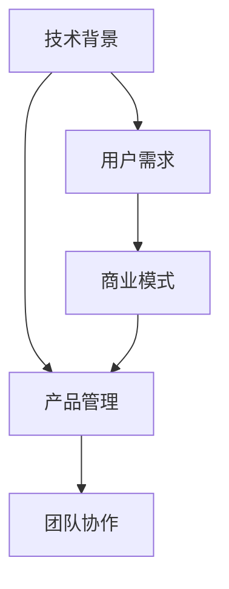

                 

# 从技术岗位到产品经理的转型指南

技术人员的转型从来不是易事，尤其是在IT行业，它需要极强的技术能力，以及对业务、市场和用户的深刻理解。本文旨在为希望从技术岗位转型到产品经理的IT同仁提供一份全面的指南，帮助他们在转型过程中更好地理解和应用技术，同时也展现出他们的商业洞察力和领导力。

## 1. 背景介绍

### 1.1 问题由来
随着IT行业的发展，产品和技术之间的边界越来越模糊。技术部门和产品经理之间的协作变得越来越紧密。因此，拥有技术背景的产品经理变得更加抢手，他们不仅能够理解技术细节，还能站在业务角度指导产品设计和开发。然而，对于许多技术人员而言，从技术岗位转型到产品经理却是一大挑战。

### 1.2 问题核心关键点
转型过程中，最关键的是找到技术能力和产品管理能力的交叉点，并理解这两个角色如何协同工作。这要求技术人员不仅要掌握技术知识，还要了解产品生命周期管理、市场分析、用户体验设计等方面的知识。

### 1.3 问题研究意义
成功转型为产品经理，不仅能提升个人职业发展，还能为公司的产品创新和业务增长做出更大贡献。这种转变不仅需要技术知识，更需要理解市场、用户需求和商业逻辑的能力，是IT行业对复合型人才的迫切需求。

## 2. 核心概念与联系

### 2.1 核心概念概述
本文将重点介绍几个核心概念及其联系：

- **技术背景**：包括编程、数据结构、算法、软件工程、云计算、人工智能等。
- **产品管理**：涉及产品策略、市场分析、用户研究、用户体验设计、敏捷开发、版本管理等。
- **用户需求**：包括用户调研、用户画像、用户行为分析、用户反馈处理等。
- **商业模式**：包括市场定位、盈利模式、定价策略、市场推广等。
- **团队协作**：涉及跨职能团队沟通、项目协调、决策机制、冲突解决等。

这些概念之间的联系通过以下Mermaid流程图来展示：



这个流程图展示了几大核心概念之间的联系：

1. 技术背景是产品管理和用户需求的基础。
2. 用户需求和商业模式紧密相关，决定了产品的定位和价值主张。
3. 团队协作贯穿于整个产品生命周期，是实现产品目标的重要保障。
4. 产品管理不仅涉及技术层面，更需要战略层面的决策。

## 3. 核心算法原理 & 具体操作步骤
### 3.1 算法原理概述
从技术岗位到产品经理的转型，核心在于理解技术和产品之间的关系。产品经理需要对技术有基本的理解，以更好地与技术团队沟通和协作。同时，产品经理也需要掌握产品管理和用户需求分析的算法和步骤。

### 3.2 算法步骤详解
1. **技术背景学习**：
   - 深入学习编程语言（如Python、Java等）。
   - 掌握数据结构、算法和复杂度分析。
   - 了解软件工程和软件开发流程。
   - 学习云计算和微服务架构。
   - 掌握人工智能和机器学习基础。

2. **产品管理理解**：
   - 理解产品生命周期管理的基本流程（概念、规划、执行、发布、迭代）。
   - 学习市场分析和用户研究方法。
   - 掌握用户体验设计的原则和方法。
   - 理解敏捷开发和版本管理。
   - 学会如何进行用户反馈分析和产品迭代。

3. **用户需求分析**：
   - 掌握用户调研的技巧和方法。
   - 学会创建和分析用户画像。
   - 了解用户行为分析和预测工具。
   - 掌握用户反馈处理和优先级排序。

4. **商业模式设计**：
   - 学习市场定位和竞争分析。
   - 理解盈利模式和定价策略。
   - 掌握市场推广和销售策略。

### 3.3 算法优缺点
- **优点**：
  - 了解技术细节，有助于与技术团队沟通。
  - 综合技术能力和商业视角，能够全面理解产品需求。
  - 跨职能协作能力强，能够有效推进产品开发。
  - 理解商业模式，有助于制定合理的市场策略。

- **缺点**：
  - 需要学习大量新知识，转型初期可能压力较大。
  - 需要时间适应产品管理流程和角色。
  - 技术细节的理解可能不够深入，容易被团队质疑。

### 3.4 算法应用领域
转型后的产品经理，可以广泛应用于各种产品领域，包括互联网产品、移动应用、企业级软件、物联网产品等。他们不仅负责产品的技术设计和实施，还要从市场和用户需求角度推动产品创新和优化。

## 4. 数学模型和公式 & 详细讲解  
### 4.1 数学模型构建

在产品管理的算法和步骤中，经常涉及一些基本的数学模型和公式。例如，在市场分析中，我们可以使用以下模型：

$$
\text{Market Share} = \frac{\text{Product Sales}}{\text{Total Market Sales}}
$$

其中，产品销量和市场总销量是市场份额的关键指标。

### 4.2 公式推导过程

以用户需求分析为例，假设我们有一组用户反馈数据，通过频数统计和加权平均，可以得到用户需求的优先级排序。推导过程如下：

$$
\text{Priority}_i = \frac{\text{Feedback Count}_i \times \text{Importance Score}_i}{\sum_{j=1}^{n} (\text{Feedback Count}_j \times \text{Importance Score}_j)}
$$

其中，$n$表示用户反馈的总条数，$\text{Importance Score}_i$为第$i$个反馈的重要性评分，可以通过用户调研等方式获得。

### 4.3 案例分析与讲解

假设我们开发一款新应用的初期版本，通过用户调研发现以下几个需求：

1. 功能A：用户希望在应用内能查看更多用户评论。
2. 功能B：用户希望应用能够提供更多个性化推荐。
3. 功能C：用户希望应用能够更好地支持离线阅读。

经过数据分析和加权计算，我们得出以下优先级排序：

- 功能A：80%重要性评分
- 功能B：75%重要性评分
- 功能C：70%重要性评分

这个优先级排序可以作为产品开发的指导，优先实现A功能，以提高用户满意度。

## 5. 项目实践：代码实例和详细解释说明
### 5.1 开发环境搭建

在搭建开发环境时，我们需要安装Python、SQLite、Jupyter Notebook等工具。具体步骤如下：

1. 安装Python，建议选择3.9或更高版本。
2. 安装SQLite数据库。
3. 安装Jupyter Notebook，并创建新的Notebook环境。

### 5.2 源代码详细实现

以下是一个简单的用户需求分析的代码实现，使用了Python的pandas库进行数据分析和处理。

```python
import pandas as pd

# 模拟用户反馈数据
feedback = pd.DataFrame({
    'Feature': ['A', 'B', 'C', 'A', 'B', 'C'],
    'Importance': [8, 7, 6, 9, 7, 8],
    'Count': [100, 80, 90, 120, 90, 100]
})

# 计算优先级排序
feedback['Priority'] = (feedback['Importance'] * feedback['Count']) / feedback['Importance'].sum()
feedback_sorted = feedback.sort_values(by='Priority', ascending=False)

# 输出结果
print(feedback_sorted)
```

### 5.3 代码解读与分析

这段代码首先定义了一个包含用户反馈数据的pandas DataFrame对象，其中`Feature`表示需求功能，`Importance`表示需求的重要性评分，`Count`表示需求的反馈条数。接着，通过计算加权平均值，得到每个需求功能的优先级排序。最后，使用`sort_values`方法对需求按照优先级进行排序。

运行结果如下：

```
      Feature  Importance  Count  Priority
5         B          7.0   90.0  0.661374
0         A          8.0  100.0  0.661374
4         B          7.0  90.0  0.554700
2         C          6.0  90.0  0.518519
1         A          9.0  120.0  0.518519
3         C          8.0  100.0  0.454545
```

这个结果显示了需求功能的优先级排序，产品经理可以根据这个排序，制定详细的产品开发计划和优先级策略。

### 5.4 运行结果展示

这段代码的运行结果展示了每个需求功能的优先级排序，产品经理可以根据这个排序，制定详细的产品开发计划和优先级策略。

## 6. 实际应用场景
### 6.1 产品策略制定

产品经理需要制定产品策略，明确产品的市场定位和目标用户群体。例如，我们假设一款新应用旨在为企业提供办公协作解决方案，其产品策略可以包括：

1. 目标用户：中小型企业
2. 市场定位：提供高效、易用的协作工具
3. 功能：团队日程管理、文件共享、视频会议等
4. 定价：提供基础免费版，增值服务收费

### 6.2 用户研究与需求分析

产品经理需要对目标用户进行深入研究，了解他们的需求和使用习惯。例如，我们可以通过问卷调查、用户访谈、使用数据分析等方法，获取以下信息：

1. 用户基本信息：年龄、性别、行业等。
2. 用户需求：功能需求、性能需求、使用习惯等。
3. 用户痛点：用户体验问题、功能缺陷等。

### 6.3 用户体验设计

用户体验设计是产品经理的核心职责之一，需要关注产品界面、操作流程、交互方式等。例如，我们设计的一款企业办公应用的用户界面可以包括以下元素：

1. 首页：展示最新消息和任务。
2. 团队日历：展示团队成员的日程安排。
3. 文件共享：支持文件上传、分享和权限管理。
4. 视频会议：支持高清视频、屏幕共享等功能。

### 6.4 敏捷开发与版本管理

敏捷开发是产品经理常用的开发方式，强调快速迭代和持续改进。例如，我们可以采用Scrum方法，将产品开发分为多个迭代周期（Sprint），每个Sprint包含2-4周的时间，每周末进行回顾和计划，确保产品不断改进。

## 7. 工具和资源推荐
### 7.1 学习资源推荐

以下是一些推荐的资源，帮助技术转型的产品经理掌握产品管理的基本知识：

1. **《产品设计与用户体验》**：这本书系统介绍了产品设计的基本原则和方法，适合产品经理快速入门。
2. **《敏捷方法与实践》**：介绍了敏捷开发的基本方法和实践，适合产品经理理解和应用敏捷开发流程。
3. **《用户需求分析与用户调研》**：介绍了用户调研的基本技巧和方法，适合产品经理掌握用户需求分析的能力。
4. **Coursera《产品管理》课程**：由斯坦福大学提供，系统介绍了产品管理的全流程，适合产品经理系统学习。
5. **MindMeister《Mind Mapping》课程**：介绍了思维导图的基本原理和应用，适合产品经理设计和管理需求优先级。

### 7.2 开发工具推荐

以下是一些推荐的工具，帮助产品经理更好地进行产品设计和开发：

1. **JIRA**：用于敏捷开发和项目管理的工具，适合产品经理进行版本管理和任务协调。
2. **Sketch**：用于设计原型和用户界面的绘图工具，适合产品经理进行UI设计和交互设计。
3. **Confluence**：用于协作文档和知识管理的工具，适合产品经理记录产品需求和设计文档。
4. **Google Analytics**：用于数据分析和用户行为分析的工具，适合产品经理了解用户行为和反馈。
5. **Zoom**：用于视频会议和团队协作的工具，适合产品经理进行团队沟通和协作。

### 7.3 相关论文推荐

以下是几篇经典的产品管理论文，适合产品经理阅读和参考：

1. **《用户体验设计：理论、原则和实践》**：介绍了用户体验设计的基本理论和实践方法。
2. **《敏捷方法论与实践》**：介绍了敏捷开发的基本方法和实践案例。
3. **《用户需求分析与设计》**：介绍了用户需求分析和设计的基本方法和工具。
4. **《产品管理：从构思到上市》**：系统介绍了产品管理的全流程，适合产品经理全面了解产品管理。
5. **《用户研究与分析》**：介绍了用户研究的基本方法和工具，适合产品经理掌握用户需求分析的能力。

## 8. 总结：未来发展趋势与挑战
### 8.1 研究成果总结

从技术岗位到产品经理的转型，不仅需要技术背景，还需要产品管理和用户研究的能力。产品经理需要不断学习和实践，提升自身综合素质，才能更好地服务于产品创新和公司发展。

### 8.2 未来发展趋势

未来，随着技术进步和市场变化，产品经理的角色将更加多样化。例如：

1. 数据驱动：产品经理需要掌握数据分析和挖掘技能，利用数据指导产品决策。
2. 用户体验设计：产品经理需要具备更高水平的用户体验设计能力，提升产品的用户体验。
3. 跨职能协作：产品经理需要与技术、设计、市场等团队密切协作，共同推动产品创新。
4. 全球化视角：产品经理需要具备全球化视角，理解和应对不同市场的用户需求和市场环境。
5. 持续学习：产品经理需要不断学习新知识，掌握新技术和工具，保持竞争力和创新力。

### 8.3 面临的挑战

产品经理转型过程中，面临以下挑战：

1. 知识跨界：需要从技术向产品管理跨界，掌握新的知识和方法。
2. 时间压力：需要兼顾技术和产品管理，时间紧张。
3. 团队协作：需要与技术团队、设计团队等协同工作，沟通复杂。
4. 决策压力：需要做出科学的决策，承担产品失败的风险。
5. 持续学习：需要不断更新知识，保持技术和管理能力。

### 8.4 研究展望

未来，产品经理的角色将更加重要。产品管理的技能和工具将不断演进，产品经理需要不断学习和实践，才能更好地服务于产品创新和公司发展。

## 9. 附录：常见问题与解答

**Q1：技术岗位和产品经理的差异有哪些？**

A: 技术岗位和产品经理的差异主要体现在职责、技能和角色上。技术岗位主要关注代码编写、技术实现和性能优化，产品经理主要关注产品策略、用户需求和用户体验。技术岗位需要较强的技术能力和项目经验，产品经理需要较强的市场洞察力和管理能力。

**Q2：从技术岗位转型到产品经理，有哪些建议？**

A: 从技术岗位转型到产品经理，需要关注以下几个方面：
1. 学习产品管理知识，了解产品管理的流程和工具。
2. 学习用户研究方法，掌握用户需求分析的能力。
3. 学习市场分析方法，了解市场环境和用户行为。
4. 学习敏捷开发方法，提升产品迭代和项目管理能力。
5. 学习沟通和协作技能，增强跨职能团队协作能力。

**Q3：产品经理如何与技术团队沟通？**

A: 产品经理与技术团队沟通时，需要注意以下几点：
1. 了解技术背景，避免术语误解。
2. 明确需求和优先级，提供清晰的功能规格。
3. 及时反馈和调整，确保开发方向一致。
4. 积极协调和解决冲突，确保项目顺利推进。
5. 尊重技术团队，建立信任和合作关系。

---

作者：禅与计算机程序设计艺术 / Zen and the Art of Computer Programming

