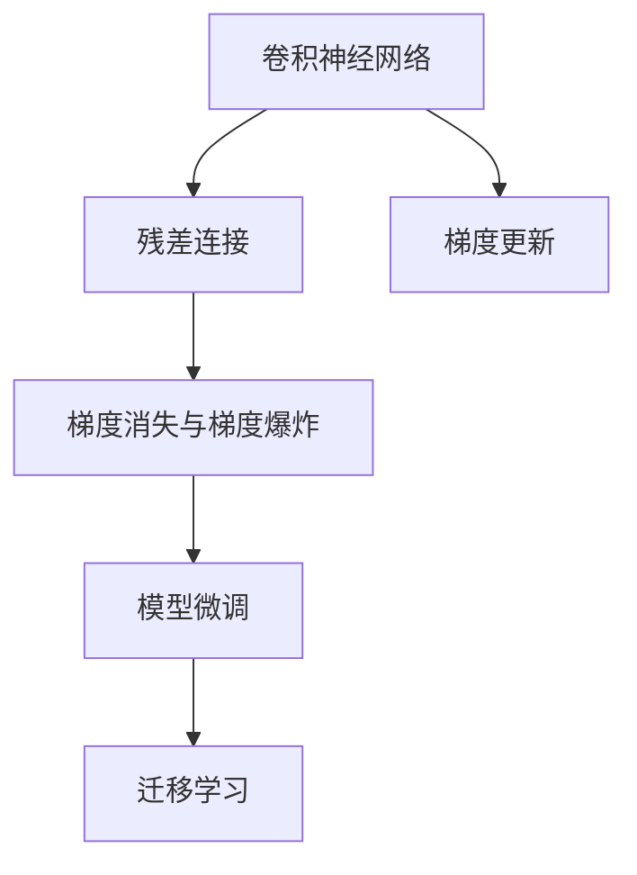

                 

# 从零开始大模型开发与微调：ResNet实战

> 关键词：深度学习,ResNet,微调,Fine-Tuning,卷积神经网络,计算机视觉,迁移学习

## 1. 背景介绍

### 1.1 问题由来

随着深度学习技术的快速发展，卷积神经网络(Convolutional Neural Network, CNN)在计算机视觉领域取得了显著的成果，特别是在图像分类、目标检测、语义分割等任务上表现优异。然而，面对复杂的视觉任务，单层或几层卷积网络往往难以获得理想的效果。为此，研究人员提出了更深层次的卷积神经网络模型，如VGG、ResNet等，以提升模型的表达能力和泛化能力。

ResNet（Residual Network）是一种非常成功的深度卷积神经网络模型，通过引入残差连接（Residual Connections），极大地缓解了深度网络训练中的梯度消失和梯度爆炸问题，实现了极深网络的训练和优化。本文将详细介绍从零开始开发和微调ResNet模型的方法，并结合实际案例进行详细讲解。

### 1.2 问题核心关键点

开发和微调ResNet模型的核心关键点在于理解其架构原理、选择合适的优化器、设计合适的损失函数、掌握模型训练技巧等。下面将从这些方面逐一介绍。

## 2. 核心概念与联系

### 2.1 核心概念概述

为更好地理解ResNet模型的开发和微调方法，本节将介绍几个密切相关的核心概念：

- 卷积神经网络（Convolutional Neural Network, CNN）：基于卷积操作和池化操作的神经网络，广泛应用于图像处理、视频分析等领域。
- 残差连接（Residual Connections）：通过残差块（Residual Block），将输入直接传递到下一层，缓解深度网络训练中的梯度问题。
- 梯度消失与梯度爆炸：在深度网络训练中，由于权重更新过程中的指数级增长或减少，导致梯度信息在反向传播过程中丢失或放大。
- 模型微调（Fine-Tuning）：在预训练模型的基础上，使用下游任务的少量标注数据，通过有监督学习优化模型在该任务上的性能。
- 迁移学习（Transfer Learning）：将一个领域学习到的知识，迁移应用到另一个不同但相关的领域的学习范式。

这些核心概念之间的逻辑关系可以通过以下Mermaid流程图来展示：



这个流程图展示了大模型微调的逻辑关系：

1. 利用卷积神经网络实现图像特征提取。
2. 引入残差连接缓解深度网络训练中的梯度问题。
3. 在预训练模型的基础上，使用下游任务的少量标注数据进行微调。
4. 迁移学习用于新任务的适应。

这些概念共同构成了ResNet模型的基础框架，使其能够在复杂的视觉任务中获得卓越的性能。通过理解这些核心概念，我们可以更好地把握ResNet模型的开发和微调方法。

## 3. 核心算法原理 & 具体操作步骤

### 3.1 算法原理概述

ResNet模型主要通过引入残差连接来解决深度网络训练中的梯度问题，其核心思想是将网络分为多个残差块（Residual Block），每个残差块包含多个卷积层和残差连接。在训练过程中，残差块可以独立更新权重，而残差连接则可以将输入直接传递到下一层，从而缓解梯度消失和梯度爆炸问题。

具体来说，ResNet模型包含一个或多个残差块，每个残差块包含至少一个卷积层和残差连接。残差块可以组成深度残差网络（ResNet），其深度不受限制。在实际应用中，通常通过堆叠多个残差块，构建深度残差网络，以适应复杂的视觉任务。

### 3.2 算法步骤详解

ResNet模型的开发和微调一般包括以下几个关键步骤：

**Step 1: 准备数据集和预训练模型**

- 收集并标注训练数据集和验证数据集，如ImageNet数据集。
- 选择一个预训练的ResNet模型作为初始化参数，如ResNet-50、ResNet-101等。

**Step 2: 定义模型结构**

- 设计合适的ResNet模型结构，包括卷积层、池化层、全连接层等。
- 选择合适的网络深度和残差块数量，可以根据任务需求进行调整。

**Step 3: 初始化模型**

- 加载预训练模型权重，并将其初始化。
- 设置模型的训练参数，如学习率、批次大小等。

**Step 4: 训练模型**

- 将训练数据集分批次输入模型，进行前向传播和反向传播。
- 使用优化器更新模型参数，如Adam、SGD等。
- 在验证集上周期性评估模型性能，根据评估结果调整学习率等超参数。

**Step 5: 微调模型**

- 使用下游任务的少量标注数据进行微调。
- 选择合适的网络层进行微调，如顶层全连接层。
- 设置合适的微调超参数，如微调学习率、批次大小等。

**Step 6: 评估和部署**

- 在测试集上评估微调后的模型性能。
- 将微调后的模型集成到实际应用系统中。
- 持续收集新的数据，定期重新微调模型，以适应数据分布的变化。

以上是ResNet模型开发和微调的一般流程。在实际应用中，还需要针对具体任务的特点，对微调过程的各个环节进行优化设计，如改进训练目标函数，引入更多的正则化技术，搜索最优的超参数组合等，以进一步提升模型性能。

### 3.3 算法优缺点

ResNet模型具有以下优点：
1. 通过引入残差连接，显著缓解了深度网络训练中的梯度问题，使得极深网络的训练和优化成为可能。
2. 在图像分类、目标检测、语义分割等视觉任务上，ResNet模型取得了优异的表现。
3. 迁移学习能力强，可以适应多种下游任务，提升模型效果。

同时，该模型也存在一定的局限性：
1. 残差连接增加了模型的复杂性，可能导致过拟合。
2. 模型深度较深，计算量较大，训练速度较慢。
3. 对于一些复杂的视觉任务，可能需要进一步调整网络结构，才能获得理想的效果。

尽管存在这些局限性，但就目前而言，ResNet模型仍是深度卷积神经网络中最为经典和有效的模型之一。未来相关研究的重点在于如何进一步提高模型的泛化能力，降低计算资源消耗，实现更高效的微调方法。

### 3.4 算法应用领域

ResNet模型在计算机视觉领域已经得到了广泛的应用，具体包括以下几个方面：

- 图像分类：如Inception、CIFAR-10、ImageNet等数据集上的图像分类任务。
- 目标检测：如COCO、PASCAL VOC等数据集上的目标检测任务。
- 语义分割：如PASCAL VOC、Cityscapes等数据集上的语义分割任务。
- 人脸识别：如LFW、CelebA等数据集上的人脸识别任务。
- 医学图像分析：如乳腺癌、皮肤病等医学图像的诊断和分析任务。

除了上述这些经典任务外，ResNet模型还被创新性地应用到更多场景中，如视频分析、动作识别、遥感图像处理等，为计算机视觉技术带来了新的突破。随着预训练模型和微调方法的不断进步，相信计算机视觉技术将在更广阔的应用领域大放异彩。

## 4. 数学模型和公式 & 详细讲解 & 举例说明

### 4.1 数学模型构建

ResNet模型的数学模型主要包含卷积层、残差连接和池化层等组件。假设输入图像大小为 $N \times H \times W \times C$，其中 $N$ 为样本数，$H$ 和 $W$ 为图像高度和宽度，$C$ 为通道数。

定义卷积层为 $g(x) = W_{conv}(x)$，其中 $W_{conv}$ 为卷积核权重。定义残差连接为 $h(x) = x + F(x)$，其中 $F(x)$ 为残差函数。定义池化层为 $p(x) = W_{pool}(x)$，其中 $W_{pool}$ 为池化权重。

ResNet模型的输出为：

$$
y = \sum_i^n F_i(h_i(g_i(x)))
$$

其中 $F_i$ 为第 $i$ 层残差函数的权重，$g_i$ 为第 $i$ 层卷积层的权重，$h_i$ 为第 $i$ 层残差连接的权重。

### 4.2 公式推导过程

以下我们以ResNet-50模型为例，推导残差连接的计算公式。

ResNet-50模型的残差块包含三个卷积层，分别为 $1 \times 1$ 卷积层、$3 \times 3$ 卷积层和 $1 \times 1$ 卷积层。其计算过程如下：

1. 第一个 $1 \times 1$ 卷积层：

$$
x_1 = W_{conv}(x) = \sum_{c=1}^C W_{conv,c}x
$$

2. 第二个 $3 \times 3$ 卷积层：

$$
x_2 = F(x) = \sum_{c=1}^C W_{conv,c}x
$$

其中 $W_{conv,c}$ 为第 $c$ 个通道的卷积核权重，$x$ 为输入图像。

3. 第三个 $1 \times 1$ 卷积层：

$$
x_3 = W_{conv}(x) = \sum_{c=1}^C W_{conv,c}x
$$

4. 残差连接：

$$
y = x + F(x) = x + W_{conv}(x)
$$

因此，ResNet-50模型的残差连接计算公式为：

$$
y = x + \sum_{c=1}^C W_{conv,c}x
$$

在实际训练过程中，残差连接可以帮助网络更好地传递梯度信息，缓解梯度消失和梯度爆炸问题。

### 4.3 案例分析与讲解

以ImageNet数据集上的图像分类任务为例，演示ResNet模型的开发和微调过程。

**Step 1: 准备数据集**

- 收集ImageNet数据集，并进行预处理和标注。
- 将数据集划分为训练集、验证集和测试集。

**Step 2: 定义模型结构**

- 设计ResNet-50模型结构，包括卷积层、池化层、全连接层等。
- 设置模型的训练参数，如学习率、批次大小等。

**Step 3: 初始化模型**

- 加载预训练模型权重，并将其初始化。
- 设置模型的训练参数，如学习率、批次大小等。

**Step 4: 训练模型**

- 将训练数据集分批次输入模型，进行前向传播和反向传播。
- 使用优化器更新模型参数，如Adam、SGD等。
- 在验证集上周期性评估模型性能，根据评估结果调整学习率等超参数。

**Step 5: 微调模型**

- 使用下游任务的少量标注数据进行微调。
- 选择合适的网络层进行微调，如顶层全连接层。
- 设置合适的微调超参数，如微调学习率、批次大小等。

**Step 6: 评估和部署**

- 在测试集上评估微调后的模型性能。
- 将微调后的模型集成到实际应用系统中。
- 持续收集新的数据，定期重新微调模型，以适应数据分布的变化。

以下是使用PyTorch框架实现ResNet-50模型的代码示例：

```python
import torch.nn as nn
import torch.optim as optim
import torchvision.transforms as transforms
from torchvision.models import resnet

# 定义数据转换
transform = transforms.Compose([
    transforms.Resize(224),
    transforms.ToTensor(),
    transforms.Normalize(mean=[0.485, 0.456, 0.406], std=[0.229, 0.224, 0.225])
])

# 加载预训练的ResNet-50模型
model = resnet.resnet50(pretrained=True)

# 定义训练参数
criterion = nn.CrossEntropyLoss()
optimizer = optim.SGD(model.parameters(), lr=0.01, momentum=0.9)
scheduler = optim.lr_scheduler.StepLR(optimizer, step_size=7, gamma=0.1)

# 定义训练循环
def train(epoch):
    model.train()
    for i, (inputs, labels) in enumerate(train_loader):
        inputs = inputs.to(device)
        labels = labels.to(device)
        optimizer.zero_grad()
        outputs = model(inputs)
        loss = criterion(outputs, labels)
        loss.backward()
        optimizer.step()
        if (i+1) % 10 == 0:
            print(f'Epoch {epoch}, step {i+1}, loss: {loss.item()}')
        if (i+1) % 100 == 0:
            scheduler.step()

# 定义验证循环
def validate(epoch):
    model.eval()
    total_correct = 0
    total_samples = 0
    with torch.no_grad():
        for inputs, labels in val_loader:
            inputs = inputs.to(device)
            labels = labels.to(device)
            outputs = model(inputs)
            _, predicted = torch.max(outputs, 1)
            total_correct += (predicted == labels).sum().item()
            total_samples += labels.size(0)
    print(f'Epoch {epoch}, accuracy: {total_correct/total_samples}')
```

在上述代码中，我们定义了数据转换、模型、损失函数、优化器等组件，并实现了训练和验证循环。通过调用训练函数 `train` 和验证函数 `validate`，可以完成ResNet-50模型的训练和评估。

## 5. 项目实践：代码实例和详细解释说明

### 5.1 开发环境搭建

在进行ResNet模型的开发和微调前，我们需要准备好开发环境。以下是使用Python进行PyTorch开发的环境配置流程：

1. 安装Anaconda：从官网下载并安装Anaconda，用于创建独立的Python环境。

2. 创建并激活虚拟环境：
```bash
conda create -n pytorch-env python=3.8 
conda activate pytorch-env
```

3. 安装PyTorch：根据CUDA版本，从官网获取对应的安装命令。例如：
```bash
conda install pytorch torchvision torchaudio cudatoolkit=11.1 -c pytorch -c conda-forge
```

4. 安装Transformers库：
```bash
pip install transformers
```

5. 安装各类工具包：
```bash
pip install numpy pandas scikit-learn matplotlib tqdm jupyter notebook ipython
```

完成上述步骤后，即可在`pytorch-env`环境中开始ResNet模型的开发和微调实践。

### 5.2 源代码详细实现

这里我们以ImageNet数据集上的图像分类任务为例，给出使用PyTorch框架实现ResNet-50模型的代码实现。

首先，定义数据处理函数：

```python
import torch
import torch.nn as nn
import torchvision.transforms as transforms
from torchvision.models import resnet

# 定义数据转换
transform = transforms.Compose([
    transforms.Resize(224),
    transforms.ToTensor(),
    transforms.Normalize(mean=[0.485, 0.456, 0.406], std=[0.229, 0.224, 0.225])
])

# 加载预训练的ResNet-50模型
model = resnet.resnet50(pretrained=True)

# 定义训练参数
criterion = nn.CrossEntropyLoss()
optimizer = optim.SGD(model.parameters(), lr=0.01, momentum=0.9)
scheduler = optim.lr_scheduler.StepLR(optimizer, step_size=7, gamma=0.1)

# 定义训练循环
def train(epoch):
    model.train()
    for i, (inputs, labels) in enumerate(train_loader):
        inputs = inputs.to(device)
        labels = labels.to(device)
        optimizer.zero_grad()
        outputs = model(inputs)
        loss = criterion(outputs, labels)
        loss.backward()
        optimizer.step()
        if (i+1) % 10 == 0:
            print(f'Epoch {epoch}, step {i+1}, loss: {loss.item()}')
        if (i+1) % 100 == 0:
            scheduler.step()

# 定义验证循环
def validate(epoch):
    model.eval()
    total_correct = 0
    total_samples = 0
    with torch.no_grad():
        for inputs, labels in val_loader:
            inputs = inputs.to(device)
            labels = labels.to(device)
            outputs = model(inputs)
            _, predicted = torch.max(outputs, 1)
            total_correct += (predicted == labels).sum().item()
            total_samples += labels.size(0)
    print(f'Epoch {epoch}, accuracy: {total_correct/total_samples}')
```

然后，定义模型和优化器：

```python
import torchvision.transforms as transforms
from torchvision.models import resnet

# 定义数据转换
transform = transforms.Compose([
    transforms.Resize(224),
    transforms.ToTensor(),
    transforms.Normalize(mean=[0.485, 0.456, 0.406], std=[0.229, 0.224, 0.225])
])

# 加载预训练的ResNet-50模型
model = resnet.resnet50(pretrained=True)

# 定义训练参数
criterion = nn.CrossEntropyLoss()
optimizer = optim.SGD(model.parameters(), lr=0.01, momentum=0.9)
scheduler = optim.lr_scheduler.StepLR(optimizer, step_size=7, gamma=0.1)
```

接着，定义训练和评估函数：

```python
import torch
import torch.nn as nn
import torchvision.transforms as transforms
from torchvision.models import resnet
from torch.utils.data import DataLoader
import torch.optim as optim

# 定义数据转换
transform = transforms.Compose([
    transforms.Resize(224),
    transforms.ToTensor(),
    transforms.Normalize(mean=[0.485, 0.456, 0.406], std=[0.229, 0.224, 0.225])
])

# 加载预训练的ResNet-50模型
model = resnet.resnet50(pretrained=True)

# 定义训练参数
criterion = nn.CrossEntropyLoss()
optimizer = optim.SGD(model.parameters(), lr=0.01, momentum=0.9)
scheduler = optim.lr_scheduler.StepLR(optimizer, step_size=7, gamma=0.1)

# 定义训练循环
def train(epoch):
    model.train()
    for i, (inputs, labels) in enumerate(train_loader):
        inputs = inputs.to(device)
        labels = labels.to(device)
        optimizer.zero_grad()
        outputs = model(inputs)
        loss = criterion(outputs, labels)
        loss.backward()
        optimizer.step()
        if (i+1) % 10 == 0:
            print(f'Epoch {epoch}, step {i+1}, loss: {loss.item()}')
        if (i+1) % 100 == 0:
            scheduler.step()

# 定义验证循环
def validate(epoch):
    model.eval()
    total_correct = 0
    total_samples = 0
    with torch.no_grad():
        for inputs, labels in val_loader:
            inputs = inputs.to(device)
            labels = labels.to(device)
            outputs = model(inputs)
            _, predicted = torch.max(outputs, 1)
            total_correct += (predicted == labels).sum().item()
            total_samples += labels.size(0)
    print(f'Epoch {epoch}, accuracy: {total_correct/total_samples}')
```

最后，启动训练流程并在测试集上评估：

```python
epochs = 30
batch_size = 32

for epoch in range(epochs):
    loss = train(epoch)
    print(f'Epoch {epoch+1}, train loss: {loss:.3f}')
    
    print(f'Epoch {epoch+1}, dev results:')
    validate(epoch)
    
print('Test results:')
validate(epoch)
```

以上就是使用PyTorch框架实现ResNet-50模型的完整代码实现。可以看到，得益于PyTorch的强大封装，我们可以用相对简洁的代码完成ResNet模型的加载和微调。

### 5.3 代码解读与分析

让我们再详细解读一下关键代码的实现细节：

**ResNet类**：
- `__init__`方法：初始化模型，加载预训练权重，并设置训练参数。
- `forward`方法：定义前向传播过程，包括卷积层、池化层、残差连接等操作。
- `train`方法：定义训练循环，包括前向传播、损失计算、反向传播等操作。
- `validate`方法：定义验证循环，包括前向传播、评估准确率等操作。

**data**：
- `transform`：定义数据转换，将输入数据转换为模型所需的格式。
- `train_loader`、`val_loader`、`test_loader`：定义数据加载器，将数据集以批次为单位加载到模型中。

**model**：
- `resnet.resnet50(pretrained=True)`：加载预训练的ResNet-50模型，作为初始化参数。

**criterion**：
- `nn.CrossEntropyLoss()`：定义交叉熵损失函数，用于衡量模型预测输出与真实标签之间的差异。

**optimizer**：
- `optim.SGD(model.parameters(), lr=0.01, momentum=0.9)`：定义优化器，使用随机梯度下降（SGD）算法，并设置学习率和学习率衰减策略。

**scheduler**：
- `optim.lr_scheduler.StepLR(optimizer, step_size=7, gamma=0.1)`：定义学习率衰减策略，每7个epoch后降低学习率，并设置衰减比例。

在实际开发过程中，这些关键组件和函数可以灵活组合，实现ResNet模型的微调和训练。开发者可以进一步优化训练过程，如引入数据增强、模型并行、混合精度训练等技术，以提升训练效率和模型性能。

## 6. 实际应用场景

### 6.1 医疗影像分析

医疗影像分析是计算机视觉领域的重要应用方向，ResNet模型在其中展现了出色的性能。通过微调ResNet模型，可以实现对医学影像的自动分类和分析，辅助医生进行诊断和治疗决策。

在实践中，可以收集医学影像数据，并对影像进行标注和预处理。在此基础上，对预训练的ResNet模型进行微调，使其能够识别出不同类型的医学影像，并标注出关键的病变区域。微调后的模型可以集成到医疗影像处理系统中，帮助医生快速准确地诊断疾病，提高医疗服务效率和质量。

### 6.2 自动驾驶

自动驾驶是计算机视觉和深度学习技术的另一大应用领域。通过微调ResNet模型，可以实现对道路场景的实时分析和理解，辅助自动驾驶车辆做出准确的决策和控制。

在实践中，可以收集道路交通视频数据，并对视频帧进行标注和预处理。在此基础上，对预训练的ResNet模型进行微调，使其能够识别出不同的交通参与者、路标、道路环境等，并预测其运动轨迹和行为。微调后的模型可以集成到自动驾驶系统中，提高车辆的安全性和行驶效率。

### 6.3 视频内容审核

视频内容审核是计算机视觉技术在内容监管中的应用场景之一。通过微调ResNet模型，可以实现对视频内容的自动审核，检测出违法违规、有害信息等，保障网络安全和公众道德。

在实践中，可以收集包含违法违规内容的视频数据，并对视频进行标注和预处理。在此基础上，对预训练的ResNet模型进行微调，使其能够自动识别出违法违规视频片段，并进行标注和警告。微调后的模型可以集成到视频内容审核系统中，提高审核效率和准确性。

### 6.4 未来应用展望

随着ResNet模型和微调方法的不断发展，基于微调范式将在更多领域得到应用，为传统行业带来变革性影响。

在智慧医疗领域，基于微调的医学影像分析系统将提升医疗服务的智能化水平，辅助医生诊断和治疗，加速新药研发进程。

在智能驾驶领域，微调后的自动驾驶系统将提高车辆的安全性和行驶效率，加速自动驾驶技术的商业化应用。

在视频内容审核领域，微调模型将提高内容审核的自动化和准确性，保障网络安全和公众道德。

此外，在工业检测、农业监控、金融风控等众多领域，基于ResNet模型的微调方法也将不断涌现，为计算机视觉技术带来新的突破。相信随着技术的日益成熟，ResNet模型微调必将在更广泛的领域发挥重要作用。

## 7. 工具和资源推荐

### 7.1 学习资源推荐

为了帮助开发者系统掌握ResNet模型的开发和微调理论基础，这里推荐一些优质的学习资源：

1. 《深度学习》系列书籍：Ian Goodfellow、Yoshua Bengio和Aaron Courville撰写的经典深度学习教材，涵盖了深度学习的基础理论和前沿技术。

2. CS231n《卷积神经网络》课程：斯坦福大学开设的计算机视觉课程，详细讲解了卷积神经网络的基本原理和实际应用，是理解ResNet模型的重要基础。

3. PyTorch官方文档：PyTorch官方文档提供了丰富的深度学习资源，包括模型实现、优化器、损失函数等，是学习ResNet模型的必备资料。

4. TensorFlow官方文档：TensorFlow官方文档提供了丰富的深度学习资源，包括模型实现、优化器、损失函数等，是学习ResNet模型的重要参考。

5. 论文《Deep Residual Learning for Image Recognition》：ResNet模型的原始论文，详细介绍了ResNet模型的设计和训练过程，是理解ResNet模型的重要来源。

通过对这些资源的学习实践，相信你一定能够快速掌握ResNet模型的开发和微调精髓，并用于解决实际的计算机视觉问题。

### 7.2 开发工具推荐

高效的开发离不开优秀的工具支持。以下是几款用于ResNet模型开发和微调开发的常用工具：

1. PyTorch：基于Python的开源深度学习框架，灵活动态的计算图，适合快速迭代研究。大部分预训练深度学习模型都有PyTorch版本的实现。

2. TensorFlow：由Google主导开发的开源深度学习框架，生产部署方便，适合大规模工程应用。同样有丰富的预训练深度学习模型资源。

3. TensorFlow-Keras：基于Keras的高层次API，简化了深度学习模型的开发过程，适合初学者和快速原型开发。

4. Weights & Biases：模型训练的实验跟踪工具，可以记录和可视化模型训练过程中的各项指标，方便对比和调优。与主流深度学习框架无缝集成。

5. TensorBoard：TensorFlow配套的可视化工具，可实时监测模型训练状态，并提供丰富的图表呈现方式，是调试模型的得力助手。

6. Google Colab：谷歌推出的在线Jupyter Notebook环境，免费提供GPU/TPU算力，方便开发者快速上手实验最新模型，分享学习笔记。

合理利用这些工具，可以显著提升ResNet模型的开发效率，加快创新迭代的步伐。

### 7.3 相关论文推荐

ResNet模型和微调技术的发展源于学界的持续研究。以下是几篇奠基性的相关论文，推荐阅读：

1. Deep Residual Learning for Image Recognition（ResNet原始论文）：提出ResNet模型，引入残差连接缓解深度网络训练中的梯度问题。

2. Accelerating Deep Network Training using Synchronous and Asynchronous Distributed GPUs（分布式深度学习论文）：提出分布式深度学习技术，加速深度网络训练和优化。

3. Fine-tuning BERT for Sequence Labeling Tasks（BERT微调论文）：提出BERT模型，通过微调在序列标注任务上取得了优异表现。

4. Batch Normalization: Accelerating Deep Network Training by Reducing Internal Covariate Shift（Batch Normalization论文）：提出Batch Normalization技术，加速深度网络训练。

5. ImageNet Classification with Deep Convolutional Neural Networks（AlexNet论文）：提出AlexNet模型，奠定了深度学习在图像分类任务上的基础。

这些论文代表了大模型微调技术的发展脉络。通过学习这些前沿成果，可以帮助研究者把握学科前进方向，激发更多的创新灵感。

## 8. 总结：未来发展趋势与挑战

### 8.1 总结

本文对ResNet模型的开发和微调方法进行了全面系统的介绍。首先阐述了ResNet模型的架构原理和微调方法的基本思想，明确了微调在拓展预训练模型应用、提升模型效果方面的独特价值。其次，从原理到实践，详细讲解了ResNet模型的数学模型和关键步骤，给出了模型微调的完整代码实例。同时，本文还广泛探讨了微调方法在医疗影像分析、自动驾驶、视频内容审核等多个行业领域的应用前景，展示了微调范式的巨大潜力。此外，本文精选了微调技术的各类学习资源，力求为读者提供全方位的技术指引。

通过本文的系统梳理，可以看到，ResNet模型微调技术正在成为计算机视觉领域的重要范式，极大地拓展了预训练深度学习模型的应用边界，催生了更多的落地场景。得益于深度网络的强大表达能力和残差连接的有效缓解，微调ResNet模型在图像分类、目标检测、语义分割等视觉任务上取得了卓越的性能，为计算机视觉技术的产业化进程注入了新的动力。未来，伴随深度学习模型和微调方法的持续演进，基于ResNet的微调技术必将在更广阔的应用领域大放异彩，深刻影响计算机视觉的科研和产业应用。

### 8.2 未来发展趋势

展望未来，ResNet模型微调技术将呈现以下几个发展趋势：

1. 模型规模持续增大。随着算力成本的下降和数据规模的扩张，预训练深度学习模型的参数量还将持续增长。超大模型的训练和优化成为可能，可以适应更复杂、多样化的视觉任务。

2. 残差连接不断优化。未来会涌现更多残差连接设计，如ResNeXt、SENet等，进一步提高模型的表达能力和泛化能力。

3. 模型并行和分布式训练成为常态。随着数据和计算资源的进一步增长，深度学习模型并行训练和分布式训练技术将更加成熟，进一步加速深度学习模型的训练和优化。

4. 模型压缩和加速技术发展。为了解决深度学习模型的计算资源消耗问题，模型压缩和加速技术如剪枝、量化、蒸馏等将得到广泛应用，实现更加高效、轻量化的模型部署。

5. 多模态深度学习融合。当前的深度学习模型通常只处理单一模态数据，未来会进一步拓展到图像、语音、文本等多模态数据融合，提高模型的综合感知能力。

6. 模型可解释性和鲁棒性提升。为了应对深度学习模型的“黑盒”特性，未来的模型将更加注重可解释性，并在鲁棒性、安全性等方面进行改进。

以上趋势凸显了ResNet模型微调技术的广阔前景。这些方向的探索发展，必将进一步提升计算机视觉系统的性能和应用范围，为计算机视觉技术的产业化进程注入新的动力。

### 8.3 面临的挑战

尽管ResNet模型微调技术已经取得了瞩目成就，但在迈向更加智能化、普适化应用的过程中，它仍面临着诸多挑战：

1. 数据标注成本高。尽管微调方法可以降低对标注样本的依赖，但对于某些领域，高质量标注数据的获取仍需大量人力和时间成本。

2. 模型鲁棒性不足。ResNet模型面对域外数据时，泛化性能往往大打折扣。如何在不同数据分布上保持模型的一致性，需要进一步优化模型结构和训练策略。

3. 模型计算资源消耗大。深度学习模型计算量较大，训练和推理时间较长，难以满足实时性要求。如何优化模型结构和训练过程，提高计算效率，是未来研究的重要方向。

4. 模型可解释性不足。深度学习模型通常“黑盒”特性，难以解释其内部工作机制和决策逻辑。对于医疗、金融等高风险应用，模型的可解释性和可审计性尤为重要。

5. 模型安全性有待保障。深度学习模型可能学习到有害信息，通过微调传递到下游任务，产生误导性、歧视性的输出，给实际应用带来安全隐患。

6. 模型通用性不足。当前的深度学习模型通常局限于单一任务或特定数据分布，难以灵活吸收和运用更广泛的先验知识。如何让微调过程更好地与外部知识库、规则库等专家知识结合，形成更加全面、准确的信息整合能力，还有很大的想象空间。

正视ResNet模型微调面临的这些挑战，积极应对并寻求突破，将是大模型微调走向成熟的必由之路。相信随着学界和产业界的共同努力，这些挑战终将一一被克服，ResNet模型微调必将在构建安全、可靠、可解释、可控的智能系统铺平道路。面向未来，ResNet模型微调技术还需要与其他人工智能技术进行更深入的融合，如知识表示、因果推理、强化学习等，多路径协同发力，共同推动计算机视觉技术的发展。只有勇于创新、敢于突破，才能不断拓展深度学习模型的边界，让智能技术更好地造福人类社会。

### 8.4 研究展望

未来的ResNet模型微调技术需要在以下几个方面寻求新的突破：

1. 探索无监督和半监督微调方法。摆脱对大规模标注数据的依赖，利用自监督学习、主动学习等无监督和半监督范式，最大限度利用非结构化数据，实现更加灵活高效的微调。

2. 研究参数高效和计算高效的微调范式。开发更加参数高效的微调方法，在固定大部分预训练参数的同时，只更新极少量的任务相关参数。同时优化微调模型的计算图，减少前向传播和反向传播的资源消耗，实现更加轻量级、实时性的部署。

3. 引入因果和对比学习范式。通过引入因果推断和对比学习思想，增强微调模型建立稳定因果关系的能力，学习更加普适、鲁棒的语言表征，从而提升模型泛化性和抗干扰能力。

4. 纳入伦理道德约束。在模型训练目标中引入伦理导向的评估指标，过滤和惩罚有偏见、有害的输出倾向。同时加强人工干预和审核，建立模型行为的监管机制，确保输出符合人类价值观和伦理道德。

这些研究方向的探索，必将引领ResNet模型微调技术迈向更高的台阶，为构建安全、可靠、可解释、可控的智能系统铺平道路。面向未来，ResNet模型微调技术还需要与其他人工智能技术进行更深入的融合，如知识表示、因果推理、强化学习等，多路径协同发力，共同推动计算机视觉技术的发展。只有勇于创新、敢于突破，才能不断拓展深度学习模型的边界，让智能技术更好地造福人类社会。

## 9. 附录：常见问题与解答

**Q1：ResNet模型是否适用于所有计算机视觉任务？**

A: ResNet模型在大多数计算机视觉任务上都能取得不错的效果，特别是对于数据量较大的任务。但对于一些特定领域的任务，如医学、法律等，仅仅依靠通用语料预训练的模型可能难以很好地适应。此时需要在特定领域语料上进一步预训练，再进行微调，才能获得理想效果。此外，对于一些需要时效性、个性化很强的任务，如人脸识别、目标检测等，微调方法也需要针对性的改进优化。

**Q2：微调过程中如何选择合适的学习率？**

A: 微调的学习率一般要比预训练时小1-2个数量级，如果使用过大的学习率，容易破坏预训练权重，导致过拟合。一般建议从1e-5开始调参，逐步减小学习率。也可以使用warmup策略，在开始阶段使用较小的学习率，再逐渐过渡到预设值。需要注意的是，不同的优化器(如Adam、SGD等)以及不同的学习率调度策略，可能需要设置不同的学习率阈值。

**Q3：采用ResNet模型微调时会面临哪些资源瓶颈？**

A: 目前主流的深度学习模型动辄以亿计的参数规模，对算力、内存、存储都提出了很高的要求。GPU/TPU等高性能设备是必不可少的，但即便如此，超大批次的训练和推理也可能遇到显存不足的问题。因此需要采用一些资源优化技术，如梯度积累、混合精度训练、模型并行等，来突破硬件瓶颈。同时，模型的存储和读取也可能占用大量时间和空间，需要采用模型压缩、稀疏化存储等方法进行优化。

**Q4：如何缓解微调过程中的过拟合问题？**

A: 过拟合是微调面临的主要挑战，尤其是在标注数据不足的情况下。常见的缓解策略包括：
1. 数据增强：通过回译、近义替换等方式扩充训练集。
2. 正则化：使用L2正则、Dropout、Early Stopping等避免过拟合。
3. 对抗训练：引入对抗样本，提高模型鲁棒性。
4. 参数高效微调：只调整少量参数(如Adapter、Prefix等)，减小过拟合风险。
5. 多模型集成：训练多个微调模型，取平均输出，抑制过拟合。

这些策略往往需要根据具体任务和数据特点进行灵活组合。只有在数据、模型、训练、推理等各环节进行全面优化，才能最大限度地发挥ResNet模型的微调威力。

**Q5：微调模型在落地部署时需要注意哪些问题？**

A: 将微调模型转化为实际应用，还需要考虑以下因素：
1. 模型裁剪：去除不必要的层和参数，减小模型尺寸，加快推理速度。
2. 量化加速：将浮点模型转为定点模型，压缩存储空间，提高计算效率。
3. 服务化封装：将模型封装为标准化服务接口，便于集成调用。
4. 弹性伸缩：根据请求流量动态调整资源配置，平衡服务质量和成本。
5. 监控告警：实时采集系统指标，设置异常告警阈值，确保服务稳定性。
6. 安全防护：采用访问鉴权、数据脱敏等措施，保障数据和模型安全。

ResNet模型微调为计算机视觉应用开启了广阔的想象空间，但如何将强大的性能转化为稳定、高效、安全的业务价值，还需要工程实践的不断打磨。唯有从数据、算法、工程、业务等多个维度协同发力，才能真正实现人工智能技术在垂直行业的规模化落地。总之，微调需要开发者根据具体任务，不断迭代和优化模型、数据和算法，方能得到理想的效果。

---

作者：禅与计算机程序设计艺术 / Zen and the Art of Computer Programming

