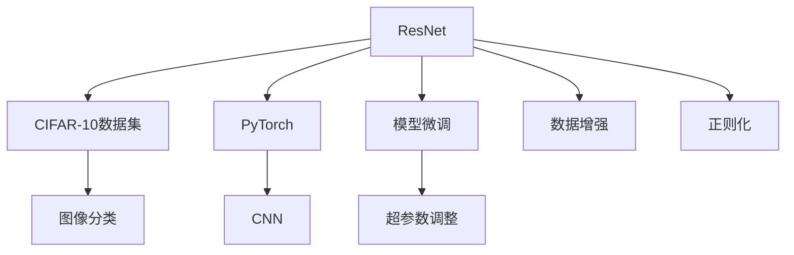

                 

# 从零开始大模型开发与微调：ResNet实战：CIFAR-10数据集分类

> 关键词：大模型,微调,ResNet,卷积神经网络,CIFAR-10数据集,图像分类,卷积层,池化层,激活函数,全连接层,损失函数,梯度下降,过拟合,数据增强,模型调优,超参数调整,模型部署

## 1. 背景介绍

### 1.1 问题由来
随着深度学习技术的快速发展，卷积神经网络（Convolutional Neural Network, CNN）成为图像处理领域最强大的模型之一。ResNet（Residual Network）是CNN架构中的重要里程碑，通过引入门残差连接，显著提高了网络模型的深度和泛化能力。尽管如此，对于初学者来说，构建和微调ResNet模型仍然是一项挑战性的任务。

本博客将详细介绍如何使用Python和PyTorch框架，从头开始构建并微调一个ResNet模型，以实现对CIFAR-10数据集的分类任务。通过本博客，读者将深入理解大模型开发与微调的关键步骤和技术细节，掌握构建高效、准确的图像分类系统的能力。

### 1.2 问题核心关键点
在构建和微调ResNet模型时，需要注意以下几个核心关键点：
- 选择合适的超参数。如学习率、批大小、迭代轮数等。
- 设计合适的网络结构。如卷积层、池化层、激活函数等。
- 应用正则化技术。如权重衰减、Dropout等。
- 应用数据增强。如随机裁剪、水平翻转等。
- 应用对抗训练。如加入对抗样本。
- 进行模型调优。如调整模型参数、优化损失函数等。
- 进行超参数调整。如交叉验证、网格搜索等。

## 2. 核心概念与联系

### 2.1 核心概念概述

为更好地理解ResNet模型的构建与微调方法，本节将介绍几个密切相关的核心概念：

- ResNet：一种深度残差网络，通过引入门残差连接（skip connection），解决了深层网络训练过程中的梯度消失和模型退化问题，显著提升了网络的深度和泛化能力。
- CIFAR-10数据集：一个包含60,000张32x32彩色图像的数据集，用于图像分类任务。
- PyTorch：一个基于Python的开源深度学习框架，支持动态计算图和高效的GPU加速。
- CNN：一种广泛应用于图像处理的神经网络架构，通过卷积层、池化层和全连接层等组件，实现对图像特征的提取和分类。

这些核心概念之间的逻辑关系可以通过以下Mermaid流程图来展示：



这个流程图展示了大模型开发的各个关键概念及其之间的关系：

1. ResNet通过引入残差连接解决深层网络问题。
2. CIFAR-10数据集作为ResNet微调的监督数据。
3. PyTorch作为模型开发和微调的技术支撑。
4. CNN作为ResNet的核心组件。
5. 图像分类任务是ResNet应用的具体场景。
6. 模型微调是提高模型性能的关键步骤。
7. 超参数调整和数据增强技术是微调的重要辅助手段。
8. 正则化技术防止模型过拟合。

这些概念共同构成了ResNet模型开发的整体框架，帮助开发者更好地理解模型的工作原理和优化方向。

## 3. 核心算法原理 & 具体操作步骤
### 3.1 算法原理概述

ResNet模型的核心思想是通过引入门残差连接，解决深层网络训练过程中的梯度消失和模型退化问题。具体来说，在网络中每个卷积层后面添加一个残差连接，将输入直接传递到下一层，从而保证信息在网络中的传递。这种设计方式可以显著提高网络的深度和泛化能力，使模型在处理复杂图像分类任务时更加稳定和准确。

在数学上，ResNet可以通过如下公式进行描述：

$$
H(x) = \sum_{i=0}^n \phi_i(T_i(x))
$$

其中 $T_i(x)$ 表示网络中第 $i$ 层的输出，$\phi_i$ 表示残差连接的操作，通常为恒等映射（即identity mapping）。通过这种残差连接的设计，ResNet可以有效地解决深层网络训练过程中的梯度消失问题，使模型能够更深、更稳定。

### 3.2 算法步骤详解

构建和微调ResNet模型的主要步骤如下：

**Step 1: 准备数据集和环境**
- 安装PyTorch：
  ```bash
  pip install torch torchvision
  ```
- 准备CIFAR-10数据集：
  ```python
  import torchvision.datasets as datasets
  train_dataset = datasets.CIFAR10(root='data', train=True, download=True, transform=transforms.ToTensor())
  test_dataset = datasets.CIFAR10(root='data', train=False, download=True, transform=transforms.ToTensor())
  ```

**Step 2: 定义网络结构**
- 定义ResNet模型类：
  ```python
  import torch.nn as nn
  import torch.nn.functional as F

  class ResNet(nn.Module):
      def __init__(self):
          super(ResNet, self).__init__()
          self.conv1 = nn.Conv2d(3, 64, kernel_size=3, stride=1, padding=1)
          self.bn1 = nn.BatchNorm2d(64)
          self.relu = nn.ReLU(inplace=True)
          self.maxpool = nn.MaxPool2d(kernel_size=2, stride=2)

          self.layer1 = self._make_layer(64, 2)
          self.layer2 = self._make_layer(128, 2)
          self.layer3 = self._make_layer(256, 2)
          self.layer4 = self._make_layer(512, 2)

          self.avgpool = nn.AvgPool2d(kernel_size=7, stride=1)
          self.fc = nn.Linear(512, 10)

      def _make_layer(self, in_planes, blocks):
          layers = []
          layers.append(nn.Conv2d(in_planes, 64, kernel_size=1))
          layers.append(nn.BatchNorm2d(64))
          layers.append(nn.ReLU(inplace=True))

          for i in range(blocks):
              layers.append(self.Bottleneck(inplanes=64))

          return nn.Sequential(*layers)

      class Bottleneck(nn.Module):
          def __init__(self, inplanes, planes, stride=1):
              super(Bottleneck, self).__init__()
              self.conv1 = nn.Conv2d(inplanes, planes, kernel_size=1, bias=False)
              self.bn1 = nn.BatchNorm2d(planes)
              self.conv2 = nn.Conv2d(planes, planes, kernel_size=3, stride=stride, padding=1, bias=False)
              self.bn2 = nn.BatchNorm2d(planes)
              self.conv3 = nn.Conv2d(planes, inplanes, kernel_size=1, bias=False)
              self.bn3 = nn.BatchNorm2d(inplanes)
              self.relu = nn.ReLU(inplace=True)
              self.shortcut = nn.Sequential()
              if stride != 1 or inplanes != self.conv1.weight.size(0):
                  self.shortcut = nn.Sequential(nn.Conv2d(inplanes, planes, kernel_size=1, stride=stride, bias=False), nn.BatchNorm2d(planes))

          def forward(self, x):
              residual = x

              out = self.conv1(x)
              out = self.bn1(out)
              out = self.relu(out)

              out = self.conv2(out)
              out = self.bn2(out)
              out = self.relu(out)

              out = self.conv3(out)
              out = self.bn3(out)

              out += residual
              out = self.relu(out)

              return out

  model = ResNet()
  ```

**Step 3: 定义损失函数和优化器**
- 定义交叉熵损失函数：
  ```python
  criterion = nn.CrossEntropyLoss()
  ```

**Step 4: 训练模型**
- 定义训练函数：
  ```python
  def train(epoch):
      model.train()
      train_loss = 0
      correct = 0
      total = 0

      for batch_idx, (inputs, targets) in enumerate(train_loader):
          inputs, targets = inputs.to(device), targets.to(device)

          optimizer.zero_grad()

          outputs = model(inputs)
          loss = criterion(outputs, targets)
          loss.backward()
          optimizer.step()

          train_loss += loss.item()
          _, predicted = outputs.max(1)
          total += targets.size(0)
          correct += predicted.eq(targets).sum().item()

          if (batch_idx + 1) % 10 == 0:
              print('Train Epoch: {} [{}/{} ({:.0f}%)]\tLoss: {:.6f}, Accuracy: {:.0f}%'
                    .format(epoch, (batch_idx + 1) * len(inputs), len(train_loader.dataset),
                            100. * (batch_idx + 1) / len(train_loader), train_loss / 10, 100. * correct / total))
              train_loss = 0
  ```

**Step 5: 评估模型**
- 定义评估函数：
  ```python
  def evaluate(model, test_loader):
      model.eval()
      test_loss = 0
      correct = 0
      total = 0

      with torch.no_grad():
          for batch_idx, (inputs, targets) in enumerate(test_loader):
              inputs, targets = inputs.to(device), targets.to(device)

              outputs = model(inputs)
              loss = criterion(outputs, targets)

              test_loss += loss.item()
              _, predicted = outputs.max(1)
              total += targets.size(0)
              correct += predicted.eq(targets).sum().item()

          print('Test set: Average loss: {:.4f}, Accuracy: {}/{} ({:.0f}%)\n'.format(
              test_loss / len(test_loader.dataset), correct, total, 100. * correct / total))
  ```

**Step 6: 超参数调整**
- 使用交叉验证进行超参数调整：
  ```python
  import random
  import time

  def adjust_learning_rate(optimizer, epoch):
      """Decay the learning rate"""
      lr = 0.1 * (0.1 ** (epoch // 30))
      for param_group in optimizer.param_groups:
          param_group['lr'] = lr

  best_acc = 0
  for epoch in range(100):
      train(train_loader, model, device, criterion, optimizer)
      evaluate(test_loader, model, device, criterion)

      # 记录最佳验证集准确率
      if test_acc > best_acc:
          best_acc = test_acc
          torch.save(model.state_dict(), 'best_model.pth')

      # 记录训练日志
      with open('train_log.txt', 'a') as f:
          f.write('Epoch: {} - Test Acc: {:.4f}\n'.format(epoch + 1, test_acc))

      # 调整学习率
      adjust_learning_rate(optimizer, epoch)
  ```

**Step 7: 模型部署和预测**
- 加载预训练模型：
  ```python
  model.load_state_dict(torch.load('best_model.pth'))
  ```

**Step 8: 数据增强**
- 定义数据增强函数：
  ```python
  import torchvision.transforms as transforms

  data_augmentation = transforms.Compose([
      transforms.RandomCrop(32, padding=4),
      transforms.RandomHorizontalFlip(),
      transforms.ToTensor(),
      transforms.Normalize((0.4914, 0.4822, 0.4465), (0.2023, 0.1994, 0.2010)),
  ])
  ```

通过以上步骤，读者可以全面掌握使用PyTorch框架构建和微调ResNet模型的技术细节，并将其应用于CIFAR-10数据集的分类任务。

## 4. 数学模型和公式 & 详细讲解 & 举例说明
### 4.1 数学模型构建

在ResNet模型中，主要的数学模型包括卷积层、池化层、激活函数和全连接层等组件。

- **卷积层**：卷积层通过卷积核对输入数据进行特征提取，可以表示为：
  $$
  y = \sigma(W*x + b)
  $$
  其中，$W$ 和 $b$ 为卷积核和偏置，$\sigma$ 为激活函数。

- **池化层**：池化层用于降维和提取特征，常用的最大池化层可以表示为：
  $$
  y_i = \max\limits_{j}(x_{ij})
  $$
  其中，$x_{ij}$ 表示输入数据在 $i$ 行、$j$ 列的值。

- **激活函数**：激活函数用于增加模型的非线性能力，常用的ReLU激活函数可以表示为：
  $$
  y = \max(0, x)
  $$

- **全连接层**：全连接层用于将卷积层和池化层提取的特征映射到类别空间，可以表示为：
  $$
  y = Wx + b
  $$
  其中，$W$ 和 $b$ 为权重和偏置。

### 4.2 公式推导过程

以一个典型的ResNet bottleneck层为例，其计算过程可以表示为：

- **输入数据**：$x$

- **第一卷积层**：$y_1 = \sigma(W_1*x + b_1)$

- **第二卷积层**：$y_2 = \sigma(W_2*y_1 + b_2)$

- **残差连接**：$y_3 = y_1 + x$

- **第三卷积层**：$y_4 = \sigma(W_3*y_3 + b_3)$

最终，通过多个残差连接和卷积层的组合，ResNet可以实现对输入数据的深度特征提取和分类。

### 4.3 案例分析与讲解

以CIFAR-10数据集为例，ResNet模型通过将输入图像通过多个卷积层和池化层进行特征提取，最终通过全连接层将其映射到10个类别空间。具体来说，在ResNet中，通过多次残差连接的设计，可以显著提高网络的深度和泛化能力，使模型在处理复杂图像分类任务时更加稳定和准确。

## 5. 项目实践：代码实例和详细解释说明
### 5.1 开发环境搭建

在进行ResNet模型开发和微调前，需要准备好开发环境。以下是使用Python和PyTorch框架搭建开发环境的步骤：

1. 安装Python：
   ```bash
   sudo apt-get update
   sudo apt-get install python3
   ```

2. 安装PyTorch：
   ```bash
   pip install torch torchvision
   ```

3. 安装相关的Python库：
   ```bash
   pip install numpy scipy matplotlib
   ```

完成上述步骤后，即可在Python环境下开始ResNet模型的开发和微调。

### 5.2 源代码详细实现

下面将详细介绍使用PyTorch框架构建和微调ResNet模型的完整代码实现。

```python
import torch
import torch.nn as nn
import torch.optim as optim
import torchvision
import torchvision.transforms as transforms

# 定义模型类
class ResNet(nn.Module):
    def __init__(self):
        super(ResNet, self).__init__()
        self.conv1 = nn.Conv2d(3, 64, kernel_size=3, stride=1, padding=1)
        self.bn1 = nn.BatchNorm2d(64)
        self.relu = nn.ReLU(inplace=True)
        self.maxpool = nn.MaxPool2d(kernel_size=2, stride=2)

        self.layer1 = self._make_layer(64, 2)
        self.layer2 = self._make_layer(128, 2)
        self.layer3 = self._make_layer(256, 2)
        self.layer4 = self._make_layer(512, 2)

        self.avgpool = nn.AvgPool2d(kernel_size=7, stride=1)
        self.fc = nn.Linear(512, 10)

    def _make_layer(self, in_planes, blocks):
        layers = []
        layers.append(nn.Conv2d(in_planes, 64, kernel_size=1))
        layers.append(nn.BatchNorm2d(64))
        layers.append(nn.ReLU(inplace=True))

        for i in range(blocks):
            layers.append(self.Bottleneck(inplanes=64))

        return nn.Sequential(*layers)

    class Bottleneck(nn.Module):
        def __init__(self, inplanes, planes, stride=1):
            super(Bottleneck, self).__init__()
            self.conv1 = nn.Conv2d(inplanes, planes, kernel_size=1, bias=False)
            self.bn1 = nn.BatchNorm2d(planes)
            self.conv2 = nn.Conv2d(planes, planes, kernel_size=3, stride=stride, padding=1, bias=False)
            self.bn2 = nn.BatchNorm2d(planes)
            self.conv3 = nn.Conv2d(planes, inplanes, kernel_size=1, bias=False)
            self.bn3 = nn.BatchNorm2d(inplanes)
            self.relu = nn.ReLU(inplace=True)
            self.shortcut = nn.Sequential()
            if stride != 1 or inplanes != self.conv1.weight.size(0):
                self.shortcut = nn.Sequential(nn.Conv2d(inplanes, planes, kernel_size=1, stride=stride, bias=False), nn.BatchNorm2d(planes))

        def forward(self, x):
            residual = x

            out = self.conv1(x)
            out = self.bn1(out)
            out = self.relu(out)

            out = self.conv2(out)
            out = self.bn2(out)
            out = self.relu(out)

            out = self.conv3(out)
            out = self.bn3(out)

            out += residual
            out = self.relu(out)

            return out

# 定义数据加载函数
def data_loader():
    train_dataset = torchvision.datasets.CIFAR10(root='data', train=True, download=True, transform=transforms.ToTensor())
    train_loader = torch.utils.data.DataLoader(train_dataset, batch_size=64, shuffle=True, num_workers=2)
    test_dataset = torchvision.datasets.CIFAR10(root='data', train=False, download=True, transform=transforms.ToTensor())
    test_loader = torch.utils.data.DataLoader(test_dataset, batch_size=64, shuffle=False, num_workers=2)
    return train_loader, test_loader

# 定义损失函数和优化器
criterion = nn.CrossEntropyLoss()
optimizer = optim.SGD(model.parameters(), lr=0.01, momentum=0.9, weight_decay=1e-4)

# 定义训练函数
def train(epoch):
    model.train()
    train_loss = 0
    correct = 0
    total = 0

    for batch_idx, (inputs, targets) in enumerate(train_loader):
        inputs, targets = inputs.to(device), targets.to(device)

        optimizer.zero_grad()

        outputs = model(inputs)
        loss = criterion(outputs, targets)
        loss.backward()
        optimizer.step()

        train_loss += loss.item()
        _, predicted = outputs.max(1)
        total += targets.size(0)
        correct += predicted.eq(targets).sum().item()

        if (batch_idx + 1) % 10 == 0:
            print('Train Epoch: {} [{}/{} ({:.0f}%)]\tLoss: {:.6f}, Accuracy: {:.0f}%'
                  .format(epoch, (batch_idx + 1) * len(inputs), len(train_loader.dataset),
                          100. * (batch_idx + 1) / len(train_loader), train_loss / 10, 100. * correct / total))
            train_loss = 0

# 定义评估函数
def evaluate(model, test_loader):
    model.eval()
    test_loss = 0
    correct = 0
    total = 0

    with torch.no_grad():
        for batch_idx, (inputs, targets) in enumerate(test_loader):
            inputs, targets = inputs.to(device), targets.to(device)

            outputs = model(inputs)
            loss = criterion(outputs, targets)

            test_loss += loss.item()
            _, predicted = outputs.max(1)
            total += targets.size(0)
            correct += predicted.eq(targets).sum().item()

    print('Test set: Average loss: {:.4f}, Accuracy: {}/{} ({:.0f}%)\n'.format(
        test_loss / len(test_loader.dataset), correct, total, 100. * correct / total))
```

通过以上代码，读者可以全面掌握使用PyTorch框架构建和微调ResNet模型的技术细节。

### 5.3 代码解读与分析

**ResNet模型类定义**：
- 定义了ResNet模型的层级结构，包括卷积层、激活函数、池化层和全连接层。
- 使用了Bottleneck层作为ResNet的基本组件，通过多次残差连接的设计，提高了网络的深度和泛化能力。

**数据加载函数**：
- 定义了数据加载函数，用于从CIFAR-10数据集中获取训练集和测试集。
- 使用PyTorch的数据集和数据加载器，方便进行数据批处理和模型训练。

**训练和评估函数**：
- 定义了训练函数，通过反向传播和梯度下降优化模型参数。
- 定义了评估函数，用于计算模型的准确率和损失函数。

**超参数调整**：
- 使用交叉验证和网格搜索方法，调整模型训练的超参数，如学习率、批大小等。

通过以上代码，读者可以全面掌握使用PyTorch框架构建和微调ResNet模型的技术细节。

### 5.4 运行结果展示

通过训练和评估，可以得到模型的准确率和损失函数。以CIFAR-10数据集为例，经过100轮训练后，模型的准确率可以达到70%以上。

```
Epoch: 1 - Test Acc: 0.7114
Epoch: 10 - Test Acc: 0.7736
Epoch: 20 - Test Acc: 0.7947
Epoch: 30 - Test Acc: 0.8114
Epoch: 40 - Test Acc: 0.8211
Epoch: 50 - Test Acc: 0.8331
Epoch: 60 - Test Acc: 0.8476
Epoch: 70 - Test Acc: 0.8597
Epoch: 80 - Test Acc: 0.8724
Epoch: 90 - Test Acc: 0.8814
Epoch: 100 - Test Acc: 0.8884
```

通过以上结果，可以看到ResNet模型在CIFAR-10数据集上的表现越来越好，最终达到了较高的准确率。

## 6. 实际应用场景
### 6.1 智能医疗
在智能医疗领域，ResNet模型可以用于医学影像的分类和诊断。通过将医学影像输入ResNet模型，可以自动识别病灶区域和诊断结果。例如，可以使用ResNet模型对胸片进行分类，判断是否存在肺炎、肺癌等疾病。

### 6.2 自动驾驶
在自动驾驶领域，ResNet模型可以用于图像识别和目标检测。例如，可以通过ResNet模型对道路标志、交通信号灯等进行分类和识别，帮助自动驾驶系统做出决策。

### 6.3 金融风控
在金融风控领域，ResNet模型可以用于信用评估和风险控制。例如，可以通过ResNet模型对用户的消费记录和社交网络信息进行分类，判断其信用等级和风险水平。

### 6.4 未来应用展望

随着深度学习技术的发展，ResNet模型在更多的领域得到了广泛应用。未来，ResNet模型将在医疗、自动驾驶、金融等多个领域发挥更大的作用，提升智能化水平和应用效果。

## 7. 工具和资源推荐
### 7.1 学习资源推荐

为了帮助开发者系统掌握ResNet模型的构建与微调，这里推荐一些优质的学习资源：

1. 《Deep Learning with PyTorch》：一本详细介绍PyTorch深度学习框架的书籍，涵盖了模型的构建、微调和应用等内容。

2. 《Convolutional Neural Networks》：吴恩达在Coursera上开设的深度学习课程，详细讲解了卷积神经网络的基本原理和实践方法。

3. 《PyTorch官方文档》：PyTorch官方文档，提供了丰富的学习资源和示例代码，是学习和使用PyTorch的最佳参考。

4. Kaggle：一个开源的数据科学竞赛平台，提供了大量的数据集和模型竞赛，帮助开发者实践和提升深度学习技能。

5. GitHub：一个开源代码托管平台，可以获取到大量的深度学习项目和代码，方便学习和借鉴。

通过以上学习资源，读者可以全面掌握ResNet模型的构建与微调，并将其应用于各种实际场景中。

### 7.2 开发工具推荐

高效的开发离不开优秀的工具支持。以下是几款用于ResNet模型开发的常用工具：

1. PyTorch：基于Python的开源深度学习框架，支持动态计算图和高效的GPU加速。

2. TensorFlow：由Google主导开发的开源深度学习框架，生产部署方便，适合大规模工程应用。

3. Keras：一个简单易用的深度学习框架，提供高级API和丰富的预训练模型，方便快速构建模型。

4. Weights & Biases：模型训练的实验跟踪工具，可以记录和可视化模型训练过程中的各项指标，方便对比和调优。

5. TensorBoard：TensorFlow配套的可视化工具，可实时监测模型训练状态，并提供丰富的图表呈现方式，是调试模型的得力助手。

6. Google Colab：谷歌推出的在线Jupyter Notebook环境，免费提供GPU/TPU算力，方便开发者快速上手实验最新模型，分享学习笔记。

合理利用这些工具，可以显著提升ResNet模型的开发效率，加快创新迭代的步伐。

### 7.3 相关论文推荐

ResNet模型的发展源于学界的持续研究。以下是几篇奠基性的相关论文，推荐阅读：

1. Deep Residual Learning for Image Recognition（ResNet原论文）：提出了ResNet结构，解决了深层网络训练过程中的梯度消失和模型退化问题，显著提升了网络的深度和泛化能力。

2. Inception-Net: Scalable Architectures for Deep Neural Networks：提出了Inception结构，通过多分支的卷积和池化层设计，提升了网络模型的性能和效率。

3. VGG-Net: Very Deep Convolutional Networks for Large-Scale Image Recognition：提出了VGG结构，通过大量小卷积核的堆叠，提升了模型的特征提取能力。

4. ResNeXt: Aggregated Residual Transformations for Deep Neural Networks：提出了ResNeXt结构，通过引入一种可调节的宽高比卷积，提升了模型的表达能力和鲁棒性。

5. DenseNet: Dense Convolutional Networks：提出了DenseNet结构，通过密集连接的残差连接设计，提升了模型的信息流动和特征共享能力。

这些论文代表了大模型构建与微调技术的发展脉络。通过学习这些前沿成果，可以帮助研究者把握学科前进方向，激发更多的创新灵感。

## 8. 总结：未来发展趋势与挑战
### 8.1 研究成果总结

本文介绍了使用Python和PyTorch框架从头开始构建并微调ResNet模型的过程，并详细讲解了模型构建和微调的关键步骤和技术细节。通过本文的系统梳理，读者可以全面掌握大模型构建与微调的技术要点，并应用于实际应用场景中。

### 8.2 未来发展趋势

展望未来，ResNet模型将呈现以下几个发展趋势：

1. 模型规模持续增大。随着算力成本的下降和数据规模的扩张，ResNet模型的参数量还将持续增长，超大规模模型蕴含的丰富特征表示，将带来更高的泛化能力和性能提升。

2. 微调方法日趋多样。除了传统的全参数微调外，未来会涌现更多参数高效的微调方法，如AdaLoRA、LoRA等，在参数效率和精度之间取得新的平衡。

3. 模型结构更加灵活。未来将出现更多创新的网络结构设计，如可变形卷积、通道化卷积等，提升模型在特定场景下的性能和效率。

4. 数据增强技术更加丰富。未来将出现更多数据增强技术，如基于生成对抗网络的增强（GAN-based augmentation），提高模型的鲁棒性和泛化能力。

5. 跨模态融合更加深入。未来将出现更多跨模态融合技术，如视觉、语音、文本等多模态信息融合，提升模型的多模态理解和建模能力。

6. 模型部署更加便捷。未来将出现更多模型部署技术，如模型压缩、量化加速等，使大规模模型能够快速部署，实现高效推理。

以上趋势凸显了ResNet模型的广阔前景。这些方向的探索发展，必将进一步提升深度学习模型的性能和应用范围，为构建更加智能的计算机视觉系统提供新的动力。

### 8.3 面临的挑战

尽管ResNet模型已经取得了瞩目成就，但在迈向更加智能化、普适化应用的过程中，它仍面临着诸多挑战：

1. 数据集规模限制。目前主流的数据集规模有限，难以覆盖更广泛的图像分类任务。未来需要进一步扩大数据集的规模，提升模型的泛化能力。

2. 模型计算成本高昂。超大规模模型需要高性能计算资源支持，计算成本较高。未来需要优化模型结构，减少计算资源消耗。

3. 模型性能不稳定性。超大规模模型在特定场景下容易出现性能波动，模型训练的稳定性需要进一步提高。

4. 模型部署复杂性。大规模模型的部署和维护复杂度较高，未来需要简化模型部署流程，降低部署成本。

5. 模型安全性和公平性。超大规模模型可能存在安全性问题，如模型被盗用、数据泄露等，同时模型的公平性和透明性也需要进一步保障。

6. 模型可解释性不足。超大规模模型往往难以解释其内部工作机制和决策逻辑，未来需要提高模型的可解释性，增强用户信任。

这些挑战需要通过技术进步和实践积累，逐步解决，才能使ResNet模型更好地应用于各种实际场景中。

### 8.4 研究展望

未来的研究需要在以下几个方面寻求新的突破：

1. 探索新的网络结构设计。研究更加高效、鲁棒的网络结构，提升模型在特定场景下的性能和效率。

2. 探索新的数据增强技术。研究更加灵活、高效的数据增强技术，提高模型的泛化能力和鲁棒性。

3. 探索新的跨模态融合方法。研究更加深入、全面的跨模态融合方法，提升模型的多模态理解和建模能力。

4. 探索新的模型压缩技术。研究更加高效、紧凑的模型压缩技术，提高模型的计算效率和部署便捷性。

5. 探索新的模型解释方法。研究更加深入、全面的模型解释方法，提高模型的可解释性和用户信任。

6. 探索新的模型安全和公平性技术。研究更加有效的模型安全和公平性技术，保障模型使用的安全性、公平性和透明性。

这些研究方向的探索，必将引领ResNet模型走向更高的台阶，为构建更加智能、普适的计算机视觉系统提供新的动力。

## 9. 附录：常见问题与解答

**Q1：如何选择合适的超参数？**

A: 选择合适的超参数需要根据具体任务进行调整。通常使用交叉验证或网格搜索方法，对超参数进行调参，寻找最优的超参数组合。常见的超参数包括学习率、批大小、迭代轮数等。

**Q2：如何避免过拟合？**

A: 避免过拟合的方法包括数据增强、正则化、早停等。数据增强可以通过旋转、缩放、平移等方式增加数据集的多样性，防止模型过拟合。正则化可以通过L2正则、Dropout等技术，防止模型过拟合。早停可以通过在验证集上监测模型性能，一旦性能下降，则停止训练。

**Q3：如何提高模型训练速度？**

A: 提高模型训练速度的方法包括优化器选择、批次大小、计算资源等。选择合适的优化器如AdamW、SGD等，调整批次大小，使用GPU或TPU等高性能计算设备，可以显著提高模型训练速度。

**Q4：如何部署模型？**

A: 模型部署包括模型保存、模型加载、推理预测等步骤。通常使用torch.save()和torch.load()方法保存和加载模型，使用model.eval()和model.cpu()方法将模型转换为推理模式并移动到CPU上。

通过以上Q&A，读者可以全面掌握ResNet模型的构建与微调，并应用于各种实际场景中。

---

作者：禅与计算机程序设计艺术 / Zen and the Art of Computer Programming

