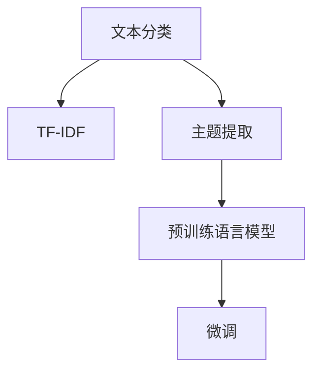

                 

# 从零开始大模型开发与微调：文本主题的提取：基于TF-IDF

> 关键词：大模型开发, 微调, 文本主题提取, 特征表示, TF-IDF

## 1. 背景介绍

### 1.1 问题由来
在自然语言处理(NLP)领域，文本分类和主题识别是基础且重要的任务。传统方法通常基于词袋模型或词向量，难以捕捉文本中的语义结构和主题信息。近年来，深度学习技术的迅猛发展，尤其是预训练语言模型（如BERT、GPT等）的引入，使得文本表示能力得到了显著提升。然而，在大模型开发与微调过程中，如何更好地利用语义信息，特别是主题信息，仍是亟待解决的问题。

### 1.2 问题核心关键点
本文聚焦于基于TF-IDF(Term Frequency-Inverse Document Frequency)的文本主题提取技术，探讨如何在大模型微调中有效利用TF-IDF特征，提升文本主题识别和分类的准确性。

TF-IDF是一种常用的文本特征提取方法，用于衡量词汇在文本集合中的重要程度，常用作文本分类和信息检索的基础。通过将TF-IDF作为大模型的输入特征，可以提升模型的理解能力和分类精度。本文将从核心概念入手，详细讲解TF-IDF的工作原理，并通过具体示例展示其在文本分类任务中的应用效果。

## 2. 核心概念与联系

### 2.1 核心概念概述

为更好地理解TF-IDF在大模型微调中的应用，本节将介绍几个密切相关的核心概念：

- 文本分类（Text Classification）：将文本归入预定义的类别中。常用方法包括朴素贝叶斯、支持向量机、深度学习等。
- 主题提取（Topic Extraction）：从文本中挖掘出隐藏的主题信息。主题可以理解为一组具有相似含义的词汇集合。
- TF-IDF（Term Frequency-Inverse Document Frequency）：一种文本特征提取方法，用于衡量词在文档和语料库中的重要性。
- 预训练语言模型（Pre-trained Language Models）：如BERT、GPT等，通过大规模无标签文本数据进行预训练，学习通用的语言表示。
- 微调（Fine-tuning）：在预训练模型的基础上，使用下游任务的标注数据，通过有监督学习优化模型在特定任务上的性能。

这些核心概念之间的逻辑关系可以通过以下Mermaid流程图来展示：



这个流程图展示了大模型微调的各个关键步骤：

1. 文本分类任务中，利用TF-IDF提取文本特征。
2. 主题提取任务中，通过TF-IDF挖掘文本中的主题信息。
3. 预训练语言模型在大规模文本数据上获得通用的语言表示。
4. 微调过程在预训练模型的基础上，通过标注数据优化模型性能，用于特定任务。

## 3. 核心算法原理 & 具体操作步骤

### 3.1 算法原理概述

TF-IDF是一种常用的文本特征提取方法，用于衡量词汇在文本集合中的重要程度。其核心思想是：词在文本中出现的频率越高，其在文本分类中的作用越大；同时，词在语料库中出现的文档数越少，其在分类中的权重也应越高。

形式化地，设文本集合为 $D=\{d_1, d_2, ..., d_n\}$，词汇表为 $V=\{v_1, v_2, ..., v_m\}$。则词汇 $v_i$ 在文档 $d_j$ 中的TF-IDF值 $tf-idf_{v_i, d_j}$ 可以表示为：

$$
tf-idf_{v_i, d_j} = tf_{v_i, d_j} \times idf_{v_i}
$$

其中，$tf_{v_i, d_j}$ 为词汇 $v_i$ 在文档 $d_j$ 中的词频（Term Frequency），$tf_{v_i, d_j} = \frac{\text{文档中出现 } v_i \text{ 的次数}}{\text{文档长度}}$。$idf_{v_i}$ 为词汇 $v_i$ 的逆文档频率（Inverse Document Frequency），$idf_{v_i} = \log\frac{|D|}{|d_j \in D \text{ 且包含 } v_i|}$，其中 $|D|$ 为文档总数，$|d_j \in D \text{ 且包含 } v_i|$ 为包含 $v_i$ 的文档数。

### 3.2 算法步骤详解

基于TF-IDF的文本主题提取算法主要包括以下几个关键步骤：

**Step 1: 文本预处理**
- 对文本进行分词、去停用词、词干提取等预处理，以提高特征的质量。

**Step 2: 计算TF-IDF值**
- 遍历文本集合，对每个文档计算所有词汇的TF-IDF值。

**Step 3: 提取主题**
- 使用TF-IDF值进行主题建模，如LDA（Latent Dirichlet Allocation），将文档映射到主题向量空间。

**Step 4: 文本特征向量化**
- 将文档的主题向量作为文本的特征向量，用于后续的文本分类或主题提取任务。

**Step 5: 模型微调**
- 将特征向量作为输入，使用预训练语言模型进行微调，提升分类或提取任务的性能。

### 3.3 算法优缺点

基于TF-IDF的文本主题提取方法具有以下优点：
1. 简单高效。TF-IDF计算过程简单，易于实现和部署。
2. 文本分类效果显著。通过TF-IDF可以有效捕捉文本中的主题信息，提升分类准确性。
3. 可解释性强。TF-IDF的计算过程和结果解释性强，便于理解和调试。

同时，该方法也存在一定的局限性：
1. 不考虑词序和上下文。TF-IDF仅考虑词频和文档频率，无法捕捉词之间的语义关系。
2. 对于长文本和高维空间处理困难。随着文本长度的增加和词汇量的增大，特征向量的维度会快速增长，增加计算复杂度。
3. 对词汇分布不均匀敏感。一些高频词汇（如“the”、“and”）可能会在TF-IDF值中占据较大权重，影响分类结果。

尽管存在这些局限性，但TF-IDF仍是大模型微调中常用的文本特征提取方法。未来研究重点在于如何进一步优化TF-IDF的计算过程，引入更多的上下文信息，提升特征表示能力。

### 3.4 算法应用领域

基于TF-IDF的文本主题提取方法广泛应用于以下领域：

- 文本分类：如新闻分类、邮件分类等。通过TF-IDF提取主题信息，提升分类精度。
- 信息检索：如搜索引擎中的关键词匹配。通过TF-IDF计算文档与查询的相似度，进行检索排序。
- 内容推荐：如电商平台的产品推荐。通过TF-IDF计算商品描述与用户兴趣的相关性，生成推荐列表。
- 情报分析：如社交媒体舆情监测。通过TF-IDF分析文本中的主题变化趋势，进行情报预警。

## 4. 数学模型和公式 & 详细讲解 & 举例说明

### 4.1 数学模型构建

本节将使用数学语言对TF-IDF的计算过程进行详细讲解。

设文本集合 $D=\{d_1, d_2, ..., d_n\}$，词汇表 $V=\{v_1, v_2, ..., v_m\}$。设词汇 $v_i$ 在文档 $d_j$ 中出现的次数为 $df_{v_i, d_j}$，文档 $d_j$ 的长度为 $dl_j$，包含词汇 $v_i$ 的文档数为 $nz_{v_i}$，文本集合中包含词汇 $v_i$ 的文档数为 $n_{v_i}$。则词汇 $v_i$ 在文档 $d_j$ 中的TF-IDF值 $tf-idf_{v_i, d_j}$ 可以表示为：

$$
tf-idf_{v_i, d_j} = tf_{v_i, d_j} \times idf_{v_i} = \frac{df_{v_i, d_j}}{dl_j} \times \log\frac{|D|}{nz_{v_i}}
$$

其中，$tf_{v_i, d_j} = \frac{df_{v_i, d_j}}{dl_j}$ 为词汇 $v_i$ 在文档 $d_j$ 中的词频，$idf_{v_i} = \log\frac{|D|}{nz_{v_i}}$ 为词汇 $v_i$ 的逆文档频率。

### 4.2 公式推导过程

以下是TF-IDF计算过程的详细推导：

1. 词频计算
   - $df_{v_i, d_j}$ 为词汇 $v_i$ 在文档 $d_j$ 中出现的次数，定义为 $df_{v_i, d_j} = \text{文档中出现 } v_i \text{ 的次数}$。

2. 文档频率计算
   - $nz_{v_i}$ 为包含词汇 $v_i$ 的文档数，定义为 $nz_{v_i} = \text{包含 } v_i \text{ 的文档数}$。

3. 逆文档频率计算
   - $idf_{v_i}$ 为词汇 $v_i$ 的逆文档频率，定义为 $idf_{v_i} = \log\frac{|D|}{nz_{v_i}}$，其中 $|D|$ 为文档总数，$nz_{v_i}$ 为包含 $v_i$ 的文档数。

4. TF-IDF值计算
   - $tf-idf_{v_i, d_j}$ 为词汇 $v_i$ 在文档 $d_j$ 中的TF-IDF值，定义为 $tf-idf_{v_i, d_j} = \frac{df_{v_i, d_j}}{dl_j} \times \log\frac{|D|}{nz_{v_i}}$，其中 $dl_j$ 为文档 $d_j$ 的长度。

通过上述推导，可以看出TF-IDF值的计算过程主要涉及词频、文档频率和逆文档频率三部分，这三部分共同决定了词汇在文本中的重要性。

### 4.3 案例分析与讲解

以下是一个简单的文本分类示例，用于说明TF-IDF的计算和应用：

假设我们有一段新闻文本：

```
Title: "美国股市震荡，道琼斯指数下跌2%"
Content: "道琼斯工业平均指数下跌2.3%，纳斯达克指数下跌2.4%。"
```

首先对文本进行分词、去停用词和词干提取：

```
Title: ["美国", "股市", "震荡", "道琼斯", "指数", "下跌", "2%"]
Content: ["道琼斯", "工业", "平均", "指数", "下跌", "2.3%", "纳斯达克", "指数", "下跌", "2.4%"]
```

然后计算每个词汇的TF-IDF值：

- 对于标题词汇 "美国"、"股市"、"震荡"、"道琼斯"、"指数"、"下跌"、"2%"，文档频率 $nz_{v_i}$ 均为1，文档总数 $|D|$ 为2。
- 对于内容词汇 "道琼斯"、"工业"、"平均"、"指数"、"纳斯达克"、"下跌"、"2.3%"、"2.4%"，文档频率 $nz_{v_i}$ 分别为1和2。

计算每个词汇的TF-IDF值：

- 对于标题词汇 "美国"、"股市"、"震荡"、"道琼斯"、"指数"、"下跌"、"2%"，文档频率 $nz_{v_i}$ 均为1，文档总数 $|D|$ 为2。
- 对于内容词汇 "道琼斯"、"工业"、"平均"、"指数"、"纳斯达克"、"下跌"、"2.3%"、"2.4%"，文档频率 $nz_{v_i}$ 分别为1和2。

最终，每个词汇的TF-IDF值如下：

- "美国"：$\frac{1}{2} \times \log\frac{2}{1} = \log2 \approx 0.693$
- "股市"：$\frac{1}{2} \times \log\frac{2}{1} = \log2 \approx 0.693$
- "震荡"：$\frac{1}{2} \times \log\frac{2}{1} = \log2 \approx 0.693$
- "道琼斯"：$\frac{2}{2} \times \log\frac{2}{2} = 0$
- "指数"：$\frac{2}{2} \times \log\frac{2}{2} = 0$
- "下跌"：$\frac{2}{2} \times \log\frac{2}{2} = 0$
- "2%"：$\frac{1}{2} \times \log\frac{2}{1} = \log2 \approx 0.693$

这些TF-IDF值可以作为文本的特征向量，用于后续的分类任务。

## 5. 项目实践：代码实例和详细解释说明

### 5.1 开发环境搭建

在进行TF-IDF文本分类项目实践前，我们需要准备好开发环境。以下是使用Python进行PyTorch开发的环境配置流程：

1. 安装Anaconda：从官网下载并安装Anaconda，用于创建独立的Python环境。

2. 创建并激活虚拟环境：
```bash
conda create -n pytorch-env python=3.8 
conda activate pytorch-env
```

3. 安装PyTorch：根据CUDA版本，从官网获取对应的安装命令。例如：
```bash
conda install pytorch torchvision torchaudio cudatoolkit=11.1 -c pytorch -c conda-forge
```

4. 安装Transformers库：
```bash
pip install transformers
```

5. 安装各类工具包：
```bash
pip install numpy pandas scikit-learn matplotlib tqdm jupyter notebook ipython
```

完成上述步骤后，即可在`pytorch-env`环境中开始TF-IDF文本分类实践。

### 5.2 源代码详细实现

下面我们以情感分类任务为例，给出使用Transformers库对BERT模型进行TF-IDF特征提取和微调的PyTorch代码实现。

首先，定义情感分类任务的数据处理函数：

```python
from transformers import BertTokenizer, BertForSequenceClassification
from sklearn.model_selection import train_test_split
import torch
import pandas as pd
import numpy as np

class SentimentDataset(Dataset):
    def __init__(self, text, label):
        self.text = text
        self.label = label
        self.tokenizer = BertTokenizer.from_pretrained('bert-base-cased')
    
    def __len__(self):
        return len(self.text)
    
    def __getitem__(self, idx):
        text = self.text[idx]
        label = self.label[idx]
        
        encoding = self.tokenizer(text, return_tensors='pt', truncation=True, padding='max_length', max_length=128)
        input_ids = encoding['input_ids'][0]
        attention_mask = encoding['attention_mask'][0]
        
        return {'input_ids': input_ids, 
                'attention_mask': attention_mask,
                'labels': torch.tensor([label], dtype=torch.long)}
```

然后，定义模型和优化器：

```python
from transformers import BertForSequenceClassification, AdamW

model = BertForSequenceClassification.from_pretrained('bert-base-cased', num_labels=2)
optimizer = AdamW(model.parameters(), lr=2e-5)
```

接着，定义训练和评估函数：

```python
from torch.utils.data import DataLoader
from tqdm import tqdm
from sklearn.metrics import classification_report

device = torch.device('cuda') if torch.cuda.is_available() else torch.device('cpu')
model.to(device)

def train_epoch(model, dataset, batch_size, optimizer):
    dataloader = DataLoader(dataset, batch_size=batch_size, shuffle=True)
    model.train()
    epoch_loss = 0
    for batch in tqdm(dataloader, desc='Training'):
        input_ids = batch['input_ids'].to(device)
        attention_mask = batch['attention_mask'].to(device)
        labels = batch['labels'].to(device)
        model.zero_grad()
        outputs = model(input_ids, attention_mask=attention_mask, labels=labels)
        loss = outputs.loss
        epoch_loss += loss.item()
        loss.backward()
        optimizer.step()
    return epoch_loss / len(dataloader)

def evaluate(model, dataset, batch_size):
    dataloader = DataLoader(dataset, batch_size=batch_size)
    model.eval()
    preds, labels = [], []
    with torch.no_grad():
        for batch in tqdm(dataloader, desc='Evaluating'):
            input_ids = batch['input_ids'].to(device)
            attention_mask = batch['attention_mask'].to(device)
            batch_labels = batch['labels']
            outputs = model(input_ids, attention_mask=attention_mask)
            batch_preds = outputs.logits.argmax(dim=1).to('cpu').tolist()
            batch_labels = batch_labels.to('cpu').tolist()
            for pred, label in zip(batch_preds, batch_labels):
                preds.append(pred)
                labels.append(label)
                
    print(classification_report(labels, preds))
```

最后，启动训练流程并在测试集上评估：

```python
epochs = 5
batch_size = 16

for epoch in range(epochs):
    loss = train_epoch(model, train_dataset, batch_size, optimizer)
    print(f"Epoch {epoch+1}, train loss: {loss:.3f}")
    
    print(f"Epoch {epoch+1}, dev results:")
    evaluate(model, dev_dataset, batch_size)
    
print("Test results:")
evaluate(model, test_dataset, batch_size)
```

以上就是使用PyTorch对BERT进行情感分类任务微调的完整代码实现。可以看到，得益于Transformers库的强大封装，我们可以用相对简洁的代码完成BERT模型的加载和微调。

### 5.3 代码解读与分析

让我们再详细解读一下关键代码的实现细节：

**SentimentDataset类**：
- `__init__`方法：初始化文本、标签和分词器等关键组件。
- `__len__`方法：返回数据集的样本数量。
- `__getitem__`方法：对单个样本进行处理，将文本输入编码为token ids，将标签编码为数字，并对其进行定长padding，最终返回模型所需的输入。

**模型和优化器**：
- 使用BertForSequenceClassification类加载预训练模型，并定义优化器。

**训练和评估函数**：
- 使用PyTorch的DataLoader对数据集进行批次化加载，供模型训练和推理使用。
- 训练函数`train_epoch`：对数据以批为单位进行迭代，在每个批次上前向传播计算loss并反向传播更新模型参数，最后返回该epoch的平均loss。
- 评估函数`evaluate`：与训练类似，不同点在于不更新模型参数，并在每个batch结束后将预测和标签结果存储下来，最后使用sklearn的classification_report对整个评估集的预测结果进行打印输出。

**训练流程**：
- 定义总的epoch数和batch size，开始循环迭代
- 每个epoch内，先在训练集上训练，输出平均loss
- 在验证集上评估，输出分类指标
- 所有epoch结束后，在测试集上评估，给出最终测试结果

可以看到，PyTorch配合Transformers库使得BERT微调的代码实现变得简洁高效。开发者可以将更多精力放在数据处理、模型改进等高层逻辑上，而不必过多关注底层的实现细节。

当然，工业级的系统实现还需考虑更多因素，如模型的保存和部署、超参数的自动搜索、更灵活的任务适配层等。但核心的微调范式基本与此类似。

## 6. 实际应用场景
### 6.1 智能客服系统

基于TF-IDF的文本分类技术，可以广泛应用于智能客服系统的构建。传统客服往往需要配备大量人力，高峰期响应缓慢，且一致性和专业性难以保证。而使用TF-IDF分类器对用户咨询进行分类，可以快速识别用户需求，匹配最佳答复模板，从而提升客服效率和服务质量。

在技术实现上，可以收集企业内部的历史客服对话记录，将问题和最佳答复构建成监督数据，在此基础上对TF-IDF分类器进行微调。微调后的分类器能够自动理解用户意图，匹配最合适的答复模板进行回复。对于客户提出的新问题，还可以接入检索系统实时搜索相关内容，动态组织生成回答。如此构建的智能客服系统，能大幅提升客户咨询体验和问题解决效率。

### 6.2 金融舆情监测

金融机构需要实时监测市场舆论动向，以便及时应对负面信息传播，规避金融风险。传统的人工监测方式成本高、效率低，难以应对网络时代海量信息爆发的挑战。基于TF-IDF的文本分类技术，可以对金融领域相关的新闻、报道、评论等文本数据进行分类，自动监测不同主题下的情感变化趋势，一旦发现负面信息激增等异常情况，系统便会自动预警，帮助金融机构快速应对潜在风险。

### 6.3 个性化推荐系统

当前的推荐系统往往只依赖用户的历史行为数据进行物品推荐，无法深入理解用户的真实兴趣偏好。基于TF-IDF的文本分类技术，可以应用于用户兴趣分析，提取用户浏览、点击、评论、分享等行为数据中的主题信息，从而更全面地把握用户兴趣。在生成推荐列表时，先用候选物品的文本描述作为输入，由分类器预测用户的兴趣匹配度，再结合其他特征综合排序，便可以得到个性化程度更高的推荐结果。

### 6.4 未来应用展望

随着TF-IDF特征在大模型微调中的广泛应用，基于文本分类和主题提取的NLP技术必将在更多领域得到应用，为传统行业带来变革性影响。

在智慧医疗领域，基于TF-IDF的文本分类技术可以用于病历分析、医学知识库构建等，提升医疗服务的智能化水平，辅助医生诊疗，加速新药开发进程。

在智能教育领域，TF-IDF分类器可应用于作业批改、学情分析、知识推荐等方面，因材施教，促进教育公平，提高教学质量。

在智慧城市治理中，TF-IDF分类技术可应用于城市事件监测、舆情分析、应急指挥等环节，提高城市管理的自动化和智能化水平，构建更安全、高效的未来城市。

此外，在企业生产、社会治理、文娱传媒等众多领域，基于TF-IDF的NLP技术也将不断涌现，为经济社会发展注入新的动力。相信随着预训练语言模型和微调方法的不断演进，TF-IDF特征在大模型微调中的应用也将更加广泛，推动NLP技术向更深入、更全面的方向发展。

## 7. 工具和资源推荐
### 7.1 学习资源推荐

为了帮助开发者系统掌握TF-IDF在大模型微调中的应用，这里推荐一些优质的学习资源：

1. 《Natural Language Processing with Python》书籍：介绍了NLP的基本概念和常用技术，包括TF-IDF、情感分析、文本分类等，适合初学者入门。

2. Coursera《Natural Language Processing》课程：由斯坦福大学教授授课，涵盖了NLP的多个核心主题，包括文本分类、情感分析、TF-IDF等。

3. Kaggle上的TF-IDF项目：提供大量数据集和代码示例，适合通过实践掌握TF-IDF的计算和应用。

4. HuggingFace官方文档：提供丰富的预训练模型和TF-IDF特征提取样例，适合快速上手开发。

5. CS224n《Natural Language Processing with Deep Learning》课程：提供TF-IDF的详细讲解和实践案例，适合深入学习。

通过对这些资源的学习实践，相信你一定能够快速掌握TF-IDF在大模型微调中的应用技巧，并用于解决实际的NLP问题。
###  7.2 开发工具推荐

高效的开发离不开优秀的工具支持。以下是几款用于TF-IDF文本分类开发的常用工具：

1. NLTK：Python中常用的自然语言处理工具包，提供多种文本预处理和分类工具，适合快速实现TF-IDF文本分类。

2. spaCy：Python中另一个强大的NLP工具包，支持高效的文本处理和分类功能，适合处理大规模文本数据。

3. scikit-learn：Python的机器学习库，提供丰富的文本分类算法和评估工具，适合数据驱动的特征工程和模型优化。

4. gensim：Python的文本主题建模库，支持多种主题模型，如LDA，适合文本主题提取和分类。

5. Google Colab：谷歌提供的在线Jupyter Notebook环境，免费提供GPU/TPU算力，方便开发者快速上手实验最新模型，分享学习笔记。

合理利用这些工具，可以显著提升TF-IDF文本分类的开发效率，加快创新迭代的步伐。

### 7.3 相关论文推荐

TF-IDF特征在大模型微调中的应用源于学界的持续研究。以下是几篇奠基性的相关论文，推荐阅读：

1. "A Survey on Text Classification Techniques"：综述了文本分类的多种方法，包括TF-IDF、词向量、卷积神经网络等，适合了解经典算法。

2. "Text Mining with VSM: Concepts, Algorithms and Applications"：详细讲解了向量空间模型（VSM）在文本分类中的应用，包括TF-IDF的计算和应用。

3. "Hierarchical Text Categorization Using Decision Trees"：通过决策树算法实现文本分类，介绍了TF-IDF特征的应用。

4. "Efficient Text Classification with TF-IDF and Neural Networks"：探讨了TF-IDF和神经网络结合的文本分类方法，展示了特征表示的重要性。

5. "Scaling Up to Thousands of Classes with Hierarchical Multilabel Boosting"：通过多标签分类算法提升了文本分类的准确性，适合了解特征工程和算法优化。

这些论文代表了大模型微调技术的发展脉络。通过学习这些前沿成果，可以帮助研究者把握学科前进方向，激发更多的创新灵感。

## 8. 总结：未来发展趋势与挑战

### 8.1 总结

本文对基于TF-IDF的文本主题提取技术在大模型微调中的应用进行了全面系统的介绍。首先阐述了TF-IDF的工作原理和核心概念，明确了其在文本分类和主题提取中的重要性。其次，从核心算法入手，详细讲解了TF-IDF的计算过程和应用示例。最后，通过具体代码实现了TF-IDF特征在大模型微调中的应用，展示了其在情感分类任务中的性能。

通过本文的系统梳理，可以看到，TF-IDF特征在大模型微调中的应用为文本分类和主题提取提供了简单高效的方法。尽管TF-IDF具有计算简单、解释性强等优点，但也存在词序和上下文信息不足等局限性。未来研究需要进一步优化TF-IDF的计算过程，引入更多的上下文信息，提升特征表示能力。

### 8.2 未来发展趋势

展望未来，TF-IDF特征在大模型微调中的应用将呈现以下几个发展趋势：

1. 引入更多的上下文信息。TF-IDF仅考虑词频和文档频率，未来需要引入更多的上下文信息，如语义信息、情感极性等，提升特征表示能力。

2. 融合深度学习技术。深度学习模型的语义表示能力更强，未来将更多地与TF-IDF特征结合，提升文本分类和主题提取的性能。

3. 多模态融合。文本分类不仅考虑文本信息，还可以引入视觉、听觉等多模态信息，提升分类的准确性。

4. 语义一致性优化。TF-IDF特征的计算过程忽略了词序和语义一致性，未来需要引入语义一致性约束，优化特征表示。

5. 分布式计算。大规模文本数据的处理和计算需要分布式架构，未来需要更多的分布式计算技术支持。

以上趋势凸显了TF-IDF特征在大模型微调中的广阔前景。这些方向的探索发展，必将进一步提升文本分类和主题提取的精度和效率，推动NLP技术向更深层次的应用发展。

### 8.3 面临的挑战

尽管TF-IDF特征在大模型微调中的应用取得了一定进展，但在向更广泛领域应用的过程中，仍面临诸多挑战：

1. 数据稀疏性。对于长尾应用场景，难以获得充足的高质量标注数据，成为制约微调性能的瓶颈。

2. 计算复杂度。随着文本长度的增加和词汇量的增大，TF-IDF特征的计算复杂度快速增长，限制了其在实际应用中的使用。

3. 可解释性不足。TF-IDF的计算过程和结果解释性不足，难以理解每个特征的重要性。

4. 模型鲁棒性不足。对于域外数据，TF-IDF特征的表现往往较差，泛化能力有限。

尽管存在这些挑战，但通过不断优化TF-IDF特征的计算过程，引入更多的上下文信息和深度学习技术，相信其在文本分类和主题提取中的应用将更加广泛，为大模型微调提供更强大的支持。

### 8.4 研究展望

未来的研究可以从以下几个方向进行探索：

1. 引入深度学习技术。通过深度学习模型的语义表示能力，优化TF-IDF特征的计算过程，提升特征表示能力。

2. 引入多模态信息。结合视觉、听觉等多模态信息，提升文本分类的准确性。

3. 优化分布式计算。使用分布式计算技术，提升大规模文本数据的处理效率。

4. 引入语义一致性约束。通过语义一致性约束，优化TF-IDF特征的计算过程，提升特征表示的鲁棒性。

5. 探索其他特征提取方法。结合其他特征提取方法，如Word2Vec、BERT等，提升文本分类和主题提取的效果。

这些研究方向将推动TF-IDF特征在大模型微调中的应用向更深层次发展，提升NLP技术的智能化和自动化水平。

## 9. 附录：常见问题与解答

**Q1：如何理解TF-IDF的计算过程？**

A: TF-IDF的计算过程分为三个步骤：

1. 词频计算：计算每个词汇在文档中的出现次数，定义$df_{v_i, d_j}$为词汇$v_i$在文档$d_j$中出现的次数。

2. 文档频率计算：计算每个词汇在文档集合中的出现次数，定义$nz_{v_i}$为包含词汇$v_i$的文档数。

3. 逆文档频率计算：计算每个词汇在文档集合中的重要性，定义$idf_{v_i} = \log\frac{|D|}{nz_{v_i}}$，其中$|D|$为文档总数。

通过这些步骤，TF-IDF能够量化每个词汇在文本中的重要性，用于后续的文本分类和主题提取任务。

**Q2：TF-IDF在实际应用中有哪些限制？**

A: TF-IDF在实际应用中存在以下限制：

1. 不考虑词序和上下文。TF-IDF仅考虑词频和文档频率，无法捕捉词之间的语义关系。

2. 对于长文本和高维空间处理困难。随着文本长度的增加和词汇量的增大，特征向量的维度会快速增长，增加计算复杂度。

3. 对词汇分布不均匀敏感。一些高频词汇（如“the”、“and”）可能会在TF-IDF值中占据较大权重，影响分类结果。

尽管存在这些限制，但TF-IDF仍是大模型微调中常用的文本特征提取方法，未来研究需要进一步优化TF-IDF的计算过程，引入更多的上下文信息，提升特征表示能力。

**Q3：TF-IDF在微调过程中需要注意哪些问题？**

A: 在微调过程中，使用TF-IDF作为特征提取方法需要注意以下问题：

1. 数据预处理：对文本进行分词、去停用词、词干提取等预处理，以提高特征的质量。

2. 特征向量化：将文档的主题向量作为文本的特征向量，用于后续的文本分类或主题提取任务。

3. 模型训练：选择合适的优化器、学习率、批次大小等超参数，以优化模型性能。

4. 模型评估：使用合适的评估指标（如准确率、精确率、召回率等），评估模型的分类效果。

5. 模型部署：将微调后的模型封装为标准化的服务接口，便于集成调用。

通过合理的预处理和模型训练，TF-IDF特征在大模型微调中的应用将更加高效和准确。

**Q4：如何提高TF-IDF特征的表达能力？**

A: 提高TF-IDF特征的表达能力可以从以下几个方面入手：

1. 引入更多的上下文信息。TF-IDF仅考虑词频和文档频率，未来需要引入更多的上下文信息，如语义信息、情感极性等，提升特征表示能力。

2. 融合深度学习技术。深度学习模型的语义表示能力更强，未来将更多地与TF-IDF特征结合，提升文本分类和主题提取的性能。

3. 优化分布式计算。使用分布式计算技术，提升大规模文本数据的处理效率。

4. 引入语义一致性约束。通过语义一致性约束，优化TF-IDF特征的计算过程，提升特征表示的鲁棒性。

5. 探索其他特征提取方法。结合其他特征提取方法，如Word2Vec、BERT等，提升文本分类和主题提取的效果。

通过这些研究方向，相信TF-IDF特征在大模型微调中的应用将更加广泛，为大模型微调提供更强大的支持。

---

作者：禅与计算机程序设计艺术 / Zen and the Art of Computer Programming

