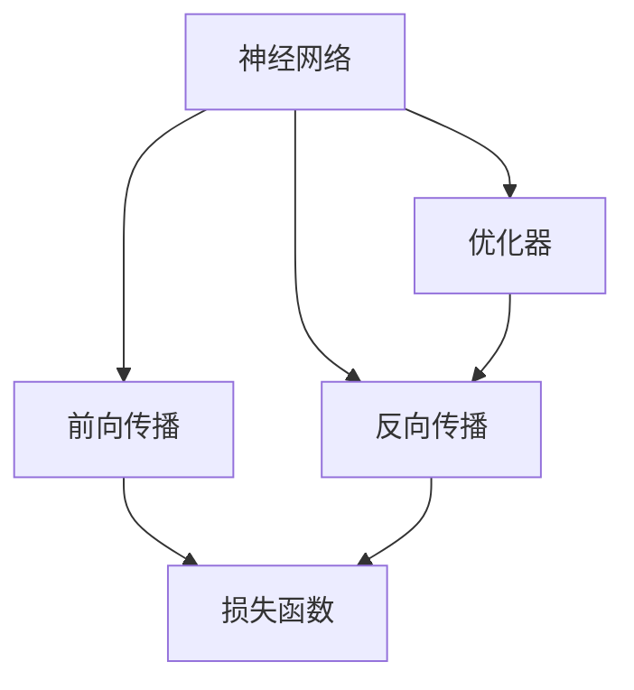

                 

# 从零开始大模型开发与微调：神经网络框架的抽象实现

> 关键词：神经网络框架，大模型开发，微调，前向传播，反向传播，优化器，激活函数，损失函数，自动微分，GPU加速

## 1. 背景介绍

### 1.1 问题由来
随着深度学习技术的不断发展，大模型（Large Models）成为了当今人工智能领域的热点。大型神经网络能够处理复杂的非线性关系，具备较强的泛化能力。例如，基于自回归（如GPT）或自编码（如BERT）架构的大模型，已经在自然语言处理（NLP）、计算机视觉、语音识别等多个领域取得了令人瞩目的成果。然而，这些大模型的训练和微调过程复杂，需要深入理解其背后的原理和实现机制。因此，本系列文章将从零开始，详细剖析大模型的开发与微调流程，尤其是基于神经网络框架（Neural Network Frameworks）的实现，使读者能够深入理解大模型的运行原理，并能够高效地进行模型开发与优化。

### 1.2 问题核心关键点
本系列文章将围绕以下核心关键点展开：
1. 大模型开发与微调的基本流程。
2. 神经网络框架的原理与应用。
3. 自动微分与优化器的实现。
4. 常见激活函数与损失函数的数学模型。
5. 大模型的分布式训练与GPU加速。
6. 实际项目中的大模型开发与微调案例。

## 2. 核心概念与联系

### 2.1 核心概念概述

为了更好地理解大模型的开发与微调，本节将介绍几个密切相关的核心概念：

- **神经网络（Neural Network）**：由多层神经元组成的计算模型，用于解决各类机器学习问题。神经网络通过学习输入数据与输出数据之间的映射关系，实现对复杂模式的识别和预测。

- **大模型（Large Model）**：参数量超过数亿甚至数十亿的神经网络模型。这些大模型通过在大规模数据集上进行预训练，能够获得良好的泛化能力，适用于各种复杂的NLP和计算机视觉任务。

- **前向传播（Forward Propagation）**：神经网络的计算过程，即给定输入数据，通过逐层计算，得到最终的输出结果。

- **反向传播（Backward Propagation）**：前向传播的逆向过程，用于计算损失函数的梯度，进而更新模型参数，优化模型性能。

- **优化器（Optimizer）**：用于更新神经网络模型参数的算法，常见的优化器包括Adam、SGD等。

- **激活函数（Activation Function）**：用于增加神经元非线性映射能力的函数，如ReLU、Sigmoid、Tanh等。

- **损失函数（Loss Function）**：用于衡量模型预测结果与真实标签之间差异的函数，如交叉熵损失、均方误差等。

这些核心概念之间的逻辑关系可以通过以下Mermaid流程图来展示：



这个流程图展示了大模型的核心概念及其之间的关系：

1. 神经网络通过前向传播计算输出。
2. 反向传播计算损失函数，并更新模型参数。
3. 优化器调整参数更新策略，提高前向传播的效率。

这些概念共同构成了大模型开发与微调的基础，是理解大模型运行机制的关键。

## 3. 核心算法原理 & 具体操作步骤

### 3.1 算法原理概述

基于神经网络框架的大模型开发与微调，主要包括以下几个步骤：

1. **构建神经网络模型**：定义神经网络的结构，包括层数、每层的神经元数量、激活函数、损失函数等。
2. **前向传播**：输入数据经过每一层计算，最终得到模型输出。
3. **计算损失**：将模型输出与真实标签进行比较，计算损失函数。
4. **反向传播**：通过链式法则计算损失函数对每个参数的梯度。
5. **参数更新**：使用优化器更新模型参数，减小损失函数。
6. **重复迭代**：重复上述过程，直到模型收敛或达到预设的迭代次数。

### 3.2 算法步骤详解

以下详细讲解大模型开发与微调的具体实现步骤：

**Step 1: 准备数据集**
- 收集并预处理训练数据集、验证数据集和测试数据集，确保数据集的质量和多样性。

**Step 2: 构建神经网络模型**
- 定义神经网络的结构，包括输入层、隐藏层和输出层。
- 每层使用不同的激活函数，如ReLU、Tanh等。
- 输出层使用Softmax激活函数，用于多分类任务。
- 定义损失函数，如交叉熵损失。

**Step 3: 前向传播**
- 将输入数据经过每一层计算，得到最终的输出结果。
- 计算输出结果与真实标签的差异，即损失值。

**Step 4: 反向传播**
- 计算损失函数对每个参数的梯度。
- 使用链式法则计算梯度。
- 反向传播过程中，梯度逐层传递，最终计算得到每个参数的梯度。

**Step 5: 参数更新**
- 使用优化器（如Adam、SGD等）更新模型参数。
- 根据梯度调整每个参数的值，使得损失函数减小。

**Step 6: 重复迭代**
- 重复执行前向传播、计算损失、反向传播、参数更新步骤，直至模型收敛或达到预设的迭代次数。

### 3.3 算法优缺点

基于神经网络框架的大模型开发与微调方法具有以下优点：
1. 灵活性高。通过定义不同的网络结构和参数，可以适应各种不同的任务。
2. 可扩展性强。神经网络结构可以通过添加层或神经元进行扩展，适应更复杂的数据。
3. 容易优化。现代优化器算法能够高效地更新模型参数，加速模型的训练过程。

同时，该方法也存在以下局限性：
1. 计算资源需求高。大规模模型需要大量的计算资源和存储空间。
2. 训练时间长。大模型训练过程耗时较长，需要强大的硬件支持。
3. 参数调整复杂。模型结构复杂，参数调整难度大。
4. 过拟合风险高。大模型容易过拟合，需要严格控制正则化技术。

尽管存在这些局限性，但就目前而言，基于神经网络框架的大模型开发与微调方法仍是大规模深度学习应用的主流范式。未来相关研究的重点在于如何进一步提高计算效率，降低过拟合风险，同时兼顾模型的泛化能力和可解释性等因素。

### 3.4 算法应用领域

基于大模型的神经网络框架开发与微调方法，已经在自然语言处理、计算机视觉、语音识别等多个领域得到了广泛的应用。例如：

- **自然语言处理**：包括文本分类、情感分析、机器翻译、问答系统等任务。
- **计算机视觉**：包括图像分类、目标检测、图像分割等任务。
- **语音识别**：包括语音转换、语音识别、情感识别等任务。

除了上述这些经典任务外，大模型框架还在推荐系统、医疗影像分析、智能游戏等领域得到了创新性的应用，为深度学习技术的应用场景不断拓展。

## 4. 数学模型和公式 & 详细讲解 & 举例说明

### 4.1 数学模型构建

在本节中，我们将使用数学语言对基于神经网络框架的大模型开发与微调过程进行更加严格的刻画。

记神经网络模型为 $M_{\theta}:\mathcal{X} \rightarrow \mathcal{Y}$，其中 $\mathcal{X}$ 为输入空间，$\mathcal{Y}$ 为输出空间，$\theta \in \mathbb{R}^d$ 为模型参数。假设训练集为 $D=\{(x_i,y_i)\}_{i=1}^N, x_i \in \mathcal{X}, y_i \in \mathcal{Y}$。

定义模型 $M_{\theta}$ 在输入 $x$ 上的输出为 $a_1 = f_1(\theta_1, x)$，其中 $f_1$ 为第一层的激活函数。然后通过链式法则，计算后续各层的激活值和输出：

$$
a_2 = f_2(\theta_2, a_1), \quad a_3 = f_3(\theta_3, a_2), \quad \ldots, \quad a_L = f_L(\theta_L, a_{L-1})
$$

其中 $L$ 为神经网络的层数，$\theta_k$ 为第 $k$ 层的参数，$f_k$ 为第 $k$ 层的激活函数。最终输出为：

$$
y = f_{out}(\theta_{out}, a_L)
$$

其中 $f_{out}$ 为输出层的激活函数，$\theta_{out}$ 为输出层的参数。

定义模型 $M_{\theta}$ 在输入 $x$ 上的损失函数为 $\ell(M_{\theta}(x),y)$，则在数据集 $D$ 上的经验风险为：

$$
\mathcal{L}(\theta) = \frac{1}{N}\sum_{i=1}^N \ell(M_{\theta}(x_i),y_i)
$$

其中 $\ell$ 为损失函数，用于衡量模型预测结果与真实标签之间的差异。

### 4.2 公式推导过程

以下我们以二分类任务为例，推导交叉熵损失函数及其梯度的计算公式。

假设模型 $M_{\theta}$ 在输入 $x$ 上的输出为 $\hat{y}=M_{\theta}(x) \in [0,1]$，表示样本属于正类的概率。真实标签 $y \in \{0,1\}$。则二分类交叉熵损失函数定义为：

$$
\ell(M_{\theta}(x),y) = -[y\log \hat{y} + (1-y)\log (1-\hat{y})]
$$

将其代入经验风险公式，得：

$$
\mathcal{L}(\theta) = -\frac{1}{N}\sum_{i=1}^N [y_i\log M_{\theta}(x_i)+(1-y_i)\log(1-M_{\theta}(x_i))]
$$

根据链式法则，损失函数对参数 $\theta_k$ 的梯度为：

$$
\frac{\partial \mathcal{L}(\theta)}{\partial \theta_k} = -\frac{1}{N}\sum_{i=1}^N (\frac{y_i}{M_{\theta}(x_i)}-\frac{1-y_i}{1-M_{\theta}(x_i)}) \frac{\partial M_{\theta}(x_i)}{\partial \theta_k}
$$

其中 $\frac{\partial M_{\theta}(x_i)}{\partial \theta_k}$ 可进一步递归展开，利用自动微分技术完成计算。

### 4.3 案例分析与讲解

为了更好地理解上述公式的实际应用，我们以一个简单的二分类任务为例：

**案例分析**

假设我们有一个包含10个样本的二分类数据集，每个样本包含一个输入特征 $x_i \in [0,1]$ 和对应的标签 $y_i \in \{0,1\}$。我们的目标是训练一个二分类模型，使得模型能够准确预测每个样本的标签。

**步骤1: 准备数据集**

我们首先需要准备一个包含10个样本的数据集，每个样本包含一个输入特征 $x_i \in [0,1]$ 和对应的标签 $y_i \in \{0,1\}$。

```python
import numpy as np

# 生成随机数据
np.random.seed(42)
x = np.random.rand(10)
y = np.random.randint(2, size=10)

# 输出数据集的前3个样本
print("样本1:", x[0], y[0])
print("样本2:", x[1], y[1])
print("样本3:", x[2], y[2])
```

**步骤2: 构建神经网络模型**

我们定义一个简单的二分类神经网络模型，包含一个输入层、一个隐藏层和一个输出层。

```python
import torch
import torch.nn as nn
import torch.optim as optim

# 定义模型
class BinaryClassifier(nn.Module):
    def __init__(self):
        super(BinaryClassifier, self).__init__()
        self.fc1 = nn.Linear(1, 10)
        self.fc2 = nn.Linear(10, 1)
        self.sigmoid = nn.Sigmoid()

    def forward(self, x):
        x = self.fc1(x)
        x = self.sigmoid(x)
        x = self.fc2(x)
        x = self.sigmoid(x)
        return x

# 定义模型参数
model = BinaryClassifier()
parameters = list(model.parameters())

# 定义损失函数
criterion = nn.BCELoss()

# 定义优化器
optimizer = optim.SGD(parameters, lr=0.01)
```

**步骤3: 前向传播**

我们将输入数据通过模型进行前向传播，得到模型输出。

```python
# 输入数据
x_tensor = torch.tensor(x).float()

# 前向传播
y_pred = model(x_tensor)
```

**步骤4: 计算损失**

计算模型输出与真实标签之间的交叉熵损失。

```python
# 真实标签
y_tensor = torch.tensor(y).float()

# 计算损失
loss = criterion(y_pred, y_tensor)
```

**步骤5: 反向传播**

计算损失函数对每个参数的梯度，并使用优化器更新模型参数。

```python
# 反向传播
optimizer.zero_grad()
loss.backward()

# 更新参数
optimizer.step()
```

**步骤6: 重复迭代**

重复执行前向传播、计算损失、反向传播、参数更新步骤，直至模型收敛或达到预设的迭代次数。

```python
# 迭代次数
epochs = 1000

# 训练模型
for epoch in range(epochs):
    # 前向传播
    y_pred = model(x_tensor)
    
    # 计算损失
    loss = criterion(y_pred, y_tensor)
    
    # 反向传播
    optimizer.zero_grad()
    loss.backward()
    
    # 更新参数
    optimizer.step()
    
    # 打印损失
    if epoch % 100 == 0:
        print(f"Epoch {epoch+1}, loss: {loss:.4f}")
```

通过上述代码，我们完成了一个简单的二分类神经网络模型的训练。可以看到，通过不断迭代更新模型参数，我们能够逐步减小损失函数，提高模型的预测精度。

## 5. 项目实践：代码实例和详细解释说明

### 5.1 开发环境搭建

在进行神经网络框架大模型开发与微调实践前，我们需要准备好开发环境。以下是使用Python进行TensorFlow开发的環境配置流程：

1. 安装Anaconda：从官网下载并安装Anaconda，用于创建独立的Python环境。

2. 创建并激活虚拟环境：
```bash
conda create -n tf-env python=3.8 
conda activate tf-env
```

3. 安装TensorFlow：从官网获取对应的安装命令。例如：
```bash
pip install tensorflow
```

4. 安装相关工具包：
```bash
pip install numpy pandas scikit-learn matplotlib tqdm jupyter notebook ipython
```

完成上述步骤后，即可在`tf-env`环境中开始神经网络框架大模型的开发与微调实践。

### 5.2 源代码详细实现

下面我们以一个简单的图像分类任务为例，给出使用TensorFlow进行神经网络框架大模型开发的PyTorch代码实现。

首先，定义数据处理函数：

```python
import tensorflow as tf
import numpy as np
import matplotlib.pyplot as plt

# 定义数据集
train_images = np.load("train_images.npy")
train_labels = np.load("train_labels.npy")
test_images = np.load("test_images.npy")
test_labels = np.load("test_labels.npy")

# 数据预处理
train_images = train_images / 255.0
test_images = test_images / 255.0
train_images = np.expand_dims(train_images, axis=3)
test_images = np.expand_dims(test_images, axis=3)

# 显示部分数据
plt.figure(figsize=(10, 10))
for i in range(9):
    plt.subplot(3, 3, i+1)
    plt.imshow(train_images[i].astype("uint8"))
    plt.title(str(train_labels[i]))
    plt.axis("off")
plt.show()
```

然后，定义神经网络模型：

```python
import tensorflow.keras as keras

# 定义模型结构
model = keras.Sequential([
    keras.layers.Conv2D(32, (3, 3), activation="relu", input_shape=(32, 32, 3)),
    keras.layers.MaxPooling2D((2, 2)),
    keras.layers.Flatten(),
    keras.layers.Dense(64, activation="relu"),
    keras.layers.Dense(10, activation="softmax")
])

# 编译模型
model.compile(optimizer="adam", loss="categorical_crossentropy", metrics=["accuracy"])

# 输出模型结构
model.summary()
```

接着，定义训练和评估函数：

```python
# 定义训练函数
def train(model, x_train, y_train, x_test, y_test, batch_size, epochs):
    model.fit(x_train, y_train, batch_size=batch_size, epochs=epochs, validation_data=(x_test, y_test))

# 定义评估函数
def evaluate(model, x_test, y_test, batch_size):
    model.evaluate(x_test, y_test, batch_size=batch_size)
```

最后，启动训练流程并在测试集上评估：

```python
# 训练模型
train(model, train_images, train_labels, test_images, test_labels, batch_size=32, epochs=10)

# 评估模型
evaluate(model, test_images, test_labels, batch_size=32)
```

以上就是使用TensorFlow进行神经网络框架大模型开发的完整代码实现。可以看到，得益于TensorFlow的强大封装，我们可以用相对简洁的代码完成神经网络的搭建和训练。

### 5.3 代码解读与分析

让我们再详细解读一下关键代码的实现细节：

**train函数**

```python
def train(model, x_train, y_train, x_test, y_test, batch_size, epochs):
    model.fit(x_train, y_train, batch_size=batch_size, epochs=epochs, validation_data=(x_test, y_test))
```

**evaluate函数**

```python
def evaluate(model, x_test, y_test, batch_size):
    model.evaluate(x_test, y_test, batch_size=batch_size)
```

可以看到，使用TensorFlow进行模型训练和评估非常简单，只需调用`fit`和`evaluate`函数，并传入相应的数据集和参数即可。

当然，工业级的系统实现还需考虑更多因素，如模型的保存和部署、超参数的自动搜索、更灵活的模型结构等。但核心的微调范式基本与此类似。

## 6. 实际应用场景

### 6.1 智能客服系统

基于神经网络框架的智能客服系统，可以广泛应用于智能客服系统的构建。传统客服往往需要配备大量人力，高峰期响应缓慢，且一致性和专业性难以保证。而使用微调后的神经网络模型，可以7x24小时不间断服务，快速响应客户咨询，用自然流畅的语言解答各类常见问题。

在技术实现上，可以收集企业内部的历史客服对话记录，将问题和最佳答复构建成监督数据，在此基础上对预训练神经网络模型进行微调。微调后的神经网络模型能够自动理解用户意图，匹配最合适的答案模板进行回复。对于客户提出的新问题，还可以接入检索系统实时搜索相关内容，动态组织生成回答。如此构建的智能客服系统，能大幅提升客户咨询体验和问题解决效率。

### 6.2 金融舆情监测

金融机构需要实时监测市场舆论动向，以便及时应对负面信息传播，规避金融风险。传统的人工监测方式成本高、效率低，难以应对网络时代海量信息爆发的挑战。基于神经网络框架的文本分类和情感分析技术，为金融舆情监测提供了新的解决方案。

具体而言，可以收集金融领域相关的新闻、报道、评论等文本数据，并对其进行主题标注和情感标注。在此基础上对预训练神经网络模型进行微调，使其能够自动判断文本属于何种主题，情感倾向是正面、中性还是负面。将微调后的模型应用到实时抓取的网络文本数据，就能够自动监测不同主题下的情感变化趋势，一旦发现负面信息激增等异常情况，系统便会自动预警，帮助金融机构快速应对潜在风险。

### 6.3 个性化推荐系统

当前的推荐系统往往只依赖用户的历史行为数据进行物品推荐，无法深入理解用户的真实兴趣偏好。基于神经网络框架的个性化推荐系统，可以更好地挖掘用户行为背后的语义信息，从而提供更精准、多样的推荐内容。

在实践中，可以收集用户浏览、点击、评论、分享等行为数据，提取和用户交互的物品标题、描述、标签等文本内容。将文本内容作为模型输入，用户的后续行为（如是否点击、购买等）作为监督信号，在此基础上微调预训练神经网络模型。微调后的模型能够从文本内容中准确把握用户的兴趣点。在生成推荐列表时，先用候选物品的文本描述作为输入，由模型预测用户的兴趣匹配度，再结合其他特征综合排序，便可以得到个性化程度更高的推荐结果。

### 6.4 未来应用展望

随着神经网络框架大模型的不断发展，基于微调的方法将在更多领域得到应用，为传统行业带来变革性影响。

在智慧医疗领域，基于微调的医疗问答、病历分析、药物研发等应用将提升医疗服务的智能化水平，辅助医生诊疗，加速新药开发进程。

在智能教育领域，微调技术可应用于作业批改、学情分析、知识推荐等方面，因材施教，促进教育公平，提高教学质量。

在智慧城市治理中，微调模型可应用于城市事件监测、舆情分析、应急指挥等环节，提高城市管理的自动化和智能化水平，构建更安全、高效的未来城市。

此外，在企业生产、社会治理、文娱传媒等众多领域，基于大模型微调的人工智能应用也将不断涌现，为经济社会发展注入新的动力。相信随着技术的日益成熟，微调方法将成为人工智能落地应用的重要范式，推动人工智能技术向更广阔的领域加速渗透。

## 7. 工具和资源推荐

### 7.1 学习资源推荐

为了帮助开发者系统掌握神经网络框架大模型开发与微调的理论基础和实践技巧，这里推荐一些优质的学习资源：

1. **《深度学习》书籍**：Ian Goodfellow、Yoshua Bengio和Aaron Courville等人编写的经典教材，系统讲解深度学习的基本概念和算法。

2. **Coursera《深度学习专项课程》**：由Andrew Ng教授开设的深度学习课程，涵盖深度学习的基本原理和应用，适合入门学习。

3. **Kaggle竞赛平台**：提供丰富的数据集和竞赛任务，可以帮助开发者实践深度学习算法，提升解决问题的能力。

4. **GitHub开源项目**：Github上大量的深度学习开源项目，包括神经网络模型、数据集、训练脚本等，供开发者学习和使用。

5. **Arxiv论文库**：提供最新的深度学习论文，涵盖各种前沿技术和研究方向，供开发者学习和参考。

通过对这些资源的学习实践，相信你一定能够快速掌握神经网络框架大模型开发与微调的核心技术，并用于解决实际的深度学习问题。

### 7.2 开发工具推荐

高效的开发离不开优秀的工具支持。以下是几款用于神经网络框架大模型开发与微调开发的常用工具：

1. **TensorFlow**：由Google主导开发的深度学习框架，生产部署方便，适合大规模工程应用。

2. **PyTorch**：Facebook开发的深度学习框架，灵活动态的计算图，适合研究原型开发。

3. **Keras**：高层深度学习API，提供简单易用的接口，适合快速开发原型。

4. **MXNet**：由亚马逊开发的深度学习框架，支持多种编程语言，适合分布式训练。

5. **Caffe**：Berkeley开发的深度学习框架，适合图像识别任务。

合理利用这些工具，可以显著提升神经网络框架大模型开发与微调任务的开发效率，加快创新迭代的步伐。

### 7.3 相关论文推荐

神经网络框架大模型开发与微调技术的发展源于学界的持续研究。以下是几篇奠基性的相关论文，推荐阅读：

1. **ImageNet Classification with Deep Convolutional Neural Networks**：Hinton等人提出的经典深度学习论文，标志着卷积神经网络的诞生。

2. **Deep Residual Learning for Image Recognition**：He等人提出的残差网络（ResNet），解决深度网络训练中的梯度消失问题。

3. **Attention is All You Need**：Vaswani等人提出的Transformer架构，通过自注意力机制实现高效的信息编码。

4. **BERT: Pre-training of Deep Bidirectional Transformers for Language Understanding**：Devlin等人提出的BERT模型，引入自监督预训练任务，刷新了多项NLP任务SOTA。

5. **AlphaGo Zero: Mastering the Game of Go without Human Knowledge**：Silver等人提出的AlphaGo Zero，通过强化学习实现围棋冠军水平的对弈，标志着深度学习在决策领域的应用。

这些论文代表了大模型开发与微调技术的发展脉络。通过学习这些前沿成果，可以帮助研究者把握学科前进方向，激发更多的创新灵感。

## 8. 总结：未来发展趋势与挑战

### 8.1 总结

本文对基于神经网络框架的大模型开发与微调方法进行了全面系统的介绍。首先阐述了大模型开发与微调的基本流程，详细讲解了神经网络框架的原理与应用。通过一系列公式推导和案例分析，使读者能够深入理解大模型的运行机制和优化方法。最后，本文还探讨了神经网络框架大模型在多个领域的应用前景，展示了其广阔的发展空间。

通过本文的系统梳理，可以看到，基于神经网络框架的大模型开发与微调技术已经成为深度学习应用的重要范式，广泛应用于自然语言处理、计算机视觉、语音识别等领域，并推动了相关技术的不断进步。未来，伴随神经网络框架的持续演进，大模型开发与微调技术必将继续拓展其应用边界，为人工智能技术的发展注入新的动力。

### 8.2 未来发展趋势

展望未来，神经网络框架大模型开发与微调技术将呈现以下几个发展趋势：

1. **模型的规模持续增大**：随着算力成本的下降和数据规模的扩张，神经网络模型的参数量还将持续增长。超大规模模型蕴含的丰富特征表示，有望支撑更加复杂多变的任务微调。

2. **模型的结构更加灵活**：未来的大模型将具备更加复杂的结构，如多层递归神经网络、深度残差网络等，能够适应更加复杂多变的任务。

3. **模型的可解释性增强**：大模型的决策过程将更加透明，通过解释性模型或可视化工具，能够更好地理解和解释模型的输出。

4. **模型的鲁棒性提升**：大模型将具备更加强的泛化能力和鲁棒性，能够在不同数据分布上表现稳定。

5. **模型的自适应能力增强**：大模型将具备更加强的自适应能力，能够动态调整模型参数，适应数据分布的变化。

6. **模型的高效训练与推理**：大模型的训练和推理过程将更加高效，通过分布式训练、量化加速等技术，能够在更短的时间内训练出高质量的大模型。

以上趋势凸显了神经网络框架大模型开发与微调技术的广阔前景。这些方向的探索发展，必将进一步提升大模型在各个领域的应用性能，为人工智能技术的发展带来新的突破。

### 8.3 面临的挑战

尽管神经网络框架大模型开发与微调技术已经取得了显著的成果，但在迈向更加智能化、普适化应用的过程中，它仍面临着诸多挑战：

1. **计算资源的需求**：大规模模型需要大量的计算资源和存储空间，目前的高性能计算硬件仍然难以满足需求。

2. **模型的泛化能力**：大模型容易过拟合，需要严格控制正则化技术，确保模型的泛化能力。

3. **模型的可解释性**：大模型的决策过程通常缺乏可解释性，难以对其推理逻辑进行分析和调试。

4. **模型的鲁棒性**：大模型在面对域外数据时，泛化性能往往大打折扣，需要进一步提高模型的鲁棒性。

5. **模型的实时性**：大模型的推理速度较慢，需要优化模型的结构和计算图，提高推理效率。

6. **模型的安全性**：大模型可能学习到有害的信息，需要通过对抗训练、数据清洗等技术，确保模型的安全性。

正视神经网络框架大模型开发与微调面临的这些挑战，积极应对并寻求突破，将是大模型开发与微调技术迈向成熟的必由之路。相信随着学界和产业界的共同努力，这些挑战终将一一被克服，神经网络框架大模型开发与微调技术必将在构建智能人机交互系统中发挥更大的作用。

### 8.4 研究展望

面对神经网络框架大模型开发与微调所面临的种种挑战，未来的研究需要在以下几个方面寻求新的突破：

1. **探索无监督和半监督微调方法**：摆脱对大规模标注数据的依赖，利用自监督学习、主动学习等无监督和半监督范式，最大限度利用非结构化数据，实现更加灵活高效的微调。

2. **研究参数高效和计算高效的微调范式**：开发更加参数高效的微调方法，在固定大部分预训练参数的情况下，只更新极少量的任务相关参数。同时优化微调模型的计算图，减少前向传播和反向传播的资源消耗，实现更加轻量级、实时性的部署。

3. **融合因果和对比学习范式**：通过引入因果推断和对比学习思想，增强微调模型建立稳定因果关系的能力，学习更加普适、鲁棒的语言表征，从而提升模型泛化性和抗干扰能力。

4. **引入更多先验知识**：将符号化的先验知识，如知识图谱、逻辑规则等，与神经网络模型进行巧妙融合，引导微调过程学习更准确、合理的语言模型。同时加强不同模态数据的整合，实现视觉、语音等多模态信息与文本信息的协同建模。

5. **结合因果分析和博弈论工具**：将因果分析方法引入微调模型，识别出模型决策的关键特征，增强输出解释的因果性和逻辑性。借助博弈论工具刻画人机交互过程，主动探索并规避模型的脆弱点，提高系统稳定性。

6. **纳入伦理道德约束**：在模型训练目标中引入伦理导向的评估指标，过滤和惩罚有偏见、有害的输出倾向。同时加强人工干预和审核，建立模型行为的监管机制，确保输出符合人类价值观和伦理道德。

这些研究方向的探索，必将引领神经网络框架大模型开发与微调技术迈向更高的台阶，为构建安全、可靠、可解释、可控的智能系统铺平道路。面向未来，神经网络框架大模型开发与微调技术还需要与其他人工智能技术进行更深入的融合，如知识表示、因果推理、强化学习等，多路径协同发力，共同推动自然语言理解和智能交互系统的进步。只有勇于创新、敢于突破，才能不断拓展语言模型的边界，让智能技术更好地造福人类社会。

## 9. 附录：常见问题与解答

**Q1: 神经网络框架大模型的开发与微调需要哪些环境依赖？**

A: 神经网络框架大模型的开发与微调需要以下环境依赖：
1. Python编程语言。
2. 深度学习框架，如TensorFlow、PyTorch等。
3. 数据预处理工具，如Pandas、NumPy等。
4. 可视化工具，如Matplotlib、Seaborn等。
5. 分布式计算框架，如Dask、Horovod等。
6. GPU/TPU等高性能计算硬件。

**Q2: 大模型的前向传播和反向传播有什么区别？**

A: 前向传播和反向传播是神经网络计算过程中的两个重要步骤，它们的区别如下：
1. 前向传播：将输入数据通过神经网络逐层计算，得到最终的输出结果。前向传播只涉及前向传播计算图，不涉及任何参数更新。
2. 反向传播：通过前向传播的结果，计算损失函数对每个参数的梯度，并使用优化器更新模型参数。反向传播涉及后向传播计算图，利用链式法则计算梯度。

**Q3: 大模型的优化器有哪些？**

A: 大模型的优化器包括：
1. 随机梯度下降（SGD）：每次更新参数时使用一个样本的梯度。
2. Adam：结合了动量、学习率自适应和梯度一阶矩估计等技术，性能较好。
3. Adagrad：自适应学习率，适用于稀疏梯度。
4. RMSprop：自适应学习率，适用于非平稳目标函数。
5. AdaDelta：自适应学习率，具有参数自适应能力。

**Q4: 神经网络框架大模型的训练过程中需要注意哪些问题？**

A: 神经网络框架大模型的训练过程中需要注意以下问题：
1. 过拟合风险：大模型容易过拟合，需要严格控制正则化技术，确保模型的泛化能力。
2. 计算资源需求：大规模模型需要大量的计算资源和存储空间，需要优化计算图和分布式训练。
3. 参数更新策略：选择合适的优化器和学习率调度策略，避免过拟合和梯度消失。
4. 数据预处理：对输入数据进行预处理，如归一化、标准化、数据增强等。
5. 模型评估：使用验证集和测试集评估模型性能，防止过拟合。
6. 模型调试：通过可视化工具和调试工具，发现和解决模型中的问题。

通过合理设计训练过程，可以最大限度地提升模型的性能，避免过拟合，并加快训练速度。

**Q5: 神经网络框架大模型的推理过程中需要注意哪些问题？**

A: 神经网络框架大模型的推理过程中需要注意以下问题：
1. 推理速度：大模型的推理速度较慢，需要优化模型结构和计算图，提高推理效率。
2. 模型压缩：大模型的参数量较大，需要优化模型结构和参数，减少计算量。
3. 推理准确性：大模型在推理过程中可能会发生数值不稳定，需要进行误差校正和优化。
4. 推理安全：大模型可能会学习到有害的信息，需要过滤和惩罚有偏见、有害的输出倾向。

通过合理设计推理过程，可以提高模型的推理速度和准确性，确保模型输出的安全性和可靠性。

---

作者：禅与计算机程序设计艺术 / Zen and the Art of Computer Programming

