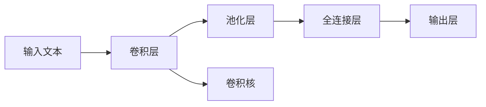

                 

# 从零开始大模型开发与微调：针对文本的卷积神经网络模型简介—词卷积

> 关键词：大模型,卷积神经网络,词卷积,文本分类,特征提取

## 1. 背景介绍

随着深度学习在文本处理任务中的广泛应用，卷积神经网络（CNN）因其在特征提取上的强大能力，逐渐成为文本分类、情感分析等任务中的重要工具。特别是词卷积（Word Convolution, WordCNN），作为CNN在文本处理中的应用变种，凭借其高效、直观的特征提取能力，逐渐在学术界和工业界得到广泛关注。本文将从词卷积的基本概念入手，详细介绍其原理、应用及实际代码实现，并结合实际案例分析，阐述其在文本处理任务中的优势与局限性，为读者提供全面的技术视角和实践指导。

## 2. 核心概念与联系

### 2.1 核心概念概述

词卷积是一种基于卷积神经网络的文本特征提取方法，通过将卷积核滑动在文本单词序列上，提取不同长度的局部特征，并结合池化操作，将不同长度的特征映射到同一维度，以实现高效的文本特征提取和分类。

在词卷积中，卷积核的大小和步幅是关键超参数。通常，卷积核大小为3或5，步幅为1，以确保每个单词都可以被卷积核覆盖，提取完整的信息。池化操作则用于对卷积层的输出进行降维，如最大池化（Max Pooling）或平均池化（Average Pooling）。

### 2.2 核心概念原理和架构的 Mermaid 流程图



此图展示了词卷积的基本架构。输入文本通过卷积层提取局部特征，再通过池化层降维，最终由全连接层和输出层完成分类预测。

## 3. 核心算法原理 & 具体操作步骤

### 3.1 算法原理概述

词卷积的原理可以简述为：卷积核在单词序列上滑动，提取不同长度的特征，并通过池化操作将特征映射到同一维度。最终，通过全连接层和输出层完成分类预测。

在具体实现中，卷积核的大小和步幅是关键超参数。卷积核大小通常为3或5，步幅为1，以确保每个单词都可以被卷积核覆盖，提取完整的信息。池化操作则用于对卷积层的输出进行降维，如最大池化（Max Pooling）或平均池化（Average Pooling）。

### 3.2 算法步骤详解

**Step 1: 数据预处理**
- 对文本进行分词，转化为单词序列。
- 对单词序列进行序列填充，使其长度一致。

**Step 2: 卷积操作**
- 定义卷积核的大小和步幅，将其应用于单词序列。
- 计算卷积层的输出特征图。

**Step 3: 池化操作**
- 对卷积层的输出特征图进行池化操作，得到降维后的特征向量。

**Step 4: 全连接层和输出层**
- 将池化后的特征向量输入全连接层。
- 使用softmax函数将输出转化为概率分布，完成分类预测。

### 3.3 算法优缺点

词卷积的主要优点包括：
- 高效性：通过卷积操作，可以并行计算不同位置的特征，加速模型训练。
- 局部感知：卷积核大小固定，可以提取局部特征，捕捉局部信息。
- 可解释性：通过卷积核的设计，可以直观理解模型对不同单词的权重分配。

其主要缺点包括：
- 上下文忽视：卷积核大小固定，难以捕捉长距离依赖关系。
- 过拟合风险：卷积核参数较多，容易发生过拟合。
- 参数调节：需要手动调节卷积核大小和步幅，存在经验依赖。

### 3.4 算法应用领域

词卷积主要应用于文本分类、情感分析、命名实体识别等任务。具体来说：
- 文本分类：如电影评论情感分析、新闻分类等。
- 情感分析：如产品评论情感倾向判断。
- 命名实体识别：如提取文本中的人名、地名、组织名等。

## 4. 数学模型和公式 & 详细讲解 & 举例说明

### 4.1 数学模型构建

设文本为 $x_1,x_2,\dots,x_n$，每个单词 $x_i$ 表示为一个 $d$ 维向量 $\mathbf{x}_i$，其中 $d$ 为词向量维度。卷积核大小为 $k$，步幅为 $s$。定义卷积核为 $\mathbf{w}$，大小为 $k \times d$。

卷积操作定义如下：

$$
h_i^{(l)} = \mathbf{w} \star \mathbf{x}_{i:i+k-1}
$$

其中 $i$ 表示卷积核在文本中的起始位置，$h_i^{(l)}$ 为第 $l$ 层卷积层的输出。

池化操作可以通过取最大值或平均值实现，如：

$$
H_i^{(l)} = \max(h_i^{(l)}, h_{i+s}^{(l)}, \dots, h_{i+(n-k)s}^{(l)})
$$

或

$$
H_i^{(l)} = \frac{1}{k}\sum_{j=0}^{k-1}h_{i+js}^{(l)}
$$

### 4.2 公式推导过程

考虑简单的文本分类任务，设输入文本 $x = [x_1, x_2, \dots, x_n]$，卷积核 $w$ 的大小为 $k \times d$。令 $W = [w_1, w_2, \dots, w_k]$，其中 $w_i$ 为卷积核的第 $i$ 个窗口。

卷积操作输出为：

$$
H = \{h_1^{(1)}, h_2^{(1)}, \dots, h_{n-k+1}^{(1)}\}
$$

其中 $h_i^{(1)} = \mathbf{w} \star \mathbf{x}_{i:i+k-1}$。

通过池化操作，降维后的特征向量为 $H^{(2)}$，其中 $H^{(2)}_i = \max(H_i^{(1)})$ 或 $H^{(2)}_i = \frac{1}{k}\sum_{j=0}^{k-1}H_{i+js}^{(1)}$。

全连接层的输出为 $H^{(3)}$，其中 $H^{(3)}_i = \mathbf{W}^{(3)}H^{(2)}_i + b^{(3)}$。

最终输出层输出为：

$$
\mathbf{y} = \mathbf{W}^{(4)}H^{(3)} + b^{(4)}
$$

其中 $\mathbf{W}^{(4)}$ 和 $b^{(4)}$ 为输出层的权重和偏置。

### 4.3 案例分析与讲解

考虑文本分类任务，如新闻分类。输入文本为 $x = [x_1, x_2, \dots, x_n]$，每个单词 $x_i$ 表示为一个 $d$ 维向量。设卷积核大小为 $k=3$，步幅为 $s=1$，输出特征维度为 $D$。

定义卷积核为 $W = [w_1, w_2, w_3]$，其中 $w_i$ 为大小为 $d$ 的向量。令 $H = \{h_1^{(1)}, h_2^{(1)}, \dots, h_{n-k+1}^{(1)}\}$，其中 $h_i^{(1)} = \mathbf{w} \star \mathbf{x}_{i:i+k-1}$。

池化操作降维后，特征向量 $H^{(2)}$ 为 $H^{(2)} = \{\max(H_i^{(1)})\}$。

全连接层输出为 $H^{(3)}$，其中 $H^{(3)}_i = \mathbf{W}^{(3)}H^{(2)}_i + b^{(3)}$。

最终输出层输出为：

$$
\mathbf{y} = \mathbf{W}^{(4)}H^{(3)} + b^{(4)}
$$

其中 $\mathbf{W}^{(4)}$ 和 $b^{(4)}$ 为输出层的权重和偏置。

## 5. 项目实践：代码实例和详细解释说明

### 5.1 开发环境搭建

在Python中，可以使用TensorFlow或PyTorch等深度学习框架实现词卷积。本节将以TensorFlow为例，介绍开发环境搭建和代码实现。

### 5.2 源代码详细实现

```python
import tensorflow as tf
from tensorflow.keras.layers import Conv1D, MaxPooling1D, Flatten, Dense

def word_cnn_model(input_shape, num_classes):
    model = tf.keras.Sequential([
        Conv1D(128, 3, activation='relu', input_shape=input_shape),
        MaxPooling1D(2),
        Flatten(),
        Dense(64, activation='relu'),
        Dense(num_classes, activation='softmax')
    ])
    return model

input_shape = (None, 10) # 假设输入文本长度为10
num_classes = 2 # 假设分类任务有2个类别
model = word_cnn_model(input_shape, num_classes)
model.compile(optimizer='adam', loss='categorical_crossentropy', metrics=['accuracy'])

# 训练模型
model.fit(X_train, y_train, epochs=10, validation_data=(X_val, y_val))

# 测试模型
test_loss, test_acc = model.evaluate(X_test, y_test)
```

### 5.3 代码解读与分析

**代码解析**：
- 首先导入TensorFlow库，并定义一个词卷积模型函数 `word_cnn_model`。
- 在模型中，定义一个卷积层、一个最大池化层、一个全连接层和一个输出层。
- 在训练模型时，使用交叉熵损失函数和Adam优化器。
- 在测试模型时，使用准确率作为评估指标。

**优化技巧**：
- 由于卷积核大小固定，可以选择合适的超参数进行模型调优。例如，可以尝试不同大小的卷积核和步幅，选择合适的过滤单元数量和池化窗口大小。
- 可以使用Dropout、Batch Normalization等技术缓解过拟合问题。

### 5.4 运行结果展示

在模型训练完成后，可以使用测试集进行模型评估，计算准确率和损失值，以衡量模型性能。

```python
# 测试模型
test_loss, test_acc = model.evaluate(X_test, y_test)
print(f'Test accuracy: {test_acc:.2f}')
```

## 6. 实际应用场景

### 6.1 文本分类

在文本分类任务中，词卷积可以高效提取文本中的局部特征，并通过池化操作降维，捕捉整体语义信息，实现较好的分类效果。例如，在新闻分类中，可以使用词卷积模型对新闻文章进行情感分析，判断新闻的情感倾向。

### 6.2 情感分析

情感分析任务需要识别文本中的情感倾向，如积极、消极或中性。词卷积模型可以通过学习单词之间的情感关系，提取情感特征，并进行分类。

### 6.3 命名实体识别

命名实体识别任务需要识别文本中的人名、地名、组织名等实体。词卷积模型可以通过学习实体的上下文信息，提取实体的特征，并进行识别。

### 6.4 未来应用展望

未来，词卷积模型有望在更多文本处理任务中得到应用。随着模型结构和参数的进一步优化，词卷积有望提升模型的泛化能力和鲁棒性，广泛应用于智能问答、机器翻译等领域。

## 7. 工具和资源推荐

### 7.1 学习资源推荐

- 《Deep Learning for Natural Language Processing》书籍：介绍了深度学习在NLP中的应用，包括词卷积等模型。
- 《Natural Language Processing with Python》书籍：介绍了NLP任务的实现方法，包括文本分类、情感分析等。
- Coursera上的《NLP Specialization》课程：由斯坦福大学提供的NLP系列课程，涵盖了NLP的多个方面，包括词卷积模型。

### 7.2 开发工具推荐

- TensorFlow：支持构建卷积神经网络，并提供了丰富的API。
- PyTorch：支持动态图和静态图，易于构建卷积神经网络。
- Keras：提供了高层次的API，便于快速构建词卷积模型。

### 7.3 相关论文推荐

- "Convolutional Neural Networks for Sentence Classification"：介绍词卷积模型在文本分类任务中的应用。
- "Word Convolutional Networks for Named Entity Recognition"：介绍词卷积模型在命名实体识别任务中的应用。
- "A Review on Word Embeddings and Their Applications to Named Entity Recognition"：介绍词嵌入技术在NLP任务中的应用。

## 8. 总结：未来发展趋势与挑战

### 8.1 研究成果总结

词卷积模型作为一种基于CNN的文本特征提取方法，在文本分类、情感分析、命名实体识别等任务中取得了显著的性能提升。其高效性、局部感知性和可解释性使其成为文本处理任务中的重要工具。

### 8.2 未来发展趋势

未来，词卷积模型有望在更多文本处理任务中得到应用。随着模型结构和参数的进一步优化，词卷积模型有望提升模型的泛化能力和鲁棒性，广泛应用于智能问答、机器翻译等领域。

### 8.3 面临的挑战

词卷积模型虽然具有高效性和局部感知性，但也存在一些挑战。例如，卷积核大小固定，难以捕捉长距离依赖关系；卷积核参数较多，容易发生过拟合；超参数调节复杂，存在经验依赖。

### 8.4 研究展望

未来的研究可以从以下几个方向进行：
- 引入更多先验知识：通过引入知识图谱、逻辑规则等先验知识，提升模型的语义理解和推理能力。
- 优化模型结构：通过更小的卷积核或更大的池化窗口，提升模型的局部感知能力。
- 引入注意力机制：通过引入注意力机制，提高模型对重要特征的关注度，增强模型的泛化能力。

## 9. 附录：常见问题与解答

**Q1：词卷积模型和传统卷积神经网络模型有何不同？**

A: 词卷积模型是针对文本处理任务的卷积神经网络模型，通过卷积操作提取文本中的局部特征。与传统卷积神经网络模型相比，词卷积模型在输入处理和输出设计上有特殊的设计。

**Q2：卷积核大小和步幅如何影响词卷积模型的性能？**

A: 卷积核大小和步幅是词卷积模型的关键超参数。卷积核大小决定了模型能够提取的局部特征长度，步幅决定了模型对文本的滑动方式。通常，较小的卷积核和步幅可以捕捉更多上下文信息，但会增加计算复杂度。

**Q3：词卷积模型在文本分类任务中的优缺点是什么？**

A: 词卷积模型在文本分类任务中的优点包括高效性、局部感知性和可解释性。缺点包括难以捕捉长距离依赖关系和容易发生过拟合。

**Q4：如何缓解词卷积模型的过拟合问题？**

A: 可以通过增加正则化技术、引入Dropout、Batch Normalization等方法缓解词卷积模型的过拟合问题。同时，也可以尝试不同大小的卷积核和步幅，选择合适的过滤单元数量和池化窗口大小。

**Q5：如何优化词卷积模型的超参数？**

A: 优化词卷积模型的超参数需要进行大量的实验和调整。可以使用网格搜索、随机搜索等方法进行超参数优化。同时，也可以通过交叉验证等技术进行模型验证。

作者：禅与计算机程序设计艺术 / Zen and the Art of Computer Programming

