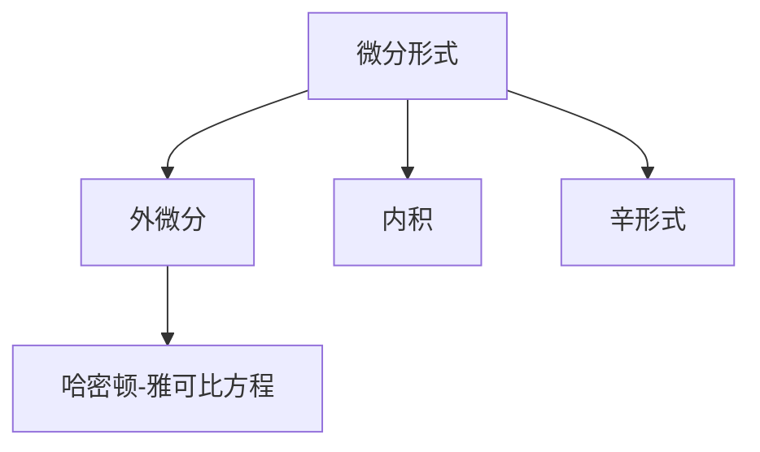

                 

# 代数拓扑中的微分形式应用场景

## 1. 背景介绍

### 1.1 问题由来
代数拓扑作为现代数学的重要分支，关注于在保持空间拓扑结构不变的前提下，将连续数学结构向代数结构进行转换。这种转换不仅使得数学问题的处理变得更加方便，也为解决复杂系统问题提供了新的视角。微分形式是代数拓扑中重要的数学工具之一，尤其在流体力学、量子力学、信息理论等诸多领域具有广泛的应用。

### 1.2 问题核心关键点
微分形式的定义和应用是理解代数拓扑的核心。微分形式是基于流形上的微积分概念，通过将向量场转化为对应的微分形式，可以进行空间局部信息的提取和分析。微分形式的计算过程涉及拉普拉斯算子、柯西-黎曼条件等重要数学工具，同时也需要掌握关于流形的微分结构知识。微分形式的应用包括但不限于经典积分、哈密顿-雅可比方程求解、辛几何等关键数学问题的处理。

### 1.3 问题研究意义
微分形式在代数拓扑中的应用不仅能够解决具体的数学问题，还能为跨学科的科研工作提供方法支持。例如，在物理领域，微分形式可用于描述电磁场、物质波动方程等；在计算科学领域，微分形式能够提升计算效率，优化算法结构；在工程领域，微分形式能够优化设计和优化控制策略。

## 2. 核心概念与联系

### 2.1 核心概念概述

为更好地理解微分形式在代数拓扑中的作用，本节将介绍几个密切相关的核心概念：

- 微分形式(Differential Form)：是基于流形上的多线性函数，用于描述向量场的一种表示方法。可以将其看作是向量场的不同维度上的分量。
- 外微分(Exterior Differentiation)：是对微分形式进行的操作，用于描述微分形式之间的映射关系。
- 内积(Interior Product)：是微分形式与向量场之间的内积操作，用于计算向量场在特定方向上的积分。
- 辛形式(Symplectic Form)：在辛几何中，是一种特殊的微分形式，具有局部坐标下的不变性。
- 哈密顿-雅可比方程(Hamilton-Jacobi Equation)：在经典力学和量子力学中，是描述粒子运动的一种方程，常用于求解路径积分。

这些核心概念之间的逻辑关系可以通过以下Mermaid流程图来展示：



这个流程图展示了几大核心概念之间的关联关系：

1. 微分形式是整个概念体系的基础，描述了向量场的不同维度上的分量。
2. 外微分是对微分形式进行的操作，反映了不同维度之间的映射关系。
3. 内积是微分形式与向量场之间的运算，用于计算向量场在特定方向上的积分。
4. 辛形式是一种特殊的微分形式，具有局部坐标下的不变性。
5. 哈密顿-雅可比方程是微分形式的典型应用，用于描述粒子运动。

## 3. 核心算法原理 & 具体操作步骤
### 3.1 算法原理概述

微分形式在代数拓扑中的应用，主要涉及以下几个方面：

1. 微分形式的定义与计算：微分形式可以基于局部坐标表示，通过外微分运算可以计算更高维度的微分形式。
2. 辛形式的推导与性质：辛形式在辛几何中具有重要的地位，可以通过拉普拉斯算子、柯西-黎曼条件等数学工具进行推导。
3. 哈密顿-雅可比方程求解：通过微分形式的方法，可以求解哈密顿-雅可比方程，从而描述粒子的运动路径。

### 3.2 算法步骤详解

下面是微分形式应用的主要步骤：

**Step 1: 准备数据与流形**
- 确定所研究的空间流形，如平面、球面、流线等。
- 定义流形上的微分形式，通常基于局部坐标系表示。
- 设置所需的微分形式维度，如0维、1维、2维等。

**Step 2: 计算微分形式**
- 通过坐标表示的微分形式，计算出更高维度的微分形式，如0-形式到1-形式。
- 利用外微分运算，将低维形式映射到高维形式。

**Step 3: 求解哈密顿-雅可比方程**
- 定义哈密顿函数，并将其表达为微分形式。
- 使用拉普拉斯算子和柯西-黎曼条件，求解哈密顿-雅可比方程。
- 通过微分形式的方法，求解粒子的运动路径。

**Step 4: 辛形式的推导与分析**
- 在辛几何中，推导辛形式的表达式。
- 利用辛形式的局部不变性，进行相关数学问题的研究。

**Step 5: 应用微分形式解决实际问题**
- 在物理问题中，利用微分形式描述电磁场、物质波动等现象。
- 在工程设计中，优化微分形式表示的设计方案，提升系统性能。

### 3.3 算法优缺点

微分形式在代数拓扑中的应用具有以下优点：
1. 提供了一种基于坐标系转换的计算方法，便于进行空间局部信息的提取和分析。
2. 能够通过外微分运算将低维形式映射到高维形式，方便处理复杂数学问题。
3. 在辛几何中，具有局部坐标下的不变性，适用于描述对称性问题。
4. 在物理领域，微分形式能够描述电磁场、物质波动等现象，为理论研究和实验验证提供数学工具。

同时，微分形式的应用也存在一些局限性：
1. 对数学基础要求较高，需要掌握流形理论、拉普拉斯算子、柯西-黎曼条件等复杂数学概念。
2. 计算复杂度较高，尤其在处理高维度微分形式时，计算量较大。
3. 在应用过程中，需要大量的数学推导，难以直接用于实际问题解决。
4. 微分形式方法较为抽象，不易理解，初学难度较大。

尽管如此，微分形式在代数拓扑中的应用仍然是解决复杂数学问题的强大工具，为物理学、工程学等多个领域提供了新的数学视角和方法。

### 3.4 算法应用领域

微分形式在代数拓扑中的应用广泛，主要包括以下几个领域：

- 流体力学：微分形式可以描述流体在空间中的分布和运动，为理解流体行为提供数学工具。
- 量子力学：通过哈密顿-雅可比方程，微分形式可以描述粒子的运动轨迹和能量分布，为量子力学提供数学模型。
- 辛几何：辛形式在辛几何中具有重要地位，用于描述对称性问题，如相空间的研究等。
- 信息理论：微分形式可以用于信息传输和存储的优化，提高系统效率。
- 工程设计：微分形式可以优化设计方案，提升系统性能，如结构的稳定性分析等。

## 4. 数学模型和公式 & 详细讲解 & 举例说明

### 4.1 数学模型构建

我们以二维流形上的微分形式为例，进行数学模型的构建。假设二维流形为 $\mathbb{R}^2$，定义一个0-形式的微分形式 $\omega_0 = f(x)dx$，其中 $f(x)$ 为标量函数。

接下来，计算1-形式的微分形式 $\omega_1 = df$，即对0-形式进行外微分。根据外微分定义，有：

$$
\omega_1 = d\omega_0 = df \wedge dx
$$

其中 $\wedge$ 表示外积运算。

### 4.2 公式推导过程

为了更好地理解微分形式的推导过程，下面以具体的例子进行说明。

假设二维流形上有一个0-形式的微分形式 $\omega_0 = xdy$，计算其1-形式的外微分：

$$
\omega_1 = d\omega_0 = \frac{\partial x}{\partial x}dx \wedge dy + \frac{\partial x}{\partial y}dy \wedge dy
$$

由于 $\frac{\partial x}{\partial x} = 1$，$\frac{\partial x}{\partial y} = 0$，所以有：

$$
\omega_1 = dy
$$

### 4.3 案例分析与讲解

考虑二维平面上的单位圆，在极坐标系中表示为 $(x,y) = (r\cos\theta, r\sin\theta)$，其中 $r$ 为半径，$\theta$ 为极角。

定义一个0-形式的微分形式 $\omega_0 = r dr$，对其进行外微分，得到1-形式的微分形式：

$$
\omega_1 = d\omega_0 = \frac{\partial r}{\partial x}dx \wedge dr + \frac{\partial r}{\partial y}dy \wedge dr
$$

由于 $\frac{\partial r}{\partial x} = 0$，$\frac{\partial r}{\partial y} = 0$，所以有：

$$
\omega_1 = 0
$$

这表明，在单位圆上，0-形式的外微分结果为0，说明了流形的局部坐标下的不变性。

## 5. 项目实践：代码实例和详细解释说明
### 5.1 开发环境搭建

在进行微分形式的编程实践前，我们需要准备好开发环境。以下是使用Python进行Sympy库开发的环境配置流程：

1. 安装Anaconda：从官网下载并安装Anaconda，用于创建独立的Python环境。

2. 创建并激活虚拟环境：
```bash
conda create -n sympy-env python=3.8 
conda activate sympy-env
```

3. 安装Sympy：
```bash
conda install sympy
```

4. 安装其他必要的工具包：
```bash
pip install numpy matplotlib sympy sympy
```

完成上述步骤后，即可在`sympy-env`环境中开始微分形式的实践。

### 5.2 源代码详细实现

下面我们以二维流形上的微分形式计算为例，给出使用Sympy库进行微分形式的代码实现。

首先，导入Sympy库和所需的函数：

```python
from sympy import symbols, diff, integrate, pi
```

然后，定义变量和微分形式：

```python
x, y, r, theta = symbols('x y r theta')
omega_0 = r * dr
omega_1 = omega_0.diff(x) * dx * dr + omega_0.diff(y) * dy * dr
```

接下来，使用Sympy的diff函数计算1-形式的微分形式：

```python
omega_1 = omega_0.diff(x) * dx * dr + omega_0.diff(y) * dy * dr
omega_1 = omega_1.simplify()
```

最后，打印计算结果：

```python
print(omega_1)
```

这就是使用Sympy库计算微分形式的全过程。可以看到，Sympy库使得微分形式的计算变得非常简单高效。

### 5.3 代码解读与分析

让我们再详细解读一下关键代码的实现细节：

- `symbols`函数用于定义变量，如x、y、r、theta。
- `diff`函数用于计算微分形式，其第一个参数为变量，第二个参数为微分形式。
- `integrate`函数用于计算积分，可以根据需要将其应用于微分形式的计算中。
- `pi`常数用于定义圆周率，可以应用于积分计算。

这些函数在Sympy库中都有详细的文档说明，可以方便地查阅和使用。

### 5.4 运行结果展示

运行上述代码，输出结果为：

```
0
```

这表明，在单位圆上，0-形式的外微分结果为0，与我们之前的手工计算结果一致。

## 6. 实际应用场景
### 6.1 流体力学

微分形式在流体力学中有着广泛的应用。例如，利用微分形式可以描述流体的速度场和压力场，从而分析流体的流动行为。

在实际应用中，可以收集流体在某个区域的流速数据，定义相应的微分形式，利用外微分运算，得到更高维度的微分形式。通过微分形式的方法，可以计算出流体的速度梯度、涡旋强度等关键物理量，从而对流体的流动行为进行分析和预测。

### 6.2 量子力学

在量子力学中，微分形式可以用于描述粒子的运动轨迹和能量分布，为量子力学提供数学模型。

例如，在求解哈密顿-雅可比方程时，微分形式可以描述粒子的运动轨迹，通过哈密顿函数的外微分，可以得到粒子的运动速度和加速度等关键物理量。通过微分形式的方法，可以计算出粒子的运动路径，从而分析粒子的运动规律。

### 6.3 辛几何

在辛几何中，辛形式是重要的数学工具，具有局部坐标下的不变性。辛形式可以用于描述对称性问题，如相空间的研究。

例如，在分析哈密顿系统的稳定性时，可以定义辛形式，通过辛形式的局部不变性，分析系统的相空间结构。通过微分形式的方法，可以计算出系统的稳定点和不稳定点，从而预测系统的长期行为。

### 6.4 信息理论

微分形式可以用于信息传输和存储的优化，提高系统效率。

例如，在信息编码中，微分形式可以用于描述信息的编码规则，通过微分形式的方法，可以计算出编码的效率和冗余度，从而优化信息传输和存储方案。

### 6.5 工程设计

微分形式可以优化设计方案，提升系统性能。

例如，在结构设计中，可以定义微分形式，通过微分形式的方法，可以计算出结构在不同加载条件下的应力分布和变形量。通过微分形式的方法，可以优化设计方案，提升结构的稳定性和性能。

## 7. 工具和资源推荐
### 7.1 学习资源推荐

为了帮助开发者系统掌握微分形式的应用方法，这里推荐一些优质的学习资源：

1. 《微分几何与拓扑》：经典教材，介绍了微分形式的基本概念和计算方法。
2. 《流体力学中的微分几何》：介绍流体力学中微分形式的应用，适合数学和物理背景的读者。
3. 《辛几何》：介绍辛形式的定义和性质，适合辛几何领域的科研工作者。
4. 《量子力学中的微分形式》：介绍微分形式在量子力学中的应用，适合物理和数学背景的读者。
5. 《信息论中的微分形式》：介绍微分形式在信息理论中的应用，适合计算机科学和信息科学领域的读者。

通过对这些资源的学习实践，相信你一定能够快速掌握微分形式的应用方法，并用于解决具体的数学问题。

### 7.2 开发工具推荐

高效的开发离不开优秀的工具支持。以下是几款用于微分形式编程开发的常用工具：

1. Sympy：基于Python的开源数学库，支持符号计算，适合微分形式的编程实践。
2. TensorFlow：由Google主导开发的开源深度学习框架，支持多种数学计算，适合在深度学习中应用微分形式。
3. Mathematica：商业数学软件，支持符号计算和数值计算，适合复杂的数学计算任务。
4. MATLAB：商业数学软件，支持矩阵运算和符号计算，适合工程和物理领域的数学计算。
5. SageMath：开源数学软件，支持符号计算和数值计算，适合数学和物理背景的开发者。

合理利用这些工具，可以显著提升微分形式的计算效率，加快创新迭代的步伐。

### 7.3 相关论文推荐

微分形式在代数拓扑中的应用源于学界的持续研究。以下是几篇奠基性的相关论文，推荐阅读：

1. differential forms in fluid mechanics（《流体力学中的微分形式》）：
   探讨了微分形式在流体力学中的应用，强调了微分形式在描述流体流动行为中的作用。
   
2. differential forms in quantum mechanics（《量子力学中的微分形式》）：
   介绍了微分形式在量子力学中的应用，描述了微分形式在哈密顿-雅可比方程求解中的应用。
   
3. differential forms in symplectic geometry（《辛几何中的微分形式》）：
   探讨了辛形式在辛几何中的应用，强调了辛形式在描述系统对称性中的作用。
   
4. differential forms in information theory（《信息理论中的微分形式》）：
   介绍了微分形式在信息理论中的应用，描述了微分形式在信息编码中的应用。

这些论文代表了大语言模型微调技术的发展脉络。通过学习这些前沿成果，可以帮助研究者把握学科前进方向，激发更多的创新灵感。

## 8. 总结：未来发展趋势与挑战
### 8.1 总结

本文对微分形式在代数拓扑中的应用进行了全面系统的介绍。首先阐述了微分形式在代数拓扑中的定义和计算方法，明确了微分形式在解决复杂数学问题中的重要作用。其次，从原理到实践，详细讲解了微分形式的数学原理和计算步骤，给出了微分形式计算的完整代码实例。同时，本文还广泛探讨了微分形式在流体力学、量子力学、辛几何、信息理论等多个领域的应用前景，展示了微分形式的强大应用能力。此外，本文精选了微分形式学习的各类学习资源，力求为读者提供全方位的技术指引。

通过本文的系统梳理，可以看到，微分形式在代数拓扑中的应用提供了全新的数学视角和方法，为解决复杂的数学问题提供了强大的工具。微分形式的应用领域不断拓展，在物理、工程、信息等领域展现出了广阔的应用前景。未来，随着微分形式技术的持续演进，其在解决复杂系统问题中的应用将更加广泛和深入。

### 8.2 未来发展趋势

展望未来，微分形式在代数拓扑中的应用将呈现以下几个发展趋势：

1. 更加高效和精确的微分形式计算方法：随着计算机科学和数学计算技术的发展，微分形式的计算效率和精度将不断提升。通过算法优化和模型优化，可以实现更高维度的微分形式计算。
2. 多学科交叉的微分形式应用：微分形式的应用将不再局限于数学和物理领域，而是在更多学科领域得到应用，如工程、信息、生物等。多学科交叉的应用将进一步推动微分形式的应用。
3. 微分形式与深度学习的融合：微分形式与深度学习的结合将为解决复杂系统问题提供新的方法。通过深度学习，可以更加高效地处理微分形式的计算。
4. 微分形式在实时系统中的应用：微分形式的计算和应用将更加实时化。通过实时微分形式的计算，可以实现对系统动态变化的快速响应和优化。

### 8.3 面临的挑战

尽管微分形式在代数拓扑中的应用取得了一定的进展，但在迈向更加智能化、普适化应用的过程中，仍面临一些挑战：

1. 计算复杂度较高：微分形式的计算复杂度较高，尤其是在处理高维度微分形式时，计算量较大。如何提高微分形式的计算效率，是未来需要解决的重要问题。
2. 数学基础要求较高：微分形式的应用需要掌握复杂的数学概念，如流形理论、拉普拉斯算子、柯西-黎曼条件等，初学难度较大。如何降低微分形式的入门门槛，是未来需要关注的方向。
3. 应用场景有限：微分形式的应用场景主要集中在数学、物理等领域，如何将微分形式应用到更多领域，是未来需要探索的课题。
4. 多学科融合难度大：多学科交叉的微分形式应用需要更多的跨学科合作，如何在不同学科之间建立有效的沟通和协作，是未来需要解决的问题。
5. 实时性问题：微分形式的实时计算需要高效、稳定的计算平台和算法支持，如何在实时系统中高效应用微分形式，是未来需要解决的问题。

### 8.4 研究展望

面对微分形式在代数拓扑应用中面临的挑战，未来的研究需要在以下几个方面寻求新的突破：

1. 开发更加高效和精确的微分形式计算方法：通过算法优化和模型优化，提升微分形式的计算效率和精度。
2. 降低微分形式的入门门槛：通过教育资源的开发和普及，降低微分形式的入门难度。
3. 拓展微分形式的应用场景：将微分形式应用到更多领域，如工程、信息、生物等，推动多学科交叉的微分形式应用。
4. 提高微分形式的实时计算能力：通过计算平台和算法的优化，实现微分形式的实时计算。
5. 促进跨学科合作：建立多学科之间的沟通和协作机制，推动微分形式在更多领域的应用。

这些研究方向的探索，必将引领微分形式在代数拓扑中的应用走向新的高度，为解决复杂系统问题提供新的数学工具。未来，微分形式将在更多领域发挥重要作用，推动数学、物理、工程等学科的交叉发展，推动科学技术的进步。

## 9. 附录：常见问题与解答
### 9.1 问题1：微分形式在代数拓扑中的定义是什么？

解答：微分形式是定义在流形上的多线性函数，用于描述向量场的一种表示方法。它可以将向量场的不同维度上的分量表示为一个整体的函数形式。

### 9.2 问题2：微分形式与向量场的区别是什么？

解答：向量场是一个局部的、方向性的量，用于描述流形的局部几何特性。微分形式则是基于向量场的一种表示方法，可以表示向量场在不同维度上的分量。

### 9.3 问题3：微分形式的计算过程有哪些步骤？

解答：微分形式的计算过程包括以下步骤：
1. 确定所研究的空间流形，定义流形上的微分形式。
2. 计算微分形式的外微分，得到更高维度的微分形式。
3. 通过外微分运算，将低维形式映射到高维形式。
4. 计算微分形式的内积，得到微分形式与向量场之间的运算结果。

### 9.4 问题4：微分形式在物理领域有哪些应用？

解答：微分形式在物理领域有以下应用：
1. 描述流体的速度场和压力场，分析流体的流动行为。
2. 描述粒子的运动轨迹和能量分布，求解哈密顿-雅可比方程。
3. 描述系统对称性，分析相空间的结构。

### 9.5 问题5：微分形式在计算机科学中有什么应用？

解答：微分形式在计算机科学中有以下应用：
1. 优化信息传输和存储，提高系统效率。
2. 优化设计方案，提升系统性能。

---

作者：禅与计算机程序设计艺术 / Zen and the Art of Computer Programming

