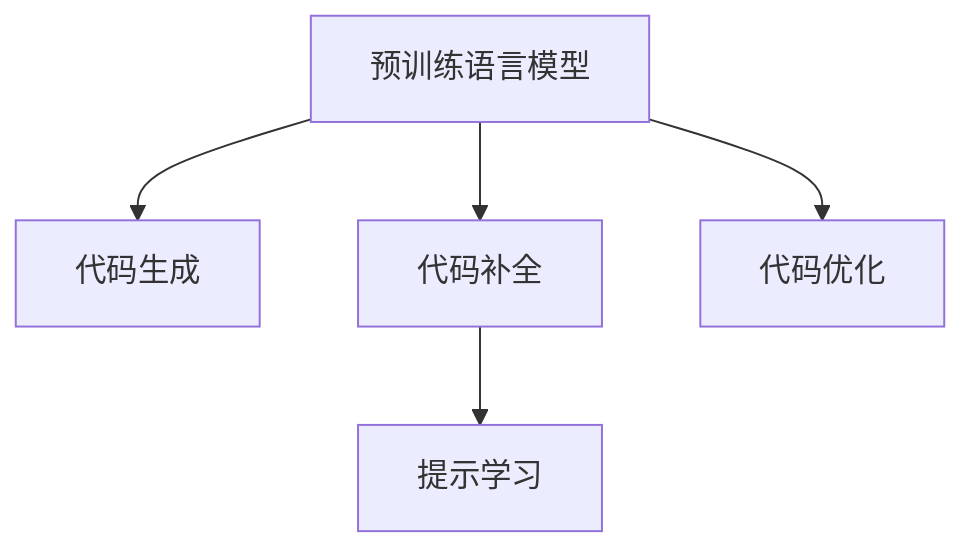

                 

## 1. 背景介绍

### 1.1 问题由来
随着人工智能技术的快速发展，代码生成成为了机器学习和自然语言处理(Natural Language Processing, NLP)领域的一个重要研究方向。代码生成即让计算机自动生成符合语法和逻辑规则的程序代码，包括自动编写代码、自动生成API接口、自动优化代码等。代码生成的应用场景广泛，如软件自动测试、智能编程辅助、自动生成文档等，能够大幅提升软件开发和维护效率，降低人力成本。

然而，尽管代码生成具有巨大的潜力，但由于自然语言与代码之间的映射复杂，长期以来在学术界和工业界未能取得突破性进展。近年来，随着预训练语言模型的出现，代码生成技术得以重焕生机。利用Transformer和BERT等先进模型，研究人员能够在海量的代码和文本语料上进行预训练，获得丰富的编码知识和语义理解能力。这些预训练模型，通过与代码生成任务进行微调，在自动编写代码、翻译代码、生成API接口等方面取得了显著效果。

### 1.2 问题核心关键点
代码生成技术主要包括两个关键步骤：

1. 预训练语言模型的构建：利用大规模无标签代码和自然语言数据，通过自监督学习任务进行预训练，学习通用的语言表示。
2. 代码生成任务的微调：在预训练模型的基础上，使用代码生成任务进行微调，学习将自然语言映射到代码的规则。

代码生成技术的核心在于如何将自然语言描述转化为代码，这一过程包含三个核心问题：

- 代码理解：模型需要准确理解自然语言描述，将其映射到代码结构。
- 代码生成：模型需要根据自然语言描述，生成符合语义要求的代码。
- 代码优化：模型需要对生成的代码进行语义和性能优化，提升代码的可读性和效率。

## 2. 核心概念与联系

### 2.1 核心概念概述

为更好地理解代码生成技术的核心原理和实现方法，本节将介绍几个密切相关的核心概念：

- 预训练语言模型(Pre-trained Language Models, PLMs)：以自回归(如GPT)或自编码(如BERT)模型为代表的大规模预训练语言模型。通过在大规模无标签文本语料上进行预训练，学习通用的语言表示。
- 编码器-解码器架构(Encoder-Decoder Architecture)：一种典型的序列到序列模型架构，常见于机器翻译、代码生成、对话系统等任务。
- 代码生成(Code Generation)：利用自然语言描述自动生成符合语法和逻辑规则的代码。
- 提示学习(Prompt Learning)：通过在输入文本中添加提示模板(Prompt Template)，引导模型按期望方式输出，减少微调参数。
- 代码补全(Code Completion)：根据已有的代码片段和自然语言描述，自动补全代码，减少程序员的输入工作量。
- 代码优化(Code Optimization)：对已生成的代码进行语义和性能优化，提升代码的可读性和效率。

这些核心概念之间的逻辑关系可以通过以下Mermaid流程图来展示：



这个流程图展示了大语言模型在代码生成任务中的关键环节：

1. 预训练语言模型通过预训练获得基础的编码知识和语义理解能力。
2. 代码生成通过微调，学习将自然语言描述映射到代码的规则。
3. 代码补全利用提示模板，减少微调参数，提升生成效率。
4. 代码优化对生成的代码进行语义和性能优化，进一步提升代码质量。

## 3. 核心算法原理 & 具体操作步骤
### 3.1 算法原理概述

代码生成过程可以视为一种序列到序列(S2S)的机器翻译任务。输入为自然语言描述，输出为代码片段。因此，可以使用基于神经网络的编码器-解码器架构来实现代码生成。编码器负责将自然语言描述转换为表示向量，解码器则根据向量生成目标代码。常见的编码器包括Transformer、LSTM等，解码器则可以使用Transformer、RNN等。

形式化地，假设编码器为 $E_{\theta}$，解码器为 $D_{\theta}$，则代码生成模型 $M_{\theta}$ 可以表示为：

$$
M_{\theta}(x) = D_{\theta}(E_{\theta}(x))
$$

其中 $x$ 为自然语言描述，$M_{\theta}(x)$ 为生成的代码片段。

在代码生成过程中，通常会使用基于自监督学习的预训练模型进行编码器部分的训练。例如，可以构建代码自动摘要、代码翻译等任务，对编码器进行预训练。常见的预训练任务包括代码自动摘要、代码翻译等，通过这些任务训练编码器，使其能够更好地理解代码的语义和结构。

### 3.2 算法步骤详解

基于神经网络的编码器-解码器架构，代码生成的基本步骤包括：

**Step 1: 准备数据集**
- 收集与代码生成任务相关的语料，如源代码、代码注释、代码差分等。将自然语言描述作为输入，对应的代码片段作为标签。
- 对数据集进行清洗和标准化，去除噪声和冗余信息。
- 将数据集分为训练集、验证集和测试集。

**Step 2: 选择预训练模型**
- 选择合适的预训练语言模型作为初始化参数，如GPT、BERT、XLNet等。
- 在预训练模型的基础上，添加代码生成任务所需的编码器和解码器。

**Step 3: 模型构建**
- 将编码器和解码器按照编码器-解码器架构连接起来，构成代码生成模型。
- 确定模型架构的超参数，如编码器-解码器的层数、隐藏单元数、学习率等。
- 选择合适的优化算法及其参数，如Adam、SGD等，设置学习率、批大小、迭代轮数等。

**Step 4: 执行微调**
- 将训练集数据分批次输入模型，前向传播计算损失函数。
- 反向传播计算参数梯度，根据设定的优化算法和学习率更新模型参数。
- 周期性在验证集上评估模型性能，根据性能指标决定是否触发 Early Stopping。
- 重复上述步骤直到满足预设的迭代轮数或 Early Stopping 条件。

**Step 5: 测试和部署**
- 在测试集上评估微调后模型 $M_{\hat{\theta}}$ 的性能，对比微调前后的精度提升。
- 使用微调后的模型对新样本进行推理预测，集成到实际的应用系统中。
- 持续收集新的数据，定期重新微调模型，以适应数据分布的变化。

以上是基于神经网络的编码器-解码器架构进行代码生成的基本流程。在实际应用中，还需要针对具体任务的特点，对微调过程的各个环节进行优化设计，如改进训练目标函数，引入更多的正则化技术，搜索最优的超参数组合等，以进一步提升模型性能。

### 3.3 算法优缺点

基于神经网络的编码器-解码器架构进行代码生成，具有以下优点：

1. 高效性：模型结构简单，训练速度快，适合大规模数据集的微调。
2. 泛化性强：基于预训练模型的编码器，具有较好的泛化能力，可以处理多种自然语言描述。
3. 灵活性：可以通过调整解码器的架构和超参数，灵活应对不同类型的代码生成任务。

但该方法也存在以下局限性：

1. 依赖数据：模型需要大量高质量的代码数据进行预训练和微调，获取高质量代码数据成本较高。
2. 可解释性差：基于神经网络的模型通常缺乏可解释性，难以理解模型的推理过程。
3. 性能瓶颈：模型参数量较大，训练和推理过程中存在计算瓶颈，需要高性能硬件支持。
4. 对抗样本脆弱：模型对输入的噪声和对抗样本敏感，可能产生错误的输出。

尽管存在这些局限性，但就目前而言，基于神经网络的编码器-解码器架构的代码生成方法仍是大规模数据集上的主流范式。未来相关研究的重点在于如何进一步降低对数据的需求，提高模型的少样本学习和跨领域迁移能力，同时兼顾可解释性和伦理安全性等因素。

### 3.4 算法应用领域

代码生成技术已经在软件开发、数据分析、机器学习等多个领域得到了广泛应用，以下是一些典型场景：

- 代码自动编写：将自然语言描述作为输入，自动生成程序代码。常见的应用包括代码补全、智能编程辅助等。
- 代码翻译：将源代码翻译成目标语言代码，用于代码复用和迁移。
- API接口自动生成：根据自然语言描述，自动生成API接口的定义和实现。
- 代码测试用例自动生成：根据代码片段和测试需求，自动生成测试用例，提升软件测试效率。
- 代码重构和优化：根据代码片段和优化需求，自动生成代码重构方案和优化建议。

除了上述这些典型应用外，代码生成技术还可以应用于生成文档、代码注释、调试报告等文本输出，提升代码的维护性和可读性。随着预训练语言模型的不断发展，代码生成技术的应用领域将进一步拓宽。

## 4. 数学模型和公式 & 详细讲解 & 举例说明

### 4.1 数学模型构建

形式化地，假设编码器为 $E_{\theta}$，解码器为 $D_{\theta}$，则代码生成模型 $M_{\theta}$ 可以表示为：

$$
M_{\theta}(x) = D_{\theta}(E_{\theta}(x))
$$

其中 $x$ 为自然语言描述，$M_{\theta}(x)$ 为生成的代码片段。

在代码生成过程中，通常会使用基于自监督学习的预训练模型进行编码器部分的训练。例如，可以构建代码自动摘要、代码翻译等任务，对编码器进行预训练。常见的预训练任务包括代码自动摘要、代码翻译等，通过这些任务训练编码器，使其能够更好地理解代码的语义和结构。

### 4.2 公式推导过程

以下我们以代码自动翻译为例，推导编码器-解码器模型在代码生成任务中的损失函数及其梯度计算公式。

假设编码器为 $E_{\theta}$，解码器为 $D_{\theta}$，则代码生成模型 $M_{\theta}$ 在自然语言描述 $x$ 和代码片段 $y$ 上的损失函数为：

$$
\ell(M_{\theta}(x), y) = -\log \text{Pr}(y \mid x)
$$

其中 $\text{Pr}(y \mid x)$ 为模型在输入 $x$ 下生成 $y$ 的概率。在解码器中，可以使用softmax函数计算 $y$ 的概率分布，具体形式为：

$$
\text{Pr}(y \mid x) = \prod_{i=1}^n \text{softmax}(D_{\theta}(E_{\theta}(x)_{i}))
$$

其中 $n$ 为 $y$ 的长度，$\text{softmax}(\cdot)$ 为解码器的输出概率分布函数。

在优化过程中，我们通常使用交叉熵损失函数来衡量预测结果与真实标签之间的差异。具体的损失函数为：

$$
\mathcal{L}(\theta) = -\frac{1}{N} \sum_{i=1}^N \log \text{Pr}(y_i \mid x_i)
$$

其中 $N$ 为训练样本数，$y_i$ 为第 $i$ 个样本的代码片段。

通过反向传播算法，可以计算出编码器和解码器的参数更新公式，具体为：

$$
\frac{\partial \mathcal{L}(\theta)}{\partial \theta} = \frac{1}{N} \sum_{i=1}^N \frac{\partial \log \text{Pr}(y_i \mid x_i)}{\partial \theta}
$$

其中 $\frac{\partial \log \text{Pr}(y_i \mid x_i)}{\partial \theta}$ 可通过反向传播算法高效计算。

### 4.3 案例分析与讲解

假设我们要将以下Python代码翻译成Java代码：

```python
def add(a, b):
    return a + b
```

首先需要将Python代码编码为向量形式，可以通过预训练的代码自动摘要任务完成。其次，使用代码生成模型将向量形式的Python代码映射到Java代码的向量表示，最后通过解码器将向量表示转换为Java代码。

以代码自动翻译为例，假设编码器输出向量表示为 $E_{\theta}(x)$，解码器输出概率分布为 $\text{Pr}(y \mid E_{\theta}(x))$，则代码生成模型在训练数据上的损失函数为：

$$
\mathcal{L}(\theta) = -\frac{1}{N} \sum_{i=1}^N \log \text{Pr}(y_i \mid E_{\theta}(x_i))
$$

在优化过程中，我们通常使用交叉熵损失函数来衡量预测结果与真实标签之间的差异。具体的损失函数为：

$$
\mathcal{L}(\theta) = -\frac{1}{N} \sum_{i=1}^N \log \text{Pr}(y_i \mid x_i)
$$

其中 $N$ 为训练样本数，$y_i$ 为第 $i$ 个样本的Java代码片段。

通过反向传播算法，可以计算出编码器和解码器的参数更新公式，具体为：

$$
\frac{\partial \mathcal{L}(\theta)}{\partial \theta} = \frac{1}{N} \sum_{i=1}^N \frac{\partial \log \text{Pr}(y_i \mid x_i)}{\partial \theta}
$$

其中 $\frac{\partial \log \text{Pr}(y_i \mid x_i)}{\partial \theta}$ 可通过反向传播算法高效计算。

## 5. 项目实践：代码实例和详细解释说明

### 5.1 开发环境搭建

在进行代码生成实践前，我们需要准备好开发环境。以下是使用Python进行PyTorch开发的环境配置流程：

1. 安装Anaconda：从官网下载并安装Anaconda，用于创建独立的Python环境。

2. 创建并激活虚拟环境：
```bash
conda create -n pytorch-env python=3.8 
conda activate pytorch-env
```

3. 安装PyTorch：根据CUDA版本，从官网获取对应的安装命令。例如：
```bash
conda install pytorch torchvision torchaudio cudatoolkit=11.1 -c pytorch -c conda-forge
```

4. 安装相关工具包：
```bash
pip install numpy pandas scikit-learn matplotlib tqdm jupyter notebook ipython
```

完成上述步骤后，即可在`pytorch-env`环境中开始代码生成实践。

### 5.2 源代码详细实现

这里我们以代码自动翻译任务为例，给出使用Transformers库对编码器-解码器模型进行代码生成训练的PyTorch代码实现。

首先，定义代码自动翻译的数据处理函数：

```python
from transformers import AutoTokenizer, AutoModel
from torch.utils.data import Dataset
import torch

class CodeTranslationDataset(Dataset):
    def __init__(self, source_codes, target_codes, tokenizer, max_len=128):
        self.source_codes = source_codes
        self.target_codes = target_codes
        self.tokenizer = tokenizer
        self.max_len = max_len
        
    def __len__(self):
        return len(self.source_codes)
    
    def __getitem__(self, item):
        source_code = self.source_codes[item]
        target_code = self.target_codes[item]
        
        encoding = self.tokenizer(source_code, return_tensors='pt', max_length=self.max_len, padding='max_length', truncation=True)
        input_ids = encoding['input_ids'][0]
        attention_mask = encoding['attention_mask'][0]
        
        # 对token-wise的标签进行编码
        encoded_target = [tokenizer.convert_tokens_to_ids(token) for token in target_code]
        encoded_target.extend([0] * (self.max_len - len(encoded_target)))
        labels = torch.tensor(encoded_target, dtype=torch.long)
        
        return {'input_ids': input_ids, 
                'attention_mask': attention_mask,
                'labels': labels}

# 加载模型和分词器
model = AutoModel.from_pretrained('microsoft/lgFormer-mlm-large')
tokenizer = AutoTokenizer.from_pretrained('microsoft/lgFormer-mlm-large')

# 创建dataset
source_codes = [...]  # Python代码片段
target_codes = [...]  # Java代码片段

train_dataset = CodeTranslationDataset(source_codes, target_codes, tokenizer)
dev_dataset = CodeTranslationDataset(source_codes, target_codes, tokenizer)
test_dataset = CodeTranslationDataset(source_codes, target_codes, tokenizer)
```

然后，定义模型和优化器：

```python
from transformers import AdamW

optimizer = AdamW(model.parameters(), lr=2e-5)
```

接着，定义训练和评估函数：

```python
from torch.utils.data import DataLoader
from tqdm import tqdm
from sklearn.metrics import accuracy_score

device = torch.device('cuda') if torch.cuda.is_available() else torch.device('cpu')
model.to(device)

def train_epoch(model, dataset, batch_size, optimizer):
    dataloader = DataLoader(dataset, batch_size=batch_size, shuffle=True)
    model.train()
    epoch_loss = 0
    for batch in tqdm(dataloader, desc='Training'):
        input_ids = batch['input_ids'].to(device)
        attention_mask = batch['attention_mask'].to(device)
        labels = batch['labels'].to(device)
        model.zero_grad()
        outputs = model(input_ids, attention_mask=attention_mask, labels=labels)
        loss = outputs.loss
        epoch_loss += loss.item()
        loss.backward()
        optimizer.step()
    return epoch_loss / len(dataloader)

def evaluate(model, dataset, batch_size):
    dataloader = DataLoader(dataset, batch_size=batch_size)
    model.eval()
    preds, labels = [], []
    with torch.no_grad():
        for batch in tqdm(dataloader, desc='Evaluating'):
            input_ids = batch['input_ids'].to(device)
            attention_mask = batch['attention_mask'].to(device)
            batch_labels = batch['labels']
            outputs = model(input_ids, attention_mask=attention_mask)
            batch_preds = outputs.logits.argmax(dim=2).to('cpu').tolist()
            batch_labels = batch_labels.to('cpu').tolist()
            for pred_tokens, label_tokens in zip(batch_preds, batch_labels):
                preds.append(pred_tokens[:len(label_tokens)])
                labels.append(label_tokens)
                
    print('Accuracy: ', accuracy_score(labels, preds))
```

最后，启动训练流程并在测试集上评估：

```python
epochs = 5
batch_size = 16

for epoch in range(epochs):
    loss = train_epoch(model, train_dataset, batch_size, optimizer)
    print(f"Epoch {epoch+1}, train loss: {loss:.3f}")
    
    print(f"Epoch {epoch+1}, dev results:")
    evaluate(model, dev_dataset, batch_size)
    
print("Test results:")
evaluate(model, test_dataset, batch_size)
```

以上就是使用PyTorch对编码器-解码器模型进行代码自动翻译任务训练的完整代码实现。可以看到，得益于Transformers库的强大封装，我们可以用相对简洁的代码完成模型的加载和训练。

### 5.3 代码解读与分析

让我们再详细解读一下关键代码的实现细节：

**CodeTranslationDataset类**：
- `__init__`方法：初始化输入和输出代码、分词器等关键组件。
- `__len__`方法：返回数据集的样本数量。
- `__getitem__`方法：对单个样本进行处理，将输入代码编码为token ids，将输出代码编码为数字，并对其进行定长padding，最终返回模型所需的输入。

**train_epoch函数**：
- 使用PyTorch的DataLoader对数据集进行批次化加载，供模型训练和推理使用。
- 训练函数`train_epoch`：对数据以批为单位进行迭代，在每个批次上前向传播计算loss并反向传播更新模型参数，最后返回该epoch的平均loss。

**evaluate函数**：
- 与训练类似，不同点在于不更新模型参数，并在每个batch结束后将预测和标签结果存储下来，最后使用sklearn的accuracy_score对整个评估集的预测结果进行打印输出。

**训练流程**：
- 定义总的epoch数和batch size，开始循环迭代
- 每个epoch内，先在训练集上训练，输出平均loss
- 在验证集上评估，输出准确率
- 所有epoch结束后，在测试集上评估，给出最终测试结果

可以看到，PyTorch配合Transformers库使得代码生成任务的开发实现变得简洁高效。开发者可以将更多精力放在数据处理、模型改进等高层逻辑上，而不必过多关注底层的实现细节。

当然，工业级的系统实现还需考虑更多因素，如模型的保存和部署、超参数的自动搜索、更灵活的任务适配层等。但核心的代码生成范式基本与此类似。

## 6. 实际应用场景

### 6.1 软件开发

代码生成技术在软件开发中有着广泛的应用。传统的软件开发通常需要程序员手动编写大量的代码，且重复性工作较多。利用代码生成技术，可以在一定程度上减轻程序员的工作负担，提升开发效率。

在实际应用中，可以收集多种类型的代码片段和自然语言描述，如函数定义、变量声明、注释等。将自然语言描述作为输入，通过代码生成模型自动生成代码片段，减少程序员的输入工作量。同时，代码生成技术还可以用于代码补全、自动生成API接口、代码重构和优化等环节，提升软件开发的质量和效率。

### 6.2 数据科学

数据科学领域涉及大量的数据分析、模型训练和结果可视化等工作。利用代码生成技术，可以快速构建数据分析和机器学习模型。

例如，可以利用代码生成技术自动生成数据预处理、模型训练、结果可视化的代码。通过在自然语言描述中指定数据处理步骤、模型类型、参数等，自动生成符合要求的代码，减少数据科学家编写代码的工作量。同时，代码生成技术还可以用于自动化测试、文档生成等环节，提升数据科学研究的效率和质量。

### 6.3 智能编程助手

智能编程助手是代码生成技术的重要应用场景之一。通过自然语言描述，编程助手可以自动生成符合语法和逻辑规则的代码，提升程序员的工作效率。

在实际应用中，可以将编程助手集成到IDE（如PyCharm、Visual Studio等）中，使其能够实时响应程序员的需求，自动生成代码片段、补全代码、生成API接口等。通过不断的学习和优化，编程助手能够更好地理解程序员的意图，提供更加精准和高效的代码生成服务。

### 6.4 未来应用展望

随着代码生成技术的发展，未来的应用场景将更加广阔。以下是一些可能的应用方向：

- 代码自动编写：自动编写完整的程序代码，减少程序员的输入工作量，提升开发效率。
- 代码优化和重构：根据代码片段和优化需求，自动生成代码重构方案和优化建议，提升代码的可读性和效率。
- 代码翻译和迁移：将代码从一种编程语言翻译成另一种语言，实现代码的迁移和复用。
- 代码测试用例生成：根据代码片段和测试需求，自动生成测试用例，提升软件测试的覆盖率和效率。
- 代码注释和文档生成：根据代码片段和注释需求，自动生成代码注释和文档，提升代码的可读性和维护性。

随着代码生成技术的不断演进，未来的智能编程助手将更加智能化、人性化，能够更好地理解和响应程序员的需求，提升开发效率和质量。

## 7. 工具和资源推荐
### 7.1 学习资源推荐

为了帮助开发者系统掌握代码生成技术的理论基础和实践技巧，这里推荐一些优质的学习资源：

1. 《Transformer从原理到实践》系列博文：由大模型技术专家撰写，深入浅出地介绍了Transformer原理、BERT模型、代码生成技术等前沿话题。

2. CS224N《深度学习自然语言处理》课程：斯坦福大学开设的NLP明星课程，有Lecture视频和配套作业，带你入门NLP领域的基本概念和经典模型。

3. 《Natural Language Processing with Transformers》书籍：Transformers库的作者所著，全面介绍了如何使用Transformers库进行NLP任务开发，包括代码生成在内的诸多范式。

4. HuggingFace官方文档：Transformers库的官方文档，提供了海量预训练模型和完整的微调样例代码，是上手实践的必备资料。

5. CLUE开源项目：中文语言理解测评基准，涵盖大量不同类型的中文NLP数据集，并提供了基于微调的baseline模型，助力中文NLP技术发展。

通过对这些资源的学习实践，相信你一定能够快速掌握代码生成技术的精髓，并用于解决实际的NLP问题。
### 7.2 开发工具推荐

高效的开发离不开优秀的工具支持。以下是几款用于代码生成开发的常用工具：

1. PyTorch：基于Python的开源深度学习框架，灵活动态的计算图，适合快速迭代研究。大部分预训练语言模型都有PyTorch版本的实现。

2. TensorFlow：由Google主导开发的开源深度学习框架，生产部署方便，适合大规模工程应用。同样有丰富的预训练语言模型资源。

3. Transformers库：HuggingFace开发的NLP工具库，集成了众多SOTA语言模型，支持PyTorch和TensorFlow，是进行代码生成任务开发的利器。

4. Weights & Biases：模型训练的实验跟踪工具，可以记录和可视化模型训练过程中的各项指标，方便对比和调优。与主流深度学习框架无缝集成。

5. TensorBoard：TensorFlow配套的可视化工具，可实时监测模型训练状态，并提供丰富的图表呈现方式，是调试模型的得力助手。

6. Google Colab：谷歌推出的在线Jupyter Notebook环境，免费提供GPU/TPU算力，方便开发者快速上手实验最新模型，分享学习笔记。

合理利用这些工具，可以显著提升代码生成任务的开发效率，加快创新迭代的步伐。

### 7.3 相关论文推荐

代码生成技术的发展源于学界的持续研究。以下是几篇奠基性的相关论文，推荐阅读：

1. Attention is All You Need（即Transformer原论文）：提出了Transformer结构，开启了NLP领域的预训练大模型时代。

2. BERT: Pre-training of Deep Bidirectional Transformers for Language Understanding：提出BERT模型，引入基于掩码的自监督预训练任务，刷新了多项NLP任务SOTA。

3. Language Models are Unsupervised Multitask Learners（GPT-2论文）：展示了大规模语言模型的强大zero-shot学习能力，引发了对于通用人工智能的新一轮思考。

4. Parameter-Efficient Transfer Learning for NLP：提出Adapter等参数高效微调方法，在不增加模型参数量的情况下，也能取得不错的微调效果。

5. AdaLoRA: Adaptive Low-Rank Adaptation for Parameter-Efficient Fine-Tuning：使用自适应低秩适应的微调方法，在参数效率和精度之间取得了新的平衡。

6. PEGASUS: Pre-training with Extractive Generative Pre-training：引入生成预训练和提取预训练，提升代码生成模型的效果。

这些论文代表了大语言模型代码生成技术的发展脉络。通过学习这些前沿成果，可以帮助研究者把握学科前进方向，激发更多的创新灵感。

## 8. 总结：未来发展趋势与挑战

### 8.1 总结

本文对基于神经网络的编码器-解码器架构进行代码生成的过程进行了全面系统的介绍。首先阐述了代码生成技术的背景和意义，明确了编码器-解码器架构在代码生成任务中的核心作用。其次，从原理到实践，详细讲解了基于神经网络的代码生成模型的数学模型和优化算法，给出了代码生成任务的完整代码实现。同时，本文还广泛探讨了代码生成技术在软件开发、数据分析、智能编程助手等领域的实际应用，展示了代码生成技术的巨大潜力。此外，本文精选了代码生成技术的各类学习资源，力求为读者提供全方位的技术指引。

通过本文的系统梳理，可以看到，基于神经网络的编码器-解码器架构进行代码生成技术正在成为NLP领域的重要范式，极大地提升了代码生成的效率和质量。未来，伴随预训练语言模型和代码生成技术的持续演进，相信NLP技术将在更广阔的应用领域大放异彩。

### 8.2 未来发展趋势

展望未来，代码生成技术将呈现以下几个发展趋势：

1. 模型规模持续增大。随着算力成本的下降和数据规模的扩张，预训练语言模型的参数量还将持续增长。超大规模语言模型蕴含的丰富语言知识，有望支撑更加复杂多变的代码生成任务。

2. 微调方法日趋多样。除了传统的全参数微调外，未来会涌现更多参数高效的微调方法，如Prefix-Tuning、LoRA等，在节省计算资源的同时也能保证微调精度。

3. 持续学习成为常态。随着数据分布的不断变化，代码生成模型也需要持续学习新知识以保持性能。如何在不遗忘原有知识的同时，高效吸收新样本信息，将成为重要的研究课题。

4. 标注样本需求降低。受启发于提示学习(Prompt-based Learning)的思路，未来的代码生成方法将更好地利用大模型的语言理解能力，通过更加巧妙的任务描述，在更少的标注样本上也能实现理想的代码生成效果。

5. 多模态生成崛起。当前的代码生成主要聚焦于纯文本数据，未来会进一步拓展到图像、视频、语音等多模态数据生成。多模态信息的融合，将显著提升语言模型对现实世界的理解和建模能力。

6. 模型通用性增强。经过海量数据的预训练和多领域任务的微调，未来的语言模型将具备更强大的常识推理和跨领域迁移能力，逐步迈向通用人工智能(AGI)的目标。

以上趋势凸显了代码生成技术的广阔前景。这些方向的探索发展，必将进一步提升NLP系统的性能和应用范围，为人类认知智能的进化带来深远影响。

### 8.3 面临的挑战

尽管代码生成技术已经取得了瞩目成就，但在迈向更加智能化、普适化应用的过程中，它仍面临着诸多挑战：

1. 标注成本瓶颈。尽管代码生成技术已经取得了显著进展，但在部分应用场景中，如程序编写、API接口生成等，仍需要大量高质量的代码数据进行微调。如何进一步降低微调对标注样本的依赖，将是一大难题。

2. 模型鲁棒性不足。当前代码生成模型面对域外数据时，泛化性能往往大打折扣。对于测试样本的微小扰动，代码生成模型的输出也容易发生波动。如何提高代码生成模型的鲁棒性，避免灾难性遗忘，还需要更多理论和实践的积累。

3. 推理效率有待提高。大规模语言模型虽然精度高，但在实际部署时往往面临推理速度慢、内存占用大等效率问题。如何在保证性能的同时，简化模型结构，提升推理速度，优化资源占用，将是重要的优化方向。

4. 可解释性亟需加强。当前代码生成模型通常缺乏可解释性，难以理解模型的推理过程。对于高风险应用，算法的可解释性和可审计性尤为重要。如何赋予代码生成模型更强的可解释性，将是亟待攻克的难题。

5. 安全性有待保障。预训练语言模型难免会学习到有偏见、有害的信息，通过代码生成传递到下游任务，产生误导性、歧视性的输出，给实际应用带来安全隐患。如何从数据和算法层面消除模型偏见，避免恶意用途，确保输出的安全性，也将是重要的研究课题。

6. 知识整合能力不足。现有的代码生成模型往往局限于任务内数据，难以灵活吸收和运用更广泛的先验知识。如何让代码生成过程更好地与外部知识库、规则库等专家知识结合，形成更加全面、准确的信息整合能力，还有很大的想象空间。

正视代码生成面临的这些挑战，积极应对并寻求突破，将是大语言模型代码生成技术走向成熟的必由之路。相信随着学界和产业界的共同努力，这些挑战终将一一被克服，代码生成技术必将在构建人机协同的智能时代中扮演越来越重要的角色。

### 8.4 研究展望

面向未来，大语言模型代码生成技术需要在以下几个方面寻求新的突破：

1. 探索无监督和半监督微调方法。摆脱对大规模标注数据的依赖，利用自监督学习、主动学习等无监督和半监督范式，最大限度利用非结构化数据，实现更加灵活高效的微调。

2. 研究参数高效和计算高效的微调范式。开发更加参数高效的微调方法，在固定大部分预训练参数的同时，只更新极少量的任务相关参数。同时优化微调模型的计算图，减少前向传播和反向传播的资源消耗，实现更加轻量级、实时性的部署。

3. 融合因果和对比学习范式。通过引入因果推断和对比学习思想，增强代码生成模型建立稳定因果关系的能力，学习更加普适、鲁棒的语言表征，从而提升模型泛化性和抗干扰能力。

4. 引入更多先验知识。将符号化的先验知识，如知识图谱、逻辑规则等，与神经网络模型进行巧妙融合，引导代码生成过程学习更准确、合理的语言模型。同时加强不同模态数据的整合，实现视觉、语音等多模态信息与文本信息的协同建模。

5. 结合因果分析和博弈论工具。将因果分析方法引入代码生成模型，识别出模型决策的关键特征，增强输出解释的因果性和逻辑性。借助博弈论工具刻画人机交互过程，主动探索并规避模型的脆弱点，提高系统稳定性。

6. 纳入伦理道德约束。在模型训练目标中引入伦理导向的评估指标，过滤和惩罚有偏见、有害的输出倾向。同时加强人工干预和审核，建立模型行为的监管机制，确保输出符合人类价值观和伦理道德。

这些研究方向的探索，必将引领大语言模型代码生成技术迈向更高的台阶，为构建安全、可靠、可解释、可控的智能系统铺平道路。面向未来，大语言模型代码生成技术还需要与其他人工智能技术进行更深入的融合，如知识表示、因果推理、强化学习等，多路径协同发力，共同推动自然语言理解和智能交互系统的进步。只有勇于创新、敢于突破，才能不断拓展语言模型的边界，让智能技术更好地造福人类社会。

## 9. 附录：常见问题与解答

**Q1：大语言模型进行代码生成是否适用于所有编程语言？**

A: 目前大语言模型主要适用于Python等高层次编程语言，而对于低层次语言（如C、C++等）的代码生成效果相对较差。这主要是因为大语言模型在预训练过程中主要使用高层次语言的代码片段和注释，对低层次语言的理解不够深入。因此，对于低层次语言的代码生成，需要针对性的预训练和微调方法。

**Q2：如何选择合适的大语言模型进行代码生成？**

A: 选择合适的大语言模型进行代码生成，需要考虑以下几个因素：

1. 应用场景：不同应用场景需要选择不同的大语言模型。例如，对于代码翻译，可以选择基于Transformer的预训练模型；对于代码补全，可以选择基于Prompt的预训练模型。

2. 数据特点：数据的特点和分布也影响模型的选择。例如，对于大规模数据集，可以选择预训练规模更大的模型，如GPT-3；对于小规模数据集，可以选择参数量较小的模型，如XLNet。

3. 性能需求：根据性能需求选择合适的大语言模型。例如，对于需要实时生成的任务，可以选择参数高效微调的模型，如LoRA；对于需要高精度的任务，可以选择全参数微调的模型，如GPT-3。

4. 可解释性需求：根据可解释性需求选择合适的大语言模型。例如，对于需要高可解释性的任务，可以选择参数少、结构简单的模型，如LoRA；对于需要高鲁棒性的任务，可以选择参数多、结构复杂的模型，如GPT-3。

综上所述，选择合适的代码生成模型需要综合考虑应用场景、数据特点、性能需求和可解释性需求等因素。

**Q3：代码生成模型如何进行推理加速？**

A: 代码生成模型的推理加速可以从以下几个方面进行：

1. 模型裁剪：去除不必要的层和参数，减小模型尺寸，加快推理速度。

2. 量化加速：将浮点模型转为定点模型，压缩存储空间，提高计算效率。

3. 硬件优化：使用GPU、TPU等高性能设备进行推理，提升计算速度。

4. 推理优化：优化推理过程，减少计算量和内存占用，提高推理效率。

5. 缓存技术：利用缓存技术，避免重复计算，提高推理速度。

通过以上方法，可以显著提升代码生成模型的推理速度，提高其实时性和可靠性。

**Q4：代码生成模型如何进行少样本学习和跨领域迁移？**

A: 代码生成模型进行少样本学习和跨领域迁移，可以从以下几个方面进行：

1. 数据增强：通过数据增强技术，扩充训练集，提升模型的泛化能力。

2. 迁移学习：将预训练模型在不同领域进行微调，提升模型的跨领域迁移能力。

3. 自监督学习：利用自监督学习任务，增强模型对数据的理解，提升少样本学习效果。

4. 对抗训练：引入对抗样本，提高模型的鲁棒性和泛化能力。

5. 元学习：通过元学习技术，使模型能够快速适应新的任务和数据分布。

通过以上方法，可以显著提升代码生成模型的少样本学习和跨领域迁移能力，提升其应用范围和效果。

**Q5：代码生成模型如何进行知识整合？**

A: 代码生成模型进行知识整合，可以从以下几个方面进行：

1. 知识图谱融合：将知识图谱与代码生成模型进行融合，提升模型对知识的学习和应用能力。

2. 逻辑规则融合：将逻辑规则与代码生成模型进行融合，提升模型的逻辑推理能力。

3. 代码注释融合：将代码注释与代码生成模型进行融合，提升模型的代码理解能力。

4. 专家知识融合：将专家知识与代码生成模型进行融合，提升模型的专业性和准确性。

5. 多模态融合：将视觉、语音等多模态信息与代码生成模型进行融合，提升模型的多模态理解和生成能力。

通过以上方法，可以显著提升代码生成模型的知识整合能力，提升其应用效果和鲁棒性。

以上是对大语言模型代码生成技术的全面系统介绍。相信通过本文的学习和实践，您能够更好地理解代码生成技术，并应用于实际的NLP问题中。

