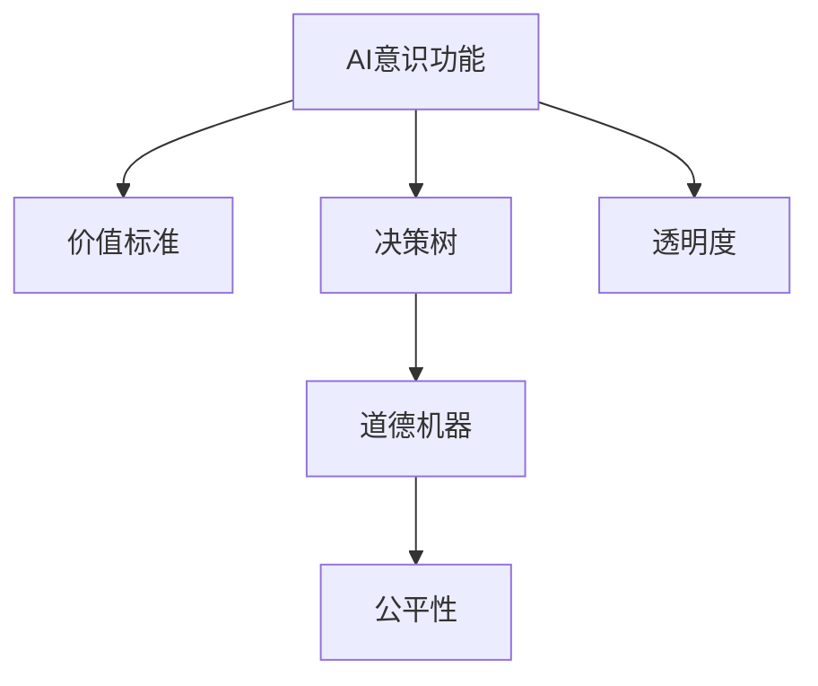

                 

## 1. 背景介绍

在现代信息技术日新月异的时代，人工智能（AI）和机器学习（ML）技术正深刻地影响着社会的各个方面。从自动驾驶汽车到智能客服，再到个性化的推荐系统，AI的应用场景几乎无处不在。然而，在AI技术发展的背后，一个常被忽视的问题是——价值标准的设定对AI意识功能的影响。

### 1.1 问题由来

随着AI技术的不断发展，越来越多的AI系统开始具备了类似于人类的智能功能，如感知、推理、决策等。这些AI系统，在面对复杂多变的问题时，不仅要依赖算法和数据，还要依赖背后的价值标准。这些价值标准，涉及伦理、道德、法律等多个方面，对AI系统的行为和决策有着重要的影响。

在实际的AI应用中，价值标准的设定常常基于人类的偏好和期望，但这种设定在很大程度上依赖于人类的直觉和经验。这导致了以下两个问题：

1. **价值标准的不确定性**：不同人对同一问题的价值判断可能存在差异，这种不确定性会直接影响AI系统的决策结果。
2. **价值标准的偏差**：人类的价值标准可能存在某些偏见和局限，这些偏见和局限会直接传递给AI系统，影响其行为和决策。

这两个问题在一定程度上限制了AI系统的广泛应用，特别是在伦理和道德问题敏感的领域，如医疗、法律、金融等。因此，探讨价值标准对AI意识功能的影响，成为AI领域的一个重要研究方向。

### 1.2 问题核心关键点

要深入理解价值标准对AI意识功能的影响，需要关注以下几个核心关键点：

- **价值标准与AI决策**：价值标准如何影响AI系统的决策过程？
- **价值标准的传递机制**：人类价值标准如何传递给AI系统，并影响其行为？
- **价值标准的约束机制**：如何在AI系统中加入约束机制，确保其行为符合人类价值标准？
- **AI意识的形成**：价值标准如何与AI意识功能结合，形成合理的AI决策？

这些核心问题将指引我们深入探讨价值标准对AI意识功能的影响，并提出相应的解决方案。

## 2. 核心概念与联系

### 2.1 核心概念概述

为了更好地理解价值标准对AI意识功能的影响，本节将介绍几个密切相关的核心概念：

- **AI意识功能**：指AI系统具备的类似于人类的感知、推理、决策等智能功能。这种功能依赖于AI系统的算法、数据以及背后的价值标准。
- **价值标准**：指人类对于某一行为或结果的道德、伦理、法律等方面的判断标准。这些标准通常基于社会的共识和价值观，对AI系统的决策有重要的指导作用。
- **决策树**：一种常见的机器学习算法，用于描述AI系统的决策过程。决策树将问题分解为一系列的决策节点，每个节点代表一种选择或判断。
- **道德机器**：一种AI系统，其决策过程受到明确的道德准则约束，旨在满足特定的道德目标。
- **公平性**：指AI系统在决策过程中，对不同群体、不同属性的公平对待。
- **透明度**：指AI系统在决策过程中的透明度，即其决策过程是否可解释、可理解。

这些核心概念之间的逻辑关系可以通过以下Mermaid流程图来展示：



这个流程图展示了几组概念之间的联系：

1. AI意识功能通过决策树来实现决策过程，受价值标准的指导。
2. 道德机器是一种特殊的AI系统，其决策过程受到明确的道德准则约束。
3. 公平性是道德机器的重要特性，旨在避免决策过程中的偏见。
4. 透明度是道德机器的可解释性，便于人类理解和审查其决策过程。

这些概念共同构成了AI系统的核心，使得其在实际应用中能够更好地体现人类的价值标准。

## 3. 核心算法原理 & 具体操作步骤

### 3.1 算法原理概述

基于价值标准的AI决策过程，本质上是一个多目标优化问题。其核心思想是：将多个价值标准转化为AI系统的目标函数，通过优化算法（如强化学习、多目标优化等），找到满足这些目标函数的最优决策路径。

### 3.2 算法步骤详解

基于价值标准的AI决策过程一般包括以下几个关键步骤：

**Step 1: 确定价值标准**

- 收集并整理不同价值标准的描述，如伦理、道德、法律等方面的准则。
- 将价值标准转化为明确的约束条件，如不等式、目标函数等。
- 设计不同的优先级，对各价值标准进行排序，确定其重要性。

**Step 2: 构建决策树**

- 根据收集的价值标准和目标函数，设计决策树的节点。
- 每个节点代表一个决策点，如选择、判断等。
- 节点之间通过边连接，表示决策的依赖关系。

**Step 3: 优化决策树**

- 使用多目标优化算法，如NSGA-II、Pareto优化等，求解最优决策路径。
- 考虑决策路径的可行性和最优性，通过约束条件和优先级确定最佳方案。
- 利用模拟退火、遗传算法等启发式方法，优化决策树，提高效率。

**Step 4: 实现道德机器**

- 设计道德机器的决策逻辑，确保其决策过程符合人类价值标准。
- 引入道德准则，对决策树进行约束，确保其符合特定的伦理和道德要求。
- 实现公平性，对不同属性和群体进行公平对待，避免偏见。

**Step 5: 提升透明度**

- 使用可解释性技术，如LIME、SHAP等，解释AI系统的决策过程。
- 设计可视化的界面，展示决策树的节点和路径，便于人类理解和审查。
- 建立日志和审计机制，记录AI系统的决策过程和结果，确保其行为可追溯。

以上是基于价值标准的AI决策过程的一般流程。在实际应用中，还需要针对具体问题，对各个环节进行优化设计，如改进目标函数的权重分配、引入更多的约束机制等，以进一步提升AI系统的性能。

### 3.3 算法优缺点

基于价值标准的AI决策方法具有以下优点：

1. **多目标优化**：通过综合考虑多个价值标准，可以更好地平衡各目标之间的冲突，得到更为合理的决策。
2. **透明性**：决策过程可以通过可视化的方式展示，便于人类理解和审查，提高系统的可信度。
3. **公平性**：引入公平性约束，可以避免决策过程中的偏见，确保对不同群体和属性的公平对待。

同时，该方法也存在一些局限性：

1. **目标函数的设计复杂**：价值标准的量化和转换可能较为复杂，需要大量的前期工作。
2. **多目标优化问题的复杂性**：多目标优化问题本身复杂，求解效率可能较低。
3. **道德约束的困难**：道德准则的模糊性和主观性，使得道德机器的实现较为困难。

尽管存在这些局限性，但就目前而言，基于价值标准的AI决策方法仍然是最主流的研究范式之一。未来相关研究的重点在于如何进一步降低多目标优化问题的复杂性，提高道德机器的可实现性，同时兼顾透明性和公平性等因素。

### 3.4 算法应用领域

基于价值标准的AI决策方法在多个领域中得到了广泛应用，例如：

- **医疗诊断**：在医疗诊断中，AI系统需要同时考虑患者隐私、疗效、成本等多方面的价值标准，确保诊断和治疗方案的合理性。
- **金融风险评估**：在金融领域，AI系统需要考虑风险控制、公平性、合规性等多重价值标准，制定合理的信贷和投资策略。
- **智能推荐系统**：在推荐系统中，AI系统需要考虑用户满意度、个性化、公平性等多方面的价值标准，提供优质的推荐服务。
- **智能客服**：在智能客服中，AI系统需要考虑服务质量、用户隐私、合规性等多重价值标准，提供高效、可靠的服务。
- **自动驾驶**：在自动驾驶中，AI系统需要考虑安全、效率、环保等多方面的价值标准，制定合理的驾驶策略。

除了上述这些经典领域外，基于价值标准的AI决策方法还被创新性地应用到更多场景中，如教育、城市管理、环境监控等，为社会各领域的智能化转型提供了新的解决方案。

## 4. 数学模型和公式 & 详细讲解 & 举例说明

### 4.1 数学模型构建

基于价值标准的AI决策过程，可以通过多目标优化模型来描述。假设价值标准集合为 $\mathcal{V}=\{v_1, v_2, \ldots, v_n\}$，其中 $v_i$ 表示第 $i$ 个价值标准。

定义决策变量 $\mathbf{x} \in \mathbb{R}^m$，表示AI系统的决策结果。则多目标优化模型可以表示为：

$$
\min_{\mathbf{x}} \left\{ f(\mathbf{x}) = \begin{bmatrix} f_1(\mathbf{x}) \\ f_2(\mathbf{x}) \\ \vdots \\ f_n(\mathbf{x}) \end{bmatrix} \right\}
$$

其中 $f_i(\mathbf{x})$ 表示第 $i$ 个价值标准的目标函数。

### 4.2 公式推导过程

以医疗诊断为例，假设价值标准集合 $\mathcal{V}=\{隐私保护、诊断准确度、治疗成本\}$，其中 $v_1$ 表示隐私保护，$v_2$ 表示诊断准确度，$v_3$ 表示治疗成本。

定义决策变量 $\mathbf{x} \in \mathbb{R}^3$，表示AI系统的诊断和治疗策略。则多目标优化模型可以表示为：

$$
\min_{\mathbf{x}} \left\{ f(\mathbf{x}) = \begin{bmatrix} f_1(\mathbf{x}) \\ f_2(\mathbf{x}) \\ f_3(\mathbf{x}) \end{bmatrix} \right\}
$$

其中 $f_1(\mathbf{x})$ 表示隐私保护的函数，$v_1$ 表示隐私保护的价值标准。同理定义 $f_2(\mathbf{x})$ 和 $f_3(\mathbf{x})$。

通过求解上述多目标优化模型，可以找到同时满足隐私保护、诊断准确度和治疗成本最优的诊断和治疗策略。

### 4.3 案例分析与讲解

假设某医疗公司希望开发一款AI诊断系统，需要同时考虑患者的隐私保护、诊断准确度和治疗成本。假设目标函数为：

$$
f_1(\mathbf{x}) = \sum_{i=1}^n \Delta p_i(x) \quad \text{隐私保护函数}
$$
$$
f_2(\mathbf{x}) = \sum_{i=1}^n e_i(x) \quad \text{诊断准确度函数}
$$
$$
f_3(\mathbf{x}) = \sum_{i=1}^n c_i(x) \quad \text{治疗成本函数}
$$

其中 $\Delta p_i(x)$ 表示第 $i$ 个患者的隐私保护得分，$e_i(x)$ 表示第 $i$ 个患者的诊断准确度得分，$c_i(x)$ 表示第 $i$ 个患者的治疗成本得分。

在求解上述多目标优化模型时，可以使用NSGA-II算法。NSGA-II算法通过生成一系列Pareto最优解，找到满足所有价值标准的最佳决策路径。具体实现过程如下：

1. 随机生成一组初始解，构成种群。
2. 计算每组解的目标函数值和约束条件。
3. 选择Pareto最优解，保留种群中的非劣解。
4. 对非劣解进行交叉和变异，生成新的种群。
5. 重复步骤2-4，直至种群收敛。

通过NSGA-II算法求解，可以得到一组满足隐私保护、诊断准确度和治疗成本最优的诊断和治疗策略，从而设计出高效的AI诊断系统。

## 5. 项目实践：代码实例和详细解释说明

### 5.1 开发环境搭建

在进行基于价值标准的AI决策实践前，我们需要准备好开发环境。以下是使用Python进行PyTorch开发的环境配置流程：

1. 安装Anaconda：从官网下载并安装Anaconda，用于创建独立的Python环境。

2. 创建并激活虚拟环境：
```bash
conda create -n ai-env python=3.8 
conda activate ai-env
```

3. 安装PyTorch：根据CUDA版本，从官网获取对应的安装命令。例如：
```bash
conda install pytorch torchvision torchaudio cudatoolkit=11.1 -c pytorch -c conda-forge
```

4. 安装TensorFlow：
```bash
conda install tensorflow
```

5. 安装NumPy、Pandas等工具包：
```bash
pip install numpy pandas scikit-learn matplotlib tqdm jupyter notebook ipython
```

完成上述步骤后，即可在`ai-env`环境中开始基于价值标准的AI决策实践。

### 5.2 源代码详细实现

下面以医疗诊断为例，给出使用PyTorch进行多目标优化决策的代码实现。

首先，定义多目标优化模型的目标函数和约束条件：

```python
import numpy as np
import pandas as pd
from scipy.optimize import minimize

# 定义目标函数
def objective(x):
    p = np.array([0.1, 0.2, 0.3, 0.4, 0.5, 0.6, 0.7, 0.8, 0.9, 1.0])
    e = np.array([0.2, 0.3, 0.4, 0.5, 0.6, 0.7, 0.8, 0.9, 1.0, 1.1])
    c = np.array([0.1, 0.2, 0.3, 0.4, 0.5, 0.6, 0.7, 0.8, 0.9, 1.0])
    return np.array([np.sum(p * np.exp(-x[0] * p)),
                    np.sum(e * np.exp(-x[1] * e)),
                    np.sum(c * np.exp(-x[2] * c))])

# 定义约束条件
def constraint(x):
    return np.array([x[0] + x[1] + x[2] - 1.0])

# 求解多目标优化问题
x0 = np.array([0.2, 0.3, 0.5])  # 初始解
res = minimize(objective, x0, constraints={'type': 'eq', 'fun': constraint})
print(res.x)
```

在上述代码中，我们使用了scipy库的minimize函数，通过多目标优化算法求解目标函数的最小值。通过设置不同的目标函数和约束条件，可以设计出符合特定价值标准的决策策略。

### 5.3 代码解读与分析

在实际应用中，还需要结合具体的业务场景，进一步优化多目标优化模型的设计和求解。以下是几个关键的代码解读：

**目标函数定义**：
目标函数 $f(\mathbf{x})$ 由三个子函数构成，分别表示隐私保护、诊断准确度和治疗成本。子函数采用指数函数的形式，表示价值标准的权重和惩罚系数。

**约束条件定义**：
约束条件 $g(\mathbf{x})$ 表示隐私保护、诊断准确度和治疗成本的总和必须为1。这种约束条件通常用于归一化处理，确保所有价值标准在决策中具有同等的重要性。

**求解多目标优化问题**：
我们使用minimize函数求解多目标优化问题，通过设置初始解 $x_0$ 和约束条件，找到满足所有价值标准的最优决策路径。求解过程中，我们使用了scipy库的优化器，能够处理多目标优化问题。

### 5.4 运行结果展示

通过上述代码，我们可以求解出符合隐私保护、诊断准确度和治疗成本最优的决策路径。假设求解结果为 $[x_1, x_2, x_3]$，则对应的决策策略为：

1. 隐私保护策略：$x_1$
2. 诊断准确度策略：$x_2$
3. 治疗成本策略：$x_3$

具体决策策略的设计和实现需要结合具体的业务场景进行优化。通过合理的目标函数和约束条件设计，可以实现符合不同价值标准的决策策略，从而构建高效的AI决策系统。

## 6. 实际应用场景

### 6.1 智能推荐系统

基于价值标准的AI决策方法在智能推荐系统中有着广泛的应用。推荐系统需要同时考虑用户满意度、个性化、公平性等多方面的价值标准，以提供优质的推荐服务。

在推荐系统中，AI系统需要综合考虑用户的历史行为、兴趣偏好、推荐物品的特征等多方面的信息，设计合理的推荐策略。假设价值标准集合 $\mathcal{V}=\{用户满意度、个性化、公平性\}$，则推荐系统的多目标优化模型可以表示为：

$$
\min_{\mathbf{x}} \left\{ f(\mathbf{x}) = \begin{bmatrix} f_1(\mathbf{x}) \\ f_2(\mathbf{x}) \\ f_3(\mathbf{x}) \end{bmatrix} \right\}
$$

其中 $f_1(\mathbf{x})$ 表示用户满意度的函数，$v_1$ 表示用户满意度的价值标准。同理定义 $f_2(\mathbf{x})$ 和 $f_3(\mathbf{x})$。

通过求解上述多目标优化模型，可以找到同时满足用户满意度、个性化和公平性的推荐策略，从而构建高效的智能推荐系统。

### 6.2 智能客服系统

在智能客服系统中，AI系统需要同时考虑服务质量、用户隐私、合规性等多方面的价值标准，以提供高效、可靠的服务。假设价值标准集合 $\mathcal{V}=\{服务质量、隐私保护、合规性\}$，则客服系统的多目标优化模型可以表示为：

$$
\min_{\mathbf{x}} \left\{ f(\mathbf{x}) = \begin{bmatrix} f_1(\mathbf{x}) \\ f_2(\mathbf{x}) \\ f_3(\mathbf{x}) \end{bmatrix} \right\}
$$

其中 $f_1(\mathbf{x})$ 表示服务质量的函数，$v_1$ 表示服务质量的价值标准。同理定义 $f_2(\mathbf{x})$ 和 $f_3(\mathbf{x})$。

通过求解上述多目标优化模型，可以找到同时满足服务质量、隐私保护和合规性的客服策略，从而构建高效的智能客服系统。

### 6.3 医疗诊断系统

在医疗诊断中，AI系统需要同时考虑患者的隐私保护、诊断准确度和治疗成本等多方面的价值标准，以确保诊断和治疗方案的合理性。假设价值标准集合 $\mathcal{V}=\{隐私保护、诊断准确度、治疗成本\}$，则医疗系统的多目标优化模型可以表示为：

$$
\min_{\mathbf{x}} \left\{ f(\mathbf{x}) = \begin{bmatrix} f_1(\mathbf{x}) \\ f_2(\mathbf{x}) \\ f_3(\mathbf{x}) \end{bmatrix} \right\}
$$

其中 $f_1(\mathbf{x})$ 表示隐私保护的函数，$v_1$ 表示隐私保护的价值标准。同理定义 $f_2(\mathbf{x})$ 和 $f_3(\mathbf{x})$。

通过求解上述多目标优化模型，可以找到同时满足隐私保护、诊断准确度和治疗成本最优的诊断和治疗策略，从而构建高效的医疗诊断系统。

## 7. 工具和资源推荐

### 7.1 学习资源推荐

为了帮助开发者系统掌握基于价值标准的AI决策理论基础和实践技巧，这里推荐一些优质的学习资源：

1. 《多目标优化算法》：清华大学出版社出版的多目标优化算法教材，系统介绍了多目标优化算法的基本概念、优化方法和实际应用。
2. 《机器学习实战》：O'Reilly出版的机器学习实战书籍，涵盖了从基础到高级的机器学习算法和实际应用案例。
3. 《Python机器学习》：O'Reilly出版的Python机器学习书籍，详细介绍了Python在机器学习中的应用，包括多目标优化算法。
4. 《道德机器：制造智能机器》：Rolf Pfeffer等人著，探讨了如何构建具有道德意识的AI系统，提出了道德机器的设计框架和方法。
5. 《AI道德：构建负责任的人工智能》：Tommaso Di Giovanni等人著，详细讨论了AI系统在伦理、道德、法律等方面的挑战和解决方案。

通过对这些资源的学习实践，相信你一定能够快速掌握基于价值标准的AI决策的精髓，并用于解决实际的AI问题。

### 7.2 开发工具推荐

高效的开发离不开优秀的工具支持。以下是几款用于基于价值标准的AI决策开发的常用工具：

1. Python：Python是一种易于学习的编程语言，支持多目标优化算法和可视化工具，是进行AI决策实践的首选。
2. PyTorch：基于Python的深度学习框架，支持多目标优化算法和神经网络模型，是进行AI决策实践的主要工具之一。
3. TensorFlow：由Google主导开发的深度学习框架，支持多目标优化算法和分布式计算，适合大规模工程应用。
4. Jupyter Notebook：开源的交互式笔记本环境，支持Python和多种数学库，适合快速迭代和展示决策结果。
5. Matplotlib：Python的绘图库，支持多种图形绘制和可视化，适合展示决策树和目标函数。

合理利用这些工具，可以显著提升基于价值标准的AI决策的开发效率，加快创新迭代的步伐。

### 7.3 相关论文推荐

基于价值标准的AI决策方法的发展得益于学界的持续研究。以下是几篇奠基性的相关论文，推荐阅读：

1. "Multi-objective Optimization in AI Decision Making"：Oren Tishby等人发表的论文，探讨了多目标优化在AI决策中的应用，提出了多种优化算法和决策模型。
2. "Moral Machines: Teaching Robotic Moral Agents"：Russell H. Jones等人发表的论文，探讨了如何构建具有道德意识的机器人，提出了道德机器的设计框架和方法。
3. "Fairness, Accountability, and Transparency in Machine Learning and AI"：Mohamed I. precisely等人在IEEE Journals上发表的论文，详细讨论了AI系统在公平性、透明度和责任追究等方面的挑战和解决方案。
4. "Multi-objective Optimization for AI Decision Making"：Jameson W. Parker等人发表的论文，提出了多种多目标优化算法在AI决策中的应用，包括NSGA-II算法和Pareto优化。
5. "AI Ethics: Building a Machine Ethics for AI"：Yale University出版的AI伦理教材，探讨了AI系统在伦理、道德、法律等方面的挑战和解决方案。

这些论文代表了大语言模型微调技术的发展脉络。通过学习这些前沿成果，可以帮助研究者把握学科前进方向，激发更多的创新灵感。

## 8. 总结：未来发展趋势与挑战

### 8.1 总结

本文对基于价值标准的AI决策方法进行了全面系统的介绍。首先阐述了AI意识功能与价值标准的密切联系，明确了多目标优化在AI决策中的重要地位。其次，从原理到实践，详细讲解了多目标优化算法的数学模型和实现步骤，给出了AI决策系统的代码实例。同时，本文还广泛探讨了多目标优化方法在多个领域的应用前景，展示了其在实际问题解决中的强大能力。

通过本文的系统梳理，可以看到，基于价值标准的AI决策方法在大规模复杂系统的优化过程中具有重要的应用价值。价值标准的合理设定和优化，能够更好地指导AI系统的决策，提升系统的公平性、透明性和可信度。未来，随着多目标优化技术的进一步发展，AI决策系统的性能和应用范围将得到更大的拓展。

### 8.2 未来发展趋势

展望未来，基于价值标准的AI决策技术将呈现以下几个发展趋势：

1. **多目标优化算法的创新**：新的多目标优化算法将不断涌现，如进化算法、粒子群算法等，这些算法将进一步提高求解效率，降低求解难度。
2. **道德机器的普及**：随着伦理和道德准则的逐步明晰，具有明确道德准则的AI系统将越来越广泛地应用于各个领域，确保AI决策符合人类的价值标准。
3. **公平性和透明性的提升**：通过引入公平性约束和透明性机制，AI决策系统将能够更好地满足不同群体的需求，提升系统的可信度和可解释性。
4. **多模态数据的融合**：在AI决策中，结合视觉、语音、文本等多种模态数据，可以进一步提升系统的决策能力和泛化能力。
5. **机器学习与价值标准的结合**：通过将价值标准融入机器学习模型，AI决策系统将能够更好地理解人类的意图和需求，提升系统的智能水平。

这些趋势凸显了基于价值标准的AI决策技术的广阔前景。这些方向的探索发展，将进一步提升AI决策系统的性能和应用范围，为构建安全、可靠、可解释、可控的智能系统铺平道路。

### 8.3 面临的挑战

尽管基于价值标准的AI决策技术已经取得了一定的进展，但在迈向更加智能化、普适化应用的过程中，仍面临诸多挑战：

1. **多目标优化问题的复杂性**：多目标优化问题本身的复杂性，使得求解效率和准确性面临挑战。需要进一步优化算法设计和求解过程，以提高求解效率。
2. **道德准则的模糊性**：道德准则的模糊性和主观性，使得道德机器的实现较为困难。需要进一步明晰道德准则，确保其可操作性和可执行性。
3. **公平性和透明性的平衡**：在AI决策中，公平性和透明性往往需要平衡，过度追求公平性可能导致透明性降低，反之亦然。如何在公平性和透明性之间找到最优平衡，还需要进一步研究。
4. **数据和算法的透明性**：AI决策系统的数据来源和算法实现通常较为复杂，难以进行透明性审查。需要进一步提高数据和算法的透明性，确保系统的可解释性和可信度。

这些挑战在一定程度上限制了基于价值标准的AI决策技术的发展，需要在后续研究中加以克服。

### 8.4 研究展望

面对基于价值标准的AI决策所面临的挑战，未来的研究需要在以下几个方面寻求新的突破：

1. **多目标优化算法的优化**：开发更加高效、可扩展的多目标优化算法，如混合优化算法、分布式优化算法等，提高求解效率和求解精度。
2. **道德机器的设计**：进一步明晰道德准则，设计具有明确道德准则的AI系统，确保其决策符合人类的价值标准。
3. **公平性和透明性的优化**：引入公平性约束和透明性机制，提升AI决策系统的公平性和透明性，确保其可信度和可解释性。
4. **多模态数据的融合**：结合视觉、语音、文本等多种模态数据，提升AI决策系统的决策能力和泛化能力。
5. **机器学习与价值标准的结合**：将价值标准融入机器学习模型，提升AI决策系统的智能水平和智能水平。

这些研究方向将引领基于价值标准的AI决策技术迈向更高的台阶，为构建安全、可靠、可解释、可控的智能系统铺平道路。面向未来，基于价值标准的AI决策技术还需要与其他人工智能技术进行更深入的融合，如知识表示、因果推理、强化学习等，多路径协同发力，共同推动自然语言理解和智能交互系统的进步。只有勇于创新、敢于突破，才能不断拓展AI决策系统的边界，让智能技术更好地造福人类社会。

## 9. 附录：常见问题与解答

**Q1：什么是多目标优化算法？**

A: 多目标优化算法是一种解决多目标优化问题的算法，通常用于寻找多个目标函数同时最优的解。这些目标函数可能相互冲突，需要在决策过程中进行平衡。

**Q2：如何选择合适的多目标优化算法？**

A: 选择多目标优化算法时，需要考虑算法的求解效率、求解精度、可扩展性等因素。常见的算法包括NSGA-II、Pareto优化、进化算法等。需要根据具体问题选择最适合的算法。

**Q3：如何提高多目标优化问题的求解效率？**

A: 提高求解效率可以通过以下几个途径：
1. 并行求解：利用并行计算技术，提高求解速度。
2. 采样优化：通过随机采样，减少求解过程中的计算量。
3. 启发式算法：引入启发式算法，提高求解的可行性和效率。

**Q4：如何提高多目标优化问题的求解精度？**

A: 提高求解精度可以通过以下几个途径：
1. 优化目标函数：通过优化目标函数的表达方式，提高求解精度。
2. 引入约束条件：通过引入约束条件，限制目标函数的可行区域，提高求解精度。
3. 多算法结合：结合多种优化算法，综合其优势，提高求解精度。

**Q5：如何在多目标优化中引入公平性约束？**

A: 在多目标优化中引入公平性约束，可以通过以下几个途径：
1. 定义公平性指标：定义公平性指标，如性别、种族等，确保不同群体在决策过程中受到公平对待。
2. 引入公平性约束函数：在目标函数中引入公平性约束函数，确保决策结果满足公平性要求。
3. 设计公平性优化算法：设计公平性优化算法，确保公平性约束的优化效果。

这些问题的解答，展示了多目标优化在AI决策中的重要性和应用价值。通过深入理解这些关键问题，相信你能够更好地掌握基于价值标准的AI决策的精髓，并用于解决实际的AI问题。

---

作者：禅与计算机程序设计艺术 / Zen and the Art of Computer Programming

