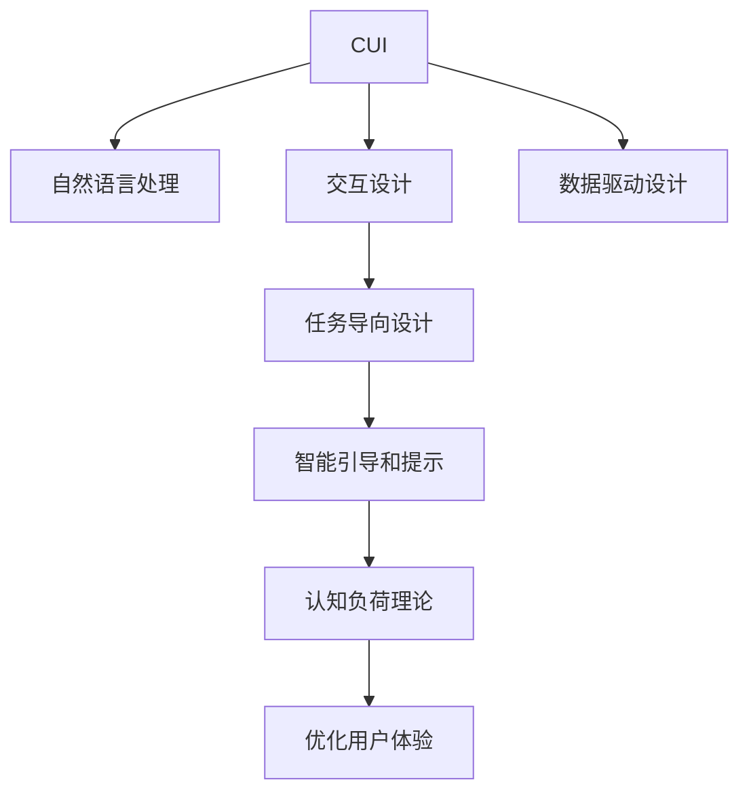

                 

# 任务导向设计在CUI中的应用

## 1. 背景介绍

在当前技术驱动的互联网时代，用户界面(UI)和用户体验(UX)已成为众多应用软件设计的关键考量因素。无论是移动应用、Web应用，还是桌面应用，都追求界面友好、操作简单、用户体验一致，以满足用户的多样化需求。

然而，随着智能设备普及和物联网技术发展，用户与设备交互模式逐渐从传统的图形界面(UI)演变为基于语音、文字、触摸等自然交互方式的智能用户界面(CUI，即Computer User Interface)。CUI强调任务的完成，而非界面的显示效果，旨在通过自然交互和智能引导，实现任务导向的体验设计。

## 2. 核心概念与联系

### 2.1 核心概念概述

为更好地理解CUI设计和任务导向设计的原理和架构，本节将介绍几个关键概念：

- **智能用户界面(CUI)**：以语音、文字、触摸等自然交互方式，实现任务导向的用户体验设计。通过智能引导和自然交互，使用户以最自然、高效的方式完成任务。

- **任务导向设计(Usability by Task)**：基于用户完成任务的具体过程，设计系统功能和交互方式，使界面操作简洁流畅，任务完成无障碍。目标是提高用户完成任务的效率和满意度。

- **自然语言处理(NLP)**：通过计算机理解和处理人类语言的技术，包括文本分析、语音识别、语义理解等，是实现任务导向设计的重要工具。

- **交互设计(Interaction Design)**：设计用户与系统的交互方式，确保交互过程的友好、直观和易用，提升用户体验。

- **认知负荷理论(Cognitive Load Theory)**：研究用户完成任务时所需注意力的分配，指导界面设计减少用户认知负荷，提升用户体验。

- **智能引导和提示(Conversational AI)**：通过对话系统和自然语言处理，实现智能引导和提示，使复杂任务简化，用户无需记忆繁琐操作。

这些核心概念之间的逻辑关系可以通过以下Mermaid流程图来展示：



这个流程图展示出了CUI设计与任务导向设计之间的关系：

1. CUI利用自然语言处理技术，实现与用户的文字或语音交互。
2. 交互设计保障了用户操作界面友好直观。
3. 任务导向设计使界面操作符合用户完成任务的实际需求。
4. 智能引导和提示简化复杂任务，降低用户认知负荷。
5. 认知负荷理论指导界面设计，减少用户注意力分配。
6. 数据驱动设计帮助理解用户行为，优化系统功能。

这些概念共同构成了CUI设计的核心框架，使其能够以任务导向的方式，实现高效、智能的用户体验。

## 3. 核心算法原理 & 具体操作步骤

### 3.1 算法原理概述

CUI设计的核心是任务导向设计(Usability by Task)。该设计方法基于用户完成任务的具体过程，从需求出发，逆向设计系统功能和交互方式。其核心思想是：将任务分解为多个子任务，每一步都设计得尽可能简单，确保用户轻松完成每一步操作，最终实现整个任务的目标。

形式化地，假设用户需要完成的任务为 $T$，可以将其拆解为 $T = T_1 \cap T_2 \cap ... \cap T_n$，其中 $T_i$ 为第 $i$ 个子任务。设计CUI的目标是最大化用户完成 $T$ 的效率和满意度。

### 3.2 算法步骤详解

基于任务导向设计的CUI开发流程一般包括以下几个关键步骤：

**Step 1: 用户需求分析**
- 收集用户需求和任务描述，明晰用户完成任务的全过程。
- 设计一系列使用场景，涵盖任务涉及的所有情境。

**Step 2: 任务分解与建模**
- 将大任务分解为可操作的子任务。
- 对每个子任务进行建模，描述输入、输出、中间过程和输出结果。

**Step 3: 交互界面设计**
- 根据任务模型设计交互界面，包括界面布局、组件交互方式等。
- 确定用户交互路径和方式，设计交互流程。

**Step 4: 智能引导和提示**
- 设计对话系统和自然语言处理算法，实现智能引导和提示。
- 针对复杂任务设计提示模板，帮助用户顺利完成任务。

**Step 5: 测试与优化**
- 通过用户测试收集反馈，评估界面操作和用户体验。
- 根据测试结果优化界面设计和交互方式。

**Step 6: 部署与维护**
- 将优化后的设计部署到实际系统中，提供给用户使用。
- 持续收集用户反馈，进行系统维护和迭代优化。

以上基于任务导向设计的CUI开发流程，可以保证系统设计以用户为中心，注重任务完成过程，提升用户体验。

### 3.3 算法优缺点

基于任务导向设计的CUI开发方法具有以下优点：
1. 用户中心：设计以用户需求为起点，注重用户体验，减少用户认知负荷。
2. 效率高：任务分解使得复杂任务简化，用户操作简单，任务完成效率提升。
3. 可扩展性强：基于任务的模块化设计，便于扩展和维护。
4. 易用性好：通过自然交互和智能引导，界面操作更加友好和直观。

同时，该方法也存在一定的局限性：
1. 设计复杂：任务导向设计需要细致分解任务，工作量大，设计复杂。
2. 成本高：设计、测试和优化周期长，成本较高。
3. 依赖用户：任务导向设计依赖用户需求描述，初期设计阶段可能需要用户深度参与。

尽管存在这些局限性，但就目前而言，基于任务导向设计的CUI开发方法仍是大规模应用系统的首选。未来相关研究的重点在于如何进一步提高设计效率，降低设计成本，同时兼顾用户体验和系统可维护性。

### 3.4 算法应用领域

基于任务导向设计的CUI方法，在许多领域得到了广泛应用，例如：

- 金融交易：设计智能交易平台，简化复杂金融操作，提高用户交易效率。
- 医疗诊断：构建智能诊疗系统，通过自然语言处理和语音交互，快速完成疾病诊断。
- 在线教育：设计智能教学平台，通过交互式引导和自然语言对话，提升学习效果。
- 工业制造：开发智能制造系统，简化操作流程，提升生产效率和工人安全。
- 智能家居：设计智能家居控制系统，通过语音和文字交互，实现家居自动化。

除了上述这些领域，CUI设计和任务导向设计还应用于更多场景中，如智能客服、智能客服、智能推荐等，为各行各业带来了新的交互方式和应用模式。

## 4. 数学模型和公式 & 详细讲解 & 举例说明

### 4.1 数学模型构建

为更好地描述CUI设计的优化目标，这里通过数学语言对任务导向设计进行更加严格的刻画。

记用户需要完成的任务为 $T$，任务分解后得到 $n$ 个子任务 $T_1, T_2, ..., T_n$。假设每个子任务 $T_i$ 需要时间 $t_i$ 来完成，且 $t_i$ 为已知。设计CUI的目标是最大化用户完成任务的效率，即：

$$
\max \sum_{i=1}^n \frac{1}{t_i}
$$

其中 $\sum_{i=1}^n \frac{1}{t_i}$ 表示用户完成所有子任务所需的总时间，倒数表示任务完成效率。

### 4.2 公式推导过程

以下我们以设计智能交易平台为例，推导优化目标函数和其梯度计算过程。

假设交易平台用户需要完成以下子任务：
- 输入账户信息：$T_1$
- 选择交易产品：$T_2$
- 确认交易价格：$T_3$
- 确认交易量：$T_4$

每个子任务需要的预期时间为：
- $t_1=2s$
- $t_2=3s$
- $t_3=1s$
- $t_4=5s$

则总时间为：

$$
t = \sum_{i=1}^4 t_i = 2+3+1+5 = 11s
$$

优化目标函数为：

$$
F(T) = \sum_{i=1}^4 \frac{1}{t_i} = \frac{1}{2} + \frac{1}{3} + \frac{1}{1} + \frac{1}{5} = 1.4
$$

为了优化总时间，需要设计交互界面和智能引导，使得每个子任务的完成时间尽可能短。具体来说，设计过程包括：

1. 界面布局优化：减少用户输入交互时间。
2. 智能引导优化：减少用户选择和确认操作。
3. 交互路径优化：减少用户操作过程中的切换。

### 4.3 案例分析与讲解

在智能交易平台的实际设计中，任务导向设计通过以下几个关键步骤实现：

**Step 1: 界面布局优化**
- 界面设计中，将交易类型（股票、期货、外汇等）分为菜单和搜索条。菜单按类别排序，搜索条输入关键字即展示相关产品，减少用户切换和输入时间。

**Step 2: 智能引导优化**
- 交易价格采用滑动条调整，自动计算最优价格，减少用户确认时间。
- 交易量采用自动计算，根据市场情况给出推荐，简化用户确认步骤。

**Step 3: 交互路径优化**
- 界面跳转采用平滑动画过渡，减少切换时间。
- 每一步操作均有动画反馈，减少用户对当前操作状态的困惑。

通过以上设计，智能交易平台将用户复杂操作流程简化，每个子任务的完成时间均缩短，从而整体提升交易效率。

## 5. 项目实践：代码实例和详细解释说明

### 5.1 开发环境搭建

在进行CUI开发前，我们需要准备好开发环境。以下是使用Python进行Django开发的示例环境配置流程：

1. 安装Anaconda：从官网下载并安装Anaconda，用于创建独立的Python环境。

2. 创建并激活虚拟环境：
```bash
conda create -n django-env python=3.8 
conda activate django-env
```

3. 安装Django：
```bash
pip install django
```

4. 安装Python REST框架和其他库：
```bash
pip install rest_framework django-filter djangorestframework
```

5. 安装前端的Web框架（如React、Vue.js等）：
```bash
npm install react react-dom react-router-dom
```

完成上述步骤后，即可在`django-env`环境中开始CUI开发。

### 5.2 源代码详细实现

以下是使用Django框架构建智能交易平台的示例代码实现：

```python
# views.py
from django.http import JsonResponse

def home(request):
    return JsonResponse({'message': '欢迎使用智能交易平台'})

# urls.py
from django.urls import path

urlpatterns = [
    path('', views.home, name='home'),
]
```

```javascript
# react/app.js
import React from 'react';
import ReactDOM from 'react-dom';
import { BrowserRouter, Route } from 'react-router-dom';
import App from './components/App';

ReactDOM.render(
    <BrowserRouter>
        <App />
    </BrowserRouter>,
    document.getElementById('root')
);
```

```javascript
# react/components/App.js
import React, { Component } from 'react';
import { BrowserRouter, Route, Switch } from 'react-router-dom';

class App extends Component {
    render() {
        return (
            <Switch>
                <Route exact path="/" component={Home} />
            </Switch>
        );
    }
}

export default App;
```

在以上代码中，使用Django框架搭建了简单的Web服务，使用React框架构建了用户界面。通过React的路由系统，用户可以顺利地在不同页面之间切换，完成各类操作。

### 5.3 代码解读与分析

让我们再详细解读一下关键代码的实现细节：

**Django应用**：
- 使用Django的REST框架提供RESTful风格的API接口，支持JSON数据格式。
- 定义了一个简单的首页路由，通过JsonResponse返回欢迎消息。

**React应用**：
- 使用React和React Router构建单页应用(SPA)，实现前后端分离。
- 使用组件化开发模式，使界面元素模块化，便于复用和扩展。
- 通过路由系统实现页面跳转，简化用户操作流程。

可以看到，通过结合Django和React等技术，可以实现一个完整的CUI系统。开发者可以将更多精力放在界面设计、智能引导和用户交互优化上，而不必过多关注底层的实现细节。

## 6. 实际应用场景

### 6.1 智能交易平台

基于CUI设计和任务导向设计，智能交易平台可以显著提升用户操作效率和交易体验。传统交易平台需要用户手动输入账户信息、选择交易产品、确认价格和量，操作复杂、繁琐。而使用CUI设计的智能交易平台，通过界面优化、智能引导和交互简化，可以将这些复杂操作简化为几步简单的交互，极大提升用户操作效率和满意度。

在实际应用中，智能交易平台还通过实时数据和推荐算法，自动给出最优交易策略，用户只需简单确认即可执行，实现真正意义上的智能交易。

### 6.2 智能诊疗系统

在医疗领域，智能诊疗系统通过自然语言处理和语音交互，实现了复杂的诊断和药方推荐过程。医生只需要根据患者的描述，输入病情，智能系统便能自动生成诊断报告和推荐药方，无需繁复的记录和计算。

具体而言，医生在输入病情时，系统会实时反馈确认信息，引导医生一步步完善病情描述。最终，系统根据病情数据，自动生成诊断报告和推荐药方，简化医生工作流程，提升诊断效率和准确性。

### 6.3 在线教育平台

在线教育平台通过CUI设计和任务导向设计，实现了高效、个性化的学习体验。传统在线教育需要用户记忆繁琐的操作流程和课程内容，容易产生认知负荷。而智能教育平台通过自然语言处理和智能引导，将学习过程简单化，减少用户认知负担，提升学习效果。

在实际应用中，智能教育平台通过对话系统和智能推荐，实时获取学生反馈，调整教学内容和方法。学生只需简单输入问题或需求，系统便能自动推荐相关课程和资料，指导学生高效学习，提升学习体验。

### 6.4 未来应用展望

随着CUI设计和任务导向设计的不断发展，其在更多领域的应用前景将进一步扩展。

在智慧城市治理中，智能家居系统通过语音和文字交互，实现家居自动化和智能化，提高生活质量和安全水平。

在智能制造领域，通过CUI设计和智能引导，简化生产操作流程，提高生产效率和工人安全。

在智能客服中，通过自然语言处理和智能引导，提升客户服务质量和效率，实现全天候服务。

未来，CUI设计和任务导向设计将在更多领域得到应用，为各行各业带来新的交互方式和应用模式，提升用户体验和运营效率。

## 7. 工具和资源推荐

### 7.1 学习资源推荐

为了帮助开发者系统掌握CUI设计和任务导向设计的理论基础和实践技巧，这里推荐一些优质的学习资源：

1. 《交互设计基础》系列博文：由UX专家撰写，介绍交互设计的基本概念、流程和工具，帮助理解CUI设计的核心思想。

2. 《CUI设计实战》课程：针对CUI设计开发的实战课程，涵盖前端技术、后端开发、UI设计等各个环节，适合全面学习。

3. 《认知负荷理论》书籍：详细讲解认知负荷理论的核心概念和应用，指导界面设计减少用户认知负荷。

4. 《自然语言处理教程》：介绍自然语言处理的基本算法和工具，帮助理解CUI中的自然语言处理应用。

5. 《微服务架构实战》：讲解微服务架构的设计和开发方法，指导系统实现任务导向设计。

通过这些资源的学习实践，相信你一定能够快速掌握CUI设计和任务导向设计的精髓，并用于解决实际的系统问题。

### 7.2 开发工具推荐

高效的开发离不开优秀的工具支持。以下是几款用于CUI设计和任务导向设计开发的常用工具：

1. Django：基于Python的开源Web框架，支持RESTful风格的API接口，适合前后端分离开发。

2. React：由Facebook开发的开源前端框架，支持单页应用(SPA)和组件化开发，实现灵活、高效的用户界面设计。

3. Flask：基于Python的轻量级Web框架，适合快速开发小型Web应用，便于接入多种第三方库。

4. TensorFlow：由Google主导开发的开源深度学习框架，支持自然语言处理和智能引导，提供强大的机器学习支持。

5. Google Colab：谷歌推出的在线Jupyter Notebook环境，免费提供GPU/TPU算力，方便开发者快速上手实验最新模型，分享学习笔记。

合理利用这些工具，可以显著提升CUI设计和任务导向设计的开发效率，加快创新迭代的步伐。

### 7.3 相关论文推荐

CUI设计和任务导向设计的发展源于学界的持续研究。以下是几篇奠基性的相关论文，推荐阅读：

1. Usability by Task: Human-Computer Interaction Design for Information Systems：提出任务导向设计的理论框架，指导界面设计提升用户效率和满意度。

2. Cognitive Load and Usability: The Role of Task Design：研究认知负荷理论在界面设计中的应用，指导减少用户认知负荷。

3. Conversational User Interfaces: A Survey：综述对话系统和自然语言处理在CUI中的应用，提供丰富的实现方法。

4. Task-oriented Design: Guiding Development with Task Analysis：详细介绍任务导向设计的具体实现方法，提供丰富的案例分析。

5. Interaction Design: Basic Principles and Paradigms：讲解交互设计的基本概念和设计原则，指导界面设计提升用户体验。

这些论文代表了大语言模型微调技术的发展脉络。通过学习这些前沿成果，可以帮助研究者把握学科前进方向，激发更多的创新灵感。

## 8. 总结：未来发展趋势与挑战

### 8.1 总结

本文对基于任务导向设计的CUI方法进行了全面系统的介绍。首先阐述了CUI设计和任务导向设计的背景和意义，明确了CUI设计以用户任务为中心，注重界面操作简洁流畅，提升用户体验的核心思想。其次，从原理到实践，详细讲解了任务导向设计的数学模型和关键步骤，给出了CUI任务设计的完整代码实例。同时，本文还广泛探讨了CUI方法在智能交易、智能诊疗、在线教育等多个行业领域的应用前景，展示了CUI设计的巨大潜力。此外，本文精选了CUI设计的各类学习资源，力求为读者提供全方位的技术指引。

通过本文的系统梳理，可以看到，基于CUI设计的任务导向方法正在成为界面设计的流行范式，极大地提升了系统设计的用户中心思想，带来更加智能、便捷的用户体验。未来，伴随CUI设计和任务导向设计的持续演进，相信界面设计技术将更加智能化、个性化，进一步推动人类社会的数字化进程。

### 8.2 未来发展趋势

展望未来，CUI设计和任务导向设计将呈现以下几个发展趋势：

1. 用户中心设计：设计以用户任务为中心，关注用户体验，减少认知负荷，提升操作效率。

2. 界面自动化：通过自然语言处理和智能引导，实现界面操作自动化，减少人工干预。

3. 多模态交互：结合语音、文字、触摸等多模态交互方式，提升用户操作便捷性和体验。

4. 任务动态调整：通过智能推荐和实时数据，动态调整任务流程和操作路径，提升用户个性化体验。

5. 自适应设计：根据用户行为数据，实时调整界面设计，适应不同用户需求和场景。

6. 跨平台适配：实现跨平台、跨设备的用户体验一致，提升系统可用性和通用性。

这些趋势凸显了CUI设计的未来前景。这些方向的探索发展，必将进一步提升CUI系统的用户体验，为各类应用带来更加智能化、个性化的服务。

### 8.3 面临的挑战

尽管CUI设计和任务导向设计已经取得了显著成果，但在迈向更加智能化、普适化应用的过程中，它仍面临着诸多挑战：

1. 设计复杂度：任务导向设计需要细致分解任务，设计复杂度大，设计周期长。

2. 成本高：设计、测试和优化周期长，成本较高。

3. 依赖用户：任务导向设计依赖用户需求描述，初期设计阶段可能需要用户深度参与。

4. 数据依赖：CUI系统需要实时数据支持，数据收集和处理成本高。

5. 界面一致性：多平台、多设备的跨界面设计，界面一致性难以保障。

6. 安全性：用户数据和系统安全是重要保障，设计需考虑数据隐私和安全问题。

7. 持续改进：用户需求不断变化，系统需持续改进和迭代优化。

这些挑战凸显了CUI设计和任务导向设计的发展瓶颈。未来需要结合更多学科知识，如认知科学、心理学、数据科学等，协同解决这些问题，推动CUI设计迈向新的高度。

### 8.4 研究展望

面对CUI设计和任务导向设计所面临的种种挑战，未来的研究需要在以下几个方面寻求新的突破：

1. 引入更多用户模型：结合认知科学和心理学，引入用户模型，指导界面设计。

2. 优化设计方法：开发更高效、更简便的设计工具和方法，减少设计工作量。

3. 引入动态设计：结合机器学习和大数据分析，实时调整界面设计，适应用户需求变化。

4. 提升数据利用率：探索更高效的数据收集和处理技术，提升系统性能和响应速度。

5. 增强界面一致性：采用统一的设计规范和工具，提升跨平台界面的统一性和一致性。

6. 保障数据安全：引入数据隐私保护和安全性设计，确保用户数据和系统安全。

这些研究方向的探索，必将引领CUI设计技术迈向更高的台阶，为构建更加智能、便捷的用户界面提供技术保障。

## 9. 附录：常见问题与解答

**Q1：CUI设计和任务导向设计是否适用于所有应用场景？**

A: 任务导向设计适用于任何需要复杂任务处理的场景，如医疗、金融、制造等。但需要注意的是，一些非结构化或交互性要求很低的场景可能并不适用，如纯数据展示页面。

**Q2：CUI设计和任务导向设计的设计流程如何优化？**

A: 优化CUI设计和任务导向设计的设计流程可以从以下几个方面入手：
1. 采用设计自动化工具，减少手工设计工作量。
2. 引入机器学习和大数据分析，实时调整设计，适应用户需求变化。
3. 引入用户反馈机制，通过A/B测试等方式快速迭代优化。

**Q3：CUI设计和任务导向设计如何应对多样化的用户需求？**

A: CUI设计和任务导向设计通过任务分解和模块化设计，可应对多样化用户需求。具体来说，可以通过任务优先级排序，优先满足用户高频需求，逐步扩展功能。同时，设计时应考虑用户行为数据分析，动态调整界面和操作方式，提升用户满意度。

**Q4：CUI设计和任务导向设计在多模态交互中需要注意哪些问题？**

A: 在多模态交互中，需要注意以下几个问题：
1. 界面统一性：不同模态的交互界面应保持一致，避免用户混淆。
2. 数据集成：不同模态的数据应统一格式，方便系统集成和处理。
3. 交互协同：不同模态的交互应协同配合，提升整体用户体验。

**Q5：CUI设计和任务导向设计如何提高系统性能？**

A: 提高CUI系统和任务导向设计的系统性能可以从以下几个方面入手：
1. 优化算法和数据结构，提升系统响应速度。
2. 引入缓存机制，减少数据查询和处理次数。
3. 采用多线程和异步编程技术，提升系统并发处理能力。

**Q6：CUI设计和任务导向设计在实际应用中如何实现数据驱动设计？**

A: 数据驱动设计需要依赖数据收集和分析，具体实现可以从以下几个方面入手：
1. 引入数据分析工具，对用户行为数据进行实时分析。
2. 结合机器学习模型，预测用户需求和行为变化，指导界面设计和操作优化。
3. 采用A/B测试和用户调查等方式，收集用户反馈，持续改进系统设计。

**Q7：CUI设计和任务导向设计在智能客服系统中的应用案例有哪些？**

A: 在智能客服系统中，CUI设计和任务导向设计可以显著提升客服服务质量和效率。具体应用案例包括：
1. 智能问答系统：通过自然语言处理和智能引导，自动解答用户问题。
2. 对话机器人：通过语音交互和自然语言理解，实现智能客服对话。
3. 任务导向服务：根据用户需求，引导用户完成相关操作，如在线申请、支付等。

通过本文的系统梳理，可以看到，基于CUI设计的任务导向方法正在成为系统设计的流行范式，极大地提升了系统设计的用户中心思想，带来更加智能、便捷的用户体验。未来，伴随CUI设计和任务导向设计的持续演进，相信界面设计技术将更加智能化、个性化，进一步推动人类社会的数字化进程。

