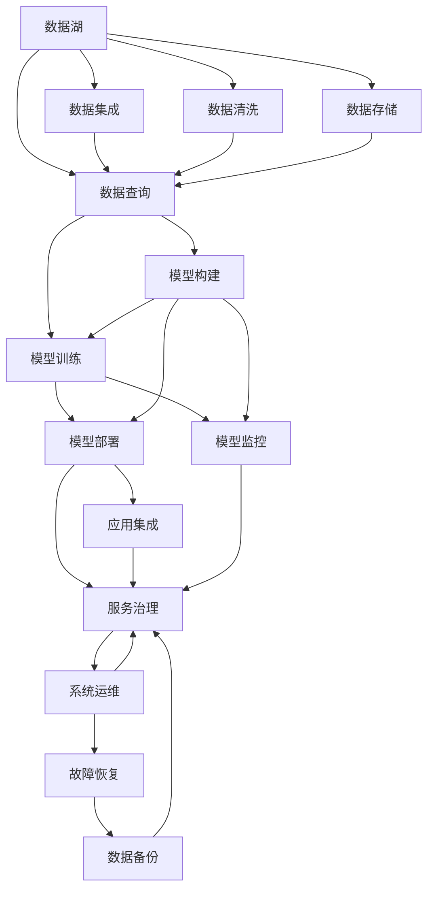

                 

# 企业AI中台建设：Lepton AI的架构设计

> 关键词：企业AI, AI中台, 微服务架构, Lepton AI, 数据湖, 模型治理, DevOps, 自动化, 持续集成, 持续部署

## 1. 背景介绍

### 1.1 问题由来
在数字化转型的浪潮中，越来越多的企业开始重视AI技术的应用，希望能够通过AI技术提升运营效率、降低成本、创造新的价值。然而，AI技术的引入往往涉及到数据集成、模型构建、模型训练、模型部署等多个环节，企业面临诸如数据资源分散、模型管理复杂、技术栈多样、开发效率低、维护成本高等问题，亟需一种高效、可扩展、易于维护的AI技术解决方案。

### 1.2 问题核心关键点
AI中台作为一种企业级AI技术解决方案，通过将数据、模型、算法、工程、运维等关键资源集中管理和调度，为业务部门提供一站式的AI技术支持。然而，AI中台的建设并非易事，需要考虑到数据资源整合、技术栈兼容性、工程效率提升、模型治理、运维自动化等多个方面。本文将介绍Lepton AI平台在AI中台建设中的架构设计，并结合具体案例，探讨其在企业AI建设中的应用。

## 2. 核心概念与联系

### 2.1 核心概念概述

为更好地理解Lepton AI的架构设计，本节将介绍几个密切相关的核心概念：

- **AI中台**：以业务导向为目标，整合企业内部和外部的AI资源，为企业提供便捷、高效、安全的AI技术服务和支持。
- **微服务架构**：将AI系统划分为多个功能模块，每个模块独立运行、易于扩展、能够快速响应市场需求变化。
- **数据湖**：一个集中式的数据存储系统，支持从不同源获取数据，并进行数据清洗、存储、管理和分析。
- **模型治理**：通过建立规范化的模型管理流程，确保模型的质量、安全、合规和可解释性。
- **DevOps**：将软件开发和运维的流程自动化，以缩短交付周期、提升工程效率、保障系统稳定性。
- **持续集成/持续部署(CI/CD)**：通过自动化工具和流程，实现软件从开发到交付的自动化，加速产品迭代和市场响应。
- **自动化**：利用自动化工具和流程，减少人工操作，提高工作效率，降低人为错误。

这些核心概念之间的逻辑关系可以通过以下Mermaid流程图来展示：



这个流程图展示了大数据、模型构建、模型训练、模型部署等多个环节之间的依赖关系：

1. 数据湖收集企业内外部的数据，并经过清洗和存储，形成统一的数据源。
2. 基于数据湖的数据，构建和训练模型。
3. 训练好的模型部署到应用中，实现业务功能的增强。
4. 部署后的模型需要监控，保证其稳定性和性能。
5. 模型部署和服务集成后，需要运维人员进行系统管理和故障恢复。

## 3. 核心算法原理 & 具体操作步骤
### 3.1 算法原理概述

Lepton AI平台的核心算法原理包括以下几个方面：

- **微服务架构**：通过将AI系统划分为多个独立的服务模块，每个服务模块负责特定的功能，如数据湖、模型构建、模型训练、模型部署等。这样的设计不仅提高了系统的灵活性和可扩展性，还方便了后续的技术升级和维护。
- **DevOps流水线**：利用CI/CD工具，自动化完成模型的构建、训练、测试、部署等环节，大大提高了开发和部署的效率，减少了人工操作带来的错误。
- **模型治理**：通过建立模型质量评估、版本管理、权限控制、模型审计等流程，确保模型从开发到应用的全生命周期内质量和安全。
- **数据湖**：采用大数据技术，构建集中式的数据存储系统，支持海量数据的高效存储、查询和分析，为企业AI应用提供坚实的数据基础。

### 3.2 算法步骤详解

Lepton AI平台的建设包括以下几个关键步骤：

**Step 1: 数据收集与整合**
- 建立数据湖，将企业内外部的数据源进行集中管理，包括业务数据、用户行为数据、外部公开数据等。
- 对数据进行清洗和预处理，去除重复、缺失和异常数据，确保数据的质量。

**Step 2: 数据存储与查询**
- 在数据湖中建立数据仓库，采用分布式存储技术，支持海量数据的存储和管理。
- 利用大数据工具如Hadoop、Spark等，实现高效的数据查询和分析。

**Step 3: 模型构建与训练**
- 构建微服务架构的模型构建和训练模块，利用TensorFlow、PyTorch等深度学习框架进行模型构建和训练。
- 引入预训练模型和迁移学习技术，提升模型的泛化能力和性能。

**Step 4: 模型部署与集成**
- 将训练好的模型部署到应用中，通过RESTful API、SDK等接口进行集成。
- 利用容器化技术如Docker、Kubernetes等，实现模型的自动部署和扩展。

**Step 5: 模型监控与运维**
- 建立模型监控系统，实时监控模型的运行状态和性能指标，及时发现和处理异常。
- 利用自动化运维工具，实现模型的自动备份、故障恢复、版本更新等操作。

### 3.3 算法优缺点

Lepton AI平台的优势在于其高度的可扩展性、灵活性和自动化程度：

1. **可扩展性**：微服务架构设计，使得Lepton AI平台可以灵活扩展，满足不同规模和类型的AI应用需求。
2. **灵活性**：基于DevOps流水线的自动化部署和运维，使得Lepton AI平台可以快速响应业务需求变化，提升企业对市场的敏捷性。
3. **自动化程度高**：通过自动化工具和流程，Lepton AI平台能够大幅提升工作效率，减少人为错误。

同时，Lepton AI平台也存在一些局限性：

1. **复杂度高**：构建和维护一个大规模的AI中台需要较高的技术门槛和资源投入。
2. **数据安全风险**：数据湖中存储了大量敏感数据，需要严格的权限控制和数据加密措施。
3. **技术栈多样**：支持多种技术栈的AI应用需要整合不同的开发工具和框架，增加了复杂性。

### 3.4 算法应用领域

Lepton AI平台已经在多个领域得到了广泛应用，包括但不限于：

- **金融科技**：利用AI技术进行风险评估、信用评分、客户服务优化等。
- **医疗健康**：利用AI技术进行疾病预测、诊疗建议、患者管理等。
- **智能制造**：利用AI技术进行设备预测性维护、生产过程优化、质量控制等。
- **零售电商**：利用AI技术进行商品推荐、客户行为分析、库存管理等。

## 4. 数学模型和公式 & 详细讲解 & 举例说明

### 4.1 数学模型构建

Lepton AI平台的数据湖和模型构建模块涉及到大量数学模型和算法。以下是几个关键的数学模型和公式：

**数据湖模型**：
- 采用分布式数据库技术，如Hadoop、Spark等，支持海量数据的存储和查询。
- 数据湖模型公式：
  $$
  \text{Data Lake Model} = \text{Distributed Database} + \text{Data Ingestion} + \text{Data Transformation} + \text{Data Storage} + \text{Data Query}
  $$

**模型构建模型**：
- 利用TensorFlow、PyTorch等深度学习框架进行模型构建和训练。
- 模型构建模型公式：
  $$
  \text{Model Construction Model} = \text{Feature Engineering} + \text{Model Selection} + \text{Model Training} + \text{Model Evaluation}
  $$

**模型部署模型**：
- 将训练好的模型部署到应用中，实现功能增强。
- 模型部署模型公式：
  $$
  \text{Model Deployment Model} = \text{Model Packing} + \text{API Integration} + \text{Containerization} + \text{Automated Deployment}
  $$

### 4.2 公式推导过程

以下我们将对数据湖模型、模型构建模型和模型部署模型的公式进行详细推导。

**数据湖模型推导**：
- 数据湖模型由多个子模型组成，每个子模型对应数据湖的一个功能模块。
- 数据湖模型公式推导：
  $$
  \text{Data Lake Model} = \text{Distributed Database} + \text{Data Ingestion} + \text{Data Transformation} + \text{Data Storage} + \text{Data Query}
  $$
  其中：
  - Distributed Database：分布式数据库技术，如Hadoop、Spark等，支持海量数据的存储和查询。
  - Data Ingestion：数据采集和导入技术，支持从不同源获取数据。
  - Data Transformation：数据清洗和预处理技术，确保数据的质量和一致性。
  - Data Storage：数据存储技术，支持海量数据的长期保存。
  - Data Query：数据查询技术，支持高效的查询和分析。

**模型构建模型推导**：
- 模型构建模型由多个子模型组成，每个子模型对应模型构建的一个步骤。
- 模型构建模型公式推导：
  $$
  \text{Model Construction Model} = \text{Feature Engineering} + \text{Model Selection} + \text{Model Training} + \text{Model Evaluation}
  $$
  其中：
  - Feature Engineering：特征工程技术，通过数据预处理和特征选择，提升模型的性能。
  - Model Selection：模型选择技术，根据任务需求选择合适的模型。
  - Model Training：模型训练技术，通过数据驱动的方式，优化模型参数。
  - Model Evaluation：模型评估技术，通过测试集验证模型的性能。

**模型部署模型推导**：
- 模型部署模型由多个子模型组成，每个子模型对应模型部署的一个步骤。
- 模型部署模型公式推导：
  $$
  \text{Model Deployment Model} = \text{Model Packing} + \text{API Integration} + \text{Containerization} + \text{Automated Deployment}
  $$
  其中：
  - Model Packing：模型打包技术，将训练好的模型封装为可部署的形式。
  - API Integration：API集成技术，通过RESTful API等接口，实现模型功能的集成。
  - Containerization：容器化技术，利用Docker、Kubernetes等工具，实现模型的自动部署和扩展。
  - Automated Deployment：自动化部署技术，通过CI/CD流水线，实现模型的自动化部署和运维。

### 4.3 案例分析与讲解

假设某金融科技公司需要构建一个客户信用评分系统。Lepton AI平台为其提供了完整的解决方案，包括数据湖、模型构建和部署等环节。

**数据湖建设**：
- 从各个业务系统、社交媒体、公共数据源获取客户数据，包括年龄、性别、收入、消费行为等。
- 利用数据清洗和预处理技术，去除重复和异常数据，确保数据的质量。
- 使用分布式数据库技术，如Hadoop、Spark等，存储和管理海量客户数据。
- 利用数据查询技术，支持高效的客户数据查询和分析。

**模型构建**：
- 基于客户数据，构建信用评分模型。
- 选择适合的深度学习框架，如TensorFlow或PyTorch，构建并训练信用评分模型。
- 引入预训练模型和迁移学习技术，提升模型的泛化能力和性能。
- 使用特征工程技术，通过数据预处理和特征选择，提升模型的性能。

**模型部署**：
- 将训练好的信用评分模型打包，生成可部署的API接口。
- 利用RESTful API技术，将信用评分模型集成到业务系统中。
- 利用容器化技术，如Docker、Kubernetes等，实现模型的自动部署和扩展。
- 利用自动化部署技术，通过CI/CD流水线，实现模型的自动化部署和运维。

## 5. 项目实践：代码实例和详细解释说明
### 5.1 开发环境搭建

在进行Lepton AI平台开发前，我们需要准备好开发环境。以下是使用Python进行Lepton AI开发的环境配置流程：

1. 安装Anaconda：从官网下载并安装Anaconda，用于创建独立的Python环境。

2. 创建并激活虚拟环境：
```bash
conda create -n lepton-env python=3.8 
conda activate lepton-env
```

3. 安装Lepton AI：从官网获取最新的Lepton AI库，并进行安装：
```bash
pip install lepton-ai
```

4. 安装各类工具包：
```bash
pip install numpy pandas scikit-learn matplotlib tqdm jupyter notebook ipython
```

完成上述步骤后，即可在`lepton-env`环境中开始Lepton AI平台的开发。

### 5.2 源代码详细实现

下面是Lepton AI平台的核心模块——数据湖和模型构建模块的PyTorch代码实现。

**数据湖模块**：
```python
import pandas as pd
from lepton_ai import DataLake

# 创建数据湖实例
data_lake = DataLake('data_lake_config.json')

# 从数据湖获取数据
df = data_lake.get_data('customer_data')
```

**模型构建模块**：
```python
from lepton_ai import ModelBuilder

# 创建模型构建实例
model_builder = ModelBuilder('model_config.json')

# 构建并训练模型
model = model_builder.build_and_train(df)

# 部署模型
model_builder.deploy_model(model)
```

### 5.3 代码解读与分析

让我们再详细解读一下关键代码的实现细节：

**数据湖模块**：
- `DataLake`类：提供数据湖的基本操作接口，包括数据获取、数据清洗和数据存储等。
- `get_data`方法：从数据湖中获取指定名称的数据集。

**模型构建模块**：
- `ModelBuilder`类：提供模型构建和训练的接口，支持多种模型和算法。
- `build_and_train`方法：利用TensorFlow或PyTorch等框架构建和训练模型。
- `deploy_model`方法：将训练好的模型部署到应用中，实现功能增强。

**代码解读与分析**：
- 数据湖模块通过`DataLake`类实现，能够高效地获取、清洗和存储数据，确保数据的质量和一致性。
- 模型构建模块通过`ModelBuilder`类实现，支持多种模型和算法，能够灵活构建并训练高性能模型。
- 模型部署模块通过`ModelBuilder`类的`deploy_model`方法实现，支持自动化部署和扩展，实现模型功能的快速集成和升级。

## 6. 实际应用场景
### 6.1 智能客服系统

基于Lepton AI平台的企业AI中台，可以应用于智能客服系统的构建。传统客服往往需要配备大量人力，高峰期响应缓慢，且一致性和专业性难以保证。利用Lepton AI平台，可以构建基于AI的智能客服系统，快速响应客户咨询，用自然流畅的语言解答各类常见问题。

在技术实现上，可以收集企业内部的历史客服对话记录，将问题和最佳答复构建成监督数据，在此基础上对Lepton AI平台的微服务架构进行微调，使其能够自动理解用户意图，匹配最合适的答案模板进行回复。对于客户提出的新问题，还可以接入检索系统实时搜索相关内容，动态组织生成回答。

### 6.2 金融舆情监测

金融机构需要实时监测市场舆论动向，以便及时应对负面信息传播，规避金融风险。利用Lepton AI平台，可以构建基于AI的舆情监测系统，自动监测不同主题下的情感变化趋势，一旦发现负面信息激增等异常情况，系统便会自动预警，帮助金融机构快速应对潜在风险。

在技术实现上，可以收集金融领域相关的新闻、报道、评论等文本数据，并对其进行主题标注和情感标注。利用Lepton AI平台的微服务架构，将文本数据输入到模型中进行情感分析和主题分类，生成实时预警信息，帮助金融机构及时采取应对措施。

### 6.3 个性化推荐系统

当前的推荐系统往往只依赖用户的历史行为数据进行物品推荐，无法深入理解用户的真实兴趣偏好。利用Lepton AI平台，可以构建基于AI的个性化推荐系统，更好地挖掘用户行为背后的语义信息，从而提供更精准、多样的推荐内容。

在技术实现上，可以收集用户浏览、点击、评论、分享等行为数据，提取和用户交互的物品标题、描述、标签等文本内容。利用Lepton AI平台的微服务架构，将文本内容作为模型输入，用户的后续行为（如是否点击、购买等）作为监督信号，在此基础上对预训练语言模型进行微调，使其能够从文本内容中准确把握用户的兴趣点。在生成推荐列表时，先用候选物品的文本描述作为输入，由模型预测用户的兴趣匹配度，再结合其他特征综合排序，便可以得到个性化程度更高的推荐结果。

### 6.4 未来应用展望

随着Lepton AI平台的不断发展，其在企业AI建设中的应用前景将更加广阔。未来，Lepton AI平台将能够在更多领域得到应用，为传统行业带来变革性影响。

在智慧医疗领域，利用Lepton AI平台构建的AI中台，可以实现疾病预测、诊疗建议、患者管理等功能，辅助医生诊疗，加速新药开发进程。

在智能教育领域，利用Lepton AI平台构建的AI中台，可以用于作业批改、学情分析、知识推荐等方面，因材施教，促进教育公平，提高教学质量。

在智慧城市治理中，利用Lepton AI平台构建的AI中台，可以实现城市事件监测、舆情分析、应急指挥等环节，提高城市管理的自动化和智能化水平，构建更安全、高效的未来城市。

此外，在企业生产、社会治理、文娱传媒等众多领域，利用Lepton AI平台构建的AI中台，也将不断涌现，为经济社会发展注入新的动力。

## 7. 工具和资源推荐
### 7.1 学习资源推荐

为了帮助开发者系统掌握Lepton AI平台的技术细节和实践技巧，这里推荐一些优质的学习资源：

1. Lepton AI官方文档：提供详细的API接口、开发指南和最佳实践，是Lepton AI平台学习的重要参考。
2. TensorFlow官方文档：深度学习框架TensorFlow的官方文档，提供了丰富的模型构建和训练教程。
3. PyTorch官方文档：深度学习框架PyTorch的官方文档，提供了强大的模型构建和训练功能。
4. HuggingFace官方文档：自然语言处理工具库HuggingFace的官方文档，提供了大量的预训练模型和微调样例。
5. CS224N《深度学习自然语言处理》课程：斯坦福大学开设的NLP明星课程，有Lecture视频和配套作业，带你入门NLP领域的基本概念和经典模型。

通过对这些资源的学习实践，相信你一定能够快速掌握Lepton AI平台的技术细节，并用于解决实际的NLP问题。

### 7.2 开发工具推荐

高效的开发离不开优秀的工具支持。以下是几款用于Lepton AI平台开发常用的工具：

1. PyTorch：基于Python的开源深度学习框架，灵活动态的计算图，适合快速迭代研究。Lepton AI平台利用PyTorch进行模型的构建和训练。
2. TensorFlow：由Google主导开发的开源深度学习框架，生产部署方便，适合大规模工程应用。Lepton AI平台也支持TensorFlow进行模型构建和训练。
3. HuggingFace库：自然语言处理工具库，集成了多种预训练语言模型，支持TensorFlow和PyTorch，是进行NLP任务开发的利器。
4. Weights & Biases：模型训练的实验跟踪工具，可以记录和可视化模型训练过程中的各项指标，方便对比和调优。与主流深度学习框架无缝集成。
5. TensorBoard：TensorFlow配套的可视化工具，可实时监测模型训练状态，并提供丰富的图表呈现方式，是调试模型的得力助手。

合理利用这些工具，可以显著提升Lepton AI平台的开发效率，加快创新迭代的步伐。

### 7.3 相关论文推荐

Lepton AI平台的发展源于学界的持续研究。以下是几篇奠基性的相关论文，推荐阅读：

1. Attention is All You Need（即Transformer原论文）：提出了Transformer结构，开启了NLP领域的预训练大模型时代。
2. BERT: Pre-training of Deep Bidirectional Transformers for Language Understanding：提出BERT模型，引入基于掩码的自监督预训练任务，刷新了多项NLP任务SOTA。
3. Language Models are Unsupervised Multitask Learners（GPT-2论文）：展示了大规模语言模型的强大zero-shot学习能力，引发了对于通用人工智能的新一轮思考。
4. Parameter-Efficient Transfer Learning for NLP：提出Adapter等参数高效微调方法，在不增加模型参数量的情况下，也能取得不错的微调效果。
5. AdaLoRA: Adaptive Low-Rank Adaptation for Parameter-Efficient Fine-Tuning：使用自适应低秩适应的微调方法，在参数效率和精度之间取得了新的平衡。

这些论文代表了大语言模型微调技术的发展脉络。通过学习这些前沿成果，可以帮助研究者把握学科前进方向，激发更多的创新灵感。

## 8. 总结：未来发展趋势与挑战
### 8.1 总结

本文对Lepton AI平台在AI中台建设中的应用进行了全面系统的介绍。首先阐述了Lepton AI平台在企业AI建设中的核心架构设计，明确了微服务架构、DevOps流水线、数据湖、模型治理等关键组件的作用。接着，通过具体案例展示了Lepton AI平台在金融科技、医疗健康、智能制造、零售电商等多个领域的应用。最后，本文推荐了一些学习资源和开发工具，以帮助开发者系统掌握Lepton AI平台的开发实践。

通过本文的系统梳理，可以看到，Lepton AI平台在企业AI建设中发挥了重要的作用，为业务部门提供了便捷、高效、安全的AI技术支持。未来，随着Lepton AI平台和微服务架构的不断发展，其在企业AI建设中的应用将更加广泛，为经济社会发展注入新的动力。

### 8.2 未来发展趋势

展望未来，Lepton AI平台的发展将呈现以下几个趋势：

1. **微服务架构的成熟**：微服务架构的设计和实现将更加成熟，能够更好地满足企业多变的业务需求，提高系统的灵活性和可扩展性。
2. **DevOps流水线的完善**：DevOps流水线的自动化部署和运维将更加完善，提高开发和部署的效率，减少人为错误。
3. **模型治理的规范化**：模型治理流程将更加规范化，确保模型从开发到应用的全生命周期内的质量和安全。
4. **数据湖的普及**：数据湖技术将更加普及，支持更多类型的数据存储和管理，提供更加丰富的数据服务。
5. **自动化程度的提升**：自动化工具和流程将更加成熟，进一步提高工作效率，降低维护成本。

这些趋势凸显了Lepton AI平台在企业AI建设中的巨大潜力，为构建安全、可靠、可解释、可控的智能系统铺平了道路。面向未来，Lepton AI平台还需要与其他人工智能技术进行更深入的融合，如知识表示、因果推理、强化学习等，多路径协同发力，共同推动企业AI技术的发展。

### 8.3 面临的挑战

尽管Lepton AI平台在企业AI建设中已经取得了一定的成就，但在迈向更加智能化、普适化应用的过程中，它仍面临诸多挑战：

1. **复杂性高**：构建和维护一个大规模的AI中台需要较高的技术门槛和资源投入。
2. **数据安全风险**：数据湖中存储了大量敏感数据，需要严格的权限控制和数据加密措施。
3. **技术栈多样**：支持多种技术栈的AI应用需要整合不同的开发工具和框架，增加了复杂性。
4. **模型鲁棒性不足**：模型面对域外数据时，泛化性能往往大打折扣。
5. **持续学习的挑战**：随着数据分布的不断变化，Lepton AI平台需要持续学习新知识以保持性能。

### 8.4 研究展望

面对Lepton AI平台面临的这些挑战，未来的研究需要在以下几个方面寻求新的突破：

1. **无监督和半监督微调**：探索无监督和半监督微调方法，摆脱对大规模标注数据的依赖，利用自监督学习、主动学习等无监督和半监督范式，最大限度利用非结构化数据，实现更加灵活高效的微调。
2. **参数高效和计算高效的微调**：开发更加参数高效的微调方法，在固定大部分预训练参数的同时，只更新极少量的任务相关参数。同时优化微调模型的计算图，减少前向传播和反向传播的资源消耗，实现更加轻量级、实时性的部署。
3. **因果分析和博弈论工具**：将因果分析方法引入微调模型，识别出模型决策的关键特征，增强输出解释的因果性和逻辑性。借助博弈论工具刻画人机交互过程，主动探索并规避模型的脆弱点，提高系统稳定性。
4. **模型治理的智能化**：结合因果分析和博弈论工具，建立更加智能化和灵活的模型治理流程，确保模型从开发到应用的全生命周期内的质量和安全。

这些研究方向的探索，必将引领Lepton AI平台迈向更高的台阶，为构建安全、可靠、可解释、可控的智能系统铺平道路。面向未来，Lepton AI平台还需要与其他人工智能技术进行更深入的融合，如知识表示、因果推理、强化学习等，多路径协同发力，共同推动自然语言理解和智能交互系统的进步。只有勇于创新、敢于突破，才能不断拓展语言模型的边界，让智能技术更好地造福人类社会。

## 9. 附录：常见问题与解答

**Q1：如何评估Lepton AI平台的性能？**

A: Lepton AI平台的性能评估可以从多个维度进行：

1. **模型精度**：利用测试集评估模型的预测准确率、召回率、F1分数等指标，确保模型在目标任务上的性能。
2. **运行效率**：通过测量模型的推理速度、内存占用、计算资源等指标，评估模型的性能表现。
3. **系统稳定性**：通过监控系统的响应时间、吞吐量、错误率等指标，评估系统的稳定性。

**Q2：如何应对Lepton AI平台的数据安全风险？**

A: Lepton AI平台的数据安全风险可以通过以下措施进行防范：

1. **数据加密**：对存储在数据湖中的敏感数据进行加密，确保数据在传输和存储过程中的安全性。
2. **权限控制**：建立严格的权限控制机制，限制不同角色对数据的访问权限，确保数据的安全性。
3. **数据备份与恢复**：定期对数据进行备份，建立灾难恢复机制，确保数据的可恢复性。
4. **安全审计**：定期进行安全审计，发现和修复潜在的安全漏洞，确保数据的安全性。

**Q3：如何处理Lepton AI平台的模型鲁棒性不足问题？**

A: Lepton AI平台的模型鲁棒性不足可以通过以下方法进行改进：

1. **数据增强**：通过数据增强技术，生成更多具有代表性的训练样本，提升模型的泛化能力。
2. **正则化**：使用L2正则、Dropout等正则化技术，防止模型过拟合，提升模型的鲁棒性。
3. **对抗训练**：引入对抗样本，训练鲁棒的模型，提升模型对噪声和干扰的抵抗能力。
4. **多模型集成**：利用多个模型的预测结果进行集成，减少单模型鲁棒性不足的影响。

**Q4：如何提升Lepton AI平台的自动化程度？**

A: Lepton AI平台的自动化程度可以通过以下方法进行提升：

1. **自动化部署**：利用CI/CD工具，实现模型的自动化部署和运维，减少人工操作，提高工作效率。
2. **自动化测试**：利用自动化测试工具，如Jenkins、Travis CI等，实现模型的自动化测试，保证模型的质量。
3. **自动化监控**：利用自动化监控工具，如Grafana、Prometheus等，实现模型的实时监控和告警，确保系统的稳定性和性能。

**Q5：如何处理Lepton AI平台的持续学习问题？**

A: Lepton AI平台的持续学习可以通过以下方法进行改进：

1. **在线学习**：利用在线学习技术，实时更新模型参数，适应新数据的分布变化。
2. **增量学习**：利用增量学习技术，对新数据进行快速学习和更新，提升模型的泛化能力。
3. **模型融合**：将多个模型的预测结果进行融合，提升模型的稳定性和鲁棒性。
4. **知识融合**：将外部知识库、规则库等专家知识与模型进行融合，提升模型的综合能力和决策质量。

这些方法可以有效地提升Lepton AI平台的自动化程度和持续学习能力，确保模型能够适应不断变化的数据分布和应用场景。

---

作者：禅与计算机程序设计艺术 / Zen and the Art of Computer Programming

