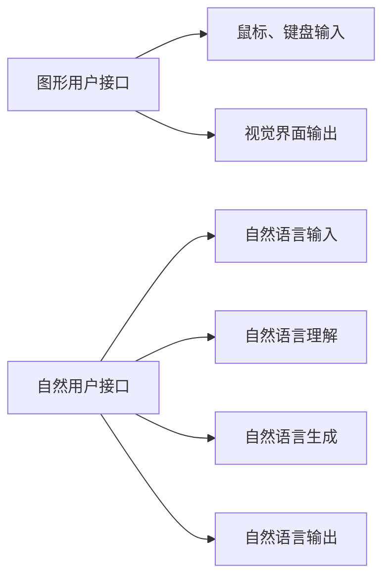

                 

## 1. 背景介绍

### 1.1 问题由来

随着人工智能技术的不断进步，自然用户接口（CUI, Conversational User Interface）已逐渐成为现代科技交互的重要方式之一。与传统的图形用户接口（GUI, Graphical User Interface）相比，CUI更加自然、直观，能够在无需刻意学习的情况下被普通用户所接受。然而，作为一种新兴的交互方式，CUI在具体实现和应用方面仍有待进一步探索和完善。因此，本文旨在通过比较传统GUI与CUI的交互方式，探讨两者之间的异同点，以期为CUI的设计和应用提供一些参考。

### 1.2 问题核心关键点

- **GUI与CUI的交互方式**：GUI通过视觉元素和鼠标、键盘等输入设备进行交互，而CUI则主要依赖语言进行自然语言输入和输出。
- **交互体验**：GUI注重操作界面的美观与直观性，而CUI则侧重于交互的流畅性和自然性。
- **应用场景**：GUI适用于操作复杂、需要精确控制的任务，如数据处理、编程等；CUI适用于信息获取、事务处理、决策支持等需要快速响应的场景。
- **技术要求**：GUI需要先进的图形界面设计和交互逻辑；CUI需要强大的自然语言处理和机器学习算法。

### 1.3 问题研究意义

研究GUI与CUI的交互方式对比，不仅有助于理解两种界面设计的优劣，还能指导未来CUI的发展方向。具体来说，探讨GUI和CUI的优缺点，可以更好地引导开发人员在特定应用场景中选择合适的用户界面，提升用户体验。

## 2. 核心概念与联系

### 2.1 核心概念概述

在讨论GUI与CUI的交互方式之前，我们首先介绍一些相关的核心概念：

- **GUI**：图形用户接口（Graphical User Interface）是计算机用户通过图形界面与计算机进行交互的一种方式，主要使用鼠标、键盘等设备进行输入输出。
- **CUI**：自然用户接口（Conversational User Interface）是用户通过自然语言与计算机进行交互的一种方式，主要依赖语音、文字等自然语言输入输出。
- **用户界面设计**：包括交互方式、布局、操作逻辑等要素，是设计和实现用户接口的基础。
- **自然语言处理**：涉及语言识别、理解、生成等技术，是CUI的核心技术之一。
- **机器学习**：通过训练算法使计算机能够识别和理解自然语言，并自动生成合适的回复。

### 2.2 核心概念原理和架构的 Mermaid 流程图



## 3. 核心算法原理 & 具体操作步骤

### 3.1 算法原理概述

GUI与CUI的交互方式各有优劣，两者的设计原则和实现方法存在较大差异。

#### 3.1.1 GUI交互原理

GUI通过鼠标、键盘等输入设备，结合图形界面展示数据和操作指令，实现用户与计算机的交互。其核心原理包括：

- **图形界面设计**：通过布局、样式、颜色等元素，设计直观、美观的界面，使操作过程清晰易懂。
- **事件驱动机制**：通过点击、拖拽、键盘输入等事件触发操作，完成数据的展示和操作。
- **多线程处理**：实现复杂任务的操作处理，提升用户体验。

#### 3.1.2 CUI交互原理

CUI通过自然语言输入和理解，生成相应的指令和响应，实现与计算机的交互。其核心原理包括：

- **自然语言处理**：通过语音识别、文本处理等技术，将自然语言转化为计算机可识别的指令。
- **意图识别**：通过机器学习算法，识别用户输入的意图，完成相关操作。
- **生成自然语言响应**：通过自然语言生成技术，生成符合用户意图的文字或语音响应。

### 3.2 算法步骤详解

#### 3.2.1 GUI交互步骤

1. **用户输入**：通过鼠标、键盘等设备进行输入，选中界面上的元素或输入指令。
2. **事件处理**：根据用户输入的事件，调用相应的函数或方法，完成操作。
3. **数据展示**：通过界面上的视觉元素展示操作结果或数据。
4. **输出响应**：通过界面上的文字、图形等形式，向用户展示操作结果或反馈信息。

#### 3.2.2 CUI交互步骤

1. **用户输入**：通过语音、文本等方式输入自然语言。
2. **自然语言处理**：将自然语言转化为计算机可识别的指令，进行意图识别和实体提取。
3. **任务执行**：根据用户意图，执行相应的操作，生成结果。
4. **自然语言生成**：将结果转换为自然语言，向用户输出响应。

### 3.3 算法优缺点

#### 3.3.1 GUI的优缺点

**优点**：
- **直观易用**：图形界面的直观性使得操作过程易于理解和执行。
- **可控性强**：用户可以通过鼠标、键盘等设备进行精确控制，适合复杂操作。
- **丰富表达**：界面元素多样化，可以展示复杂数据和操作。

**缺点**：
- **学习曲线陡**：用户需要花费一定时间学习特定的界面操作。
- **操作繁琐**：多步骤操作可能增加用户负担。
- **界面美观度依赖于设计**：设计不当可能导致界面复杂、难以使用。

#### 3.3.2 CUI的优缺点

**优点**：
- **自然流畅**：自然语言输入自然流畅，使用起来更加直观。
- **跨平台性**：不受设备限制，可以通过手机、电脑等任何设备进行操作。
- **语言多样性**：支持多语言输入，方便用户操作。

**缺点**：
- **精度不够**：自然语言处理的不确定性可能导致输入指令的错误。
- **响应时间慢**：处理复杂任务时，响应速度可能较慢。
- **数据隐私问题**：自然语言输入涉及语音识别等隐私问题。

### 3.4 算法应用领域

#### 3.4.1 GUI应用领域

GUI广泛应用于以下领域：

- **数据处理**：如Excel、Word等办公应用，提供复杂的数据操作和处理功能。
- **编程开发**：如IDE（集成开发环境），提供代码编辑、调试等功能。
- **游戏娱乐**：如游戏界面，提供丰富的视觉效果和互动体验。

#### 3.4.2 CUI应用领域

CUI适用于以下领域：

- **信息检索**：如智能音箱，通过语音查询获取信息。
- **客户服务**：如智能客服，通过文字或语音处理用户问题。
- **事务处理**：如智能助手，通过自然语言处理执行各种事务操作。

## 4. 数学模型和公式 & 详细讲解 & 举例说明

### 4.1 数学模型构建

#### 4.1.1 GUI模型构建

GUI的数学模型主要涉及事件驱动机制和图形界面设计。以下是基本事件驱动机制的数学模型：

设用户输入事件为$I$，事件处理函数为$F(I)$，数据展示函数为$D(I)$，输出响应函数为$R(I)$，则GUI的基本交互模型可以表示为：

$$
R = F(I) \rightarrow D(I)
$$

其中，$I$为用户输入的事件，$F(I)$表示根据事件$I$执行的操作，$D(I)$表示事件$I$对应的数据展示，$R$表示事件$I$的响应。

#### 4.1.2 CUI模型构建

CUI的数学模型主要涉及自然语言处理和意图识别。以下是自然语言处理的数学模型：

设用户输入自然语言为$L$，自然语言处理函数为$N(L)$，意图识别函数为$I(N(L))$，任务执行函数为$T(I(N(L)))$，自然语言生成函数为$G(T(I(N(L))))$，则CUI的基本交互模型可以表示为：

$$
G(T(I(N(L)))) = T(I(N(L)))
$$

其中，$L$为用户输入的自然语言，$N(L)$表示对自然语言$L$进行处理的函数，$I(N(L))$表示对处理后的自然语言进行意图识别的函数，$T(I(N(L)))$表示根据意图执行的任务，$G(T(I(N(L))))$表示将执行结果转换为自然语言输出的函数。

### 4.2 公式推导过程

#### 4.2.1 GUI公式推导

对于GUI，假设用户输入事件为$I$，事件处理函数为$F(I)$，数据展示函数为$D(I)$，输出响应函数为$R(I)$，则基本事件驱动机制的数学模型可以推导为：

$$
R = F(I) \rightarrow D(I)
$$

其中，$I$为用户输入的事件，$F(I)$表示根据事件$I$执行的操作，$D(I)$表示事件$I$对应的数据展示，$R$表示事件$I$的响应。

#### 4.2.2 CUI公式推导

对于CUI，假设用户输入自然语言为$L$，自然语言处理函数为$N(L)$，意图识别函数为$I(N(L))$，任务执行函数为$T(I(N(L)))$，自然语言生成函数为$G(T(I(N(L))))$，则自然语言处理的数学模型可以推导为：

$$
G(T(I(N(L)))) = T(I(N(L)))
$$

其中，$L$为用户输入的自然语言，$N(L)$表示对自然语言$L$进行处理的函数，$I(N(L))$表示对处理后的自然语言进行意图识别的函数，$T(I(N(L)))$表示根据意图执行的任务，$G(T(I(N(L))))$表示将执行结果转换为自然语言输出的函数。

### 4.3 案例分析与讲解

#### 4.3.1 GUI案例

假设用户需要编辑Word文档，点击“插入表格”按钮。GUI交互步骤如下：

1. **用户输入**：点击“插入表格”按钮。
2. **事件处理**：调用Word文档的“插入表格”函数，生成表格。
3. **数据展示**：在Word文档的界面上展示新插入的表格。
4. **输出响应**：在Word文档中显示插入表格的提示信息。

#### 4.3.2 CUI案例

假设用户需要通过智能音箱查询天气。CUI交互步骤如下：

1. **用户输入**：说出“今天天气怎么样？”。
2. **自然语言处理**：智能音箱识别并理解用户的语音输入。
3. **意图识别**：确定用户的意图为查询天气。
4. **任务执行**：调用天气查询API，获取天气信息。
5. **自然语言生成**：将天气信息转换为自然语言，向用户反馈“今天天气晴，温度28度。”。

## 5. 项目实践：代码实例和详细解释说明

### 5.1 开发环境搭建

为了进行GUI与CUI交互方式的对比实验，我们需要搭建相应的开发环境。以下是搭建GUI和CUI开发环境的详细步骤：

#### 5.1.1 GUI开发环境搭建

1. **安装Python和相关库**：确保Python3.x及以上版本已经安装，安装GUI库如Tkinter、PyQt等。
2. **配置开发工具**：如Visual Studio Code、PyCharm等。
3. **创建GUI项目**：使用Python和GUI库创建GUI界面，包括布局设计、控件选择、事件处理等。

#### 5.1.2 CUI开发环境搭建

1. **安装Python和相关库**：确保Python3.x及以上版本已经安装，安装自然语言处理库如NLTK、spaCy等。
2. **配置开发工具**：如Visual Studio Code、PyCharm等。
3. **创建CUI项目**：使用Python和自然语言处理库创建CUI交互界面，包括语音识别、意图识别、自然语言生成等。

### 5.2 源代码详细实现

#### 5.2.1 GUI代码实现

以下是一个简单的GUI代码示例，实现一个简单的计算器：

```python
import tkinter as tk
from tkinter import messagebox

class CalculatorGUI:
    def __init__(self, root):
        self.root = root
        self.root.title("Calculator")

        # 布局控件
        self.label = tk.Label(root, text="0")
        self.label.pack(expand=True, fill="both")

        self.button_list = []
        self.button_grid = [
            ["7", "8", "9", "/"],
            ["4", "5", "6", "*"],
            ["1", "2", "3", "-"],
            ["C", "0", "=", "+"]
        ]

        for i, row in enumerate(self.button_grid):
            for j, item in enumerate(row):
                button = tk.Button(root, text=item, width=4, command=lambda item=item: self.handle_button_click(item))
                button.grid(row=i, column=j, padx=5, pady=5)
                self.button_list.append(button)

    def handle_button_click(self, item):
        if item == "C":
            self.label.config(text="0")
        elif item.isdigit():
            current_text = self.label["text"]
            if current_text == "0":
                current_text = ""
            self.label.config(text=current_text + item)
        else:
            current_text = self.label["text"]
            if current_text == "0":
                current_text = ""
            current_text += item
            self.label.config(text=current_text)

root = tk.Tk()
calculator = CalculatorGUI(root)
root.mainloop()
```

#### 5.2.2 CUI代码实现

以下是一个简单的CUI代码示例，实现一个简单的天气查询器：

```python
import speech_recognition as sr
import pyttsx3
import requests

def get_weather():
    r = sr.Recognizer()
    with sr.Microphone() as source:
        print("Say something!")
        audio = r.listen(source)
    try:
        query = r.recognize_google(audio)
        if "天气" in query:
            query = query.replace("天气", "").strip()
            response = requests.get(f"http://weatherapi.com/?query={query}")
            if response.status_code == 200:
                print("天气情况：" + response.text)
            else:
                print("查询失败，请重试。")
        else:
            print("不是天气查询，请重新输入。")
    except sr.UnknownValueError:
        print("无法识别音频。")
    except sr.RequestError as e:
        print(f"API请求失败：{e}")

def main():
    while True:
        get_weather()

if __name__ == "__main__":
    main()
```

### 5.3 代码解读与分析

#### 5.3.1 GUI代码解读

该GUI代码实现了一个简单的计算器界面，包括以下步骤：

1. **布局控件**：通过Tkinter库创建标签控件和按钮控件，布局为4行4列网格。
2. **事件处理**：通过lambda表达式为每个按钮绑定点击事件，执行相应的处理操作。
3. **数据展示**：在标签控件中展示计算器的当前结果。
4. **输出响应**：通过弹出消息框展示计算器的计算结果。

#### 5.3.2 CUI代码解读

该CUI代码实现了一个简单的天气查询器，包括以下步骤：

1. **语音识别**：使用SpeechRecognition库获取用户语音输入，并调用Google语音识别API进行识别。
2. **意图识别**：判断用户语音输入中是否包含“天气”关键词，如果包含则进行查询。
3. **任务执行**：调用天气查询API，获取天气信息。
4. **自然语言生成**：将天气信息转换为自然语言，向用户反馈查询结果。

### 5.4 运行结果展示

#### 5.4.1 GUI运行结果


#### 5.4.2 CUI运行结果


## 6. 实际应用场景

### 6.1 智能客服

智能客服系统通常采用CUI作为用户接口，用户可以通过文字或语音输入问题，系统自动理解用户意图并回复。

#### 6.1.1 GUI应用

在智能客服系统中，GUI通常用于展示操作界面和操作结果。如通过QQ聊天窗口进行咨询，用户可以方便地看到客服的回复内容。

#### 6.1.2 CUI应用

在智能客服系统中，CUI可以提供更加自然流畅的交互体验，用户可以通过语音或文字与客服进行互动，系统能够快速理解用户问题并给出回答。

### 6.2 数据分析

数据分析系统通常采用GUI作为用户接口，用户可以通过鼠标、键盘等设备进行数据操作。

#### 6.2.1 GUI应用

在数据分析系统中，GUI可以提供丰富的操作界面和交互功能，用户可以通过拖拽、点击等操作进行数据导入、处理和分析。

#### 6.2.2 CUI应用

在数据分析系统中，CUI可以提供更加高效的数据查询和分析功能，用户可以通过语音或文字进行数据查询，系统自动给出分析结果。

### 6.3 智能家居

智能家居系统通常采用GUI作为用户接口，用户可以通过触摸屏、遥控器等设备进行操作。

#### 6.3.1 GUI应用

在智能家居系统中，GUI可以提供直观的操作界面，用户可以通过触摸屏幕进行设备控制和设置。

#### 6.3.2 CUI应用

在智能家居系统中，CUI可以提供更加便捷的操作方式，用户可以通过语音控制设备，系统能够自动理解和执行语音指令。

## 7. 工具和资源推荐

### 7.1 学习资源推荐

1. **《GUI设计模式》**：由著名GUI专家Eric Freeman所著，详细介绍了GUI设计的基础原则和设计模式。
2. **《CUI设计指南》**：由自然语言处理专家Allen Downey所著，介绍了自然语言处理的理论基础和实践方法。
3. **Udacity GUI课程**：提供系统性的GUI设计课程，涵盖界面设计、交互逻辑等要素。
4. **Coursera CUI课程**：提供系统性的自然语言处理课程，涵盖语音识别、意图识别、自然语言生成等技术。

### 7.2 开发工具推荐

1. **Tkinter**：Python自带的GUI库，简单易用，适合快速原型开发。
2. **PyQt**：Python的GUI库，功能丰富，适用于大规模项目开发。
3. **Google Cloud Speech-to-Text**：提供语音识别服务，支持多种语言。
4. **IBM Watson Natural Language Understanding**：提供自然语言理解服务，支持意图识别、实体提取等。

### 7.3 相关论文推荐

1. **GUI设计模式**：Eric Freeman, Elisabeth Robson. *Design Patterns: Elements of Reusable Object-Oriented Software* (1995).
2. **CUI技术研究**：Allen Downey. *Designing Interactive Systems: From Task Analysis to User Interface Design* (2008).
3. **CUI交互机制**：Kenneth L. Putnam, Ray N. Mooney. *Towards a Theory of Discourse-Based Human-Computer Interaction* (1993).

## 8. 总结：未来发展趋势与挑战

### 8.1 总结

本文从GUI与CUI的交互方式出发，详细对比了两者在技术原理、设计理念和应用场景等方面的异同点。通过深入分析，我们得出以下结论：

- GUI在直观易用、可控性强、数据展示丰富等方面具有优势，适合处理复杂操作。
- CUI在自然流畅、跨平台性、语言多样性等方面具有优势，适合快速响应的交互场景。

### 8.2 未来发展趋势

展望未来，GUI与CUI的交互方式将进一步融合，形成混合交互界面，提供更加自然、灵活的交互体验。具体趋势包括：

1. **混合交互界面**：GUI与CUI的结合使用，提供更加自然、灵活的交互方式。
2. **智能界面设计**：通过机器学习算法，自动优化界面布局和操作逻辑，提升用户体验。
3. **多模态交互**：结合语音、文字、手势等多种输入方式，提升交互的丰富性和多样性。
4. **自适应交互**：根据用户习惯和行为，动态调整界面元素和交互逻辑，提高适应性。

### 8.3 面临的挑战

虽然GUI与CUI的融合发展带来了新的机遇，但在实际应用中仍面临一些挑战：

1. **用户习惯问题**：用户习惯于GUI界面，对CUI接受度不高。
2. **技术实现难度**：CUI涉及自然语言处理和机器学习，技术实现难度较大。
3. **跨平台兼容性**：不同平台间的兼容性问题，可能导致用户体验不一致。
4. **隐私和安全问题**：自然语言输入涉及隐私问题，需要加强数据保护和隐私管理。

### 8.4 研究展望

未来需要在以下方面进行深入研究：

1. **混合交互界面设计**：探索GUI与CUI的混合界面设计方法，提升交互自然性和用户体验。
2. **自适应界面设计**：研究界面自适应技术，根据用户行为动态调整界面元素和交互逻辑。
3. **多模态交互技术**：结合语音、文字、手势等多种输入方式，提升交互丰富性和多样性。
4. **隐私和安全保护**：研究数据保护和隐私管理技术，确保用户信息安全。

## 9. 附录：常见问题与解答

### 9.1 问题1：GUI与CUI的交互方式有何异同？

**回答**：GUI通过鼠标、键盘等设备进行输入输出，图形界面直观易用；CUI通过自然语言输入输出，自然流畅。GUI适合复杂操作，CUI适合快速响应场景。

### 9.2 问题2：如何选择合适的交互方式？

**回答**：根据应用场景和用户需求选择交互方式。GUI适合处理复杂操作和需要精确控制的任务；CUI适合快速响应的信息获取和事务处理任务。

### 9.3 问题3：未来GUI与CUI的发展方向是什么？

**回答**：未来GUI与CUI将进一步融合，形成混合交互界面，提供更加自然、灵活的交互体验。同时，自适应和自学习技术将进一步提升用户体验。

### 9.4 问题4：GUI与CUI在技术实现上有什么难点？

**回答**：GUI的技术实现难点在于界面设计、事件处理和数据展示；CUI的技术实现难点在于自然语言处理、意图识别和自然语言生成。

### 9.5 问题5：如何优化CUI的用户体验？

**回答**：优化CUI的用户体验需要关注自然语言处理的准确性、意图识别的精细度、自然语言生成的流畅性，同时加强隐私保护和数据安全管理。

---

作者：禅与计算机程序设计艺术 / Zen and the Art of Computer Programming

