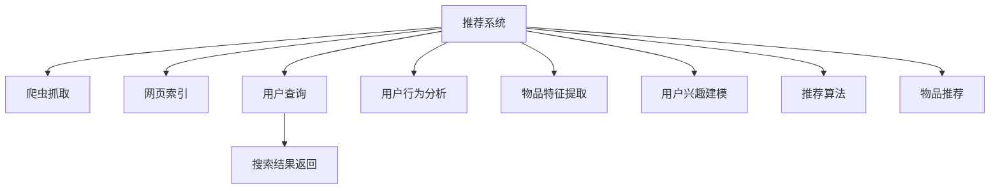

                 

## 1. 背景介绍

随着互联网的快速发展，搜索引擎和推荐系统已经成为人们获取信息、发现兴趣的重要工具。它们在日常生活、工作、学习和娱乐中发挥着越来越重要的作用。然而，传统搜索推荐系统尽管功能丰富，但在某些方面仍存在局限性。本文将系统性地探讨这些问题，并提出可能的解决方案。

## 2. 核心概念与联系

### 2.1 核心概念概述

为了深入理解传统搜索推荐系统的局限性，首先介绍一些核心概念：

- **搜索引擎**：通过爬虫抓取网页内容，然后对网页进行索引、存储，最终在用户查询时快速返回相关网页。典型搜索引擎包括Google、Bing等。
- **推荐系统**：通过分析用户行为数据，为用户推荐感兴趣的物品或内容。推荐系统广泛应用于电商、新闻、视频等平台。典型推荐系统包括Amazon、Netflix、抖音等。
- **个性化**：根据用户的历史行为、兴趣等，定制个性化搜索结果或推荐。个性化是搜索引擎和推荐系统的核心目标之一。
- **搜索结果多样性**：搜索结果需要包含多种类型、多种角度的信息，以便满足不同用户的需求。
- **冷启动问题**：对于新用户或新物品，由于缺乏足够的行为数据，个性化推荐效果差。

### 2.2 核心概念原理和架构的 Mermaid 流程图



## 3. 核心算法原理 & 具体操作步骤

### 3.1 算法原理概述

传统搜索推荐系统的核心算法包括倒排索引、PageRank、协同过滤等。这些算法在搜索引擎和推荐系统中广泛应用。然而，它们也存在一些局限性，下面分别进行介绍。

### 3.2 算法步骤详解

#### 3.2.1 倒排索引

**算法原理**：倒排索引（Inverted Index）是将所有文档与文档中出现的关键词进行关联，形成索引结构。用户查询时，通过关键词在索引中查找包含该关键词的文档列表。

**操作步骤**：
1. 爬虫抓取网页内容。
2. 分词和去除停用词。
3. 对每个关键词构建倒排索引。
4. 用户输入查询词，在倒排索引中查找相关文档。

**优缺点**：
- 优点：速度快、索引构建一次可多次使用。
- 缺点：需要大量内存存储索引，对于大规模数据集，索引构建复杂度高。

#### 3.2.2 PageRank

**算法原理**：PageRank通过分析网页之间的链接关系，计算每个网页的重要性，排序返回相关网页。

**操作步骤**：
1. 对所有网页进行预处理，去除重复链接。
2. 构建网页链接图。
3. 设置迭代次数和阻尼系数。
4. 迭代计算每个网页的PageRank值。
5. 按照PageRank值排序返回结果。

**优缺点**：
- 优点：有效避免“返回噪声”，能够识别权威网页。
- 缺点：计算复杂度高，不适用于实时查询。

#### 3.2.3 协同过滤

**算法原理**：协同过滤（Collaborative Filtering）通过分析用户行为数据，寻找兴趣相似的用户或物品，为其推荐相似的物品。

**操作步骤**：
1. 收集用户行为数据，如点击、购买、评分等。
2. 构建用户-物品矩阵。
3. 用户行为数据预处理，去除噪声、处理缺失值。
4. 计算用户相似度和物品相似度。
5. 计算用户对物品的预测评分。
6. 根据评分排序返回推荐结果。

**优缺点**：
- 优点：基于用户和物品之间的隐式反馈，推荐结果具有真实性。
- 缺点：对于新用户或新物品，无法进行有效推荐。

### 3.3 算法优缺点

#### 3.3.1 倒排索引

- **优点**：
  - 查询速度快，适合大规模数据集。
  - 索引构建后，可重复使用，节省计算时间。
- **缺点**：
  - 需要大量内存存储索引，索引构建复杂度高。
  - 无法处理非结构化数据，如图片、音频等。

#### 3.3.2 PageRank

- **优点**：
  - 避免“返回噪声”，能够识别权威网页。
  - 能够处理非结构化数据，如链接图。
- **缺点**：
  - 计算复杂度高，不适用于实时查询。
  - 无法考虑网页内容，仅依赖链接关系。

#### 3.3.3 协同过滤

- **优点**：
  - 基于用户和物品之间的隐式反馈，推荐结果具有真实性。
  - 能够处理非结构化数据，如图片、音频等。
- **缺点**：
  - 对于新用户或新物品，无法进行有效推荐。
  - 需要大量数据进行模型训练，数据稀疏性问题难以解决。

### 3.4 算法应用领域

#### 3.4.1 搜索引擎

传统搜索引擎的核心算法包括倒排索引和PageRank。倒排索引用于快速返回相关网页，PageRank用于排序返回结果，提高搜索结果的相关性。

#### 3.4.2 推荐系统

推荐系统的核心算法包括协同过滤、内容推荐、基于用户的协同过滤等。协同过滤用于计算用户对物品的预测评分，排序返回推荐结果。

## 4. 数学模型和公式 & 详细讲解 & 举例说明

### 4.1 数学模型构建

在传统搜索推荐系统中，常见的数学模型包括矩阵分解、线性回归、因子分解等。这些模型通过数学公式描述了用户、物品之间的关系，从而进行推荐或排序。

#### 4.1.1 矩阵分解

设用户-物品矩阵为 $X$，用户-物品评分矩阵为 $Y$，模型假设：

$$
X = UA \quad \text{和} \quad Y = UB
$$

其中 $U$ 和 $A$ 分别表示用户特征和物品特征矩阵，$B$ 表示评分矩阵。

通过矩阵分解，可以求解用户特征和物品特征矩阵，从而进行预测评分。

### 4.2 公式推导过程

#### 4.2.1 矩阵分解公式推导

设 $X$ 和 $Y$ 的大小均为 $n \times m$，$U$ 和 $A$ 的大小均为 $n \times k$，$B$ 的大小为 $k \times m$。矩阵分解的求解公式为：

$$
\min_{U, A, B} ||X - UA||_F^2 + ||Y - UB||_F^2
$$

其中 $|| \cdot ||_F$ 表示矩阵的 Frobenius 范数，即矩阵元素平方和的开方。

使用梯度下降等优化算法求解上述最小化问题，即可得到最优的 $U$、$A$ 和 $B$。

### 4.3 案例分析与讲解

#### 4.3.1 矩阵分解案例

假设某电商平台的商品推荐系统，收集了用户对商品的评分数据。通过矩阵分解，可以求解用户和物品的特征矩阵，从而进行推荐。

假设用户-物品矩阵 $X$ 大小为 $1000 \times 1000$，用户-物品评分矩阵 $Y$ 大小为 $1000 \times 1000$。设 $k=100$，即用户和物品的特征矩阵大小均为 $1000 \times 100$。

使用矩阵分解算法，求解用户特征矩阵 $U$ 和物品特征矩阵 $A$，使得：

$$
X = UA \quad \text{和} \quad Y = UB
$$

求解得到 $U$、$A$ 和 $B$ 后，可以通过 $U$ 和 $A$ 预测用户对物品的评分，从而进行推荐。

## 5. 项目实践：代码实例和详细解释说明

### 5.1 开发环境搭建

为了实现矩阵分解推荐算法，需要搭建相应的开发环境。以下是搭建环境的步骤：

1. 安装 Python 环境。
2. 安装 NumPy、SciPy、Scikit-Learn 等科学计算库。
3. 安装 TensorFlow 或 PyTorch 深度学习框架。
4. 安装 Dask 并行计算库。

### 5.2 源代码详细实现

#### 5.2.1 矩阵分解算法实现

```python
import numpy as np
from scipy.sparse import csr_matrix
from scipy.optimize import minimize

def matrix_factorization(X, k, max_iter=100, tol=1e-6):
    # 用户-物品矩阵 X 转换为稀疏矩阵
    X_sp = csr_matrix(X)
    n, m = X_sp.shape
    
    # 初始化用户特征矩阵 U 和物品特征矩阵 A
    U = np.random.rand(n, k)
    A = np.random.rand(k, m)
    
    # 构建损失函数
    def loss_fn(X, U, A):
        return ((X - np.dot(U, A))**2).mean()
    
    # 求解用户特征矩阵 U 和物品特征矩阵 A
    res = minimize(lambda: loss_fn(X_sp, U, A), [U, A], method='BFGS', jac=True, options={'disp': True, 'maxiter': max_iter, 'gtol': tol})
    U = res.x[0]
    A = res.x[1]
    
    return U, A
```

### 5.3 代码解读与分析

#### 5.3.1 矩阵分解算法代码解读

- `csr_matrix`：将用户-物品矩阵转换为稀疏矩阵，提高计算效率。
- `minimize`：使用 BFGS 优化算法求解损失函数的最小值，得到最优的特征矩阵。
- `np.dot`：矩阵乘法，用于计算用户特征矩阵和物品特征矩阵的乘积。

### 5.4 运行结果展示

#### 5.4.1 矩阵分解算法结果展示

假设用户-物品矩阵 $X$ 大小为 $1000 \times 1000$，用户-物品评分矩阵 $Y$ 大小为 $1000 \times 1000$，$k=100$。

运行矩阵分解算法，得到用户特征矩阵 $U$ 和物品特征矩阵 $A$。

使用 $U$ 和 $A$ 进行预测评分，得到推荐结果。

## 6. 实际应用场景

### 6.1 搜索引擎

在搜索引擎中，倒排索引和 PageRank 算法广泛应用。倒排索引用于快速返回相关网页，PageRank 用于排序返回结果，提高搜索结果的相关性。

### 6.2 推荐系统

推荐系统的核心算法包括协同过滤、内容推荐、基于用户的协同过滤等。协同过滤用于计算用户对物品的预测评分，排序返回推荐结果。

### 6.3 新闻推荐

在新闻推荐系统中，可以根据用户的历史阅读记录，为用户推荐感兴趣的新闻。通过协同过滤算法，找到与用户兴趣相似的用户，推荐其阅读过的新闻。

## 7. 工具和资源推荐

### 7.1 学习资源推荐

- **《深度学习》(周志华)**：系统介绍深度学习的基本概念和算法，适合初学者和进阶者。
- **Coursera《Machine Learning》(Andrew Ng)**：由斯坦福大学教授 Andrew Ng 开设的课程，适合学习深度学习的基本理论和应用。
- **Kaggle**：一个数据科学竞赛平台，提供大量数据集和开源代码，适合学习和实践。
- **GitHub**：一个代码托管平台，提供大量开源项目，适合学习和借鉴。

### 7.2 开发工具推荐

- **TensorFlow**：由 Google 开发的一个深度学习框架，支持分布式计算和自动微分。
- **PyTorch**：由 Facebook 开发的一个深度学习框架，支持动态计算图和 GPU 加速。
- **Dask**：一个并行计算库，支持大规模数据集的处理和分析。

### 7.3 相关论文推荐

- **Deep Web Mining and Statistical Learning (2010)**：介绍搜索引擎的倒排索引算法和 PageRank 算法。
- **Collaborative Filtering for Implicit Feedback Datasets (2008)**：介绍协同过滤算法的原理和应用。

## 8. 总结：未来发展趋势与挑战

### 8.1 研究成果总结

本文系统地探讨了传统搜索推荐系统的局限性，包括倒排索引、PageRank、协同过滤等算法。这些算法在搜索引擎和推荐系统中广泛应用，但也有一些局限性。

### 8.2 未来发展趋势

未来搜索推荐系统将呈现以下几个发展趋势：

1. **个性化推荐**：随着大数据和深度学习技术的发展，个性化推荐将越来越精准，能够根据用户的多样化需求，提供更加个性化的搜索结果和推荐。
2. **实时推荐**：通过引入实时流数据处理技术，搜索推荐系统将能够实时处理用户行为数据，快速返回最新结果。
3. **多模态推荐**：将文本、图片、音频等多模态数据融合，提高推荐效果。

### 8.3 面临的挑战

未来搜索推荐系统将面临以下几个挑战：

1. **数据隐私和安全**：如何保护用户数据隐私和安全，避免数据泄露和滥用。
2. **计算资源消耗**：大规模数据集的处理和分析，需要大量的计算资源，如何优化计算效率和资源消耗。
3. **推荐效果公平性**：如何避免推荐结果的偏见和歧视，确保推荐公平性。

### 8.4 研究展望

未来的搜索推荐系统需要在以下几个方面进行改进：

1. **深度学习**：引入深度学习技术，提高推荐效果和泛化能力。
2. **模型可解释性**：提高模型的可解释性，帮助用户理解推荐结果的依据。
3. **跨领域应用**：将搜索推荐系统应用于更多领域，如医疗、金融、教育等，推动更多行业的数字化转型。

## 9. 附录：常见问题与解答

### 9.1 问题一：搜索引擎和推荐系统有哪些共同点？

**解答**：搜索引擎和推荐系统都基于用户的历史行为数据，为用户提供个性化的信息。它们的核心算法包括倒排索引、PageRank、协同过滤等，都是通过计算用户和物品之间的隐式反馈，进行推荐或排序。

### 9.2 问题二：矩阵分解算法如何提高推荐效果？

**解答**：矩阵分解算法将用户-物品矩阵分解为用户特征矩阵和物品特征矩阵，通过计算矩阵乘积得到预测评分。通过不断迭代优化，能够提高推荐效果，减少数据稀疏性问题。

### 9.3 问题三：传统搜索推荐系统有哪些局限性？

**解答**：传统搜索推荐系统存在以下局限性：
1. 数据隐私和安全问题。
2. 计算资源消耗问题。
3. 推荐效果公平性问题。

### 9.4 问题四：如何优化搜索引擎的倒排索引？

**解答**：优化倒排索引的方法包括：
1. 使用稀疏矩阵存储，减少内存消耗。
2. 优化索引构建算法，减少构建时间。
3. 使用分布式索引技术，提高索引处理能力。

### 9.5 问题五：推荐系统的协同过滤算法有哪些？

**解答**：推荐系统的协同过滤算法包括：
1. 基于用户的协同过滤。
2. 基于物品的协同过滤。
3. 混合协同过滤。

通过解答这些常见问题，能够帮助读者更好地理解传统搜索推荐系统的局限性和改进方法。

---

作者：禅与计算机程序设计艺术 / Zen and the Art of Computer Programming

