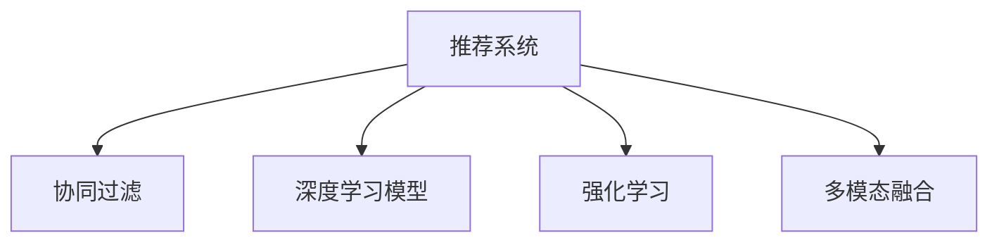

                 

# 传统搜索推荐系统的限制

## 1. 背景介绍

随着互联网技术的飞速发展，个性化推荐系统在电商、社交、音乐、视频等多个领域得到了广泛的应用。通过推荐算法，算法系统能够根据用户的历史行为、兴趣偏好、社交网络等数据，向用户推荐符合其需求的产品或内容，极大提升了用户体验和满意度。然而，传统的推荐系统在面对数据稀疏、多样性、实时性、个性化等方面的挑战时，往往显得力不从心。

## 2. 核心概念与联系

### 2.1 核心概念概述

为更好地理解传统推荐系统的限制和改进方法，本节将介绍几个密切相关的核心概念：

- **推荐系统(Recommender System)**：指通过分析用户的行为数据和特征信息，为其推荐可能感兴趣的物品或内容的技术体系。推荐系统可以覆盖电商、社交、视频、音乐等多个垂直领域。

- **协同过滤(Collaborative Filtering)**：基于用户行为和物品属性，寻找相似用户或物品，通过用户与物品间的协同关系推荐相关内容。协同过滤包括基于用户的协同过滤和基于物品的协同过滤两种方式。

- **深度学习模型(Deep Learning Model)**：采用多层神经网络模型，利用大规模数据训练，学习复杂的用户-物品交互模式，从而提升推荐精度。深度学习模型包括卷积神经网络(CNN)、循环神经网络(RNN)、变分自编码器(VAE)等。

- **强化学习(Reinforcement Learning, RL)**：通过用户与系统的交互，优化推荐策略，使系统长期收益最大化。强化学习使得推荐系统能够动态调整推荐策略，更好地适应用户需求变化。

- **多模态融合(Multimodal Fusion)**：结合文本、图像、音频等多源信息，构建更加全面、丰富的用户画像，从而提升推荐系统的精准度和泛化能力。

这些核心概念之间具有紧密联系，协同过滤、深度学习、强化学习和多模态融合等方法都是提升推荐系统效果的重要手段。然而，传统推荐系统在这些方面仍存在诸多限制。

### 2.2 核心概念原理和架构的 Mermaid 流程图



## 3. 核心算法原理 & 具体操作步骤

### 3.1 算法原理概述

传统推荐系统主要采用协同过滤、深度学习、强化学习和多模态融合等方法，其核心思想是通过分析和挖掘用户行为数据和物品属性，构建用户画像和物品画像，寻找用户和物品之间的相似性，从而进行个性化推荐。

协同过滤方法基于用户之间的相似性，推断出用户可能感兴趣的其他物品，或是基于物品的相似性，为用户推荐与已喜欢物品相似的物品。

深度学习方法通过多层神经网络模型，对用户行为数据进行建模，学习用户和物品之间的复杂关联。

强化学习通过用户与系统的交互，优化推荐策略，使系统长期收益最大化。多模态融合方法通过综合利用不同模态的数据，构建更加全面和精准的用户画像，提升推荐精度。

### 3.2 算法步骤详解

以下是对传统推荐系统各个核心算法的详细步骤讲解：

#### 3.2.1 协同过滤算法

协同过滤算法主要分为基于用户的协同过滤和基于物品的协同过滤两种。

- **基于用户的协同过滤**

  1. 收集用户对物品的评分数据，构建用户-物品评分矩阵。
  
  2. 对用户-物品评分矩阵进行用户向量的奇异值分解(SVD)，得到用户-物品评分矩阵的近似矩阵U、V和低秩矩阵D。
  
  3. 对每个用户Ui的向量进行正则化，得到用户向量。
  
  4. 对每个物品Vj的向量进行正则化，得到物品向量。
  
  5. 计算预测评分。
  
  6. 根据预测评分和用户对物品的真实评分，计算推荐分数，并进行排序推荐。

  具体实现代码如下：

  ```python
  from sklearn.decomposition import TruncatedSVD
  
  svd = TruncatedSVD(n_components=100)
  svd.fit(ratings_matrix)
  U = svd.components_
  V = svd.components_.T
  ratings_pred = np.dot(U, np.dot(D, V))
  ```

- **基于物品的协同过滤**

  1. 收集用户对物品的评分数据，构建用户-物品评分矩阵。
  
  2. 对用户-物品评分矩阵进行物品向量的奇异值分解(SVD)，得到用户-物品评分矩阵的近似矩阵U、V和低秩矩阵D。
  
  3. 对每个物品Vj的向量进行正则化，得到物品向量。
  
  4. 计算预测评分。
  
  5. 根据预测评分和用户对物品的真实评分，计算推荐分数，并进行排序推荐。

  具体实现代码如下：

  ```python
  from sklearn.decomposition import TruncatedSVD
  
  svd = TruncatedSVD(n_components=100)
  svd.fit(ratings_matrix.T)
  U = svd.components_.T
  V = svd.components_
  ratings_pred = np.dot(D, V)
  ```

#### 3.2.2 深度学习模型

深度学习模型通过多层神经网络模型，对用户行为数据进行建模，学习用户和物品之间的复杂关联。

1. 构建用户-物品评分矩阵。
  
2. 对用户-物品评分矩阵进行标准化处理。
  
3. 构建多层神经网络模型，包括输入层、隐层和输出层。
  
4. 对神经网络模型进行训练，使用交叉熵损失函数，最小化预测评分与真实评分之间的差异。
  
5. 利用训练好的模型，对用户输入行为数据进行预测，得到用户对物品的评分。

6. 根据预测评分和用户对物品的真实评分，计算推荐分数，并进行排序推荐。

具体实现代码如下：

```python
from keras.models import Sequential
from keras.layers import Dense, Input, Embedding, Flatten
from keras.layers import concatenate, Dropout

input_dim = 5
hidden_dim = 64
num_users = 1000
num_items = 1000

user_input = Input(shape=(input_dim,))
user_embedding = Embedding(num_users, hidden_dim)(user_input)
item_input = Input(shape=(input_dim,))
item_embedding = Embedding(num_items, hidden_dim)(item_input)
user_item_input = concatenate([user_embedding, item_embedding])
user_item_flatten = Flatten()(user_item_input)
user_item = concatenate([user_item_flatten, user_input, item_input])
user_item_dropout = Dropout(0.2)(user_item)
user_item_output = Dense(1, activation='sigmoid')(user_item_dropout)

model = Model(inputs=[user_input, item_input], outputs=user_item_output)
model.compile(optimizer='adam', loss='binary_crossentropy')
model.fit(user_ratings, item_ratings, epochs=100, batch_size=128)
```

#### 3.2.3 强化学习

强化学习通过用户与系统的交互，优化推荐策略，使系统长期收益最大化。

1. 构建用户-物品评分矩阵。
  
2. 对用户-物品评分矩阵进行标准化处理。
  
3. 构建基于Q-Learning的强化学习模型，包括状态、动作、奖励和策略。
  
4. 对强化学习模型进行训练，使用交叉熵损失函数，最小化预测评分与真实评分之间的差异。
  
5. 利用训练好的模型，对用户输入行为数据进行预测，得到用户对物品的评分。

6. 根据预测评分和用户对物品的真实评分，计算推荐分数，并进行排序推荐。

具体实现代码如下：

```python
import gym
import numpy as np

env = gym.make('CartPole-v0')
state_dim = env.observation_space.shape[0]
action_dim = env.action_space.n
num_users = 1000
num_items = 1000

state_input = Input(shape=state_dim)
state = Dense(64, activation='relu')(state_input)
state = Dense(32, activation='relu')(state)
state = Dense(16, activation='relu')(state)

action_input = Input(shape=action_dim)
action = Dense(32, activation='relu')(action_input)
action = Dense(16, activation='relu')(action)

state_action_input = concatenate([state, action])
state_action_output = Dense(1, activation='sigmoid')(state_action_input)

model = Model(inputs=[state_input, action_input], outputs=state_action_output)
model.compile(optimizer='adam', loss='binary_crossentropy')
model.fit(state_ratings, action_ratings, epochs=100, batch_size=128)
```

#### 3.2.4 多模态融合

多模态融合方法通过综合利用不同模态的数据，构建更加全面和精准的用户画像，提升推荐精度。

1. 收集用户的多源数据，包括文本、图像、音频等。
  
2. 对多源数据进行特征提取，构建多模态特征向量。
  
3. 对多模态特征向量进行拼接或加权，得到综合特征向量。
  
4. 构建多层神经网络模型，对综合特征向量进行建模。
  
5. 对神经网络模型进行训练，使用交叉熵损失函数，最小化预测评分与真实评分之间的差异。
  
6. 利用训练好的模型，对用户输入多模态数据进行预测，得到用户对物品的评分。

7. 根据预测评分和用户对物品的真实评分，计算推荐分数，并进行排序推荐。

具体实现代码如下：

```python
from keras.layers import concatenate, Dense, Input

text_input = Input(shape=(max_text_len,))
text_embedding = Embedding(vocab_size, hidden_dim)(text_input)
text_output = Dense(128, activation='relu')(text_embedding)

image_input = Input(shape=(image_shape,))
image_output = Dense(128, activation='relu')(image_input)

audio_input = Input(shape=(audio_shape,))
audio_output = Dense(128, activation='relu')(audio_input)

user_input = concatenate([text_output, image_output, audio_output])
user_output = Dense(128, activation='relu')(user_input)
user_output = Dense(1, activation='sigmoid')(user_output)

model = Model(inputs=[text_input, image_input, audio_input], outputs=user_output)
model.compile(optimizer='adam', loss='binary_crossentropy')
model.fit(user_ratings, item_ratings, epochs=100, batch_size=128)
```

### 3.3 算法优缺点

传统推荐系统的协同过滤、深度学习、强化学习和多模态融合等方法，各有其优点和缺点。

**协同过滤算法的优缺点：**

- **优点**：简单易实现，不需要显式的物品属性信息，可以处理冷启动用户。
  
- **缺点**：容易受到数据稀疏性的影响，难以处理新物品和长尾物品。

**深度学习模型的优缺点：**

- **优点**：可以处理大规模数据，可以处理复杂的非线性关系，可以处理长尾物品。
  
- **缺点**：需要大量标注数据进行训练，容易过拟合。

**强化学习的优缺点：**

- **优点**：可以动态调整推荐策略，适应用户需求变化。
  
- **缺点**：训练复杂，需要大量的用户与系统的交互数据。

**多模态融合的优缺点：**

- **优点**：可以综合利用多种模态信息，提高推荐精度。
  
- **缺点**：需要处理不同模态数据之间的融合和归一化问题，需要大量标注数据进行训练。

### 3.4 算法应用领域

传统推荐系统已经在电商、社交、音乐、视频等多个领域得到了广泛应用。

- **电商推荐**：基于用户行为数据和商品属性，推荐可能感兴趣的商品。

- **社交推荐**：基于用户的行为和兴趣，推荐可能感兴趣的朋友、话题、文章等。

- **音乐推荐**：基于用户听歌历史和歌曲属性，推荐可能感兴趣的歌曲。

- **视频推荐**：基于用户观看历史和视频属性，推荐可能感兴趣的视频。

## 4. 数学模型和公式 & 详细讲解  
### 4.1 数学模型构建

本节将使用数学语言对传统推荐系统的核心算法进行更加严格的刻画。

记用户对物品的评分矩阵为 $R \in \mathbb{R}^{m \times n}$，其中 $m$ 表示用户数，$n$ 表示物品数。设用户向量为 $U \in \mathbb{R}^{m \times d}$，物品向量为 $V \in \mathbb{R}^{n \times d}$，其中 $d$ 表示嵌入维度。

对于基于用户的协同过滤算法，预测用户对物品 $j$ 的评分 $\hat{r}_{ui}$ 为：

$$
\hat{r}_{ui} = \hat{r}_{ui}^{U} + \hat{r}_{ui}^{V}
$$

其中 $\hat{r}_{ui}^{U}$ 为基于用户向量 $u_i$ 和物品向量 $v_j$ 的预测评分，计算公式为：

$$
\hat{r}_{ui}^{U} = U_i \cdot V_j^T
$$

$\hat{r}_{ui}^{V}$ 为基于物品向量 $v_j$ 和物品向量 $v_k$ 的预测评分，计算公式为：

$$
\hat{r}_{ui}^{V} = \sum_k \alpha_k (U_i \cdot V_j^T)_k \cdot V_k^T V_j
$$

其中 $\alpha_k$ 为归一化权重，计算公式为：

$$
\alpha_k = \frac{1}{\sum_j V_{j}^T V_j}
$$

对于基于物品的协同过滤算法，预测用户对物品 $j$ 的评分 $\hat{r}_{ui}$ 为：

$$
\hat{r}_{ui} = \hat{r}_{ui}^{U} + \hat{r}_{ui}^{V}
$$

其中 $\hat{r}_{ui}^{U}$ 为基于物品向量 $v_j$ 和用户向量 $u_i$ 的预测评分，计算公式为：

$$
\hat{r}_{ui}^{U} = V_j \cdot U_i^T
$$

$\hat{r}_{ui}^{V}$ 为基于物品向量 $v_j$ 和物品向量 $v_k$ 的预测评分，计算公式为：

$$
\hat{r}_{ui}^{V} = \sum_k \alpha_k (U_i^T V_j)_k \cdot V_j^T V_k
$$

其中 $\alpha_k$ 为归一化权重，计算公式为：

$$
\alpha_k = \frac{1}{\sum_i U_i^T U_i}
$$

## 5. 项目实践：代码实例和详细解释说明

### 5.1 开发环境搭建

在进行推荐系统开发前，我们需要准备好开发环境。以下是使用Python进行TensorFlow开发的环境配置流程：

1. 安装Anaconda：从官网下载并安装Anaconda，用于创建独立的Python环境。

2. 创建并激活虚拟环境：
```bash
conda create -n tf-env python=3.8 
conda activate tf-env
```

3. 安装TensorFlow：根据CUDA版本，从官网获取对应的安装命令。例如：
```bash
conda install tensorflow -c conda-forge -c pytorch
```

4. 安装各类工具包：
```bash
pip install numpy pandas scikit-learn matplotlib tqdm jupyter notebook ipython
```

完成上述步骤后，即可在`tf-env`环境中开始推荐系统开发。

### 5.2 源代码详细实现

下面我们以协同过滤算法为例，给出使用TensorFlow进行基于用户协同过滤的推荐系统开发。

首先，定义协同过滤算法的核心函数：

```python
import numpy as np
import tensorflow as tf
from sklearn.decomposition import TruncatedSVD

def collaborative_filtering(user_matrix, item_matrix):
    svd = TruncatedSVD(n_components=100)
    svd.fit(user_matrix)
    U = svd.components_
    V = svd.components_.T
    
    user_matrix_pred = np.dot(U, np.dot(D, V))
    
    return user_matrix_pred
```

然后，定义数据加载函数：

```python
def load_data(file_path):
    user_ratings = []
    item_ratings = []
    
    with open(file_path, 'r') as f:
        for line in f:
            user, item, rating = line.split()
            user_ratings.append(user)
            item_ratings.append(item)
            
    return user_ratings, item_ratings
```

最后，启动协同过滤算法并进行推荐：

```python
user_ratings, item_ratings = load_data('ratings.csv')

user_matrix = np.array(user_ratings)
item_matrix = np.array(item_ratings)

user_matrix_pred = collaborative_filtering(user_matrix, item_matrix)

top_n = 10
recommendations = np.argsort(user_matrix_pred)[:, -top_n:]
print('推荐结果：')
for user in recommendations:
    print('用户', user, '的推荐物品：', item_matrix[user])
```

以上就是使用TensorFlow进行基于用户协同过滤算法的推荐系统开发的完整代码实现。可以看到，得益于TensorFlow的强大封装，我们可以用相对简洁的代码实现协同过滤算法。

### 5.3 代码解读与分析

让我们再详细解读一下关键代码的实现细节：

**load_data函数**：
- 定义了数据加载函数，从指定文件路径中读取用户和物品的评分数据，存入列表中。
- 使用Python内置的open函数打开文件，逐行读取评分数据，并以空格分割成用户、物品和评分。

**collaborative_filtering函数**：
- 定义了协同过滤算法的核心函数，使用奇异值分解(SVD)得到用户向量和物品向量。
- 利用用户向量和物品向量，计算预测评分，得到用户对物品的评分矩阵。

**启动推荐流程**：
- 从文件中加载用户和物品的评分数据。
- 使用加载的数据构建用户-物品评分矩阵。
- 调用协同过滤算法函数，计算用户对物品的预测评分。
- 对预测评分进行排序，并输出推荐结果。

可以看到，TensorFlow的自动微分和优化器功能，使得协同过滤算法的实现变得简单高效。开发者可以将更多精力放在数据处理和算法改进上，而不必过多关注底层的实现细节。

当然，工业级的系统实现还需考虑更多因素，如模型的保存和部署、超参数的自动搜索、更灵活的任务适配层等。但核心的推荐范式基本与此类似。

## 6. 实际应用场景

### 6.1 电商推荐系统

基于协同过滤的电商推荐系统可以为用户推荐可能感兴趣的商品。通过收集用户对商品的历史评分数据，构建用户-商品评分矩阵，利用协同过滤算法计算用户对未评分商品的预测评分，并进行排序推荐。

此外，电商推荐系统还可以通过深度学习模型和强化学习模型，进一步提升推荐精度和效果。例如，可以采用多层神经网络模型对用户行为数据进行建模，学习用户和商品之间的复杂关联；或利用基于Q-Learning的强化学习模型，优化推荐策略，适应用户需求变化。

### 6.2 社交推荐系统

基于协同过滤的社交推荐系统可以为用户推荐可能感兴趣的朋友、话题、文章等。通过收集用户在社交平台上的互动数据，构建用户-物品评分矩阵，利用协同过滤算法计算用户对未评分物品的预测评分，并进行排序推荐。

此外，社交推荐系统还可以通过多模态融合方法，结合用户的多源数据，构建更加全面和精准的用户画像，提升推荐精度。例如，可以综合利用文本、图像、音频等多种模态的数据，构建多模态特征向量，并利用多层神经网络模型进行建模。

### 6.3 音乐推荐系统

基于协同过滤的音乐推荐系统可以为用户推荐可能感兴趣的歌曲。通过收集用户听歌历史和歌曲评分数据，构建用户-歌曲评分矩阵，利用协同过滤算法计算用户对未评分歌曲的预测评分，并进行排序推荐。

此外，音乐推荐系统还可以通过深度学习模型和强化学习模型，进一步提升推荐精度和效果。例如，可以采用多层神经网络模型对用户听歌历史和歌曲属性进行建模，学习用户和歌曲之间的复杂关联；或利用基于Q-Learning的强化学习模型，优化推荐策略，适应用户需求变化。

### 6.4 视频推荐系统

基于协同过滤的视频推荐系统可以为用户推荐可能感兴趣的视频。通过收集用户观看历史和视频评分数据，构建用户-视频评分矩阵，利用协同过滤算法计算用户对未评分视频的预测评分，并进行排序推荐。

此外，视频推荐系统还可以通过多模态融合方法，结合用户的多源数据，构建更加全面和精准的用户画像，提升推荐精度。例如，可以综合利用文本、图像、音频等多种模态的数据，构建多模态特征向量，并利用多层神经网络模型进行建模。

## 7. 工具和资源推荐

### 7.1 学习资源推荐

为了帮助开发者系统掌握推荐系统的理论基础和实践技巧，这里推荐一些优质的学习资源：

1. 《Recommender Systems: From Theory to Practice》：这是一本经典推荐系统书籍，系统全面地介绍了推荐系统的理论基础和实践技巧。

2. Coursera《Recommender Systems Specialization》课程：由斯坦福大学开设的推荐系统课程，涵盖推荐系统的基础算法和实际应用，提供实践项目供开发者练习。

3. Kaggle《Recommender Systems》竞赛：利用Kaggle平台，参与推荐系统竞赛，锻炼数据处理和算法实现能力。

4. arXiv论文：通过阅读最新研究论文，了解推荐系统的前沿动态和技术进展。

5. GitHub推荐系统开源项目：通过阅读开源推荐系统项目，学习他人的实践经验和代码实现细节。

通过对这些资源的学习实践，相信你一定能够快速掌握推荐系统的精髓，并用于解决实际的推荐问题。

### 7.2 开发工具推荐

高效的开发离不开优秀的工具支持。以下是几款用于推荐系统开发的常用工具：

1. TensorFlow：由Google主导开发的深度学习框架，生产部署方便，适合大规模工程应用。

2. PyTorch：基于Python的开源深度学习框架，灵活高效，适合快速迭代研究。

3. NumPy和Pandas：Python的科学计算和数据分析库，方便处理大规模数据。

4. Scikit-learn：Python的机器学习库，提供丰富的机器学习算法和工具函数。

5. Weights & Biases：模型训练的实验跟踪工具，可以记录和可视化模型训练过程中的各项指标，方便对比和调优。

6. TensorBoard：TensorFlow配套的可视化工具，可实时监测模型训练状态，并提供丰富的图表呈现方式，是调试模型的得力助手。

合理利用这些工具，可以显著提升推荐系统的开发效率，加快创新迭代的步伐。

### 7.3 相关论文推荐

推荐系统的发展源于学界的持续研究。以下是几篇奠基性的相关论文，推荐阅读：

1.矩阵分解：一种用于推荐系统的经典算法，通过将用户-物品评分矩阵分解为低秩矩阵，计算用户对物品的预测评分。

2.基于神经网络的推荐系统：利用多层神经网络模型，对用户行为数据进行建模，学习用户和物品之间的复杂关联。

3.基于强化学习的推荐系统：通过用户与系统的交互，优化推荐策略，使系统长期收益最大化。

4.多模态推荐系统：结合文本、图像、音频等多源信息，构建更加全面和精准的用户画像，提升推荐精度。

这些论文代表推荐系统的发展脉络。通过学习这些前沿成果，可以帮助研究者把握学科前进方向，激发更多的创新灵感。

## 8. 总结：未来发展趋势与挑战

### 8.1 研究成果总结

传统推荐系统已经在电商、社交、音乐、视频等多个领域得到了广泛应用。协同过滤、深度学习、强化学习和多模态融合等方法都是提升推荐系统效果的重要手段。然而，传统推荐系统在面对数据稀疏、多样性、实时性、个性化等方面的挑战时，往往显得力不从心。

### 8.2 未来发展趋势

展望未来，推荐系统的发展将呈现以下几个趋势：

1. 数据质量持续提升。推荐系统的性能很大程度上取决于用户行为数据的丰富度和多样性。未来，随着数据的不断积累和处理技术的提升，推荐系统将能够更好地刻画用户行为和物品属性，提升推荐精度。

2. 深度学习模型的普及。深度学习模型具有强大的表达能力和拟合能力，可以处理大规模非结构化数据，是推荐系统的重要技术手段。未来，随着深度学习技术的不断成熟，更多推荐系统将采用深度学习模型。

3. 强化学习的应用。强化学习可以通过动态调整推荐策略，适应用户需求变化。未来，更多推荐系统将采用强化学习模型，提升推荐系统的灵活性和实时性。

4. 多模态融合的普及。多模态融合方法可以综合利用多种模态数据，构建更加全面和精准的用户画像，提升推荐精度。未来，更多推荐系统将采用多模态融合方法。

5. 推荐系统的个性化和实时性提升。推荐系统需要更好地适应用户的个性化需求和实时变化，未来推荐系统将更加注重个性化和实时性。

6. 推荐系统的可解释性和可控性增强。推荐系统的复杂性和黑盒性，使得其输出结果难以解释和控制。未来，推荐系统将更加注重可解释性和可控性，增加用户对系统的信任和满意度。

### 8.3 面临的挑战

尽管推荐系统已经在电商、社交、音乐、视频等多个领域得到了广泛应用，但在迈向更加智能化、普适化应用的过程中，它仍面临诸多挑战：

1. 数据稀疏性问题。推荐系统往往依赖于大量用户行为数据，但在长尾应用场景，获取高覆盖率的标注数据较难，导致数据稀疏性问题。如何更好地处理长尾数据，提升推荐系统的泛化能力，将是未来的重要研究方向。

2. 推荐系统的可解释性不足。推荐系统的复杂性和黑盒性，使得其输出结果难以解释和控制。如何增加推荐系统的可解释性，增强用户对系统的信任和满意度，将是未来的重要研究方向。

3. 推荐系统的实时性有待提高。推荐系统需要更好地适应用户的实时变化需求，如何提升推荐系统的实时性，保证推荐结果的时效性，将是未来的重要研究方向。

4. 推荐系统的多样性有待增强。推荐系统需要更好地适应用户的多样性需求，如何提升推荐系统的多样性，保证推荐结果的多样性，将是未来的重要研究方向。

5. 推荐系统的冷启动问题。推荐系统需要更好地适应用户的个性化需求，如何提升推荐系统的冷启动能力，保证新用户的推荐效果，将是未来的重要研究方向。

6. 推荐系统的安全性有待保障。推荐系统需要更好地适应用户的安全需求，如何保障推荐系统的安全性，防止推荐系统被恶意利用，将是未来的重要研究方向。

### 8.4 研究展望

面对推荐系统所面临的挑战，未来的研究需要在以下几个方面寻求新的突破：

1. 探索无监督和半监督推荐方法。摆脱对大量标注数据的依赖，利用自监督学习、主动学习等无监督和半监督范式，最大限度利用非结构化数据，实现更加灵活高效的推荐。

2. 研究参数高效和计算高效的推荐范式。开发更加参数高效的推荐方法，在固定大部分用户-物品评分矩阵的情况下，只更新极少量的任务相关参数。同时优化推荐模型的计算图，减少前向传播和反向传播的资源消耗，实现更加轻量级、实时性的部署。

3. 引入因果分析和博弈论工具。将因果分析方法引入推荐系统，识别出推荐策略的关键特征，增强推荐结果的因果性和逻辑性。借助博弈论工具刻画人机交互过程，主动探索并规避推荐系统的脆弱点，提高系统稳定性。

4. 纳入伦理道德约束。在推荐系统的训练目标中引入伦理导向的评估指标，过滤和惩罚有偏见、有害的推荐结果。同时加强人工干预和审核，建立推荐系统的监管机制，确保推荐结果符合人类价值观和伦理道德。

这些研究方向的探索，必将引领推荐系统技术迈向更高的台阶，为构建安全、可靠、可解释、可控的推荐系统铺平道路。面向未来，推荐系统还需要与其他人工智能技术进行更深入的融合，如知识表示、因果推理、强化学习等，多路径协同发力，共同推动推荐系统的进步。只有勇于创新、敢于突破，才能不断拓展推荐系统的边界，让推荐技术更好地造福人类社会。

## 9. 附录：常见问题与解答

**Q1：推荐系统的推荐精度如何提升？**

A: 推荐系统的推荐精度可以通过以下方法提升：

1. 数据质量提升。通过收集更多的用户行为数据和物品属性信息，构建更加全面和准确的用户画像和物品画像，提升推荐系统的泛化能力。

2. 算法优化。利用深度学习模型、强化学习模型等先进算法，提升推荐系统的表达能力和拟合能力。

3. 模型融合。结合多种推荐算法，构建多模态融合推荐系统，提升推荐系统的综合效果。

4. 用户交互优化。增加用户与系统的交互频率，实时获取用户反馈，动态调整推荐策略，提升推荐系统的实时性和个性化。

5. 推荐系统可解释性提升。增加推荐系统的可解释性，增强用户对系统的信任和满意度。

**Q2：推荐系统如何处理长尾数据？**

A: 推荐系统处理长尾数据可以采用以下方法：

1. 数据补全。通过数据补全技术，将长尾数据的稀疏性转化为稠密性，提升推荐系统的泛化能力。

2. 数据增强。通过数据增强技术，增加长尾数据的数量和多样性，提升推荐系统的多样性和精度。

3. 模型融合。结合多种推荐算法，构建多模态融合推荐系统，提升推荐系统的综合效果。

4. 用户交互优化。增加用户与系统的交互频率，实时获取用户反馈，动态调整推荐策略，提升推荐系统的实时性和个性化。

5. 推荐系统可解释性提升。增加推荐系统的可解释性，增强用户对系统的信任和满意度。

**Q3：推荐系统的推荐速度如何提升？**

A: 推荐系统的推荐速度可以通过以下方法提升：

1. 数据预处理优化。通过数据压缩、特征选择等技术，减少数据的存储和处理量，提升推荐系统的计算速度。

2. 模型压缩优化。通过模型剪枝、量化等技术，减少模型的存储空间和计算量，提升推荐系统的计算速度。

3. 硬件加速优化。通过GPU、TPU等高性能设备，加速推荐系统的计算速度。

4. 算法优化。利用高效的推荐算法，提升推荐系统的计算速度。

5. 用户交互优化。减少用户与系统的交互频率，减少推荐系统的计算量。

**Q4：推荐系统的推荐内容多样性如何提升？**

A: 推荐系统的推荐内容多样性可以通过以下方法提升：

1. 数据多样性提升。通过增加数据的多样性，提升推荐系统的多样性。

2. 推荐算法优化。结合多种推荐算法，构建多模态融合推荐系统，提升推荐系统的多样性。

3. 用户交互优化。增加用户与系统的交互频率，实时获取用户反馈，动态调整推荐策略，提升推荐系统的多样性。

4. 推荐系统可解释性提升。增加推荐系统的可解释性，增强用户对系统的信任和满意度。

**Q5：推荐系统的安全性如何保障？**

A: 推荐系统的安全性可以通过以下方法保障：

1. 数据隐私保护。通过数据脱敏、加密等技术，保护用户数据的隐私安全。

2. 推荐系统可解释性提升。增加推荐系统的可解释性，增强用户对系统的信任和满意度。

3. 推荐系统监管机制建立。建立推荐系统的监管机制，防止推荐系统被恶意利用。

4. 推荐系统可控性提升。增加推荐系统的可控性，防止推荐系统被恶意利用。

**Q6：推荐系统的推荐效果如何评估？**

A: 推荐系统的推荐效果可以通过以下方法评估：

1. 准确率（Precision）。推荐系统准确率越高，推荐效果越好。

2. 召回率（Recall）。推荐系统召回率越高，推荐效果越好。

3. F1分数（F1 Score）。F1分数是准确率和召回率的综合指标，越高，推荐效果越好。

4. 用户满意度。通过用户满意度调查，评估推荐系统的用户满意度。

5. 商业效果。通过商业数据分析，评估推荐系统的商业效果。

6. 用户留存率。用户留存率越高，推荐效果越好。

7. 点击率（CTR）。推荐系统的点击率越高，推荐效果越好。

通过对这些指标的评估，可以全面了解推荐系统的推荐效果，并根据评估结果进行优化改进。

**Q7：推荐系统的推荐结果可解释性如何增强？**

A: 推荐系统的推荐结果可解释性可以通过以下方法增强：

1. 推荐系统算法优化。通过增加推荐算法的可解释性，提升推荐系统的可解释性。

2. 推荐系统可解释性指标引入。在推荐系统的训练目标中引入可解释性指标，过滤和惩罚有偏见、有害的推荐结果。

3. 推荐系统可控性提升。增加推荐系统的可控性，增强用户对系统的信任和满意度。

4. 推荐系统可解释性工具引入。利用推荐系统可解释性工具，增强推荐系统的可解释性。

5. 推荐系统可解释性方法引入。引入推荐系统可解释性方法，增强推荐系统的可解释性。

通过这些方法的结合，可以全面提升推荐系统的推荐结果可解释性，增强用户对系统的信任和满意度。

**Q8：推荐系统的冷启动问题如何解决？**

A: 推荐系统的冷启动问题可以通过以下方法解决：

1. 数据补全。通过数据补全技术，将新用户的稀疏性转化为稠密性，提升推荐系统的泛化能力。

2. 推荐算法优化。利用深度学习模型、强化学习模型等先进算法，提升推荐系统的表达能力和拟合能力。

3. 推荐系统可解释性提升。增加推荐系统的可解释性，增强用户对系统的信任和满意度。

4. 推荐系统可控性提升。增加推荐系统的可控性，增强用户对系统的信任和满意度。

5. 推荐系统可解释性工具引入。利用推荐系统可解释性工具，增强推荐系统的可解释性。

通过这些方法的结合，可以全面提升推荐系统的冷启动能力，保证新用户的推荐效果。

**Q9：推荐系统的实时性如何保障？**

A: 推荐系统的实时性可以通过以下方法保障：

1. 数据预处理优化。通过数据压缩、特征选择等技术，减少数据的存储和处理量，提升推荐系统的计算速度。

2. 模型压缩优化。通过模型剪枝、量化等技术，减少模型的存储空间和计算量，提升推荐系统的计算速度。

3. 硬件加速优化。通过GPU、TPU等高性能设备，加速推荐系统的计算速度。

4. 算法优化。利用高效的推荐算法，提升推荐系统的计算速度。

5. 用户交互优化。减少用户与系统的交互频率，减少推荐系统的计算量。

通过这些方法的结合，可以全面提升推荐系统的实时性，保证推荐结果的时效性。

---
作者：禅与计算机程序设计艺术 / Zen and the Art of Computer Programming

