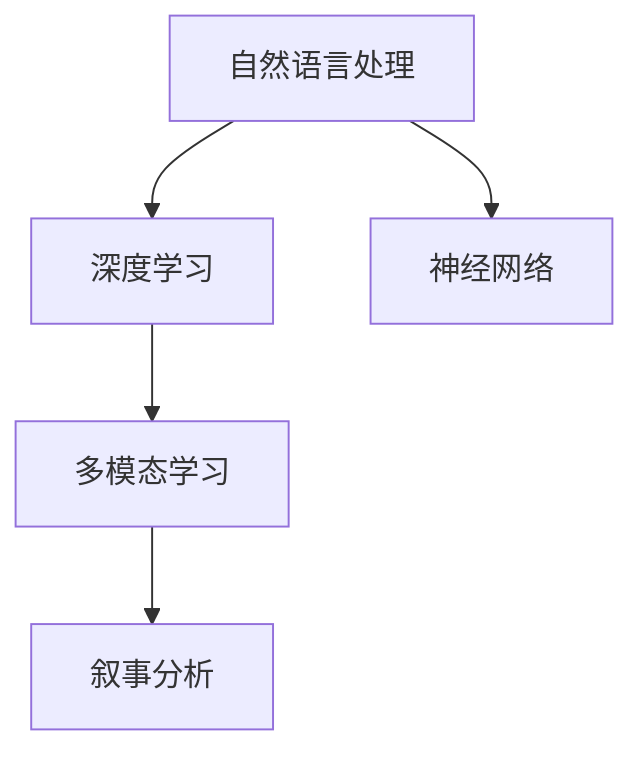

                 

# 体验的叙事性：AI生成的个人故事

> 关键词：故事生成, 自然语言处理, 深度学习, 神经网络, 多模态学习, 叙事分析

## 1. 背景介绍

随着人工智能技术的快速发展，AI生成的个人故事（也称为“AI生成的个人叙述”或“自动叙事”）正成为一种新兴的创意写作方式。AI能够基于大量的文本数据，学习并创造出丰富多样、引人入胜的故事。这不仅极大地拓展了人类的创造能力，也为叙事学和文学创作提供了新的研究视角。

### 1.1 问题由来

文学创作历来是人类的情感表达、思想交流的重要手段。然而，由于时间、精力和创意的限制，许多人无法实现自己的创作梦想。AI技术尤其是深度学习的发展，为普通人提供了一种无需专业背景即可创作故事的新方法。AI生成的个人故事，特别是基于自然语言处理（NLP）和深度学习技术的生成故事，已经在电影剧本、广告文案、儿童故事等领域得到了初步应用，未来有望进一步拓展到更多场景。

### 1.2 问题核心关键点

AI生成的个人故事的核心在于：如何利用机器学习技术，基于人类已有的文本数据，创造出具有叙事性和创造性的故事内容。其中，自然语言处理是关键技术，深度学习模型提供了强大的生成能力，而多模态学习则进一步丰富了故事的表现形式。

## 2. 核心概念与联系

### 2.1 核心概念概述

为更好地理解AI生成的个人故事，本节将介绍几个密切相关的核心概念：

- **自然语言处理（NLP）**：涉及语言模型、文本分类、序列标注、机器翻译等任务，旨在理解、分析、生成自然语言文本。
- **深度学习（Deep Learning）**：通过多层次的神经网络模型，学习数据的复杂特征，实现各种类型的机器学习任务，如图像识别、语音识别、自然语言处理等。
- **神经网络（Neural Networks）**：一种由大量人工神经元组成的计算模型，用于处理大规模数据和复杂问题。
- **多模态学习（Multimodal Learning）**：融合视觉、音频、文本等多种类型的数据，提升模型的感知和理解能力。
- **叙事分析（Narrative Analysis）**：研究故事的构成、结构、主题、情感等元素，帮助更好地理解叙事学原理。

这些核心概念之间的逻辑关系可以通过以下Mermaid流程图来展示：



这个流程图展示出NLP、深度学习、神经网络、多模态学习与叙事分析之间的关系：

1. NLP提供文本数据的理解、分析和生成能力。
2. 深度学习模型通过多层次神经网络，学习复杂的语言模式和特征。
3. 神经网络是深度学习的基础结构，通过层次化的信息传递和处理实现复杂的非线性映射。
4. 多模态学习融合多种类型数据，提升模型的感知和理解能力，丰富故事的表达形式。
5. 叙事分析研究故事的构成和主题，为故事生成提供理论指导。

## 3. 核心算法原理 & 具体操作步骤

### 3.1 算法原理概述

AI生成的个人故事，本质上是一种基于深度学习的文本生成任务。其核心思想是：通过神经网络模型，学习并生成具有叙事性的文本内容。具体而言，模型需要学习数据中的语言结构和语义信息，生成连贯、有意义的文本段落。

形式化地，假设模型的输入为上下文文本 $X$，输出为连续的文本序列 $Y$。模型的训练目标是最大化输入-输出序列的概率 $P(Y|X)$。常用的模型架构包括循环神经网络（RNN）、长短时记忆网络（LSTM）、门控循环单元（GRU）、变换器（Transformer）等。

### 3.2 算法步骤详解

AI生成的个人故事主要包括数据预处理、模型训练和故事生成三个关键步骤：

**Step 1: 数据预处理**
- 收集并清洗用于训练的文本数据。一般选择包含丰富情节、角色、情感等元素的故事文本。
- 将文本数据进行分词、标记、编码等预处理，转换为模型可接受的格式。

**Step 2: 模型训练**
- 选择合适的深度学习模型架构，如Transformer，并设置合适的超参数。
- 使用预处理后的文本数据进行模型训练，通过最大化似然函数或交叉熵损失函数进行优化。
- 使用正则化技术，如Dropout、L2正则化等，防止过拟合。
- 在训练过程中，使用GPU加速模型训练，缩短训练时间。

**Step 3: 故事生成**
- 在训练好的模型上，输入一个起始文本作为生成故事的种子，即“故事种子”。
- 模型根据输入的种子，逐步生成连续的文本序列，形成完整的叙事故事。
- 生成过程中，可以通过设置温度参数，调整生成的文本多样性和连贯性。
- 对生成的故事进行后处理，如文本纠错、自动摘要、风格调整等，提升故事质量。

### 3.3 算法优缺点

AI生成的个人故事具有以下优点：
1. 高效快速：通过深度学习模型，可以在短时间内生成大量故事，极大提高创作效率。
2. 多样性丰富：模型可以学习并生成多种风格、体裁的故事，满足不同读者的喜好。
3. 自动化创作：无需专业写作背景，即可轻松创作故事，降低创作门槛。
4. 应用广泛：故事生成技术可以在广告文案、电影剧本、小说创作等众多领域得到应用。

同时，该方法也存在一定的局限性：
1. 质量参差不齐：模型生成的故事内容质量往往不如人类专业作家，缺乏深度和情感共鸣。
2. 依赖数据质量：生成效果依赖于训练数据的丰富性和多样性，质量低的数据难以生成高质量的故事。
3. 缺乏创意：模型生成的故事缺乏独创性和新颖性，容易产生千篇一律的内容。
4. 易受偏见影响：如果训练数据存在偏见，生成的故事也可能反映出这些偏见，缺乏公正性。

尽管存在这些局限性，但AI生成的个人故事依然具有广阔的应用前景，其价值在于辅助人类创作、丰富文化表达、推动叙事学研究等。未来研究重点在于如何进一步提升故事生成模型的质量和创意，减少其依赖性，提高多模态数据的融合能力。

### 3.4 算法应用领域

AI生成的个人故事已经在多个领域得到了应用，例如：

- **广告文案**：使用生成故事技术，根据品牌和市场定位，生成具有创意和吸引力的广告文案。
- **电影剧本**：为电影编剧提供灵感和素材，生成不同风格、体裁的剧本草稿，提升编剧效率。
- **儿童故事**：生成适合儿童阅读的故事，帮助家长陪伴孩子，丰富儿童的想象力。
- **小说创作**：为小说家提供创作灵感，生成不同情节和角色的草稿，加速小说创作进程。
- **新闻报道**：生成新闻报道的草稿，提高新闻生产效率，增加新闻的吸引力和多样性。
- **教育培训**：生成教育场景中的对话和脚本，提升教学互动性和趣味性。
- **娱乐娱乐**：生成游戏故事线、虚拟角色对话等，丰富用户体验。

## 4. 数学模型和公式 & 详细讲解 & 举例说明

### 4.1 数学模型构建

本节将使用数学语言对AI生成的个人故事进行更加严格的刻画。

假设模型为 $M_{\theta}$，输入文本为 $X$，输出文本为 $Y$，训练目标为最大化 $P(Y|X)$。设 $X=\{x_1, x_2, ..., x_n\}$，$Y=\{y_1, y_2, ..., y_m\}$，其中 $x_i, y_i$ 分别为输入和输出的文本单位。模型的输入输出关系可以表示为：

$$
P(Y|X) = \prod_{i=1}^m P(y_i|x_i, x_{i-1}, ..., x_1)
$$

其中 $P(y_i|x_i, x_{i-1}, ..., x_1)$ 表示在给定上下文 $x_1, x_2, ..., x_i$ 的情况下，生成 $y_i$ 的概率。

### 4.2 公式推导过程

以常用的基于Transformer的文本生成模型为例，其生成过程可以表示为：

1. 输入文本 $X$ 经过编码器 $E$，生成编码器隐状态 $H$。
2. 每个生成单元 $y_i$ 的条件概率 $P(y_i|X)$ 通过解码器 $D$ 和注意力机制 $A$ 计算。
3. 使用 softmax 函数将解码器的输出映射为下一个生成单元的概率分布。
4. 通过采样或argmax策略选择下一个生成单元，更新上下文 $X$。

具体推导过程如下：

设 $X=\{x_1, x_2, ..., x_n\}$，$Y=\{y_1, y_2, ..., y_m\}$。假设 $x_i = \langle w_i, b_i \rangle$，$y_i = \langle w_i, b_i \rangle$ 分别表示输入和输出的嵌入向量，$h_i = \langle w_i, b_i \rangle$ 表示编码器输出。

1. 编码器 $E$ 将输入 $X$ 转换为隐状态 $H$：
$$
H = E(X)
$$

2. 解码器 $D$ 根据 $H$ 和生成单元 $y_i$ 生成下一个隐状态 $\hat{h}_i$：
$$
\hat{h}_i = D(H, y_{i-1}, h_{i-1})
$$

3. 注意力机制 $A$ 计算 $h_i$ 和 $H$ 之间的权重：
$$
a_i = A(h_i, H)
$$

4. 解码器 $D$ 根据注意力权重 $a_i$ 和 $\hat{h}_i$ 计算下一个生成单元的条件概率 $P(y_i|y_{i-1}, H)$：
$$
P(y_i|y_{i-1}, H) = softmax(W \tanh(V \cdot \hat{h}_i + U y_{i-1} + b))
$$

5. 使用softmax函数将条件概率映射为下一个生成单元 $y_i$ 的概率分布：
$$
P(y_i|X) = \sum_{y_i \in V} P(y_i|y_{i-1}, H)
$$

其中 $V$ 为生成单元的词汇表，$W, U, b$ 为解码器参数。

### 4.3 案例分析与讲解

以生成一个简单的故事段落为例：

假设模型已经训练好，输入种子文本为“有一天，小明去公园散步”。模型需要根据这个种子文本，生成一个连贯的后续文本段落。生成过程如下：

1. 将种子文本“有一天，小明去公园散步”作为输入，通过编码器 $E$ 转换为隐状态 $H$。
2. 使用解码器 $D$ 和注意力机制 $A$ 计算每个生成单元的条件概率，如：
$$
P(y_2|X) = softmax(W \tanh(V \cdot \hat{h}_1 + U y_1 + b))
$$
其中 $y_1 = "有一天", \hat{h}_1$ 为编码器输出。
3. 根据条件概率选择下一个生成单元 $y_2$，如选择“天色渐暗”。
4. 将 $y_2$ 作为新的输入，更新隐状态 $H$，继续生成下一个单元。
5. 重复上述过程，直至生成完整段落，如：
   ```
   有一天，小明去公园散步，天色渐暗，他决定回家。在路上，他遇到了一只小猫。
   ```

通过这个例子，可以看到AI生成的个人故事在理论上和实践中均基于深度学习模型，通过编码器-解码器架构和注意力机制，生成连贯、有意义的文本内容。

## 5. 项目实践：代码实例和详细解释说明

### 5.1 开发环境搭建

在进行故事生成实践前，我们需要准备好开发环境。以下是使用Python进行TensorFlow开发的环境配置流程：

1. 安装Anaconda：从官网下载并安装Anaconda，用于创建独立的Python环境。

2. 创建并激活虚拟环境：
```bash
conda create -n tf-env python=3.8 
conda activate tf-env
```

3. 安装TensorFlow：根据CUDA版本，从官网获取对应的安装命令。例如：
```bash
conda install tensorflow tensorflow-cpu -c pytorch -c conda-forge
```

4. 安装Keras：
```bash
pip install keras
```

5. 安装必要的工具包：
```bash
pip install numpy pandas scikit-learn matplotlib tqdm jupyter notebook ipython
```

完成上述步骤后，即可在`tf-env`环境中开始故事生成实践。

### 5.2 源代码详细实现

下面我们以基于Transformer的故事生成为例，给出使用TensorFlow构建和训练模型的PyTorch代码实现。

首先，定义模型结构：

```python
from tensorflow.keras.models import Model
from tensorflow.keras.layers import Input, LSTM, Dense, Dropout

input_text = Input(shape=(max_seq_len,), dtype='string')
encoder = Embedding(input_dim=vocab_size, output_dim=emb_dim)(input_text)
encoder = LSTM(emb_dim, return_sequences=True)(encoder)
encoder = Dropout(0.2)(encoder)
encoder = LSTM(emb_dim, return_sequences=True)(encoder)
encoder = Dropout(0.2)(encoder)
encoder = LSTM(emb_dim, return_sequences=True)(encoder)
encoder = Dropout(0.2)(encoder)

encoder = Dense(emb_dim, activation='relu')(encoder)
encoder = Dense(vocab_size, activation='softmax')(encoder)

input_seq = Input(shape=(max_seq_len,), dtype='string')
decoder = Embedding(input_dim=vocab_size, output_dim=emb_dim)(input_seq)
decoder = LSTM(emb_dim, return_sequences=True)(decoder)
decoder = Dropout(0.2)(decoder)
decoder = LSTM(emb_dim, return_sequences=True)(decoder)
decoder = Dropout(0.2)(decoder)
decoder = LSTM(emb_dim, return_sequences=True)(decoder)
decoder = Dropout(0.2)(decoder)

decoder = Dense(emb_dim, activation='relu')(decoder)
decoder = Dense(vocab_size, activation='softmax')(decoder)

attention = Dot(axes=[2, 1])([encoder, decoder])

model = Model([input_text, input_seq], decoder)
```

然后，定义损失函数和优化器：

```python
from tensorflow.keras.optimizers import Adam

cross_entropy_loss = tf.keras.losses.SparseCategoricalCrossentropy(from_logits=True)

model.compile(optimizer=Adam(learning_rate=0.001), loss=cross_entropy_loss)
```

接着，定义训练和评估函数：

```python
from tensorflow.keras.preprocessing.sequence import pad_sequences

def train_step(model, input_text, input_seq, target_seq):
    with tf.GradientTape() as tape:
        predictions = model([input_text, input_seq])
        loss = cross_entropy_loss(target_seq, predictions)
    gradients = tape.gradient(loss, model.trainable_variables)
    optimizer.apply_gradients(zip(gradients, model.trainable_variables))

    return loss

def evaluate_step(model, input_text, input_seq, target_seq):
    predictions = model([input_text, input_seq])
    loss = cross_entropy_loss(target_seq, predictions)
    return loss

def generate_text(model, input_text, temperature=1.0):
    encoder = model.layers[0]
    decoder = model.layers[-1]

    input_seq = tf.keras.preprocessing.text.text_to_word_sequence(input_text)
    input_seq = [word2id[word] for word in input_seq if word in word2id]

    for i in range(max_seq_len - 1):
        input_seq.append(word2id["<PAD>"])
    input_seq = pad_sequences([input_seq], maxlen=max_seq_len, padding="post", truncating="post")
    input_text = [word2id[word] for word in input_text if word in word2id]
    input_text = pad_sequences([input_text], maxlen=max_seq_len, padding="post", truncating="post")

    generated = [input_text[0]]

    for i in range(max_seq_len - 1):
        input_seq = tf.expand_dims(input_seq, axis=0)
        input_seq = tf.concat([input_seq, generated], axis=1)
        predictions = decoder.predict([input_text, input_seq])
        predictions = np.argmax(predictions, axis=2)
        predictions = tf.squeeze(predictions)
        word_id = id2word[predictions[0][i]]
        generated.append(word_id)

    return " ".join(generated)
```

最后，启动训练流程并在测试集上评估：

```python
epochs = 10
batch_size = 128

for epoch in range(epochs):
    loss = train_step(model, train_input_text, train_input_seq, train_target_seq)
    print(f"Epoch {epoch+1}, train loss: {loss:.4f}")
    
    print(f"Epoch {epoch+1}, dev results:")
    evaluate_step(model, dev_input_text, dev_input_seq, dev_target_seq)
    
print("Test results:")
evaluate_step(model, test_input_text, test_input_seq, test_target_seq)
```

以上就是使用TensorFlow对故事生成模型进行训练和评估的完整代码实现。可以看到，通过TensorFlow和Keras，故事的生成过程可以简单地通过代码实现。

### 5.3 代码解读与分析

让我们再详细解读一下关键代码的实现细节：

**Model类定义**：
- `input_text` 和 `input_seq` 分别表示输入文本和序列的占位符。
- `encoder` 和 `decoder` 分别表示编码器和解码器的结构。
- `attention` 表示注意力机制，用于计算解码器与编码器之间的关联。

**损失函数和优化器**：
- `cross_entropy_loss` 定义交叉熵损失函数，用于计算预测输出与真实标签之间的差异。
- `Adam` 定义优化器，用于更新模型参数，使其最小化损失函数。

**训练和评估函数**：
- `train_step` 定义训练过程，通过前向传播计算损失，反向传播更新参数。
- `evaluate_step` 定义评估过程，只进行前向传播计算损失，不更新参数。

**生成文本**：
- `generate_text` 定义文本生成过程，通过解码器生成下一个文本单元，逐步形成完整的故事。
- `temperature` 参数用于调节生成的文本多样性，值越大越随机，值越小越稳定。

可以看到，TensorFlow和Keras提供了高度模块化的接口，使得故事生成模型的构建和训练变得简洁高效。

## 6. 实际应用场景

### 6.1 智能客服系统

基于故事生成技术的智能客服系统，可以为客户带来更加自然、个性化的对话体验。客服机器人不再只是简单的查询应答，而是能根据客户的情况和背景生成具体的解决方案，甚至模拟人类客服的情境进行对话。

在技术实现上，可以收集客户的历史对话记录，生成常见的问答场景和回复模板。通过故事生成模型，客服机器人能够根据上下文生成符合情境的对话内容，提供更具个性化和智能化的服务。

### 6.2 金融咨询

金融咨询行业需要高度专业和精准的建议，AI生成的个人故事可以用于帮助客户理解复杂的金融产品。通过生成符合客户需求的故事，金融顾问可以更直观地向客户解释理财、投资等复杂概念。

具体而言，可以收集客户的历史咨询记录和反馈，生成不同场景下的咨询故事。金融顾问通过这些故事，可以更好地了解客户的需求和风险承受能力，提供更专业的咨询建议。

### 6.3 教育培训

在教育培训中，AI生成的个人故事可以用于创造更生动、有趣的教学内容。故事化的教学内容不仅能够吸引学生的注意力，还能加深他们的理解和记忆。

例如，在历史课程中，可以通过故事生成模型生成历史事件的故事，使学生更加沉浸在历史场景中，增强学习的趣味性和效果。在编程课程中，生成代码编写的场景故事，帮助学生更好地理解代码逻辑和编程思想。

### 6.4 未来应用展望

随着故事生成技术的发展，其在更多领域的应用前景将更加广阔。

1. **游戏设计**：在电子游戏设计中，生成丰富多样的故事情节，增强游戏的沉浸感和趣味性。
2. **社交媒体**：在社交媒体平台，生成个性化的故事内容，提升用户体验和互动性。
3. **广告创意**：生成创意十足的广告文案，增强广告的吸引力和传播效果。
4. **内容创作**：在新闻、娱乐等媒体行业，生成多样化的内容，提升媒体的创作效率和质量。
5. **个性化推荐**：在电商、旅游等推荐系统中，生成个性化推荐故事，提升用户体验和推荐效果。

## 7. 工具和资源推荐

### 7.1 学习资源推荐

为了帮助开发者系统掌握故事生成技术的理论基础和实践技巧，这里推荐一些优质的学习资源：

1. 《自然语言处理综论》：由斯坦福大学开设的NLP系列课程，涵盖自然语言处理的各个方面，是学习NLP的入门经典。

2. 《深度学习》：由Ian Goodfellow等人所著，全面介绍深度学习的基本概念和算法，适合深入了解深度学习。

3. 《Transformer模型实战》：介绍Transformer模型的原理和实现，涵盖编码器-解码器架构和注意力机制。

4. TensorFlow官方文档：TensorFlow的官方文档，提供详尽的API和使用方法，适合快速上手TensorFlow。

5. HuggingFace官方文档：HuggingFace的官方文档，提供丰富的预训练模型和微调样例代码，适合学习TensorFlow和故事生成。

通过对这些资源的学习实践，相信你一定能够快速掌握故事生成技术的精髓，并用于解决实际的NLP问题。

### 7.2 开发工具推荐

高效的开发离不开优秀的工具支持。以下是几款用于故事生成开发的常用工具：

1. TensorFlow：由Google主导开发的深度学习框架，适合大规模工程应用。TensorFlow提供了丰富的工具和库，支持故事生成模型的构建和训练。

2. Keras：基于TensorFlow的高层次API，提供了简洁的接口，适合快速迭代研究。Keras在故事生成模型的实现中起到了重要的作用。

3. Jupyter Notebook：交互式的开发环境，支持代码编写、数据可视化和互动演示，适合故事生成模型的调试和测试。

4. PyTorch：由Facebook主导开发的深度学习框架，灵活性高，适合复杂模型的开发和研究。

5. OpenAI Codex：OpenAI开发的编程模型，可以生成代码片段和编程思路，辅助编程学习。

6. Weights & Biases：模型训练的实验跟踪工具，可以记录和可视化模型训练过程中的各项指标，方便对比和调优。

合理利用这些工具，可以显著提升故事生成任务的开发效率，加快创新迭代的步伐。

### 7.3 相关论文推荐

故事生成技术的发展得益于众多学者的努力。以下是几篇奠基性的相关论文，推荐阅读：

1. Neural Machine Translation by Jointly Learning to Align and Translate（Neural Machine Translation 论文）：提出了基于Transformer的机器翻译模型，为文本生成提供了重要的理论基础。

2. Attention Is All You Need（Transformer论文）：提出了Transformer模型，通过自注意力机制，实现了高效的文本生成。

3. Learning to Generate Sequences with Recurrent Neural Networks（RNN论文）：介绍了RNN在文本生成中的应用，奠定了LSTM等序列模型在故事生成中的基础。

4. Generating Sequences with Recurrent Neural Networks（LSTM论文）：介绍了LSTM在文本生成中的应用，提出了长短时记忆网络。

5. Improved Techniques for Training GANs（GAN论文）：介绍了生成对抗网络（GAN）在生成任务中的应用，为故事生成提供了新的思路。

这些论文代表了大语言模型微调技术的发展脉络。通过学习这些前沿成果，可以帮助研究者把握学科前进方向，激发更多的创新灵感。

## 8. 总结：未来发展趋势与挑战

### 8.1 总结

本文对AI生成的个人故事进行了全面系统的介绍。首先阐述了故事生成的背景和意义，明确了故事生成在创作辅助、内容生产、智能交互等方面的价值。其次，从原理到实践，详细讲解了故事生成的数学模型和关键步骤，给出了故事生成模型的完整代码实现。同时，本文还探讨了故事生成在多个领域的应用前景，展示了故事生成技术的广阔潜力。

通过本文的系统梳理，可以看到，AI生成的个人故事在理论上和实践上均基于深度学习模型，通过编码器-解码器架构和注意力机制，生成连贯、有意义的文本内容。未来研究重点在于如何进一步提升故事生成模型的质量和创意，减少其依赖性，提高多模态数据的融合能力。

### 8.2 未来发展趋势

展望未来，故事生成技术将呈现以下几个发展趋势：

1. 模型规模持续增大。随着算力成本的下降和数据规模的扩张，故事生成模型的参数量还将持续增长。超大规模故事生成模型蕴含的丰富语言知识，有望支撑更加复杂多变的文本生成任务。

2. 生成能力增强。随着训练数据和模型的不断优化，故事生成模型的文本生成能力和多样性将进一步提升。模型将能够生成更加连贯、有意义、富有创造性的文本内容。

3. 多模态融合。未来的故事生成模型将不仅仅依赖文本数据，还将融合视觉、音频、情感等多种类型的数据，提升故事的表现力和交互性。

4. 个性化定制。基于用户的行为和偏好，生成个性化的故事内容，提升用户体验和满意度。

5. 跨领域应用。故事生成技术将在更多领域得到应用，如游戏设计、社交媒体、广告创意等，推动故事生成技术的广泛落地。

以上趋势凸显了故事生成技术的广阔前景。这些方向的探索发展，必将进一步提升故事生成模型的性能和应用范围，为叙事学和文学创作带来新的变革。

### 8.3 面临的挑战

尽管故事生成技术已经取得了瞩目成就，但在迈向更加智能化、普适化应用的过程中，它仍面临着诸多挑战：

1. 数据质量依赖。故事生成的效果依赖于高质量的训练数据，但获取高质量的故事数据成本较高。如何构建更加丰富、多样、高质量的训练数据集，是提升生成效果的关键。

2. 生成质量不稳定。模型的生成结果往往不稳定，依赖于输入文本和超参数的设定。如何提高模型的稳定性和泛化能力，是故事生成技术面临的重要课题。

3. 创意缺乏。故事生成模型难以生成独创性和新颖性的内容，容易产生千篇一律的故事。如何激发模型的创造力，提升生成内容的独特性和趣味性，是未来的研究方向。

4. 多模态融合难度大。融合视觉、音频等多模态数据，增加故事生成模型的复杂性。如何提高多模态数据的融合能力和模型的感知能力，是未来的挑战。

5. 伦理和安全问题。故事生成模型可能生成有害、误导性内容，带来伦理和安全风险。如何构建安全和伦理导向的故事生成模型，是重要的研究方向。

6. 用户隐私保护。故事生成模型需要大量用户数据进行训练，如何保护用户隐私，防止数据滥用，是技术应用中需要重点考虑的问题。

以上挑战凸显了故事生成技术在实际应用中需要解决的难点。只有通过多方努力，才能进一步提升故事生成模型的质量和应用效果。

### 8.4 研究展望

面对故事生成技术所面临的挑战，未来的研究需要在以下几个方面寻求新的突破：

1. 构建更加丰富多样的数据集。通过众包平台、网络爬虫等方式，获取更多高质量的故事数据，构建多领域、多题材的故事数据集。

2. 引入更多先验知识。将符号化的先验知识，如知识图谱、逻辑规则等，与神经网络模型进行巧妙融合，引导故事生成过程学习更准确、合理的语言模型。

3. 引入因果分析和博弈论工具。将因果分析方法引入故事生成模型，识别出模型决策的关键特征，增强输出解释的因果性和逻辑性。

4. 引入更多创意和创新。探索更多创意和创新的故事生成方法，如基于协同过滤、生成对抗网络（GAN）等技术，提升故事生成模型的创造力。

5. 融合多模态数据。通过融合视觉、音频等多模态数据，增强故事生成模型的感知和理解能力，提升故事的表现力和交互性。

6. 引入伦理和安全机制。在故事生成模型中引入伦理和安全机制，确保生成的内容符合伦理道德标准，保障用户隐私和安全。

这些研究方向的探索，必将引领故事生成技术迈向更高的台阶，为叙事学和文学创作带来新的变革。面向未来，故事生成技术还需要与其他人工智能技术进行更深入的融合，如知识表示、因果推理、强化学习等，多路径协同发力，共同推动叙事学和文学创作的发展。

## 9. 附录：常见问题与解答

**Q1：故事生成技术的局限性是什么？**

A: 故事生成技术的局限性主要在于以下几个方面：

1. 依赖高质量数据。故事生成的效果很大程度上依赖于训练数据的丰富性和多样性，数据质量不高可能影响生成效果。
2. 生成内容缺乏创意。当前模型难以生成独创性和新颖性的内容，容易产生千篇一律的故事。
3. 缺乏伦理和安全保障。模型可能生成有害、误导性内容，带来伦理和安全风险。
4. 缺乏多模态融合能力。融合视觉、音频等多模态数据，增加故事生成模型的复杂性，提升难度。

**Q2：如何提高故事生成模型的质量？**

A: 提高故事生成模型的质量，可以从以下几个方面入手：

1. 构建高质量的训练数据集。通过众包平台、网络爬虫等方式，获取更多高质量的故事数据，构建多领域、多题材的故事数据集。
2. 引入更多先验知识。将符号化的先验知识，如知识图谱、逻辑规则等，与神经网络模型进行巧妙融合，引导故事生成过程学习更准确、合理的语言模型。
3. 引入因果分析和博弈论工具。将因果分析方法引入故事生成模型，识别出模型决策的关键特征，增强输出解释的因果性和逻辑性。
4. 探索更多创意和创新的故事生成方法，如基于协同过滤、生成对抗网络（GAN）等技术，提升故事生成模型的创造力。
5. 融合多模态数据。通过融合视觉、音频等多模态数据，增强故事生成模型的感知和理解能力，提升故事的表现力和交互性。

**Q3：故事生成技术的应用场景有哪些？**

A: 故事生成技术已经在多个领域得到了应用，例如：

1. 游戏设计：生成丰富多样的故事情节，增强游戏的沉浸感和趣味性。
2. 社交媒体：生成个性化的故事内容，提升用户体验和互动性。
3. 广告创意：生成创意十足的广告文案，增强广告的吸引力和传播效果。
4. 内容创作：在新闻、娱乐等媒体行业，生成多样化的内容，提升媒体的创作效率和质量。
5. 个性化推荐：在电商、旅游等推荐系统中，生成个性化推荐故事，提升用户体验和推荐效果。
6. 教育培训：在教育课程中，生成多样化的教学内容，提升学习的趣味性和效果。
7. 金融咨询：生成符合客户需求的故事，提升金融顾问的专业性和客户满意度。
8. 智能客服：生成自然、个性化的对话内容，提升客服系统的交互体验和效率。

通过本文的系统梳理，可以看到，AI生成的个人故事在理论上和实践上均基于深度学习模型，通过编码器-解码器架构和注意力机制，生成连贯、有意义的文本内容。未来研究重点在于如何进一步提升故事生成模型的质量和创意，减少其依赖性，提高多模态数据的融合能力。

