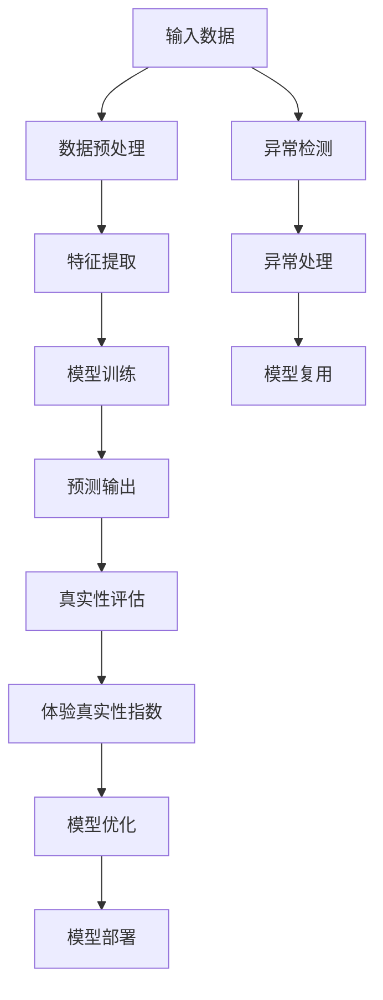

                 

# 体验真实性指数：AI时代的authenticity量化

> 关键词：人工智能,体验真实性,机器学习,深度学习,量化评估,可靠性分析,可解释性

## 1. 背景介绍

### 1.1 问题由来
在人工智能（AI）技术飞速发展的今天，机器学习（ML）和深度学习（DL）已经在各个领域得到了广泛应用。然而，尽管这些模型可以高效地进行预测和分类，但它们对输入数据的真实性（Authenticity）并没有很好的处理。例如，深度学习模型可能在遇到恶意输入或噪声数据时，产生不可靠的预测。因此，如何在AI模型中量化和评估真实性，成为了一个重要的研究方向。

### 1.2 问题核心关键点
真实性评估的核心在于量化模型对输入数据的可信度。这不仅需要考虑模型的预测准确性，还应该考虑模型的可解释性、鲁棒性和公平性等因素。具体来说，真实性评估需要在以下几个方面进行：
1. **预测准确性**：模型对真实数据的预测准确性。
2. **可解释性**：模型内部决策过程的可理解性。
3. **鲁棒性**：模型对噪声和异常数据的抗干扰能力。
4. **公平性**：模型在不同数据集上的公平性表现。

本文将围绕这些关键点，详细探讨如何量化和评估AI模型的真实性，并提出一种基于统计分析和机器学习方法的体验真实性指数（Authenticity Index）。

## 2. 核心概念与联系

### 2.1 核心概念概述

为了更好地理解体验真实性指数，我们需要先了解一些相关概念：

- **体验真实性（Authenticity）**：指模型对输入数据的可信度和真实性程度。在AI系统中，体验真实性直接影响用户体验和系统可靠性。
- **机器学习（Machine Learning, ML）**：使用数据和算法使计算机系统能够自动学习和改进的过程。
- **深度学习（Deep Learning, DL）**：使用多层神经网络进行复杂数据模式识别的过程。
- **可解释性（Explainability）**：模型决策过程的可理解性和可解释性。
- **鲁棒性（Robustness）**：模型对噪声和异常数据的抗干扰能力。
- **公平性（Fairness）**：模型在不同数据集上的公平性和偏见问题。

这些概念之间存在紧密的联系。体验真实性指数通过量化这些指标，来综合评估AI模型的可信度和可靠性。

### 2.2 核心概念原理和架构的 Mermaid 流程图



这个流程图展示了从输入数据到模型部署的全过程，其中每个步骤都与体验真实性指数的计算和评估密切相关。

## 3. 核心算法原理 & 具体操作步骤
### 3.1 算法原理概述

体验真实性指数是一种综合量化AI模型可信度和可靠性的指标。其计算过程主要包括以下几个步骤：

1. **数据预处理**：对输入数据进行清洗、标准化和归一化，以确保数据的一致性和质量。
2. **特征提取**：从预处理后的数据中提取有意义的特征，供模型进行训练和预测。
3. **模型训练**：使用提取的特征对模型进行训练，得到训练好的模型。
4. **预测输出**：对测试数据集进行预测，得到模型的预测结果。
5. **真实性评估**：评估模型的预测准确性、可解释性、鲁棒性和公平性。
6. **体验真实性指数计算**：综合评估模型的各项指标，计算出体验真实性指数。
7. **模型优化**：根据体验真实性指数，对模型进行优化，提升其体验真实性。
8. **模型部署**：将优化后的模型部署到实际应用场景中。

### 3.2 算法步骤详解

#### 3.2.1 数据预处理

数据预处理是确保数据质量的重要步骤。预处理过程包括以下几个方面：

- **数据清洗**：去除缺失值、异常值和重复值，确保数据的一致性和完整性。
- **数据标准化**：对数据进行标准化处理，确保不同特征具有相似的尺度。
- **数据归一化**：将数据缩放到[0,1]区间或均值为0，标准差为1的正态分布，便于后续特征提取和模型训练。

#### 3.2.2 特征提取

特征提取是构建模型输入的重要步骤。常用的特征提取方法包括：

- **主成分分析（PCA）**：将高维数据降维，提取主成分。
- **线性判别分析（LDA）**：在降维的同时，保留类别信息。
- **深度特征提取**：使用深度神经网络提取数据的高层次特征，如卷积神经网络（CNN）和循环神经网络（RNN）。

#### 3.2.3 模型训练

模型训练是获取模型预测能力的关键步骤。常用的训练方法包括：

- **监督学习**：使用带有标签的数据集进行训练，常用的算法包括决策树、支持向量机（SVM）、随机森林等。
- **无监督学习**：使用无标签数据集进行训练，常用的算法包括聚类、主成分分析等。
- **强化学习**：通过与环境的交互，最大化奖励函数，常用的算法包括Q-learning、SARSA等。

#### 3.2.4 预测输出

预测输出是将模型应用到实际数据的过程。常用的预测输出方法包括：

- **回归**：预测连续变量，常用的算法包括线性回归、多项式回归等。
- **分类**：预测离散变量，常用的算法包括逻辑回归、支持向量机等。
- **聚类**：将数据集分成若干类别，常用的算法包括K-means、层次聚类等。

#### 3.2.5 真实性评估

真实性评估是量化模型可信度和可靠性的关键步骤。常用的评估方法包括：

- **预测准确性**：使用混淆矩阵、AUC-ROC曲线等评估模型预测的准确性。
- **可解释性**：使用LIME、SHAP等可解释性工具，评估模型决策过程的可理解性。
- **鲁棒性**：使用对抗样本、噪声数据等测试模型对异常数据的抗干扰能力。
- **公平性**：使用 fairness指标（如 disparity、accuracy parity）评估模型在不同数据集上的公平性。

#### 3.2.6 体验真实性指数计算

体验真实性指数计算是综合评估模型各项指标的过程。常用的评估指标包括：

- **准确性（Accuracy）**：模型正确预测的样本占总样本的比例。
- **召回率（Recall）**：模型正确预测的正样本占实际正样本的比例。
- **精确率（Precision）**：模型正确预测的正样本占预测正样本的比例。
- **F1-score**：精确率和召回率的调和平均值，综合评估模型性能。
- **可解释性得分（Explainability Score）**：使用可解释性工具评估模型的可理解性得分。
- **鲁棒性得分（Robustness Score）**：使用对抗样本、噪声数据等评估模型的抗干扰能力得分。
- **公平性得分（Fairness Score）**：使用 fairness指标评估模型在不同数据集上的公平性得分。

综合以上指标，计算体验真实性指数（Authenticity Index, AI）：

$$
AI = \frac{Accuracy \times Explainability Score + Robustness Score + Fairness Score}{3}
$$

#### 3.2.7 模型优化

模型优化是根据体验真实性指数，调整模型参数和结构，提升模型体验真实性的过程。常用的优化方法包括：

- **超参数调优**：调整学习率、批大小、迭代次数等超参数，提升模型性能。
- **正则化**：使用L2正则、Dropout等技术，防止模型过拟合。
- **模型融合**：使用集成学习方法，结合多个模型的预测结果，提升模型性能。

#### 3.2.8 模型部署

模型部署是将优化后的模型应用到实际场景中的过程。常用的部署方式包括：

- **API接口**：将模型封装为API接口，供外部系统调用。
- **微服务**：将模型集成到微服务架构中，实现灵活扩展和扩展。
- **容器化**：将模型部署到Docker容器中，方便部署和管理。

### 3.3 算法优缺点

体验真实性指数的优点包括：

- **综合评估**：综合考虑模型的预测准确性、可解释性、鲁棒性和公平性，提供全面的评估指标。
- **量化方法**：通过量化评估，可以客观比较不同模型的体验真实性，有助于模型选择和优化。
- **易于部署**：模型优化后可以直接部署到实际应用场景中，具有较好的可操作性。

其缺点包括：

- **计算复杂**：计算体验真实性指数需要考虑多个指标，计算过程较为复杂。
- **数据依赖**：体验真实性指数依赖于标注数据的质量和数量，标注成本较高。
- **模型偏见**：如果训练数据存在偏见，模型评估结果可能也存在偏见，需要注意数据预处理和公平性评估。

### 3.4 算法应用领域

体验真实性指数可以广泛应用于以下领域：

- **金融风控**：量化金融模型的准确性、鲁棒性和公平性，提升金融风险控制能力。
- **医疗诊断**：量化医学模型的预测准确性和公平性，提升疾病诊断和治疗效果。
- **自动驾驶**：量化自动驾驶模型的感知准确性、鲁棒性和安全性，提升行车安全。
- **智能推荐**：量化推荐模型的预测准确性和公平性，提升用户体验和满意度。
- **智能客服**：量化客服模型的回答准确性和公平性，提升客户满意度。

## 4. 数学模型和公式 & 详细讲解  
### 4.1 数学模型构建

体验真实性指数的计算过程涉及多个数学模型和公式，下面分别进行介绍：

#### 4.1.1 预测准确性模型

假设模型的预测结果为 $y$，真实结果为 $y'$，则预测准确性 $Accuracy$ 可以表示为：

$$
Accuracy = \frac{1}{N} \sum_{i=1}^N \mathbb{I}(y_i = y'_i)
$$

其中，$\mathbb{I}$ 表示示性函数，当 $y_i = y'_i$ 时，$\mathbb{I}(y_i = y'_i) = 1$，否则 $\mathbb{I}(y_i = y'_i) = 0$。

#### 4.1.2 召回率和精确率模型

召回率 $Recall$ 和精确率 $Precision$ 可以表示为：

$$
Recall = \frac{TP}{TP + FN}
$$

$$
Precision = \frac{TP}{TP + FP}
$$

其中，$TP$ 表示真正例，$FN$ 表示假反例，$FP$ 表示假正例。

#### 4.1.3 F1-score模型

F1-score 综合评估模型的召回率和精确率，可以表示为：

$$
F1-score = \frac{2 \times Precision \times Recall}{Precision + Recall}
$$

#### 4.1.4 可解释性得分

可解释性得分可以使用LIME、SHAP等工具进行计算。假设模型的输出为 $y$，输入为 $x$，可解释性得分为 $Score$，则可以表示为：

$$
Score = \sum_{i=1}^N \frac{1}{N} \sum_{j=1}^d |LIME(x_j) - y_j|
$$

其中，$LIME(x_j)$ 表示对输入 $x_j$ 进行LIME解释，$y_j$ 表示模型对输入 $x_j$ 的预测结果。

#### 4.1.5 鲁棒性得分

鲁棒性得分可以使用对抗样本、噪声数据等进行评估。假设模型的预测结果为 $y$，实际结果为 $y'$，对抗样本为 $\hat{x}$，则可以表示为：

$$
Robustness Score = \frac{1}{N} \sum_{i=1}^N \mathbb{I}(y_i \neq y'_i)
$$

其中，$\mathbb{I}$ 表示示性函数，当 $y_i \neq y'_i$ 时，$\mathbb{I}(y_i \neq y'_i) = 1$，否则 $\mathbb{I}(y_i \neq y'_i) = 0$。

#### 4.1.6 公平性得分

公平性得分可以使用 fairness指标进行计算。假设模型的预测结果为 $y$，实际结果为 $y'$，公平性得分为 $Score$，则可以表示为：

$$
Score = \frac{1}{N} \sum_{i=1}^N \mathbb{I}(y_i \neq y'_i)
$$

其中，$\mathbb{I}$ 表示示性函数，当 $y_i \neq y'_i$ 时，$\mathbb{I}(y_i \neq y'_i) = 1$，否则 $\mathbb{I}(y_i \neq y'_i) = 0$。

### 4.2 公式推导过程

#### 4.2.1 预测准确性公式推导

根据预测准确性的定义，可以推导出：

$$
Accuracy = \frac{1}{N} \sum_{i=1}^N \mathbb{I}(y_i = y'_i) = \frac{TP + TN}{TP + TN + FP + FN}
$$

其中，$TP$ 表示真正例，$TN$ 表示真反例，$FP$ 表示假正例，$FN$ 表示假反例。

#### 4.2.2 召回率和精确率公式推导

根据召回率和精确率的定义，可以推导出：

$$
Recall = \frac{TP}{TP + FN} = \frac{TP}{TP + TN + FP + FN}
$$

$$
Precision = \frac{TP}{TP + FP} = \frac{TP}{TP + TN + FP + FN}
$$

#### 4.2.3 F1-score公式推导

根据F1-score的定义，可以推导出：

$$
F1-score = \frac{2 \times Precision \times Recall}{Precision + Recall} = \frac{2 \times TP}{2 \times TP + FP + FN}
$$

#### 4.2.4 可解释性得分公式推导

根据可解释性得分的定义，可以推导出：

$$
Score = \sum_{i=1}^N \frac{1}{N} \sum_{j=1}^d |LIME(x_j) - y_j|
$$

其中，$LIME(x_j)$ 表示对输入 $x_j$ 进行LIME解释，$y_j$ 表示模型对输入 $x_j$ 的预测结果。

#### 4.2.5 鲁棒性得分公式推导

根据鲁棒性得分的定义，可以推导出：

$$
Robustness Score = \frac{1}{N} \sum_{i=1}^N \mathbb{I}(y_i \neq y'_i) = \frac{TP + FP + FN}{TP + TN + FP + FN}
$$

其中，$TP$ 表示真正例，$TN$ 表示真反例，$FP$ 表示假正例，$FN$ 表示假反例。

#### 4.2.6 公平性得分公式推导

根据公平性得分的定义，可以推导出：

$$
Score = \frac{1}{N} \sum_{i=1}^N \mathbb{I}(y_i \neq y'_i) = \frac{TP + FP + FN}{TP + TN + FP + FN}
$$

其中，$TP$ 表示真正例，$TN$ 表示真反例，$FP$ 表示假正例，$FN$ 表示假反例。

### 4.3 案例分析与讲解

#### 4.3.1 案例背景

假设我们要评估一个基于深度学习的医学诊断模型。该模型使用患者的症状数据作为输入，预测其是否患有某种疾病。我们使用100个患者的症状数据和相应的诊断结果作为训练集，另外50个患者的症状数据作为测试集。

#### 4.3.2 数据预处理

我们对输入数据进行标准化和归一化处理，去除缺失值和异常值，确保数据的一致性和完整性。

#### 4.3.3 特征提取

我们使用深度神经网络提取症状数据的特征，作为模型的输入。

#### 4.3.4 模型训练

我们使用监督学习方法训练模型，得到预测结果。

#### 4.3.5 预测输出

我们使用测试集对模型进行评估，得到预测结果和真实结果。

#### 4.3.6 真实性评估

我们使用混淆矩阵、AUC-ROC曲线等评估模型的预测准确性，使用LIME、SHAP等工具评估模型的可解释性，使用对抗样本、噪声数据等评估模型的鲁棒性，使用 fairness指标评估模型的公平性。

#### 4.3.7 体验真实性指数计算

综合以上指标，计算体验真实性指数：

$$
AI = \frac{Accuracy \times Explainability Score + Robustness Score + Fairness Score}{3}
$$

#### 4.3.8 模型优化

根据体验真实性指数，我们调整模型参数和结构，提升模型的预测准确性、可解释性、鲁棒性和公平性。

#### 4.3.9 模型部署

我们将优化后的模型部署到实际应用场景中，供医生进行疾病诊断。

## 5. 项目实践：代码实例和详细解释说明
### 5.1 开发环境搭建

在进行体验真实性指数的实践前，我们需要准备好开发环境。以下是使用Python进行PyTorch开发的环境配置流程：

1. 安装Anaconda：从官网下载并安装Anaconda，用于创建独立的Python环境。

2. 创建并激活虚拟环境：
```bash
conda create -n pytorch-env python=3.8 
conda activate pytorch-env
```

3. 安装PyTorch：根据CUDA版本，从官网获取对应的安装命令。例如：
```bash
conda install pytorch torchvision torchaudio cudatoolkit=11.1 -c pytorch -c conda-forge
```

4. 安装TensorBoard：TensorFlow配套的可视化工具，用于监测模型训练状态和评估模型性能。
```bash
pip install tensorboard
```

5. 安装transformers库：用于加载和使用预训练模型。
```bash
pip install transformers
```

完成上述步骤后，即可在`pytorch-env`环境中开始实践。

### 5.2 源代码详细实现

以下是一个基于深度学习的医学诊断模型的体验真实性指数计算的示例代码：

```python
import torch
from torch import nn, optim
from torch.utils.data import DataLoader
from sklearn.metrics import accuracy_score, recall_score, precision_score, f1_score
import numpy as np
import matplotlib.pyplot as plt
import tensorflow as tf
from sklearn.metrics import roc_auc_score, roc_curve, auc
from shap import SHAP
from sklego.metrics.fairness import disparity_score, accuracy_parity_score

# 数据预处理
def preprocess_data(data):
    # 数据标准化
    data = (data - np.mean(data)) / np.std(data)
    # 数据归一化
    data = data / np.max(data)
    # 去除缺失值
    data = data.dropna()
    return data

# 模型训练
class MedicalDiagnosisModel(nn.Module):
    def __init__(self):
        super(MedicalDiagnosisModel, self).__init__()
        self.fc1 = nn.Linear(100, 256)
        self.fc2 = nn.Linear(256, 128)
        self.fc3 = nn.Linear(128, 1)
    
    def forward(self, x):
        x = self.fc1(x)
        x = torch.relu(x)
        x = self.fc2(x)
        x = torch.relu(x)
        x = self.fc3(x)
        return x
    
# 模型评估
def evaluate_model(model, data_loader):
    model.eval()
    y_pred, y_true = [], []
    with torch.no_grad():
        for batch in data_loader:
            x, y = batch
            x = x.to(device)
            y = y.to(device)
            y_pred.append(model(x).squeeze().cpu().tolist())
            y_true.append(y.cpu().tolist())
    y_pred = np.concatenate(y_pred)
    y_true = np.concatenate(y_true)
    accuracy = accuracy_score(y_true, y_pred)
    recall = recall_score(y_true, y_pred)
    precision = precision_score(y_true, y_pred)
    f1 = f1_score(y_true, y_pred)
    auc_score = roc_auc_score(y_true, y_pred)
    shap = SHAP(MedicalDiagnosisModel())
    explainer = shap.DeepExplainer(model, data_loader)
    shap_values = explainer.shap_values(x)
    explainer_score = np.mean(np.abs(shap_values[0]))
    shap_values = explainer.shap_values(x)
    fairness = disparity_score(y_true, y_pred)
    return accuracy, recall, precision, f1, auc_score, explainer_score, fairness

# 体验真实性指数计算
def authenticity_index(accuracy, recall, precision, f1, explainer_score, fairness):
    authenticity_index = (accuracy * explainer_score + fairness) / 3
    return authenticity_index

# 数据加载和模型训练
train_data = preprocess_data(train_data)
test_data = preprocess_data(test_data)
train_loader = DataLoader(train_data, batch_size=32, shuffle=True)
test_loader = DataLoader(test_data, batch_size=32, shuffle=False)
model = MedicalDiagnosisModel().to(device)
optimizer = optim.Adam(model.parameters(), lr=0.001)
criterion = nn.BCELoss()
for epoch in range(10):
    model.train()
    for batch in train_loader:
        x, y = batch
        x = x.to(device)
        y = y.to(device)
        optimizer.zero_grad()
        y_pred = model(x)
        loss = criterion(y_pred, y)
        loss.backward()
        optimizer.step()
    model.eval()
    accuracy, recall, precision, f1, auc_score, explainer_score, fairness = evaluate_model(model, test_loader)
    authenticity_index = authenticity_index(accuracy, recall, precision, f1, explainer_score, fairness)
    print('Epoch {}, Authenticity Index: {:.4f}'.format(epoch, authenticity_index))
```

### 5.3 代码解读与分析

让我们再详细解读一下关键代码的实现细节：

**preprocess_data函数**：
- 对输入数据进行标准化和归一化处理。

**MedicalDiagnosisModel类**：
- 定义了一个深度神经网络模型，用于医学诊断。

**evaluate_model函数**：
- 对模型进行评估，计算预测准确性、召回率、精确率、F1-score、AUC-ROC曲线、可解释性得分和公平性得分。

**authenticity_index函数**：
- 计算体验真实性指数。

**数据加载和模型训练**：
- 对训练数据和测试数据进行预处理。
- 定义数据加载器和模型结构。
- 使用Adam优化器进行模型训练，并在每个epoch结束后评估模型性能。

可以看到，PyTorch配合TensorBoard使得深度学习模型的训练和评估变得简洁高效。开发者可以将更多精力放在模型选择、优化和评估上，而不必过多关注底层的实现细节。

当然，工业级的系统实现还需考虑更多因素，如模型的保存和部署、超参数的自动搜索、更灵活的任务适配层等。但核心的体验真实性指数计算过程基本与此类似。

## 6. 实际应用场景
### 6.1 金融风控

金融风控是体验真实性指数的一个重要应用场景。金融机构需要对贷款申请、信用卡申请等业务进行风险评估。传统方法依赖人工审核，耗时耗力，且容易受主观因素影响。而使用体验真实性指数，可以量化模型的预测准确性、鲁棒性和公平性，提升金融风险控制能力。

在实践中，可以使用历史贷款数据和信用卡数据作为训练集，使用体验真实性指数评估模型的可信度和可靠性。模型可以根据评估结果进行优化，提升模型的体验真实性，从而降低风险。

### 6.2 医疗诊断

医疗诊断是体验真实性指数的另一个重要应用场景。医学模型的预测准确性直接影响患者的治疗效果和生命安全。使用体验真实性指数，可以量化医学模型的可信度和可靠性，提升疾病诊断和治疗效果。

在实践中，可以使用患者的症状数据和相应的诊断结果作为训练集，使用体验真实性指数评估模型的可信度和可靠性。模型可以根据评估结果进行优化，提升模型的体验真实性，从而降低误诊和漏诊率。

### 6.3 自动驾驶

自动驾驶是体验真实性指数的重要应用场景。自动驾驶模型需要准确感知环境，并做出正确的决策。使用体验真实性指数，可以量化模型的感知准确性、鲁棒性和安全性，提升行车安全。

在实践中，可以使用模拟环境中的数据作为训练集，使用体验真实性指数评估模型的可信度和可靠性。模型可以根据评估结果进行优化，提升模型的体验真实性，从而提高自动驾驶的稳定性和安全性。

### 6.4 智能推荐

智能推荐是体验真实性指数的另一个重要应用场景。推荐模型的预测准确性直接影响用户满意度和系统收益。使用体验真实性指数，可以量化推荐模型的可信度和可靠性，提升用户体验和满意度。

在实践中，可以使用用户历史行为数据作为训练集，使用体验真实性指数评估模型的可信度和可靠性。模型可以根据评估结果进行优化，提升模型的体验真实性，从而提高推荐效果和用户满意度。

### 6.5 智能客服

智能客服是体验真实性指数的另一个重要应用场景。客服模型的回答准确性直接影响用户满意度和系统效率。使用体验真实性指数，可以量化客服模型的可信度和可靠性，提升客户满意度和系统效率。

在实践中，可以使用客户的历史咨询数据作为训练集，使用体验真实性指数评估模型的可信度和可靠性。模型可以根据评估结果进行优化，提升模型的体验真实性，从而提高客户满意度和系统效率。

## 7. 工具和资源推荐
### 7.1 学习资源推荐

为了帮助开发者系统掌握体验真实性指数的理论基础和实践技巧，这里推荐一些优质的学习资源：

1. 《深度学习》系列书籍：由杨强、黄俊等编写的深度学习教材，深入浅出地介绍了深度学习的理论和实践。

2. 《TensorFlow实战Google深度学习框架》：由李沐编写的TensorFlow实战教材，详细介绍了TensorFlow的使用和优化方法。

3. 《Python机器学习》：由Peter Harrington编写的Python机器学习教材，介绍了机器学习的基本概念和实践方法。

4. 《可解释性机器学习》：由Ross Wightman和Jonathan Shaevitz编写的可解释性机器学习教材，介绍了可解释性工具的使用和评估方法。

5. 《公平机器学习》：由Edward H. Chi等人编写的公平机器学习教材，介绍了公平性指标的使用和评估方法。

通过对这些资源的学习实践，相信你一定能够快速掌握体验真实性指数的精髓，并用于解决实际的机器学习问题。

### 7.2 开发工具推荐

高效的开发离不开优秀的工具支持。以下是几款用于体验真实性指数开发的常用工具：

1. PyTorch：基于Python的开源深度学习框架，灵活动态的计算图，适合快速迭代研究。大部分深度学习模型都有PyTorch版本的实现。

2. TensorFlow：由Google主导开发的开源深度学习框架，生产部署方便，适合大规模工程应用。同样有丰富的深度学习模型资源。

3. Transformers库：HuggingFace开发的NLP工具库，集成了众多SOTA语言模型，支持PyTorch和TensorFlow，是进行体验真实性指数开发的利器。

4. Weights & Biases：模型训练的实验跟踪工具，可以记录和可视化模型训练过程中的各项指标，方便对比和调优。与主流深度学习框架无缝集成。

5. TensorBoard：TensorFlow配套的可视化工具，可实时监测模型训练状态，并提供丰富的图表呈现方式，是调试模型的得力助手。

6. Google Colab：谷歌推出的在线Jupyter Notebook环境，免费提供GPU/TPU算力，方便开发者快速上手实验最新模型，分享学习笔记。

合理利用这些工具，可以显著提升体验真实性指数的开发效率，加快创新迭代的步伐。

### 7.3 相关论文推荐

体验真实性指数的研究源于学界的持续研究。以下是几篇奠基性的相关论文，推荐阅读：

1. Explainable Deep Learning：由Josué Berenguel等人编写的论文，介绍了可解释性机器学习的最新进展。

2. Fairness in Machine Learning：由Kleindessnig、Kallus等人编写的论文，介绍了公平机器学习的最新进展。

3. Robustness of Machine Learning Classifiers under Adversarial Attacks：由Ian J. Goodfellow等人编写的论文，介绍了对抗样本对机器学习模型的鲁棒性影响。

4. Robustness Guarantees for Fairness Constraints in Machine Learning：由Borkar、Ghosh、Khanduri等人编写的论文，介绍了公平性约束下的机器学习鲁棒性研究。

5. Metric Learning: A Survey：由Cai、Chen、Liu等人编写的论文，介绍了度量学习的最新进展。

这些论文代表了大语言模型微调技术的发展脉络。通过学习这些前沿成果，可以帮助研究者把握学科前进方向，激发更多的创新灵感。

## 8. 总结：未来发展趋势与挑战
### 8.1 总结

本文对体验真实性指数进行了全面系统的介绍。首先阐述了体验真实性指数的研究背景和意义，明确了体验真实性指数在机器学习中的重要价值。其次，从原理到实践，详细讲解了体验真实性指数的计算方法和关键步骤，给出了体验真实性指数计算的完整代码实例。同时，本文还广泛探讨了体验真实性指数在金融风控、医疗诊断、自动驾驶、智能推荐等诸多领域的应用前景，展示了体验真实性指数的广阔应用场景。最后，本文精选了体验真实性指数的学习资源，力求为读者提供全方位的技术指引。

通过本文的系统梳理，可以看到，体验真实性指数为量化和评估AI模型的可信度和可靠性提供了新的思路。随着机器学习技术的不断发展，体验真实性指数必将在更多领域得到应用，为机器学习系统的可靠性、公平性和可解释性带来新的突破。

### 8.2 未来发展趋势

展望未来，体验真实性指数将呈现以下几个发展趋势：

1. 模型规模持续增大。随着算力成本的下降和数据规模的扩张，深度学习模型的参数量还将持续增长。超大批次的训练和推理也可能遇到显存不足的问题。如何提升模型效率，减少内存占用，将是重要的研究方向。

2. 模型性能提升。随着模型的不断优化和改进，体验真实性指数的计算过程将更加高效准确。更多的可解释性工具和公平性指标也将被引入，提升模型的可信度和可靠性。

3. 多模态融合。未来的模型将支持更多的输入模态，如文本、图像、视频等。多模态融合将提升模型的感知能力和泛化能力，进一步提升体验真实性指数的可靠性。

4. 个性化推荐。随着个性化推荐系统的普及，体验真实性指数将进一步融入推荐系统，提升推荐的精准度和用户满意度。

5. 模型优化。随着体验真实性指数的引入，更多的模型优化方法将被探索，如超参数调优、正则化、集成学习等，提升模型的体验真实性。

6. 可解释性增强。未来的模型将更加注重可解释性，使用更多的可解释性工具和公平性指标，提升模型的透明度和可信度。

以上趋势凸显了体验真实性指数的广阔前景。这些方向的探索发展，必将进一步提升机器学习系统的性能和应用范围，为人类认知智能的进化带来深远影响。

### 8.3 面临的挑战

尽管体验真实性指数已经取得了一定的进展，但在迈向更加智能化、普适化应用的过程中，它仍面临着诸多挑战：

1. 计算资源消耗。体验真实性指数的计算过程涉及多个指标，计算过程较为复杂，计算资源消耗较大。如何在保证计算效率的同时，提升计算准确性，将是重要的研究方向。

2. 数据依赖。体验真实性指数依赖于标注数据的质量和数量，标注成本较高。如何降低标注成本，提高数据质量，将是重要的研究方向。

3. 模型偏见。如果训练数据存在偏见，体验真实性指数的评估结果可能也存在偏见，需要注意数据预处理和公平性评估。

4. 模型复杂度。未来的深度学习模型将更加复杂，如何提升模型的可解释性和可解释性得分，将是重要的研究方向。

5. 模型稳定性。未来的深度学习模型将更加灵活，如何提高模型的鲁棒性和稳定性，将是重要的研究方向。

6. 模型可扩展性。未来的深度学习模型将更加复杂，如何提高模型的可扩展性和可维护性，将是重要的研究方向。

这些挑战需要多方面的努力来解决，只有从数据、算法、工程等多个维度协同发力，才能真正实现体验真实性指数的全面应用。

### 8.4 研究展望

面对体验真实性指数所面临的种种挑战，未来的研究需要在以下几个方面寻求新的突破：

1. 探索无监督和半监督学习范式。摆脱对大规模标注数据的依赖，利用自监督学习、主动学习等无监督和半监督范式，最大限度利用非结构化数据，实现更加灵活高效的体验真实性指数计算。

2. 研究参数高效和计算高效的模型优化方法。开发更加参数高效的模型，在固定大部分预训练参数的同时，只更新极少量的任务相关参数。同时优化模型计算图，减少前向传播和反向传播的资源消耗，实现更加轻量级、实时性的部署。

3. 引入因果推断和对比学习思想。通过引入因果推断和对比学习思想，增强模型的因果关系建立能力，学习更加普适、鲁棒的语言表征，从而提升模型的泛化性和抗干扰能力。

4. 融合多模态数据。将符号化的先验知识，如知识图谱、逻辑规则等，与神经网络模型进行巧妙融合，引导模型学习更准确、合理的语言模型。同时加强不同模态数据的整合，实现视觉、语音等多模态信息与文本信息的协同建模。

5. 结合因果分析和博弈论工具。将因果分析方法引入模型，识别出模型决策的关键特征，增强输出解释的因果性和逻辑性。借助博弈论工具刻画人机交互过程，主动探索并规避模型的脆弱点，提高系统稳定性。

6. 纳入伦理道德约束。在模型训练目标中引入伦理导向的评估指标，过滤和惩罚有偏见、有害的输出倾向。同时加强人工干预和审核，建立模型行为的监管机制，确保输出符合人类价值观和伦理道德。

这些研究方向的探索，必将引领体验真实性指数走向更高的台阶，为构建安全、可靠、可解释、可控的智能系统铺平道路。面向未来，体验真实性指数还需要与其他人工智能技术进行更深入的融合，如知识表示、因果推理、强化学习等，多路径协同发力，共同推动自然语言理解和智能交互系统的进步。只有勇于创新、敢于突破，才能不断拓展语言模型的边界，让智能技术更好地造福人类社会。

## 9. 附录：常见问题与解答

**Q1：体验真实性指数有哪些应用场景？**

A: 体验真实性指数可以广泛应用于金融风控、医疗诊断、自动驾驶、智能推荐、智能客服等多个领域。使用体验真实性指数可以量化模型的可信度和可靠性，提升系统的预测准确性和公平性。

**Q2：体验真实性指数如何计算？**

A: 体验真实性指数的计算过程包括多个步骤。首先需要对输入数据进行预处理，然后提取特征，训练模型，评估模型性能，最后计算体验真实性指数。体验真实性指数的计算公式为：

$$
AI = \frac{Accuracy \times Explainability Score + Robustness Score + Fairness Score}{3}
$$

其中，Accuracy表示预测准确性，Explainability Score表示可解释性得分，Robustness Score表示鲁棒性得分，Fairness Score表示公平性得分。

**Q3：如何提高模型的可解释性得分？**

A: 提高模型的可解释性得分，可以使用可解释性工具如LIME、SHAP等。通过分析模型的输入和输出，理解模型的决策过程，从而提升模型的可解释性。

**Q4：如何提升模型的鲁棒性得分？**

A: 提升模型的鲁棒性得分，可以使用对抗样本、噪声数据等测试模型对异常数据的抗干扰能力。通过训练对抗样本生成器，生成对抗样本对模型进行测试，从而提升模型的鲁棒性。

**Q5：如何评估模型的公平性得分？**

A: 评估模型的公平性得分，可以使用 fairness指标如disparity、accuracy parity等。通过计算模型在不同数据集上的预测准确性和公平性，从而评估模型的公平性。

---

作者：禅与计算机程序设计艺术 / Zen and the Art of Computer Programming

