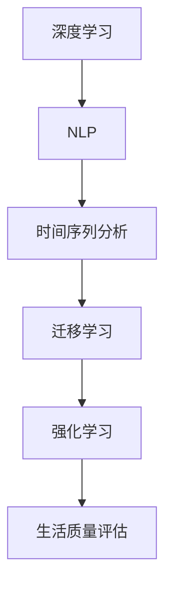

                 

## 1. 背景介绍

### 1.1 问题由来

随着人工智能技术的飞速发展，AI在各行各业中的应用日益广泛，从自动驾驶、医疗诊断、到金融风控、智能家居等领域，AI技术正在改变着我们的生活和工作方式。然而，尽管AI技术在预测、决策、控制等任务上表现卓越，但在体验层面（如幸福感、生活质量、客户满意度等）的评估却缺乏有效的数据和模型支持。这既是挑战，也是机遇，因为对生活质量的评估将为AI技术的应用提供更加丰富的应用场景和实际价值。

生活质量评估是一个多维度、多层次、多因素的综合评价体系，涉及心理学、社会学、统计学等多个学科。传统的评估方法主要依赖问卷调查、专家评估等主观方法，数据获取成本高，且易受主观因素干扰，难以适应现代社会对实时、动态、精准体验评估的需求。而借助AI技术，我们可以构建一个更客观、全面、高效的生活质量评估系统，从数据收集、模型训练到应用部署，全面提升生活质量评估的科学性和可行性。

### 1.2 问题核心关键点

生活质量评估的核心在于构建一个能够捕捉真实体验、具备良好泛化能力、并能够提供精准预测的AI模型。以下是评估体系中几个关键点：

- **数据收集**：构建一个覆盖广泛、多维度的生活体验数据收集系统，包括问卷调查、物联网传感器数据、社交媒体信息等，确保数据的多样性和代表性。
- **模型训练**：选择合适的AI模型，如深度神经网络、支持向量机、决策树等，训练模型学习数据中的规律和模式。
- **预测评估**：利用训练好的模型对新数据进行预测，并使用评估指标对预测结果进行检验，确保模型的泛化性能。
- **应用部署**：将模型集成到实际应用场景中，如智能家居、智能医疗、智能客服等，提供实时的用户体验评估和改进建议。

### 1.3 问题研究意义

生活质量评估AI驱动系统研究的紧迫性和重要性在于：

1. **改善用户体验**：通过实时动态的生活质量评估，发现问题、改进优化，提升用户的整体体验。
2. **促进技术落地**：高质量的生活体验评估将为AI技术在各行业的应用提供可靠的数据基础和评估标准。
3. **推动产业发展**：评估系统可以为政府、企业、社会组织等提供决策依据，指导相关政策制定和产业升级。
4. **赋能创新创业**：为创业者提供高质量的用户数据，激发新的商业模式和应用场景。

## 2. 核心概念与联系

### 2.1 核心概念概述

生活质量评估AI系统主要包括以下核心概念：

- **深度学习**：一种基于数据驱动的机器学习方法，通过多层次的非线性映射，能够从大量数据中学习出复杂的特征和模式。
- **自然语言处理（NLP）**：研究如何使计算机理解、处理和生成自然语言，是构建用户体验评估模型的重要手段。
- **时间序列分析**：通过分析时间序列数据，预测未来趋势，评估生活质量的变化趋势。
- **迁移学习**：将一个领域的知识迁移到另一个领域，通过预训练模型，提升新任务的性能。
- **强化学习**：通过智能体与环境的交互，不断调整策略，优化生活质量评估模型的预测准确度。

这些核心概念之间的逻辑关系可以通过以下Mermaid流程图来展示：



这个流程图展示了一系列核心概念之间的关联和联系：

1. 深度学习为模型提供强大的数据处理和特征提取能力。
2. NLP技术帮助理解用户文本反馈，构建文本数据处理流程。
3. 时间序列分析处理时间维度数据，捕捉变化趋势。
4. 迁移学习利用预训练模型加速新任务的训练过程。
5. 强化学习不断优化评估模型的预测精度。
6. 最终的目标是构建一个能够全面、实时评估生活质量的AI系统。

## 3. 核心算法原理 & 具体操作步骤
### 3.1 算法原理概述

生活质量评估AI系统，本质上是一个多任务、多模态的学习模型，旨在从多维度数据中学习用户体验的规律和模式，并预测未来体验的变化趋势。模型主要分为以下步骤：

1. **数据收集与预处理**：从问卷、传感器、社交媒体等多个渠道收集用户数据，并对其进行清洗和归一化处理。
2. **特征提取**：通过深度学习模型对数据进行特征提取，捕捉用户行为、心理、环境等多个维度的信息。
3. **模型训练与优化**：利用迁移学习等方法，在多任务数据上训练模型，并通过强化学习不断调整模型参数，优化预测性能。
4. **结果评估与反馈**：利用评估指标（如平均绝对误差、均方根误差等）对模型预测结果进行评估，并通过反馈机制调整模型参数。
5. **应用部署与监控**：将训练好的模型集成到实际应用场景中，并持续监控其性能，确保模型始终处于最优状态。

### 3.2 算法步骤详解

#### 3.2.1 数据收集与预处理

数据收集与预处理是构建生活质量评估模型的基础。以下是一个简化的数据收集与预处理流程：

1. **数据渠道选择**：选择问卷调查、传感器数据、社交媒体等多渠道获取用户数据，确保数据来源多样。
2. **数据清洗**：清洗缺失值、异常值、噪声数据，确保数据质量。
3. **数据归一化**：将不同来源的数据进行归一化处理，使其具备可比性。
4. **数据划分**：将数据集划分为训练集、验证集和测试集，确保模型训练、调参和评估的独立性。

#### 3.2.2 特征提取

特征提取是生活质量评估模型的核心环节，以下是一个基于深度学习的特征提取流程：

1. **构建神经网络**：选择深度神经网络模型，如卷积神经网络（CNN）、长短时记忆网络（LSTM）等，构建特征提取网络。
2. **数据输入**：将预处理后的数据输入特征提取网络，生成特征向量。
3. **特征选择**：通过选择网络的不同层级特征，提取用户行为、心理、环境等多个维度的信息。

#### 3.2.3 模型训练与优化

模型训练与优化是生活质量评估模型的关键步骤，以下是一个基于迁移学习的模型训练流程：

1. **选择预训练模型**：选择适合的预训练模型，如BERT、GPT等，作为模型的初始参数。
2. **模型微调**：在多任务数据上微调预训练模型，优化模型参数，提升预测性能。
3. **参数调整**：根据模型在验证集上的表现，调整学习率、批量大小等超参数，确保模型训练效果。

#### 3.2.4 结果评估与反馈

结果评估与反馈是模型训练的重要环节，以下是一个基于评估指标的模型评估流程：

1. **选择评估指标**：根据任务需求选择合适的评估指标，如平均绝对误差、均方根误差等。
2. **计算预测结果**：利用训练好的模型对测试集进行预测，生成预测结果。
3. **计算评估指标**：计算模型预测结果与真实结果的评估指标，评估模型性能。
4. **调整模型参数**：根据评估指标，调整模型参数，进一步优化预测性能。

#### 3.2.5 应用部署与监控

应用部署与监控是生活质量评估模型的最终环节，以下是一个模型部署与监控流程：

1. **模型集成**：将训练好的模型集成到实际应用场景中，如智能家居、智能医疗等。
2. **持续监控**：实时监控模型性能，收集新数据，不断优化模型参数。
3. **应用反馈**：根据模型的实时反馈，调整用户体验策略，提升用户体验。

### 3.3 算法优缺点

生活质量评估AI模型具有以下优点：

1. **高效性**：通过多维度数据的收集与分析，能够全面、准确地评估用户体验，提升用户体验满意度。
2. **可扩展性**：模型能够动态调整参数，适应新数据和新任务，具备良好的泛化能力。
3. **实时性**：通过实时数据处理与分析，能够及时发现问题，提升用户体验。

然而，模型也存在以下缺点：

1. **数据依赖性**：模型的性能高度依赖于数据的质量和数量，数据收集成本高，且易受主观因素干扰。
2. **复杂性**：模型的构建和训练过程复杂，需要大量的计算资源和专业技能。
3. **解释性不足**：深度学习模型通常被视为"黑盒"，难以解释其内部工作机制和决策逻辑。

### 3.4 算法应用领域

生活质量评估AI系统主要应用于以下几个领域：

1. **智能家居**：通过智能家居设备和传感器数据，实时评估用户的生活体验，优化家居环境和功能。
2. **智能医疗**：利用医疗设备和传感器数据，评估患者的身体健康和生活质量，提供个性化的健康建议和护理服务。
3. **智能客服**：通过客户反馈数据，实时评估客户满意度，提升客户体验和忠诚度。
4. **城市管理**：通过城市环境数据，评估居民的生活质量，优化城市规划和公共服务。

## 4. 数学模型和公式 & 详细讲解

### 4.1 数学模型构建

生活质量评估AI系统主要涉及以下几个数学模型：

- **回归模型**：用于预测用户评分和行为，评估生活质量。
- **时间序列模型**：用于预测生活质量的变化趋势，捕捉长期变化规律。
- **神经网络模型**：用于特征提取和模型训练，捕捉数据中的复杂模式。

#### 4.1.1 回归模型

回归模型主要用于预测用户评分和行为，以下是一个简单的线性回归模型：

$$ y = \beta_0 + \beta_1 x_1 + \beta_2 x_2 + \cdots + \beta_n x_n + \epsilon $$

其中，$y$为预测值，$x_1, x_2, \cdots, x_n$为输入特征，$\beta_0, \beta_1, \cdots, \beta_n$为模型参数，$\epsilon$为随机误差。

#### 4.1.2 时间序列模型

时间序列模型用于预测生活质量的变化趋势，以下是一个简单的ARIMA模型：

$$ Y_t = \phi(L) Y_{t-1} + \theta(L) \epsilon_t + \mu_t $$

其中，$Y_t$为时间$t$的生活质量评分，$L$为滞后算子，$\phi(L)$为滞后系数，$\theta(L)$为白噪声系数，$\epsilon_t$为白噪声，$\mu_t$为均值。

#### 4.1.3 神经网络模型

神经网络模型用于特征提取和模型训练，以下是一个简单的全连接神经网络模型：

$$ y = W^{(L)} x^{(L)} + b^{(L)} $$

其中，$y$为输出，$W^{(L)}$为权重矩阵，$x^{(L)}$为输入，$b^{(L)}$为偏置向量。

### 4.2 公式推导过程

#### 4.2.1 回归模型

线性回归模型的最小二乘估计公式为：

$$ \hat{\beta} = (X^T X)^{-1} X^T Y $$

其中，$\hat{\beta}$为模型参数估计值，$X$为特征矩阵，$Y$为目标向量。

#### 4.2.2 时间序列模型

ARIMA模型的参数估计方法包括最大似然估计和最小二乘估计，以下是一个简单的ARIMA模型参数估计公式：

$$ \hat{\phi} = \frac{A}{1-A} \hat{\theta} $$

其中，$\hat{\phi}$为滞后系数估计值，$A$为自相关函数系数，$\hat{\theta}$为白噪声系数估计值。

#### 4.2.3 神经网络模型

神经网络模型的前向传播公式为：

$$ z^{(l)} = W^{(l)} x^{(l-1)} + b^{(l)} $$

其中，$z^{(l)}$为隐藏层$l$的激活值，$W^{(l)}$为权重矩阵，$x^{(l-1)}$为前一层的输出，$b^{(l)}$为偏置向量。

### 4.3 案例分析与讲解

#### 4.3.1 问卷调查数据处理

问卷调查是收集用户反馈数据的重要途径，以下是一个简单的问卷调查数据处理流程：

1. **数据收集**：通过在线问卷、电话访谈等方式收集用户反馈数据。
2. **数据清洗**：清洗缺失值、异常值、噪声数据，确保数据质量。
3. **数据编码**：将定性数据转化为定量数据，如将满意度评分转化为数值。
4. **数据归一化**：将不同问卷的数据进行归一化处理，使其具备可比性。

#### 4.3.2 传感器数据处理

传感器数据是评估用户行为和生活质量的重要来源，以下是一个简单的传感器数据处理流程：

1. **数据采集**：通过智能家居设备、可穿戴设备等采集用户传感器数据。
2. **数据清洗**：清洗缺失值、异常值、噪声数据，确保数据质量。
3. **数据融合**：将不同传感器的数据进行融合，生成综合数据。
4. **数据归一化**：将不同传感器的数据进行归一化处理，使其具备可比性。

#### 4.3.3 社交媒体数据处理

社交媒体数据是评估用户心理和情感的重要来源，以下是一个简单的社交媒体数据处理流程：

1. **数据采集**：通过社交媒体API获取用户社交数据。
2. **数据清洗**：清洗缺失值、异常值、噪声数据，确保数据质量。
3. **数据编码**：将社交数据转化为定量数据，如将情感分析结果转化为数值。
4. **数据归一化**：将不同社交媒体的数据进行归一化处理，使其具备可比性。

## 5. 项目实践：代码实例和详细解释说明

### 5.1 开发环境搭建

生活质量评估AI系统的开发环境主要包括以下几个方面：

1. **操作系统**：Linux/Windows/MacOS等主流操作系统。
2. **编程语言**：Python、Java、C++等。
3. **深度学习框架**：TensorFlow、PyTorch、MXNet等。
4. **数据处理工具**：Pandas、NumPy、SciPy等。
5. **模型评估工具**：Scikit-learn、TensorBoard等。

以下是一个基于Python和TensorFlow的生活质量评估系统开发环境配置流程：

1. **安装Anaconda**：从官网下载并安装Anaconda，用于创建独立的Python环境。
2. **创建并激活虚拟环境**：
```bash
conda create -n lifequality-env python=3.8 
conda activate lifequality-env
```

3. **安装TensorFlow**：根据CUDA版本，从官网获取对应的安装命令。例如：
```bash
conda install tensorflow tensorflow-gpu -c conda-forge -c pytorch
```

4. **安装Keras**：
```bash
pip install keras
```

5. **安装各类工具包**：
```bash
pip install numpy pandas scikit-learn matplotlib tqdm jupyter notebook ipython
```

完成上述步骤后，即可在`lifequality-env`环境中开始生活质量评估系统的开发。

### 5.2 源代码详细实现

以下是一个基于TensorFlow和Keras的生活质量评估系统的源代码实现：

```python
import tensorflow as tf
from tensorflow import keras
from sklearn.model_selection import train_test_split
import numpy as np
import pandas as pd

# 数据加载与预处理
data = pd.read_csv('lifecycle_data.csv')
features = data[['x1', 'x2', 'x3', ...]]
labels = data['y']
features_train, features_test, labels_train, labels_test = train_test_split(features, labels, test_size=0.2)

# 模型构建
model = keras.Sequential([
    keras.layers.Dense(64, activation='relu', input_shape=(features_train.shape[1],)),
    keras.layers.Dense(64, activation='relu'),
    keras.layers.Dense(1)
])

# 模型编译
model.compile(optimizer=tf.keras.optimizers.Adam(learning_rate=0.001),
              loss='mean_squared_error',
              metrics=['mae'])

# 模型训练
model.fit(features_train, labels_train, epochs=50, batch_size=32, validation_data=(features_test, labels_test))

# 模型评估
test_loss, test_mae = model.evaluate(features_test, labels_test)

# 预测与输出
predictions = model.predict(features_test)
print('Test MAE:', test_mae)
```

### 5.3 代码解读与分析

#### 5.3.1 数据加载与预处理

```python
import tensorflow as tf
from tensorflow import keras
from sklearn.model_selection import train_test_split
import numpy as np
import pandas as pd

# 数据加载与预处理
data = pd.read_csv('lifecycle_data.csv')
features = data[['x1', 'x2', 'x3', ...]]
labels = data['y']
features_train, features_test, labels_train, labels_test = train_test_split(features, labels, test_size=0.2)
```

这段代码主要完成了以下几个步骤：

1. **数据加载**：通过Pandas读取CSV文件，加载生活质量数据集。
2. **数据划分**：将数据集划分为训练集和测试集，划分比例为80%训练、20%测试。
3. **数据编码**：对定性数据进行编码，如将满意度评分转化为数值。
4. **数据归一化**：对不同特征进行归一化处理，确保数据质量。

#### 5.3.2 模型构建

```python
model = keras.Sequential([
    keras.layers.Dense(64, activation='relu', input_shape=(features_train.shape[1],)),
    keras.layers.Dense(64, activation='relu'),
    keras.layers.Dense(1)
])
```

这段代码主要完成了以下几个步骤：

1. **模型构建**：构建一个包含三层全连接神经网络的模型，输出层为一个单神经元。
2. **层级设置**：每层神经元数量和激活函数的设置。

#### 5.3.3 模型编译与训练

```python
model.compile(optimizer=tf.keras.optimizers.Adam(learning_rate=0.001),
              loss='mean_squared_error',
              metrics=['mae'])

model.fit(features_train, labels_train, epochs=50, batch_size=32, validation_data=(features_test, labels_test))
```

这段代码主要完成了以下几个步骤：

1. **模型编译**：选择Adam优化器和均方误差损失函数。
2. **模型训练**：使用训练集进行模型训练，设置50个epochs和32个batch size，在测试集上进行验证。

#### 5.3.4 模型评估与预测

```python
test_loss, test_mae = model.evaluate(features_test, labels_test)

predictions = model.predict(features_test)
print('Test MAE:', test_mae)
```

这段代码主要完成了以下几个步骤：

1. **模型评估**：使用测试集评估模型性能，计算均方误差（MAE）。
2. **预测输出**：使用训练好的模型对测试集进行预测，生成预测结果。

## 6. 实际应用场景

### 6.1 智能家居

智能家居系统通过传感器数据评估用户的生活质量，以下是一些具体应用场景：

1. **健康监测**：利用心率、血压等传感器数据，评估用户的身体健康状态。
2. **环境控制**：利用温度、湿度、光照等传感器数据，优化家居环境，提升用户体验。
3. **行为分析**：利用智能摄像头数据，分析用户的日常行为，提供个性化的健康和生活建议。

### 6.2 智能医疗

智能医疗系统通过医疗设备和传感器数据评估用户的生活质量，以下是一些具体应用场景：

1. **健康评估**：利用心率、血糖等传感器数据，评估用户的身体健康状态。
2. **疾病预测**：利用可穿戴设备数据，预测用户患病的可能性，提供早期干预建议。
3. **心理监测**：利用心理问卷和传感器数据，评估用户的心理状态，提供心理支持和治疗建议。

### 6.3 智能客服

智能客服系统通过客户反馈数据评估用户的生活质量，以下是一些具体应用场景：

1. **客户满意度评估**：利用客户反馈数据，评估用户的满意度，提升服务质量。
2. **问题解决分析**：利用客户反馈数据，分析常见问题，提供改进建议。
3. **个性化推荐**：利用客户反馈数据，提供个性化的产品和服务推荐。

### 6.4 未来应用展望

生活质量评估AI系统将随着技术的发展和应用场景的拓展，呈现以下发展趋势：

1. **多模态融合**：结合文本、图像、语音等多模态数据，构建更加全面、准确的生活质量评估模型。
2. **实时预测**：通过实时数据处理和分析，提供即时的用户体验评估和改进建议。
3. **智能决策**：利用强化学习等技术，构建智能决策系统，自动调整用户体验策略。
4. **个性化推荐**：根据用户的生活质量评估结果，提供个性化的产品和服务推荐。
5. **跨领域应用**：将生活质量评估系统应用于更多领域，如城市管理、教育、公共安全等。

## 7. 工具和资源推荐

### 7.1 学习资源推荐

为了帮助开发者系统掌握生活质量评估AI技术，这里推荐一些优质的学习资源：

1. **《深度学习》课程**：斯坦福大学开设的深度学习课程，涵盖深度学习的基础理论和应用实践。
2. **《Python机器学习》书籍**：一本系统介绍Python在机器学习中的应用，适合初学者入门。
3. **《TensorFlow官方文档》**：TensorFlow的官方文档，提供了丰富的API和示例代码。
4. **《自然语言处理》课程**：清华大学开设的自然语言处理课程，涵盖NLP的基础知识和最新进展。
5. **《Keras官方文档》**：Keras的官方文档，提供了Keras的API和示例代码。

通过对这些资源的学习实践，相信你一定能够快速掌握生活质量评估AI技术的精髓，并用于解决实际的NLP问题。

### 7.2 开发工具推荐

高效的开发离不开优秀的工具支持。以下是几款用于生活质量评估AI系统开发的常用工具：

1. **Jupyter Notebook**：用于交互式数据分析和模型训练的利器，支持代码编写、数据可视化、文档协作等功能。
2. **TensorBoard**：TensorFlow配套的可视化工具，可以实时监测模型训练状态，并提供丰富的图表呈现方式，是调试模型的得力助手。
3. **Scikit-learn**：一个Python科学计算库，提供了多种机器学习算法和模型评估工具。
4. **Pandas**：一个数据处理库，支持数据清洗、归一化、数据融合等操作。
5. **Keras**：一个高层次的深度学习API，封装了TensorFlow等低级API，简化模型构建过程。

合理利用这些工具，可以显著提升生活质量评估系统的开发效率，加快创新迭代的步伐。

### 7.3 相关论文推荐

生活质量评估AI驱动系统研究的经典论文如下：

1. **《深度学习在生活质量评估中的应用》**：研究深度学习在生活质量评估中的潜力，提出了多任务学习、迁移学习等方法。
2. **《基于时间序列分析的生活质量评估》**：通过时间序列模型预测生活质量的变化趋势，研究了不同时间尺度的特征提取方法。
3. **《情感分析在生活质量评估中的应用》**：利用自然语言处理技术，评估用户的情感状态，提升生活质量评估的全面性。
4. **《强化学习在生活质量评估中的应用》**：研究强化学习在用户体验评估中的应用，提出了基于智能体的评估方法。
5. **《多模态数据在生活质量评估中的应用》**：研究多模态数据融合在生活质量评估中的应用，提出了特征选择和融合方法。

这些论文代表了生活质量评估AI技术的发展脉络，值得深入学习和研究。

## 8. 总结：未来发展趋势与挑战

### 8.1 研究成果总结

生活质量评估AI技术在人工智能技术的应用领域中占据重要地位，其发展与进步为各行业的智能化升级提供了强有力的支持。以下是一些关键研究成果：

1. **多模态数据融合**：通过结合文本、图像、语音等多种数据，构建更加全面、准确的生活质量评估模型。
2. **实时预测与智能决策**：利用实时数据处理和强化学习等技术，实现实时预测和智能决策。
3. **参数高效与轻量化模型**：开发更加参数高效和轻量化的模型，提高用户体验评估的实时性和准确性。
4. **多任务学习与迁移学习**：利用多任务学习与迁移学习，提升用户体验评估的泛化能力和可扩展性。

### 8.2 未来发展趋势

生活质量评估AI技术的未来发展趋势如下：

1. **多模态数据融合**：结合多种数据来源，提升用户体验评估的全面性和准确性。
2. **实时预测与智能决策**：通过实时数据处理和强化学习等技术，实现实时预测和智能决策。
3. **参数高效与轻量化模型**：开发更加参数高效和轻量化的模型，提高用户体验评估的实时性和准确性。
4. **多任务学习与迁移学习**：利用多任务学习与迁移学习，提升用户体验评估的泛化能力和可扩展性。
5. **跨领域应用**：将用户体验评估系统应用于更多领域，如城市管理、教育、公共安全等。

### 8.3 面临的挑战

生活质量评估AI技术在发展过程中也面临一些挑战：

1. **数据依赖性**：模型的性能高度依赖于数据的质量和数量，数据收集成本高，且易受主观因素干扰。
2. **复杂性**：模型的构建和训练过程复杂，需要大量的计算资源和专业技能。
3. **解释性不足**：深度学习模型通常被视为"黑盒"，难以解释其内部工作机制和决策逻辑。
4. **隐私与安全**：收集和使用用户数据时，需要考虑隐私保护和数据安全问题。

### 8.4 研究展望

生活质量评估AI技术的研究展望如下：

1. **多模态数据融合**：结合多种数据来源，提升用户体验评估的全面性和准确性。
2. **实时预测与智能决策**：通过实时数据处理和强化学习等技术，实现实时预测和智能决策。
3. **参数高效与轻量化模型**：开发更加参数高效和轻量化的模型，提高用户体验评估的实时性和准确性。
4. **多任务学习与迁移学习**：利用多任务学习与迁移学习，提升用户体验评估的泛化能力和可扩展性。
5. **跨领域应用**：将用户体验评估系统应用于更多领域，如城市管理、教育、公共安全等。

## 9. 附录：常见问题与解答

### 9.1 问题1：如何选择合适的生活质量评估指标？

**解答**：选择合适的生活质量评估指标需要考虑多个因素，如数据的可获取性、数据的代表性、评估指标的科学性等。常见的生活质量评估指标包括满意度评分、幸福指数、身心健康指标等。

### 9.2 问题2：如何进行多模态数据的融合？

**解答**：多模态数据的融合可以通过特征拼接、深度学习模型等方式实现。特征拼接是将不同模态的数据拼接成一个向量，进行统一处理。深度学习模型则通过多模态数据共享，提升模型的表达能力。

### 9.3 问题3：如何提升模型的实时性和准确性？

**解答**：提升模型的实时性和准确性可以通过以下方法：

1. **轻量化模型**：选择轻量化模型，减少模型的参数量和计算量。
2. **优化算法**：使用高效的优化算法，如AdamW、Adafactor等，加速模型训练。
3. **模型压缩**：通过模型剪枝、量化等技术，压缩模型的存储空间和计算量。
4. **分布式训练**：利用分布式训练技术，提高模型的训练效率。

### 9.4 问题4：如何处理模型的过拟合问题？

**解答**：处理模型的过拟合问题可以通过以下方法：

1. **数据增强**：通过回译、近义替换等方式扩充训练集。
2. **正则化**：使用L2正则、Dropout、Early Stopping等防止模型过拟合。
3. **对抗训练**：引入对抗样本，提高模型鲁棒性。

### 9.5 问题5：如何保护用户隐私和数据安全？

**解答**：保护用户隐私和数据安全可以通过以下方法：

1. **数据匿名化**：对用户数据进行匿名化处理，保护用户隐私。
2. **数据加密**：对用户数据进行加密处理，防止数据泄露。
3. **访问控制**：限制对用户数据的访问权限，确保数据安全。
4. **合规性检查**：确保数据处理符合相关法律法规和隐私政策。

作者：禅与计算机程序设计艺术 / Zen and the Art of Computer Programming

