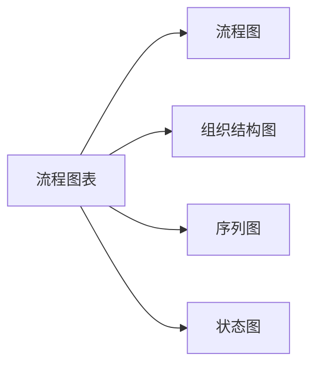
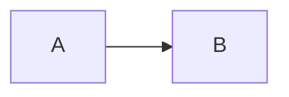
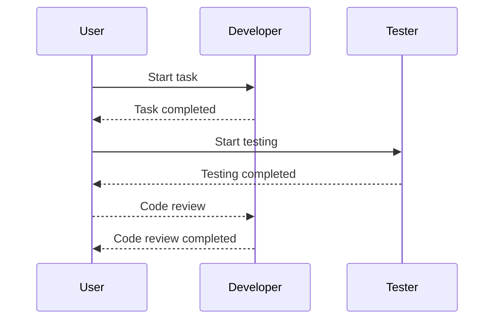

                 

# 使用Mermaid语法创建流程图表

> 关键词：流程图表, 流程图, 概念图, Mermaid语法, 绘图, 数据流程, 系统架构

## 1. 背景介绍

在软件开发、项目管理、系统设计等领域，绘制流程图表是理解复杂系统、协调团队协作的重要手段。随着技术的不断进步，复杂性也随之增加，单靠文字描述难以全面传达信息，因此需要更直观、更易于理解的图形化展示。Mermaid是一种基于文本描述的流程图语法，能够快速创建各种类型的图表，如流程图、组织结构图、序列图、状态图等。

## 2. 核心概念与联系

### 2.1 核心概念概述

为了更好地理解Mermaid语法和流程图表的创建，本节将介绍几个密切相关的核心概念：

- **流程图表(Flow Chart)**：通过图形化的方式展示业务流程、系统架构、数据流程等，直观地传达复杂系统的运作逻辑。
- **流程图(Flow Diagram)**：一种特定的流程图表，用于描述操作步骤、数据流动、控制流程等。
- **组织结构图(Organizational Chart)**：用于展示公司或团队的组织结构、角色职责等。
- **序列图(Sequence Diagram)**：用于展示交互对象间的消息传递顺序和时间关系。
- **状态图(State Diagram)**：用于展示对象的状态转换和状态间的关系。

这些核心概念之间的逻辑关系可以通过以下Mermaid流程图来展示：



这个流程图展示流程图表的各个核心概念及其之间的关系：

1. 流程图表包含流程图、组织结构图、序列图、状态图等多种类型。
2. 流程图用于描述业务流程、系统架构、数据流程等。
3. 组织结构图用于展示公司或团队的组织结构、角色职责等。
4. 序列图用于展示交互对象间的消息传递顺序和时间关系。
5. 状态图用于展示对象的状态转换和状态间的关系。

## 3. 核心算法原理 & 具体操作步骤

### 3.1 算法原理概述

Mermaid语法的核心思想是将流程图、组织结构图、序列图等图形化表示转化为文本描述，再通过解析器将文本描述转化为图形输出。其基本原理如下：

1. **文本描述**：Mermaid使用文本语法描述图表结构和内容，包括节点、边、属性等。
2. **解析器解析**：解析器将文本描述转化为图形化的表示，包含节点、边、标签、箭头等。
3. **图形输出**：最终生成的图形，如流程图、组织结构图、序列图等，通过网页显示或保存为图像文件。

### 3.2 算法步骤详解

Mermaid语法的具体步骤包括：

**Step 1: 编写文本描述**
- 打开Mermaid官方网站或GitHub，选择合适的主题和框架。
- 在文本编辑器中编写Mermaid语法文本，描述图表的结构和内容。

**Step 2: 运行代码生成图表**
- 将文本描述复制或粘贴至Mermaid在线编辑器中，或保存为本地文件。
- 在线编辑器会自动生成图形化的表示。

**Step 3: 保存和分享图表**
- 将生成的图表保存为图像文件，如PNG、SVG等格式。
- 通过邮件、社交媒体、文档嵌入等方式分享图表。

### 3.3 算法优缺点

Mermaid语法的主要优点包括：

1. **简单易用**：使用文本语法描述图表，无需专业的图形设计知识。
2. **灵活多变**：支持多种类型的图表，如流程图、组织结构图、序列图等。
3. **跨平台支持**：支持在线生成和本地保存，灵活应用在不同场景中。

但同时也存在一些局限性：

1. **精度受限**：由于依赖文本描述，可能无法完全准确地展示复杂的系统逻辑。
2. **扩展性有限**：某些高级特性和定制需求可能需要复杂的文本语法，灵活性有限。
3. **依赖于解析器**：依赖于Mermaid解析器的实现，可能存在兼容性问题。

### 3.4 算法应用领域

Mermaid语法在多个领域中得到了广泛的应用，包括但不限于：

- **软件开发**：描述软件系统架构、模块间依赖、数据流等。
- **项目管理**：展示项目任务、流程、团队协作等。
- **系统设计**：展示业务流程、信息流、数据处理等。
- **教育培训**：用于讲解课程内容、概念图、数据结构等。
- **市场营销**：展示产品生命周期、客户路径、营销渠道等。

随着Mermaid语法的不断普及，其应用领域还将进一步拓展，为复杂系统的可视化展示提供更多可能性。

## 4. 数学模型和公式 & 详细讲解 & 举例说明

### 4.1 数学模型构建

Mermaid语法的核心数学模型是文本描述向图形化的转化过程。其基本模型包括：

- **节点(Node)**：表示流程图中的步骤或对象。
- **边(Edge)**：表示节点之间的连接关系，如流程图中的箭头、序列图中的消息传递等。
- **标签(Label)**：表示节点或边的属性，如流程图中的描述、状态图的状态等。

### 4.2 公式推导过程

Mermaid语法的公式推导过程主要涉及文本描述和图形输出的映射。假设输入的文本描述为：

```mermaid
graph LR
    A --> B
    B --> C
    A -> B[描述A]
    B -> C[描述B]
    C -> D[描述C]
```

则其对应的图形化表示如下：

```mermaid
graph LR
    A --> B
    B --> C
    A -> B[描述A]
    B -> C[描述B]
    C -> D[描述C]
```

上述过程展示了Mermaid语法将文本描述转化为图形输出的基本步骤：

1. **解析节点**：将文本描述中的节点名解析为图形中的节点。
2. **解析边**：将文本描述中的边描述解析为图形中的箭头和边属性。
3. **解析标签**：将文本描述中的标签解析为节点或边的属性。

### 4.3 案例分析与讲解

下面以一个简单的流程图为例，展示如何使用Mermaid语法创建流程图表：

```mermaid
graph LR
    Start[开始] --> | 判断 | condition
                  |      | Yes --> End[结束]
                  |      | No --> Process
    Process -->    | 处理 | Operation
```

上述文本描述将生成以下流程图：

```mermaid
graph LR
    Start[开始] --> | 判断 | condition
                  |      | Yes --> End[结束]
                  |      | No --> Process
    Process -->    | 处理 | Operation
```

其中，Start和End表示流程图的开始和结束节点，condition表示判断节点，Operation表示处理节点，它们之间通过箭头相连，箭头上包含节点描述。

## 5. 项目实践：代码实例和详细解释说明

### 5.1 开发环境搭建

为了使用Mermaid语法创建流程图表，首先需要搭建开发环境。以下是一些常用的工具和步骤：

1. **Mermaid Online Editor**：访问Mermaid官网或GitHub，打开在线编辑器，可以直接编写和预览Mermaid代码。
2. **本地安装Mermaid库**：使用npm或yarn安装Mermaid库，然后在HTML文件中引入Mermaid脚本。
3. **本地配置**：在HTML文件中添加图表容器和初始化代码，如`<div id="chart"></div>`和`<script> Mermaid.initialize(); </script>`。

### 5.2 源代码详细实现

接下来，我们以一个简单的流程图为例，展示如何使用Mermaid语法创建图表，并详细解释代码实现。

```html
<div id="chart"></div>
<script src="https://unpkg.com/mermaid/dist/mermaid.min.js"></script>
<script>
    Mermaid.initialize({ startOnLoad: true });
    var chart = document.getElementById('chart');
    var diagram = new Mermaid(chart, {
        theme: 'default', // 主题
        themeVariables: { 'primaryColor': '#007bff' }, // 主题变量
        scaled: true // 缩放
    });
    diagram.render("graph LR\n    A --> B");
</script>
```

在上述代码中，我们首先创建了一个图表容器`<div id="chart"></div>`，然后引入Mermaid库和初始化代码。接着，使用`new Mermaid`创建一个新的图表实例，并传入图表容器和配置选项。最后，调用`render`方法并传入Mermaid语法文本，生成对应的流程图。

### 5.3 代码解读与分析

让我们进一步解读上述代码的关键部分：

**Mermaid初始化**：
- `Mermaid.initialize({ startOnLoad: true });`：初始化Mermaid库，并设置`startOnLoad`为`true`，表示在加载页面时立即渲染图表。

**图表实例创建**：
- `var chart = document.getElementById('chart');`：获取图表容器元素。
- `var diagram = new Mermaid(chart, { ... });`：创建新的图表实例，并传入图表容器和配置选项。

**图表渲染**：
- `diagram.render("graph LR\n    A --> B");`：调用`render`方法，并传入Mermaid语法文本，生成对应的流程图。

上述代码展示了使用Mermaid语法创建流程图表的基本流程：初始化库、创建图表实例、渲染图表。通过这段代码，我们可以在网页上快速创建并展示一个简单的流程图。

### 5.4 运行结果展示

在上述代码运行后，图表容器`<div id="chart"></div>`中会显示生成的流程图。结果如下：



这个流程图展示了从A到B的流程步骤，箭头表示节点之间的连接关系。可以看到，Mermaid语法将文本描述转换为图形化表示，简洁明了地展示了流程图中的关键信息。

## 6. 实际应用场景

### 6.1 软件开发

在软件开发中，Mermaid语法可以用于描述系统架构、模块间依赖、数据流等。例如，可以创建一个系统的UML类图，展示类之间的关系和属性：

```mermaid
classDiagram
    MainClass <|-- subClass1
    MainClass <|-- subClass2
    MainClass <|-- subClass3
    subClass1 --<<o> MyMethod
```

上述代码将生成以下UML类图：

```mermaid
classDiagram
    MainClass <|-- subClass1
    MainClass <|-- subClass2
    MainClass <|-- subClass3
    subClass1 --<<o> MyMethod
```

### 6.2 项目管理

在项目管理中，Mermaid语法可以用于展示项目任务、流程、团队协作等。例如，可以创建一个项目管理的甘特图，展示任务进度和时间安排：



上述代码将生成以下甘特图：


### 6.3 系统设计

在系统设计中，Mermaid语法可以用于展示业务流程、信息流、数据处理等。例如，可以创建一个数据流图，展示数据在不同模块间的流动：

```mermaid
flowchart LR
    start -->| 输入 | process
    process -->| 处理 | output
    output -->| 输出 | end
```

上述代码将生成以下数据流图：

```mermaid
flowchart LR
    start -->| 输入 | process
    process -->| 处理 | output
    output -->| 输出 | end
```

### 6.4 未来应用展望

随着Mermaid语法的不断普及，其在软件开发、项目管理、系统设计等领域的应用将更加广泛。未来，随着技术的发展，Mermaid语法将进一步扩展其功能和应用场景，为复杂系统的可视化展示提供更多可能性。

## 7. 工具和资源推荐

### 7.1 学习资源推荐

为了帮助开发者系统掌握Mermaid语法的理论基础和实践技巧，这里推荐一些优质的学习资源：

1. **Mermaid官网**：提供详细的语法说明和在线编辑器，方便学习者和开发者快速上手。
2. **GitHub Mermaid Examples**：展示大量合法的Mermaid代码示例，方便查找和参考。
3. **Udemy - Introduction to Mermaid**：Udemy上的在线课程，涵盖Mermaid语法的各个方面，适合初学者入门。
4. **YouTube - Mermaid Tutorials**：YouTube上的视频教程，通过直观的视频演示，深入理解Mermaid语法的使用。
5. **在线文档**：如Jenkins, GitLab, GitHub等平台，均有官方的Mermaid文档，提供详细的语法和示例。

通过这些资源的学习实践，相信你一定能够快速掌握Mermaid语法的精髓，并用于解决实际的图表绘制问题。

### 7.2 开发工具推荐

Mermaid语法的应用离不开开发工具的支持。以下是几款常用的开发工具：

1. **Visual Studio Code**：支持Mermaid语法高亮，提供丰富的插件和扩展，适合代码编写和调试。
2. **Atom**：提供Mermaid语法高亮和自动完成功能，适合代码编辑和可视化。
3. **Mermaid Online Editor**：在线编辑器，无需安装和配置，可以直接在浏览器中使用Mermaid语法绘制图表。
4. **GitHub/GitLab**：提供Mermaid语法支持和预览功能，方便代码协作和展示。

合理利用这些工具，可以显著提升Mermaid语法的使用效率，加快图表绘制的进程。

### 7.3 相关论文推荐

Mermaid语法的应用涉及多种类型的图表，其背后的理论基础涵盖算法、图形学、计算机科学等多个领域。以下是几篇奠基性的相关论文，推荐阅读：

1. **Graphviz - A Graph Visualization Toolkit**：Graphviz是一款强大的图形化工具，提供多种图表类型和算法，是Mermaid语法的底层技术支持。
2. **NetworkX - Graph Network and Analysis Library**：NetworkX是一个Python库，提供图形网络分析功能，可以用于生成和可视化图表。
3. **D3.js - Data-Driven Documents**：D3.js是一款JavaScript库，用于创建动态和交互式的图表，适合复杂数据可视化。
4. **Gephi - Open-Source Platform for Visualizing Networks**：Gephi是一款开源的网络分析软件，提供多种图表和布局算法。

这些论文代表了大语言模型微调技术的发展脉络。通过学习这些前沿成果，可以帮助研究者把握学科前进方向，激发更多的创新灵感。

## 8. 总结：未来发展趋势与挑战

### 8.1 总结

本文对Mermaid语法的核心概念和应用进行了全面系统的介绍。首先阐述了Mermaid语法和流程图表的研究背景和意义，明确了其在软件开发、项目管理、系统设计等领域的重要价值。其次，从原理到实践，详细讲解了Mermaid语法的数学模型和具体实现步骤，给出了图表绘制的完整代码实例。同时，本文还探讨了Mermaid语法在多个行业领域的应用前景，展示了其在复杂系统可视化展示中的巨大潜力。最后，精选了Mermaid语法的各类学习资源，力求为读者提供全方位的技术指引。

通过本文的系统梳理，可以看到，Mermaid语法在复杂系统可视化展示方面具有广阔的应用前景。其简单易用、灵活多变、跨平台支持等特点，使其成为当前软件开发和项目管理中的重要工具。未来，伴随技术的不断进步，Mermaid语法的应用领域将进一步拓展，为复杂系统的可视化展示提供更多可能性。

### 8.2 未来发展趋势

展望未来，Mermaid语法将呈现以下几个发展趋势：

1. **功能扩展**：随着用户需求的多样化，Mermaid语法将不断扩展其功能和特性，支持更多的图表类型和高级功能。
2. **社区支持**：随着用户基数的扩大，Mermaid语法的社区将更加活跃，贡献更多的插件和扩展，提升用户体验。
3. **标准化**：随着技术的发展，Mermaid语法将逐步标准化，成为开发和设计中的通用工具。
4. **跨平台协同**：与其他图表工具（如D3.js, Graphviz等）的协同，提供更加丰富的数据可视化解决方案。
5. **云服务支持**：随着云计算的发展，Mermaid语法将提供云服务支持，方便开发者在云端绘制和展示图表。

以上趋势凸显了Mermaid语法在复杂系统可视化展示中的巨大潜力。这些方向的探索发展，必将进一步提升其应用价值，为开发者提供更加便捷、高效、灵活的可视化工具。

### 8.3 面临的挑战

尽管Mermaid语法在可视化展示方面具有诸多优势，但在应用过程中仍面临一些挑战：

1. **精度受限**：由于依赖文本描述，可能无法完全准确地展示复杂的系统逻辑。
2. **扩展性有限**：某些高级特性和定制需求可能需要复杂的文本语法，灵活性有限。
3. **依赖于解析器**：依赖于Mermaid解析器的实现，可能存在兼容性问题。
4. **技术门槛**：新手可能需要一定时间学习和掌握Mermaid语法，存在一定的学习成本。
5. **动态交互**：一些高级图表（如动态图表）需要配合JavaScript实现，增加了复杂性。

这些挑战需要通过不断的技术改进和社区支持，逐步克服，提升Mermaid语法的应用价值。

### 8.4 研究展望

面对Mermaid语法所面临的挑战，未来的研究需要在以下几个方面寻求新的突破：

1. **扩展高级特性**：开发更多高级特性和定制功能，满足复杂系统的可视化需求。
2. **提升解析精度**：提高解析器的精度，减少文本描述与图形表示的误差。
3. **降低技术门槛**：开发易于学习和使用的工具和插件，降低新手的学习成本。
4. **增强动态交互**：开发动态图表库和插件，增强图表的动态交互功能。
5. **社区协同开发**：建立社区协作机制，鼓励开发者贡献插件和扩展，提升生态系统的活力。

这些研究方向将推动Mermaid语法的不断进步，为其在复杂系统可视化展示中的广泛应用提供坚实基础。面向未来，Mermaid语法需要从功能、性能、易用性等多个维度进行全面优化，才能更好地适应技术发展的需求。

## 9. 附录：常见问题与解答

**Q1：如何创建复杂的图表？**

A: 创建复杂的图表需要掌握一些高级特性和技巧，如多级节点、复合节点、自定义属性等。具体方法可以参考Mermaid官网和GitHub上的示例代码，或者在实际项目中逐步积累经验。

**Q2：如何自定义图表样式？**

A: 可以通过配置主题变量来改变图表的样式。例如，在图表实例中设置`themeVariables`属性，即可修改图表的颜色、线条、字体等。详细的样式配置可以参考Mermaid的官方文档。

**Q3：如何绘制时序图表？**

A: 时序图表可以通过时间线（Timeline）、甘特图（Gantt Chart）等形式进行展示。具体方法可以参考Mermaid的官方文档，或者在实际项目中尝试不同的图表类型，找到最适合的表示方式。

**Q4：如何绘制网络图？**

A: 网络图可以通过网络图语法（Graph Diagram）进行展示，如D3.js、Graphviz等。具体方法可以参考Mermaid的官方文档，或者在实际项目中尝试不同的图表类型，找到最适合的表示方式。

通过本文的系统梳理，可以看到，Mermaid语法在复杂系统可视化展示方面具有广阔的应用前景。其简单易用、灵活多变、跨平台支持等特点，使其成为当前软件开发和项目管理中的重要工具。未来，伴随技术的不断进步，Mermaid语法的应用领域将进一步拓展，为复杂系统的可视化展示提供更多可能性。

---

作者：禅与计算机程序设计艺术 / Zen and the Art of Computer Programming

