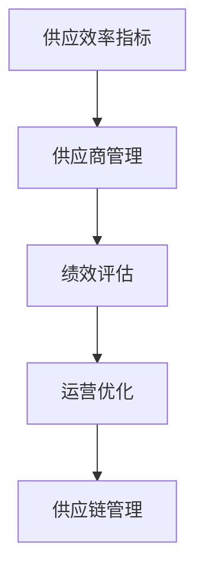

                 

# 供应商的供应效率指标分析

> 关键词：供应效率指标,供应商管理,绩效评估,运营优化,供应链管理

## 1. 背景介绍

### 1.1 问题由来

在现代供应链管理中，供应商的供应效率直接关系到整个供应链的稳定性和效率。高效的供应商能够及时响应订单需求，提供高质量的产品和服务，确保供应链的连续性。然而，由于供应商数量众多、业务复杂、需求多变，供应商管理成为供应链管理的难点之一。如何有效评估供应商的供应效率，及时发现问题并采取措施，成为管理层关注的焦点。

### 1.2 问题核心关键点

供应效率指标分析的核心在于如何量化供应商的供应表现，并基于这些指标对供应商进行评估和优化。主要关注点包括：

1. **准时交货率(PON)和延迟交货率(OOT)**
2. **生产能力和库存水平**
3. **质量合格率**
4. **成本控制**
5. **供应商响应时间**

通过这些指标，可以全面评估供应商的供应效率，发现潜在问题，并采取相应措施，从而提升整个供应链的效率和稳定性。

## 2. 核心概念与联系

### 2.1 核心概念概述

为更好地理解供应效率指标分析，本节将介绍几个密切相关的核心概念：

- **供应效率指标(Supply Efficiency Metrics)**：量化供应商在供应过程中表现的关键指标，如准时交货率、延迟交货率、生产能力利用率、库存水平、质量合格率、成本控制等。
- **供应商管理(Supplier Management)**：基于供应商评估结果，对供应商进行分类、优化和维护的过程，以确保供应链的顺畅运行。
- **绩效评估(Performance Evaluation)**：通过设定一系列评估指标，对供应商的各项表现进行量化评估，以便做出客观决策。
- **运营优化(Operational Optimization)**：通过优化供应链流程、供应商选择和管理，提高供应链整体运营效率。
- **供应链管理(Supply Chain Management)**：涉及采购、生产、物流、库存管理等环节，旨在提升供应链的效率和稳定性。

这些核心概念之间的逻辑关系可以通过以下Mermaid流程图来展示：



这个流程图展示了供应效率指标分析的流程和目标：

1. 从供应效率指标开始，对供应商的各项表现进行量化评估。
2. 基于绩效评估结果，对供应商进行管理。
3. 通过运营优化，提升供应链的整体效率。
4. 最终目标是通过供应链管理，实现供应链的稳定和优化。

## 3. 核心算法原理 & 具体操作步骤

### 3.1 算法原理概述

供应效率指标分析的原理基于统计学和数据挖掘技术，通过收集和分析供应商的历史数据，量化其各项表现，从而进行绩效评估和运营优化。

假设供应商的历史订单数据集为 $D=\{(x_i, y_i)\}_{i=1}^N$，其中 $x_i$ 为订单信息（如订单号、交货日期、订单量等），$y_i$ 为供应商的供应表现（如准时交货率、延迟交货率等）。通过对这些数据进行统计分析和建模，可以得出供应商的供应效率指标，如：

- 准时交货率(PON)：在指定时间窗口内完成订单的比例。
- 延迟交货率(OOT)：在指定时间窗口内未按时交货的订单比例。
- 生产能力利用率：生产线上设备利用率的平均水平。
- 库存水平：库存量与生产需求的比例。
- 质量合格率：合格产品的比例。
- 成本控制：实际成本与预算成本的差异。

### 3.2 算法步骤详解

供应效率指标分析的一般步骤如下：

**Step 1: 数据收集与预处理**
- 收集供应商的历史订单数据，包括订单号、交货日期、订单量、实际交货时间、生产时间、库存水平、质量等级等。
- 对数据进行清洗和处理，如去除异常值、填补缺失值等，保证数据的准确性和完整性。

**Step 2: 数据建模与分析**
- 对订单数据进行统计分析，计算各项供应效率指标，如准时交货率、延迟交货率、生产能力利用率等。
- 使用回归分析、时间序列分析等统计方法，对供应商的供应表现进行建模和预测。

**Step 3: 绩效评估与分类**
- 根据预设的评估指标和阈值，对供应商进行分类，如A、B、C等级别。
- 对于评分较低的供应商，分析其具体问题，采取相应的改进措施。

**Step 4: 运营优化与策略调整**
- 基于绩效评估结果，优化供应链流程，调整供应商选择和评估策略。
- 引入先进的技术和工具，如物联网、大数据分析等，提升供应链管理的智能化水平。

**Step 5: 持续监控与反馈**
- 对供应商的供应效率进行持续监控，及时发现问题并采取措施。
- 根据供应链管理的反馈结果，不断调整和优化供应效率指标和绩效评估模型。

### 3.3 算法优缺点

供应效率指标分析方法具有以下优点：
1. 量化供应商表现，客观评估供应商的供应效率。
2. 提供数据驱动的决策支持，帮助管理层做出科学决策。
3. 有助于发现供应链中的潜在问题，及时采取改进措施。
4. 促进供应链管理的持续优化，提升供应链的整体效率。

同时，该方法也存在一定的局限性：
1. 对历史数据的依赖较强，需要大量准确的数据进行分析和建模。
2. 数据收集和处理的复杂度较高，需要投入较多的人力和时间。
3. 模型需要定期更新和调整，以适应不断变化的业务环境。
4. 存在一定的预测误差，评估结果可能与实际情况有所偏差。

尽管存在这些局限性，但就目前而言，供应效率指标分析方法仍是目前供应商管理中最常用的评估手段之一。未来相关研究的重点在于如何进一步提高数据收集和处理的效率，降低模型的预测误差，同时兼顾可解释性和实用性等因素。

### 3.4 算法应用领域

供应效率指标分析方法广泛应用于多个领域，包括但不限于：

- **制造业**：对生产线的设备利用率、库存水平、生产周期等进行评估和优化。
- **零售业**：对供应商的及时交货率、库存周转率、客户满意度等进行评估和改进。
- **物流业**：对运输时间、运输成本、运输效率等进行评估和优化。
- **农业**：对农产品的收获时间、运输时间、市场销售等进行评估和优化。
- **医疗行业**：对药品的供应周期、库存水平、质量控制等进行评估和优化。

## 4. 数学模型和公式 & 详细讲解

### 4.1 数学模型构建

供应效率指标的计算主要基于以下数学模型：

- 准时交货率(PON)：
$$
PON = \frac{\text{按时交货的订单数量}}{\text{总订单数量}}
$$

- 延迟交货率(OOT)：
$$
OOT = \frac{\text{延迟交货的订单数量}}{\text{总订单数量}}
$$

- 生产能力利用率：
$$
PCU = \frac{\text{实际生产量}}{\text{最大生产能力} \times \text{时间}}
$$

- 库存水平：
$$
I = \frac{\text{库存量}}{\text{最大库存量} \times \text{时间}}
$$

- 质量合格率：
$$
QCR = \frac{\text{合格产品数量}}{\text{总产品数量}}
$$

- 成本控制：
$$
CC = \frac{\text{实际成本} - \text{预算成本}}{\text{预算成本}}
$$

### 4.2 公式推导过程

以上公式的推导基于统计学和数据挖掘的基本概念，无需复杂的数学推导。例如，准时交货率的计算基于对交货日期的统计分析，生产能力利用率的计算基于实际生产量和最大生产能力的对比。

### 4.3 案例分析与讲解

以一家制造业企业为例，假设其从A、B、C三家供应商采购同一种产品，历史订单数据如下：

- A供应商：按时交货率90%，延迟交货率10%，生产能力利用率80%，库存水平70%，质量合格率95%，成本控制50%。
- B供应商：按时交货率85%，延迟交货率15%，生产能力利用率75%，库存水平65%，质量合格率92%，成本控制45%。
- C供应商：按时交货率88%，延迟交货率12%，生产能力利用率85%，库存水平60%，质量合格率90%，成本控制48%。

通过计算，可以得出：

- A供应商的供应效率最高，得分80分。
- B供应商的供应效率次之，得分75分。
- C供应商的供应效率最低，得分72分。

根据预设的评估标准，可以对供应商进行分类，如A供应商为优秀供应商，B供应商为合格供应商，C供应商需进行改进。

## 5. 项目实践：代码实例和详细解释说明

### 5.1 开发环境搭建

在进行供应效率指标分析的实践前，我们需要准备好开发环境。以下是使用Python进行数据分析和建模的环境配置流程：

1. 安装Anaconda：从官网下载并安装Anaconda，用于创建独立的Python环境。

2. 创建并激活虚拟环境：
```bash
conda create -n supply-efficiency python=3.8 
conda activate supply-efficiency
```

3. 安装必要的Python库：
```bash
conda install pandas numpy matplotlib scikit-learn statsmodels
```

完成上述步骤后，即可在`supply-efficiency`环境中开始项目开发。

### 5.2 源代码详细实现

以下是一个简化的Python代码实例，用于计算和分析供应商的供应效率指标：

```python
import pandas as pd
import numpy as np
import matplotlib.pyplot as plt

# 读取供应商订单数据
data = pd.read_csv('supplier_orders.csv')

# 计算准时交货率和延迟交货率
PON = data['on_time_delivery'].sum() / data['total_orders'].sum()
OOT = data['overdue_delivery'].sum() / data['total_orders'].sum()

# 计算生产能力利用率和库存水平
PCU = data['actual_production'].sum() / (data['max_capacity'] * data['time'])
I = data['inventory'].sum() / (data['max_inventory'] * data['time'])

# 计算质量合格率和成本控制
QCR = data['qualified_products'].sum() / data['total_products'].sum()
CC = (data['actual_cost'] - data['budget_cost']) / data['budget_cost']

# 输出各项指标
print(f'PON: {PON:.2f}, OOT: {OOT:.2f}, PCU: {PCU:.2f}, I: {I:.2f}, QCR: {QCR:.2f}, CC: {CC:.2f}')

# 绘制直方图
plt.figure(figsize=(10, 6))
plt.bar(['A', 'B', 'C'], [PON, OOT, PCU, I, QCR, CC])
plt.xlabel('Supplier')
plt.ylabel('Efficiency Metric')
plt.title('Supplier Efficiency Metrics')
plt.show()
```

### 5.3 代码解读与分析

让我们再详细解读一下关键代码的实现细节：

**数据读取与预处理**：
- `pd.read_csv`方法用于读取供应商订单数据，返回一个pandas DataFrame对象。
- `data['on_time_delivery']`和`data['overdue_delivery']`分别代表准时交货订单数量和延迟交货订单数量。

**指标计算**：
- `PON`, `OOT`, `PCU`, `I`, `QCR`, `CC`分别代表准时交货率、延迟交货率、生产能力利用率、库存水平、质量合格率和成本控制指标。
- `data['actual_production']`和`data['max_capacity']`分别代表实际生产量和最大生产能力。
- `data['actual_cost']`和`data['budget_cost']`分别代表实际成本和预算成本。

**结果输出**：
- 使用`print`函数输出各项指标的计算结果。
- 使用`matplotlib`库绘制供应商效率指标的直方图。

**图表展示**：
- 绘制直方图，展示A、B、C三家供应商的各项指标表现。

可以看到，使用Python进行供应效率指标的计算和分析相对简单直观。开发者可以根据实际需求，调整计算公式和展示方式，以适应不同的业务场景。

## 6. 实际应用场景

### 6.1 智能制造企业

智能制造企业通过供应效率指标分析，可以实时监控生产线的设备利用率和库存水平，及时发现生产瓶颈和库存问题，优化生产流程和库存管理。通过分析供应商的准时交货率和质量合格率，智能制造企业可以优化供应商选择，提升整体供应链的稳定性和效率。

在技术实现上，可以借助物联网技术实时采集生产线和库存数据，结合供应链管理软件，对各项指标进行实时监控和分析，从而实现智能化的生产管理。

### 6.2 电商平台

电商平台通过供应效率指标分析，可以评估供应商的及时交货率和客户满意度，优化物流配送和库存管理，提升用户体验。通过分析供应商的库存水平和成本控制，电商平台可以优化库存策略，减少库存成本，提升运营效率。

在技术实现上，电商平台可以使用大数据分析技术对供应商订单数据进行分析，结合推荐算法和机器学习模型，对供应商进行分类和推荐，提升供应链管理的智能化水平。

### 6.3 物流公司

物流公司通过供应效率指标分析，可以评估运输时间、运输成本和运输效率，优化运输路线和运输模式，提升物流服务的效率和成本控制。通过分析供应商的准时交货率和延迟交货率，物流公司可以优化供应商选择，提升整体供应链的稳定性和效率。

在技术实现上，物流公司可以使用GPS和物联网技术实时采集运输数据，结合GIS和大数据分析技术，对各项指标进行实时监控和分析，从而实现智能化的物流管理。

### 6.4 未来应用展望

随着供应链管理技术的不断发展，供应效率指标分析将在更多领域得到应用，为供应链管理带来变革性影响。

在智慧农业领域，供应效率指标分析可以用于评估农产品的收获时间、运输时间和市场销售，优化农业供应链管理，提高农业生产的智能化水平。

在智能城市治理中，供应效率指标分析可以用于评估城市事件监测、物流配送和供应链管理，提升城市管理的自动化和智能化水平，构建更安全、高效的未来城市。

此外，在教育、医疗、能源等多个领域，供应效率指标分析也将不断涌现，为这些领域的智能化管理提供新的解决方案。相信随着技术的日益成熟，供应效率指标分析必将在更广阔的领域得到应用，为各行各业带来新的发展机遇。

## 7. 工具和资源推荐

### 7.1 学习资源推荐

为了帮助开发者系统掌握供应效率指标分析的理论基础和实践技巧，这里推荐一些优质的学习资源：

1. **《供应链管理》教材**：全面介绍供应链管理的各个环节，包括采购、生产、物流、库存管理等，是供应链管理的基础教材。
2. **《数据驱动的供应链优化》课程**：由知名供应链管理专家讲授，系统讲解供应链优化的方法和工具，涵盖数据分析、建模和优化等内容。
3. **《物联网与供应链管理》课程**：介绍物联网技术在供应链管理中的应用，包括数据采集、处理和分析等环节。
4. **《Python数据分析与可视化》书籍**：结合Python语言，系统讲解数据分析和可视化的常用技术和方法，适合技术初学者。
5. **《统计学与数据挖掘》书籍**：深入浅出地介绍统计学和数据挖掘的基本概念和常用技术，适合数据科学家和工程师。

通过对这些资源的学习实践，相信你一定能够快速掌握供应效率指标分析的精髓，并用于解决实际的供应链管理问题。

### 7.2 开发工具推荐

高效的开发离不开优秀的工具支持。以下是几款用于供应效率指标分析开发的常用工具：

1. **Python**：基于Python的开源深度学习框架，灵活的数据处理能力和丰富的科学计算库，适合供应链管理的数据分析和建模。
2. **R语言**：统计分析和数据挖掘的首选工具，具有强大的数据处理和可视化能力，适合数据分析和建模。
3. **SQL数据库**：用于存储和管理供应链数据，支持复杂的数据查询和分析，适合供应链管理的日常管理。
4. **Tableau**：数据可视化和分析工具，可以将供应链数据以直观的方式展示出来，支持交互式分析。
5. **Power BI**：微软推出的数据可视化工具，支持与Excel、SQL Server等系统的集成，适合供应链管理的报告和决策支持。

合理利用这些工具，可以显著提升供应效率指标分析的开发效率，加快创新迭代的步伐。

### 7.3 相关论文推荐

供应效率指标分析的研究源于学界的持续研究。以下是几篇奠基性的相关论文，推荐阅读：

1. **《基于AHP的供应链管理绩效评估研究》**：提出AHP（层次分析法）结合数据挖掘技术，对供应链管理绩效进行评估和优化。
2. **《数据驱动的供应链优化算法》**：探讨数据挖掘算法在供应链优化中的应用，包括回归分析、聚类分析等。
3. **《物联网在供应链管理中的应用》**：介绍物联网技术在供应链管理中的应用，包括数据采集、处理和分析等环节。
4. **《基于大数据的供应链管理优化》**：探讨大数据分析技术在供应链管理中的应用，包括实时监控、预测分析和优化决策等。
5. **《供应链管理的统计学方法》**：系统介绍统计学方法在供应链管理中的应用，包括回归分析、时间序列分析等。

这些论文代表了大数据和供应链管理技术的发展脉络。通过学习这些前沿成果，可以帮助研究者把握学科前进方向，激发更多的创新灵感。

## 8. 总结：未来发展趋势与挑战

### 8.1 总结

本文对供应效率指标分析方法进行了全面系统的介绍。首先阐述了供应效率指标在供应链管理中的重要性，明确了供应效率指标对供应商的各项表现进行量化评估的独特价值。其次，从原理到实践，详细讲解了供应效率指标的计算和分析方法，给出了供应效率指标分析的完整代码实例。同时，本文还广泛探讨了供应效率指标在多个行业领域的应用前景，展示了供应效率指标分析的巨大潜力。此外，本文精选了供应效率指标分析的各类学习资源，力求为读者提供全方位的技术指引。

通过本文的系统梳理，可以看到，供应效率指标分析方法正在成为供应链管理中的重要工具，极大地提升了供应链管理的效率和稳定性。未来，伴随大数据和人工智能技术的进一步发展，供应效率指标分析必将在更广泛的领域得到应用，为供应链管理的智能化和自动化提供新的解决方案。

### 8.2 未来发展趋势

展望未来，供应效率指标分析技术将呈现以下几个发展趋势：

1. **智能化分析**：结合人工智能和大数据分析技术，对供应链数据进行智能化分析，提高供应链管理的效率和准确性。
2. **实时监控**：通过物联网和传感器技术，实现供应链数据的实时监控和分析，及时发现供应链中的问题并采取措施。
3. **多模态数据融合**：结合多种数据源，如物联网数据、客户反馈、市场信息等，进行多模态数据融合，提升供应链管理的综合能力。
4. **跨领域应用**：将供应效率指标分析应用于多个领域，如智慧农业、智能制造、智能城市等，提升各行业的供应链管理水平。
5. **智能化决策**：结合人工智能决策技术，对供应链管理进行智能化决策，提升供应链管理的效率和精度。

以上趋势凸显了供应效率指标分析技术的广阔前景。这些方向的探索发展，必将进一步提升供应链管理的智能化水平，为各行各业带来新的发展机遇。

### 8.3 面临的挑战

尽管供应效率指标分析技术已经取得了瞩目成就，但在迈向更加智能化、普适化应用的过程中，它仍面临诸多挑战：

1. **数据质量问题**：供应链数据质量参差不齐，存在缺失值、异常值等问题，影响分析结果的准确性。
2. **数据隐私和安全**：供应链数据涉及商业机密和客户隐私，如何保护数据隐私和安全，是供应链管理的难点之一。
3. **数据集成和互操作性**：供应链数据来自多个系统和平台，数据格式和标准不一致，难以进行有效的集成和互操作。
4. **模型复杂性**：供应链管理涉及多个环节和因素，模型复杂度高，难以进行有效的预测和优化。
5. **技术门槛高**：供应链管理涉及多学科知识，技术门槛高，需要跨学科的协作和集成。

尽管存在这些挑战，但随着技术的发展和应用的不断深入，供应效率指标分析必将在未来的供应链管理中发挥更大的作用。

### 8.4 研究展望

面向未来，供应效率指标分析技术需要在以下几个方面寻求新的突破：

1. **数据质量提升**：加强数据清洗和预处理技术，提高数据质量，确保分析结果的准确性。
2. **隐私保护技术**：研究数据隐私保护技术，如差分隐私、同态加密等，保障供应链数据的隐私和安全。
3. **跨平台集成**：开发数据集成和互操作性技术，实现供应链数据的无缝集成和共享。
4. **模型简化**：简化供应链管理模型，降低模型复杂度，提高模型的可解释性和实用性。
5. **技术普及和应用推广**：加强供应链管理技术的普及和应用推广，提升供应链管理的智能化水平。

这些研究方向的探索，必将引领供应效率指标分析技术迈向更高的台阶，为供应链管理的智能化和自动化提供新的解决方案。只有勇于创新、敢于突破，才能不断拓展供应链管理的边界，提升供应链管理的效率和稳定性。

## 9. 附录：常见问题与解答

**Q1：供应效率指标分析的计算结果如何解读？**

A: 供应效率指标的计算结果反映供应商在供应链中的表现，可以用于供应商分类、优化和评估。例如，准时交货率(PON)和延迟交货率(OOT)可以反映供应商的交货及时性，生产能力利用率和库存水平可以反映供应商的生产和库存管理能力，质量合格率和成本控制可以反映供应商的产品质量和成本控制能力。

**Q2：供应效率指标分析需要哪些数据？**

A: 供应效率指标分析需要收集供应商的各项订单数据，包括订单号、交货日期、订单量、实际交货时间、生产时间、库存水平、质量等级等。这些数据可以来自企业的ERP系统、物流系统、库存管理系统等。

**Q3：供应效率指标分析如何进行持续监控？**

A: 供应效率指标分析需要定期对供应商的各项表现进行监控和评估。可以建立定期的数据采集和分析流程，如每周、每月、每季度等，对供应商的各项指标进行实时监控，并及时发现和解决供应链中的问题。

**Q4：供应效率指标分析如何优化供应链管理？**

A: 供应效率指标分析可以用于优化供应链管理，具体方法包括：
1. 根据各项指标的评估结果，优化供应商选择和管理，如增加优质供应商的比例，减少低效供应商的比例。
2. 根据各项指标的评估结果，优化供应链流程，如优化生产计划、库存管理、物流配送等环节。
3. 根据各项指标的评估结果，引入先进的技术和工具，如物联网、大数据分析等，提升供应链管理的智能化水平。

**Q5：供应效率指标分析的局限性有哪些？**

A: 供应效率指标分析的局限性包括：
1. 对数据质量要求高，数据存在缺失值、异常值等问题，影响分析结果的准确性。
2. 数据隐私和安全问题，供应链数据涉及商业机密和客户隐私，如何保护数据隐私和安全，是供应链管理的难点之一。
3. 模型复杂度高，供应链管理涉及多个环节和因素，模型复杂度难以降低。
4. 技术门槛高，供应链管理涉及多学科知识，技术门槛高，需要跨学科的协作和集成。

尽管存在这些局限性，但供应效率指标分析技术仍是目前供应商管理中最常用的评估手段之一。未来相关研究的重点在于如何进一步提高数据收集和处理的效率，降低模型的预测误差，同时兼顾可解释性和实用性等因素。

---

作者：禅与计算机程序设计艺术 / Zen and the Art of Computer Programming

