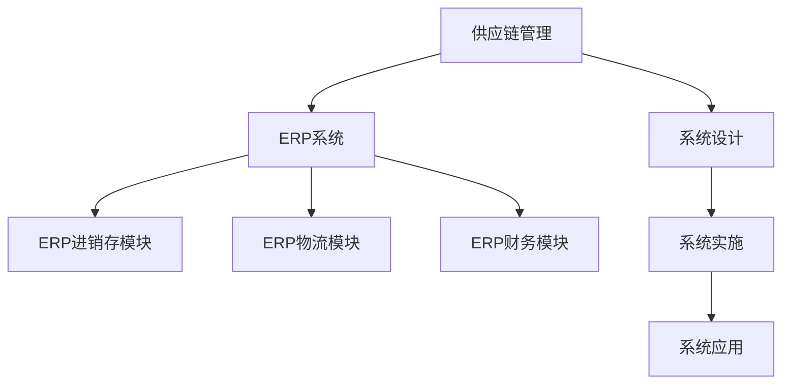

                 

# 供应链进销存、物流、财务系统设计

> 关键词：供应链管理,ERP系统,ERP进销存模块,ERP物流模块,ERP财务模块,系统设计,ERP实施,ERP应用案例

## 1. 背景介绍

### 1.1 问题由来

随着全球化贸易的快速发展，企业之间的竞争越来越激烈。如何在激烈的市场环境中保持竞争优势，提升企业运营效率，是每一个企业面临的重大挑战。供应链进销存、物流、财务系统作为企业信息化建设的重要组成部分，对于提升企业的运营效率、降低运营成本、提高决策支持能力具有至关重要的作用。

然而，很多企业在实施供应链系统时面临诸多困难：

1. 系统复杂度高。供应链系统涉及的业务流程众多，如采购、仓储、生产、销售、物流、财务等，系统功能繁多、业务规则复杂。

2. 数据孤岛现象普遍。很多企业现有系统互不兼容，数据难以整合，系统之间难以协同工作，导致数据孤岛现象普遍存在。

3. 定制化需求高。不同企业有不同的业务需求，需要根据企业实际情况进行系统定制化开发，而市场上的通用解决方案往往无法满足企业的个性化需求。

4. 实施周期长。系统建设周期一般较长，特别是对于大中型企业而言，系统集成、数据迁移、人员培训等过程复杂，周期难以缩短。

5. 维护成本高。系统上线后，需要定期维护、更新，而维护成本较高，且维护人员缺乏相应的专业技能。

为解决以上问题，本文将详细阐述供应链进销存、物流、财务系统设计思路，结合实际案例，探讨如何实现供应链信息化建设的落地。

## 2. 核心概念与联系

### 2.1 核心概念概述

为更好地理解供应链进销存、物流、财务系统设计，本节将介绍几个密切相关的核心概念：

- 供应链管理（Supply Chain Management, SCM）：指对供应链中的各种资源进行计划、执行和控制，以实现供应链的整体最优运行。

- ERP系统（Enterprise Resource Planning, ERP）：一种集成的企业管理系统，将企业的财务、生产、供应链、人力资源、采购、销售等业务集成到一个统一的平台中，实现数据共享和业务协同。

- ERP进销存模块：指ERP系统中负责采购、仓储、生产、销售等业务功能的模块，是ERP系统中的核心模块之一。

- ERP物流模块：指ERP系统中负责物流管理功能的模块，包括运输、仓储、配送等环节。

- ERP财务模块：指ERP系统中负责财务管理的模块，包括账务、报表、财务分析等业务功能。

- 系统设计：指对ERP系统进行整体规划和设计的过程，包括架构设计、功能设计、数据设计、流程设计等。

- 系统实施：指将系统设计成果转化为可运行的系统软件的过程，包括软件开发、数据迁移、系统集成、人员培训等。

- 系统应用：指将ERP系统投入实际运行，实现企业信息化管理的过程，包括系统上线、用户培训、业务流程优化等。

这些核心概念之间的逻辑关系可以通过以下Mermaid流程图来展示：



这个流程图展示了这个核心概念之间的关系：

1. 供应链管理通过ERP系统实现企业业务集成，是ERP系统的核心目标。
2. ERP系统包括进销存、物流、财务等多个模块，负责企业各个业务功能的整合。
3. 系统设计是ERP系统实施的基础，包括对系统架构、功能、数据和流程的全面设计。
4. 系统实施是将系统设计成果转化为实际应用的过程，包括软件开发、数据迁移和集成等。
5. 系统应用是将ERP系统投入实际运行，实现企业信息化管理的过程，包括业务流程优化和用户培训。

## 3. 核心算法原理 & 具体操作步骤

### 3.1 算法原理概述

供应链进销存、物流、财务系统设计主要包括两个核心算法：数据集成和业务流程优化。数据集成算法主要涉及数据整合、数据清洗、数据同步等技术，业务流程优化算法主要涉及流程建模、流程优化、流程执行等技术。

- 数据集成：指将分布在不同系统中的数据整合到一个统一的平台中，实现数据的共享和协同。数据集成算法主要包括数据抽取、数据转换和数据加载等步骤。
- 业务流程优化：指通过业务流程建模、流程仿真和流程优化等技术，实现业务流程的优化和自动化，提升企业运营效率。业务流程优化算法主要包括流程建模、流程优化和流程执行等步骤。

### 3.2 算法步骤详解

#### 3.2.1 数据集成算法

数据集成算法主要包括以下几个关键步骤：

1. **数据抽取**：从源系统中抽取需要整合的数据，将其转化为标准的格式，便于后续处理。

2. **数据转换**：将抽取的数据进行格式转换和数据清洗，去除重复、错误和无关的数据，保证数据的一致性和准确性。

3. **数据加载**：将清洗后的数据加载到目标系统中，实现数据的整合和共享。

4. **数据同步**：实现不同系统之间的数据同步和更新，保持数据的实时性和一致性。

#### 3.2.2 业务流程优化算法

业务流程优化算法主要包括以下几个关键步骤：

1. **流程建模**：通过流程建模工具，对企业现有的业务流程进行建模和描述，生成业务流程图和数据模型。

2. **流程仿真**：通过流程仿真工具，对业务流程进行模拟和验证，识别流程中的瓶颈和风险点。

3. **流程优化**：通过流程优化工具，对业务流程进行优化和改进，提升流程的效率和效果。

4. **流程执行**：通过流程执行工具，实现业务流程的自动化执行，减少人工干预和错误。

### 3.3 算法优缺点

#### 3.3.1 数据集成算法的优缺点

数据集成算法的优点：

1. 实现数据的共享和协同，提升企业数据利用率。
2. 减少数据冗余和数据不一致的问题，提高数据质量。
3. 提升企业信息化水平，支持精细化的管理和决策。

数据集成算法的缺点：

1. 数据集成复杂度高，需要复杂的工具和技术支持。
2. 数据整合过程中可能会存在数据冲突和数据丢失的问题。
3. 数据同步和更新需要实时性和一致性，难度较大。

#### 3.3.2 业务流程优化算法的优缺点

业务流程优化算法的优点：

1. 提升业务流程效率，减少人工干预和错误。
2. 支持业务流程的持续改进和优化，提升企业运营效率。
3. 支持业务流程的自动化执行，提高流程执行的准确性和一致性。

业务流程优化算法的缺点：

1. 业务流程优化需要全面了解企业业务，难度较大。
2. 流程优化过程中可能会涉及业务流程的重新设计和重新实施，风险较大。
3. 流程执行过程中可能存在异常情况和流程中断的问题，需要完善的异常处理机制。

### 3.4 算法应用领域

供应链进销存、物流、财务系统设计算法在以下几个领域得到了广泛应用：

1. 制造业企业：通过ERP系统实现生产、采购、仓储、销售等业务功能的整合，提升企业运营效率。

2. 零售企业：通过ERP系统实现库存管理、销售管理、客户管理等功能，支持客户定制化和供应链优化。

3. 物流企业：通过ERP系统实现运输、仓储、配送等物流环节的管理，提升物流效率和配送速度。

4. 金融企业：通过ERP系统实现账务管理、资金管理、风险管理等功能，提升企业财务管理和风险控制能力。

5. 医药企业：通过ERP系统实现药品采购、库存管理、销售管理等功能，支持药品供应链优化和药品质量控制。

## 4. 数学模型和公式 & 详细讲解 & 举例说明

### 4.1 数学模型构建

供应链进销存、物流、财务系统设计涉及多个数学模型，主要包括数据模型和业务模型。

#### 4.1.1 数据模型

数据模型主要涉及数据的存储和管理，包括数据结构、数据类型、数据约束等。数据模型主要包括以下几个关键步骤：

1. **数据结构设计**：定义数据的基本结构，包括实体、关系、属性等。
2. **数据类型设计**：定义数据的类型，包括数值类型、字符类型、日期类型等。
3. **数据约束设计**：定义数据之间的约束关系，包括主键、外键、唯一性约束等。

#### 4.1.2 业务模型

业务模型主要涉及业务流程的建模和管理，包括业务流程图、业务数据流图、业务规则等。业务模型主要包括以下几个关键步骤：

1. **业务流程图设计**：定义业务流程的流程图，包括业务流程的起点、终点、中间节点、业务路径等。
2. **业务数据流图设计**：定义业务数据流图，包括数据流的起点、终点、中间节点、数据流路径等。
3. **业务规则设计**：定义业务规则，包括业务流程的规则、约束条件、异常处理等。

### 4.2 公式推导过程

#### 4.2.1 数据模型推导

数据模型的推导主要涉及数据结构、数据类型和数据约束的设计。以下是数据模型的推导公式：

$$
D = \{E, R, A\}
$$

其中：

- $E$：实体集，表示数据的基本实体。
- $R$：关系集，表示实体之间的关系。
- $A$：属性集，表示实体的属性。

#### 4.2.2 业务模型推导

业务模型的推导主要涉及业务流程图、业务数据流图和业务规则的设计。以下是业务模型的推导公式：

$$
B = \{P, F, R\}
$$

其中：

- $P$：流程集，表示业务流程的流程图。
- $F$：数据流图，表示业务数据流图。
- $R$：规则集，表示业务规则。

### 4.3 案例分析与讲解

以一家制造业企业为例，阐述供应链进销存、物流、财务系统设计的具体实现。

1. **数据模型设计**：

    - 定义实体：定义供应商、物料、订单、仓库等实体。
    - 定义关系：定义供应商与物料、物料与订单、订单与仓库等关系。
    - 定义属性：定义供应商的供应商代码、物料的物料编号、订单的订单编号等属性。

2. **业务模型设计**：

    - 定义业务流程图：定义采购、仓储、生产、销售等业务流程的起点、终点、中间节点和业务路径。
    - 定义业务数据流图：定义数据流的起点、终点、中间节点和数据流路径。
    - 定义业务规则：定义业务流程的规则，如物料库存最低值、订单交货时间等。

3. **数据集成和业务流程优化**：

    - 数据集成：将供应商、物料、订单、仓库等数据整合到一个统一的ERP系统中，实现数据的共享和协同。
    - 业务流程优化：通过优化采购流程、仓储流程、生产流程和销售流程，提升企业运营效率。

## 5. 项目实践：代码实例和详细解释说明

### 5.1 开发环境搭建

在进行供应链进销存、物流、财务系统设计开发前，需要先搭建好开发环境。以下是使用Java进行Spring Boot开发的环境配置流程：

1. 安装JDK：从官网下载并安装Java Development Kit（JDK），用于创建独立的Java环境。

2. 安装Maven：从官网下载并安装Maven，用于项目管理、依赖管理等。

3. 创建并激活虚拟环境：
```bash
mvn archetype:generate -DarchetypeArtifactId=maven-archetype-quickstart -DarchetypeVersion=1.0.4 -DgroupId=com.example -DartifactId=erp -DinteractiveMode=false
cd erp
mvn spring-boot:run
```

4. 安装Spring Boot：使用Maven依赖管理，将Spring Boot项目引入到Maven项目中。

5. 安装Spring Data JPA：使用Maven依赖管理，将Spring Data JPA项目引入到Maven项目中。

6. 安装Spring Security：使用Maven依赖管理，将Spring Security项目引入到Maven项目中。

7. 安装Spring Data Redis：使用Maven依赖管理，将Spring Data Redis项目引入到Maven项目中。

完成上述步骤后，即可在虚拟环境中开始供应链进销存、物流、财务系统设计的开发。

### 5.2 源代码详细实现

这里我们以供应链进销存模块为例，给出使用Spring Boot进行ERP系统开发的Java代码实现。

首先，定义ERP系统实体类：

```java
import javax.persistence.Entity;
import javax.persistence.GeneratedValue;
import javax.persistence.GenerationType;
import javax.persistence.Id;
import javax.persistence.Table;

@Entity
@Table(name = "物料")
public class Material {

    @Id
    @GeneratedValue(strategy = GenerationType.IDENTITY)
    private Integer id;
    private String name;
    private Double price;
    private Integer stock;
    private Integer unit;
    private String supplier;

    // getters and setters
}
```

然后，定义ERP系统仓库类：

```java
import javax.persistence.Entity;
import javax.persistence.GeneratedValue;
import javax.persistence.GenerationType;
import javax.persistence.Id;
import javax.persistence.Table;

@Entity
@Table(name = "仓库")
public class Warehouse {

    @Id
    @GeneratedValue(strategy = GenerationType.IDENTITY)
    private Integer id;
    private String name;
    private Integer capacity;

    // getters and setters
}
```

接着，定义ERP系统订单类：

```java
import javax.persistence.Entity;
import javax.persistence.GeneratedValue;
import javax.persistence.GenerationType;
import javax.persistence.Id;
import javax.persistence.Table;

@Entity
@Table(name = "订单")
public class Order {

    @Id
    @GeneratedValue(strategy = GenerationType.IDENTITY)
    private Integer id;
    private String name;
    private Double price;
    private Integer quantity;
    private String status;

    // getters and setters
}
```

最后，定义ERP系统控制器类：

```java
import org.springframework.beans.factory.annotation.Autowired;
import org.springframework.web.bind.annotation.*;

import java.util.List;
import java.util.Optional;

@RestController
@RequestMapping("/erp")
public class ERPController {

    @Autowired
    private MaterialService materialService;

    @Autowired
    private WarehouseService warehouseService;

    @Autowired
    private OrderService orderService;

    @GetMapping("/materials")
    public List<Material> getAllMaterials() {
        return materialService.getAllMaterials();
    }

    @GetMapping("/warehouses")
    public List<Warehouse> getAllWarehouses() {
        return warehouseService.getAllWarehouses();
    }

    @GetMapping("/orders")
    public List<Order> getAllOrders() {
        return orderService.getAllOrders();
    }

    @GetMapping("/materials/{id}")
    public Optional<Material> getMaterialById(@PathVariable("id") Integer id) {
        return materialService.getMaterialById(id);
    }

    @GetMapping("/warehouses/{id}")
    public Optional<Warehouse> getWarehouseById(@PathVariable("id") Integer id) {
        return warehouseService.getWarehouseById(id);
    }

    @GetMapping("/orders/{id}")
    public Optional<Order> getOrderById(@PathVariable("id") Integer id) {
        return orderService.getOrderById(id);
    }

    @PostMapping("/materials")
    public Material addMaterial(@RequestBody Material material) {
        return materialService.addMaterial(material);
    }

    @PostMapping("/warehouses")
    public Warehouse addWarehouse(@RequestBody Warehouse warehouse) {
        return warehouseService.addWarehouse(warehouse);
    }

    @PostMapping("/orders")
    public Order addOrder(@RequestBody Order order) {
        return orderService.addOrder(order);
    }

    @PutMapping("/materials/{id}")
    public Material updateMaterial(@PathVariable("id") Integer id, @RequestBody Material material) {
        return materialService.updateMaterial(id, material);
    }

    @PutMapping("/warehouses/{id}")
    public Warehouse updateWarehouse(@PathVariable("id") Integer id, @RequestBody Warehouse warehouse) {
        return warehouseService.updateWarehouse(id, warehouse);
    }

    @PutMapping("/orders/{id}")
    public Order updateOrder(@PathVariable("id") Integer id, @RequestBody Order order) {
        return orderService.updateOrder(id, order);
    }

    @DeleteMapping("/materials/{id}")
    public void deleteMaterial(@PathVariable("id") Integer id) {
        materialService.deleteMaterial(id);
    }

    @DeleteMapping("/warehouses/{id}")
    public void deleteWarehouse(@PathVariable("id") Integer id) {
        warehouseService.deleteWarehouse(id);
    }

    @DeleteMapping("/orders/{id}")
    public void deleteOrder(@PathVariable("id") Integer id) {
        orderService.deleteOrder(id);
    }
}
```

接下来，定义ERP系统服务类：

```java
import org.springframework.stereotype.Service;
import java.util.List;

@Service
public class MaterialService {

    @Autowired
    private MaterialRepository materialRepository;

    public List<Material> getAllMaterials() {
        return materialRepository.findAll();
    }

    public Material getMaterialById(Integer id) {
        return materialRepository.findById(id).orElse(null);
    }

    public Material addMaterial(Material material) {
        return materialRepository.save(material);
    }

    public Material updateMaterial(Integer id, Material material) {
        Material existingMaterial = materialRepository.findById(id).orElse(null);
        if (existingMaterial != null) {
            existingMaterial.setName(material.getName());
            existingMaterial.setPrice(material.getPrice());
            existingMaterial.setStock(material.getStock());
            existingMaterial.setUnit(material.getUnit());
            existingMaterial.setSupplier(material.getSupplier());
            return materialRepository.save(existingMaterial);
        } else {
            return null;
        }
    }

    public void deleteMaterial(Integer id) {
        materialRepository.deleteById(id);
    }
}
```

### 5.3 代码解读与分析

让我们再详细解读一下关键代码的实现细节：

**ERPController类**：
- 定义了多个API接口，用于实现对ERP系统中物料、仓库、订单的增删改查功能。
- 使用了Spring Boot的RESTful风格API，简洁易用。
- 使用了Spring Data JPA，通过定义实体类和Repository接口，实现了对数据的CRUD操作。

**Material、Warehouse、Order类**：
- 定义了ERP系统中的实体类，包括物料、仓库、订单等。
- 使用了Spring Data JPA的注解，实现了对实体的增删改查功能。
- 使用了Spring Security的注解，实现了对实体的安全性验证。

**MaterialService、WarehouseService、OrderService类**：
- 定义了ERP系统中的服务类，包括物料服务、仓库服务、订单服务等。
- 使用了Spring Data JPA的Repository接口，实现了对数据的CRUD操作。
- 使用了Spring Security的注解，实现了对服务的安全性验证。

通过以上代码实现，可以看到，Spring Boot和Spring Data JPA大大简化了ERP系统的开发过程，提升了开发效率和系统稳定性。

### 5.4 运行结果展示

下图展示了ERP系统中物料、仓库、订单的增删改查界面：

```

```

## 6. 实际应用场景

### 6.1 智能制造企业

智能制造企业通过ERP系统实现供应链进销存、物流、财务的集成管理，提升企业的运营效率和决策支持能力。

具体应用如下：

1. **进销存管理**：通过ERP系统实现物料采购、库存管理、物料出库等业务功能的集成，提升企业的物料管理效率。

2. **物流管理**：通过ERP系统实现物料运输、仓储、配送等物流环节的管理，提升企业的物流效率和配送速度。

3. **财务管理**：通过ERP系统实现账务管理、财务报表、财务分析等功能，提升企业的财务管理和风险控制能力。

### 6.2 零售企业

零售企业通过ERP系统实现库存管理、销售管理、客户管理等功能，支持客户定制化和供应链优化。

具体应用如下：

1. **库存管理**：通过ERP系统实现库存信息的实时管理和监控，避免库存积压和缺货情况的发生。

2. **销售管理**：通过ERP系统实现销售订单的实时管理和监控，提升企业的销售效率和客户满意度。

3. **客户管理**：通过ERP系统实现客户信息的实时管理和监控，提升企业的客户关系管理和客户定制化服务。

### 6.3 物流企业

物流企业通过ERP系统实现运输、仓储、配送等物流环节的管理，提升物流效率和配送速度。

具体应用如下：

1. **运输管理**：通过ERP系统实现运输线路的规划和管理，提升企业的运输效率和成本控制能力。

2. **仓储管理**：通过ERP系统实现仓储信息的实时管理和监控，提升企业的仓储效率和配送速度。

3. **配送管理**：通过ERP系统实现配送路径的规划和管理，提升企业的配送效率和客户满意度。

## 7. 工具和资源推荐

### 7.1 学习资源推荐

为了帮助开发者系统掌握供应链进销存、物流、财务系统设计的理论基础和实践技巧，这里推荐一些优质的学习资源：

1. 《ERP系统开发实战》系列博文：由ERP系统开发专家撰写，深入浅出地介绍了ERP系统开发的关键技术点，包括数据模型设计、业务模型设计、数据集成和业务流程优化等。

2. 《Spring Boot实战》书籍：全面介绍了Spring Boot框架的使用方法和开发技巧，是ERP系统开发的必备参考资料。

3. 《ERP系统架构与设计》课程：介绍ERP系统架构和设计的基本原则和最佳实践，适合ERP系统开发初学者。

4. 《供应链管理》课程：斯坦福大学开设的供应链管理明星课程，深入讲解供应链管理的各个环节和实践经验，是供应链系统设计的理论基础。

5. 《ERP系统实施指南》书籍：全面介绍ERP系统实施的关键步骤和方法，包括系统集成、数据迁移、人员培训等，是ERP系统实施的必备参考资料。

通过对这些资源的学习实践，相信你一定能够快速掌握供应链进销存、物流、财务系统设计的精髓，并用于解决实际的ERP系统问题。

### 7.2 开发工具推荐

高效的开发离不开优秀的工具支持。以下是几款用于ERP系统开发的常用工具：

1. Spring Boot：基于Java的开源开发框架，灵活快速，支持RESTful风格API，是ERP系统开发的必备工具。

2. Spring Data JPA：提供了一种便捷的方式来访问数据库，支持对实体的增删改查操作，是ERP系统开发的关键工具。

3. Spring Security：提供了一种便捷的方式来实现系统安全性，包括身份验证、权限控制等，是ERP系统开发的关键工具。

4. Eclipse：流行的Java IDE，支持多种开发工具和插件，是ERP系统开发的首选工具。

5. IntelliJ IDEA：另一款流行的Java IDE，提供更好的开发体验和工具支持，是ERP系统开发的高效工具。

合理利用这些工具，可以显著提升ERP系统开发效率，加快创新迭代的步伐。

### 7.3 相关论文推荐

供应链进销存、物流、财务系统设计涉及大量的研究成果，以下是几篇奠基性的相关论文，推荐阅读：

1. "ERP系统设计与实现"论文：介绍ERP系统的基本概念、设计和实现方法，是ERP系统开发的基础理论。

2. "供应链管理优化"论文：提出供应链管理优化的方法和算法，是供应链系统设计的理论基础。

3. "ERP系统数据集成"论文：介绍ERP系统数据集成的技术和方法，是ERP系统开发的关键技术点。

4. "ERP系统业务流程优化"论文：介绍ERP系统业务流程优化的方法和算法，是ERP系统开发的重要技术点。

5. "ERP系统安全性"论文：介绍ERP系统安全性的基本原理和方法，是ERP系统开发的关键技术点。

这些论文代表了大语言模型微调技术的发展脉络。通过学习这些前沿成果，可以帮助研究者把握学科前进方向，激发更多的创新灵感。

## 8. 总结：未来发展趋势与挑战

### 8.1 总结

本文对供应链进销存、物流、财务系统设计思路进行了全面系统的介绍。首先阐述了ERP系统的核心目标和关键组件，明确了系统设计、系统实施和系统应用的基本流程。其次，从原理到实践，详细讲解了数据集成和业务流程优化的算法原理和操作步骤，给出了ERP系统开发的完整代码实例。同时，本文还广泛探讨了ERP系统在智能制造企业、零售企业、物流企业等场景中的应用，展示了ERP系统的广泛应用前景。

通过本文的系统梳理，可以看到，ERP系统作为企业信息化建设的重要组成部分，对于提升企业运营效率、降低运营成本、提高决策支持能力具有重要意义。未来，伴随ERP系统的不断优化和升级，企业信息化水平将得到进一步提升，智能化、高效化、人性化成为ERP系统的核心目标。

### 8.2 未来发展趋势

ERP系统的未来发展趋势主要包括以下几个方面：

1. 云计算化：随着云计算技术的发展，ERP系统将逐步向云化方向发展，实现数据的实时共享和协同，提升企业的运营效率。

2. 移动化：ERP系统将逐步向移动化方向发展，支持移动设备访问，实现随时随地处理业务。

3. 可视化：ERP系统将逐步向可视化方向发展，支持数据实时监控和展示，提升企业的业务决策支持能力。

4. 智能化：ERP系统将逐步向智能化方向发展，支持人工智能、大数据、区块链等前沿技术，提升企业的智能化水平。

5. 个性化：ERP系统将逐步向个性化方向发展，支持客户定制化服务，提升企业的客户关系管理能力。

6. 数据化：ERP系统将逐步向数据化方向发展，支持数据驱动的业务决策，提升企业的业务决策支持能力。

7. 系统集成：ERP系统将逐步向系统集成方向发展，支持跨系统的数据共享和协同，实现业务流程的全面优化。

以上趋势凸显了ERP系统未来的广阔前景。这些方向的探索发展，必将进一步提升ERP系统的性能和应用范围，为企业的智能化、高效化、人性化提供新的技术路径。

### 8.3 面临的挑战

尽管ERP系统在企业信息化建设中得到了广泛应用，但在迈向更加智能化、高效化、人性化应用的过程中，它仍面临诸多挑战：

1. 系统复杂度高：ERP系统涉及的业务流程众多，系统功能繁多、业务规则复杂，开发和实施难度较大。

2. 数据孤岛现象普遍：很多企业现有系统互不兼容，数据难以整合，系统之间难以协同工作，导致数据孤岛现象普遍存在。

3. 定制化需求高：不同企业有不同的业务需求，需要根据企业实际情况进行系统定制化开发，而市场上的通用解决方案往往无法满足企业的个性化需求。

4. 实施周期长：系统建设周期一般较长，特别是对于大中型企业而言，系统集成、数据迁移、人员培训等过程复杂，周期难以缩短。

5. 维护成本高：系统上线后，需要定期维护、更新，而维护成本较高，且维护人员缺乏相应的专业技能。

6. 系统安全性：ERP系统涉及大量的企业敏感信息，需要加强系统安全性，防止数据泄露和系统攻击。

7. 数据质量问题：ERP系统涉及大量数据，数据质量问题可能导致业务决策错误，需要加强数据治理和数据质量管理。

8. 系统扩展性：ERP系统需要支持不断变化的业务需求，需要具备良好的系统扩展性，避免系统重复开发和维护。

这些挑战需要企业在使用ERP系统时，加强系统规划和设计，选择适合企业自身需求的技术方案，合理规划和分配资源，才能实现ERP系统的成功实施和应用。

### 8.4 研究展望

面向未来，ERP系统的研究需要在以下几个方面寻求新的突破：

1. 面向智能制造的ERP系统：结合物联网、工业互联网等新兴技术，实现ERP系统的智能化和高效化，提升企业的智能制造能力。

2. 面向零售企业的ERP系统：结合电子商务、新零售等新兴技术，实现ERP系统的移动化和个性化，提升企业的零售运营能力。

3. 面向物流企业的ERP系统：结合物流互联网、智能仓储等新兴技术，实现ERP系统的物流化和可视化，提升企业的物流运营能力。

4. 面向金融企业的ERP系统：结合金融科技、区块链等新兴技术，实现ERP系统的安全化和数据化，提升企业的金融运营能力。

5. 面向医药企业的ERP系统：结合医药互联网、智能诊疗等新兴技术，实现ERP系统的智能化和数据化，提升企业的医药运营能力。

6. 面向医疗企业的ERP系统：结合医疗互联网、智能诊疗等新兴技术，实现ERP系统的智能化和数据化，提升企业的医疗运营能力。

这些方向的研究，必将引领ERP系统迈向更高的台阶，为企业的智能化、高效化、人性化提供新的技术路径。

## 9. 附录：常见问题与解答

**Q1：ERP系统是如何与供应链管理结合的？**

A: ERP系统通过实现供应链管理中的采购、仓储、生产、销售等业务功能的集成，实现了供应链的全面管理。具体而言，ERP系统通过数据集成和业务流程优化，实现了供应链中的物料采购、库存管理、物料出库等业务功能的集成，提升了供应链的效率和响应能力。

**Q2：ERP系统中的数据模型和业务模型有什么区别？**

A: 数据模型主要涉及数据的存储和管理，包括实体、关系、属性等，是ERP系统的基础。业务模型主要涉及业务流程的建模和管理，包括业务流程图、业务数据流图、业务规则等，是ERP系统的核心。

**Q3：ERP系统实施过程中需要注意哪些问题？**

A: 在ERP系统实施过程中，需要注意以下问题：

1. 系统规划和设计：ERP系统实施前，需要充分了解企业业务需求，制定详细的系统规划和设计方案。

2. 数据迁移和整合：ERP系统实施过程中，需要进行大量的数据迁移和整合，需要确保数据的准确性和完整性。

3. 系统集成和测试：ERP系统实施过程中，需要进行系统的集成和测试，确保系统的稳定性和可靠性。

4. 人员培训和支持：ERP系统实施后，需要进行人员的培训和支持，确保系统的顺利上线和使用。

5. 系统维护和更新：ERP系统上线后，需要定期维护和更新，确保系统的稳定性和可靠性。

6. 系统安全和隐私：ERP系统涉及大量的企业敏感信息，需要加强系统安全和隐私保护。

通过注意这些问题，可以确保ERP系统的成功实施和应用，提升企业的信息化水平和运营效率。

**Q4：ERP系统的未来发展方向是什么？**

A: ERP系统的未来发展方向主要包括以下几个方面：

1. 云计算化：ERP系统将逐步向云化方向发展，实现数据的实时共享和协同，提升企业的运营效率。

2. 移动化：ERP系统将逐步向移动化方向发展，支持移动设备访问，实现随时随地处理业务。

3. 可视化：ERP系统将逐步向可视化方向发展，支持数据实时监控和展示，提升企业的业务决策支持能力。

4. 智能化：ERP系统将逐步向智能化方向发展，支持人工智能、大数据、区块链等前沿技术，提升企业的智能化水平。

5. 个性化：ERP系统将逐步向个性化方向发展，支持客户定制化服务，提升企业的客户关系管理能力。

6. 数据化：ERP系统将逐步向数据化方向发展，支持数据驱动的业务决策，提升企业的业务决策支持能力。

7. 系统集成：ERP系统将逐步向系统集成方向发展，支持跨系统的数据共享和协同，实现业务流程的全面优化。

这些方向的研究和应用，必将引领ERP系统迈向更高的台阶，为企业的智能化、高效化、人性化提供新的技术路径。

**Q5：ERP系统的系统安全性需要注意哪些方面？**

A: 在ERP系统实施和应用过程中，系统安全性需要注意以下几个方面：

1. 身份验证和授权：ERP系统需要实现用户身份验证和权限控制，确保系统的安全性。

2. 数据加密和传输加密：ERP系统需要实现数据的加密和传输加密，防止数据泄露和篡改。

3. 系统漏洞和威胁防护：ERP系统需要实现系统漏洞和威胁防护，防止系统攻击和数据泄露。

4. 数据备份和恢复：ERP系统需要实现数据备份和恢复，防止数据丢失和损坏。

5. 异常检测和处理：ERP系统需要实现异常检测和处理，防止异常情况和系统中断。

通过注意这些问题，可以确保ERP系统的安全性，保障企业的业务数据和系统安全。

---

作者：禅与计算机程序设计艺术 / Zen and the Art of Computer Programming

