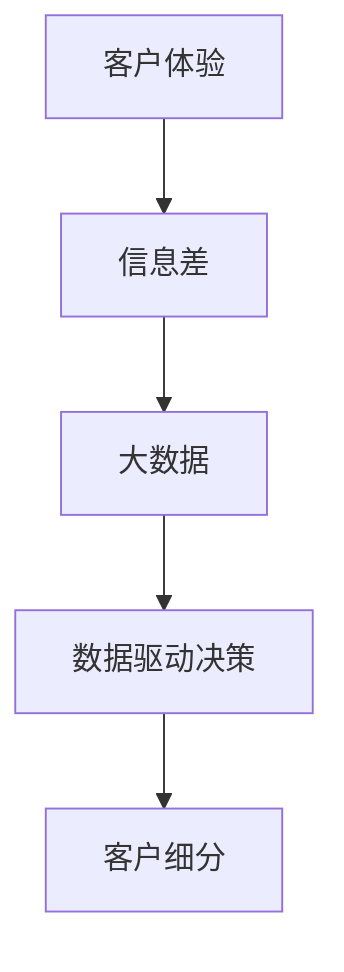

                 

# 信息差的商业客户体验：大数据如何提升客户体验

## 1. 背景介绍

在现代商业环境中，客户体验（Customer Experience, CX）日益成为企业成功的关键因素之一。随着市场竞争的加剧和消费者需求的多样化，企业面临着前所未有的挑战。如何通过有效的数据应用，实现对客户的深刻理解，提升客户体验，已成为企业转型升级的核心议题。本文章旨在深入探讨信息差在大数据客户体验中的应用，提出基于大数据提升客户体验的策略和实践。

### 1.1 问题由来
信息差（Information Gap），即企业与客户之间存在的信息不对称，是制约客户体验的重要因素。传统上，企业往往以单一视角和有限的数据进行客户分析，无法全面捕捉客户需求，导致产品或服务与客户期望存在较大差距，影响客户满意度和忠诚度。

现代互联网和智能技术的广泛应用，尤其是大数据技术的发展，为企业提供了丰富多样的数据资源，使信息差问题有望得到有效解决。通过深入挖掘和分析大数据，企业可以全面了解客户需求、行为和偏好，提供更加个性化的服务和解决方案，从而大幅提升客户体验。

## 2. 核心概念与联系

### 2.1 核心概念概述

为更好地理解大数据在提升客户体验中的应用，本节将介绍几个密切相关的核心概念：

- 客户体验（Customer Experience, CX）：指客户与企业互动过程中的感受、情感和印象，包括产品、服务、品牌、渠道等多个维度。

- 信息差（Information Gap）：指企业与客户之间存在的知识、理解、需求等方面的差距，影响企业对客户需求的准确把握。

- 大数据（Big Data）：指通过现代信息技术采集、存储和分析的大量结构化和非结构化数据，具备体量大、来源广、价值高、处理速度快等特点。

- 数据驱动决策（Data-Driven Decision Making）：指利用数据进行分析、挖掘和预测，辅助管理决策的过程，使决策更加科学、高效和准确。

- 客户细分（Customer Segmentation）：指根据客户的不同特征进行分类，实现更精准的市场定位和个性化服务。

这些概念之间的逻辑关系可以通过以下Mermaid流程图来展示：



这个流程图展示了从客户体验到信息差、大数据、数据驱动决策再到客户细分的逻辑路径，揭示了大数据在解决信息差问题，提升客户体验中的关键作用。

## 3. 核心算法原理 & 具体操作步骤
### 3.1 算法原理概述

基于大数据提升客户体验的核心算法原理，主要包括以下几个方面：

- **数据采集与整合**：通过多种数据源收集客户的各类信息，并进行结构化处理，形成一个全面、统一的数据池。

- **数据清洗与预处理**：对原始数据进行清洗、去重、归一化等预处理，以提高数据质量和分析效率。

- **数据分析与挖掘**：利用数据挖掘、机器学习等算法对数据进行分析和挖掘，识别客户需求、行为模式和趋势。

- **客户细分与画像**：通过聚类、分类等技术对客户进行细分，并构建详细的客户画像，实现个性化的服务和营销策略。

- **预测与优化**：基于历史数据和模型预测客户未来的行为和需求，优化产品设计、服务流程和营销策略，提升客户体验。

### 3.2 算法步骤详解

以下是基于大数据提升客户体验的详细步骤：

**Step 1: 数据采集与整合**
- 定义数据采集策略，明确需要收集哪些数据源，如社交媒体、电商平台、客服记录、传感器数据等。
- 使用ETL（Extract, Transform, Load）工具进行数据抽取、转换和加载，统一存储到一个数据仓库中。

**Step 2: 数据清洗与预处理**
- 对数据进行初步清洗，包括去重、补全缺失值、处理异常值等。
- 使用数据清洗工具如Python的pandas库，对数据进行归一化、标准化、降维等预处理。

**Step 3: 数据分析与挖掘**
- 使用数据挖掘工具如RapidMiner、Python的Scikit-learn库，进行关联规则挖掘、分类、聚类等分析。
- 结合机器学习算法如随机森林、支持向量机、深度学习等，训练客户行为预测模型。

**Step 4: 客户细分与画像**
- 使用聚类算法如K-means、层次聚类等，对客户进行细分。
- 结合主成分分析（PCA）和因子分析（FA），构建详细的客户画像，包括基本信息、行为特征、偏好等。

**Step 5: 预测与优化**
- 使用时间序列分析、回归模型等，预测客户未来行为和需求。
- 结合A/B测试、多臂赌博机等优化技术，动态调整产品、服务和营销策略。

### 3.3 算法优缺点

大数据提升客户体验的算法具有以下优点：
1. 数据全面性高。通过多来源数据采集，获得客户行为和需求的全面信息。
2. 分析深入细致。大数据算法能够深入挖掘客户内在特征和行为模式，提升客户体验的准确性。
3. 决策支持性强。通过精准的客户画像和预测模型，辅助企业制定科学决策。
4. 服务个性化高。基于客户细分和画像，提供高度个性化的服务，满足不同客户需求。

但该方法也存在一定的局限性：
1. 数据隐私问题。客户数据的隐私保护成为数据收集和分析的前提，需要严格遵守数据隐私法规。
2. 数据质量要求高。数据采集和清洗过程中需要大量人工干预，确保数据质量。
3. 算法复杂度高。大数据分析涉及复杂算法和模型，需要较高的技术门槛。
4. 预测精度有限。历史数据只能反映过去，难以完全准确预测未来客户行为。

尽管存在这些局限性，但就目前而言，大数据分析在提升客户体验中的应用已经展现出巨大潜力，成为企业不可或缺的技术手段。未来相关研究的方向在于如何进一步降低数据采集成本，提高数据质量，简化分析模型，提升预测精度。

### 3.4 算法应用领域

大数据提升客户体验的算法在多个领域得到了广泛应用，包括但不限于：

- 零售业：通过客户行为数据预测购买意向，提供个性化推荐和促销活动。
- 金融业：分析客户交易数据，识别风险客户，制定风险管理策略。
- 旅游业：根据客户出行历史和偏好，推荐旅游路线和目的地，提升客户满意度。
- 健康医疗：分析患者健康数据，提供个性化健康建议和治疗方案，提升诊疗效果。
- 智能制造：通过客户反馈数据优化产品设计和生产流程，提升产品质量和客户体验。

除了上述这些经典应用外，大数据分析还在智能客服、客户反馈、市场营销等多个领域发挥着重要作用，为企业提供全方位的客户体验优化支持。

## 4. 数学模型和公式 & 详细讲解 & 举例说明

### 4.1 数学模型构建

本节将使用数学语言对大数据提升客户体验的算法进行更加严格的刻画。

设客户集合为 $C=\{c_1, c_2, ..., c_N\}$，客户特征集合为 $X=\{x_1, x_2, ..., x_m\}$，客户行为集合为 $Y=\{y_1, y_2, ..., y_k\}$。假设收集到的客户数据集为 $D=\{(x_i,y_i)\}_{i=1}^N$。

定义客户行为模型为 $f(x; \theta)$，其中 $\theta$ 为模型参数。目标是最小化客户行为预测误差：

$$
\mathcal{L}(\theta) = \frac{1}{N}\sum_{i=1}^N \ell(f(x_i; \theta), y_i)
$$

其中 $\ell$ 为损失函数，如均方误差、交叉熵等。

### 4.2 公式推导过程

以回归模型为例，推导均方误差损失函数的计算过程：

假设客户特征 $x$ 与行为 $y$ 之间的关系为线性模型：

$$
y = \theta_0 + \theta_1x_1 + \theta_2x_2 + ... + \theta_mx_m
$$

其中 $\theta_0, \theta_1, \theta_2, ..., \theta_m$ 为模型参数。定义均方误差损失函数为：

$$
\ell(y, \hat{y}) = \frac{1}{2}(y - \hat{y})^2
$$

对每个样本 $(x_i, y_i)$，其损失函数为：

$$
\ell(y_i, \hat{y}_i) = \frac{1}{2}(y_i - f(x_i; \theta))^2
$$

将上式对 $\theta$ 求导，得到梯度：

$$
\nabla_{\theta}\mathcal{L}(\theta) = -\frac{1}{N}\sum_{i=1}^N (y_i - f(x_i; \theta))x_i
$$

使用梯度下降等优化算法更新参数 $\theta$，最小化损失函数：

$$
\theta \leftarrow \theta - \eta \nabla_{\theta}\mathcal{L}(\theta)
$$

其中 $\eta$ 为学习率。

### 4.3 案例分析与讲解

以电商平台的个性化推荐为例，探讨如何使用回归模型进行客户行为预测和推荐优化。

假设电商平台收集了用户浏览、购买、评分等行为数据，将其作为客户特征 $x$，用户购买商品作为客户行为 $y$。在微调回归模型后，可以使用预测结果 $f(x; \theta)$ 作为用户行为概率估计，根据此概率推荐相似商品。

具体步骤如下：

1. 数据预处理：将用户行为数据进行标准化、归一化处理。
2. 模型训练：使用随机梯度下降法训练回归模型，最小化均方误差损失。
3. 预测与推荐：根据训练好的模型预测用户购买概率，选择概率高的商品进行推荐。

## 5. 项目实践：代码实例和详细解释说明
### 5.1 开发环境搭建

在进行大数据客户体验优化实践前，我们需要准备好开发环境。以下是使用Python进行机器学习和数据挖掘的开发环境配置流程：

1. 安装Anaconda：从官网下载并安装Anaconda，用于创建独立的Python环境。

2. 创建并激活虚拟环境：
```bash
conda create -n data-sci-env python=3.8 
conda activate data-sci-env
```

3. 安装Python的机器学习库：
```bash
conda install pandas numpy scikit-learn matplotlib seaborn
```

4. 安装RapidMiner或其他数据挖掘工具：
```bash
conda install rapidminer
```

完成上述步骤后，即可在`data-sci-env`环境中开始大数据客户体验优化实践。

### 5.2 源代码详细实现

下面以电商平台个性化推荐为例，给出使用Scikit-learn库对回归模型进行训练和优化的PyTorch代码实现。

首先，准备数据集：

```python
from sklearn.datasets import load_boston
from sklearn.model_selection import train_test_split

boston = load_boston()
X = boston.data
y = boston.target
X_train, X_test, y_train, y_test = train_test_split(X, y, test_size=0.2, random_state=42)
```

然后，定义回归模型：

```python
from sklearn.linear_model import LinearRegression

model = LinearRegression()
model.fit(X_train, y_train)
```

接着，预测并推荐商品：

```python
from sklearn.metrics import mean_squared_error
from sklearn.neighbors import NearestNeighbors

y_pred = model.predict(X_test)
mse = mean_squared_error(y_test, y_pred)
k = 5
knn = NearestNeighbors(n_neighbors=k, algorithm='brute')
knn.fit(X_train, y_train)
indices, distances = knn.kneighbors(X_test)
recommended_items = [X_train[i] for i in indices]
```

最后，评估模型效果：

```python
from sklearn.metrics import mean_absolute_error

mae = mean_absolute_error(y_test, y_pred)
print(f"MAE: {mae:.2f}")
```

以上就是使用Scikit-learn库对回归模型进行训练和优化，并实现个性化推荐的完整代码实现。可以看到，通过简单的线性回归模型，即可在电商平台上进行个性化推荐，提升客户体验。

### 5.3 代码解读与分析

让我们再详细解读一下关键代码的实现细节：

**数据预处理**：
- `load_boston`函数：加载波士顿房价数据集，包含房屋特征和房价两个变量。
- `train_test_split`函数：将数据集划分为训练集和测试集，比例为80:20。

**模型训练**：
- `LinearRegression`类：定义线性回归模型，使用训练集进行训练。
- `fit`方法：对模型进行拟合，最小化均方误差损失。

**预测与推荐**：
- `predict`方法：使用训练好的模型进行预测，得到用户购买概率。
- `NearestNeighbors`类：定义k近邻模型，用于寻找与用户最近的邻居。
- `kneighbors`方法：根据预测结果，找到k个最接近的邻居，推荐相应的商品。

**模型评估**：
- `mean_squared_error`函数：计算预测值与真实值之间的均方误差。
- `mean_absolute_error`函数：计算预测值与真实值之间的平均绝对误差。

可以看到，使用Scikit-learn库，只需少量代码即可实现大数据驱动的个性化推荐系统。

## 6. 实际应用场景
### 6.1 智能客服系统

基于大数据的智能客服系统，能够实时分析和预测客户需求，提供个性化的服务解决方案。通过收集和分析客户与客服人员的对话记录，智能客服系统可以识别常见问题和复杂问题，快速响应客户需求，提升客户满意度和忠诚度。

在技术实现上，可以使用自然语言处理（NLP）技术，对客户问题和客服回复进行文本分析，识别客户情绪和意图。通过大数据分析，了解不同客户群体的常见问题和需求，优化客服流程和服务策略。同时，通过机器学习和深度学习模型，预测客户行为和需求，实现智能派单和主动服务。

### 6.2 金融风险管理

金融行业需要实时监控客户行为，识别潜在的风险和欺诈行为。传统上，金融公司主要依赖人工分析和规则系统，难以应对复杂多变的金融环境。

基于大数据的金融风险管理系统，可以通过客户交易数据、行为数据等，分析客户的风险偏好和行为模式。通过时间序列分析和预测模型，识别异常交易和高风险客户。结合机器学习算法，构建客户信用评分模型，辅助金融决策和风险控制。

### 6.3 旅游推荐系统

旅游推荐系统通过收集用户出行历史、兴趣偏好等数据，推荐个性化的旅游路线和目的地，提升客户旅行体验。大数据分析可以识别用户的行为模式和兴趣点，提供更加精准的旅游推荐。

在技术实现上，可以使用协同过滤算法、内容推荐算法等，对用户数据进行分析，发现用户的兴趣偏好和行为模式。通过大数据分析和模型预测，推荐相似的旅游路线和目的地。同时，结合用户反馈和评价，动态优化推荐模型，提高推荐的准确性和满意度。

### 6.4 未来应用展望

随着大数据技术的持续发展，基于大数据提升客户体验的应用场景将不断扩展，为各行业带来新的变革。

在智慧医疗领域，基于大数据的健康管理系统可以实时监测患者健康数据，提供个性化的健康建议和治疗方案，提升诊疗效果。在智能制造领域，基于大数据的产品设计系统可以优化产品设计，提升产品质量和客户体验。在城市治理领域，基于大数据的交通管理系统可以优化交通流量，提升城市出行效率。

未来，随着技术的进一步突破和应用的不断深化，大数据将为各行各业带来更加全面、高效、智能的客户体验优化解决方案。

## 7. 工具和资源推荐
### 7.1 学习资源推荐

为了帮助开发者系统掌握大数据客户体验的理论基础和实践技巧，这里推荐一些优质的学习资源：

1. 《大数据理论与实践》系列博文：由数据科学专家撰写，深入浅出地介绍了大数据理论基础、技术应用和工程实践。

2. 《机器学习实战》书籍：由机器学习大师撰写，涵盖机器学习基本概念、算法实现和项目案例，是入门机器学习的好书。

3. 《数据挖掘与统计学习》课程：斯坦福大学开设的数据挖掘课程，涵盖数据挖掘基础、算法实现和实际案例，适合系统学习数据挖掘技术。

4. 《Python数据科学手册》书籍：由Python数据科学社区领袖撰写，全面介绍了Python在数据科学中的应用，涵盖数据采集、处理、分析和可视化等各个环节。

5. Kaggle平台：全球领先的数据科学竞赛平台，提供丰富的数据集和算法挑战，帮助开发者积累实战经验，提升技能。

通过对这些资源的学习实践，相信你一定能够快速掌握大数据客户体验的精髓，并用于解决实际的商业问题。

### 7.2 开发工具推荐

高效的开发离不开优秀的工具支持。以下是几款用于大数据客户体验开发常用的工具：

1. Jupyter Notebook：Python数据科学开发利器，支持代码编写、数据可视化和交互式计算，便于开发和分享。

2. PySpark：基于Python的分布式计算框架，支持大数据处理和分析，适用于大规模数据集的处理。

3. RapidMiner：数据挖掘和机器学习平台，提供了强大的数据预处理、建模和分析工具，支持拖拽式操作，易于使用。

4. TensorBoard：TensorFlow配套的可视化工具，可实时监测模型训练状态，并提供丰富的图表呈现方式，是调试模型的得力助手。

5. Hive：基于Hadoop的数据仓库，支持SQL查询和大数据处理，适用于大规模数据集的存储和分析。

合理利用这些工具，可以显著提升大数据客户体验任务的开发效率，加快创新迭代的步伐。

### 7.3 相关论文推荐

大数据客户体验的发展源于学界的持续研究。以下是几篇奠基性的相关论文，推荐阅读：

1. "A Survey on Data Mining for Customer Relationship Management"：综述大数据在客户关系管理中的应用，涵盖客户细分、行为分析、预测建模等多个方面。

2. "Predicting Customer Behavior with Machine Learning"：介绍机器学习在客户行为预测中的应用，包括回归模型、分类模型和聚类算法等。

3. "Customer Experience Management through Data Analytics"：探讨大数据在客户体验管理中的应用，强调数据驱动决策的重要性。

4. "Machine Learning for Customer Experience Optimization"：综述机器学习在客户体验优化中的应用，包括推荐系统、情感分析、智能客服等。

5. "Advances in Customer Experience Management Using Data Analytics"：综述数据挖掘技术在客户体验管理中的应用，涵盖客户细分、情感分析、推荐系统等多个方向。

这些论文代表了大数据客户体验的研究进展，通过学习这些前沿成果，可以帮助研究者把握学科前进方向，激发更多的创新灵感。

## 8. 总结：未来发展趋势与挑战
### 8.1 总结

本文对基于大数据提升客户体验的方法进行了全面系统的介绍。首先阐述了大数据在客户体验中的应用背景和意义，明确了大数据分析在解决信息差问题，提升客户体验中的关键作用。其次，从原理到实践，详细讲解了大数据客户体验的数学模型、算法步骤和实际应用，给出了大数据驱动的个性化推荐系统的代码实现。同时，本文还广泛探讨了大数据客户体验在智能客服、金融风险管理、旅游推荐等多个领域的应用前景，展示了大数据分析的巨大潜力。最后，本文精选了大数据客户体验的学习资源和开发工具，力求为读者提供全方位的技术指引。

通过本文的系统梳理，可以看到，大数据分析在解决信息差问题，提升客户体验中的应用前景广阔，成为企业不可或缺的技术手段。未来，伴随大数据技术的持续演进和应用的不断深化，大数据客户体验必将在各行各业中发挥更大的作用，推动企业转型升级，提升客户满意度。

### 8.2 未来发展趋势

展望未来，大数据客户体验技术将呈现以下几个发展趋势：

1. 数据融合与集成：未来的客户体验分析将更多依赖多源数据的融合与集成，实现更加全面、深入的客户理解。

2. 实时分析和预测：实时数据流处理和大数据技术的发展，将使得客户行为分析和预测变得更加高效和准确。

3. 个性化推荐系统：基于大数据的个性化推荐系统将不断优化，实现更加精准、智能的推荐效果。

4. 客户情感分析：结合自然语言处理技术，对客户情感和反馈进行实时分析，提升客户满意度。

5. 智能客服系统：基于大数据和NLP技术的智能客服系统将不断进化，实现更加智能、高效的客户服务。

6. 数据隐私保护：随着数据量的增加，数据隐私保护将成为大数据客户体验的重要研究方向。

以上趋势凸显了大数据客户体验技术的广阔前景，未来的发展将更加多元化和智能化。

### 8.3 面临的挑战

尽管大数据客户体验技术已经取得了显著进展，但在迈向更加智能化、普适化应用的过程中，仍面临诸多挑战：

1. 数据隐私问题：客户数据的隐私保护成为数据收集和分析的前提，需要严格遵守数据隐私法规。

2. 数据质量要求高：数据采集和清洗过程中需要大量人工干预，确保数据质量。

3. 算法复杂度高：大数据分析涉及复杂算法和模型，需要较高的技术门槛。

4. 预测精度有限：历史数据只能反映过去，难以完全准确预测未来客户行为。

5. 数据融合难度大：多源数据的融合与集成需要克服数据格式、采集时间等诸多差异。

尽管存在这些挑战，但大数据分析在提升客户体验中的应用前景广阔，企业需要在技术、管理、伦理等多个维度进行全面优化，才能充分发挥大数据的价值。

### 8.4 研究展望

面对大数据客户体验技术面临的挑战，未来的研究需要在以下几个方面寻求新的突破：

1. 探索更高效的数据融合方法。通过数据融合技术，解决数据孤岛问题，实现多源数据的整合与利用。

2. 研究更加智能的预测模型。结合深度学习、强化学习等技术，提高预测精度和模型泛化能力。

3. 优化算法和模型复杂度。简化大数据分析的算法和模型，降低技术门槛，提升模型运行效率。

4. 加强数据隐私保护。采用差分隐私、联邦学习等技术，保护客户数据隐私。

5. 开发实时分析工具。结合流计算、大数据技术，实现实时数据处理和分析。

这些研究方向的探索，必将引领大数据客户体验技术迈向更高的台阶，为构建安全、可靠、智能的客户体验系统铺平道路。面向未来，大数据客户体验技术还需要与其他人工智能技术进行更深入的融合，如知识表示、因果推理、强化学习等，多路径协同发力，共同推动客户体验的进步。只有勇于创新、敢于突破，才能不断拓展大数据客户体验的边界，让智能技术更好地造福人类社会。

## 9. 附录：常见问题与解答
**Q1：大数据客户体验分析需要哪些步骤？**

A: 大数据客户体验分析主要包括以下几个步骤：
1. 数据采集：收集客户行为、交易、反馈等各类数据，进行结构化处理。
2. 数据清洗：去除重复、异常和缺失数据，保证数据质量。
3. 数据分析：使用聚类、分类、回归等算法，分析客户行为模式和需求。
4. 客户细分：通过聚类算法，将客户分成不同群体，实现个性化服务。
5. 模型预测：使用回归模型、时间序列模型等，预测客户行为和需求。
6. 效果评估：通过A/B测试、均方误差等指标，评估模型效果和推荐质量。

**Q2：如何提高大数据客户体验分析的准确性？**

A: 提高大数据客户体验分析的准确性，需要从多个方面进行优化：
1. 数据质量：确保数据采集和清洗的准确性，去除噪声和异常数据。
2. 算法选择：选择适合的算法和模型，结合业务需求进行优化。
3. 特征工程：选择合适的特征进行建模，提高模型泛化能力。
4. 数据融合：多源数据的融合与集成，实现全面、深入的客户理解。
5. 实时分析：结合流计算和大数据技术，实现实时数据处理和预测。

**Q3：大数据客户体验分析需要注意哪些数据隐私问题？**

A: 大数据客户体验分析需要严格遵守数据隐私法规，保护客户数据安全。主要需要注意以下方面：
1. 数据匿名化：通过数据脱敏和去标识化，保护客户隐私。
2. 数据访问控制：限制数据访问权限，确保数据安全。
3. 数据共享限制：明确数据共享范围和条件，避免数据滥用。
4. 数据保护技术：采用加密、访问控制等技术，保护数据安全。
5. 隐私合规性：遵守GDPR、CCPA等数据隐私法规，确保合规性。

**Q4：大数据客户体验分析在实际应用中如何部署？**

A: 大数据客户体验分析在实际应用中，需要考虑以下部署策略：
1. 数据仓库：构建企业级数据仓库，统一存储和管理各类数据。
2. 数据平台：使用大数据平台如Hadoop、Spark等，实现高效数据处理和分析。
3. 数据服务：将数据处理和分析结果封装为API服务，便于其他系统调用。
4. 实时分析：采用流计算技术，实现实时数据处理和分析。
5. 安全性：确保数据处理和分析的安全性，防止数据泄露和攻击。

**Q5：大数据客户体验分析在实践中如何评估模型效果？**

A: 大数据客户体验分析在实践中，可以通过以下指标评估模型效果：
1. 准确率：评估模型的预测准确性，如回归模型的均方误差、分类模型的准确率等。
2. 召回率：评估模型对正样本的识别能力，如分类模型的召回率。
3. F1分数：综合考虑准确率和召回率，评估模型的综合性能。
4. A/B测试：通过A/B测试，对比新模型和老模型的效果，确定新模型的提升程度。
5. ROC曲线：通过ROC曲线，评估分类模型的性能和可靠性。

**Q6：大数据客户体验分析在实际应用中有哪些挑战？**

A: 大数据客户体验分析在实际应用中，面临以下挑战：
1. 数据隐私：客户数据的隐私保护成为数据收集和分析的前提，需要严格遵守数据隐私法规。
2. 数据质量：数据采集和清洗过程中需要大量人工干预，确保数据质量。
3. 算法复杂：大数据分析涉及复杂算法和模型，需要较高的技术门槛。
4. 预测精度：历史数据只能反映过去，难以完全准确预测未来客户行为。
5. 数据融合：多源数据的融合与集成需要克服数据格式、采集时间等诸多差异。

尽管存在这些挑战，但大数据客户体验分析的应用前景广阔，企业需要在技术、管理、伦理等多个维度进行全面优化，才能充分发挥大数据的价值。

---

作者：禅与计算机程序设计艺术 / Zen and the Art of Computer Programming

